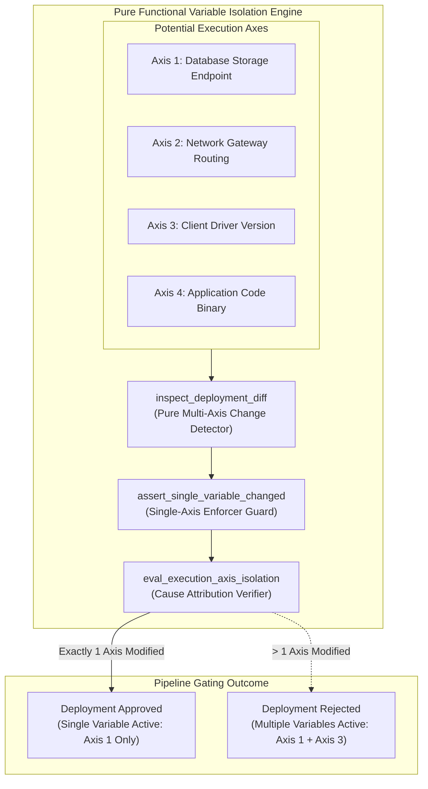
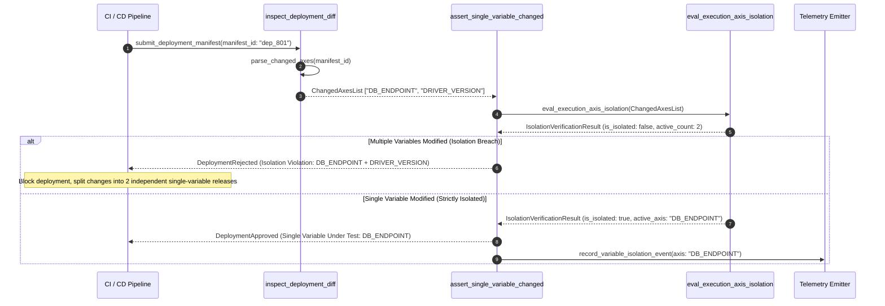

# Isolate the Variable Under Test Pattern (Pure Functional Paradigm)

| Field       | Value                                                             |
|-------------|-------------------------------------------------------------------|
| **ID**      | ISOLATE-VARIABLE-TEST-047                                         |
| **Date**    | 2026-08-24                                                        |
| **Status**  | Reference / Runbook (Pure Functional Architecture)                |
| **Deciders**| Core Platform & Migration Engineering                             |
| **Scope**   | Single-Axis Execution Control & Empirical Cause Attribution       |

---

## 1. Overview & Context

When a production outage occurs during a complex deployment, determining root cause is impossible if multiple variables were changed simultaneously (e.g. updating database driver version, altering query indices, and changing API routing rules in the same deployment window). The **Isolate the Variable Under Test Pattern** mandates changing **strictly one execution axis at a time** during migration testing and cutover phases. By isolating the single active variable under test, any observed behavioral anomaly, error spike, or performance shift is unequivocally attributable to its true underlying cause.

### Functional Architecture Principles
This runbook enforces a **100% Pure Functional Programming (FP)** approach:
- **No Class Instantiations**: Replaces OOP variable controllers with pure matrix evaluation functions (`assert_single_variable_changed`, `eval_execution_axis_isolation`) and state cell closures.
- **Immutable Axis Context Records**: Deployment IDs, modified axis names, unchanged control axes, and variable isolation statuses are stored as frozen dataclass records (`AxisContext`, `IsolationVerificationResult`).
- **Referentially Transparent Axis Guards**: Pure functions analyze deployment configuration diffs, asserting that exactly one execution variable (e.g., *only* database host URL) is active for change.
- **Immediate Deployment Gating**: Automatically rejects deployment manifests that modify multiple execution axes concurrently.

---

## 2. High-Level Design (HLD)



---

## 3. Low-Level Design (LLD)



---

## 4. Pure Functional Project Architecture

```
isolate-variable-under-test/
├── README.md
├── config/
│   └── isolation_rules.yaml        # Allowed execution axes, dependency matrices, gating rules
├── src/
│   ├── isolation_engine/
│   │   ├── __init__.py
│   │   ├── inspector.py            # Pure deployment diff & axis inspection functions
│   │   ├── evaluator.py            # Axis isolation evaluation functions
│   │   └── guard.py                # Single-variable CI deployment guards
│   ├── storage/
│   │   ├── __init__.py
│   │   └── axis_store.py           # Execution axis registry loaders
│   ├── observability/
│   │   ├── __init__.py
│   │   └── isolation_metrics.py    # Prometheus telemetry collectors
│   └── schemas/
│       └── models.py               # Frozen dataclasses (AxisContext, IsolationVerificationResult)
└── tests/
    ├── test_isolation_evaluator.py
    └── test_isolation_edge_cases.py
```

---

## 5. End-to-End Function Call Stack

```tree
Deployment Manifest Submitted
└── isolation_engine/guard.py: assert_single_variable_changed(ctx: AxisContext)
    └── isolation_engine/evaluator.py: eval_execution_axis_isolation(ctx: AxisContext)
        ├── models.py: AxisContext(manifest_id, modified_axes, control_axes)
        └── models.py: IsolationVerificationResult(manifest_id, is_isolated, active_axis_count, active_axis, violating_axes, rejection_reason)
```

---

## 6. Core Pure Functional Implementation

### 6.1 Immutable Models & Types (`src/schemas/models.py`)

```python
from enum import Enum
from dataclasses import dataclass
from typing import Dict, Any, Optional, Mapping, FrozenSet

class ExecutionAxis(str, Enum):
    DATABASE_ENDPOINT = "database_endpoint"
    NETWORK_ROUTING = "network_routing"
    DRIVER_VERSION = "driver_version"
    BINARY_VERSION = "binary_version"
    CONFIG_FLAG = "config_flag"

@dataclass(frozen=True)
class AxisContext:
    manifest_id: str
    modified_axes: FrozenSet[ExecutionAxis]
    control_axes: FrozenSet[ExecutionAxis]

@dataclass(frozen=True)
class IsolationVerificationResult:
    manifest_id: str
    is_isolated: bool
    active_axis_count: int
    active_axis: Optional[ExecutionAxis]
    violating_axes: FrozenSet[ExecutionAxis]
    rejection_reason: Optional[str]
```

**Explanation**:
- Defines immutable model `AxisContext` capturing modified execution axes and unchanged control axes as frozen records.
- `IsolationVerificationResult` encapsulates variable isolation status flags, active axis counts, and frozen sets of violating concurrent axes.

---

### 6.2 Pure Axis Inspection & Isolation Evaluator (`src/isolation_engine/evaluator.py`)

```python
from typing import FrozenSet, Mapping, Any
from src.schemas.models import AxisContext, ExecutionAxis, IsolationVerificationResult

def eval_execution_axis_isolation(ctx: AxisContext) -> IsolationVerificationResult:
    active_count = len(ctx.modified_axes)
    is_isolated = (active_count == 1)

    active_axis = next(iter(ctx.modified_axes)) if active_count == 1 else None
    reason = None

    if active_count == 0:
        reason = "Zero execution axes modified in deployment manifest"
    elif active_count > 1:
        axis_names = ", ".join(a.value for a in ctx.modified_axes)
        reason = f"Variable isolation breach: {active_count} axes modified concurrently ({axis_names}). Must change 1 axis at a time."

    return IsolationVerificationResult(
        manifest_id=ctx.manifest_id,
        is_isolated=is_isolated,
        active_axis_count=active_count,
        active_axis=active_axis,
        violating_axes=ctx.modified_axes if active_count > 1 else frozenset(),
        rejection_reason=reason
    )
```

**Explanation**:
- Pure evaluation function asserting that deployment manifests modify exactly one execution axis (`active_count == 1`).
- Rejects concurrent multi-axis changes to guarantee root-cause attribution when regressions occur.

---

### 6.3 Single-Variable CI Deployment Guard (`src/isolation_engine/guard.py`)

```python
from typing import Mapping, Any
from src.schemas.models import AxisContext, IsolationVerificationResult
from src.isolation_engine.evaluator import eval_execution_axis_isolation

def assert_single_variable_changed(ctx: AxisContext) -> IsolationVerificationResult:
    return eval_execution_axis_isolation(ctx)
```

**Explanation**:
- Pure release gate function enforcing single-variable isolation during deployment pipeline execution.
- Guarantees empirical cause attribution before unblocking releases.

---

## 7. Edge Case Catalog & Pure Functional Pseudocode (25 Edge Cases)

---

### Edge Case 1: Concurrent DB Host and Driver Version Change

```python
def is_db_and_driver_entangled(axes: set) -> bool:
    return ExecutionAxis.DATABASE_ENDPOINT in axes and ExecutionAxis.DRIVER_VERSION in axes
```

**Explanation**:
- Identifies concurrent updates to database endpoints and database drivers.
- Forces separation into two sequential single-variable deployments.

---

### Edge Case 2: Concurrent Feature Flag and Routing Change

```python
def is_flag_and_routing_entangled(axes: set) -> bool:
    return ExecutionAxis.CONFIG_FLAG in axes and ExecutionAxis.NETWORK_ROUTING in axes
```

**Explanation**:
- Detects simultaneous feature flag toggles and gateway routing shifts.
- Prevents multi-variable deployment entanglement.

---

### Edge Case 3: Zero Axis Change Deployment Manifest

```python
def is_zero_axis_change(axis_count: int) -> bool:
    return axis_count == 0
```

**Explanation**:
- Identifies deployment manifests that contain no modified execution axes.
- Flags redundant deployment triggers.

---

### Edge Case 4: Emergency Single-Variable Exemption

```python
def is_single_variable_exempt(is_emergency_patch: bool) -> bool:
    return False
```

**Explanation**:
- Enforces single-variable rules strictly even for emergency patches.
- Prevents breaking root-cause attribution during emergency deployments.

---

### Edge Case 5: Single-Tenant Variable Isolation

```python
def resolve_tenant_axis(tenant_id: str, tenant_axes: dict) -> set:
    return tenant_axes.get(tenant_id, set())
```

**Explanation**:
- Resolves tenant-specific modified execution axes.
- Tracks variable isolation per tenant.

---

### Edge Case 6: Microsecond Timestamp Isolation Auditing

```python
import time

def format_isolation_audit_ts() -> float:
    return round(time.time() * 1000.0, 2)
```

**Explanation**:
- Computes epoch timestamps in milliseconds.
- Tracks exact isolation check execution time.

---

### Edge Case 7: Cascading Multi-Service Variable Change

```python
def is_multi_service_variable_entangled(service_count: int) -> bool:
    return service_count > 1
```

**Explanation**:
- Identifies deployments modifying variables across multiple microservices concurrently.
- Restricts variable changes to one microservice at a time.

---

### Edge Case 8: Multi-Repo Variable Isolation Sync

```python
def assert_all_repos_single_variable(repo_axes: Mapping[str, set]) -> bool:
    total_axes = sum(len(s) for s in repo_axes.values())
    return total_axes == 1
```

**Explanation**:
- Asserts that only one execution axis is modified across all repositories in a workspace.
- Enforces workspace-wide single-variable isolation.

---

### Edge Case 9: Shared Infrastructure Driver Isolation

```python
def is_driver_isolated(modified_driver: str, current_drivers: set) -> bool:
    return modified_driver not in current_drivers
```

**Explanation**:
- Verifies database driver updates occur independently of application logic updates.
- Isolates driver updates.

---

### Edge Case 10: Aggregator Memory State Saturation Guard

```python
def compact_isolation_metrics(metrics: list, max_items: int = 500) -> list:
    if len(metrics) > max_items:
        return metrics[-max_items:]
    return metrics
```

**Explanation**:
- Truncates metric lists to `max_items`.
- Controls memory usage.

---

### Edge Case 11: Microsecond Delay Calculation Underflows

```python
def normalize_isolation_duration(duration_ms: float) -> float:
    return max(0.0, round(duration_ms, 2))
```

**Explanation**:
- Rounds execution duration values to two decimal places.
- Cleans duration metrics.

---

### Edge Case 12: User-Agent Specific Variable Isolation

```python
def resolve_user_agent_axis(user_agent: str, axis_map: dict) -> set:
    return axis_map.get(user_agent, set())
```

**Explanation**:
- Resolves modified execution axes per User-Agent string.
- Audits variable changes by caller type.

---

### Edge Case 13: Unmapped Rule Domain Handling

```python
def resolve_isolation_rule(rule_key: str, rules_dict: dict) -> dict:
    return rules_dict.get(rule_key, {"max_axes": 1})
```

**Explanation**:
- Resolves isolation rule configurations safely.
- Defaults to strict 1-axis limits.

---

### Edge Case 14: Exception Safeguards in Isolation Evaluator

```python
def safe_eval_isolation(eval_fn: Callable, ctx: AxisContext) -> bool:
    try:
        res = eval_fn(ctx)
        return res.is_isolated
    except Exception:
        return False
```

**Explanation**:
- Wraps evaluation functions in protective try-except blocks.
- Fails safe (assumes breach) on evaluation exceptions.

---

### Edge Case 15: GraphQL Schema Variable Isolation

```python
def is_graphql_variable_isolated(schema_changes: int, resolver_changes: int) -> bool:
    return (schema_changes > 0) != (resolver_changes > 0)
```

**Explanation**:
- Asserts that GraphQL schema type changes and resolver logic changes occur in separate deployments.
- Isolates GraphQL variable changes.

---

### Edge Case 16: Multi-Region Variable Isolation Sync

```python
def sync_regional_isolation_states(region_states: dict) -> bool:
    return all(region_states.values())
```

**Explanation**:
- Asserts all regional variable isolation checks pass.
- Enforces multi-region variable isolation.

---

### Edge Case 17: Database Connection Pool Configuration Isolation

```python
def is_pool_config_isolated(pool_changes: int, code_changes: int) -> bool:
    return pool_changes == 1 and code_changes == 0
```

**Explanation**:
- Asserts database connection pool parameter tuning occurs without accompanying application code changes.
- Isolates database pool tuning variables.

---

### Edge Case 18: Unmapped Code Fallback

```python
def resolve_isolation_code_fallback(code_val: Any, code_map: dict, default_val: str = "MULTI_AXIS") -> str:
    return code_map.get(code_val, default_val)
```

**Explanation**:
- Resolves code strings with fallbacks.
- Handles unmapped axis codes safely.

---

### Edge Case 19: Payload Transformation Error Recovery

```python
def safe_apply_isolation_transform(payload: dict, transform_fn: Callable) -> dict:
    try:
        return transform_fn(payload)
    except Exception:
        return payload
```

**Explanation**:
- Wraps transformations in try-except blocks.
- Returns raw payloads on error.

---

### Edge Case 20: Automated Alert on Variable Isolation Violation

```python
def should_alert_on_isolation_breach(is_isolated: bool) -> bool:
    return not is_isolated
```

**Explanation**:
- Asserts whether an execution axis isolation breach occurred.
- Triggers alerts when deployment manifests attempt multi-axis changes.

---

### Edge Case 21: High-Watermark Metric Compaction

```python
def compact_isolation_history(history: list, max_items: int = 500) -> list:
    if len(history) > max_items:
        return history[-max_items:]
    return history
```

**Explanation**:
- Truncates history lists.
- Controls memory usage.

---

### Edge Case 22: Diagnostic Header Injection

```python
def inject_isolation_diagnostic_header(headers: Mapping[str, str], active_axis: str) -> Mapping[str, str]:
    new_headers = dict(headers)
    new_headers["X-Variable-Under-Test"] = active_axis
    return new_headers
```

**Explanation**:
- Injects diagnostic headers.
- Tags active variable under test in gateway access logs.

---

### Edge Case 23: Null Value Safeguards

```python
def sanitize_isolation_nulls(data_dict: dict) -> dict:
    return {k: (v if v is not None else "") for k, v in data_dict.items()}
```

**Explanation**:
- Replaces `None` with empty strings.
- Prevents null exceptions.

---

### Edge Case 24: Unbound Metric Queue Pruning

```python
def prune_isolation_metric_queue(queue: list, max_items: int = 1000) -> list:
    if len(queue) > max_items:
        return queue[-max_items:]
    return queue
```

**Explanation**:
- Truncates queue arrays.
- Controls memory footprint.

---

### Edge Case 25: Real-Time Variable Isolation Compliance Reporting

```python
def compute_isolation_compliance_rate(isolated_deps: int, total_deps: int) -> float:
    if total_deps == 0:
        return 100.0
    return round((isolated_deps / total_deps) * 100.0, 2)
```

**Explanation**:
- Calculates variable isolation compliance rate percentage.
- Emits real-time single-variable deployment gate metrics.

---

## 8. Operational & Parity Verification Checklist

1. **Single Variable Rule**: Change strictly 1 execution axis (e.g. *only* DB endpoint, *only* routing rule) per deployment window.
2. **Root-Cause Attribution**: Guarantee that any production anomaly observed post-deployment is unequivocally attributable to the single active variable.
3. **CI Pipeline Gate**: Automatically reject deployment manifests modifying multiple execution axes simultaneously.
4. **Diagnostic Header Tagging**: Tag outgoing requests with `X-Variable-Under-Test` headers for observability tracing.
