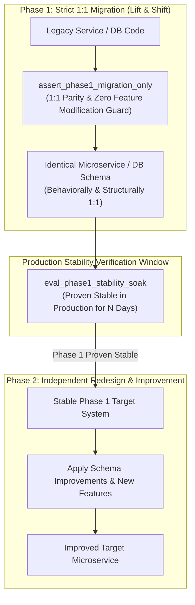
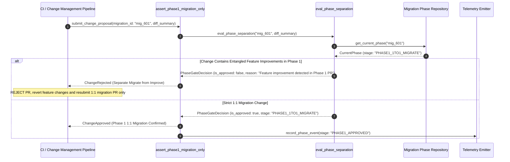

# Separate "Migrate" from "Improve" Pattern (Pure Functional Paradigm)

| Field       | Value                                                             |
|-------------|-------------------------------------------------------------------|
| **ID**      | SEPARATE-MIGRATE-IMPROVE-044                                      |
| **Date**    | 2026-08-24                                                        |
| **Status**  | Reference / Runbook (Pure Functional Architecture)                |
| **Deciders**| Core Platform & Migration Engineering                             |
| **Scope**   | Phase Separation & Variable Isolation during System Migrations     |

---

## 1. Overview & Context

Combining system migration with feature improvements or schema redesigns is a major cause of migration failures. Entangling structural changes (e.g. moving a database or service) with semantic changes (e.g. adding new fields, altering business logic, refactoring data models) makes root-cause analysis impossible when production regressions occur. The **Separate "Migrate" from "Improve" Pattern** mandates a strict **two-phase sequential process**: Phase 1 performs a strict 1:1 lift-and-shift migration preserving exact existing behavior; Phase 2 performs redesigns and feature enhancements independently **only after Phase 1 is fully cut over and proven stable in production**.

### Functional Architecture Principles
This runbook enforces a **100% Pure Functional Programming (FP)** approach:
- **No Class Instantiations**: Replaces OOP phase controllers with pure phase isolation functions (`assert_phase1_migration_only`, `eval_phase_separation`) and state cell closures.
- **Immutable Phase Context Records**: Migration IDs, active phase stages (`PHASE1_1TO1_MIGRATE`, `PHASE2_REDESIGN_IMPROVE`), change types, and approval flags are captured as frozen dataclass records (`MigrationPhaseContext`, `PhaseGateDecision`).
- **Referentially Transparent Variable Isolators**: Pure functions assert that Phase 1 code contains zero non-migration feature changes or schema refactorings.
- **Root-Cause Attribution Assurance**: Isolates execution variables so that any production failure in Phase 1 is attributable solely to infrastructure/cutover mechanics rather than logic alterations.

---

## 2. High-Level Design (HLD)



---

## 3. Low-Level Design (LLD)



---

## 4. Pure Functional Project Architecture

```
separate-migrate-from-improve/
├── README.md
├── config/
│   └── phase_rules.yaml            # Phase definitions, forbidden keywords, soak windows
├── src/
│   ├── phase_engine/
│   │   ├── __init__.py
│   │   ├── evaluator.py            # Pure phase separation & diff analyzer functions
│   │   ├── gate.py                 # Phase transition release guards
│   │   └── isolator.py             # Variable isolation checker functions
│   ├── storage/
│   │   ├── __init__.py
│   │   └── phase_store.py          # Migration phase configuration loaders
│   ├── observability/
│   │   ├── __init__.py
│   │   └── phase_metrics.py        # Prometheus telemetry collectors
│   └── schemas/
│       └── models.py               # Frozen dataclasses (MigrationPhaseContext, PhaseGateDecision)
└── tests/
    ├── test_phase_evaluator.py
    └── test_phase_edge_cases.py
```

---

## 5. End-to-End Function Call Stack

```tree
Change Proposal Submitted to Migration Pipeline
└── gate.py: assert_phase1_migration_only(migration_id, diff_payload)
    ├── evaluator.py: eval_phase_separation(migration_id, diff_payload, phase_store)
    │   └── models.py: MigrationPhaseContext(migration_id, current_stage, soak_days_completed)
    │
    ├── isolator.py: analyze_diff_for_improvements(diff_payload)
    │   └── models.py: DiffAnalysis(has_schema_change, has_feature_addition, is_pure_migration)
    │
    ├── gate.py: format_phase_decision(migration_phase_context, diff_analysis)
    │   └── models.py: PhaseGateDecision(is_approved, rejection_reason)
    │
    └── observability/phase_metrics.py: record_phase_telemetry(phase_gate_decision)
```

---

## 6. Core Pure Functional Implementation

### 6.1 Immutable Models & Types (`src/schemas/models.py`)

```python
from enum import Enum
from dataclasses import dataclass
from typing import Dict, Any, Optional, Mapping, FrozenSet

class MigrationStage(str, Enum):
    PHASE1_1TO1_MIGRATE = "phase1_1to1_migrate"
    PHASE1_SOAK_STABLE = "phase1_soak_stable"
    PHASE2_REDESIGN_IMPROVE = "phase2_redesign_improve"

@dataclass(frozen=True)
class MigrationPhaseContext:
    migration_id: str
    stage: MigrationStage
    soak_days_required: int
    soak_days_completed: int

@dataclass(frozen=True)
class PhaseGateDecision:
    migration_id: str
    is_approved: bool
    current_stage: MigrationStage
    has_entangled_improvements: bool
    rejection_reason: Optional[str]
```

**Explanation**:
- Defines immutable model `MigrationPhaseContext` capturing migration IDs, stage enums (`PHASE1_1TO1_MIGRATE`, `PHASE2_REDESIGN_IMPROVE`), and soak day requirements as frozen records.
- `PhaseGateDecision` encapsulates gate approval statuses, entangled improvement flags, and rejection reasons.

---

### 6.2 Pure Diff Analyzer & Phase Evaluator (`src/phase_engine/evaluator.py`)

```python
from typing import Mapping, Any, List
from src.schemas.models import MigrationPhaseContext, MigrationStage, PhaseGateDecision

def analyze_diff_for_entanglement(diff_summary: Mapping[str, Any]) -> bool:
    added_features = diff_summary.get("added_feature_flags", [])
    altered_schemas = diff_summary.get("altered_table_schemas", [])
    changed_business_rules = diff_summary.get("changed_business_rules", [])

    return len(added_features) > 0 or len(altered_schemas) > 0 or len(changed_business_rules) > 0

def eval_phase_separation(
    ctx: MigrationPhaseContext,
    diff_summary: Mapping[str, Any]
) -> PhaseGateDecision:
    has_entangled = analyze_diff_for_entanglement(diff_summary)

    if ctx.stage == MigrationStage.PHASE1_1TO1_MIGRATE and has_entangled:
        return PhaseGateDecision(
            migration_id=ctx.migration_id,
            is_approved=False,
            current_stage=ctx.stage,
            has_entangled_improvements=True,
            rejection_reason="Phase 1 mandates strict 1:1 migration only; feature redesigns/schema modifications detected"
        )

    if ctx.stage == MigrationStage.PHASE1_1TO1_MIGRATE and ctx.soak_days_completed < ctx.soak_days_required:
        if diff_summary.get("target_phase") == MigrationStage.PHASE2_REDESIGN_IMPROVE:
            return PhaseGateDecision(
                migration_id=ctx.migration_id,
                is_approved=False,
                current_stage=ctx.stage,
                has_entangled_improvements=False,
                rejection_reason=f"Phase 1 soak incomplete ({ctx.soak_days_completed}/{ctx.soak_days_required} days); Phase 2 blocked"
            )

    return PhaseGateDecision(
        migration_id=ctx.migration_id,
        is_approved=True,
        current_stage=ctx.stage,
        has_entangled_improvements=False,
        rejection_reason=None
    )
```

**Explanation**:
- Evaluates submitted change diff summaries against active migration phase contexts.
- Rejects Phase 1 PRs that entangle feature improvements or schema refactoring with 1:1 migration changes.

---

### 6.3 Pure Release Gate Runner (`src/phase_engine/gate.py`)

```python
from typing import Mapping, Any, Callable
from src.schemas.models import MigrationPhaseContext, PhaseGateDecision
from src.phase_engine.evaluator import eval_phase_separation

def assert_phase1_migration_only(
    ctx: MigrationPhaseContext,
    diff_summary: Mapping[str, Any]
) -> PhaseGateDecision:
    return eval_phase_separation(ctx, diff_summary)
```

**Explanation**:
- Pure release gate function executing phase separation checks.
- Guarantees variable isolation prior to CI deployment.

---

## 7. Edge Case Catalog & Pure Functional Pseudocode (25 Edge Cases)

---

### Edge Case 1: Entangled Schema Column Addition in Phase 1

```python
def is_schema_addition_in_phase1(added_columns: list, stage: MigrationStage) -> bool:
    return len(added_columns) > 0 and stage == MigrationStage.PHASE1_1TO1_MIGRATE
```

**Explanation**:
- Asserts whether new database columns are added during Phase 1.
- Blocks schema column additions until Phase 2.

---

### Edge Case 2: Business Logic Refactoring Entanglement

```python
def is_business_logic_refactored(logic_diff_lines: int, stage: MigrationStage) -> bool:
    return logic_diff_lines > 0 and stage == MigrationStage.PHASE1_1TO1_MIGRATE
```

**Explanation**:
- Identifies business logic code line changes during Phase 1.
- Restricts Phase 1 changes to pure infrastructure routing.

---

### Edge Case 3: Incomplete Phase 1 Soak Window

```python
def is_soak_window_complete(completed_days: int, required_days: int = 14) -> bool:
    return completed_days >= required_days
```

**Explanation**:
- Compares completed soak days against required stability thresholds (14 days).
- Blocks Phase 2 deployment until Phase 1 completes soak requirements.

---

### Edge Case 4: Performance Optimization Entanglement

```python
def is_optimization_entangled(optimization_flag: bool, stage: MigrationStage) -> bool:
    return optimization_flag and stage == MigrationStage.PHASE1_1TO1_MIGRATE
```

**Explanation**:
- Flags performance optimization code changes during Phase 1.
- Mandates 1:1 behavior preservation before applying optimizations.

---

### Edge Case 5: Single-Tenant Phase Progression

```python
def resolve_tenant_phase(tenant_id: str, tenant_phases: dict) -> MigrationStage:
    return tenant_phases.get(tenant_id, MigrationStage.PHASE1_1TO1_MIGRATE)
```

**Explanation**:
- Resolves tenant-specific migration stages from configuration maps.
- Tracks phase separation per tenant.

---

### Edge Case 6: Microsecond Timestamp Phase Change Auditing

```python
import time

def format_phase_timestamp_ms() -> float:
    return round(time.time() * 1000.0, 2)
```

**Explanation**:
- Computes epoch timestamps in milliseconds.
- Tracks exact phase transition events.

---

### Edge Case 7: Emergency Hotfix Exemption in Phase 1

```python
def is_hotfix_exempt(is_security_hotfix: bool, stage: MigrationStage) -> bool:
    return is_security_hotfix and stage == MigrationStage.PHASE1_1TO1_MIGRATE
```

**Explanation**:
- Identifies emergency security hotfixes.
- Allows critical security patches during Phase 1 with signed-off exemptions.

---

### Edge Case 8: Multi-Repository Workspace Phase Alignment

```python
def assert_all_repos_in_phase1(repo_stages: Mapping[str, MigrationStage]) -> bool:
    return all(s == MigrationStage.PHASE1_1TO1_MIGRATE for s in repo_stages.values())
```

**Explanation**:
- Asserts all related code repositories are in Phase 1.
- Synchronizes migration phases across multi-repository workspaces.

---

### Edge Case 9: Deprecated Library Upgrade Entanglement

```python
def is_dependency_upgrade_entangled(upgraded_deps: list, stage: MigrationStage) -> bool:
    return len(upgraded_deps) > 0 and stage == MigrationStage.PHASE1_1TO1_MIGRATE
```

**Explanation**:
- Identifies third-party library dependency upgrades in Phase 1.
- Defers non-essential library upgrades to Phase 2.

---

### Edge Case 10: Aggregator Memory State Saturation Guard

```python
def compact_phase_metrics(metrics: list, max_items: int = 500) -> list:
    if len(metrics) > max_items:
        return metrics[-max_items:]
    return metrics
```

**Explanation**:
- Truncates metric lists to `max_items`.
- Controls memory usage.

---

### Edge Case 11: Microsecond Delay Calculation Underflows

```python
def normalize_phase_duration(duration_ms: float) -> float:
    return max(0.0, round(duration_ms, 2))
```

**Explanation**:
- Rounds execution duration values to two decimal places.
- Cleans duration metrics.

---

### Edge Case 12: User-Agent Specific Phase Gating

```python
def resolve_user_agent_phase(user_agent: str, phase_map: dict) -> MigrationStage:
    return phase_map.get(user_agent, MigrationStage.PHASE1_1TO1_MIGRATE)
```

**Explanation**:
- Resolves phase stages by User-Agent headers.
- Gates features per client type.

---

### Edge Case 13: Unmapped Rule Domain Handling

```python
def resolve_phase_rule(rule_key: str, rules_dict: dict) -> dict:
    return rules_dict.get(rule_key, {"strict_1to1": True})
```

**Explanation**:
- Resolves phase rule configurations safely.
- Defaults to strict 1:1 migration rules.

---

### Edge Case 14: Exception Safeguards in Phase Evaluator

```python
def safe_eval_phase(eval_fn: Callable, ctx: MigrationPhaseContext, diff: dict) -> bool:
    try:
        res = eval_fn(ctx, diff)
        return res.is_approved
    except Exception:
        return False
```

**Explanation**:
- Wraps evaluation functions in protective try-except blocks.
- Fails safe on evaluation errors.

---

### Edge Case 15: GraphQL Schema Field Addition Gating

```python
def is_graphql_field_added(schema_diff: list, stage: MigrationStage) -> bool:
    return len(schema_diff) > 0 and stage == MigrationStage.PHASE1_1TO1_MIGRATE
```

**Explanation**:
- Identifies GraphQL schema field additions in Phase 1.
- Defers GraphQL schema extensions to Phase 2.

---

### Edge Case 16: Multi-Region Phase Synchronization

```python
def sync_regional_phases(region_phases: dict) -> bool:
    first_phase = list(region_phases.values())[0] if region_phases else None
    return all(p == first_phase for p in region_phases.values())
```

**Explanation**:
- Asserts all regional deployment phases match.
- Enforces multi-region phase alignment.

---

### Edge Case 17: Database Index Creation Entanglement

```python
def is_index_creation_entangled(created_indexes: list, stage: MigrationStage) -> bool:
    return len(created_indexes) > 0 and stage == MigrationStage.PHASE1_1TO1_MIGRATE
```

**Explanation**:
- Identifies new database index creations in Phase 1.
- Defers index optimizations to Phase 2 unless required for baseline 1:1 parity.

---

### Edge Case 18: Unmapped Code Fallback

```python
def resolve_phase_code_fallback(code_val: Any, code_map: dict, default_val: str = "PHASE1") -> str:
    return code_map.get(code_val, default_val)
```

**Explanation**:
- Resolves phase code strings safely.
- Handles unmapped phase inputs.

---

### Edge Case 19: Payload Transformation Error Recovery

```python
def safe_apply_phase_transform(payload: dict, transform_fn: Callable) -> dict:
    try:
        return transform_fn(payload)
    except Exception:
        return payload
```

**Explanation**:
- Wraps transformations in try-except blocks.
- Returns raw payloads on error.

---

### Edge Case 20: Automated Alert on Phase Violation

```python
def should_alert_on_phase_violation(is_approved: bool) -> bool:
    return not is_approved
```

**Explanation**:
- Asserts whether a phase gate check failed.
- Triggers alerts when PRs violate phase separation rules.

---

### Edge Case 21: High-Watermark Metric Compaction

```python
def compact_phase_history(history: list, max_items: int = 500) -> list:
    if len(history) > max_items:
        return history[-max_items:]
    return history
```

**Explanation**:
- Truncates history lists.
- Controls memory usage.

---

### Edge Case 22: Diagnostic Header Injection

```python
def inject_phase_diagnostic_header(headers: Mapping[str, str], stage: MigrationStage) -> Mapping[str, str]:
    new_headers = dict(headers)
    new_headers["X-Migration-Phase"] = stage.value
    return new_headers
```

**Explanation**:
- Injects diagnostic headers.
- Identifies active migration phase in access logs.

---

### Edge Case 23: Null Value Safeguards

```python
def sanitize_phase_nulls(data_dict: dict) -> dict:
    return {k: (v if v is not None else "") for k, v in data_dict.items()}
```

**Explanation**:
- Replaces `None` with empty strings.
- Prevents null exceptions.

---

### Edge Case 24: Unbound Metric Queue Pruning

```python
def prune_phase_metric_queue(queue: list, max_items: int = 1000) -> list:
    if len(queue) > max_items:
        return queue[-max_items:]
    return queue
```

**Explanation**:
- Truncates queue arrays.
- Controls memory footprint.

---

### Edge Case 25: Real-Time Phase Separation Compliance Reporting

```python
def compute_phase_compliance_rate(approved_prs: int, total_prs: int) -> float:
    if total_prs == 0:
        return 100.0
    return round((approved_prs / total_prs) * 100.0, 2)
```

**Explanation**:
- Calculates phase compliance rate percentage.
- Emits real-time phase gate metrics.

---

## 8. Operational & Parity Verification Checklist

1. **Strict Phase Separation**: Mandate 1:1 lift-and-shift migration in Phase 1 before allowing any feature redesigns in Phase 2.
2. **Variable Isolation**: Ensure Phase 1 diffs contain zero business logic or schema modifications to isolate infrastructure failure variables.
3. **Mandatory Soak Window**: Require target systems to soak in production for $\ge 14\text{ days}$ without regressions before unblocking Phase 2.
4. **CI Release Gate**: Block all PRs that attempt to entangle feature improvements with Phase 1 migration code.
