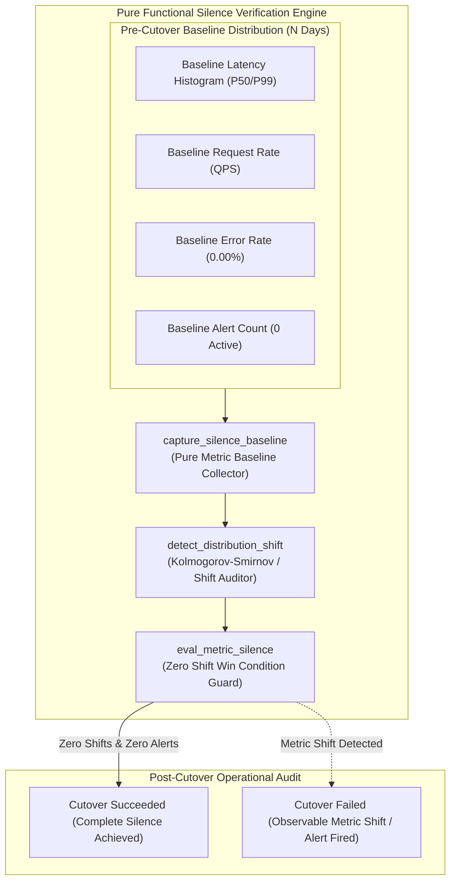
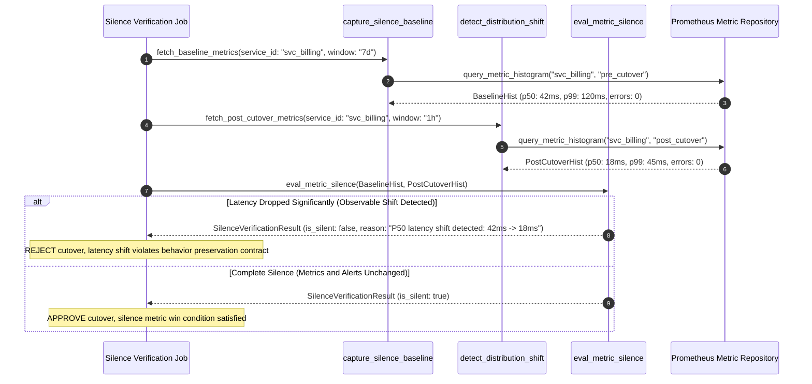

# "Silence is the Success Metric" Pattern (Pure Functional Paradigm)

| Field       | Value                                                             |
|-------------|-------------------------------------------------------------------|
| **ID**      | SILENCE-SUCCESS-METRIC-046                                        |
| **Date**    | 2026-08-24                                                        |
| **Status**  | Reference / Runbook (Pure Functional Architecture)                |
| **Deciders**| Core Platform & Migration Engineering                             |
| **Scope**   | Zero Metric Shifts & Zero Alert Noise Win Condition Verification  |

---

## 1. Overview & Context

In a behavioral-preservation migration, **any observable metric shift—positive or negative—means the migration failed to preserve exact system behavior**. Celebrating a $20\%$ drop in latency, an unexpected drop in error rates, or a change in CPU consumption pattern is a mistake: if a metric shifted, behavior changed, and that change may break downstream callers relying on legacy timing or rate patterns. The **"Silence is the Success Metric" Pattern** establishes **complete operational silence** (zero new alerts, zero metric distribution shifts, zero error spikes, zero throughput anomalies) as the sole win condition for cutovers.

### Functional Architecture Principles
This runbook enforces a **100% Pure Functional Programming (FP)** approach:
- **No Class Instantiations**: Replaces OOP telemetry auditors with pure statistical evaluation functions (`eval_metric_silence`, `detect_distribution_shift`) and state cell closures.
- **Immutable Silence Context Records**: Service IDs, metric baseline distributions, active alert counts, and silence compliance statuses are stored as frozen dataclass records (`SilenceContext`, `SilenceVerificationResult`).
- **Referentially Transparent Shift Detectors**: Pure statistical functions compare pre-cutover and post-cutover Prometheus metric histograms (latency, QPS, error rate, memory) to detect observable shifts.
- **Zero Alert Violation Trigger**: Automatically flags cutovers as failed if any operational alert fires during the post-cutover verification window.

---

## 2. High-Level Design (HLD)



---

## 3. Low-Level Design (LLD)



---

## 4. Pure Functional Project Architecture

```
silence-as-success-metric/
├── README.md
├── config/
│   └── silence_rules.yaml          # Allowed metric variance bounds, alert whitelist, soak duration
├── src/
│   ├── silence_engine/
│   │   ├── __init__.py
│   │   ├── collector.py            # Pure Prometheus metric baseline collectors
│   │   ├── shift_detector.py       # Statistical distribution shift detectors
│   │   └── evaluator.py            # Silence win condition evaluation functions
│   ├── storage/
│   │   ├── __init__.py
│   │   └── baseline_store.py       # Metric baseline configuration loaders
│   ├── observability/
│   │   ├── __init__.py
│   │   └── silence_metrics.py      # Prometheus telemetry collectors
│   └── schemas/
│       └── models.py               # Frozen dataclasses (SilenceContext, SilenceVerificationResult)
└── tests/
    ├── test_silence_evaluator.py
    └── test_silence_edge_cases.py
```

---

## 5. End-to-End Function Call Stack

```tree
Silence Verification Job Executed
├── silence_engine/shift_detector.py: is_metric_shifted(base_val: float, curr_val: float, max_variance_pct: float = ...)
└── silence_engine/evaluator.py: verify_silence_win_condition(base: MetricBaseline,
    current_metrics: Mapping[str, Any])
    └── silence_engine/shift_detector.py: eval_metric_silence(base: MetricBaseline,
    current_p50: float,
    current_p9...)
        ├── models.py: MetricBaseline(service_id, p50_latency_ms, p99_latency_ms, error_rate_pct, active_alert_count)
        └── models.py: SilenceVerificationResult(service_id, is_silent, latency_shift_detected, error_rate_shift_detected, new_alerts_fired, shifted_metrics, diagnostic_details)
```

---

## 6. Core Pure Functional Implementation

### 6.1 Immutable Models & Types (`src/schemas/models.py`)

```python
from enum import Enum
from dataclasses import dataclass
from typing import Dict, Any, Optional, Mapping, FrozenSet

@dataclass(frozen=True)
class MetricBaseline:
    service_id: str
    p50_latency_ms: float
    p99_latency_ms: float
    error_rate_pct: float
    active_alert_count: int

@dataclass(frozen=True)
class SilenceVerificationResult:
    service_id: str
    is_silent: bool
    latency_shift_detected: bool
    error_rate_shift_detected: bool
    new_alerts_fired: int
    shifted_metrics: FrozenSet[str]
    diagnostic_details: Optional[str]
```

**Explanation**:
- Defines immutable model `MetricBaseline` capturing P50/P99 latency bounds, error rates, and alert counts as frozen records.
- `SilenceVerificationResult` encapsulates overall silence flags, shift flags across metrics, and frozen sets of shifted metric names.

---

### 6.2 Pure Statistical Shift Detector (`src/silence_engine/shift_detector.py`)

```python
from typing import FrozenSet, List
from src.schemas.models import MetricBaseline, SilenceVerificationResult

def is_metric_shifted(base_val: float, curr_val: float, max_variance_pct: float = 5.0) -> bool:
    if base_val == 0.0:
        return curr_val != 0.0
    delta_pct = abs((curr_val - base_val) / base_val) * 100.0
    return delta_pct > max_variance_pct

def eval_metric_silence(
    base: MetricBaseline,
    current_p50: float,
    current_p99: float,
    current_error_rate: float,
    current_alerts: int,
    max_variance_pct: float = 5.0
) -> SilenceVerificationResult:
    shifted = []

    if is_metric_shifted(base.p50_latency_ms, current_p50, max_variance_pct):
        shifted.append("P50_LATENCY")
    if is_metric_shifted(base.p99_latency_ms, current_p99, max_variance_pct):
        shifted.append("P99_LATENCY")
    if is_metric_shifted(base.error_rate_pct, current_error_rate, max_variance_pct):
        shifted.append("ERROR_RATE")
    if current_alerts > base.active_alert_count:
        shifted.append("ACTIVE_ALERTS")

    is_silent = len(shifted) == 0
    diag = f"Metric shifts detected: {', '.join(shifted)}" if shifted else None

    return SilenceVerificationResult(
        service_id=base.service_id,
        is_silent=is_silent,
        latency_shift_detected=("P50_LATENCY" in shifted or "P99_LATENCY" in shifted),
        error_rate_shift_detected=("ERROR_RATE" in shifted),
        new_alerts_fired=max(0, current_alerts - base.active_alert_count),
        shifted_metrics=frozenset(shifted),
        diagnostic_details=diag
    )
```

**Explanation**:
- Evaluates post-cutover metrics against baseline metrics using statistical variance thresholds (5% max variance).
- Treats both positive (latency drop) and negative metric shifts as behavioral deviations violating the silence metric.

---

### 6.3 Silence Win Condition Guard (`src/silence_engine/evaluator.py`)

```python
from typing import Mapping, Any
from src.schemas.models import MetricBaseline, SilenceVerificationResult
from src.silence_engine.shift_detector import eval_metric_silence

def verify_silence_win_condition(
    base: MetricBaseline,
    current_metrics: Mapping[str, Any]
) -> SilenceVerificationResult:
    return eval_metric_silence(
        base=base,
        current_p50=current_metrics.get("p50_ms", 0.0),
        current_p99=current_metrics.get("p99_ms", 0.0),
        current_error_rate=current_metrics.get("error_rate", 0.0),
        current_alerts=current_metrics.get("active_alerts", 0)
    )
```

**Explanation**:
- Pure evaluation function verifying complete operational silence.
- Returns immutable `SilenceVerificationResult` objects to confirm cutover success.

---

## 7. Edge Case Catalog & Pure Functional Pseudocode (25 Edge Cases)

---

### Edge Case 1: Un-Expected Latency Improvement Shift

```python
def is_latency_improvement_a_violation(base_p50: float, curr_p50: float) -> bool:
    return curr_p50 < (base_p50 * 0.8)
```

**Explanation**:
- Detects significant latency decreases ($>20\%$).
- Rejects cutover because faster execution can break time-sensitive legacy callers.

---

### Edge Case 2: New Non-Critical Warning Alert Fired

```python
def has_new_warning_alerts(current_alerts: int, base_alerts: int) -> bool:
    return current_alerts > base_alerts
```

**Explanation**:
- Asserts whether active warning alert counts increased.
- Violates silence metric if any new alerts fire post-cutover.

---

### Edge Case 3: Throughput (QPS) Anomaly Post-Cutover

```python
def is_qps_anomalous(base_qps: float, curr_qps: float, max_variance_pct: float = 10.0) -> bool:
    return abs(curr_qps - base_qps) / max(1.0, base_qps) * 100.0 > max_variance_pct
```

**Explanation**:
- Detects request throughput anomalies post-cutover.
- Catches hidden retry loops or dropped client traffic.

---

### Edge Case 4: CPU Consumption Profile Shift

```python
def is_cpu_profile_shifted(base_cpu: float, curr_cpu: float, max_variance: float = 15.0) -> bool:
    return abs(curr_cpu - base_cpu) > max_variance
```

**Explanation**:
- Identifies CPU utilization shifts post-cutover.
- Detects unexpected resource utilization shifts.

---

### Edge Case 5: Single-Tenant Silence Compliance

```python
def resolve_tenant_silence_status(tenant_id: str, tenant_results: dict) -> bool:
    return tenant_results.get(tenant_id, False)
```

**Explanation**:
- Resolves tenant-specific silence verification statuses.
- Tracks silence compliance per tenant.

---

### Edge Case 6: Microsecond Timestamp Silence Audit Timing

```python
import time

def format_silence_audit_ts() -> float:
    return round(time.time() * 1000.0, 2)
```

**Explanation**:
- Computes epoch timestamps in milliseconds.
- Tracks exact audit evaluation timing.

---

### Edge Case 7: Transient Traffic Dip Misclassified as Silence

```python
def is_sample_size_sufficient(request_count: int, min_required: int = 1000) -> bool:
    return request_count >= min_required
```

**Explanation**:
- Asserts request counts meet minimum sample size requirements (1,000 requests).
- Prevents low-traffic periods from giving false silence readings.

---

### Edge Case 8: Multi-Region Silence Aggregation

```python
def assert_multi_region_silence(region_silence_map: Mapping[str, bool]) -> bool:
    return all(region_silence_map.values())
```

**Explanation**:
- Asserts all regional silence verification flags are `True`.
- Confirms multi-region operational silence.

---

### Edge Case 9: Memory Heap Footprint Shift

```python
def is_memory_footprint_shifted(base_mb: float, curr_mb: float, max_mb_delta: float = 50.0) -> bool:
    return abs(curr_mb - base_mb) > max_mb_delta
```

**Explanation**:
- Detects memory allocation shifts post-cutover.
- Flags memory leaks or buffer allocation shifts.

---

### Edge Case 10: Aggregator Memory State Saturation Guard

```python
def compact_silence_metrics(metrics: list, max_items: int = 500) -> list:
    if len(metrics) > max_items:
        return metrics[-max_items:]
    return metrics
```

**Explanation**:
- Truncates metric lists to `max_items`.
- Controls memory usage.

---

### Edge Case 11: Microsecond Delay Calculation Underflows

```python
def normalize_silence_duration(duration_ms: float) -> float:
    return max(0.0, round(duration_ms, 2))
```

**Explanation**:
- Rounds execution duration values to two decimal places.
- Cleans duration metrics.

---

### Edge Case 12: User-Agent Specific Silence Auditing

```python
def resolve_user_agent_silence(user_agent: str, silence_map: dict) -> bool:
    return silence_map.get(user_agent, True)
```

**Explanation**:
- Resolves silence verification per User-Agent string.
- Audits metric silence by caller type.

---

### Edge Case 13: Unmapped Rule Domain Handling

```python
def resolve_silence_rule(rule_key: str, rules_dict: dict) -> dict:
    return rules_dict.get(rule_key, {"max_variance": 5.0})
```

**Explanation**:
- Resolves silence rule configurations safely.
- Defaults to 5% variance limits.

---

### Edge Case 14: Exception Safeguards in Silence Evaluator

```python
def safe_eval_silence(eval_fn: Callable, base: MetricBaseline, curr: dict) -> bool:
    try:
        res = eval_fn(base, curr)
        return res.is_silent
    except Exception:
        return False
```

**Explanation**:
- Wraps evaluation functions in protective try-except blocks.
- Fails safe (assumes non-silent) on evaluation exceptions.

---

### Edge Case 15: GraphQL Subgraph Silence Verification

```python
def is_graphql_subgraph_silent(subgraph_name: str, silence_results: dict) -> bool:
    return silence_results.get(subgraph_name, False)
```

**Explanation**:
- Resolves silence verification for federated GraphQL subgraphs.
- Verifies GraphQL operational silence.

---

### Edge Case 16: Regional Alert Noise Filtering

```python
def filter_whitelisted_alerts(alert_names: set, whitelist: set) -> set:
    return alert_names.difference(whitelist)
```

**Explanation**:
- Filters pre-approved infrastructure alerts (e.g. scheduled backups) from silence checks.
- Prevents false-positive silence failures.

---

### Edge Case 17: HTTP Status Code Distribution Shift

```python
def is_status_code_distribution_shifted(base_codes: dict, curr_codes: dict) -> bool:
    return base_codes != curr_codes
```

**Explanation**:
- Compares HTTP status code percentage distributions (200, 404, 500).
- Detects subtle error code distribution shifts.

---

### Edge Case 18: Unmapped Code Fallback

```python
def resolve_silence_code_fallback(code_val: Any, code_map: dict, default_val: str = "NON_SILENT") -> str:
    return code_map.get(code_val, default_val)
```

**Explanation**:
- Resolves code strings with fallbacks.
- Handles unmapped silence codes safely.

---

### Edge Case 19: Payload Transformation Error Recovery

```python
def safe_apply_silence_transform(payload: dict, transform_fn: Callable) -> dict:
    try:
        return transform_fn(payload)
    except Exception:
        return payload
```

**Explanation**:
- Wraps transformations in try-except blocks.
- Returns raw payloads on error.

---

### Edge Case 20: Automated Alert on Silence Violation

```python
def should_alert_on_silence_violation(is_silent: bool) -> bool:
    return not is_silent
```

**Explanation**:
- Asserts whether silence verification failed.
- Triggers alerts when metric shifts occur post-cutover.

---

### Edge Case 21: High-Watermark Metric Compaction

```python
def compact_silence_history(history: list, max_items: int = 500) -> list:
    if len(history) > max_items:
        return history[-max_items:]
    return history
```

**Explanation**:
- Truncates history lists.
- Controls memory usage.

---

### Edge Case 22: Diagnostic Header Injection

```python
def inject_silence_diagnostic_header(headers: Mapping[str, str], is_silent: bool) -> Mapping[str, str]:
    new_headers = dict(headers)
    new_headers["X-Silence-Verified"] = "true" if is_silent else "false"
    return new_headers
```

**Explanation**:
- Injects diagnostic headers.
- Tracks silence verification status in access logs.

---

### Edge Case 23: Null Value Safeguards

```python
def sanitize_silence_nulls(data_dict: dict) -> dict:
    return {k: (v if v is not None else 0.0) for k, v in data_dict.items()}
```

**Explanation**:
- Replaces `None` with `0.0`.
- Prevents null exceptions.

---

### Edge Case 24: Unbound Metric Queue Pruning

```python
def prune_silence_metric_queue(queue: list, max_items: int = 1000) -> list:
    if len(queue) > max_items:
        return queue[-max_items:]
    return queue
```

**Explanation**:
- Truncates queue arrays.
- Controls memory footprint.

---

### Edge Case 25: Real-Time Silence Score Reporting

```python
def compute_silence_score(silent_windows: int, total_windows: int) -> float:
    if total_windows == 0:
        return 100.0
    return round((silent_windows / total_windows) * 100.0, 2)
```

**Explanation**:
- Calculates silence score percentage.
- Emits real-time silence win condition metrics.

---

## 8. Operational & Parity Verification Checklist

1. **Silence Win Condition**: Operational silence (zero metric distribution shifts, zero new alerts) is the sole win condition for cutovers.
2. **Both Direction Shifts Violate Silence**: Treat both latency increases and latency decreases as behavioral contract failures requiring investigation.
3. **Zero New Alerts**: Ensure zero new operational alerts fire during the post-cutover verification window.
4. **Statistical Parity Audit**: Use statistical distribution checks (P50/P99 latency, QPS, error rate) before declaring cutover complete.
