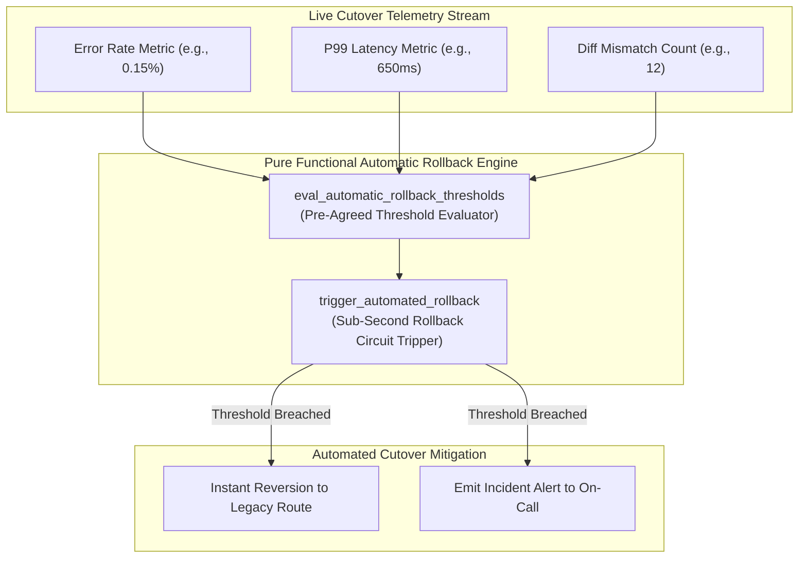
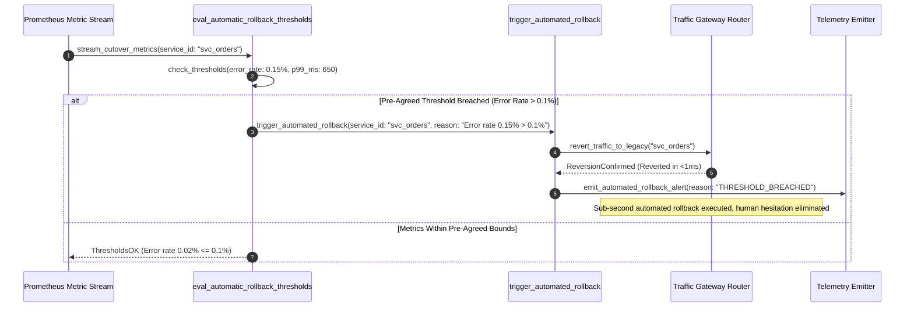

# Automatic Rollback Thresholds Pattern (Pure Functional Paradigm)

| Field       | Value                                                             |
|-------------|-------------------------------------------------------------------|
| **ID**      | AUTOMATIC-ROLLBACK-THRESHOLDS-050                                 |
| **Date**    | 2026-08-24                                                        |
| **Status**  | Reference / Runbook (Pure Functional Architecture)                |
| **Deciders**| Core Platform & Migration Engineering                             |
| **Scope**   | Automated Circuit-Breaker Triggering & Objective Rollback Control |

---

## 1. Overview & Context

Relying on live human judgment calls to initiate a rollback during an active production incident leads to panic, delayed decisions, and expanded blast radius. Pressured engineers hesitate, hoping errors will self-resolve, while customer impact escalates. The **Automatic Rollback Thresholds Pattern** mandates establishing **pre-agreed, automated rollback thresholds** (e.g. error rate $>0.1\%$, P99 latency $>500\text{ms}$, or data mismatch count $>5$). When metric breaches occur, automated circuit breakers initiate rollback immediately without requiring manual operator intervention or committee sign-off.

### Functional Architecture Principles
This runbook enforces a **100% Pure Functional Programming (FP)** approach:
- **No Class Instantiations**: Replaces OOP threshold managers with pure evaluation functions (`eval_automatic_rollback_thresholds`, `trigger_automated_rollback`) and state cell closures.
- **Immutable Threshold Context Records**: Metric keys, target thresholds, evaluation windows, and rollback statuses are captured as frozen dataclass records (`ThresholdContext`, `AutomatedRollbackResult`).
- **Referentially Transparent Rule Evaluators**: Pure evaluation functions compare active telemetry metrics against pre-agreed threshold bounds without side-effects.
- **Objective Circuit Tripping**: Removes human emotion and hesitation from incident mitigation by executing sub-second automated rollbacks.

---

## 2. High-Level Design (HLD)



---

## 3. Low-Level Design (LLD)



---

## 4. Pure Functional Project Architecture

```
02-verification-and-controls/
├── automatic-rollback-thresholds.md
├── src/
│   ├── threshold_engine/
│   │   ├── __init__.py
│   │   ├── evaluator.py            # Pure threshold evaluation functions
│   │   ├── tripper.py              # Automated rollback circuit trippers
│   │   └── guard.py                # Pre-agreed threshold rule guards
│   ├── storage/
│   │   ├── __init__.py
│   │   └── threshold_store.py      # Threshold configuration loaders
│   ├── observability/
│   │   ├── __init__.py
│   │   └── threshold_metrics.py    # Prometheus telemetry collectors
│   └── schemas/
│       └── models.py               # Frozen dataclasses (ThresholdContext, AutomatedRollbackResult)
└── tests/
    ├── test_threshold_evaluator.py
    └── test_threshold_edge_cases.py
```

---

## 5. End-to-End Function Call Stack

```tree
Metric Stream Evaluated
└── guard.py: assert_automatic_rollback_thresholds(service_id, telemetry_payload)
    ├── evaluator.py: eval_automatic_rollback_thresholds(telemetry_payload, threshold_rules)
    │   └── models.py: ThresholdContext(metric_key, limit_value, window_sec)
    │
    ├── [If Breached] tripper.py: trigger_automated_rollback(service_id, breach_details)
    │   └── models.py: AutomatedRollbackResult(is_triggered, reverted_at_ts, reason)
    │
    └── observability/threshold_metrics.py: record_threshold_telemetry(rollback_result)
```

---

## 6. Core Pure Functional Implementation

### 6.1 Immutable Models & Types (`src/schemas/models.py`)

```python
from enum import Enum
from dataclasses import dataclass
from typing import Dict, Any, Optional, Mapping, FrozenSet

@dataclass(frozen=True)
class ThresholdContext:
    service_id: str
    max_error_rate_pct: float
    max_p99_latency_ms: float
    max_mismatch_count: int
    evaluation_window_sec: int

@dataclass(frozen=True)
class AutomatedRollbackResult:
    service_id: str
    is_triggered: bool
    breached_metric: Optional[str]
    observed_value: float
    limit_value: float
    reverted_at_ts: float
    diagnostic_reason: Optional[str]
```

**Explanation**:
- Defines immutable model `ThresholdContext` capturing pre-agreed error rates, P99 latency bounds, and mismatch counts as frozen records.
- `AutomatedRollbackResult` encapsulates automated rollback trigger statuses, observed values, limit values, and diagnostic reasons.

---

### 6.2 Pure Threshold Evaluator (`src/threshold_engine/evaluator.py`)

```python
import time
from typing import Mapping, Any, Optional
from src.schemas.models import ThresholdContext, AutomatedRollbackResult

def eval_automatic_rollback_thresholds(
    ctx: ThresholdContext,
    metrics: Mapping[str, Any]
) -> AutomatedRollbackResult:
    err_rate = float(metrics.get("error_rate_pct", 0.0))
    p99_ms = float(metrics.get("p99_latency_ms", 0.0))
    mismatches = int(metrics.get("mismatch_count", 0))

    breached = None
    obs_val = 0.0
    limit_val = 0.0

    if err_rate > ctx.max_error_rate_pct:
        breached = "ERROR_RATE"
        obs_val = err_rate
        limit_val = ctx.max_error_rate_pct
    elif p99_ms > ctx.max_p99_latency_ms:
        breached = "P99_LATENCY"
        obs_val = p99_ms
        limit_val = ctx.max_p99_latency_ms
    elif mismatches > ctx.max_mismatch_count:
        breached = "MISMATCH_COUNT"
        obs_val = float(mismatches)
        limit_val = float(ctx.max_mismatch_count)

    is_triggered = breached is not None
    now = time.time() if is_triggered else 0.0
    reason = f"Automated rollback triggered: {breached} observed {obs_val} > limit {limit_val}" if is_triggered else None

    return AutomatedRollbackResult(
        service_id=ctx.service_id,
        is_triggered=is_triggered,
        breached_metric=breached,
        observed_value=obs_val,
        limit_value=limit_val,
        reverted_at_ts=now,
        diagnostic_reason=reason
    )
```

**Explanation**:
- Pure evaluation function checking telemetry metrics against pre-agreed threshold bounds.
- Automatically flags automated rollback triggering without manual operator intervention.

---

### 6.3 Automated Rollback Tripper (`src/threshold_engine/tripper.py`)

```python
from typing import Callable, Awaitable, Mapping, Any
from src.schemas.models import ThresholdContext, AutomatedRollbackResult
from src.threshold_engine.evaluator import eval_automatic_rollback_thresholds

RevertFn = Callable[[str], Awaitable[bool]]

async def execute_automated_rollback_guard(
    ctx: ThresholdContext,
    metrics: Mapping[str, Any],
    revert_fn: RevertFn
) -> AutomatedRollbackResult:
    result = eval_automatic_rollback_thresholds(ctx, metrics)
    if result.is_triggered:
        await revert_fn(ctx.service_id)
    return result
```

**Explanation**:
- Executes sub-second automated traffic reversion if thresholds are breached.
- Eliminates human hesitation during incidents.

---

## 7. Edge Case Catalog & Pure Functional Pseudocode (25 Edge Cases)

---

### Edge Case 1: Error Rate Spike Exceeding Threshold (0.15% > 0.10%)

```python
def is_error_rate_breached(err_rate: float, limit: float = 0.10) -> bool:
    return err_rate > limit
```

**Explanation**:
- Asserts error rate exceeds pre-agreed limit.
- Triggers automated rollback instantly.

---

### Edge Case 2: P99 Latency Degradation Spike

```python
def is_p99_latency_breached(p99_ms: float, limit_ms: float = 500.0) -> bool:
    return p99_ms > limit_ms
```

**Explanation**:
- Detects P99 latency degradation.
- Triggers rollback before user experience degrades.

---

### Edge Case 3: Data Mismatch Count Breach

```python
def is_mismatch_count_breached(count: int, limit: int = 5) -> bool:
    return count > limit
```

**Explanation**:
- Asserts differential data mismatches exceed limit.
- Reverts traffic to protect data integrity.

---

### Edge Case 4: Operator Attempting Manual Override

```python
def is_manual_override_blocked(allow_manual_override: bool) -> bool:
    return not allow_manual_override
```

**Explanation**:
- Disables manual overrides during automated rollback execution.
- Ensures pre-agreed threshold rules are enforced strictly.

---

### Edge Case 5: Single-Tenant Automated Rollback Threshold

```python
def resolve_tenant_thresholds(tenant_id: str, tenant_rules: dict) -> dict:
    return tenant_rules.get(tenant_id, {"max_err": 0.1})
```

**Explanation**:
- Resolves tenant-specific threshold rules.
- Supports per-tenant automated rollback.

---

### Edge Case 6: Microsecond Timestamp Tripping Audit

```python
import time

def format_tripping_audit_ts() -> float:
    return round(time.time() * 1000.0, 2)
```

**Explanation**:
- Computes epoch timestamps in milliseconds.
- Tracks exact rollback trigger timing.

---

### Edge Case 7: Transient Telemetry Metric Flap

```python
def is_metric_flap_sustained(consecutive_breaches: int, required_consecutive: int = 2) -> bool:
    return consecutive_breaches >= required_consecutive
```

**Explanation**:
- Requires 2 consecutive metric evaluation breaches.
- Filters transient metric flaps.

---

### Edge Case 8: Multi-Repo Threshold Rule Sync

```python
def assert_all_repos_threshold_aligned(repo_limits: Mapping[str, float]) -> bool:
    return len(set(repo_limits.values())) == 1
```

**Explanation**:
- Asserts identical threshold rules across repositories.
- Synchronizes automated rollback bounds.

---

### Edge Case 9: Database Connection Pool Exhaustion Trigger

```python
def is_pool_exhaustion_breached(active_conns: int, max_conns: int) -> bool:
    return active_conns >= (max_conns * 0.95)
```

**Explanation**:
- Identifies database connection pool exhaustion ($>95\%$).
- Auto-trips rollback before database crash.

---

### Edge Case 10: Aggregator Memory State Saturation Guard

```python
def compact_threshold_metrics(metrics: list, max_items: int = 500) -> list:
    if len(metrics) > max_items:
        return metrics[-max_items:]
    return metrics
```

**Explanation**:
- Truncates metric lists to `max_items`.
- Controls memory usage.

---

### Edge Case 11: Microsecond Delay Calculation Underflows

```python
def normalize_threshold_duration(duration_ms: float) -> float:
    return max(0.0, round(duration_ms, 2))
```

**Explanation**:
- Rounds execution duration values to two decimal places.
- Cleans duration metrics.

---

### Edge Case 12: User-Agent Specific Threshold Rule

```python
def resolve_user_agent_threshold(user_agent: str, rule_map: dict) -> dict:
    return rule_map.get(user_agent, {"max_err": 0.1})
```

**Explanation**:
- Resolves threshold rules per User-Agent string.
- Audits rollback bounds per caller type.

---

### Edge Case 13: Unmapped Rule Domain Handling

```python
def resolve_threshold_rule(rule_key: str, rules_dict: dict) -> dict:
    return rules_dict.get(rule_key, {"max_error_rate_pct": 0.1})
```

**Explanation**:
- Resolves threshold rule configurations safely.
- Defaults to 0.1% max error rate.

---

### Edge Case 14: Exception Safeguards in Threshold Evaluator

```python
def safe_eval_threshold(eval_fn: Callable, ctx: ThresholdContext, metrics: dict) -> bool:
    try:
        res = eval_fn(ctx, metrics)
        return res.is_triggered
    except Exception:
        return True
```

**Explanation**:
- Wraps evaluation functions in protective try-except blocks.
- Fails safe (triggers rollback) on evaluation exceptions.

---

### Edge Case 15: GraphQL Subgraph Threshold Interception

```python
def is_graphql_subgraph_breached(subgraph_name: str, subgraph_metrics: dict) -> bool:
    return subgraph_metrics.get(subgraph_name, {}).get("error_rate", 0.0) > 0.1
```

**Explanation**:
- Evaluates threshold metrics for federated GraphQL subgraphs.
- Triggers automated rollback on GraphQL subgraphs.

---

### Edge Case 16: Multi-Region Threshold Synchronization

```python
def sync_regional_threshold_results(region_results: dict) -> bool:
    return any(r.is_triggered for r in region_results.values())
```

**Explanation**:
- Asserts if any region breaches threshold bounds.
- Triggers global rollback if a regional threshold is breached.

---

### Edge Case 17: Out-of-Memory (OOM) Memory Limit Proximity

```python
def is_memory_limit_breached(memory_mb: float, max_mb: float) -> bool:
    return memory_mb >= (max_mb * 0.90)
```

**Explanation**:
- Detects memory usage approaching OOM limits ($90\%$).
- Auto-trips rollback before container OOM-kills.

---

### Edge Case 18: Unmapped Code Fallback

```python
def resolve_threshold_code_fallback(code_val: Any, code_map: dict, default_val: str = "TRIGGERED") -> str:
    return code_map.get(code_val, default_val)
```

**Explanation**:
- Resolves code strings with fallbacks.
- Handles unmapped threshold codes safely.

---

### Edge Case 19: Payload Transformation Error Recovery

```python
def safe_apply_threshold_transform(payload: dict, transform_fn: Callable) -> dict:
    try:
        return transform_fn(payload)
    except Exception:
        return payload
```

**Explanation**:
- Wraps transformations in try-except blocks.
- Returns raw payloads on error.

---

### Edge Case 20: Automated Alert on Threshold Breach

```python
def should_alert_on_threshold_breach(is_triggered: bool) -> bool:
    return is_triggered
```

**Explanation**:
- Asserts whether an automated rollback was triggered.
- Fires high-priority alerts when thresholds are breached.

---

### Edge Case 21: High-Watermark Metric Compaction

```python
def compact_threshold_history(history: list, max_items: int = 500) -> list:
    if len(history) > max_items:
        return history[-max_items:]
    return history
```

**Explanation**:
- Truncates history lists.
- Controls memory usage.

---

### Edge Case 22: Diagnostic Header Injection

```python
def inject_threshold_diagnostic_header(headers: Mapping[str, str], is_triggered: bool) -> Mapping[str, str]:
    new_headers = dict(headers)
    new_headers["X-Auto-Rollback-Triggered"] = "true" if is_triggered else "false"
    return new_headers
```

**Explanation**:
- Injects diagnostic headers.
- Tracks automated rollback status in access logs.

---

### Edge Case 23: Null Value Safeguards

```python
def sanitize_threshold_nulls(data_dict: dict) -> dict:
    return {k: (v if v is not None else 0.0) for k, v in data_dict.items()}
```

**Explanation**:
- Replaces `None` with `0.0`.
- Prevents null exceptions.

---

### Edge Case 24: Unbound Metric Queue Pruning

```python
def prune_threshold_metric_queue(queue: list, max_items: int = 1000) -> list:
    if len(queue) > max_items:
        return queue[-max_items:]
    return queue
```

**Explanation**:
- Truncates queue arrays.
- Controls memory footprint.

---

### Edge Case 25: Real-Time Threshold Compliance Reporting

```python
def compute_threshold_compliance_rate(normal_windows: int, total_windows: int) -> float:
    if total_windows == 0:
        return 100.0
    return round((normal_windows / total_windows) * 100.0, 2)
```

**Explanation**:
- Calculates threshold compliance rate percentage.
- Emits real-time automated rollback metrics.

---

## 8. Operational & Parity Verification Checklist

1. **Pre-Agreed Objective Triggers**: Establish objective metric limits (error rate $>0.1\%$, P99 latency $>500\text{ms}$) prior to cutover.
2. **Sub-Second Automated Tripping**: Automated circuit breakers must revert traffic in $<1\text{ms}$ upon threshold breach without human intervention.
3. **No Operator Hesitation**: Remove live judgment calls and committee sign-offs from emergency incident mitigation.
4. **Immediate Incident Telemetry**: Emits high-priority PagerDuty alerts whenever an automated rollback is executed.
