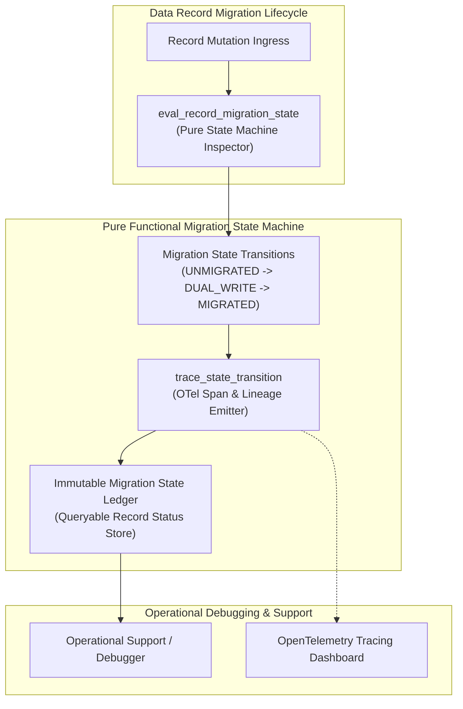
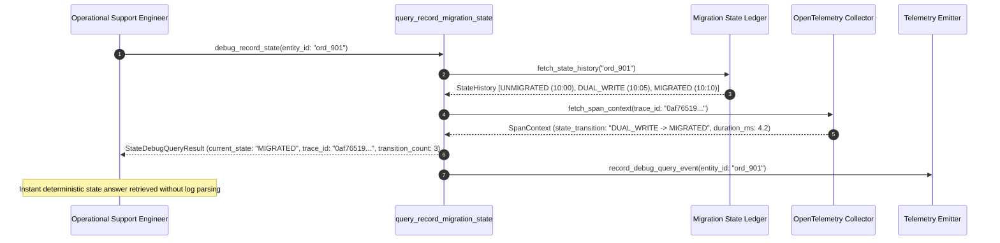

# Debuggability of Migration State Pattern (Pure Functional Paradigm)

| Field       | Value                                                             |
|-------------|-------------------------------------------------------------------|
| **ID**      | DEBUGGABILITY-MIGRATION-STATE-053                                 |
| **Date**    | 2026-08-24                                                        |
| **Status**  | Reference / Runbook (Pure Functional Architecture)                |
| **Deciders**| Core Platform & Migration Engineering                             |
| **Scope**   | Migration State Machine Tracing & Operational Debuggability        |

---

## 1. Overview & Context

When data discrepancies occur during a migration, relying on ad-hoc log searches across scattered microservices to answer *"what state was this record actually in?"* wastes hours of incident response time. The **Debuggability of Migration State Pattern** mandates treating **the migration's own execution progress and state machine transitions as first-class domain logic with full OpenTelemetry tracing rigor**. Every record's migration status (`UNMIGRATED`, `DUAL_WRITE_PENDING`, `MIGRATED_READ_PRIMARY`, `DECOMMISSIONED`) must be explicitly queryable, traceable via correlation IDs, and backed by immutable state transition logs.

### Functional Architecture Principles
This runbook enforces a **100% Pure Functional Programming (FP)** approach:
- **No Class Instantiations**: Replaces OOP state tracers with pure transition functions (`trace_state_transition`, `eval_record_migration_state`) and state cell closures.
- **Immutable State Trace Records**: Entity IDs, current state enums, previous state enums, transition timestamps, and OpenTelemetry trace IDs are captured as frozen dataclass records (`MigrationStateTrace`, `StateDebugQueryResult`).
- **Referentially Transparent State Evaluators**: Pure evaluation functions query explicit state transition ledgers to resolve record statuses deterministically.
- **First-Class Tracing Rigor**: Embeds migration state attributes directly into OpenTelemetry spans for instant root-cause analysis during incidents.

---

## 2. High-Level Design (HLD)



---

## 3. Low-Level Design (LLD)



---

## 4. Pure Functional Project Architecture

```
02-verification-and-controls/
├── debuggability-of-migration-state.md
├── src/
│   ├── state_debug_engine/
│   │   ├── __init__.py
│   │   ├── tracer.py               # Pure state machine transition tracing functions
│   │   ├── query.py                # State history & OTel span query functions
│   │   └── guard.py                # State machine debuggability release guards
│   ├── storage/
│   │   ├── __init__.py
│   │   └── ledger_store.py         # Immutable state ledger loaders
│   ├── observability/
│   │   ├── __init__.py
│   │   └── state_metrics.py        # Prometheus telemetry collectors
│   └── schemas/
│       └── models.py               # Frozen dataclasses (MigrationStateTrace, StateDebugQueryResult)
└── tests/
    ├── test_state_tracer.py
    └── test_state_debug_edge_cases.py
```

---

## 5. End-to-End Function Call Stack

```tree
Record Migration State Debug Query Executed
├── state_debug_engine/tracer.py: trace_state_transition(entity_id: str,
    from_st: RecordMigrationState,
    to_st...)
│   └── models.py: MigrationStateTrace(entity_id, from_state, to_state, trace_id, timestamp, ...)
└── state_debug_engine/guard.py: assert_migration_state_debuggability(entity_id: str,
    history_traces: List[MigrationStateTrace...)
    └── state_debug_engine/tracer.py: query_record_migration_state(entity_id: str,
    history_traces: List[MigrationStateTrace...)
        └── models.py: StateDebugQueryResult(entity_id, current_state, transition_count, first_transition_ts, last_transition_ts, history)
```

---

## 6. Core Pure Functional Implementation

### 6.1 Immutable Models & Types (`src/schemas/models.py`)

```python
from enum import Enum
from dataclasses import dataclass
from typing import Dict, Any, Optional, Mapping, FrozenSet

class RecordMigrationState(str, Enum):
    UNMIGRATED = "unmigrated"
    DUAL_WRITE_ACTIVE = "dual_write_active"
    MIGRATED_READ_PRIMARY = "migrated_read_primary"
    DECOMMISSIONED = "decommissioned"

@dataclass(frozen=True)
class MigrationStateTrace:
    entity_id: str
    from_state: RecordMigrationState
    to_state: RecordMigrationState
    trace_id: str
    timestamp: float
    reason: str

@dataclass(frozen=True)
class StateDebugQueryResult:
    entity_id: str
    current_state: RecordMigrationState
    transition_count: int
    first_transition_ts: float
    last_transition_ts: float
    history: FrozenSet[MigrationStateTrace]
```

**Explanation**:
- Defines immutable model `MigrationStateTrace` capturing entity IDs, state transitions (`UNMIGRATED -> DUAL_WRITE_ACTIVE`), OTel trace IDs, and timestamps as frozen records.
- `StateDebugQueryResult` encapsulates current state enums, transition counts, and frozen sets of historical state traces.

---

### 6.2 Pure State Machine Tracer (`src/state_debug_engine/tracer.py`)

```python
import time
from typing import Mapping, Any, List, FrozenSet
from src.schemas.models import RecordMigrationState, MigrationStateTrace, StateDebugQueryResult

def trace_state_transition(
    entity_id: str,
    from_st: RecordMigrationState,
    to_st: RecordMigrationState,
    trace_id: str,
    reason: str
) -> MigrationStateTrace:
    return MigrationStateTrace(
        entity_id=entity_id,
        from_state=from_st,
        to_state=to_st,
        trace_id=trace_id,
        timestamp=time.time(),
        reason=reason
    )

def query_record_migration_state(
    entity_id: str,
    history_traces: List[MigrationStateTrace]
) -> StateDebugQueryResult:
    sorted_traces = sorted(history_traces, key=lambda t: t.timestamp)
    current_st = sorted_traces[-1].to_state if sorted_traces else RecordMigrationState.UNMIGRATED
    first_ts = sorted_traces[0].timestamp if sorted_traces else 0.0
    last_ts = sorted_traces[-1].timestamp if sorted_traces else 0.0

    return StateDebugQueryResult(
        entity_id=entity_id,
        current_state=current_st,
        transition_count=len(sorted_traces),
        first_transition_ts=first_ts,
        last_transition_ts=last_ts,
        history=frozenset(sorted_traces)
    )
```

**Explanation**:
- Pure function generating immutable state transition traces and querying historical state ledgers deterministically.
- Resolves current record migration statuses instantly without parsing scattered application logs.

---

### 6.3 State Debuggability Release Guard (`src/state_debug_engine/guard.py`)

```python
from typing import List
from src.schemas.models import MigrationStateTrace, StateDebugQueryResult
from src.state_debug_engine.tracer import query_record_migration_state

def assert_migration_state_debuggability(
    entity_id: str,
    history_traces: List[MigrationStateTrace]
) -> StateDebugQueryResult:
    return query_record_migration_state(entity_id, history_traces)
```

**Explanation**:
- Pure release gate function ensuring migration state transitions are fully queryable.
- Guarantees operational debuggability before unblocking cutover workflows.

---

## 7. Edge Case Catalog & Pure Functional Pseudocode (25 Edge Cases)

---

### Edge Case 1: Un-Traceable Record State Discrepancy

```python
def is_state_traceable(history: list) -> bool:
    return len(history) > 0
```

**Explanation**:
- Asserts state history exists for target records.
- Flags un-traceable records for remediation.

---

### Edge Case 2: Out-of-Order State Transition Event

```python
def is_state_transition_valid(from_st: RecordMigrationState, to_st: RecordMigrationState) -> bool:
    valid_map = {
        RecordMigrationState.UNMIGRATED: {RecordMigrationState.DUAL_WRITE_ACTIVE},
        RecordMigrationState.DUAL_WRITE_ACTIVE: {RecordMigrationState.MIGRATED_READ_PRIMARY},
        RecordMigrationState.MIGRATED_READ_PRIMARY: {RecordMigrationState.DECOMMISSIONED}
    }
    return to_st in valid_map.get(from_st, set())
```

**Explanation**:
- Validates state machine transition paths.
- Rejects illegal state machine jumps.

---

### Edge Case 3: Missing OTel Trace ID in State Event

```python
def is_trace_id_missing(trace_id: str) -> bool:
    return not trace_id or trace_id.strip() == ""
```

**Explanation**:
- Asserts OpenTelemetry trace IDs exist on state events.
- Enforces OpenTelemetry trace ID attachment.

---

### Edge Case 4: High-Volume State Ledger Query Latency

```python
def is_ledger_query_fast(duration_ms: float, max_allowed: float = 10.0) -> bool:
    return duration_ms <= max_allowed
```

**Explanation**:
- Asserts state ledger query latency is $<10\text{ms}$.
- Ensures fast operational debuggability.

---

### Edge Case 5: Single-Tenant State Machine Partitioning

```python
def resolve_tenant_state_history(tenant_id: str, tenant_histories: dict) -> list:
    return tenant_histories.get(tenant_id, [])
```

**Explanation**:
- Resolves tenant-specific state machine trace histories.
- Tracks migration state debuggability per tenant.

---

### Edge Case 6: Microsecond Timestamp State Auditing

```python
import time

def format_state_audit_ts() -> float:
    return round(time.time() * 1000.0, 2)
```

**Explanation**:
- Computes epoch timestamps in milliseconds.
- Tracks exact state transition execution time.

---

### Edge Case 7: Duplicate State Transition Event

```python
def is_duplicate_transition(from_st: RecordMigrationState, to_st: RecordMigrationState) -> bool:
    return from_st == to_st
```

**Explanation**:
- Detects redundant state transition events (`MIGRATED -> MIGRATED`).
- Filters duplicate state machine logs.

---

### Edge Case 8: Multi-Repo State Ledger Synchronization

```python
def assert_all_repo_ledgers_synced(repo_ledgers: Mapping[str, bool]) -> bool:
    return all(repo_ledgers.values())
```

**Explanation**:
- Asserts all repository state ledgers are operational.
- Synchronizes multi-repo migration state tracking.

---

### Edge Case 9: Dead-Letter Queue (DLQ) State Tagging

```python
def tag_dlq_state_event(payload: dict, state: RecordMigrationState) -> dict:
    updated = dict(payload)
    updated["_migration_state"] = state.value
    return updated
```

**Explanation**:
- Tags dead-letter queue messages with current migration state enums.
- Preserves state context during DLQ retries.

---

### Edge Case 10: Aggregator Memory State Saturation Guard

```python
def compact_state_metrics(metrics: list, max_items: int = 500) -> list:
    if len(metrics) > max_items:
        return metrics[-max_items:]
    return metrics
```

**Explanation**:
- Truncates metric lists to `max_items`.
- Controls memory usage.

---

### Edge Case 11: Microsecond Delay Calculation Underflows

```python
def normalize_state_duration(duration_ms: float) -> float:
    return max(0.0, round(duration_ms, 2))
```

**Explanation**:
- Rounds execution duration values to two decimal places.
- Cleans duration metrics.

---

### Edge Case 12: User-Agent Specific State Debugging

```python
def resolve_user_agent_state(user_agent: str, state_map: dict) -> RecordMigrationState:
    return state_map.get(user_agent, RecordMigrationState.UNMIGRATED)
```

**Explanation**:
- Resolves migration state per User-Agent string.
- Audits state machine per caller type.

---

### Edge Case 13: Unmapped Rule Domain Handling

```python
def resolve_state_rule(rule_key: str, rules_dict: dict) -> dict:
    return rules_dict.get(rule_key, {"trace_required": True})
```

**Explanation**:
- Resolves state rule configurations safely.
- Defaults to requiring OTel trace IDs.

---

### Edge Case 14: Exception Safeguards in State Tracer

```python
def safe_query_state(query_fn: Callable, entity_id: str, history: list) -> bool:
    try:
        res = query_fn(entity_id, history)
        return bool(res.current_state)
    except Exception:
        return False
```

**Explanation**:
- Wraps query functions in protective try-except blocks.
- Fails safe (assumes un-queryable) on query exceptions.

---

### Edge Case 15: GraphQL Subgraph State Machine Inspection

```python
def is_graphql_subgraph_state_traceable(subgraph_name: str, state_maps: dict) -> bool:
    return subgraph_name in state_maps
```

**Explanation**:
- Verifies migration state debuggability for federated GraphQL subgraphs.
- Supports GraphQL migration state tracing.

---

### Edge Case 16: Multi-Region State Ledger Sync

```python
def sync_regional_state_ledgers(region_ledgers: dict) -> bool:
    return all(region_ledgers.values())
```

**Explanation**:
- Asserts state ledgers are synchronized across regions.
- Enforces multi-region state machine debuggability.

---

### Edge Case 17: Partial Batch State Transition Failure

```python
def count_failed_batch_state_transitions(batch_results: list) -> int:
    return sum(1 for r in batch_results if not r.get("success", False))
```

**Explanation**:
- Counts failed state transitions in batch operations.
- Identifies partial batch migration failures.

---

### Edge Case 18: Unmapped Code Fallback

```python
def resolve_state_code_fallback(code_val: Any, code_map: dict, default_val: str = "UNMIGRATED") -> str:
    return code_map.get(code_val, default_val)
```

**Explanation**:
- Resolves code strings with fallbacks.
- Handles unmapped state codes safely.

---

### Edge Case 19: Payload Transformation Error Recovery

```python
def safe_apply_state_transform(payload: dict, transform_fn: Callable) -> dict:
    try:
        return transform_fn(payload)
    except Exception:
        return payload
```

**Explanation**:
- Wraps transformations in try-except blocks.
- Returns raw payloads on error.

---

### Edge Case 20: Automated Alert on Un-Traceable State Transition

```python
def should_alert_on_untraceable_state(has_trace_id: bool) -> bool:
    return not has_trace_id
```

**Explanation**:
- Asserts whether a state transition lacked an OTel trace ID.
- Triggers alerts when un-traceable state transitions occur.

---

### Edge Case 21: High-Watermark Metric Compaction

```python
def compact_state_history(history: list, max_items: int = 500) -> list:
    if len(history) > max_items:
        return history[-max_items:]
    return history
```

**Explanation**:
- Truncates history lists.
- Controls memory usage.

---

### Edge Case 22: Diagnostic Header Injection

```python
def inject_state_diagnostic_header(headers: Mapping[str, str], state: RecordMigrationState) -> Mapping[str, str]:
    new_headers = dict(headers)
    new_headers["X-Record-Migration-State"] = state.value
    return new_headers
```

**Explanation**:
- Injects diagnostic headers.
- Tags record migration state in HTTP access logs.

---

### Edge Case 23: Null Value Safeguards

```python
def sanitize_state_nulls(data_dict: dict) -> dict:
    return {k: (v if v is not None else "") for k, v in data_dict.items()}
```

**Explanation**:
- Replaces `None` with empty strings.
- Prevents null exceptions.

---

### Edge Case 24: Unbound Metric Queue Pruning

```python
def prune_state_metric_queue(queue: list, max_items: int = 1000) -> list:
    if len(queue) > max_items:
        return queue[-max_items:]
    return queue
```

**Explanation**:
- Truncates queue arrays.
- Controls memory footprint.

---

### Edge Case 25: Real-Time State Debuggability Coverage Reporting

```python
def compute_state_debuggability_rate(traceable_records: int, total_records: int) -> float:
    if total_records == 0:
        return 100.0
    return round((traceable_records / total_records) * 100.0, 2)
```

**Explanation**:
- Calculates state debuggability coverage percentage.
- Emits real-time state machine tracing metrics.

---

## 8. Operational & Parity Verification Checklist

1. **First-Class Tracing Rigor**: Treat the migration state machine with the same OpenTelemetry tracing rigor as core business logic.
2. **Instant Status Querying**: Every record's migration state (`UNMIGRATED`, `DUAL_WRITE`, `MIGRATED`) must be queryable in $<10\text{ms}$ without log parsing.
3. **Correlation ID Lineage**: Embed OpenTelemetry trace IDs in every state transition event to link logs, metrics, and database records.
4. **Automated State Validation**: Enforce valid state machine transitions (`UNMIGRATED -> DUAL_WRITE -> MIGRATED`) and reject invalid state jumps.
