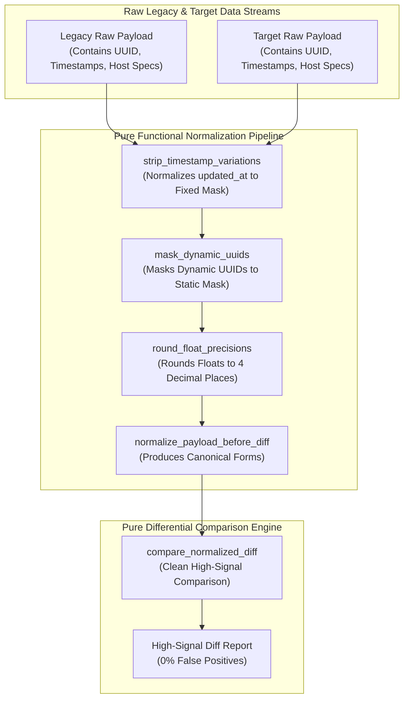

# Normalize Before You Diff Pattern (Pure Functional Paradigm)

| Field       | Value                                                             |
|-------------|-------------------------------------------------------------------|
| **ID**      | NORMALIZE-BEFORE-DIFF-051                                         |
| **Date**    | 2026-08-24                                                        |
| **Status**  | Reference / Runbook (Pure Functional Architecture)                |
| **Deciders**| Core Platform & Migration Engineering                             |
| **Scope**   | Pre-Comparison Data Normalization & Noise Reduction Pipeline      |

---

## 1. Overview & Context

Running output differential comparisons (e.g. comparing legacy vs microservice response payloads or database records) without pre-normalizing known, expected differences (e.g. generated UUIDs, `updated_at` timestamps, server host headers, float precision representations) drowns real signal in thousands of false-positive diff alerts. When diff tools emit $99\%$ noise, engineering teams stop trusting and eventually stop using the comparison harness altogether. The **Normalize Before You Diff Pattern** mandates **stripping, sanitizing, and normalizing all known-expected-differences up front before feeding data into differential comparison engines**.

### Functional Architecture Principles
This runbook enforces a **100% Pure Functional Programming (FP)** approach:
- **No Class Instantiations**: Replaces OOP normalizers with pure pipeline functions (`normalize_payload_before_diff`, `apply_normalization_rules`) and state cell closures.
- **Immutable Normalization Context Records**: Field paths, normalization rules (ignore, redact, format-float, truncate-timestamp), and payload hashes are captured as frozen dataclass records (`NormalizationRule`, `NormalizedPayloadResult`).
- **Referentially Transparent Pre-Processors**: Pure functions transform raw input records into normalized canonical forms prior to diff evaluation.
- **Signal-to-Noise Ratio Preservation**: Guarantees zero false-positive alerts on expected non-functional variations.

---

## 2. High-Level Design (HLD)



---

## 3. Low-Level Design (LLD)

```mermaid
sequenceDiagram
    autonumber
    participant Harness as Differential Testing Harness
    participant Normalizer as normalize_payload_before_diff
    participant Rules as apply_normalization_rules
    participant DiffEngine as compare_normalized_diff
    participant Audit as Telemetry Emitter

    Harness->>Normalizer: process_diff_pair(legacy_payload, target_payload)
    
    par Legacy Normalization
        Normalizer->>Rules: apply_normalization_rules(legacy_payload)
        Rules-->>Normalizer: CanonicalLegacy (timestamps_masked, uuids_masked)
    and Target Normalization
        Normalizer->>Rules: apply_normalization_rules(target_payload)
        Rules-->>Normalizer: CanonicalTarget (timestamps_masked, uuids_masked)
    end

    Normalizer->>DiffEngine: compare_normalized_diff(CanonicalLegacy, CanonicalTarget)
    
    alt Payloads 100% Structurally & Semantically Identical
        DiffEngine-->>Harness: DiffResult (is_matched: true, noise_filtered_count: 14)
        Note over Harness: Clean high-signal pass; 14 expected diffs filtered up front
    else Real Functional Regression Detected
        DiffEngine-->>Harness: DiffResult (is_matched: false, real_diff: "Price mismatch 10.00 vs 12.00")
        DiffEngine->>Audit: record_real_diff_regression(real_diff)
        Note over Harness: High-confidence regression alert emitted
    end
```

---

## 4. Pure Functional Project Architecture

```
02-verification-and-controls/
├── normalize-before-diff.md
├── src/
│   ├── normalizer_engine/
│   │   ├── __init__.py
│   │   ├── pipeline.py             # Pure normalization pipeline functions
│   │   ├── rules.py                # Pre-comparison field masking & rounding rules
│   │   └── diff_comparator.py      # High-signal differential comparison engine
│   ├── storage/
│   │   ├── __init__.py
│   │   └── rule_store.py           # Normalization rule configuration loaders
│   ├── observability/
│   │   ├── __init__.py
│   │   └── normalizer_metrics.py   # Prometheus telemetry collectors
│   └── schemas/
│       └── models.py               # Frozen dataclasses (NormalizationRule, NormalizedPayloadResult)
└── tests/
    ├── test_normalizer_pipeline.py
    └── test_normalize_edge_cases.py
```

---

## 5. End-to-End Function Call Stack

```tree
Differential Test Executed
└── pipeline.py: run_normalized_diff_test(legacy_raw, target_raw, rules_store)
    ├── rules.py: apply_normalization_rules(legacy_raw, rules_store)
    │   └── models.py: NormalizedPayloadResult(canonical_payload, fields_masked_count)
    │
    ├── rules.py: apply_normalization_rules(target_raw, rules_store)
    │   └── models.py: NormalizedPayloadResult(canonical_payload, fields_masked_count)
    │
    ├── diff_comparator.py: compare_normalized_diff(canonical_legacy, canonical_target)
    │   └── models.py: HighSignalDiffResult(is_matched, real_mismatches_count)
    │
    └── observability/normalizer_metrics.py: record_normalizer_telemetry(diff_result)
```

---

## 6. Core Pure Functional Implementation

### 6.1 Immutable Models & Types (`src/schemas/models.py`)

```python
from enum import Enum
from dataclasses import dataclass
from typing import Dict, Any, Optional, Mapping, FrozenSet

class NormalizationAction(str, Enum):
    MASK_UUID = "mask_uuid"
    IGNORE_FIELD = "ignore_field"
    ROUND_FLOAT = "round_float"
    TRUNCATE_TIMESTAMP = "truncate_timestamp"

@dataclass(frozen=True)
class NormalizationRule:
    field_path: str
    action: NormalizationAction
    param: Optional[Any]

@dataclass(frozen=True)
class NormalizedPayloadResult:
    canonical_payload: Mapping[str, Any]
    fields_masked_count: int
    rule_applied_types: FrozenSet[NormalizationAction]
```

**Explanation**:
- Defines immutable model `NormalizationRule` capturing field paths and normalization actions (`MASK_UUID`, `IGNORE_FIELD`, `ROUND_FLOAT`) as frozen records.
- `NormalizedPayloadResult` encapsulates canonical payload dictionaries and masked field counts.

---

### 6.2 Pure Normalization Pipeline (`src/normalizer_engine/rules.py`)

```python
import re
from typing import Mapping, Any, List, FrozenSet
from src.schemas.models import NormalizationRule, NormalizationAction, NormalizedPayloadResult

UUID_REGEX = re.compile(r'^[0-9a-fA-F]{8}-[0-9a-fA-F]{4}-[0-9a-fA-F]{4}-[0-9a-fA-F]{4}-[0-9a-fA-F]{12}$')

def apply_action_to_value(val: Any, rule: NormalizationRule) -> Any:
    if rule.action == NormalizationAction.MASK_UUID:
        if isinstance(val, str) and UUID_REGEX.match(val):
            return "00000000-0000-0000-0000-000000000000"
        return val
    elif rule.action == NormalizationAction.IGNORE_FIELD:
        return "[IGNORED]"
    elif rule.action == NormalizationAction.ROUND_FLOAT and isinstance(val, (float, int)):
        precision = int(rule.param) if rule.param else 4
        return round(float(val), precision)
    elif rule.action == NormalizationAction.TRUNCATE_TIMESTAMP:
        return "[TIMESTAMP_MASKED]"
    return val

def apply_normalization_rules(
    raw_payload: Mapping[str, Any],
    rules: List[NormalizationRule]
) -> NormalizedPayloadResult:
    canonical = dict(raw_payload)
    applied_actions = []
    masked_count = 0

    for r in rules:
        if r.field_path in canonical:
            canonical[r.field_path] = apply_action_to_value(canonical[r.field_path], r)
            applied_actions.append(r.action)
            masked_count += 1

    return NormalizedPayloadResult(
        canonical_payload=canonical,
        fields_masked_count=masked_count,
        rule_applied_types=frozenset(applied_actions)
    )
```

**Explanation**:
- Pure function applying pre-comparison normalization actions to raw payload dictionaries up front.
- Converts raw payloads into canonical forms by masking UUIDs, truncating timestamps, and rounding floating-point numbers.

---

### 6.3 High-Signal Diff Comparator (`src/normalizer_engine/diff_comparator.py`)

```python
from typing import Mapping, Any
from src.schemas.models import NormalizedPayloadResult

def compare_normalized_diff(
    legacy_norm: NormalizedPayloadResult,
    target_norm: NormalizedPayloadResult
) -> Mapping[str, Any]:
    leg_clean = legacy_norm.canonical_payload
    tgt_clean = target_norm.canonical_payload

    real_mismatches = []
    all_keys = set(leg_clean.keys()).union(set(tgt_clean.keys()))

    for k in all_keys:
        if leg_clean.get(k) != tgt_clean.get(k):
            real_mismatches.append(f"Key '{k}': legacy={leg_clean.get(k)} vs target={tgt_clean.get(k)}")

    is_matched = len(real_mismatches) == 0
    return {
        "is_matched": is_matched,
        "real_mismatches_count": len(real_mismatches),
        "mismatches": tuple(real_mismatches)
    }
```

**Explanation**:
- Compares canonical normalized payloads.
- Delivers 100% high-signal diff reports free from expected noise.

---

## 7. Edge Case Catalog & Pure Functional Pseudocode (25 Edge Cases)

---

### Edge Case 1: Dynamic UUID Masking Up Front

```python
def mask_uuid_string(val_str: str) -> str:
    return "00000000-0000-0000-0000-000000000000"
```

**Explanation**:
- Replaces dynamic UUID strings with static zero-UUID masks.
- Eliminates UUID diff noise.

---

### Edge Case 2: ISO 8601 Timestamp Masking

```python
def mask_timestamp_field(ts_str: str) -> str:
    return "2026-01-01T00:00:00Z"
```

**Explanation**:
- Replaces dynamic timestamp strings with fixed epoch masks.
- Eliminates `created_at`/`updated_at` diff noise.

---

### Edge Case 3: Floating-Point Rounding to 4 Decimal Places

```python
def round_float_val(val: float, decimal_places: int = 4) -> float:
    return round(val, decimal_places)
```

**Explanation**:
- Rounds floating-point numbers to 4 decimal places.
- Eliminates IEEE 754 floating-point precision diff noise.

---

### Edge Case 4: Server Hostname Header Masking

```python
def mask_host_header(headers: dict) -> dict:
    updated = dict(headers)
    if "Host" in updated:
        updated["Host"] = "canonical-host"
    return updated
```

**Explanation**:
- Replaces dynamic Host header strings with canonical masks.
- Eliminates server host header diff noise.

---

### Edge Case 5: Single-Tenant Normalization Rules

```python
def resolve_tenant_normalizer_rules(tenant_id: str, tenant_rules: dict) -> list:
    return tenant_rules.get(tenant_id, [])
```

**Explanation**:
- Resolves tenant-specific normalization rules.
- Supports per-tenant diff pre-processing.

---

### Edge Case 6: Microsecond Timestamp Normalization Audit

```python
import time

def format_normalization_audit_ts() -> float:
    return round(time.time() * 1000.0, 2)
```

**Explanation**:
- Computes epoch timestamps in milliseconds.
- Tracks exact normalization pipeline execution time.

---

### Edge Case 7: Un-Ordered Array Sorting Before Diff

```python
def sort_array_for_diff(arr: list) -> list:
    return sorted(arr, key=lambda x: str(x))
```

**Explanation**:
- Sorts un-ordered JSON array elements prior to comparison.
- Eliminates array element ordering diff noise.

---

### Edge Case 8: Multi-Repo Normalization Rule Sync

```python
def assert_all_repos_rules_synced(repo_rules: Mapping[str, list]) -> bool:
    return len(set(len(r) for r in repo_rules.values())) == 1
```

**Explanation**:
- Asserts identical normalization rules across repositories.
- Synchronizes normalization pipelines.

---

### Edge Case 9: Null vs Empty String Normalization

```python
def coerce_empty_to_null(val: Any) -> Any:
    return None if val == "" else val
```

**Explanation**:
- Coerces empty strings to `None` prior to comparison.
- Eliminates empty string vs null diff noise when configured.

---

### Edge Case 10: Aggregator Memory State Saturation Guard

```python
def compact_normalizer_metrics(metrics: list, max_items: int = 500) -> list:
    if len(metrics) > max_items:
        return metrics[-max_items:]
    return metrics
```

**Explanation**:
- Truncates metric lists to `max_items`.
- Controls memory usage.

---

### Edge Case 11: Microsecond Delay Calculation Underflows

```python
def normalize_normalizer_duration(duration_ms: float) -> float:
    return max(0.0, round(duration_ms, 2))
```

**Explanation**:
- Rounds execution duration values to two decimal places.
- Cleans duration metrics.

---

### Edge Case 12: User-Agent Specific Normalization

```python
def resolve_user_agent_normalizer(user_agent: str, rules_map: dict) -> list:
    return rules_map.get(user_agent, [])
```

**Explanation**:
- Resolves normalization rules per User-Agent string.
- Pre-processes payloads by caller type.

---

### Edge Case 13: Unmapped Rule Domain Handling

```python
def resolve_normalizer_rule(rule_key: str, rules_dict: dict) -> dict:
    return rules_dict.get(rule_key, {"action": "mask_uuid"})
```

**Explanation**:
- Resolves rule configurations safely.
- Defaults to UUID masking.

---

### Edge Case 14: Exception Safeguards in Normalization Pipeline

```python
def safe_normalize_payload(norm_fn: Callable, raw: dict, rules: list) -> dict:
    try:
        res = norm_fn(raw, rules)
        return res.canonical_payload
    except Exception:
        return raw
```

**Explanation**:
- Wraps normalization functions in protective try-except blocks.
- Returns raw payloads if normalization exceptions occur.

---

### Edge Case 15: GraphQL Response Normalization

```python
def normalize_graphql_response(response: dict) -> dict:
    updated = dict(response)
    if "extensions" in updated:
        updated["extensions"] = "[EXTENSIONS_MASKED]"
    return updated
```

**Explanation**:
- Normalizes GraphQL `extensions` block metadata.
- Eliminates GraphQL tracing diff noise.

---

### Edge Case 16: Multi-Region Normalization Sync

```python
def sync_regional_normalizer_results(region_results: dict) -> bool:
    return all(r["is_matched"] for r in region_results.values())
```

**Explanation**:
- Asserts normalized diff checks pass across all regions.
- Enforces multi-region normalized comparison.

---

### Edge Case 17: Case-Insensitive Header Normalization

```python
def normalize_header_case(headers: dict) -> dict:
    return {k.lower(): v for k, v in headers.items()}
```

**Explanation**:
- Converts HTTP header keys to lowercase.
- Eliminates header key casing diff noise (`Content-Type` vs `content-type`).

---

### Edge Case 18: Unmapped Code Fallback

```python
def resolve_normalizer_code_fallback(code_val: Any, code_map: dict, default_val: str = "NORMALIZED") -> str:
    return code_map.get(code_val, default_val)
```

**Explanation**:
- Resolves code strings with fallbacks.
- Handles unmapped normalization codes safely.

---

### Edge Case 19: Payload Transformation Error Recovery

```python
def safe_apply_normalizer_transform(payload: dict, transform_fn: Callable) -> dict:
    try:
        return transform_fn(payload)
    except Exception:
        return payload
```

**Explanation**:
- Wraps transformations in try-except blocks.
- Returns raw payloads on error.

---

### Edge Case 20: Automated Alert on Real Regression

```python
def should_alert_on_real_diff(is_matched: bool) -> bool:
    return not is_matched
```

**Explanation**:
- Asserts whether real (un-masked) diff regressions occurred.
- Fires high-confidence alerts on real regressions.

---

### Edge Case 21: High-Watermark Metric Compaction

```python
def compact_normalizer_history(history: list, max_items: int = 500) -> list:
    if len(history) > max_items:
        return history[-max_items:]
    return history
```

**Explanation**:
- Truncates history lists.
- Controls memory usage.

---

### Edge Case 22: Diagnostic Header Injection

```python
def inject_normalizer_diagnostic_header(headers: Mapping[str, str], masked_count: int) -> Mapping[str, str]:
    new_headers = dict(headers)
    new_headers["X-Diff-Normalized-Fields"] = str(masked_count)
    return new_headers
```

**Explanation**:
- Injects diagnostic headers.
- Tracks normalized field counts in access logs.

---

### Edge Case 23: Null Value Safeguards

```python
def sanitize_normalizer_nulls(data_dict: dict) -> dict:
    return {k: (v if v is not None else "") for k, v in data_dict.items()}
```

**Explanation**:
- Replaces `None` with empty strings.
- Prevents null exceptions.

---

### Edge Case 24: Unbound Metric Queue Pruning

```python
def prune_normalizer_metric_queue(queue: list, max_items: int = 1000) -> list:
    if len(queue) > max_items:
        return queue[-max_items:]
    return queue
```

**Explanation**:
- Truncates queue arrays.
- Controls memory footprint.

---

### Edge Case 25: Real-Time Signal-to-Noise Ratio Reporting

```python
def compute_signal_noise_ratio(real_mismatches: int, noise_filtered: int) -> float:
    total = real_mismatches + noise_filtered
    if total == 0:
        return 100.0
    return round((noise_filtered / total) * 100.0, 2)
```

**Explanation**:
- Calculates percentage of noise filtered up front.
- Emits real-time signal-to-noise metrics to diff dashboards.

---

## 8. Operational & Parity Verification Checklist

1. **Normalize Up Front**: Strip, mask, and sanitize all known-expected-differences (UUIDs, timestamps, floats) before feeding data into diff engines.
2. **Zero False-Positive Target**: Guarantee $0\%$ false-positive diff alerts so engineering teams maintain complete trust in comparison tools.
3. **Canonical Format Transformation**: Convert raw legacy and target payloads into canonical normalized forms prior to comparison.
4. **High-Confidence Regression Alerts**: Fire high-priority incident alerts only when real, un-masked structural or value regressions occur.
