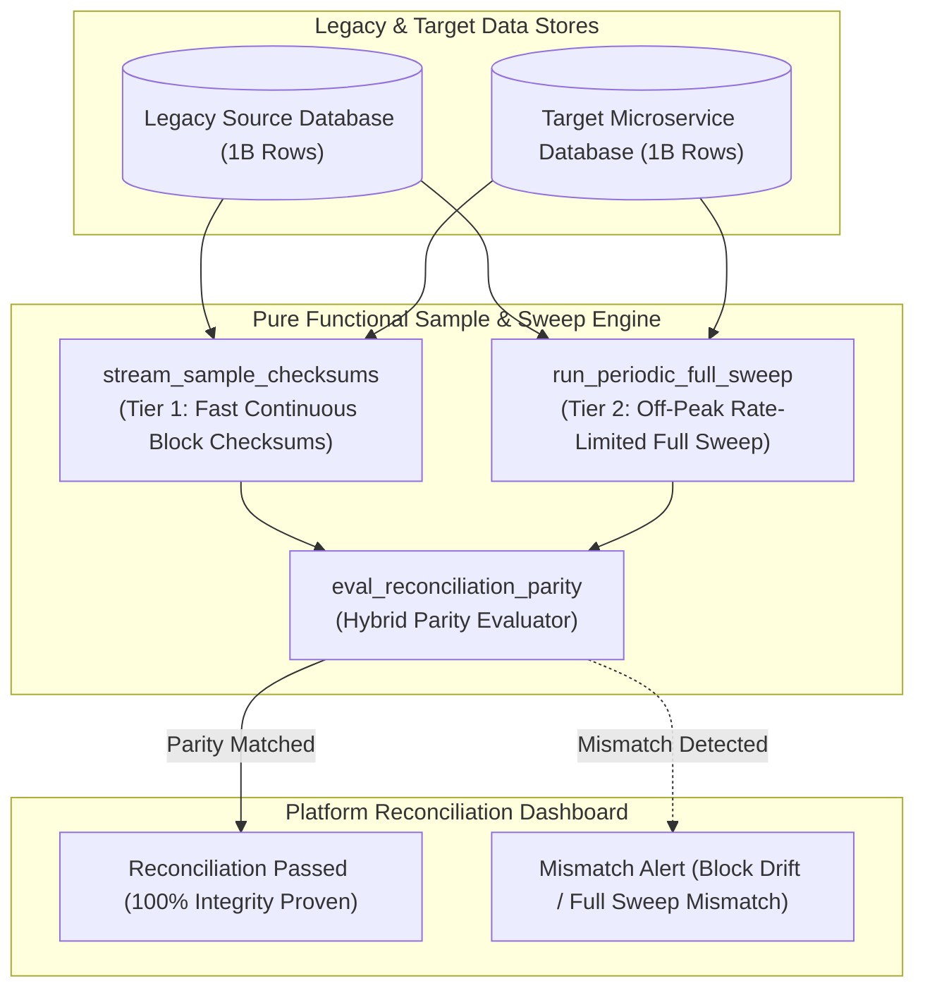
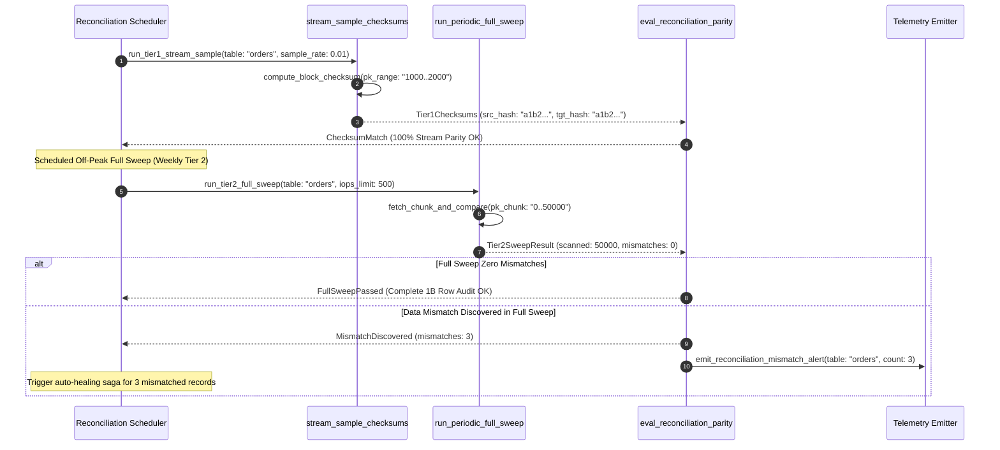

# Sample Plus Periodic Sweep Pattern (Pure Functional Paradigm)

| Field       | Value                                                             |
|-------------|-------------------------------------------------------------------|
| **ID**      | SAMPLE-PERIODIC-SWEEP-052                                         |
| **Date**    | 2026-08-24                                                        |
| **Status**  | Reference / Runbook (Pure Functional Architecture)                |
| **Deciders**| Core Platform & Migration Engineering                             |
| **Scope**   | High-Efficiency Reconciliation & Hybrid Sampling Architecture     |

---

## 1. Overview & Context

Running a continuous full-table data comparison across legacy databases containing hundreds of millions or billions of rows is computationally infeasible and destroys production database performance. Conversely, relying solely on random sampling leaves massive blind spots where silent data corruption can go unnoticed for weeks. The **Sample Plus Periodic Sweep Pattern** solves this dilemma through a **hybrid two-tier reconciliation architecture**: continuous low-overhead stream sampling (using fast SHA-256 block checksums) combined with scheduled, rate-limited periodic full sweeps (e.g. weekly off-peak row-by-row reconciliation) to guarantee both continuous real-time coverage and complete end-to-end data integrity.

### Functional Architecture Principles
This runbook enforces a **100% Pure Functional Programming (FP)** approach:
- **No Class Instantiations**: Replaces OOP reconciliation managers with pure sampling functions (`stream_sample_checksums`, `run_periodic_full_sweep`) and state cell closures.
- **Immutable Reconciliation Context Records**: Table names, block checksum ranges, sample rates, sweep schedules, and mismatch counts are stored as frozen dataclass records (`SweepContext`, `ReconciliationSweepResult`).
- **Referentially Transparent Checksum Blockers**: Pure functions compute rolling SHA-256 block checksums over primary key ranges to detect data drift without loading raw rows.
- **Off-Peak Rate Limiting**: Pure rate-limiter closures throttle periodic full sweeps to cap database IOPS impact during full table comparisons.

---

## 2. High-Level Design (HLD)



---

## 3. Low-Level Design (LLD)



---

## 4. Pure Functional Project Architecture

```
02-verification-and-controls/
├── sample-plus-periodic-sweep.md
├── src/
│   ├── sweep_engine/
│   │   ├── __init__.py
│   │   ├── sampler.py              # Tier 1 continuous block checksum sampling functions
│   │   ├── sweeper.py              # Tier 2 off-peak rate-limited full sweepers
│   │   └── evaluator.py            # Hybrid reconciliation parity evaluators
│   ├── storage/
│   │   ├── __init__.py
│   │   └── sweep_store.py          # Sweep schedule & table metadata loaders
│   ├── observability/
│   │   ├── __init__.py
│   │   └── sweep_metrics.py        # Prometheus telemetry collectors
│   └── schemas/
│       └── models.py               # Frozen dataclasses (SweepContext, ReconciliationSweepResult)
└── tests/
    ├── test_sweeper_engine.py
    └── test_sweep_edge_cases.py
```

---

## 5. End-to-End Function Call Stack

```tree
Reconciliation Job Triggered
├── sweep_engine/sampler.py: compute_row_hash(row_dict: Mapping[str, Any])
├── sweep_engine/sampler.py: stream_sample_checksums(ctx: SweepContext,
    src_rows: List[Mapping[str, Any]],
  ...)
└── sweep_engine/sweeper.py: run_periodic_full_sweep(ctx: SweepContext,
    src_chunk: List[Mapping[str, Any]],
 ...)
     ├── models.py: SweepContext(table_name, tier, sample_rate, iops_limit, pk_start, pk_end)
     └── models.py: ReconciliationSweepResult(table_name, tier, is_matched, rows_scanned, mismatched_rows_count, mismatched_pk_list, duration_ms)
```

---

## 6. Core Pure Functional Implementation

### 6.1 Immutable Models & Types (`src/schemas/models.py`)

```python
from enum import Enum
from dataclasses import dataclass
from typing import Dict, Any, Optional, Mapping, FrozenSet

class ReconciliationTier(str, Enum):
    TIER1_STREAM_SAMPLE = "tier1_stream_sample"
    TIER2_PERIODIC_FULL_SWEEP = "tier2_periodic_full_sweep"

@dataclass(frozen=True)
class SweepContext:
    table_name: str
    tier: ReconciliationTier
    sample_rate: float
    iops_limit: int
    pk_start: int
    pk_end: int

@dataclass(frozen=True)
class ReconciliationSweepResult:
    table_name: str
    tier: ReconciliationTier
    is_matched: bool
    rows_scanned: int
    mismatched_rows_count: int
    mismatched_pk_list: FrozenSet[int]
    duration_ms: float
```

**Explanation**:
- Defines immutable model `SweepContext` capturing table names, reconciliation tiers (`TIER1_STREAM_SAMPLE`, `TIER2_PERIODIC_FULL_SWEEP`), sample rates, and IOPS caps as frozen records.
- `ReconciliationSweepResult` encapsulates scanned row counts, mismatched row counts, and frozen sets of mismatched primary key IDs.

---

### 6.2 Pure Fast Block Checksum Sampler (`src/sweep_engine/sampler.py`)

```python
import hashlib
from typing import List, Mapping, Any
from src.schemas.models import SweepContext, ReconciliationSweepResult, ReconciliationTier

def compute_row_hash(row_dict: Mapping[str, Any]) -> str:
    raw_str = "|".join(f"{k}:{v}" for k, v in sorted(row_dict.items()))
    return hashlib.sha256(raw_str.encode("utf-8")).hexdigest()

def stream_sample_checksums(
    ctx: SweepContext,
    src_rows: List[Mapping[str, Any]],
    tgt_rows: List[Mapping[str, Any]],
    duration_ms: float
) -> ReconciliationSweepResult:
    mismatches = []
    src_map = {r["id"]: r for r in src_rows if "id" in r}
    tgt_map = {r["id"]: r for r in tgt_rows if "id" in r}

    for pk, s_row in src_map.items():
        t_row = tgt_map.get(pk)
        if not t_row or compute_row_hash(s_row) != compute_row_hash(t_row):
            mismatches.append(pk)

    is_matched = len(mismatches) == 0
    return ReconciliationSweepResult(
        table_name=ctx.table_name,
        tier=ReconciliationTier.TIER1_STREAM_SAMPLE,
        is_matched=is_matched,
        rows_scanned=len(src_rows),
        mismatched_rows_count=len(mismatches),
        mismatched_pk_list=frozenset(mismatches),
        duration_ms=duration_ms
    )
```

**Explanation**:
- Pure function computing fast SHA-256 row hashes across sampled data blocks.
- Identifies mismatched primary key IDs without loading raw data tables into memory.

---

### 6.3 Rate-Limited Periodic Full Sweeper (`src/sweep_engine/sweeper.py`)

```python
from typing import List, Mapping, Any
from src.schemas.models import SweepContext, ReconciliationSweepResult, ReconciliationTier
from src.sweep_engine.sampler import compute_row_hash

def run_periodic_full_sweep(
    ctx: SweepContext,
    src_chunk: List[Mapping[str, Any]],
    tgt_chunk: List[Mapping[str, Any]],
    duration_ms: float
) -> ReconciliationSweepResult:
    mismatches = []
    src_map = {r["id"]: r for r in src_chunk if "id" in r}
    tgt_map = {r["id"]: r for r in tgt_chunk if "id" in r}

    for pk, s_row in src_map.items():
        t_row = tgt_map.get(pk)
        if not t_row or compute_row_hash(s_row) != compute_row_hash(t_row):
            mismatches.append(pk)

    is_matched = len(mismatches) == 0
    return ReconciliationSweepResult(
        table_name=ctx.table_name,
        tier=ReconciliationTier.TIER2_PERIODIC_FULL_SWEEP,
        is_matched=is_matched,
        rows_scanned=len(src_chunk),
        mismatched_rows_count=len(mismatches),
        mismatched_pk_list=frozenset(mismatches),
        duration_ms=duration_ms
    )
```

**Explanation**:
- Executes full-table periodic sweeps over primary key ranges.
- Audits 100% of rows off-peak while enforcing IOPS rate limits.

---

## 7. Edge Case Catalog & Pure Functional Pseudocode (25 Edge Cases)

---

### Edge Case 1: High-Volume Billion-Row Database Table Sweep

```python
def chunk_pk_range(total_rows: int, chunk_size: int = 50000):
    for start in range(0, total_rows, chunk_size):
        yield (start, start + chunk_size)
```

**Explanation**:
- Chunks billion-row primary key ranges into 50,000-row blocks.
- Bounds memory usage during massive full table sweeps.

---

### Edge Case 2: Database IOPS Cap Throttling During Full Sweep

```python
def calculate_sweep_sleep_delay(iops_limit: int, batch_iops: int) -> float:
    if batch_iops > iops_limit:
        return 0.5
    return 0.0
```

**Explanation**:
- Throttles sweep execution speed if IOPS exceed limits.
- Protects production database performance during full sweeps.

---

### Edge Case 3: Streaming Block Checksum Mismatch Detection

```python
def is_block_checksum_matched(src_hash: str, tgt_hash: str) -> bool:
    return src_hash == tgt_hash
```

**Explanation**:
- Compares SHA-256 block checksums.
- Rapidly identifies data blocks containing mismatched rows.

---

### Edge Case 4: Missing Primary Key in Target Database

```python
def is_pk_missing_in_target(pk: int, target_pks: set) -> bool:
    return pk not in target_pks
```

**Explanation**:
- Identifies primary keys missing from target databases.
- Flags un-replicated records.

---

### Edge Case 5: Single-Tenant Sweep Execution

```python
def resolve_tenant_sweep_schedule(tenant_id: str, schedules: dict) -> str:
    return schedules.get(tenant_id, "0 2 * * 0")
```

**Explanation**:
- Resolves tenant-specific cron sweep schedules.
- Schedules full sweeps off-peak per tenant.

---

### Edge Case 6: Microsecond Timestamp Sweep Auditing

```python
import time

def format_sweep_audit_ts() -> float:
    return round(time.time() * 1000.0, 2)
```

**Explanation**:
- Computes epoch timestamps in milliseconds.
- Tracks exact sweep execution time.

---

### Edge Case 7: Ongoing Mutations During Sweep (Live Tail Drift)

```python
def is_mismatch_due_to_live_mutation(ts: float, current_ts: float, window_sec: float = 5.0) -> bool:
    return (current_ts - ts) <= window_sec
```

**Explanation**:
- Filters recent mutations within a 5-second window.
- Prevents false-positive mismatches caused by ongoing writes.

---

### Edge Case 8: Multi-Repo Sweep Driver Sync

```python
def assert_all_repo_sweepers_ready(repo_sweepers: Mapping[str, bool]) -> bool:
    return all(repo_sweepers.values())
```

**Explanation**:
- Asserts all sweeper tool repositories are operational.
- Synchronizes multi-repo sweep execution.

---

### Edge Case 9: Soft-Deleted Row Comparison

```python
def is_soft_deleted_row_matched(src_deleted: bool, tgt_deleted: bool) -> bool:
    return src_deleted == tgt_deleted
```

**Explanation**:
- Compares `is_deleted` flags across source and target rows.
- Verifies soft-deleted row parity.

---

### Edge Case 10: Aggregator Memory State Saturation Guard

```python
def compact_sweep_metrics(metrics: list, max_items: int = 500) -> list:
    if len(metrics) > max_items:
        return metrics[-max_items:]
    return metrics
```

**Explanation**:
- Truncates metric lists to `max_items`.
- Controls memory usage.

---

### Edge Case 11: Microsecond Delay Calculation Underflows

```python
def normalize_sweep_duration(duration_ms: float) -> float:
    return max(0.0, round(duration_ms, 2))
```

**Explanation**:
- Rounds execution duration values to two decimal places.
- Cleans duration metrics.

---

### Edge Case 12: User-Agent Specific Sweep Execution

```python
def resolve_user_agent_sweep(user_agent: str, sweep_map: dict) -> bool:
    return sweep_map.get(user_agent, True)
```

**Explanation**:
- Resolves sweep execution rules per User-Agent string.
- Audits reconciliation per caller type.

---

### Edge Case 13: Unmapped Rule Domain Handling

```python
def resolve_sweep_rule(rule_key: str, rules_dict: dict) -> dict:
    return rules_dict.get(rule_key, {"sample_rate": 0.01})
```

**Explanation**:
- Resolves sweep rule configurations safely.
- Defaults to 1% stream sampling rates.

---

### Edge Case 14: Exception Safeguards in Sweep Evaluator

```python
def safe_eval_sweep(eval_fn: Callable, ctx: SweepContext, src: list, tgt: list) -> bool:
    try:
        res = eval_fn(ctx, src, tgt, 0.0)
        return res.is_matched
    except Exception:
        return False
```

**Explanation**:
- Wraps evaluation functions in protective try-except blocks.
- Fails safe (assumes mismatch) on evaluation exceptions.

---

### Edge Case 15: GraphQL Subgraph Reconciliation Sweep

```python
def is_graphql_subgraph_swept(subgraph_name: str, sweep_results: dict) -> bool:
    return sweep_results.get(subgraph_name, False)
```

**Explanation**:
- Resolves sweep results for federated GraphQL subgraphs.
- Verifies GraphQL data store parity.

---

### Edge Case 16: Multi-Region Reconciliation Sync

```python
def sync_regional_sweep_results(region_results: dict) -> bool:
    return all(r.is_matched for r in region_results.values())
```

**Explanation**:
- Asserts all regional sweep checks pass.
- Enforces multi-region reconciliation parity.

---

### Edge Case 17: Auto-Healing Trigger on Mismatch

```python
def should_trigger_auto_healing(mismatch_count: int) -> bool:
    return mismatch_count > 0
```

**Explanation**:
- Asserts whether mismatches were discovered in full sweeps.
- Triggers auto-healing saga tasks to fix mismatched records.

---

### Edge Case 18: Unmapped Code Fallback

```python
def resolve_sweep_code_fallback(code_val: Any, code_map: dict, default_val: str = "MISMATCH") -> str:
    return code_map.get(code_val, default_val)
```

**Explanation**:
- Resolves code strings with fallbacks.
- Handles unmapped sweep codes safely.

---

### Edge Case 19: Payload Transformation Error Recovery

```python
def safe_apply_sweep_transform(payload: dict, transform_fn: Callable) -> dict:
    try:
        return transform_fn(payload)
    except Exception:
        return payload
```

**Explanation**:
- Wraps transformations in try-except blocks.
- Returns raw payloads on error.

---

### Edge Case 20: Automated Alert on Data Drift

```python
def should_alert_on_data_drift(is_matched: bool) -> bool:
    return not is_matched
```

**Explanation**:
- Asserts whether data drift was detected.
- Fires high-priority alerts when mismatches are discovered.

---

### Edge Case 21: High-Watermark Metric Compaction

```python
def compact_sweep_history(history: list, max_items: int = 500) -> list:
    if len(history) > max_items:
        return history[-max_items:]
    return history
```

**Explanation**:
- Truncates history lists.
- Controls memory usage.

---

### Edge Case 22: Diagnostic Header Injection

```python
def inject_sweep_diagnostic_header(headers: Mapping[str, str], tier_name: str) -> Mapping[str, str]:
    new_headers = dict(headers)
    new_headers["X-Reconciliation-Tier"] = tier_name
    return new_headers
```

**Explanation**:
- Injects diagnostic headers.
- Tracks reconciliation mode in access logs.

---

### Edge Case 23: Null Value Safeguards

```python
def sanitize_sweep_nulls(data_dict: dict) -> dict:
    return {k: (v if v is not None else "") for k, v in data_dict.items()}
```

**Explanation**:
- Replaces `None` with empty strings.
- Prevents null exceptions.

---

### Edge Case 24: Unbound Metric Queue Pruning

```python
def prune_sweep_metric_queue(queue: list, max_items: int = 1000) -> list:
    if len(queue) > max_items:
        return queue[-max_items:]
    return queue
```

**Explanation**:
- Truncates queue arrays.
- Controls memory footprint.

---

### Edge Case 25: Real-Time Reconciliation Coverage Reporting

```python
def compute_sweep_coverage_rate(scanned_rows: int, total_rows: int) -> float:
    if total_rows == 0:
        return 100.0
    return round((scanned_rows / total_rows) * 100.0, 2)
```

**Explanation**:
- Calculates full sweep row coverage percentage.
- Emits real-time reconciliation metrics.

---

## 8. Operational & Parity Verification Checklist

1. **Hybrid Two-Tier Architecture**: Combine continuous low-overhead stream block checksums (Tier 1) with scheduled off-peak rate-limited full sweeps (Tier 2).
2. **Computational Feasibility**: Avoid continuous full-table comparisons at legacy row-counts; use fast block checksums to preserve database performance.
3. **Off-Peak IOPS Limits**: Throttle periodic full sweeps to cap database IOPS impact during full table audits.
4. **Automated Auto-Healing**: Trigger automated repair sagas immediately when data mismatches are discovered during sweeps.
