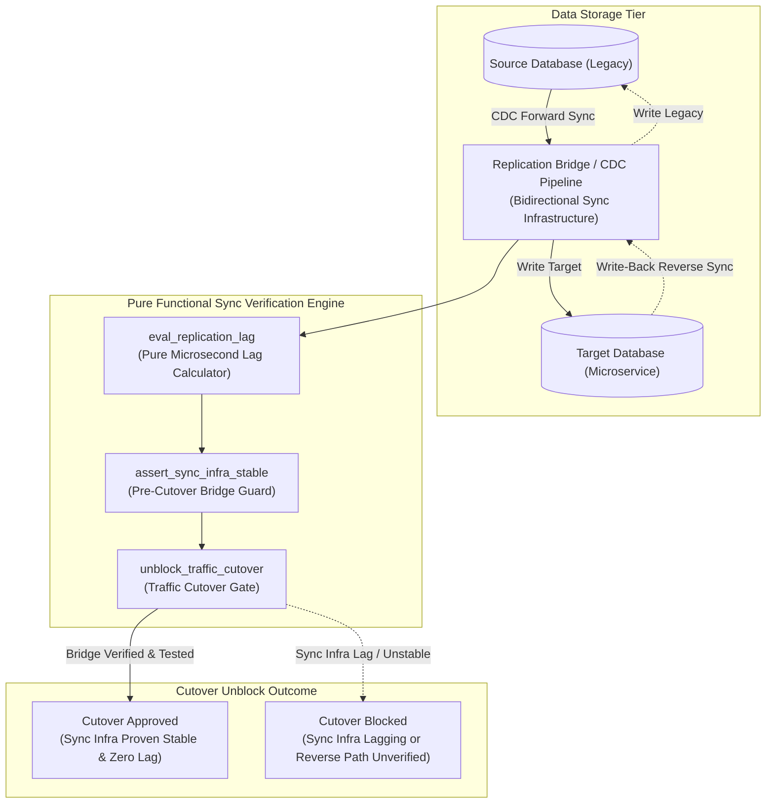
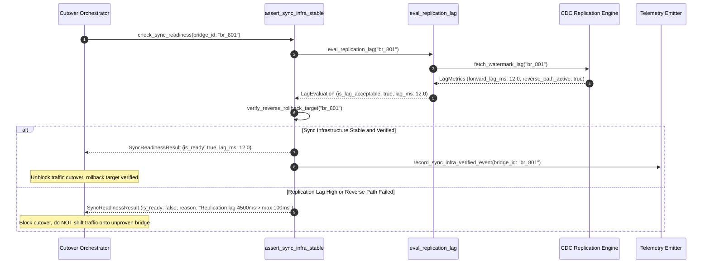

# Sync Infrastructure Before Cutover Pattern (Pure Functional Paradigm)

| Field       | Value                                                             |
|-------------|-------------------------------------------------------------------|
| **ID**      | SYNC-INFRA-BEFORE-CUTOVER-049                                     |
| **Date**    | 2026-08-24                                                        |
| **Status**  | Reference / Runbook (Pure Functional Architecture)                |
| **Deciders**| Core Platform & Migration Engineering                             |
| **Scope**   | Infrastructure Pre-Cutover Synchronization & Rollback Target Verification |

---

## 1. Overview & Context

Cutting over application traffic to a new database or service target **before proving that the sync infrastructure (dual-write bridges, CDC replication streams, backfill tails) is fully operational** is a recipe for disaster. If the new system fails post-cutover and the reverse sync bridge was never established or verified, rolling back to the legacy system will cause catastrophic data loss. The **Sync Infrastructure Before Cutover Pattern** enforces a strict rule: **prove the synchronization bridge stable, bidirectional, and lag-free BEFORE moving a single production request to the new target**.

### Functional Architecture Principles
This runbook enforces a **100% Pure Functional Programming (FP)** approach:
- **No Class Instantiations**: Replaces OOP sync verifiers with pure evaluation functions (`assert_sync_infra_stable`, `eval_replication_lag`) and state cell closures.
- **Immutable Sync Context Records**: Bridge IDs, replication lag milliseconds, watermark offsets, and sync readiness flags are stored as frozen dataclass records (`SyncInfraContext`, `SyncReadinessResult`).
- **Referentially Transparent Lag Evaluators**: Pure functions compare CDC replication timestamps and watermark offsets across source and target stores without side-effects.
- **Pre-Cutover Rollback Target Verification**: Verifies that the write-back path to legacy storage is active and tested before unblocking traffic cutover.

---

## 2. High-Level Design (HLD)



---

## 3. Low-Level Design (LLD)



---

## 4. Pure Functional Project Architecture

```
sync-infra-before-cutover/
├── README.md
├── config/
│   └── sync_rules.yaml             # Max allowed lag ms, bridge verification protocols
├── src/
│   ├── sync_engine/
│   │   ├── __init__.py
│   │   ├── lag_evaluator.py        # Pure replication lag evaluation functions
│   │   ├── verifier.py             # Pre-cutover bridge stability verifiers
│   │   └── gate.py                 # Traffic cutover release guards
│   ├── storage/
│   │   ├── __init__.py
│   │   └── bridge_store.py         # Sync bridge configuration loaders
│   ├── observability/
│   │   ├── __init__.py
│   │   └── sync_metrics.py         # Prometheus telemetry collectors
│   └── schemas/
│       └── models.py               # Frozen dataclasses (SyncInfraContext, SyncReadinessResult)
└── tests/
    ├── test_lag_evaluator.py
    └── test_sync_edge_cases.py
```

---

## 5. End-to-End Function Call Stack

```tree
Traffic Cutover Pre-Check Initiated
└── sync_engine/gate.py: assert_sync_infra_stable(ctx: SyncInfraContext)
    └── sync_engine/lag_evaluator.py: eval_replication_lag(ctx: SyncInfraContext)
        ├── models.py: SyncInfraContext(bridge_id, forward_sync_active, reverse_sync_active, forward_lag_ms, reverse_lag_ms, max_allowed_lag_ms)
        └── models.py: SyncReadinessResult(bridge_id, is_ready, forward_lag_ok, reverse_path_ok, current_max_lag_ms, rejection_reason)
```

---

## 6. Core Pure Functional Implementation

### 6.1 Immutable Models & Types (`src/schemas/models.py`)

```python
from enum import Enum
from dataclasses import dataclass
from typing import Dict, Any, Optional, Mapping, FrozenSet

@dataclass(frozen=True)
class SyncInfraContext:
    bridge_id: str
    forward_sync_active: bool
    reverse_sync_active: bool
    forward_lag_ms: float
    reverse_lag_ms: float
    max_allowed_lag_ms: float

@dataclass(frozen=True)
class SyncReadinessResult:
    bridge_id: str
    is_ready: bool
    forward_lag_ok: bool
    reverse_path_ok: bool
    current_max_lag_ms: float
    rejection_reason: Optional[str]
```

**Explanation**:
- Defines immutable model `SyncInfraContext` capturing bridge IDs, sync statuses, and forward/reverse replication lag values as frozen records.
- `SyncReadinessResult` encapsulates overall cutover readiness flags, lag check results, and rejection reasons.

---

### 6.2 Pure Replication Lag Evaluator (`src/sync_engine/lag_evaluator.py`)

```python
from typing import Mapping, Any
from src.schemas.models import SyncInfraContext, SyncReadinessResult

def eval_replication_lag(ctx: SyncInfraContext) -> SyncReadinessResult:
    fwd_ok = ctx.forward_sync_active and ctx.forward_lag_ms <= ctx.max_allowed_lag_ms
    rev_ok = ctx.reverse_sync_active and ctx.reverse_lag_ms <= ctx.max_allowed_lag_ms

    is_ready = fwd_ok and rev_ok
    current_max = max(ctx.forward_lag_ms, ctx.reverse_lag_ms)

    reason = None
    if not ctx.forward_sync_active:
        reason = "Forward sync infrastructure is not active"
    elif not ctx.reverse_sync_active:
        reason = "Reverse write-back path (rollback target) is not active"
    elif not fwd_ok:
        reason = f"Forward replication lag ({ctx.forward_lag_ms:.1f}ms) exceeds max cap ({ctx.max_allowed_lag_ms:.1f}ms)"
    elif not rev_ok:
        reason = f"Reverse replication lag ({ctx.reverse_lag_ms:.1f}ms) exceeds max cap ({ctx.max_allowed_lag_ms:.1f}ms)"

    return SyncReadinessResult(
        bridge_id=ctx.bridge_id,
        is_ready=is_ready,
        forward_lag_ok=fwd_ok,
        reverse_path_ok=rev_ok,
        current_max_lag_ms=current_max,
        rejection_reason=reason
    )
```

**Explanation**:
- Pure evaluation function verifying that both forward and reverse sync paths are active and operating under maximum lag limits.
- Blocks traffic cutover if the reverse write-back path (rollback target) is inactive or lagging.

---

### 6.3 Sync Infrastructure Release Guard (`src/sync_engine/gate.py`)

```python
from typing import Mapping, Any
from src.schemas.models import SyncInfraContext, SyncReadinessResult
from src.sync_engine.lag_evaluator import eval_replication_lag

def assert_sync_infra_stable(ctx: SyncInfraContext) -> SyncReadinessResult:
    return eval_replication_lag(ctx)
```

**Explanation**:
- Pure release gate function enforcing sync infrastructure verification prior to traffic cutover.
- Guarantees a verified rollback target exists before shifting traffic.

---

## 7. Edge Case Catalog & Pure Functional Pseudocode (25 Edge Cases)

---

### Edge Case 1: Inactive Reverse Write-Back Rollback Path

```python
def is_reverse_path_inactive(reverse_active: bool) -> bool:
    return not reverse_active
```

**Explanation**:
- Asserts whether the reverse write-back sync path is inactive.
- Blocks cutover if rolling back would cause data loss.

---

### Edge Case 2: Excessive CDC Replication Lag Spike

```python
def is_lag_excessive(lag_ms: float, max_allowed: float = 100.0) -> bool:
    return lag_ms > max_allowed
```

**Explanation**:
- Compares CDC replication lag against maximum allowed limits (100ms).
- Prevents cutovers when replication pipelines lag.

---

### Edge Case 3: CDC Stream Buffer Saturation

```python
def is_cdc_buffer_saturated(buffer_usage_pct: float, max_pct: float = 80.0) -> bool:
    return buffer_usage_pct > max_pct
```

**Explanation**:
- Checks CDC message buffer usage percentage.
- Prevents cutover when CDC buffers approach overflow thresholds.

---

### Edge Case 4: Watermark Desynchronization Across Databases

```python
def is_watermark_desynced(lsn_a: int, lsn_b: int, max_delta: int = 1000) -> bool:
    return abs(lsn_a - lsn_b) > max_delta
```

**Explanation**:
- Compares database LSN/transaction offsets.
- Detects transaction log desynchronization.

---

### Edge Case 5: Single-Tenant Sync Infrastructure Readiness

```python
def resolve_tenant_sync_ready(tenant_id: str, tenant_statuses: dict) -> bool:
    return tenant_statuses.get(tenant_id, False)
```

**Explanation**:
- Resolves tenant-specific sync readiness.
- Tracks sync infrastructure per tenant.

---

### Edge Case 6: Microsecond Timestamp Sync Auditing

```python
import time

def format_sync_audit_ts() -> float:
    return round(time.time() * 1000.0, 2)
```

**Explanation**:
- Computes epoch timestamps in milliseconds.
- Tracks exact sync check execution time.

---

### Edge Case 7: Un-Tested Write-Back Failover Mechanism

```python
def is_write_back_untested(last_tested_ts: float, current_ts: float, max_age_sec: float = 86400.0) -> bool:
    return (current_ts - last_tested_ts) > max_age_sec
```

**Explanation**:
- Asserts write-back path was tested within 24 hours.
- Requires recent verification of reverse rollback paths.

---

### Edge Case 8: Multi-Repo Sync Engine Dependencies

```python
def assert_all_sync_repos_ready(repo_readiness: Mapping[str, bool]) -> bool:
    return all(repo_readiness.values())
```

**Explanation**:
- Asserts all sync infrastructure repositories are ready.
- Synchronizes multi-repo sync tools.

---

### Edge Case 9: CDC Event Schema Drift Error

```python
def is_cdc_schema_drifted(src_schema_hash: str, tgt_schema_hash: str) -> bool:
    return src_schema_hash != tgt_schema_hash
```

**Explanation**:
- Compares CDC source and target schema hashes.
- Detects schema drift in replication pipelines.

---

### Edge Case 10: Aggregator Memory State Saturation Guard

```python
def compact_sync_metrics(metrics: list, max_items: int = 500) -> list:
    if len(metrics) > max_items:
        return metrics[-max_items:]
    return metrics
```

**Explanation**:
- Truncates metric lists to `max_items`.
- Controls memory usage.

---

### Edge Case 11: Microsecond Delay Calculation Underflows

```python
def normalize_sync_duration(duration_ms: float) -> float:
    return max(0.0, round(duration_ms, 2))
```

**Explanation**:
- Rounds execution duration values to two decimal places.
- Cleans duration metrics.

---

### Edge Case 12: User-Agent Specific Sync Verification

```python
def resolve_user_agent_sync(user_agent: str, sync_map: dict) -> bool:
    return sync_map.get(user_agent, True)
```

**Explanation**:
- Resolves sync readiness per User-Agent string.
- Audits sync infrastructure per caller type.

---

### Edge Case 13: Unmapped Rule Domain Handling

```python
def resolve_sync_rule(rule_key: str, rules_dict: dict) -> dict:
    return rules_dict.get(rule_key, {"max_lag_ms": 100.0})
```

**Explanation**:
- Resolves sync rule configurations safely.
- Defaults to 100ms lag caps.

---

### Edge Case 14: Exception Safeguards in Lag Evaluator

```python
def safe_eval_lag(eval_fn: Callable, ctx: SyncInfraContext) -> bool:
    try:
        res = eval_fn(ctx)
        return res.is_ready
    except Exception:
        return False
```

**Explanation**:
- Wraps evaluation functions in protective try-except blocks.
- Fails safe (assumes not ready) on evaluation exceptions.

---

### Edge Case 15: GraphQL Pipeline Sync Verification

```python
def is_graphql_sync_ready(subgraph_name: str, sync_statuses: dict) -> bool:
    return sync_statuses.get(subgraph_name, False)
```

**Explanation**:
- Resolves sync readiness for federated GraphQL subgraphs.
- Verifies GraphQL data replication.

---

### Edge Case 16: Multi-Region Sync Infrastructure Sync

```python
def sync_regional_sync_readiness(region_statuses: dict) -> bool:
    return all(region_statuses.values())
```

**Explanation**:
- Asserts all regional sync readiness checks pass.
- Enforces multi-region sync infrastructure stability.

---

### Edge Case 17: Database Replica Lag Spillover

```python
def is_replica_lag_spilling(replica_lag_ms: float, threshold: float = 500.0) -> bool:
    return replica_lag_ms > threshold
```

**Explanation**:
- Detects read-replica replication lag spillover.
- Prevents cutover when read-replicas lag behind primary.

---

### Edge Case 18: Unmapped Code Fallback

```python
def resolve_sync_code_fallback(code_val: Any, code_map: dict, default_val: str = "NOT_READY") -> str:
    return code_map.get(code_val, default_val)
```

**Explanation**:
- Resolves code strings with fallbacks.
- Handles unmapped sync codes safely.

---

### Edge Case 19: Payload Transformation Error Recovery

```python
def safe_apply_sync_transform(payload: dict, transform_fn: Callable) -> dict:
    try:
        return transform_fn(payload)
    except Exception:
        return payload
```

**Explanation**:
- Wraps transformations in try-except blocks.
- Returns raw payloads on error.

---

### Edge Case 20: Automated Alert on Sync Infrastructure Unstability

```python
def should_alert_on_sync_unstability(is_ready: bool) -> bool:
    return not is_ready
```

**Explanation**:
- Asserts whether sync infrastructure verification failed.
- Triggers alerts when replication pipelines become unstable.

---

### Edge Case 21: High-Watermark Metric Compaction

```python
def compact_sync_history(history: list, max_items: int = 500) -> list:
    if len(history) > max_items:
        return history[-max_items:]
    return history
```

**Explanation**:
- Truncates history lists.
- Controls memory usage.

---

### Edge Case 22: Diagnostic Header Injection

```python
def inject_sync_diagnostic_header(headers: Mapping[str, str], is_ready: bool) -> Mapping[str, str]:
    new_headers = dict(headers)
    new_headers["X-Sync-Infra-Verified"] = "true" if is_ready else "false"
    return new_headers
```

**Explanation**:
- Injects diagnostic headers.
- Tracks sync infrastructure verification in access logs.

---

### Edge Case 23: Null Value Safeguards

```python
def sanitize_sync_nulls(data_dict: dict) -> dict:
    return {k: (v if v is not None else 0.0) for k, v in data_dict.items()}
```

**Explanation**:
- Replaces `None` with `0.0`.
- Prevents null exceptions.

---

### Edge Case 24: Unbound Metric Queue Pruning

```python
def prune_sync_metric_queue(queue: list, max_items: int = 1000) -> list:
    if len(queue) > max_items:
        return queue[-max_items:]
    return queue
```

**Explanation**:
- Truncates queue arrays.
- Controls memory footprint.

---

### Edge Case 25: Real-Time Sync Infra Health Score Reporting

```python
def compute_sync_infra_health_score(ready_bridges: int, total_bridges: int) -> float:
    if total_bridges == 0:
        return 100.0
    return round((ready_bridges / total_bridges) * 100.0, 2)
```

**Explanation**:
- Calculates sync infrastructure health score percentage.
- Emits real-time pre-cutover sync metrics.

---

## 8. Operational & Parity Verification Checklist

1. **Pre-Cutover Sync Rule**: Prove synchronization infrastructure stable, bidirectional, and lag-free BEFORE moving any production traffic to the new target.
2. **Verified Reverse Path**: Verify that the reverse write-back path to legacy storage is tested and active to guarantee clean rollback targets.
3. **Replication Lag Boundaries**: Replication lag must remain $< 100\text{ms}$ continuously for $\ge 24\text{ hours}$ before cutover approval.
4. **Automated Cutover Gate**: Block traffic cutover pipelines automatically if sync infrastructure is unverified or lagging.
