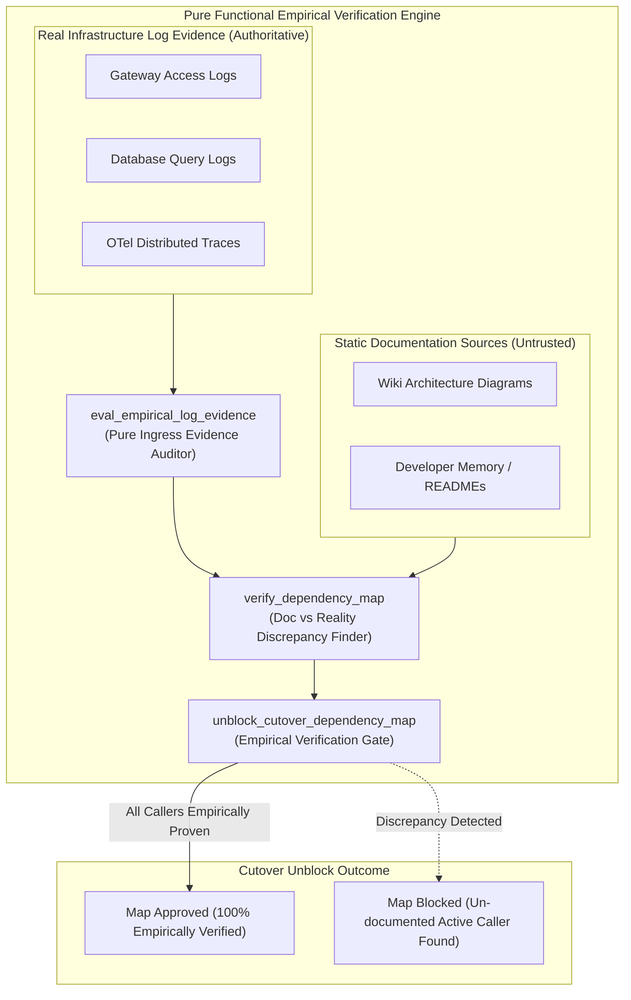
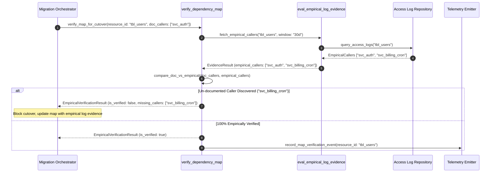

# Verify Dependency Map Empirically Pattern (Pure Functional Paradigm)

| Field       | Value                                                             |
|-------------|-------------------------------------------------------------------|
| **ID**      | VERIFY-DEPENDENCY-MAP-048                                         |
| **Date**    | 2026-08-24                                                        |
| **Status**  | Reference / Runbook (Pure Functional Architecture)                |
| **Deciders**| Core Platform & Migration Engineering                             |
| **Scope**   | Empirical Log-Based Dependency Verification & Wiki Disproval      |

---

## 1. Overview & Context

Static architecture documentation, wiki pages, and team diagrams decay rapidly in large engineering organizations. Relying on written documentation or developer memory to construct microservice dependency maps guarantees missing cold-standby callers, background cron jobs, and third-party webhooks—leading to catastrophic production outages during migration cutovers. The **Verify Dependency Map Empirically Pattern** mandates that **all dependency maps must be assumed wrong until verified empirically through real access logs, network tracing, and query audits**.

### Functional Architecture Principles
This runbook enforces a **100% Pure Functional Programming (FP)** approach:
- **No Class Instantiations**: Replaces OOP map verifiers with pure verification functions (`verify_dependency_map`, `eval_empirical_log_evidence`) and state cell closures.
- **Immutable Verification Context Records**: Dependency IDs, documented caller lists, empirically observed caller lists, and verification statuses are stored as frozen dataclass records (`DependencyVerificationContext`, `EmpiricalVerificationResult`).
- **Referentially Transparent Evidence Auditors**: Pure functions compare documented dependency claims against real ingress log streams, flagging un-documented active callers.
- **Empirical Log Dominance**: When documentation and access logs disagree, access log evidence wins without exception.

---

## 2. High-Level Design (HLD)



---

## 3. Low-Level Design (LLD)



---

## 4. Pure Functional Project Architecture

```
verify-dependency-map-empirically/
├── README.md
├── config/
│   └── verification_rules.yaml     # Log sampling windows, minimum evidence thresholds
├── src/
│   ├── verification_engine/
│   │   ├── __init__.py
│   │   ├── auditor.py              # Pure log evidence auditing functions
│   │   ├── verifier.py             # Doc vs empirical log comparison functions
│   │   └── gate.py                 # Cutover dependency map release guards
│   ├── storage/
│   │   ├── __init__.py
│   │   └── map_store.py            # Dependency map repository loaders
│   ├── observability/
│   │   ├── __init__.py
│   │   └── verification_metrics.py # Prometheus telemetry collectors
│   └── schemas/
│       └── models.py               # Frozen dataclasses (DependencyVerificationContext, EmpiricalVerificationResult)
└── tests/
    ├── test_map_verifier.py
    └── test_verification_edge_cases.py
```

---

## 5. End-to-End Function Call Stack

```tree
Dependency Map Verification Executed
└── verification_engine/gate.py: assert_dependency_map_empirically_verified(ctx: DependencyVerificationContext)
    └── verification_engine/verifier.py: verify_dependency_map(ctx: DependencyVerificationContext)
        └── verification_engine/verifier.py: compare_doc_vs_empirical(doc: FrozenSet[str], empirical: FrozenSet[str])
            ├── models.py: DependencyVerificationContext(resource_id, documented_callers, empirical_callers, log_sample_days)
            └── models.py: EmpiricalVerificationResult(resource_id, is_approved, unmapped_active_callers, stale_documented_callers, rejection_reason)
```

---

## 6. Core Pure Functional Implementation

### 6.1 Immutable Models & Types (`src/schemas/models.py`)

```python
from enum import Enum
from dataclasses import dataclass
from typing import Dict, Any, Optional, Mapping, FrozenSet

@dataclass(frozen=True)
class DependencyVerificationContext:
    resource_id: str
    documented_callers: FrozenSet[str]
    empirical_callers: FrozenSet[str]
    log_sample_days: int

@dataclass(frozen=True)
class EmpiricalVerificationResult:
    resource_id: str
    is_approved: bool
    unmapped_active_callers: FrozenSet[str]
    stale_documented_callers: FrozenSet[str]
    rejection_reason: Optional[str]
```

**Explanation**:
- Defines immutable model `DependencyVerificationContext` capturing documented vs empirical caller sets as frozen records.
- `EmpiricalVerificationResult` encapsulates approval flags, unmapped active caller sets, and stale caller sets.

---

### 6.2 Pure Empirical Map Verifier (`src/verification_engine/verifier.py`)

```python
from typing import FrozenSet, Mapping, Any
from src.schemas.models import DependencyVerificationContext, EmpiricalVerificationResult

def compare_doc_vs_empirical(doc: FrozenSet[str], empirical: FrozenSet[str]) -> Mapping[str, Any]:
    unmapped = empirical.difference(doc)
    stale = doc.difference(empirical)
    return {
        "unmapped_callers": unmapped,
        "stale_callers": stale,
        "is_complete": len(unmapped) == 0
    }

def verify_dependency_map(ctx: DependencyVerificationContext) -> EmpiricalVerificationResult:
    comp = compare_doc_vs_empirical(ctx.documented_callers, ctx.empirical_callers)
    unmapped = comp["unmapped_callers"]
    stale = comp["stale_callers"]
    is_approved = comp["is_complete"]

    reason = None
    if not is_approved:
        caller_names = ", ".join(unmapped)
        reason = f"Unmapped active callers discovered in access logs: [{caller_names}]. Documentation is wrong; logs win."

    return EmpiricalVerificationResult(
        resource_id=ctx.resource_id,
        is_approved=is_approved,
        unmapped_active_callers=unmapped,
        stale_documented_callers=stale,
        rejection_reason=reason
    )
```

**Explanation**:
- Compares documented caller lists against empirically observed caller sets from access logs.
- Rejects dependency maps that fail to account for real active callers discovered in logs.

---

### 6.3 Empirical Map Release Guard (`src/verification_engine/gate.py`)

```python
from typing import Mapping, Any
from src.schemas.models import DependencyVerificationContext, EmpiricalVerificationResult
from src.verification_engine.verifier import verify_dependency_map

def assert_dependency_map_empirically_verified(ctx: DependencyVerificationContext) -> EmpiricalVerificationResult:
    return verify_dependency_map(ctx)
```

**Explanation**:
- Pure release gate function enforcing empirical dependency verification before unblocking cutover pipelines.
- Guarantees documentation is disproven by empirical log evidence when conflicts occur.

---

## 7. Edge Case Catalog & Pure Functional Pseudocode (25 Edge Cases)

---

### Edge Case 1: Un-Documented Batch Cron Job Caller

```python
def is_batch_cron_unmapped(empirical_caller: str, doc_callers: set) -> bool:
    return "cron" in empirical_caller and empirical_caller not in doc_callers
```

**Explanation**:
- Identifies un-documented batch cron callers.
- Catches scheduled jobs missed by developer documentation.

---

### Edge Case 2: Stale Documentation Listing Decommissioned Service

```python
def is_doc_caller_stale(doc_caller: str, empirical_callers: set) -> bool:
    return doc_caller not in empirical_callers
```

**Explanation**:
- Identifies documented callers that show zero activity in access logs.
- Cleans stale entries from dependency maps.

---

### Edge Case 3: Insufficient Log Sampling Window

```python
def is_sample_window_insufficient(sample_days: int, min_required: int = 30) -> bool:
    return sample_days < min_required
```

**Explanation**:
- Asserts log sampling duration is at least 30 days.
- Prevents missing monthly batch callers.

---

### Edge Case 4: Un-authenticated Perimeter Gateway Caller

```python
def is_perimeter_caller_unmapped(ip: str, doc_ips: set) -> bool:
    return ip not in doc_ips
```

**Explanation**:
- Compares caller IP addresses against documented IP lists.
- Discovers un-documented external caller IPs.

---

### Edge Case 5: Single-Tenant Dependency Verification

```python
def resolve_tenant_map_status(tenant_id: str, map_statuses: dict) -> bool:
    return map_statuses.get(tenant_id, False)
```

**Explanation**:
- Resolves tenant-specific map verification statuses.
- Tracks empirical verification per tenant.

---

### Edge Case 6: Microsecond Timestamp Verification Timing

```python
import time

def format_verification_audit_ts() -> float:
    return round(time.time() * 1000.0, 2)
```

**Explanation**:
- Computes epoch timestamps in milliseconds.
- Tracks exact verification check execution time.

---

### Edge Case 7: Discarded Debug Probes Misclassified as Active Callers

```python
def is_debug_probe_filtered(caller_name: str, probe_patterns: set = {"healthcheck", "ping"}) -> bool:
    return any(pat in caller_name.lower() for pat in probe_patterns)
```

**Explanation**:
- Filters infrastructure healthcheck probes from caller maps.
- Prevents noise in empirical dependency maps.

---

### Edge Case 8: Multi-Repo Dependency Map Consolidation

```python
def consolidate_repo_dependency_maps(repo_maps: list) -> set:
    all_callers = set()
    for m in repo_maps:
        all_callers.update(m.get("callers", set()))
    return all_callers
```

**Explanation**:
- Merges empirical caller sets across repositories.
- Consolidates workspace-wide dependency maps.

---

### Edge Case 9: Shared Database User Account Obscuring Caller Identity

```python
def is_shared_db_user_obscured(db_user: str) -> bool:
    return db_user in {"postgres", "root", "admin"}
```

**Explanation**:
- Flags generic shared database user accounts (`postgres`, `root`).
- Forces IP/tracing analysis to resolve real service identities.

---

### Edge Case 10: Aggregator Memory State Saturation Guard

```python
def compact_verification_metrics(metrics: list, max_items: int = 500) -> list:
    if len(metrics) > max_items:
        return metrics[-max_items:]
    return metrics
```

**Explanation**:
- Truncates metric lists to `max_items`.
- Controls memory usage.

---

### Edge Case 11: Microsecond Delay Calculation Underflows

```python
def normalize_verification_duration(duration_ms: float) -> float:
    return max(0.0, round(duration_ms, 2))
```

**Explanation**:
- Rounds execution duration values to two decimal places.
- Cleans duration metrics.

---

### Edge Case 12: User-Agent Application Identification

```python
def parse_verification_user_agent(headers: Mapping[str, str]) -> str:
    return headers.get("User-Agent", "Unknown-Caller")
```

**Explanation**:
- Extracts User-Agent strings.
- Identifies empirical callers by HTTP User-Agent.

---

### Edge Case 13: Unmapped Rule Domain Handling

```python
def resolve_verification_rule(rule_key: str, rules_dict: dict) -> dict:
    return rules_dict.get(rule_key, {"strict_verification": True})
```

**Explanation**:
- Resolves verification rule configurations safely.
- Defaults to strict verification rules.

---

### Edge Case 14: Exception Safeguards in Map Verifier

```python
def safe_verify_map(verify_fn: Callable, ctx: DependencyVerificationContext) -> bool:
    try:
        res = verify_fn(ctx)
        return res.is_approved
    except Exception:
        return False
```

**Explanation**:
- Wraps verification functions in protective try-except blocks.
- Fails safe (assumes unverified) on evaluation exceptions.

---

### Edge Case 15: GraphQL Subgraph Empirical Caller Verification

```python
def is_graphql_caller_empirically_verified(subgraph_name: str, verified_subgraphs: set) -> bool:
    return subgraph_name in verified_subgraphs
```

**Explanation**:
- Verifies empirical callers for federated GraphQL subgraphs.
- Supports GraphQL dependency map verification.

---

### Edge Case 16: Multi-Region Map Synchronization

```python
def sync_regional_verification_statuses(region_statuses: dict) -> bool:
    return all(region_statuses.values())
```

**Explanation**:
- Asserts all regional map verification checks pass.
- Enforces multi-region empirical verification.

---

### Edge Case 17: Infrequent Disaster Recovery Caller Verification

```python
def is_dr_caller_unmapped(caller_name: str, doc_callers: set) -> bool:
    return "dr_standby" in caller_name and caller_name not in doc_callers
```

**Explanation**:
- Identifies disaster recovery standby services missing from documentation.
- Ensures DR services are mapped before cutover.

---

### Edge Case 18: Unmapped Code Fallback

```python
def resolve_verification_code_fallback(code_val: Any, code_map: dict, default_val: str = "UNVERIFIED") -> str:
    return code_map.get(code_val, default_val)
```

**Explanation**:
- Resolves code strings with fallbacks.
- Handles unmapped verification codes safely.

---

### Edge Case 19: Payload Transformation Error Recovery

```python
def safe_apply_verification_transform(payload: dict, transform_fn: Callable) -> dict:
    try:
        return transform_fn(payload)
    except Exception:
        return payload
```

**Explanation**:
- Wraps transformations in try-except blocks.
- Returns raw payloads on error.

---

### Edge Case 20: Automated Alert on Unmapped Active Caller Discovery

```python
def should_alert_on_unmapped_caller(unmapped_count: int) -> bool:
    return unmapped_count > 0
```

**Explanation**:
- Asserts whether unmapped callers were discovered in logs.
- Triggers alerts when documentation disagrees with empirical log evidence.

---

### Edge Case 21: High-Watermark Metric Compaction

```python
def compact_verification_history(history: list, max_items: int = 500) -> list:
    if len(history) > max_items:
        return history[-max_items:]
    return history
```

**Explanation**:
- Truncates history lists.
- Controls memory usage.

---

### Edge Case 22: Diagnostic Header Injection

```python
def inject_verification_diagnostic_header(headers: Mapping[str, str], is_verified: bool) -> Mapping[str, str]:
    new_headers = dict(headers)
    new_headers["X-Dependency-Map-Verified"] = "true" if is_verified else "false"
    return new_headers
```

**Explanation**:
- Injects diagnostic headers.
- Tracks dependency map verification status in access logs.

---

### Edge Case 23: Null Value Safeguards

```python
def sanitize_verification_nulls(data_dict: dict) -> dict:
    return {k: (v if v is not None else "") for k, v in data_dict.items()}
```

**Explanation**:
- Replaces `None` with empty strings.
- Prevents null exceptions.

---

### Edge Case 24: Unbound Metric Queue Pruning

```python
def prune_verification_metric_queue(queue: list, max_items: int = 1000) -> list:
    if len(queue) > max_items:
        return queue[-max_items:]
    return queue
```

**Explanation**:
- Truncates queue arrays.
- Controls memory footprint.

---

### Edge Case 25: Real-Time Dependency Map Completeness Rate Reporting

```python
def compute_map_completeness_rate(verified_maps: int, total_maps: int) -> float:
    if total_maps == 0:
        return 100.0
    return round((verified_maps / total_maps) * 100.0, 2)
```

**Explanation**:
- Calculates empirical map completeness rate percentage.
- Emits real-time dependency map verification metrics.

---

## 8. Operational & Parity Verification Checklist

1. **Empirical Log Dominance**: When written documentation and access logs disagree, access log evidence wins without exception.
2. **Mandatory 30-Day Sampling**: Require at least 30 days of continuous access/query log auditing to capture monthly batch cron callers.
3. **100% Unmapped Caller Resolution**: Block production cutovers until all active callers discovered in access logs are formally identified and accounted for.
4. **CI Dependency Gate**: Integrate empirical log verification into release pipelines to block unverified cutovers.
