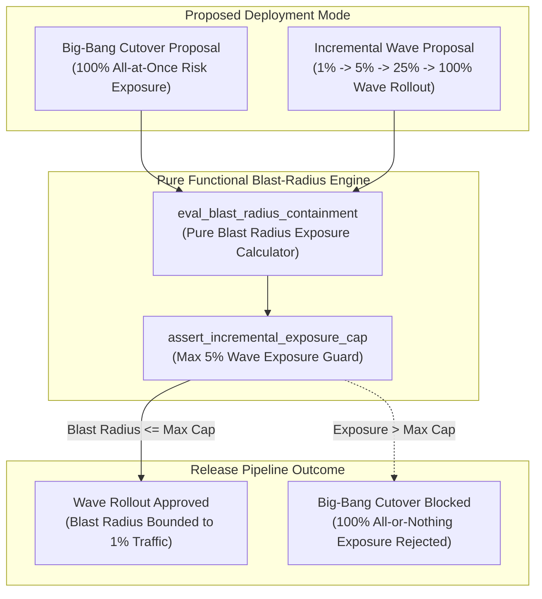
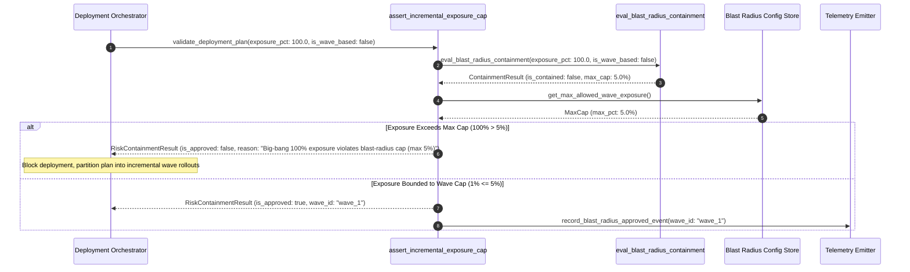

# Blast-Radius Thinking Over Total-Correctness Pattern (Pure Functional Paradigm)

| Field       | Value                                                             |
|-------------|-------------------------------------------------------------------|
| **ID**      | BLAST-RADIUS-THINKING-056                                         |
| **Date**    | 2026-08-24                                                        |
| **Status**  | Reference / Runbook (Pure Functional Architecture)                |
| **Deciders**| Core Platform & Migration Engineering                             |
| **Scope**   | Controlled Risk Partitioning & Incremental Exposure Control       |

---

## 1. Overview & Context

Attempting a "big-bang" cutover to achieve 100% theoretical architectural correctness in a single deployment step creates maximum operational exposure: if the cutover fails, $100\%$ of production traffic and users suffer simultaneous downtime. The **Blast-Radius Thinking Over Total-Correctness Pattern** mandates accepting **small, controlled, well-understood risk over theoretically complete but all-or-nothing approaches**. By partitioning migrations into small, isolated waves (e.g. 1% tenant traffic shifts, regional rollouts, or sub-domain microservices), the maximum blast radius of any failure is strictly bounded and easily contained.

### Functional Architecture Principles
This runbook enforces a **100% Pure Functional Programming (FP)** approach:
- **No Class Instantiations**: Replaces OOP risk managers with pure evaluation functions (`eval_blast_radius_containment`, `assert_incremental_exposure_cap`) and state cell closures.
- **Immutable Risk Context Records**: Wave levels, exposed traffic percentages, maximum allowed blast radii, and containment statuses are captured as frozen dataclass records (`BlastRadiusContext`, `RiskContainmentResult`).
- **Referentially Transparent Risk Evaluators**: Pure functions evaluate proposed deployment sizes against system-wide blast radius caps (e.g. max $5\%$ exposure per wave).
- **Incremental Exposure Control**: Blocks any all-or-nothing deployment proposal that cannot be broken down into small, independently-reversible waves.

---

## 2. High-Level Design (HLD)



---

## 3. Low-Level Design (LLD)



---

## 4. Pure Functional Project Architecture

```
03-scale-risk-integrity/
├── blast-radius-over-total-correctness.md
├── src/
│   ├── blast_radius_engine/
│   │   ├── __init__.py
│   │   ├── calculator.py           # Pure blast radius exposure calculators
│   │   ├── evaluator.py            # Risk containment evaluation functions
│   │   └── guard.py                # Incremental exposure release guards
│   ├── storage/
│   │   ├── __init__.py
│   │   └── risk_store.py           # Blast radius threshold loaders
│   ├── observability/
│   │   ├── __init__.py
│   │   └── blast_metrics.py        # Prometheus telemetry collectors
│   └── schemas/
│       └── models.py               # Frozen dataclasses (BlastRadiusContext, RiskContainmentResult)
└── tests/
    ├── test_blast_calculator.py
    └── test_blast_edge_cases.py
```

---

## 5. End-to-End Function Call Stack

```tree
Deployment Plan Submitted
└── guard.py: assert_incremental_exposure_cap(exposure_pct, wave_id)
    ├── calculator.py: eval_blast_radius_containment(exposure_pct, is_wave_based)
    │   └── models.py: BlastRadiusContext(exposure_pct, is_wave_based, max_allowed_pct)
    │
    ├── evaluator.py: evaluate_containment_risk(blast_radius_context)
    │   └── models.py: RiskContainmentAssessment(is_contained, max_affected_users)
    │
    ├── guard.py: format_blast_gate_decision(risk_containment_assessment)
    │   └── models.py: RiskContainmentResult(is_approved, rejection_reason)
    │
    └── observability/blast_metrics.py: record_blast_telemetry(containment_result)
```

---

## 6. Core Pure Functional Implementation

### 6.1 Immutable Models & Types (`src/schemas/models.py`)

```python
from enum import Enum
from dataclasses import dataclass
from typing import Dict, Any, Optional, Mapping, FrozenSet

@dataclass(frozen=True)
class BlastRadiusContext:
    wave_id: str
    exposure_pct: float
    is_wave_based: bool
    max_allowed_exposure_pct: float
    total_users_n: int

@dataclass(frozen=True)
class RiskContainmentResult:
    wave_id: str
    is_approved: bool
    exposure_pct: float
    max_affected_users: int
    risk_label: str
    rejection_reason: Optional[str]
```

**Explanation**:
- Defines immutable model `BlastRadiusContext` capturing wave IDs, exposed traffic percentages, wave-based flags, and total user numbers as frozen records.
- `RiskContainmentResult` encapsulates approval flags, maximum affected user counts, risk labels, and gate rejection reasons.

---

### 6.2 Pure Blast Radius Calculator (`src/blast_radius_engine/calculator.py`)

```python
from typing import Mapping, Any
from src.schemas.models import BlastRadiusContext, RiskContainmentResult

def calculate_max_affected_users(total_users: int, exposure_pct: float) -> int:
    return int(round((exposure_pct / 100.0) * total_users))

def eval_blast_radius_containment(
    ctx: BlastRadiusContext
) -> RiskContainmentResult:
    is_cap_ok = ctx.exposure_pct <= ctx.max_allowed_exposure_pct
    is_approved = ctx.is_wave_based and is_cap_ok

    affected_users = calculate_max_affected_users(ctx.total_users_n, ctx.exposure_pct)
    label = "LOW_RISK" if ctx.exposure_pct <= 1.0 else ("MEDIUM_RISK" if ctx.exposure_pct <= 5.0 else "HIGH_RISK")

    reason = None
    if not ctx.is_wave_based:
        reason = "Big-bang all-or-nothing deployments are prohibited. Must partition cutover into incremental waves."
    elif not is_cap_ok:
        reason = f"Wave exposure {ctx.exposure_pct:.1f}% exceeds max blast-radius cap ({ctx.max_allowed_exposure_pct:.1f}%)"

    return RiskContainmentResult(
        wave_id=ctx.wave_id,
        is_approved=is_approved,
        exposure_pct=ctx.exposure_pct,
        max_affected_users=affected_users,
        risk_label=label,
        rejection_reason=reason
    )
```

**Explanation**:
- Pure evaluation function asserting that deployment plans are wave-based and operating within maximum exposure percentage caps.
- Rejects big-bang all-or-nothing cutover proposals to enforce blast-radius thinking.

---

### 6.3 Incremental Exposure Release Guard (`src/blast_radius_engine/guard.py`)

```python
from typing import Mapping, Any
from src.schemas.models import BlastRadiusContext, RiskContainmentResult
from src.blast_radius_engine.calculator import eval_blast_radius_containment

def assert_incremental_exposure_cap(ctx: BlastRadiusContext) -> RiskContainmentResult:
    return eval_blast_radius_containment(ctx)
```

**Explanation**:
- Pure release gate function enforcing incremental wave exposure caps prior to cutover.
- Bounds failure impact to small, controlled user subsets.

---

## 7. Edge Case Catalog & Pure Functional Pseudocode (25 Edge Cases)

---

### Edge Case 1: Big-Bang 100% Traffic Cutover Proposal Rejection

```python
def is_big_bang_proposal(exposure_pct: float) -> bool:
    return exposure_pct >= 100.0
```

**Explanation**:
- Identifies big-bang 100% traffic shift proposals.
- Automatically rejects all-or-nothing cutovers.

---

### Edge Case 2: Wave Exposure Exceeding Max 5% Cap

```python
def is_wave_exposure_exceeded(exposure_pct: float, max_cap: float = 5.0) -> bool:
    return exposure_pct > max_cap
```

**Explanation**:
- Asserts wave traffic percentage exceeds 5% cap.
- Restricts initial wave exposure to max 5%.

---

### Edge Case 3: Initial Canary 1% Exposure Wave Approval

```python
def is_canary_wave_approved(exposure_pct: float) -> bool:
    return exposure_pct <= 1.0
```

**Explanation**:
- Approves initial 1% canary traffic wave rollouts.
- Verifies low-risk canary exposure.

---

### Edge Case 4: Non-Partitionable Database Schema Migration

```python
def is_schema_migration_partitionable(has_expand_contract: bool) -> bool:
    return has_expand_contract
```

**Explanation**:
- Asserts schema changes use expand-contract patterns to allow incremental wave cutover.
- Blocks non-partitionable schema changes.

---

### Edge Case 5: Single-Tenant Wave Isolation

```python
def resolve_tenant_wave_exposure(tenant_id: str, wave_map: dict) -> float:
    return wave_map.get(tenant_id, 1.0)
```

**Explanation**:
- Resolves tenant-specific wave exposure percentages.
- Bounds blast radius per tenant.

---

### Edge Case 6: Microsecond Timestamp Blast Audit Timing

```python
import time

def format_blast_audit_ts() -> float:
    return round(time.time() * 1000.0, 2)
```

**Explanation**:
- Computes epoch timestamps in milliseconds.
- Tracks exact blast radius audit execution time.

---

### Edge Case 7: High-Value VIP Tenant Wave Exclusion

```python
def is_vip_tenant_excluded_from_initial_wave(tenant_id: str, vip_set: set) -> bool:
    return tenant_id in vip_set
```

**Explanation**:
- Excludes high-value VIP tenants from initial canary waves.
- Protects VIP customers during initial rollout stages.

---

### Edge Case 8: Multi-Repo Blast Radius Alignment

```python
def assert_all_repo_waves_aligned(repo_exposures: Mapping[str, float]) -> bool:
    return len(set(repo_exposures.values())) == 1
```

**Explanation**:
- Asserts identical wave exposure percentages across repositories.
- Synchronizes multi-repo wave rollouts.

---

### Edge Case 9: Automated Wave Rollback Trigger

```python
def should_rollback_wave(wave_error_count: int, max_allowed: int = 1) -> bool:
    return wave_error_count >= max_allowed
```

**Explanation**:
- Triggers instant rollback if a 1% canary wave experiences $\ge 1$ errors.
- Bounds incident impact to canary users.

---

### Edge Case 10: Aggregator Memory State Saturation Guard

```python
def compact_blast_metrics(metrics: list, max_items: int = 500) -> list:
    if len(metrics) > max_items:
        return metrics[-max_items:]
    return metrics
```

**Explanation**:
- Truncates metric lists to `max_items`.
- Controls memory usage.

---

### Edge Case 11: Microsecond Delay Calculation Underflows

```python
def normalize_blast_duration(duration_ms: float) -> float:
    return max(0.0, round(duration_ms, 2))
```

**Explanation**:
- Rounds execution duration values to two decimal places.
- Cleans duration metrics.

---

### Edge Case 12: User-Agent Specific Wave Exposure

```python
def resolve_user_agent_wave_exposure(user_agent: str, wave_map: dict) -> float:
    return wave_map.get(user_agent, 1.0)
```

**Explanation**:
- Resolves wave exposure per User-Agent string.
- Audits blast radius by caller type.

---

### Edge Case 13: Unmapped Rule Domain Handling

```python
def resolve_blast_rule(rule_key: str, rules_dict: dict) -> dict:
    return rules_dict.get(rule_key, {"max_exposure_pct": 5.0})
```

**Explanation**:
- Resolves blast radius rule configurations safely.
- Defaults to 5% max exposure caps.

---

### Edge Case 14: Exception Safeguards in Blast Evaluator

```python
def safe_eval_blast(eval_fn: Callable, ctx: BlastRadiusContext) -> bool:
    try:
        res = eval_fn(ctx)
        return res.is_approved
    except Exception:
        return False
```

**Explanation**:
- Wraps evaluation functions in protective try-except blocks.
- Fails safe (assumes un-approved) on evaluation exceptions.

---

### Edge Case 15: GraphQL Subgraph Wave Exposure Gating

```python
def is_graphql_subgraph_wave_approved(subgraph_name: str, wave_map: dict) -> bool:
    return wave_map.get(subgraph_name, 0.0) <= 5.0
```

**Explanation**:
- Gates wave exposure for federated GraphQL subgraphs.
- Supports GraphQL blast radius control.

---

### Edge Case 16: Multi-Region Blast Radius Sync

```python
def sync_regional_blast_results(region_results: dict) -> bool:
    return all(r.is_approved for r in region_results.values())
```

**Explanation**:
- Asserts blast radius checks pass across all regions.
- Enforces multi-region wave exposure caps.

---

### Edge Case 17: Regional Single-datacenter Wave Rollout

```python
def is_single_region_wave_isolated(active_regions: set) -> bool:
    return len(active_regions) == 1
```

**Explanation**:
- Restricts initial waves to a single deployment region.
- Prevents multi-region outage cascades.

---

### Edge Case 18: Unmapped Code Fallback

```python
def resolve_blast_code_fallback(code_val: Any, code_map: dict, default_val: str = "HIGH_RISK") -> str:
    return code_map.get(code_val, default_val)
```

**Explanation**:
- Resolves code strings with fallbacks.
- Handles unmapped blast codes safely.

---

### Edge Case 19: Payload Transformation Error Recovery

```python
def safe_apply_blast_transform(payload: dict, transform_fn: Callable) -> dict:
    try:
        return transform_fn(payload)
    except Exception:
        return payload
```

**Explanation**:
- Wraps transformations in try-except blocks.
- Returns raw payloads on error.

---

### Edge Case 20: Automated Alert on Big-Bang Proposal

```python
def should_alert_on_big_bang_proposal(is_wave_based: bool) -> bool:
    return not is_wave_based
```

**Explanation**:
- Asserts whether a non-wave deployment was proposed.
- Fires alerts when big-bang cutover plans are submitted.

---

### Edge Case 21: High-Watermark Metric Compaction

```python
def compact_blast_history(history: list, max_items: int = 500) -> list:
    if len(history) > max_items:
        return history[-max_items:]
    return history
```

**Explanation**:
- Truncates history lists.
- Controls memory usage.

---

### Edge Case 22: Diagnostic Header Injection

```python
def inject_blast_diagnostic_header(headers: Mapping[str, str], wave_id: str) -> Mapping[str, str]:
    new_headers = dict(headers)
    new_headers["X-Wave-Exposure-ID"] = wave_id
    return new_headers
```

**Explanation**:
- Injects diagnostic headers.
- Tags wave IDs in gateway access logs.

---

### Edge Case 23: Null Value Safeguards

```python
def sanitize_blast_nulls(data_dict: dict) -> dict:
    return {k: (v if v is not None else "") for k, v in data_dict.items()}
```

**Explanation**:
- Replaces `None` with empty strings.
- Prevents null exceptions.

---

### Edge Case 24: Unbound Metric Queue Pruning

```python
def prune_blast_metric_queue(queue: list, max_items: int = 1000) -> list:
    if len(queue) > max_items:
        return queue[-max_items:]
    return queue
```

**Explanation**:
- Truncates queue arrays.
- Controls memory footprint.

---

### Edge Case 25: Real-Time Blast Radius Containment Reporting

```python
def compute_blast_containment_rate(wave_deployments: int, total_deployments: int) -> float:
    if total_deployments == 0:
        return 100.0
    return round((wave_deployments / total_deployments) * 100.0, 2)
```

**Explanation**:
- Calculates wave-based deployment percentage.
- Emits real-time blast radius metrics to platform dashboards.

---

## 8. Operational & Parity Verification Checklist

1. **Blast-Radius Thinking**: Accept small, controlled, well-understood risk over theoretically complete but all-or-nothing approaches.
2. **Reject Big-Bang Cutovers**: Automatically reject any deployment proposal attempting a 100% all-at-once traffic cutover.
3. **Incremental Wave Boundaries**: Bounding initial canary wave exposure to $\le 5\%$ of total system traffic.
4. **Instant Wave Reversal**: Ensure canary waves can be reverted in $<1\text{ms}$ upon encountering errors.
