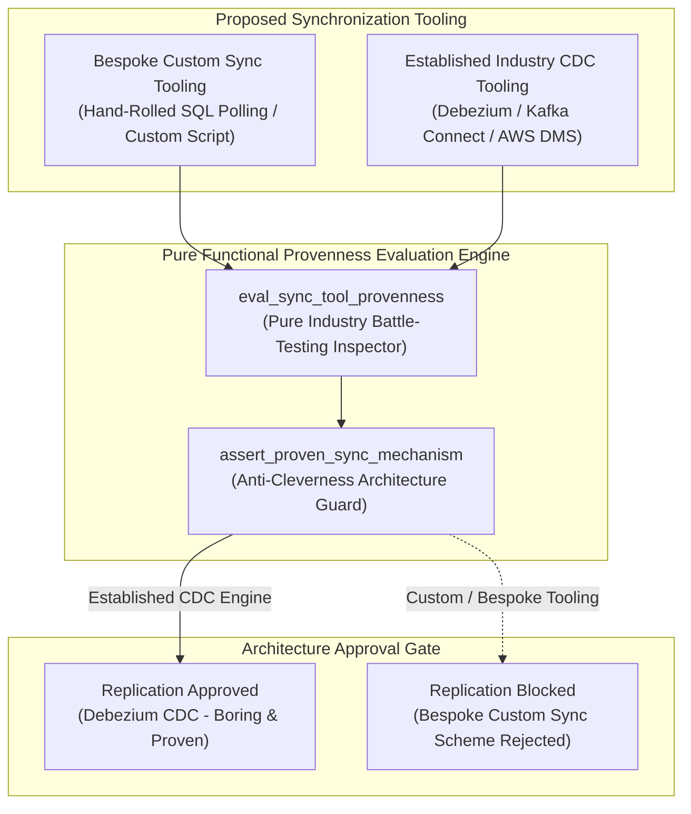
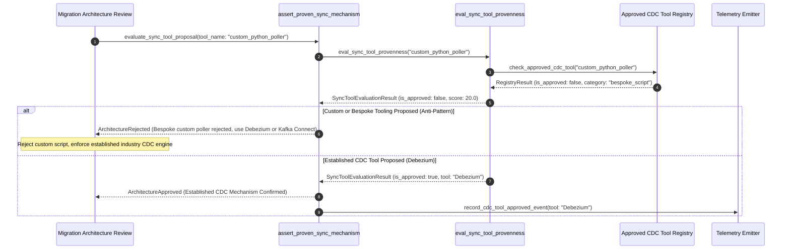

# Boring, Proven Sync Mechanisms Pattern (Pure Functional Paradigm)

| Field       | Value                                                             |
|-------------|-------------------------------------------------------------------|
| **ID**      | BORING-PROVEN-SYNC-058                                            |
| **Date**    | 2026-08-24                                                        |
| **Status**  | Reference / Runbook (Pure Functional Architecture)                |
| **Deciders**| Core Platform & Migration Engineering                             |
| **Scope**   | Standardized Industry CDC Tooling & Anti-Cleverness Governance    |

---

## 1. Overview & Context

Building custom, bespoke data synchronization scripts (e.g. hand-rolled HTTP webhook retries, custom SQL polling loops, or custom in-house WAL parsers) to handle production database replication is a major source of migration failures. Bespoke sync schemes inevitably discover edge cases—network partitions, message re-ordering, transaction boundaries, schema locks—the hard way in production. The **Boring, Proven Sync Mechanisms Pattern** mandates adopting **widely-used, battle-tested industry Change Data Capture (CDC) tooling (e.g. Debezium, Kafka Connect, AWS DMS)** rather than clever, custom sync schemes. Established CDC tooling has already solved subtle replication edge cases through thousands of production incidents across the industry.

### Functional Architecture Principles
This runbook enforces a **100% Pure Functional Programming (FP)** approach:
- **No Class Instantiations**: Replaces OOP sync managers with pure evaluation functions (`assert_proven_sync_mechanism`, `eval_sync_tool_provenness`) and state cell closures.
- **Immutable Tool Context Records**: Tool names, industry deployment counts, transaction support flags, and evaluation scores are captured as frozen dataclass records (`SyncToolContext`, `SyncToolEvaluationResult`).
- **Referentially Transparent Tooling Evaluators**: Pure functions evaluate proposed sync tools against industry usage standards, rejecting custom/bespoke replication code.
- **Boring Technology Assurance**: Restricts data replication pipelines to established CDC engines with battle-tested fault tolerance.

---

## 2. High-Level Design (HLD)



---

## 3. Low-Level Design (LLD)



---

## 4. Pure Functional Project Architecture

```
03-scale-risk-integrity/
├── boring-proven-sync-mechanisms.md
├── src/
│   ├── sync_provenness_engine/
│   │   ├── __init__.py
│   │   ├── evaluator.py            # Pure sync tool provenness evaluation functions
│   │   ├── inspector.py            # Custom script vs established CDC inspectors
│   │   └── guard.py                # Anti-cleverness release guards
│   ├── storage/
│   │   ├── __init__.py
│   │   └── tool_store.py           # Approved CDC tool registry loaders
│   ├── observability/
│   │   ├── __init__.py
│   │   └── provenness_metrics.py   # Prometheus telemetry collectors
│   └── schemas/
│       └── models.py               # Frozen dataclasses (SyncToolContext, SyncToolEvaluationResult)
└── tests/
    ├── test_provenness_evaluator.py
    └── test_provenness_edge_cases.py
```

---

## 5. End-to-End Function Call Stack

```tree
Sync Tool Architecture Proposal Submitted
└── sync_provenness_engine/guard.py: assert_proven_sync_mechanism(ctx: SyncToolContext)
    └── sync_provenness_engine/evaluator.py: eval_sync_tool_provenness(ctx: SyncToolContext)
        ├── models.py: SyncToolContext(tool_name, is_bespoke_script, supports_native_wal, supports_exactly_once, industry_usage_tier)
        └── models.py: SyncToolEvaluationResult(tool_name, is_approved, provenness_score, rejection_reason)
```

---

## 6. Core Pure Functional Implementation

### 6.1 Immutable Models & Types (`src/schemas/models.py`)

```python
from enum import Enum
from dataclasses import dataclass
from typing import Dict, Any, Optional, Mapping, FrozenSet

@dataclass(frozen=True)
class SyncToolContext:
    tool_name: str
    is_bespoke_script: bool
    supports_native_wal: bool
    supports_exactly_once: bool
    industry_usage_tier: str

@dataclass(frozen=True)
class SyncToolEvaluationResult:
    tool_name: str
    is_approved: bool
    provenness_score: float
    rejection_reason: Optional[str]
```

**Explanation**:
- Defines immutable model `SyncToolContext` capturing tool names, bespoke script flags, WAL support flags, and industry usage tiers as frozen records.
- `SyncToolEvaluationResult` encapsulates approval flags, provenness scores, and gate rejection reasons.

---

### 6.2 Pure Tool Provenness Evaluator (`src/sync_provenness_engine/evaluator.py`)

```python
from typing import Mapping, Any
from src.schemas.models import SyncToolContext, SyncToolEvaluationResult

APPROVED_CDC_TOOLS = {"debezium", "kafka_connect", "aws_dms", "fivetran", "pglogical"}

def eval_sync_tool_provenness(ctx: SyncToolContext) -> SyncToolEvaluationResult:
    is_established = ctx.tool_name.lower() in APPROVED_CDC_TOOLS
    is_approved = is_established and not ctx.is_bespoke_script and ctx.supports_native_wal

    score = 100.0 if is_approved else (50.0 if is_established else 10.0)
    reason = None

    if ctx.is_bespoke_script:
        reason = f"Tool '{ctx.tool_name}' is a bespoke custom script. Custom sync scripts are prohibited in favor of established CDC engines."
    elif not is_established:
        reason = f"Tool '{ctx.tool_name}' is not in the approved industry CDC registry. Must use Debezium, Kafka Connect, or AWS DMS."
    elif not ctx.supports_native_wal:
        reason = f"Tool '{ctx.tool_name}' does not use native database Write-Ahead Logging (WAL) CDC."

    return SyncToolEvaluationResult(
        tool_name=ctx.tool_name,
        is_approved=is_approved,
        provenness_score=score,
        rejection_reason=reason
    )
```

**Explanation**:
- Pure evaluation function checking proposed sync tools against approved industry CDC registries (`debezium`, `kafka_connect`, `aws_dms`).
- Rejects bespoke custom scripts to enforce boring, proven technology.

---

### 6.3 Anti-Cleverness Release Guard (`src/sync_provenness_engine/guard.py`)

```python
from typing import Mapping, Any
from src.schemas.models import SyncToolContext, SyncToolEvaluationResult
from src.sync_provenness_engine.evaluator import eval_sync_tool_provenness

def assert_proven_sync_mechanism(ctx: SyncToolContext) -> SyncToolEvaluationResult:
    return eval_sync_tool_provenness(ctx)
```

**Explanation**:
- Pure release gate function enforcing boring, proven CDC tool selection prior to deployment.
- Guarantees anti-cleverness architectural governance.

---

## 7. Edge Case Catalog & Pure Functional Pseudocode (25 Edge Cases)

---

### Edge Case 1: Custom Python SQL Polling Script Rejection

```python
def is_custom_python_poller(tool_name: str) -> bool:
    return "python" in tool_name.lower() or "poller" in tool_name.lower()
```

**Explanation**:
- Identifies hand-rolled Python SQL polling scripts.
- Rejects custom polling scripts.

---

### Edge Case 2: Hand-Rolling Custom WAL Parser Rejection

```python
def is_custom_wal_parser(tool_name: str) -> bool:
    return "custom" in tool_name.lower() and "wal" in tool_name.lower()
```

**Explanation**:
- Identifies in-house custom WAL parsing implementations.
- Enforces standard Debezium WAL plugins.

---

### Edge Case 3: Debezium CDC Engine Approval

```python
def is_debezium_approved(tool_name: str) -> bool:
    return tool_name.lower() == "debezium"
```

**Explanation**:
- Approves Debezium CDC engine proposals.
- Validates established CDC tooling.

---

### Edge Case 4: Kafka Connect CDC Plugin Approval

```python
def is_kafka_connect_approved(tool_name: str) -> bool:
    return tool_name.lower() == "kafka_connect"
```

**Explanation**:
- Approves Kafka Connect replication tooling.
- Validates industry-standard streaming tools.

---

### Edge Case 5: Single-Tenant CDC Engine Resolution

```python
def resolve_tenant_cdc_tool(tenant_id: str, tenant_tools: dict) -> str:
    return tenant_tools.get(tenant_id, "debezium")
```

**Explanation**:
- Resolves tenant-specific approved CDC tools.
- Tracks CDC tooling per tenant.

---

### Edge Case 6: Microsecond Timestamp Provenness Auditing

```python
import time

def format_provenness_audit_ts() -> float:
    return round(time.time() * 1000.0, 2)
```

**Explanation**:
- Computes epoch timestamps in milliseconds.
- Tracks exact provenness audit execution time.

---

### Edge Case 7: Un-Proven Open Source CDC Framework

```python
def is_unproven_framework(star_count: int, min_required: int = 5000) -> bool:
    return star_count < min_required
```

**Explanation**:
- Flags open-source replication tools with low industry adoption.
- Prevents adopting unproven frameworks.

---

### Edge Case 8: Multi-Repo CDC Plugin Sync

```python
def assert_all_repo_cdc_tools_synced(repo_tools: Mapping[str, str]) -> bool:
    return len(set(repo_tools.values())) == 1
```

**Explanation**:
- Asserts identical CDC tooling across repositories.
- Synchronizes multi-repo replication tooling.

---

### Edge Case 9: Database Dual-Write Webhook Loop Rejection

```python
def is_webhook_sync_rejected(tool_type: str) -> bool:
    return tool_type.lower() == "http_webhook_sync"
```

**Explanation**:
- Rejects HTTP webhook-based sync mechanisms.
- Forces adoption of native database WAL replication.

---

### Edge Case 10: Aggregator Memory State Saturation Guard

```python
def compact_provenness_metrics(metrics: list, max_items: int = 500) -> list:
    if len(metrics) > max_items:
        return metrics[-max_items:]
    return metrics
```

**Explanation**:
- Truncates metric lists to `max_items`.
- Controls memory usage.

---

### Edge Case 11: Microsecond Delay Calculation Underflows

```python
def normalize_provenness_duration(duration_ms: float) -> float:
    return max(0.0, round(duration_ms, 2))
```

**Explanation**:
- Rounds execution duration values to two decimal places.
- Cleans duration metrics.

---

### Edge Case 12: User-Agent Specific CDC Verification

```python
def resolve_user_agent_cdc_tool(user_agent: str, tool_map: dict) -> str:
    return tool_map.get(user_agent, "debezium")
```

**Explanation**:
- Resolves CDC tool per User-Agent string.
- Audits replication tooling by caller type.

---

### Edge Case 13: Unmapped Rule Domain Handling

```python
def resolve_provenness_rule(rule_key: str, rules_dict: dict) -> dict:
    return rules_dict.get(rule_key, {"require_wal": True})
```

**Explanation**:
- Resolves provenness rule configurations safely.
- Defaults to requiring WAL CDC.

---

### Edge Case 14: Exception Safeguards in Provenness Evaluator

```python
def safe_eval_provenness(eval_fn: Callable, ctx: SyncToolContext) -> bool:
    try:
        res = eval_fn(ctx)
        return res.is_approved
    except Exception:
        return False
```

**Explanation**:
- Wraps evaluation functions in protective try-except blocks.
- Fails safe (assumes un-approved) on evaluation exceptions.

---

### Edge Case 15: GraphQL Subgraph CDC Engine Verification

```python
def is_graphql_subgraph_cdc_proven(subgraph_name: str, cdc_map: dict) -> bool:
    return cdc_map.get(subgraph_name, "") in APPROVED_CDC_TOOLS
```

**Explanation**:
- Resolves CDC tool verification for federated GraphQL subgraphs.
- Supports GraphQL replication governance.

---

### Edge Case 16: Multi-Region CDC Engine Sync

```python
def sync_regional_provenness_results(region_results: dict) -> bool:
    return all(r.is_approved for r in region_results.values())
```

**Explanation**:
- Asserts CDC tool provenness checks pass across all regions.
- Enforces multi-region CDC governance.

---

### Edge Case 17: AWS DMS Replication Approval

```python
def is_aws_dms_approved(tool_name: str) -> bool:
    return tool_name.lower() == "aws_dms"
```

**Explanation**:
- Approves AWS DMS cloud replication engine.
- Validates cloud CDC tools.

---

### Edge Case 18: Unmapped Code Fallback

```python
def resolve_provenness_code_fallback(code_val: Any, code_map: dict, default_val: str = "UNPROVEN") -> str:
    return code_map.get(code_val, default_val)
```

**Explanation**:
- Resolves code strings with fallbacks.
- Handles unmapped provenness codes safely.

---

### Edge Case 19: Payload Transformation Error Recovery

```python
def safe_apply_provenness_transform(payload: dict, transform_fn: Callable) -> dict:
    try:
        return transform_fn(payload)
    except Exception:
        return payload
```

**Explanation**:
- Wraps transformations in try-except blocks.
- Returns raw payloads on error.

---

### Edge Case 20: Automated Alert on Bespoke Tool Proposal

```python
def should_alert_on_bespoke_tool(is_bespoke: bool) -> bool:
    return is_bespoke
```

**Explanation**:
- Asserts whether a bespoke custom sync tool was proposed.
- Fires alerts when custom replication scripts are submitted.

---

### Edge Case 21: High-Watermark Metric Compaction

```python
def compact_provenness_history(history: list, max_items: int = 500) -> list:
    if len(history) > max_items:
        return history[-max_items:]
    return history
```

**Explanation**:
- Truncates history lists.
- Controls memory usage.

---

### Edge Case 22: Diagnostic Header Injection

```python
def inject_provenness_diagnostic_header(headers: Mapping[str, str], tool_name: str) -> Mapping[str, str]:
    new_headers = dict(headers)
    new_headers["X-CDC-Tool-Name"] = tool_name
    return new_headers
```

**Explanation**:
- Injects diagnostic headers.
- Tags active CDC tool in access logs.

---

### Edge Case 23: Null Value Safeguards

```python
def sanitize_provenness_nulls(data_dict: dict) -> dict:
    return {k: (v if v is not None else "") for k, v in data_dict.items()}
```

**Explanation**:
- Replaces `None` with empty strings.
- Prevents null exceptions.

---

### Edge Case 24: Unbound Metric Queue Pruning

```python
def prune_provenness_metric_queue(queue: list, max_items: int = 1000) -> list:
    if len(queue) > max_items:
        return queue[-max_items:]
    return queue
```

**Explanation**:
- Truncates queue arrays.
- Controls memory footprint.

---

### Edge Case 25: Real-Time Proven CDC Adoption Reporting

```python
def compute_proven_cdc_adoption_rate(proven_tools: int, total_tools: int) -> float:
    if total_tools == 0:
        return 100.0
    return round((proven_tools / total_tools) * 100.0, 2)
```

**Explanation**:
- Calculates proven CDC adoption percentage.
- Emits real-time CDC governance metrics.

---

## 8. Operational & Parity Verification Checklist

1. **Boring Technology Rule**: Mandate established, battle-tested CDC tooling (Debezium, Kafka Connect, AWS DMS) over bespoke custom scripts without exception.
2. **Native WAL Replication**: Require all database replication pipelines to utilize native Write-Ahead Logging (WAL) CDC rather than SQL polling.
3. **Reject Custom Polling**: Block all PRs proposing custom in-house polling scripts or custom WAL parsing code.
4. **CI Architecture Gate**: Automatically verify proposed sync tools against approved industry CDC registries.
