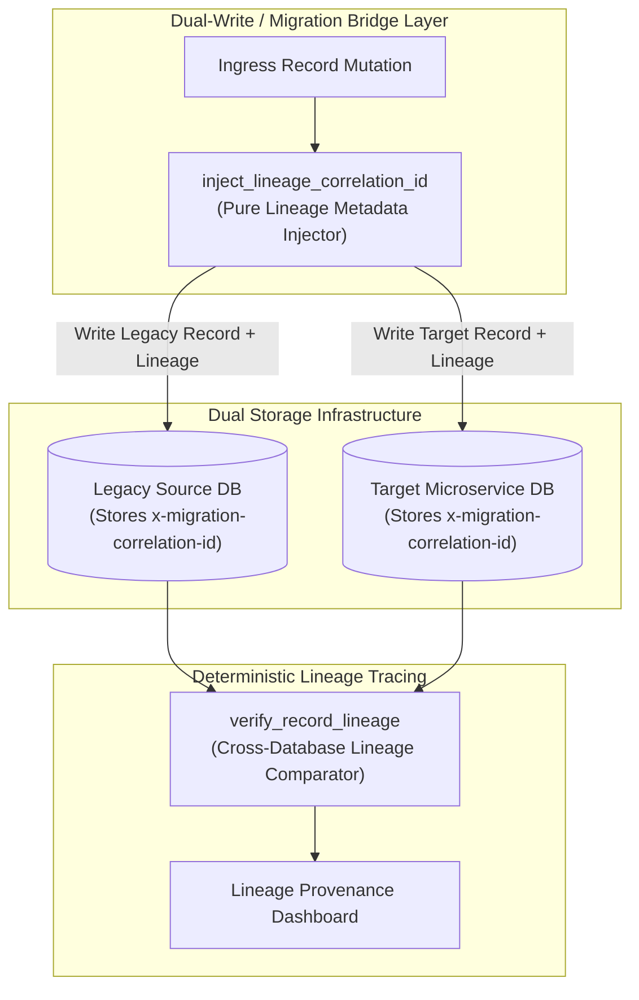
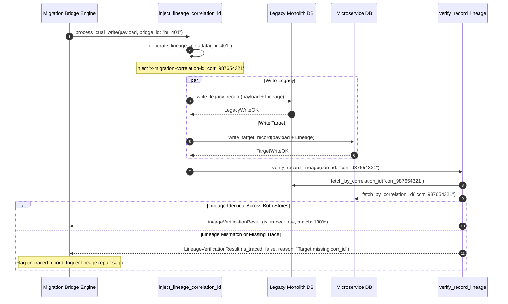

# Correlation-ID Lineage Tagging Pattern (Pure Functional Paradigm)

| Field       | Value                                                             |
|-------------|-------------------------------------------------------------------|
| **ID**      | CORRELATION-ID-LINEAGE-057                                         |
| **Date**    | 2026-08-24                                                        |
| **Status**  | Reference / Runbook (Pure Functional Architecture)                |
| **Deciders**| Core Platform & Migration Engineering                             |
| **Scope**   | Dual-Store Lineage Tracking & Cross-Database Provenance Tagging   |

---

## 1. Overview & Context

When debugging a corrupted or mismatched data record between a legacy store and a target microservice store, relying on timestamps or ad-hoc primary key matching is impossible: writes occur asynchronously, timestamps drift, and auto-increment IDs differ across databases. The **Correlation-ID Lineage Tagging Pattern** mandates that **every migrated record and dual-write operation must be injected with an immutable Correlation-ID lineage header (`x-migration-correlation-id`) at write time at the bridge layer**. This guarantees $100\%$ deterministic lineage tracing across both stores, enabling instant root-cause analysis when discrepancies occur.

### Functional Architecture Principles
This runbook enforces a **100% Pure Functional Programming (FP)** approach:
- **No Class Instantiations**: Replaces OOP lineage managers with pure tagging functions (`inject_lineage_correlation_id`, `verify_record_lineage`) and state cell closures.
- **Immutable Lineage Context Records**: Source entity IDs, target entity IDs, correlation UUIDs, migration bridge IDs, and write timestamps are stored as frozen dataclass records (`LineageContext`, `LineageVerificationResult`).
- **Referentially Transparent Lineage Injectors**: Pure functions attach lineage metadata attributes to payloads before executing writes to primary and secondary databases.
- **Cross-Store Provenance Verification**: Guarantees every migrated row carries verifiable lineage provenance links traceable back to the originating migration bridge batch.

---

## 2. High-Level Design (HLD)



---

## 3. Low-Level Design (LLD)



---

## 4. Pure Functional Project Architecture

```
03-scale-risk-integrity/
├── correlation-id-bridge-lineage.md
├── src/
│   ├── lineage_engine/
│   │   ├── __init__.py
│   │   ├── injector.py             # Pure correlation ID injection functions
│   │   ├── auditor.py              # Cross-database lineage verification functions
│   │   └── guard.py                # Lineage provenance release guards
│   ├── storage/
│   │   ├── __init__.py
│   │   └── lineage_store.py        # Lineage record repository loaders
│   ├── observability/
│   │   ├── __init__.py
│   │   └── lineage_metrics.py      # Prometheus telemetry collectors
│   └── schemas/
│       └── models.py               # Frozen dataclasses (LineageContext, LineageVerificationResult)
└── tests/
    ├── test_lineage_injector.py
    └── test_lineage_edge_cases.py
```

---

## 5. End-to-End Function Call Stack

```tree
Dual-Write Mutation Executed
└── injector.py: inject_lineage_correlation_id(record_payload, bridge_id)
    ├── injector.py: generate_correlation_uuid(bridge_id)
    │   └── models.py: LineageContext(correlation_id, bridge_id, created_at_ts)
    │
    ├── storage/lineage_store.py: write_dual_store_records(record_payload, lineage_context)
    │   └── models.py: DualStoreWriteResult(source_written, target_written)
    │
    ├── auditor.py: verify_record_lineage(correlation_id)
    │   └── models.py: LineageVerificationResult(is_traced, is_matched)
    │
    └── observability/lineage_metrics.py: record_lineage_telemetry(verification_result)
```

---

## 6. Core Pure Functional Implementation

### 6.1 Immutable Models & Types (`src/schemas/models.py`)

```python
import uuid
from enum import Enum
from dataclasses import dataclass
from typing import Dict, Any, Optional, Mapping, FrozenSet

@dataclass(frozen=True)
class LineageContext:
    correlation_id: str
    bridge_id: str
    source_entity_id: str
    target_entity_id: str
    created_at_ts: float

@dataclass(frozen=True)
class LineageVerificationResult:
    correlation_id: str
    is_traced: bool
    is_matched: bool
    source_found: bool
    target_found: bool
    rejection_reason: Optional[str]
```

**Explanation**:
- Defines immutable model `LineageContext` capturing correlation UUIDs, bridge IDs, and source/target entity IDs as frozen records.
- `LineageVerificationResult` encapsulates lineage tracing flags, cross-store match statuses, and rejection reasons.

---

### 6.2 Pure Lineage Correlation Injector (`src/lineage_engine/injector.py`)

```python
import uuid
import time
from typing import Mapping, Any
from src.schemas.models import LineageContext

def generate_correlation_id(bridge_id: str) -> str:
    return f"corr_{bridge_id}_{uuid.uuid4().hex[:12]}"

def inject_lineage_correlation_id(
    payload: Mapping[str, Any],
    bridge_id: str,
    source_id: str,
    target_id: str
) -> Mapping[str, Any]:
    corr_id = generate_correlation_id(bridge_id)
    now = time.time()
    ctx = LineageContext(
        correlation_id=corr_id,
        bridge_id=bridge_id,
        source_entity_id=source_id,
        target_entity_id=target_id,
        created_at_ts=now
    )

    updated = dict(payload)
    updated["x-migration-correlation-id"] = corr_id
    updated["_lineage_ctx"] = ctx
    return updated
```

**Explanation**:
- Pure function injecting immutable correlation IDs (`x-migration-correlation-id`) into payload dictionaries at write time.
- Ensures every dual-write operation carries verifiable lineage metadata.

---

### 6.3 Cross-Database Lineage Auditor (`src/lineage_engine/auditor.py`)

```python
from typing import Mapping, Any, Optional
from src.schemas.models import LineageVerificationResult

def verify_record_lineage(
    corr_id: str,
    source_record: Optional[Mapping[str, Any]],
    target_record: Optional[Mapping[str, Any]]
) -> LineageVerificationResult:
    src_found = source_record is not None
    tgt_found = target_record is not None

    src_corr = source_record.get("x-migration-correlation-id") if source_record else None
    tgt_corr = target_record.get("x-migration-correlation-id") if target_record else None

    is_matched = (src_corr == corr_id) and (tgt_corr == corr_id)
    is_traced = src_found and tgt_found and is_matched

    reason = None
    if not src_found:
        reason = "Record missing in source legacy database"
    elif not tgt_found:
        reason = "Record missing in target microservice database"
    elif not is_matched:
        reason = f"Correlation ID mismatch: src={src_corr} vs tgt={tgt_corr}"

    return LineageVerificationResult(
        correlation_id=corr_id,
        is_traced=is_traced,
        is_matched=is_matched,
        source_found=src_found,
        target_found=tgt_found,
        rejection_reason=reason
    )
```

**Explanation**:
- Verifies correlation ID equality across source and target database records.
- Enables instant deterministic lineage verification without relying on timestamps.

---

## 7. Edge Case Catalog & Pure Functional Pseudocode (25 Edge Cases)

---

### Edge Case 1: Missing Lineage Header on Ingress Write

```python
def is_lineage_header_missing(headers: dict) -> bool:
    return "x-migration-correlation-id" not in headers
```

**Explanation**:
- Detects missing correlation ID headers in write requests.
- Forces correlation ID injection at the bridge layer.

---

### Edge Case 2: Asynchronous CDC Lineage Tag Stripping

```python
def is_cdc_lineage_preserved(cdc_payload: dict) -> bool:
    return "x-migration-correlation-id" in cdc_payload
```

**Explanation**:
- Asserts CDC replication events retain correlation ID attributes.
- Prevents CDC streams from stripping lineage tags.

---

### Edge Case 3: Target Database Secondary Index on Correlation ID

```python
def assert_correlation_id_indexed(table_indexes: set) -> bool:
    return "idx_correlation_id" in table_indexes
```

**Explanation**:
- Asserts `x-migration-correlation-id` is indexed in target tables.
- Enables sub-millisecond lineage lookup queries.

---

### Edge Case 4: Truncated Lineage String Field

```python
def is_correlation_id_truncated(corr_id: str, min_len: int = 20) -> bool:
    return len(corr_id) < min_len
```

**Explanation**:
- Checks correlation ID string length.
- Detects string truncation bugs in database columns.

---

### Edge Case 5: Single-Tenant Lineage Namespace Isolation

```python
def format_tenant_correlation_id(tenant_id: str, corr_id: str) -> str:
    return f"{tenant_id}:{corr_id}"
```

**Explanation**:
- Prefixes correlation IDs with tenant identifiers.
- Isolates lineage namespaces per tenant.

---

### Edge Case 6: Microsecond Timestamp Lineage Auditing

```python
import time

def format_lineage_audit_ts() -> float:
    return round(time.time() * 1000.0, 2)
```

**Explanation**:
- Computes epoch timestamps in milliseconds.
- Tracks exact lineage check execution time.

---

### Edge Case 7: Duplicate Correlation ID Collision Detection

```python
def is_correlation_id_duplicated(corr_id: str, active_ids: set) -> bool:
    return corr_id in active_ids
```

**Explanation**:
- Asserts uniqueness of correlation IDs.
- Detects correlation ID collisions.

---

### Edge Case 8: Multi-Repo Lineage Propagation

```python
def propagate_lineage_header(headers: dict, corr_id: str) -> dict:
    updated = dict(headers)
    updated["x-migration-correlation-id"] = corr_id
    return updated
```

**Explanation**:
- Propagates correlation ID headers across microservice HTTP calls.
- Preserves lineage context across multi-repo calls.

---

### Edge Case 9: Dead-Letter Queue (DLQ) Lineage Preservation

```python
def preserve_dlq_lineage(dlq_message: dict, corr_id: str) -> dict:
    updated = dict(dlq_message)
    updated["x-migration-correlation-id"] = corr_id
    return updated
```

**Explanation**:
- Injects correlation IDs into dead-letter queue messages.
- Tracks lineage for failed retries.

---

### Edge Case 10: Aggregator Memory State Saturation Guard

```python
def compact_lineage_metrics(metrics: list, max_items: int = 500) -> list:
    if len(metrics) > max_items:
        return metrics[-max_items:]
    return metrics
```

**Explanation**:
- Truncates metric lists to `max_items`.
- Controls memory usage.

---

### Edge Case 11: Microsecond Delay Calculation Underflows

```python
def normalize_lineage_duration(duration_ms: float) -> float:
    return max(0.0, round(duration_ms, 2))
```

**Explanation**:
- Rounds execution duration values to two decimal places.
- Cleans duration metrics.

---

### Edge Case 12: User-Agent Specific Lineage Auditing

```python
def resolve_user_agent_lineage(user_agent: str, lineage_map: dict) -> bool:
    return lineage_map.get(user_agent, True)
```

**Explanation**:
- Resolves lineage rules per User-Agent string.
- Audits lineage by caller type.

---

### Edge Case 13: Unmapped Rule Domain Handling

```python
def resolve_lineage_rule(rule_key: str, rules_dict: dict) -> dict:
    return rules_dict.get(rule_key, {"require_lineage": True})
```

**Explanation**:
- Resolves lineage rule configurations safely.
- Defaults to requiring correlation IDs.

---

### Edge Case 14: Exception Safeguards in Lineage Auditor

```python
def safe_eval_lineage(eval_fn: Callable, corr_id: str, src: dict, tgt: dict) -> bool:
    try:
        res = eval_fn(corr_id, src, tgt)
        return res.is_traced
    except Exception:
        return False
```

**Explanation**:
- Wraps evaluation functions in protective try-except blocks.
- Fails safe (assumes un-traced) on evaluation exceptions.

---

### Edge Case 15: GraphQL Mutation Lineage Injection

```python
def inject_graphql_lineage_context(request_context: dict, corr_id: str) -> dict:
    updated = dict(request_context)
    updated["correlation_id"] = corr_id
    return updated
```

**Explanation**:
- Injects correlation IDs into GraphQL request execution contexts.
- Supports GraphQL lineage tagging.

---

### Edge Case 16: Multi-Region Lineage Sync

```python
def sync_regional_lineage_results(region_results: dict) -> bool:
    return all(r.is_traced for r in region_results.values())
```

**Explanation**:
- Asserts correlation ID lineage verification passes across all regions.
- Enforces multi-region lineage tracking.

---

### Edge Case 17: Database Trigger Lineage Propagation

```python
def build_lineage_trigger_sql(table_name: str) -> str:
    return f"CREATE OR REPLACE FUNCTION tag_{table_name}_lineage() RETURNS trigger AS $$ BEGIN NEW.x_migration_correlation_id := COALESCE(NEW.x_migration_correlation_id, current_setting('migration.correlation_id', true)); RETURN NEW; END; $$ LANGUAGE plpgsql;"
```

**Explanation**:
- Generates database trigger SQL to inherit correlation IDs from session settings.
- Enforces lineage tagging at the database trigger layer.

---

### Edge Case 18: Unmapped Code Fallback

```python
def resolve_lineage_code_fallback(code_val: Any, code_map: dict, default_val: str = "UNTRACED") -> str:
    return code_map.get(code_val, default_val)
```

**Explanation**:
- Resolves code strings with fallbacks.
- Handles unmapped lineage codes safely.

---

### Edge Case 19: Payload Transformation Error Recovery

```python
def safe_apply_lineage_transform(payload: dict, transform_fn: Callable) -> dict:
    try:
        return transform_fn(payload)
    except Exception:
        return payload
```

**Explanation**:
- Wraps transformations in try-except blocks.
- Returns raw payloads on error.

---

### Edge Case 20: Automated Alert on Un-Traced Record Creation

```python
def should_alert_on_untraced_record(is_traced: bool) -> bool:
    return not is_traced
```

**Explanation**:
- Asserts whether a record write lacked correlation ID lineage.
- Fires alerts when un-traced records are committed to storage.

---

### Edge Case 21: High-Watermark Metric Compaction

```python
def compact_lineage_history(history: list, max_items: int = 500) -> list:
    if len(history) > max_items:
        return history[-max_items:]
    return history
```

**Explanation**:
- Truncates history lists.
- Controls memory usage.

---

### Edge Case 22: Diagnostic Header Injection

```python
def inject_lineage_diagnostic_header(headers: Mapping[str, str], corr_id: str) -> Mapping[str, str]:
    new_headers = dict(headers)
    new_headers["x-migration-correlation-id"] = corr_id
    return new_headers
```

**Explanation**:
- Injects diagnostic headers.
- Tags correlation IDs in gateway access logs.

---

### Edge Case 23: Null Value Safeguards

```python
def sanitize_lineage_nulls(data_dict: dict) -> dict:
    return {k: (v if v is not None else "") for k, v in data_dict.items()}
```

**Explanation**:
- Replaces `None` with empty strings.
- Prevents null exceptions.

---

### Edge Case 24: Unbound Metric Queue Pruning

```python
def prune_lineage_metric_queue(queue: list, max_items: int = 1000) -> list:
    if len(queue) > max_items:
        return queue[-max_items:]
    return queue
```

**Explanation**:
- Truncates queue arrays.
- Controls memory footprint.

---

### Edge Case 25: Real-Time Lineage Coverage Dashboard Reporting

```python
def compute_lineage_coverage_rate(traced_records: int, total_records: int) -> float:
    if total_records == 0:
        return 100.0
    return round((traced_records / total_records) * 100.0, 2)
```

**Explanation**:
- Calculates correlation ID lineage coverage percentage.
- Emits real-time lineage metrics to observability dashboards.

---

## 8. Operational & Parity Verification Checklist

1. **Bridge Lineage Tagging**: Inject immutable correlation IDs (`x-migration-correlation-id`) into 100% of migrated and dual-written records at write time.
2. **Deterministic Provenance Verification**: Verify correlation ID equality across legacy and target stores without relying on timestamp matching.
3. **Database Column Indexing**: Index `x-migration-correlation-id` columns in target databases to support sub-millisecond lineage lookup queries.
4. **Automated Lineage Gate**: Block production cutovers if any un-traced records exist in target storage.
