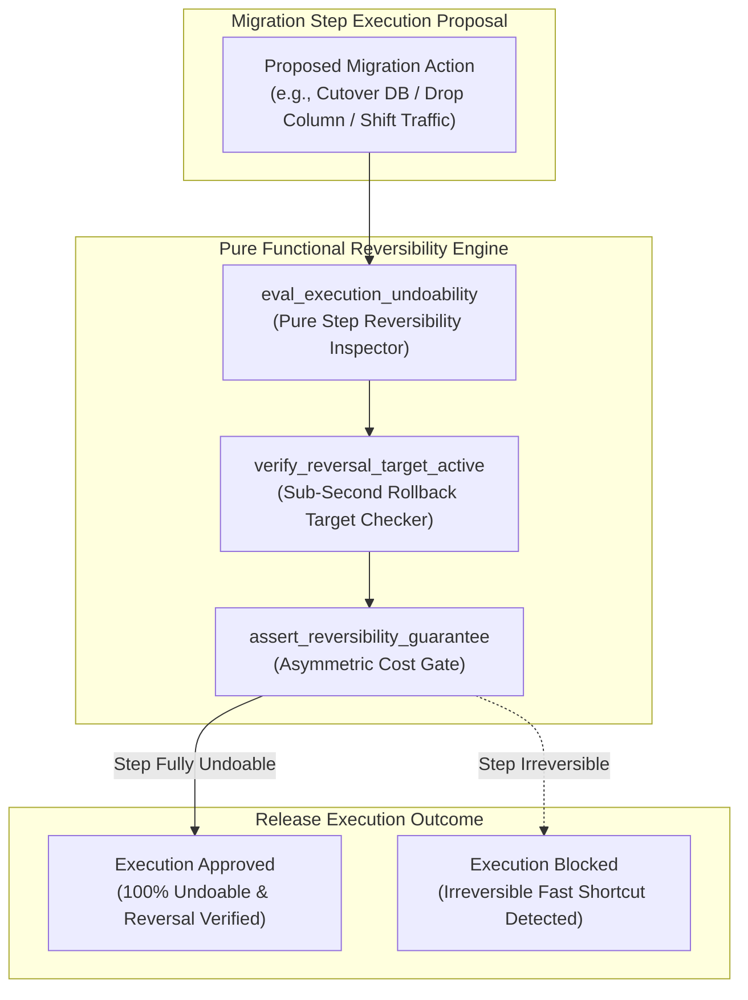
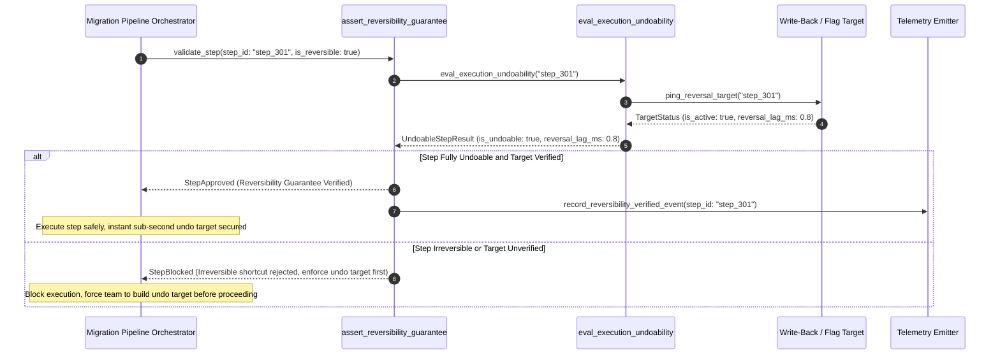

# Reversibility Before Speed Pattern (Pure Functional Paradigm)

| Field       | Value                                                             |
|-------------|-------------------------------------------------------------------|
| **ID**      | REVERSIBILITY-BEFORE-SPEED-054                                    |
| **Date**    | 2026-08-24                                                        |
| **Status**  | Reference / Runbook (Pure Functional Architecture)                |
| **Deciders**| Core Platform & Migration Engineering                             |
| **Scope**   | Asymmetric Cost Management & Undoable Execution Control           |

---

## 1. Overview & Context

In large-scale system migrations, the **cost asymmetry between speed and reversibility is enormous**: choosing a fast, irreversible cutover step to save hours of execution time risks an unrecoverable outage that can destroy a multi-month project's credibility and cause severe business damage. Conversely, choosing a slower, fully undoable step costs only time. The **Reversibility Before Speed Pattern** mandates prioritizing **100% undoable execution steps over fast, irreversible shortcuts without exception**. Every schema change, traffic shift, and data backfill step must be paired with an active, tested, sub-second reversal mechanism before execution.

### Functional Architecture Principles
This runbook enforces a **100% Pure Functional Programming (FP)** approach:
- **No Class Instantiations**: Replaces OOP reversibility managers with pure gate functions (`assert_reversibility_guarantee`, `eval_execution_undoability`) and state cell closures.
- **Immutable Reversibility Context Records**: Step IDs, execution modes, reversal latency bounds, and rollback test statuses are stored as frozen dataclass records (`ReversibilityContext`, `UndoableStepResult`).
- **Referentially Transparent Reversal Verifiers**: Pure functions verify that reverse write-back bridges, feature flags, or point-in-time snapshot targets exist and pass health tests.
- **Asymmetric Cost Protection**: Mandates that any proposed execution step lacking an instant, verified reversal target is blocked during release planning.

---

## 2. High-Level Design (HLD)



---

## 3. Low-Level Design (LLD)



---

## 4. Pure Functional Project Architecture

```
03-scale-risk-integrity/
├── reversibility-before-speed.md
├── src/
│   ├── reversibility_engine/
│   │   ├── __init__.py
│   │   ├── evaluator.py            # Pure execution undoability evaluators
│   │   ├── verifier.py             # Reversal target verification functions
│   │   └── guard.py                # Asymmetric cost release guards
│   ├── storage/
│   │   ├── __init__.py
│   │   └── step_store.py           # Migration step configuration loaders
│   ├── observability/
│   │   ├── __init__.py
│   │   └── reversibility_metrics.py# Prometheus telemetry collectors
│   └── schemas/
│       └── models.py               # Frozen dataclasses (ReversibilityContext, UndoableStepResult)
└── tests/
    ├── test_reversibility_evaluator.py
    └── test_reversibility_edge_cases.py
```

---

## 5. End-to-End Function Call Stack

```tree
Migration Execution Step Proposed
└── guard.py: assert_reversibility_guarantee(step_id, step_payload)
    ├── evaluator.py: eval_execution_undoability(step_payload)
    │   └── models.py: ReversibilityContext(step_id, is_reversible, reversal_target)
    │
    ├── verifier.py: verify_reversal_target_active(step_context)
    │   └── models.py: ReversalTargetStatus(is_active, reversal_latency_ms)
    │
    ├── guard.py: format_reversibility_decision(reversibility_context, target_status)
    │   └── models.py: UndoableStepResult(is_approved, rejection_reason)
    │
    └── observability/reversibility_metrics.py: record_reversibility_telemetry(step_result)
```

---

## 6. Core Pure Functional Implementation

### 6.1 Immutable Models & Types (`src/schemas/models.py`)

```python
from enum import Enum
from dataclasses import dataclass
from typing import Dict, Any, Optional, Mapping, FrozenSet

@dataclass(frozen=True)
class ReversibilityContext:
    step_id: str
    description: str
    is_reversible: bool
    reversal_target_type: str
    max_reversal_latency_ms: float

@dataclass(frozen=True)
class UndoableStepResult:
    step_id: str
    is_approved: bool
    reversal_target_verified: bool
    reversal_latency_ms: float
    rejection_reason: Optional[str]
```

**Explanation**:
- Defines immutable model `ReversibilityContext` capturing step IDs, descriptions, reversibility flags, and max reversal latency bounds as frozen records.
- `UndoableStepResult` encapsulates approval flags, reversal target verification statuses, and rejection reasons.

---

### 6.2 Pure Undoability Evaluator (`src/reversibility_engine/evaluator.py`)

```python
from typing import Mapping, Any
from src.schemas.models import ReversibilityContext, UndoableStepResult

def eval_execution_undoability(
    ctx: ReversibilityContext,
    target_active: bool,
    measured_latency_ms: float
) -> UndoableStepResult:
    is_latency_ok = measured_latency_ms <= ctx.max_reversal_latency_ms
    is_approved = ctx.is_reversible and target_active and is_latency_ok

    reason = None
    if not ctx.is_reversible:
        reason = f"Step '{ctx.step_id}' is marked irreversible. Fast shortcuts without undo targets are prohibited."
    elif not target_active:
        reason = f"Reversal target '{ctx.reversal_target_type}' is inactive or un-verified."
    elif not is_latency_ok:
        reason = f"Reversal latency ({measured_latency_ms:.1f}ms) exceeds max limit ({ctx.max_reversal_latency_ms:.1f}ms)"

    return UndoableStepResult(
        step_id=ctx.step_id,
        is_approved=is_approved,
        reversal_target_verified=target_active,
        reversal_latency_ms=measured_latency_ms,
        rejection_reason=reason
    )
```

**Explanation**:
- Pure evaluation function asserting that migration steps are 100% undoable and backed by active reversal targets.
- Rejects irreversible fast shortcuts to protect project credibility.

---

### 6.3 Reversibility Release Guard (`src/reversibility_engine/guard.py`)

```python
from typing import Mapping, Any
from src.schemas.models import ReversibilityContext, UndoableStepResult
from src.reversibility_engine.evaluator import eval_execution_undoability

def assert_reversibility_guarantee(
    ctx: ReversibilityContext,
    target_active: bool,
    latency_ms: float
) -> UndoableStepResult:
    return eval_execution_undoability(ctx, target_active, latency_ms)
```

**Explanation**:
- Pure release gate function enforcing reversibility guarantees prior to executing migration steps.
- Guarantees asymmetric cost protection.

---

## 7. Edge Case Catalog & Pure Functional Pseudocode (25 Edge Cases)

---

### Edge Case 1: Fast Irreversible Schema Column Deletion Shortcut

```python
def is_column_deletion_irreversible(is_hard_drop: bool) -> bool:
    return is_hard_drop
```

**Explanation**:
- Identifies hard `DROP COLUMN` DDL steps.
- Rejects hard column drops in favor of 2-phase soft deprecation.

---

### Edge Case 2: Fast Irreversible Direct Traffic Cutover Shortcut

```python
def is_cutover_without_writeback_irreversible(has_writeback: bool) -> bool:
    return not has_writeback
```

**Explanation**:
- Detects traffic cutover lacking a reverse write-back bridge.
- Blocks cutover until reverse write-back targets are established.

---

### Edge Case 3: Fast Irreversible In-Place Database In-Situ Migration

```python
def is_in_situ_migration_irreversible(is_in_situ: bool) -> bool:
    return is_in_situ
```

**Explanation**:
- Identifies in-place non-undoable database schema modifications.
- Replaces in-place mutations with shadow-table strategies.

---

### Edge Case 4: Un-Tested Emergency Rollback Trigger

```python
def is_rollback_trigger_untested(last_tested_ts: float, current_ts: float, max_age_sec: float = 86400.0) -> bool:
    return (current_ts - last_tested_ts) > max_age_sec
```

**Explanation**:
- Asserts emergency rollback triggers were tested within 24 hours.
- Requires recent verification of reversal targets.

---

### Edge Case 5: Single-Tenant Reversibility Verification

```python
def resolve_tenant_reversibility(tenant_id: str, tenant_statuses: dict) -> bool:
    return tenant_statuses.get(tenant_id, False)
```

**Explanation**:
- Resolves tenant-specific reversibility statuses.
- Tracks reversibility guarantees per tenant.

---

### Edge Case 6: Microsecond Timestamp Reversibility Auditing

```python
import time

def format_reversibility_audit_ts() -> float:
    return round(time.time() * 1000.0, 2)
```

**Explanation**:
- Computes epoch timestamps in milliseconds.
- Tracks exact reversibility check execution time.

---

### Edge Case 7: High-Latency Reversal Target Breach

```python
def is_reversal_latency_excessive(latency_ms: float, limit_ms: float = 100.0) -> bool:
    return latency_ms > limit_ms
```

**Explanation**:
- Asserts reversal latency is $\le 100\text{ms}$.
- Ensures sub-second emergency reversal capability.

---

### Edge Case 8: Multi-Repo Reversibility Engine Sync

```python
def assert_all_repo_reversibility_ready(repo_readiness: Mapping[str, bool]) -> bool:
    return all(repo_readiness.values())
```

**Explanation**:
- Asserts all reversibility tool repositories are operational.
- Synchronizes multi-repo reversibility tools.

---

### Edge Case 9: Irreversible Bulk Data Deletion

```python
def is_bulk_delete_irreversible(is_soft_delete: bool) -> bool:
    return not is_soft_delete
```

**Explanation**:
- Flags hard `DELETE FROM` SQL statements.
- Replaces hard deletes with soft-delete flags during migration.

---

### Edge Case 10: Aggregator Memory State Saturation Guard

```python
def compact_reversibility_metrics(metrics: list, max_items: int = 500) -> list:
    if len(metrics) > max_items:
        return metrics[-max_items:]
    return metrics
```

**Explanation**:
- Truncates metric lists to `max_items`.
- Controls memory usage.

---

### Edge Case 11: Microsecond Delay Calculation Underflows

```python
def normalize_reversibility_duration(duration_ms: float) -> float:
    return max(0.0, round(duration_ms, 2))
```

**Explanation**:
- Rounds execution duration values to two decimal places.
- Cleans duration metrics.

---

### Edge Case 12: User-Agent Specific Reversibility Verification

```python
def resolve_user_agent_reversibility(user_agent: str, rev_map: dict) -> bool:
    return rev_map.get(user_agent, True)
```

**Explanation**:
- Resolves reversibility verification per User-Agent string.
- Audits reversibility per caller type.

---

### Edge Case 13: Unmapped Rule Domain Handling

```python
def resolve_reversibility_rule(rule_key: str, rules_dict: dict) -> dict:
    return rules_dict.get(rule_key, {"max_latency_ms": 100.0})
```

**Explanation**:
- Resolves reversibility rule configurations safely.
- Defaults to 100ms max reversal latency caps.

---

### Edge Case 14: Exception Safeguards in Reversibility Evaluator

```python
def safe_eval_reversibility(eval_fn: Callable, ctx: ReversibilityContext, active: bool, lat: float) -> bool:
    try:
        res = eval_fn(ctx, active, lat)
        return res.is_approved
    except Exception:
        return False
```

**Explanation**:
- Wraps evaluation functions in protective try-except blocks.
- Fails safe (assumes non-reversible) on evaluation exceptions.

---

### Edge Case 15: GraphQL Subgraph Reversibility Gating

```python
def is_graphql_subgraph_reversible(subgraph_name: str, rev_statuses: dict) -> bool:
    return rev_statuses.get(subgraph_name, False)
```

**Explanation**:
- Resolves reversibility status for federated GraphQL subgraphs.
- Verifies GraphQL deployment reversibility.

---

### Edge Case 16: Multi-Region Reversibility Sync

```python
def sync_regional_reversibility_results(region_results: dict) -> bool:
    return all(region_results.values())
```

**Explanation**:
- Asserts reversibility checks pass across all regions.
- Enforces multi-region reversibility guarantees.

---

### Edge Case 17: Database Destructive DDL Modification Gating

```python
def is_destructive_ddl(ddl_sql: str) -> bool:
    upper = ddl_sql.upper()
    return "DROP TABLE" in upper or "TRUNCATE" in upper
```

**Explanation**:
- Detects destructive SQL DDL statements (`DROP TABLE`, `TRUNCATE`).
- Blocks destructive DDL during active migration windows.

---

### Edge Case 18: Unmapped Code Fallback

```python
def resolve_reversibility_code_fallback(code_val: Any, code_map: dict, default_val: str = "IRREVERSIBLE") -> str:
    return code_map.get(code_val, default_val)
```

**Explanation**:
- Resolves code strings with fallbacks.
- Handles unmapped reversibility codes safely.

---

### Edge Case 19: Payload Transformation Error Recovery

```python
def safe_apply_reversibility_transform(payload: dict, transform_fn: Callable) -> dict:
    try:
        return transform_fn(payload)
    except Exception:
        return payload
```

**Explanation**:
- Wraps transformations in try-except blocks.
- Returns raw payloads on error.

---

### Edge Case 20: Automated Alert on Irreversible Step Submission

```python
def should_alert_on_irreversible_step(is_approved: bool) -> bool:
    return not is_approved
```

**Explanation**:
- Asserts whether an irreversible step was submitted.
- Fires alerts when deployment PRs contain irreversible shortcuts.

---

### Edge Case 21: High-Watermark Metric Compaction

```python
def compact_reversibility_history(history: list, max_items: int = 500) -> list:
    if len(history) > max_items:
        return history[-max_items:]
    return history
```

**Explanation**:
- Truncates history lists.
- Controls memory usage.

---

### Edge Case 22: Diagnostic Header Injection

```python
def inject_reversibility_diagnostic_header(headers: Mapping[str, str], is_approved: bool) -> Mapping[str, str]:
    new_headers = dict(headers)
    new_headers["X-Step-Reversibility-Verified"] = "true" if is_approved else "false"
    return new_headers
```

**Explanation**:
- Injects diagnostic headers.
- Tracks step reversibility status in access logs.

---

### Edge Case 23: Null Value Safeguards

```python
def sanitize_reversibility_nulls(data_dict: dict) -> dict:
    return {k: (v if v is not None else "") for k, v in data_dict.items()}
```

**Explanation**:
- Replaces `None` with empty strings.
- Prevents null exceptions.

---

### Edge Case 24: Unbound Metric Queue Pruning

```python
def prune_reversibility_metric_queue(queue: list, max_items: int = 1000) -> list:
    if len(queue) > max_items:
        return queue[-max_items:]
    return queue
```

**Explanation**:
- Truncates queue arrays.
- Controls memory footprint.

---

### Edge Case 25: Real-Time Reversibility Compliance Reporting

```python
def compute_reversibility_compliance_rate(approved_steps: int, total_steps: int) -> float:
    if total_steps == 0:
        return 100.0
    return round((approved_steps / total_steps) * 100.0, 2)
```

**Explanation**:
- Calculates reversibility compliance rate percentage.
- Emits real-time reversibility metrics to platform dashboards.

---

## 8. Operational & Parity Verification Checklist

1. **Reversibility Priority**: Prioritize slower, 100% undoable steps over fast, irreversible shortcuts without exception.
2. **Sub-Second Reversal Guarantee**: Verify that active reversal targets can revert execution in $<100\text{ms}$ upon incident triggering.
3. **Destructive DDL Protection**: Block hard `DROP TABLE` or `DROP COLUMN` actions until the entire migration suite is cut over and decommissioned.
4. **CI Reversibility Gate**: Automatically reject deployment manifests containing un-verified or non-undoable migration steps.
