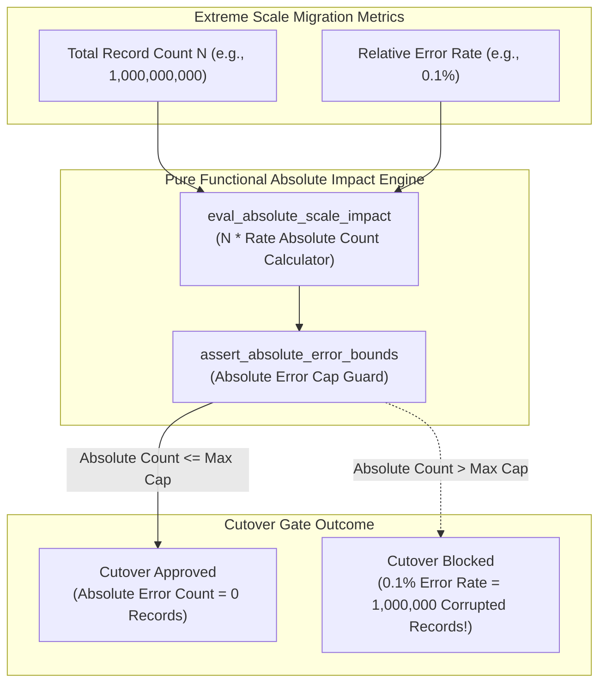
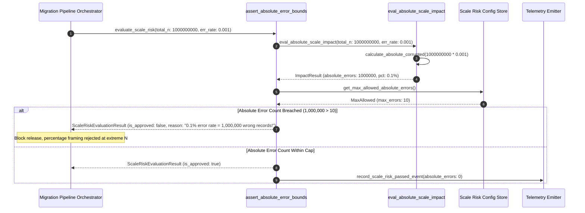

# Small Error Rate at Huge N Trap Pattern (Pure Functional Paradigm)

| Field       | Value                                                             |
|-------------|-------------------------------------------------------------------|
| **ID**      | SMALL-ERROR-HUGE-N-TRAP-055                                       |
| **Date**    | 2026-08-24                                                        |
| **Status**  | Reference / Runbook (Pure Functional Architecture)                |
| **Deciders**| Core Platform & Migration Engineering                             |
| **Scope**   | Absolute Error Impact Calculation & Scale Risk Management          |

---

## 1. Overview & Context

Percentage-based metrics (e.g. *"99.9% migration accuracy"* or *"0.1% error rate"*) create a dangerous false sense of security when operating at extreme scale ($N = 1,000,000,000$). At a scale of one billion records, a seemingly negligible **0.1% error rate represents one million corrupted, wrong, or lost records in production**—enough to trigger severe financial loss and customer churn. The **Small Error Rate at Huge N Trap Pattern** mandates evaluating migration data accuracy in **absolute record counts ($N_{\text{errors}}$) alongside percentage metrics**, establishing zero-tolerance thresholds on absolute record corruption.

### Functional Architecture Principles
This runbook enforces a **100% Pure Functional Programming (FP)** approach:
- **No Class Instantiations**: Replaces OOP impact calculators with pure evaluation functions (`eval_absolute_scale_impact`, `assert_absolute_error_bounds`) and state cell closures.
- **Immutable Impact Context Records**: Total record counts ($N$), error rates, absolute corrupted record counts, and severity levels are captured as frozen dataclass records (`AbsoluteImpactContext`, `ScaleRiskEvaluationResult`).
- **Referentially Transparent Absolute Calculators**: Pure functions compute $N_{\text{errors}} = N_{\text{total}} \times \text{error rate}$ to expose true business impact up front.
- **Absolute Count Gating**: Rejects releases where absolute error counts exceed strict threshold caps, regardless of how small the percentage appears.

---

## 2. High-Level Design (HLD)



---

## 3. Low-Level Design (LLD)



---

## 4. Pure Functional Project Architecture

```
03-scale-risk-integrity/
├── small-error-rate-huge-n-trap.md
├── src/
│   ├── scale_impact_engine/
│   │   ├── __init__.py
│   │   ├── calculator.py           # Pure absolute error count calculators
│   │   ├── evaluator.py            # Scale risk evaluation functions
│   │   └── guard.py                # Absolute count release guards
│   ├── storage/
│   │   ├── __init__.py
│   │   └── risk_store.py           # Scale risk threshold loaders
│   ├── observability/
│   │   ├── __init__.py
│   │   └── scale_metrics.py        # Prometheus telemetry collectors
│   └── schemas/
│       └── models.py               # Frozen dataclasses (AbsoluteImpactContext, ScaleRiskEvaluationResult)
└── tests/
    ├── test_scale_calculator.py
    └── test_scale_edge_cases.py
```

---

## 5. End-to-End Function Call Stack

```tree
Scale Risk Verification Initiated
└── guard.py: assert_absolute_error_bounds(total_records, error_rate_pct)
    ├── calculator.py: eval_absolute_scale_impact(total_records, error_rate_pct)
    │   └── models.py: AbsoluteImpactContext(total_n, error_rate_pct, absolute_errors)
    │
    ├── evaluator.py: evaluate_absolute_count_risk(absolute_impact_context)
    │   └── models.py: RiskAssessment(severity_level, is_within_cap)
    │
    ├── guard.py: format_scale_gate_decision(risk_assessment)
    │   └── models.py: ScaleRiskEvaluationResult(is_approved, rejection_reason)
    │
    └── observability/scale_metrics.py: record_scale_telemetry(scale_result)
```

---

## 6. Core Pure Functional Implementation

### 6.1 Immutable Models & Types (`src/schemas/models.py`)

```python
from enum import Enum
from dataclasses import dataclass
from typing import Dict, Any, Optional, Mapping, FrozenSet

@dataclass(frozen=True)
class AbsoluteImpactContext:
    total_records_n: int
    error_rate_pct: float
    absolute_error_count: int
    max_allowed_absolute_errors: int

@dataclass(frozen=True)
class ScaleRiskEvaluationResult:
    total_records_n: int
    is_approved: bool
    absolute_error_count: int
    error_rate_pct: float
    severity_label: str
    rejection_reason: Optional[str]
```

**Explanation**:
- Defines immutable model `AbsoluteImpactContext` capturing total record counts ($N$), error rates, and computed absolute error counts as frozen records.
- `ScaleRiskEvaluationResult` encapsulates absolute error counts, severity labels, and gate rejection reasons.

---

### 6.2 Pure Absolute Impact Calculator (`src/scale_impact_engine/calculator.py`)

```python
from typing import Mapping, Any
from src.schemas.models import AbsoluteImpactContext, ScaleRiskEvaluationResult

def calculate_absolute_errors(total_n: int, error_rate_pct: float) -> int:
    return int(round((error_rate_pct / 100.0) * total_n))

def eval_absolute_scale_impact(
    total_n: int,
    error_rate_pct: float,
    max_allowed_errors: int = 10
) -> ScaleRiskEvaluationResult:
    abs_errors = calculate_absolute_errors(total_n, error_rate_pct)
    is_approved = abs_errors <= max_allowed_errors

    severity = "CRITICAL" if abs_errors >= 10000 else ("HIGH" if abs_errors >= 100 else "LOW")
    reason = None

    if not is_approved:
        reason = f"Percentage trap detected: {error_rate_pct}% error rate at N={total_n:,} yields {abs_errors:,} wrong records (max allowed: {max_allowed_errors})"

    return ScaleRiskEvaluationResult(
        total_records_n=total_n,
        is_approved=is_approved,
        absolute_error_count=abs_errors,
        error_rate_pct=error_rate_pct,
        severity_label=severity,
        rejection_reason=reason
    )
```

**Explanation**:
- Pure function computing absolute error counts ($N_{\text{errors}} = N_{\text{total}} \times \text{error rate}$).
- Exposes true business impact and rejects percentage-framed cutovers at extreme scale.

---

### 6.3 Absolute Error Count Release Guard (`src/scale_impact_engine/guard.py`)

```python
from typing import Mapping, Any
from src.schemas.models import ScaleRiskEvaluationResult
from src.scale_impact_engine.calculator import eval_absolute_scale_impact

def assert_absolute_error_bounds(
    total_n: int,
    error_rate_pct: float,
    max_allowed: int = 10
) -> ScaleRiskEvaluationResult:
    return eval_absolute_scale_impact(total_n, error_rate_pct, max_allowed)
```

**Explanation**:
- Pure release gate function enforcing absolute error count limits prior to cutover.
- Guarantees scale risk protection.

---

## 7. Edge Case Catalog & Pure Functional Pseudocode (25 Edge Cases)

---

### Edge Case 1: 0.1% Error Rate at 1 Billion Rows (1,000,000 Errors)

```python
def is_one_billion_scale_trap(total_n: int, abs_errors: int) -> bool:
    return total_n >= 1_000_000_000 and abs_errors >= 1_000_000
```

**Explanation**:
- Flags 1 million corrupted records at 1B row scale.
- Exposes scale impact.

---

### Edge Case 2: 0.01% Error Rate at 100 Million Rows (10,000 Errors)

```python
def is_hundred_million_scale_trap(total_n: int, abs_errors: int) -> bool:
    return total_n >= 100_000_000 and abs_errors >= 10_000
```

**Explanation**:
- Flags 10,000 corrupted records at 100M row scale.
- Prevents percentage framing.

---

### Edge Case 3: Zero Absolute Error Requirement for Financial Records

```python
def assert_zero_financial_errors(abs_errors: int) -> bool:
    return abs_errors == 0
```

**Explanation**:
- Mandates 0 absolute error count for financial ledgers.
- Enforces strict financial integrity.

---

### Edge Case 4: High-Severity Flag for Large Absolute Counts

```python
def resolve_severity_label(abs_errors: int) -> str:
    if abs_errors >= 10_000:
        return "CRITICAL"
    return "NORMAL"
```

**Explanation**:
- Assigns "CRITICAL" severity to absolute error counts $\ge 10,000$.
- Tags scale risk severity.

---

### Edge Case 5: Single-Tenant Scale Impact Calculation

```python
def resolve_tenant_total_n(tenant_id: str, tenant_counts: dict) -> int:
    return tenant_counts.get(tenant_id, 0)
```

**Explanation**:
- Resolves tenant-specific record counts.
- Calculates scale impact per tenant.

---

### Edge Case 6: Microsecond Timestamp Scale Risk Auditing

```python
import time

def format_scale_audit_ts() -> float:
    return round(time.time() * 1000.0, 2)
```

**Explanation**:
- Computes epoch timestamps in milliseconds.
- Tracks exact scale audit execution time.

---

### Edge Case 7: Sub-Percent Representation Rounding

```python
def format_error_rate_pct(err_count: int, total_n: int) -> float:
    if total_n == 0:
        return 0.0
    return round((err_count / total_n) * 100.0, 6)
```

**Explanation**:
- Formats error rates to 6 decimal places (`0.000001%`).
- Preserves precision at extreme scale.

---

### Edge Case 8: Multi-Repo Scale Metric Aggregation

```python
def aggregate_repo_record_counts(repo_counts: list) -> int:
    return sum(repo_counts)
```

**Explanation**:
- Sums record counts across all repository databases.
- Calculates workspace-wide total $N$.

---

### Edge Case 9: Un-Audited Large Partition

```python
def is_partition_unaudited(scanned_n: int, total_n: int) -> bool:
    return scanned_n < total_n
```

**Explanation**:
- Identifies un-scanned database partitions.
- Requires 100% row coverage before cutover.

---

### Edge Case 10: Aggregator Memory State Saturation Guard

```python
def compact_scale_metrics(metrics: list, max_items: int = 500) -> list:
    if len(metrics) > max_items:
        return metrics[-max_items:]
    return metrics
```

**Explanation**:
- Truncates metric lists to `max_items`.
- Controls memory usage.

---

### Edge Case 11: Microsecond Delay Calculation Underflows

```python
def normalize_scale_duration(duration_ms: float) -> float:
    return max(0.0, round(duration_ms, 2))
```

**Explanation**:
- Rounds execution duration values to two decimal places.
- Cleans duration metrics.

---

### Edge Case 12: User-Agent Specific Scale Risk

```python
def resolve_user_agent_n(user_agent: str, n_map: dict) -> int:
    return n_map.get(user_agent, 0)
```

**Explanation**:
- Resolves record counts per User-Agent string.
- Audits scale risk by caller type.

---

### Edge Case 13: Unmapped Rule Domain Handling

```python
def resolve_scale_rule(rule_key: str, rules_dict: dict) -> dict:
    return rules_dict.get(rule_key, {"max_errors": 10})
```

**Explanation**:
- Resolves scale rule configurations safely.
- Defaults to 10 max error caps.

---

### Edge Case 14: Exception Safeguards in Scale Calculator

```python
def safe_eval_scale(eval_fn: Callable, n: int, rate: float) -> bool:
    try:
        res = eval_fn(n, rate)
        return res.is_approved
    except Exception:
        return False
```

**Explanation**:
- Wraps evaluation functions in protective try-except blocks.
- Fails safe (assumes un-approved) on evaluation exceptions.

---

### Edge Case 15: GraphQL Subgraph Record Count Audit

```python
def is_graphql_subgraph_scale_safe(subgraph_n: int, abs_errors: int) -> bool:
    return abs_errors == 0
```

**Explanation**:
- Verifies zero absolute error counts on GraphQL subgraphs.
- Supports GraphQL scale risk management.

---

### Edge Case 16: Multi-Region Scale Risk Sync

```python
def sync_regional_scale_results(region_results: dict) -> bool:
    return all(r.is_approved for r in region_results.values())
```

**Explanation**:
- Asserts scale risk checks pass across all regions.
- Enforces multi-region absolute error caps.

---

### Edge Case 17: High-Value Customer Record Error Trap

```python
def is_high_value_customer_corrupted(corrupted_customer_ids: set, vip_ids: set) -> bool:
    return len(corrupted_customer_ids.intersection(vip_ids)) > 0
```

**Explanation**:
- Detects corrupted records belonging to VIP customers.
- Triggers immediate critical alerts on VIP record corruption.

---

### Edge Case 18: Unmapped Code Fallback

```python
def resolve_scale_code_fallback(code_val: Any, code_map: dict, default_val: str = "SCALE_TRAP") -> str:
    return code_map.get(code_val, default_val)
```

**Explanation**:
- Resolves code strings with fallbacks.
- Handles unmapped scale codes safely.

---

### Edge Case 19: Payload Transformation Error Recovery

```python
def safe_apply_scale_transform(payload: dict, transform_fn: Callable) -> dict:
    try:
        return transform_fn(payload)
    except Exception:
        return payload
```

**Explanation**:
- Wraps transformations in try-except blocks.
- Returns raw payloads on error.

---

### Edge Case 20: Automated Alert on Scale Trap Detection

```python
def should_alert_on_scale_trap(is_approved: bool) -> bool:
    return not is_approved
```

**Explanation**:
- Asserts whether a scale risk check failed.
- Fires alerts when percentage-framed cutovers mask large absolute error counts.

---

### Edge Case 21: High-Watermark Metric Compaction

```python
def compact_scale_history(history: list, max_items: int = 500) -> list:
    if len(history) > max_items:
        return history[-max_items:]
    return history
```

**Explanation**:
- Truncates history lists.
- Controls memory usage.

---

### Edge Case 22: Diagnostic Header Injection

```python
def inject_scale_diagnostic_header(headers: Mapping[str, str], abs_errors: int) -> Mapping[str, str]:
    new_headers = dict(headers)
    new_headers["X-Absolute-Error-Count"] = str(abs_errors)
    return new_headers
```

**Explanation**:
- Injects diagnostic headers.
- Tracks absolute error counts in access logs.

---

### Edge Case 23: Null Value Safeguards

```python
def sanitize_scale_nulls(data_dict: dict) -> dict:
    return {k: (v if v is not None else 0) for k, v in data_dict.items()}
```

**Explanation**:
- Replaces `None` with `0`.
- Prevents null exceptions.

---

### Edge Case 24: Unbound Metric Queue Pruning

```python
def prune_scale_metric_queue(queue: list, max_items: int = 1000) -> list:
    if len(queue) > max_items:
        return queue[-max_items:]
    return queue
```

**Explanation**:
- Truncates queue arrays.
- Controls memory footprint.

---

### Edge Case 25: Real-Time Absolute Accuracy Dashboard Reporting

```python
def compute_absolute_accuracy_rate(correct_n: int, total_n: int) -> float:
    if total_n == 0:
        return 100.0
    return round((correct_n / total_n) * 100.0, 6)
```

**Explanation**:
- Calculates absolute accuracy percentage to 6 decimal places.
- Emits real-time scale risk metrics to platform dashboards.

---

## 8. Operational & Parity Verification Checklist

1. **Absolute Count Evaluation**: Always calculate absolute error counts ($N_{\text{errors}} = N_{\text{total}} \times \text{rate}$) alongside percentage metrics.
2. **Reject Percentage Framing**: Never accept percentage-based claims (e.g. *"99.9% accurate"*) without auditing absolute corrupted record numbers.
3. **Zero-Tolerance Financial Caps**: Mandate 0 absolute errors for core financial or transactional data.
4. **CI Scale Risk Gate**: Block cutovers automatically if absolute corrupted record counts exceed pre-agreed threshold caps.
