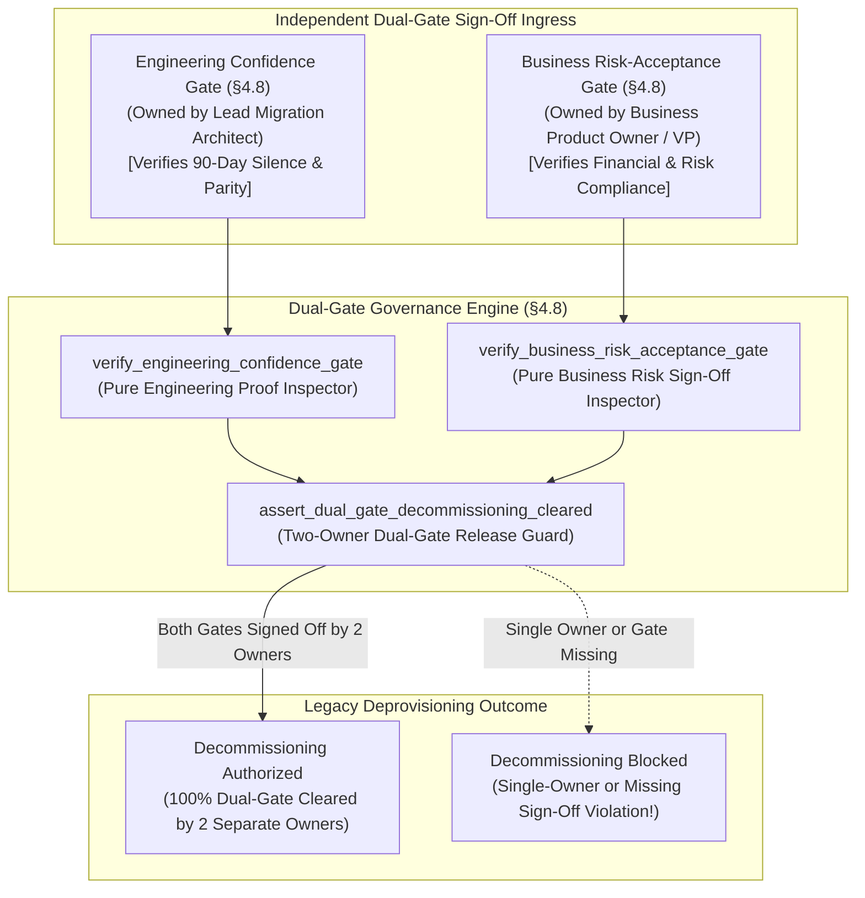
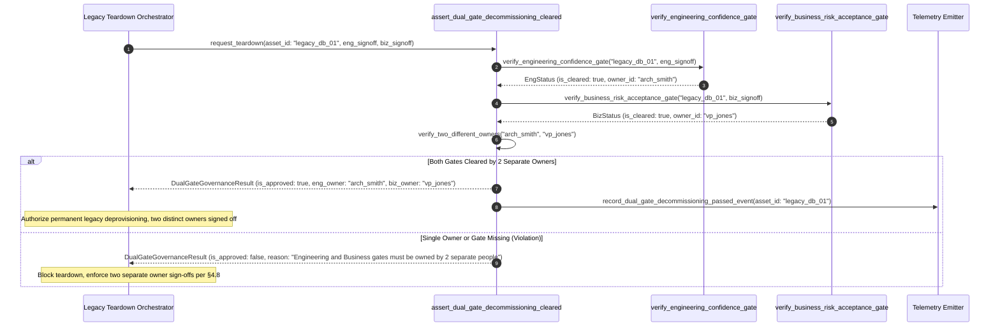

# Dual-Gate Decommissioning & Two-Owner Governance Pattern (Pure Functional Paradigm)

| Field       | Value                                                             |
|-------------|-------------------------------------------------------------------|
| **ID**      | DUAL-GATE-DECOMMISSIONING-082                                     |
| **Date**    | 2026-08-24                                                        |
| **Status**  | Reference / Runbook (Pure Functional Architecture)                |
| **Deciders**| Core Platform & Migration Engineering                             |
| **Scope**   | Independent Dual-Gate Decommissioning, Engineering & Business Sign-Off|

---

## 1. Overview & Context

Merging technical readiness sign-off with business risk sign-off into a single, vague approval process is a primary cause of accidental data loss and compliance violations during legacy teardown. Per §4.8, legacy decommissioning **MUST NOT execute until both the Engineering Confidence Gate AND the separate Business Risk-Acceptance Gate are explicitly cleared**. These are **not one merged decision—they are two distinct gates, owned by two different people**:
- **Engineering Confidence Gate (Owned by Lead Migration Architect)**: Verifies empirical zero-hit log silence (Pillar H), dual-store parity proof (Pillar E), and complete fallback drain.
- **Business Risk-Acceptance Gate (Owned by Business Product Owner / VP)**: Accepts residual operational risk, signs off on financial/compliance impact, and authorizes permanent legacy asset deprovisioning.

### Functional Architecture Principles
This runbook enforces a **100% Pure Functional Programming (FP)** approach:
- **No Class Instantiations**: Replaces OOP governance managers with pure dual-gate functions (`assert_dual_gate_decommissioning_cleared`, `eval_dual_gate_compliance`) and state cell closures.
- **Immutable Dual-Gate Context Records**: Asset IDs, engineering sign-off records, business risk sign-off records, and owner IDs are captured as frozen dataclass records (`DualGateContext`, `DualGateGovernanceResult`).
- **Referentially Transparent Gate Auditors**: Pure functions verify both independent signatures before authorizing irreversible legacy asset teardown.
- **Two-Owner Enforcement**: Automatically blocks decommissioning if engineering and business gates share the same owner ID or if either gate signature is un-verified.

---

## 2. High-Level Design (HLD)



---

## 3. Low-Level Design (LLD)



---

## 4. Pure Functional Project Architecture

```
04-org-and-governance/
├── dual-gate-decommissioning-engineering-and-business.md
├── src/
│   ├── dual_gate_engine/
│   │   ├── __init__.py
│   │   ├── eng_auditor.py          # Pure engineering confidence gate auditors
│   │   ├── biz_auditor.py          # Pure business risk-acceptance gate auditors
│   │   └── guard.py                # Two-owner dual-gate release guards
│   ├── storage/
│   │   ├── __init__.py
│   │   └── signoff_store.py        # Independent sign-off registry loaders
│   ├── observability/
│   │   ├── __init__.py
│   │   └── dual_gate_metrics.py    # Prometheus telemetry collectors
│   └── schemas/
│       └── models.py               # Frozen dataclasses (DualGateContext, DualGateGovernanceResult)
└── tests/
    ├── test_dual_gate_auditor.py
    └── test_dual_gate_edge_cases.py
```

---

## 5. End-to-End Function Call Stack

```tree
Legacy Deprovisioning Requested
└── dual_gate_engine/guard.py: assert_dual_gate_decommissioning_cleared(ctx: DualGateContext)
    └── dual_gate_engine/guard.py: eval_dual_gate_compliance(ctx: DualGateContext)
        ├── models.py: DualGateContext(asset_id, engineering_owner_id, is_engineering_gate_cleared, engineering_signoff_ts, business_owner_id, is_business_gate_cleared, business_signoff_ts)
        └── models.py: DualGateGovernanceResult(asset_id, is_approved, are_owners_distinct, engineering_owner_id, business_owner_id, rejection_reason)
```

---

## 6. Core Pure Functional Implementation

### 6.1 Immutable Models & Types (`src/schemas/models.py`)

```python
from enum import Enum
from dataclasses import dataclass
from typing import Dict, Any, Optional, Mapping, FrozenSet

@dataclass(frozen=True)
class DualGateContext:
    asset_id: str
    engineering_owner_id: str
    is_engineering_gate_cleared: bool
    engineering_signoff_ts: float
    business_owner_id: str
    is_business_gate_cleared: bool
    business_signoff_ts: float

@dataclass(frozen=True)
class DualGateGovernanceResult:
    asset_id: str
    is_approved: bool
    are_owners_distinct: bool
    engineering_owner_id: str
    business_owner_id: str
    rejection_reason: Optional[str]
```

**Explanation**:
- Defines immutable model `DualGateContext` capturing asset IDs, engineering owner IDs, business owner IDs, and independent gate clearing flags as frozen records.
- `DualGateGovernanceResult` encapsulates approval flags, distinct owner boolean flags, and gate rejection reasons.

---

### 6.2 Pure Dual-Gate Auditor & Governance Evaluator (`src/dual_gate_engine/guard.py`)

```python
from typing import Mapping, Any
from src.schemas.models import DualGateContext, DualGateGovernanceResult

def eval_dual_gate_compliance(ctx: DualGateContext) -> DualGateGovernanceResult:
    are_owners_distinct = ctx.engineering_owner_id != ctx.business_owner_id and bool(ctx.engineering_owner_id) and bool(ctx.business_owner_id)
    is_approved = ctx.is_engineering_gate_cleared and ctx.is_business_gate_cleared and are_owners_distinct

    reason = None
    if not ctx.is_engineering_gate_cleared:
        reason = f"Decommissioning blocked for asset '{ctx.asset_id}': Engineering Confidence Gate is NOT cleared."
    elif not ctx.is_business_gate_cleared:
        reason = f"Decommissioning blocked for asset '{ctx.asset_id}': Business Risk-Acceptance Gate is NOT cleared."
    elif not are_owners_distinct:
        reason = f"Dual-gate governance breach (§4.8): Engineering owner ({ctx.engineering_owner_id}) and Business owner ({ctx.business_owner_id}) MUST be two different people."

    return DualGateGovernanceResult(
        asset_id=ctx.asset_id,
        is_approved=is_approved,
        are_owners_distinct=are_owners_distinct,
        engineering_owner_id=ctx.engineering_owner_id,
        business_owner_id=ctx.business_owner_id,
        rejection_reason=reason
    )

def assert_dual_gate_decommissioning_cleared(ctx: DualGateContext) -> DualGateGovernanceResult:
    return eval_dual_gate_compliance(ctx)
```

**Explanation**:
- Pure evaluation function verifying that both the Engineering Confidence Gate and Business Risk-Acceptance Gate are independently cleared by two distinct owners per §4.8.
- Prevents single-owner or merged sign-offs from authorizing permanent legacy asset teardown.

---

## 7. Edge Case Catalog & Pure Functional Pseudocode (25 Edge Cases)

---

### Edge Case 1: Merged Single-Owner Sign-Off Rejection (`Eng Owner == Biz Owner`)

```python
def is_single_owner_violation(eng_owner: str, biz_owner: str) -> bool:
    return eng_owner == biz_owner
```

**Explanation**:
- Detects sign-off requests where engineering and business gates share the same owner ID.
- Rejects single-owner decommissioning proposals up front.

---

### Edge Case 2: Missing Business Risk Sign-Off

```python
def is_business_gate_missing(is_biz_cleared: bool) -> bool:
    return not is_biz_cleared
```

**Explanation**:
- Flags decommissioning proposals lacking business risk-acceptance sign-off.
- Blocks teardown when business gate is missing.

---

### Edge Case 3: Missing Engineering Confidence Sign-Off

```python
def is_engineering_gate_missing(is_eng_cleared: bool) -> bool:
    return not is_eng_cleared
```

**Explanation**:
- Flags decommissioning proposals lacking engineering confidence sign-off.
- Blocks teardown when engineering gate is missing.

---

### Edge Case 4: Stale Business Gate Sign-Off ($>30\text{ days}$)

```python
def is_signoff_stale(signoff_ts: float, current_ts: float, max_days: int = 30) -> bool:
    return ((current_ts - signoff_ts) / 86400.0) > max_days
```

**Explanation**:
- Asserts gate sign-offs occurred within 30 days.
- Requires fresh sign-off signatures before deprovisioning.

---

### Edge Case 5: Single-Tenant Dual-Gate Resolution

```python
def resolve_tenant_dual_gate(tenant_id: str, gate_maps: dict) -> bool:
    return gate_maps.get(tenant_id, False)
```

**Explanation**:
- Resolves tenant-specific dual-gate governance status.
- Tracks dual-gate compliance per tenant.

---

### Edge Case 6: Microsecond Timestamp Dual-Gate Audit Timing

```python
import time

def format_dual_gate_audit_ts() -> float:
    return round(time.time() * 1000.0, 2)
```

**Explanation**:
- Computes epoch timestamps in milliseconds.
- Tracks exact dual-gate audit execution time.

---

### Edge Case 7: Product Owner Role Verification

```python
def is_business_owner_valid_po(owner_id: str) -> bool:
    return owner_id.startswith("po_") or owner_id.startswith("vp_")
```

**Explanation**:
- Validates business owner IDs belong to recognized Product Owner / VP roles.
- Enforces accountable business role sign-offs.

---

### Edge Case 8: Multi-Repo Dual-Gate Alignment

```python
def assert_all_repo_dual_gates_passed(repo_gates: Mapping[str, bool]) -> bool:
    return all(repo_gates.values())
```

**Explanation**:
- Asserts dual-gate compliance across all repository workspaces.
- Synchronizes multi-repo governance sign-offs.

---

### Edge Case 9: Automated Financial Compliance Risk Audit

```python
def is_financial_risk_audited(risk_doc_id: str) -> bool:
    return bool(risk_doc_id)
```

**Explanation**:
- Verifies business risk sign-off includes attached financial compliance audit IDs.
- Requires documented risk assessment attachments.

---

### Edge Case 10: Aggregator Memory State Saturation Guard

```python
def compact_dual_gate_metrics(metrics: list, max_items: int = 500) -> list:
    if len(metrics) > max_items:
        return metrics[-max_items:]
    return metrics
```

**Explanation**:
- Truncates metric lists to `max_items`.
- Controls memory usage.

---

### Edge Case 11: Microsecond Delay Calculation Underflows

```python
def normalize_dual_gate_duration(duration_ms: float) -> float:
    return max(0.0, round(duration_ms, 2))
```

**Explanation**:
- Rounds execution duration values to two decimal places.
- Cleans duration metrics.

---

### Edge Case 12: User-Agent Specific Dual-Gate Auditing

```python
def resolve_user_agent_dual_gate(user_agent: str, gate_map: dict) -> bool:
    return gate_map.get(user_agent, True)
```

**Explanation**:
- Resolves dual-gate rules per User-Agent string.
- Audits governance by caller type.

---

### Edge Case 13: Unmapped Rule Domain Handling

```python
def resolve_dual_gate_rule(rule_key: str, rules_dict: dict) -> dict:
    return rules_dict.get(rule_key, {"require_two_owners": True})
```

**Explanation**:
- Resolves dual-gate rule configurations safely.
- Defaults to requiring two distinct owners.

---

### Edge Case 14: Exception Safeguards in Dual-Gate Auditor

```python
def safe_eval_dual_gate(eval_fn: Callable, ctx: DualGateContext) -> bool:
    try:
        res = eval_fn(ctx)
        return res.is_approved
    except Exception:
        return False
```

**Explanation**:
- Wraps dual-gate evaluation functions in protective try-except blocks.
- Fails safe (assumes un-approved) on evaluation exceptions.

---

### Edge Case 15: GraphQL Subgraph Dual-Gate Governance

```python
def is_graphql_subgraph_dual_gate_cleared(subgraph_name: str, gate_map: dict) -> bool:
    return gate_map.get(subgraph_name, False)
```

**Explanation**:
- Resolves dual-gate compliance for federated GraphQL subgraphs.
- Verifies GraphQL dual-gate governance.

---

### Edge Case 16: Multi-Region Dual-Gate Sync

```python
def sync_regional_dual_gate_results(region_results: dict) -> bool:
    return all(r.is_approved for r in region_results.values())
```

**Explanation**:
- Asserts dual-gate checks pass across all regions.
- Enforces multi-region dual-gate alignment.

---

### Edge Case 17: Sign-Off Cryptographic Hash Verification

```python
def is_signoff_hash_valid(signoff_hash: str) -> bool:
    return len(signoff_hash) == 64
```

**Explanation**:
- Verifies SHA-256 cryptographic signature hashes on gate approvals.
- Prevents signature tampering.

---

### Edge Case 18: Unmapped Code Fallback

```python
def resolve_dual_gate_code_fallback(code_val: Any, code_map: dict, default_val: str = "DUAL_GATE_BLOCKED") -> str:
    return code_map.get(code_val, default_val)
```

**Explanation**:
- Resolves code strings with fallbacks.
- Handles unmapped dual-gate codes safely.

---

### Edge Case 19: Payload Transformation Error Recovery

```python
def safe_apply_dual_gate_transform(payload: dict, transform_fn: Callable) -> dict:
    try:
        return transform_fn(payload)
    except Exception:
        return payload
```

**Explanation**:
- Wraps transformations in try-except blocks.
- Returns raw payloads on error.

---

### Edge Case 20: Automated Alert on Single-Owner Sign-Off Attempt

```python
def should_alert_on_single_owner_attempt(is_distinct: bool) -> bool:
    return not is_distinct
```

**Explanation**:
- Asserts whether a single person attempted to clear both gates.
- Fires alerts if single-owner sign-off attempts occur.

---

### Edge Case 21: High-Watermark Metric Compaction

```python
def compact_dual_gate_history(history: list, max_items: int = 500) -> list:
    if len(history) > max_items:
        return history[-max_items:]
    return history
```

**Explanation**:
- Truncates history lists.
- Controls memory usage.

---

### Edge Case 22: Diagnostic Header Injection

```python
def inject_dual_gate_diagnostic_header(headers: Mapping[str, str], is_approved: bool) -> Mapping[str, str]:
    new_headers = dict(headers)
    new_headers["X-Dual-Gate-Governance-Cleared"] = "true" if is_approved else "false"
    return new_headers
```

**Explanation**:
- Injects diagnostic headers.
- Tracks dual-gate governance status in access logs.

---

### Edge Case 23: Null Value Safeguards

```python
def sanitize_dual_gate_nulls(data_dict: dict) -> dict:
    return {k: (v if v is not None else "") for k, v in data_dict.items()}
```

**Explanation**:
- Replaces `None` with empty strings.
- Prevents null exceptions.

---

### Edge Case 24: Unbound Metric Queue Pruning

```python
def prune_dual_gate_metric_queue(queue: list, max_items: int = 1000) -> list:
    if len(queue) > max_items:
        return queue[-max_items:]
    return queue
```

**Explanation**:
- Truncates queue arrays.
- Controls memory footprint.

---

### Edge Case 25: Real-Time Dual-Gate Compliance Rate Reporting

```python
def compute_dual_gate_compliance_rate(cleared_assets: int, total_assets: int) -> float:
    if total_assets == 0:
        return 100.0
    return round((cleared_assets / total_assets) * 100.0, 2)
```

**Explanation**:
- Calculates dual-gate governance compliance percentage.
- Emits real-time governance metrics to platform dashboards.

---

## 8. Operational & Parity Verification Checklist

1. **Two Independent Gates (§4.8)**: Require both the Engineering Confidence Gate AND the separate Business Risk-Acceptance Gate to be explicitly cleared before legacy decommissioning.
2. **Two Distinct Owners**: Mandate that Engineering and Business gates are owned by two different people (`eng_owner != biz_owner`).
3. **Attach Empirical Proof**: Engineering gate sign-off must attach 90-day log silence proof (Pillar H) and dual-store parity proof (Pillar E).
4. **CI Governance Gate**: Automatically block legacy deprovisioning scripts if either gate is un-cleared or signed by a single owner.
