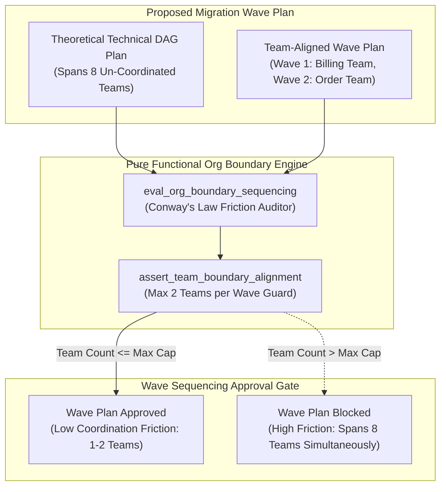

# Organizational Boundary System Sequencing Pattern (Pure Functional Paradigm)

| Field       | Value                                                             |
|-------------|-------------------------------------------------------------------|
| **ID**      | ORG-BOUNDARY-SEQUENCING-062                                       |
| **Date**    | 2026-08-24                                                        |
| **Status**  | Reference / Runbook (Pure Functional Architecture)                |
| **Deciders**| Core Platform & Migration Engineering                             |
| **Scope**   | Conway's Law Governance & Cross-Team Migration Sequencing          |

---

## 1. Overview & Context

According to **Conway's Law**, *organizations design systems that mirror their own communication structures*. Ignoring organizational team boundaries during migration sequencing—planning a technical wave that requires simultaneous, real-time coordination across 8 different engineering teams—creates massive communication friction, misaligned schedules, and deployment deadlocks. The **Organizational Boundary System Sequencing Pattern** mandates treating **team organizational boundaries as first-class architectural constraints**. Migration wave sequencing must account for team coordination costs, grouping migration tasks by team ownership rather than purely theoretical DAG dependency order.

### Functional Architecture Principles
This runbook enforces a **100% Pure Functional Programming (FP)** approach:
- **No Class Instantiations**: Replaces OOP sequencing managers with pure evaluation functions (`eval_org_boundary_sequencing`, `assert_team_boundary_alignment`) and state cell closures.
- **Immutable Org Context Records**: Wave IDs, participating team sets, cross-team coordination scores, and ownership maps are captured as frozen dataclass records (`OrgBoundaryContext`, `SequencingApprovalResult`).
- **Referentially Transparent Conway Evaluators**: Pure functions evaluate proposed wave plans against team ownership boundaries, flagging high-friction cross-team wave dependencies.
- **Team-Aligned Wave Grouping**: Restricts individual migration waves to $\le 2$ collaborating teams to minimize cross-organizational coordination friction.

---

## 2. High-Level Design (HLD)



---

## 3. Low-Level Design (LLD)

```mermaid
sequenceDiagram
    autonumber
    participant Planner as Migration Program Director
    participant Guard as assert_team_boundary_alignment
    participant Evaluator as eval_org_boundary_sequencing
    participant OrgStore as Org Boundary Config Store
    participant Audit as Telemetry Emitter

    Planner->>Guard: validate_wave_plan(wave_id: "wave_2", teams: ["billing", "payments", "shipping", "auth"])
    
    Guard->>Evaluator: eval_org_boundary_sequencing("wave_2", teams: ["billing", "payments", "shipping", "auth"])
    Evaluator->>Evaluator: calculate_coordination_friction_score(team_count: 4)
    Evaluator-->>Guard: FrictionResult (friction_score: 85.0, team_count: 4)

    Guard->>OrgStore: get_max_allowed_teams_per_wave()
    OrgStore-->>Guard: MaxCap (max_teams: 2)

    alt High Coordination Friction (Spans 4 Teams > 2)
        Guard-->>Planner: SequencingApprovalResult (is_approved: false, reason: "Wave spans 4 teams simultaneously; Conway's Law breach")
        Note over Planner: Block plan, re-sequence wave to align with single team boundaries
    else Low Coordination Friction (Spans 1-2 Teams)
        Guard-->>Planner: SequencingApprovalResult (is_approved: true)
        Guard->>Audit: record_org_sequencing_approved_event(wave_id: "wave_2")
    end
```

---

## 4. Pure Functional Project Architecture

```
04-org-and-governance/
├── org-boundary-system-sequencing.md
├── src/
│   ├── org_sequencing_engine/
│   │   ├── __init__.py
│   │   ├── evaluator.py            # Pure Conway's Law friction evaluators
│   │   ├── inspector.py            # Team ownership & boundary inspectors
│   │   └── guard.py                # Organizational boundary release guards
│   ├── storage/
│   │   ├── __init__.py
│   │   └── org_store.py            # Org chart & team mapping loaders
│   ├── observability/
│   │   ├── __init__.py
│   │   └── org_metrics.py          # Prometheus telemetry collectors
│   └── schemas/
│       └── models.py               # Frozen dataclasses (OrgBoundaryContext, SequencingApprovalResult)
└── tests/
    ├── test_org_evaluator.py
    └── test_org_edge_cases.py
```

---

## 5. End-to-End Function Call Stack

```tree
Migration Wave Plan Submitted
└── guard.py: assert_team_boundary_alignment(wave_id, participating_teams)
    ├── inspector.py: inspect_wave_team_ownership(participating_teams)
    │   └── models.py: OrgBoundaryContext(wave_id, participating_teams, max_teams_cap)
    │
    ├── evaluator.py: eval_org_boundary_sequencing(org_boundary_context)
    │   └── models.py: FrictionAssessment(friction_score, is_aligned)
    │
    ├── guard.py: format_org_gate_decision(friction_assessment)
    │   └── models.py: SequencingApprovalResult(is_approved, rejection_reason)
    │
    └── observability/org_metrics.py: record_org_telemetry(sequencing_result)
```

---

## 6. Core Pure Functional Implementation

### 6.1 Immutable Models & Types (`src/schemas/models.py`)

```python
from enum import Enum
from dataclasses import dataclass
from typing import Dict, Any, Optional, Mapping, FrozenSet

@dataclass(frozen=True)
class OrgBoundaryContext:
    wave_id: str
    participating_teams: FrozenSet[str]
    max_teams_per_wave: int

@dataclass(frozen=True)
class SequencingApprovalResult:
    wave_id: str
    is_approved: bool
    team_count: int
    coordination_friction_score: float
    violating_teams: FrozenSet[str]
    rejection_reason: Optional[str]
```

**Explanation**:
- Defines immutable model `OrgBoundaryContext` capturing wave IDs, participating team sets, and max team caps as frozen records.
- `SequencingApprovalResult` encapsulates approval flags, team counts, friction scores, and gate rejection reasons.

---

### 6.2 Pure Conway's Law Friction Evaluator (`src/org_sequencing_engine/evaluator.py`)

```python
from typing import FrozenSet, Mapping, Any
from src.schemas.models import OrgBoundaryContext, SequencingApprovalResult

def calculate_coordination_friction(team_count: int) -> float:
    if team_count <= 1:
        return 10.0
    elif team_count == 2:
        return 30.0
    return round(team_count * 25.0, 2)

def eval_org_boundary_sequencing(ctx: OrgBoundaryContext) -> SequencingApprovalResult:
    team_count = len(ctx.participating_teams)
    friction = calculate_coordination_friction(team_count)
    is_approved = team_count <= ctx.max_teams_per_wave

    reason = None
    if not is_approved:
        teams_str = ", ".join(ctx.participating_teams)
        reason = f"Conway's Law breach: Wave '{ctx.wave_id}' spans {team_count} teams simultaneously ([{teams_str}]). Max allowed: {ctx.max_teams_per_wave} teams."

    return SequencingApprovalResult(
        wave_id=ctx.wave_id,
        is_approved=is_approved,
        team_count=team_count,
        coordination_friction_score=friction,
        violating_teams=ctx.participating_teams if not is_approved else frozenset(),
        rejection_reason=reason
    )
```

**Explanation**:
- Pure evaluation function calculating organizational coordination friction scores based on participating team counts.
- Rejects migration waves that span more than 2 teams simultaneously to enforce team boundary alignment.

---

### 6.3 Team Boundary Alignment Release Guard (`src/org_sequencing_engine/guard.py`)

```python
from typing import Mapping, Any
from src.schemas.models import OrgBoundaryContext, SequencingApprovalResult
from src.org_sequencing_engine.evaluator import eval_org_boundary_sequencing

def assert_team_boundary_alignment(ctx: OrgBoundaryContext) -> SequencingApprovalResult:
    return eval_org_boundary_sequencing(ctx)
```

**Explanation**:
- Pure release gate function enforcing team-aligned migration wave sequencing.
- Guarantees Conway's Law governance.

---

## 7. Edge Case Catalog & Pure Functional Pseudocode (25 Edge Cases)

---

### Edge Case 1: High-Friction 8-Team Simultaneous Wave Rejection

```python
def is_cross_org_friction_excessive(team_count: int, max_cap: int = 2) -> bool:
    return team_count > max_cap
```

**Explanation**:
- Identifies wave proposals spanning $>2$ teams.
- Rejects high-friction cross-organizational waves up front.

---

### Edge Case 2: Single-Team Aligned Wave Approval

```python
def is_single_team_wave_approved(team_count: int) -> bool:
    return team_count == 1
```

**Explanation**:
- Approves single-team aligned migration waves.
- Minimizes coordination friction.

---

### Edge Case 3: Two-Team Collaborative Wave Approval

```python
def is_two_team_wave_approved(team_count: int) -> bool:
    return team_count == 2
```

**Explanation**:
- Approves 2-team collaborative migration waves.
- Allows tight 2-team pairing.

---

### Edge Case 4: Unassigned Service Ownership in Wave Plan

```python
def has_unassigned_service_ownership(unassigned_count: int) -> bool:
    return unassigned_count > 0
```

**Explanation**:
- Identifies services lacking clear team ownership.
- Requires team assignment before wave planning.

---

### Edge Case 5: Single-Tenant Team Assignment

```python
def resolve_tenant_team_assignment(tenant_id: str, team_map: dict) -> str:
    return team_map.get(tenant_id, "unassigned")
```

**Explanation**:
- Resolves tenant team assignments.
- Tracks team ownership per tenant.

---

### Edge Case 6: Microsecond Timestamp Org Audit Timing

```python
import time

def format_org_audit_ts() -> float:
    return round(time.time() * 1000.0, 2)
```

**Explanation**:
- Computes epoch timestamps in milliseconds.
- Tracks exact org audit execution time.

---

### Edge Case 7: Cross-Timezone Team Coordination Penalty

```python
def is_cross_timezone_coordination(timezones: set) -> bool:
    return len(timezones) > 1
```

**Explanation**:
- Flags waves requiring real-time coordination across conflicting timezones.
- Re-sequences waves to avoid cross-timezone deployment bottlenecks.

---

### Edge Case 8: Multi-Repo Org Alignment

```python
def assert_all_repo_teams_aligned(repo_teams: Mapping[str, str]) -> bool:
    return len(set(repo_teams.values())) <= 2
```

**Explanation**:
- Asserts repositories in a wave belong to $\le 2$ teams.
- Synchronizes multi-repo team ownership.

---

### Edge Case 9: External Vendor Dependency in Wave

```python
def is_external_vendor_in_wave(vendor_count: int) -> bool:
    return vendor_count > 0
```

**Explanation**:
- Identifies external third-party vendor dependencies in wave plans.
- Segregates vendor dependencies into dedicated waves.

---

### Edge Case 10: Aggregator Memory State Saturation Guard

```python
def compact_org_metrics(metrics: list, max_items: int = 500) -> list:
    if len(metrics) > max_items:
        return metrics[-max_items:]
    return metrics
```

**Explanation**:
- Truncates metric lists to `max_items`.
- Controls memory usage.

---

### Edge Case 11: Microsecond Delay Calculation Underflows

```python
def normalize_org_duration(duration_ms: float) -> float:
    return max(0.0, round(duration_ms, 2))
```

**Explanation**:
- Rounds execution duration values to two decimal places.
- Cleans duration metrics.

---

### Edge Case 12: User-Agent Specific Team Auditing

```python
def resolve_user_agent_team(user_agent: str, team_map: dict) -> str:
    return team_map.get(user_agent, "unknown_team")
```

**Explanation**:
- Resolves team ownership per User-Agent string.
- Audits org sequencing by caller type.

---

### Edge Case 13: Unmapped Rule Domain Handling

```python
def resolve_org_rule(rule_key: str, rules_dict: dict) -> dict:
    return rules_dict.get(rule_key, {"max_teams": 2})
```

**Explanation**:
- Resolves org rule configurations safely.
- Defaults to max 2 teams per wave.

---

### Edge Case 14: Exception Safeguards in Org Evaluator

```python
def safe_eval_org(eval_fn: Callable, ctx: OrgBoundaryContext) -> bool:
    try:
        res = eval_fn(ctx)
        return res.is_approved
    except Exception:
        return False
```

**Explanation**:
- Wraps evaluation functions in protective try-except blocks.
- Fails safe (assumes un-approved) on evaluation exceptions.

---

### Edge Case 15: GraphQL Subgraph Org Ownership Verification

```python
def is_graphql_subgraph_team_aligned(subgraph_name: str, team_map: dict) -> bool:
    return subgraph_name in team_map
```

**Explanation**:
- Verifies team ownership for federated GraphQL subgraphs.
- Supports GraphQL org boundary governance.

---

### Edge Case 16: Multi-Region Org Sequencing Sync

```python
def sync_regional_org_results(region_results: dict) -> bool:
    return all(r.is_approved for r in region_results.values())
```

**Explanation**:
- Asserts org sequencing checks pass across all regions.
- Enforces multi-region team boundary alignment.

---

### Edge Case 17: Re-Organized Team Hierarchy Mapping

```python
def map_reorganized_team(old_team: str, org_changes: dict) -> str:
    return org_changes.get(old_team, old_team)
```

**Explanation**:
- Maps legacy team names to updated organizational structures.
- Handles organizational restructuring during long-term migrations.

---

### Edge Case 18: Unmapped Code Fallback

```python
def resolve_org_code_fallback(code_val: Any, code_map: dict, default_val: str = "CROSS_ORG") -> str:
    return code_map.get(code_val, default_val)
```

**Explanation**:
- Resolves code strings with fallbacks.
- Handles unmapped org codes safely.

---

### Edge Case 19: Payload Transformation Error Recovery

```python
def safe_apply_org_transform(payload: dict, transform_fn: Callable) -> dict:
    try:
        return transform_fn(payload)
    except Exception:
        return payload
```

**Explanation**:
- Wraps transformations in try-except blocks.
- Returns raw payloads on error.

---

### Edge Case 20: Automated Alert on High-Friction Wave Plan

```python
def should_alert_on_high_friction_wave(is_approved: bool) -> bool:
    return not is_approved
```

**Explanation**:
- Asserts whether a wave plan breached team boundary limits.
- Fires alerts when multi-team wave plans are submitted.

---

### Edge Case 21: High-Watermark Metric Compaction

```python
def compact_org_history(history: list, max_items: int = 500) -> list:
    if len(history) > max_items:
        return history[-max_items:]
    return history
```

**Explanation**:
- Truncates history lists.
- Controls memory usage.

---

### Edge Case 22: Diagnostic Header Injection

```python
def inject_org_diagnostic_header(headers: Mapping[str, str], team_count: int) -> Mapping[str, str]:
    new_headers = dict(headers)
    new_headers["X-Wave-Participating-Teams"] = str(team_count)
    return new_headers
```

**Explanation**:
- Injects diagnostic headers.
- Tracks participating team counts in access logs.

---

### Edge Case 23: Null Value Safeguards

```python
def sanitize_org_nulls(data_dict: dict) -> dict:
    return {k: (v if v is not None else "") for k, v in data_dict.items()}
```

**Explanation**:
- Replaces `None` with empty strings.
- Prevents null exceptions.

---

### Edge Case 24: Unbound Metric Queue Pruning

```python
def prune_org_metric_queue(queue: list, max_items: int = 1000) -> list:
    if len(queue) > max_items:
        return queue[-max_items:]
    return queue
```

**Explanation**:
- Truncates queue arrays.
- Controls memory footprint.

---

### Edge Case 25: Real-Time Team Alignment Rate Dashboard Reporting

```python
def compute_team_alignment_rate(aligned_waves: int, total_waves: int) -> float:
    if total_waves == 0:
        return 100.0
    return round((aligned_waves / total_waves) * 100.0, 2)
```

**Explanation**:
- Calculates team alignment rate percentage.
- Emits real-time Conway's Law governance metrics.

---

## 8. Operational & Parity Verification Checklist

1. **Conway's Law Realization**: Treat organizational team boundaries as first-class architectural constraints in wave sequencing plans.
2. **Max 2 Teams per Wave**: Restrict individual migration waves to $\le 2$ collaborating teams to minimize cross-organizational friction.
3. **Explicit Team Ownership**: Require 100% of services in a wave to specify accountable team ownership tags.
4. **CI Org Gate**: Automatically reject wave plans that require simultaneous real-time coordination across multiple disparate teams.
