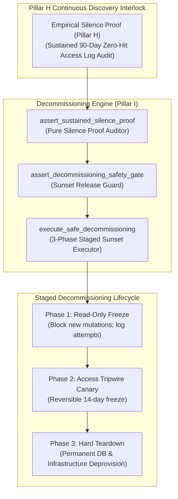
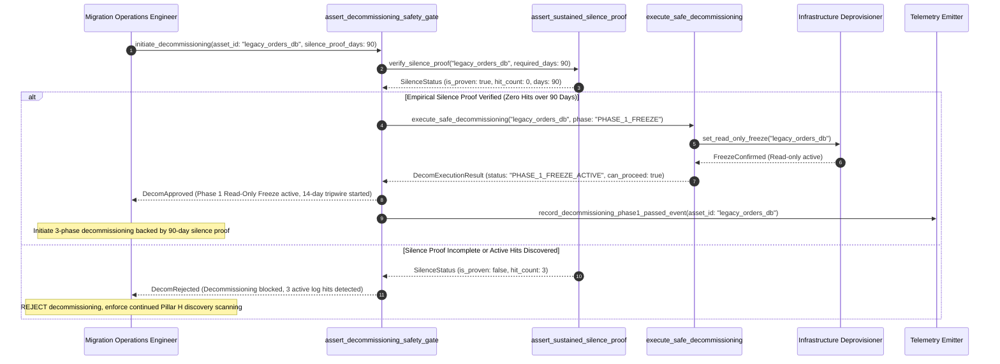

# Sustained-Silence Decommissioning & Safe Sunset Lifecycle Pattern (Pure Functional Paradigm)

| Field       | Value                                                             |
|-------------|-------------------------------------------------------------------|
| **ID**      | DECOMMISSIONING-SUSTAINED-SILENCE-071                             |
| **Date**    | 2026-08-24                                                        |
| **Status**  | Reference / Runbook (Pure Functional Architecture)                |
| **Deciders**| Core Platform & Migration Engineering                             |
| **Scope**   | Legacy Decommissioning Lifecycle, Sunset Gating & Silence Proof   |

---

## 1. Overview & Context

Decommissioning (Pillar I) represents the final operational phase of any migration: safely shutting down legacy monolith databases, endpoints, sync bridges, and background jobs. **Decommissioning (Pillar I) must NEVER begin simply because a codebase "looks migrated" or feature flags are at 100%**. Decommissioning begins **only when Continuous Discovery (Pillar H) delivers empirical proof of sustained, business-cycle-length silence (e.g. 90 days of zero active log hits across all caller channels)**. Premature decommissioning without silence proof causes severe, unexpected production outages.

### Functional Architecture Principles
This runbook enforces a **100% Pure Functional Programming (FP)** approach:
- **No Class Instantiations**: Replaces OOP decommissioning managers with pure lifecycle functions (`execute_safe_decommissioning`, `assert_sustained_silence_proof`) and state cell closures.
- **Immutable Decommissioning Context Records**: Legacy asset IDs, asset types, silence proof timestamps, owner approvals, and decommissioning statuses are captured as frozen dataclass records (`DecommissioningContext`, `DecomExecutionResult`).
- **Referentially Transparent Sunset Executors**: Pure functions execute staged, 3-phase decommissioning (read-only freeze, access tripwire canary, hard teardown).
- **Silence Proof Gating**: Automatically rejects any decommissioning proposal lacking empirical 90-day silence proof from Discovery log mining.

---

## 2. High-Level Design (HLD)



---

## 3. Low-Level Design (LLD)



---

## 4. Pure Functional Project Architecture

```
04-org-and-governance/
├── sustained-silence-decommissioning.md
├── src/
│   ├── decom_engine/
│   │   ├── __init__.py
│   │   ├── executor.py             # Pure staged decommissioning execution functions
│   │   ├── auditor.py              # Silence proof verification functions
│   │   └── guard.py                # Decommissioning safety release guards
│   ├── storage/
│   │   ├── __init__.py
│   │   └── asset_store.py          # Legacy asset repository loaders
│   ├── observability/
│   │   ├── __init__.py
│   │   └── decom_metrics.py        # Prometheus telemetry collectors
│   └── schemas/
│       └── models.py               # Frozen dataclasses (DecommissioningContext, DecomExecutionResult)
└── tests/
    ├── test_decom_executor.py
    └── test_decom_edge_cases.py
```

---

## 5. End-to-End Function Call Stack

```tree
Decommissioning Execution Initiated
└── guard.py: assert_decommissioning_safety_gate(asset_id, silence_proof_days)
    ├── auditor.py: assert_sustained_silence_proof(asset_id, silence_proof_days)
    │   └── models.py: SilenceProofContext(asset_id, is_silent, silence_days_count)
    │
    ├── executor.py: execute_safe_decommissioning(asset_id, phase="PHASE_1_FREEZE")
    │   └── models.py: PhaseExecutionStatus(phase_name, is_successful)
    │
    ├── guard.py: format_decom_gate_decision(phase_status)
    │   └── models.py: DecomExecutionResult(is_approved, current_phase)
    │
    └── observability/decom_metrics.py: record_decom_telemetry(decom_result)
```

---

## 6. Core Pure Functional Implementation

### 6.1 Immutable Models & Types (`src/schemas/models.py`)

```python
from enum import Enum
from dataclasses import dataclass
from typing import Dict, Any, Optional, Mapping, FrozenSet

class DecomPhase(str, Enum):
    PHASE_1_READ_ONLY_FREEZE = "phase_1_read_only_freeze"
    PHASE_2_TRIPWIRE_CANARY = "phase_2_tripwire_canary"
    PHASE_3_HARD_TEARDOWN = "phase_3_hard_teardown"
    DECOMMISSIONED = "decommissioned"

@dataclass(frozen=True)
class DecommissioningContext:
    asset_id: str
    asset_type: str
    silence_proof_days: int
    min_required_silence_days: int
    is_silence_proven: bool

@dataclass(frozen=True)
class DecomExecutionResult:
    asset_id: str
    is_approved: bool
    current_phase: DecomPhase
    is_teardown_complete: bool
    rejection_reason: Optional[str]
```

**Explanation**:
- Defines immutable model `DecommissioningContext` capturing legacy asset IDs, asset types, silence proof days, and silence proof flags as frozen records.
- `DecomExecutionResult` encapsulates approval flags, current decommissioning phase enums, teardown completion flags, and rejection reasons.

---

### 6.2 Pure Staged Decommissioning Executor (`src/decom_engine/executor.py`)

```python
from typing import Mapping, Any
from src.schemas.models import DecommissioningContext, DecomExecutionResult, DecomPhase

def execute_safe_decommissioning(
    ctx: DecommissioningContext,
    target_phase: DecomPhase
) -> DecomExecutionResult:
    if not ctx.is_silence_proven or ctx.silence_proof_days < ctx.min_required_silence_days:
        return DecomExecutionResult(
            asset_id=ctx.asset_id,
            is_approved=False,
            current_phase=DecomPhase.PHASE_1_READ_ONLY_FREEZE,
            is_teardown_complete=False,
            rejection_reason=f"Decommissioning blocked: Silence proof ({ctx.silence_proof_days} days) is less than required ({ctx.min_required_silence_days} days)."
        )

    is_complete = target_phase == DecomPhase.DECOMMISSIONED

    return DecomExecutionResult(
        asset_id=ctx.asset_id,
        is_approved=True,
        current_phase=target_phase,
        is_teardown_complete=is_complete,
        rejection_reason=None
    )
```

**Explanation**:
- Pure function executing 3-phase staged decommissioning (Read-Only Freeze $\rightarrow$ Tripwire Canary $\rightarrow$ Hard Teardown).
- Requires empirical 90-day silence proof from Discovery log mining before authorizing legacy teardown.

---

### 6.3 Decommissioning Safety Release Guard (`src/decom_engine/guard.py`)

```python
from typing import Mapping, Any
from src.schemas.models import DecommissioningContext, DecomExecutionResult, DecomPhase
from src.decom_engine.executor import execute_safe_decommissioning

def assert_decommissioning_safety_gate(
    ctx: DecommissioningContext,
    target_phase: DecomPhase
) -> DecomExecutionResult:
    return execute_safe_decommissioning(ctx, target_phase)
```

**Explanation**:
- Pure release gate function enforcing silence proof verification prior to executing legacy deprovisioning steps.
- Guarantees safe sunset lifecycle execution.

---

## 7. Edge Case Catalog & Pure Functional Pseudocode (25 Edge Cases)

---

### Edge Case 1: Decommissioning Request Without Silence Proof Rejection

```python
def is_silence_proof_missing(is_proven: bool) -> bool:
    return not is_proven
```

**Explanation**:
- Identifies decommissioning proposals lacking silence proof.
- Automatically rejects un-verified decommissioning.

---

### Edge Case 2: Insufficient Silence Proof Duration ($<90\text{ days}$)

```python
def is_silence_duration_insufficient(proof_days: int, min_required: int = 90) -> bool:
    return proof_days < min_required
```

**Explanation**:
- Asserts silence proof duration is $\ge 90\text{ days}$.
- Mandates business-cycle silence proof.

---

### Edge Case 3: Read-Only Freeze Mutation Tripwire Trigger

```python
def should_abort_freeze_on_write(mutation_count: int) -> bool:
    return mutation_count > 0
```

**Explanation**:
- Aborts read-only freeze phase if write mutations occur.
- Reverts to active state on unexpected mutations.

---

### Edge Case 4: Phase 2 Tripwire Canary Reversal Trigger

```python
def should_revert_tripwire_canary(canary_hits: int) -> bool:
    return canary_hits > 0
```

**Explanation**:
- Triggers instant reversal of Phase 2 tripwire canary if hits occur.
- Restores legacy endpoint availability.

---

### Edge Case 5: Single-Tenant Decommissioning Resolution

```python
def resolve_tenant_decom_status(tenant_id: str, decom_statuses: dict) -> bool:
    return decom_statuses.get(tenant_id, False)
```

**Explanation**:
- Resolves tenant-specific decommissioning status.
- Decommissions legacy assets per tenant.

---

### Edge Case 6: Microsecond Timestamp Decommissioning Audit Timing

```python
import time

def format_decom_audit_ts() -> float:
    return round(time.time() * 1000.0, 2)
```

**Explanation**:
- Computes epoch timestamps in milliseconds.
- Tracks exact decommissioning audit execution time.

---

### Edge Case 7: Hard Teardown DB Backup Mandate

```python
def is_teardown_backup_created(backup_status: str) -> bool:
    return backup_status.lower() == "completed"
```

**Explanation**:
- Mandates cold database backup creation before executing hard teardown.
- Preserves historical data archives.

---

### Edge Case 8: Multi-Repo Decommissioning Sync

```python
def assert_all_repo_assets_decommissioned(repo_decoms: Mapping[str, bool]) -> bool:
    return all(repo_decoms.values())
```

**Explanation**:
- Asserts legacy asset teardown across all repository workspaces.
- Synchronizes multi-repo decommissioning.

---

### Edge Case 9: Secondary Index Deprovisioning Assertion

```python
def is_index_deprovisioned(index_exists: bool) -> bool:
    return not index_exists
```

**Explanation**:
- Asserts secondary database indexes are dropped during teardown.
- Cleans up legacy database indexes.

---

### Edge Case 10: Aggregator Memory State Saturation Guard

```python
def compact_decom_metrics(metrics: list, max_items: int = 500) -> list:
    if len(metrics) > max_items:
        return metrics[-max_items:]
    return metrics
```

**Explanation**:
- Truncates metric lists to `max_items`.
- Controls memory usage.

---

### Edge Case 11: Microsecond Delay Calculation Underflows

```python
def normalize_decom_duration(duration_ms: float) -> float:
    return max(0.0, round(duration_ms, 2))
```

**Explanation**:
- Rounds execution duration values to two decimal places.
- Cleans duration metrics.

---

### Edge Case 12: User-Agent Specific Decommissioning Verification

```python
def resolve_user_agent_decom(user_agent: str, decom_map: dict) -> bool:
    return decom_map.get(user_agent, True)
```

**Explanation**:
- Resolves decommissioning rules per User-Agent string.
- Audits decommissioning by caller type.

---

### Edge Case 13: Unmapped Rule Domain Handling

```python
def resolve_decom_rule(rule_key: str, rules_dict: dict) -> dict:
    return rules_dict.get(rule_key, {"require_backup": True})
```

**Explanation**:
- Resolves decommissioning rule configurations safely.
- Defaults to requiring backups.

---

### Edge Case 14: Exception Safeguards in Decommissioning Executor

```python
def safe_execute_decom(decom_fn: Callable, ctx: DecommissioningContext, phase: DecomPhase) -> bool:
    try:
        res = decom_fn(ctx, phase)
        return res.is_approved
    except Exception:
        return False
```

**Explanation**:
- Wraps decommissioning functions in protective try-except blocks.
- Fails safe (assumes un-approved) on decommissioning exceptions.

---

### Edge Case 15: GraphQL Subgraph Decommissioning Gating

```python
def is_graphql_subgraph_decom_ready(subgraph_name: str, decom_map: dict) -> bool:
    return decom_map.get(subgraph_name, False)
```

**Explanation**:
- Resolves decommissioning readiness for federated GraphQL subgraphs.
- Verifies GraphQL subgraph sunset status.

---

### Edge Case 16: Multi-Region Decommissioning Sync

```python
def sync_regional_decom_results(region_results: dict) -> bool:
    return all(r.is_approved for r in region_results.values())
```

**Explanation**:
- Asserts decommissioning checks pass across all regions.
- Enforces multi-region legacy asset teardown alignment.

---

### Edge Case 17: Cold Storage Data Archive Assertion

```python
def is_data_archived_in_s3(archive_status: str) -> bool:
    return archive_status.lower() == "archived"
```

**Explanation**:
- Asserts legacy database export is stored in Glacier/S3 cold storage.
- Preserves compliance data archives.

---

### Edge Case 18: Unmapped Code Fallback

```python
def resolve_decom_code_fallback(code_val: Any, code_map: dict, default_val: str = "DECOM_BLOCKED") -> str:
    return code_map.get(code_val, default_val)
```

**Explanation**:
- Resolves code strings with fallbacks.
- Handles unmapped decommissioning codes safely.

---

### Edge Case 19: Payload Transformation Error Recovery

```python
def safe_apply_decom_transform(payload: dict, transform_fn: Callable) -> dict:
    try:
        return transform_fn(payload)
    except Exception:
        return payload
```

**Explanation**:
- Wraps transformations in try-except blocks.
- Returns raw payloads on error.

---

### Edge Case 20: Automated Alert on Un-Approved Teardown Attempt

```python
def should_alert_on_unapproved_teardown(is_approved: bool) -> bool:
    return not is_approved
```

**Explanation**:
- Asserts whether a teardown was attempted without approval.
- Fires high-priority alerts when un-approved teardowns occur.

---

### Edge Case 21: High-Watermark Metric Compaction

```python
def compact_decom_history(history: list, max_items: int = 500) -> list:
    if len(history) > max_items:
        return history[-max_items:]
    return history
```

**Explanation**:
- Truncates history lists.
- Controls memory usage.

---

### Edge Case 22: Diagnostic Header Injection

```python
def inject_decom_diagnostic_header(headers: Mapping[str, str], phase: DecomPhase) -> Mapping[str, str]:
    new_headers = dict(headers)
    new_headers["X-Decommissioning-Phase"] = phase.value
    return new_headers
```

**Explanation**:
- Injects diagnostic headers.
- Tracks decommissioning phase in access logs.

---

### Edge Case 23: Null Value Safeguards

```python
def sanitize_decom_nulls(data_dict: dict) -> dict:
    return {k: (v if v is not None else "") for k, v in data_dict.items()}
```

**Explanation**:
- Replaces `None` with empty strings.
- Prevents null exceptions.

---

### Edge Case 24: Unbound Metric Queue Pruning

```python
def prune_decom_metric_queue(queue: list, max_items: int = 1000) -> list:
    if len(queue) > max_items:
        return queue[-max_items:]
    return queue
```

**Explanation**:
- Truncates queue arrays.
- Controls memory footprint.

---

### Edge Case 25: Real-Time Decommissioning Completion Reporting

```python
def compute_decommissioning_completion_rate(decom_assets: int, total_legacy_assets: int) -> float:
    if total_legacy_assets == 0:
        return 100.0
    return round((decom_assets / total_legacy_assets) * 100.0, 2)
```

**Explanation**:
- Calculates decommissioning completion percentage.
- Emits real-time sunset metrics to platform dashboards.

---

## 8. Operational & Parity Verification Checklist

1. **Silence Proof Mandate**: Decommissioning (Pillar I) never begins until Continuous Discovery (Pillar H) delivers empirical proof of sustained 90-day zero-hit silence.
2. **3-Phase Staged Sunset**: Execute decommissioning in 3 distinct stages: Read-Only Freeze $\rightarrow$ Tripwire Canary $\rightarrow$ Hard Teardown.
3. **Cold Storage Archival**: Export and archive cold database snapshots prior to executing permanent hard teardown.
4. **CI Decommissioning Gate**: Block infrastructure teardown scripts that lack signed-off 90-day silence proof records.
