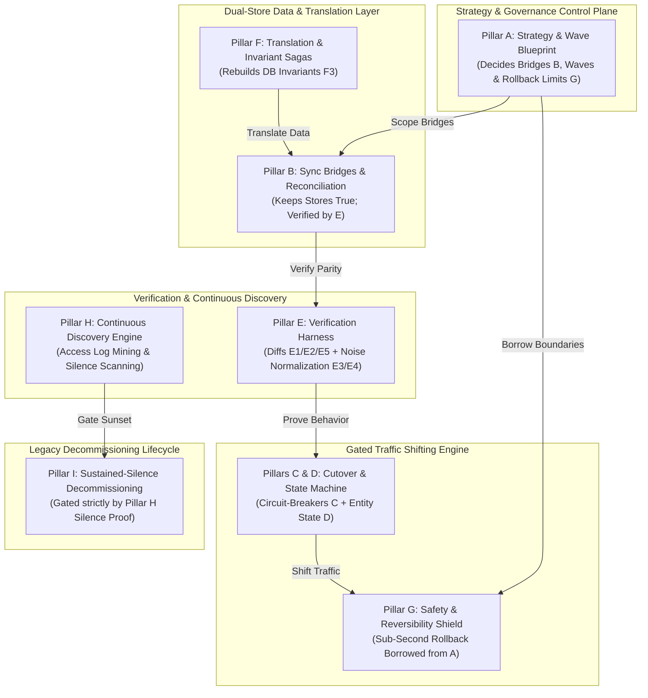
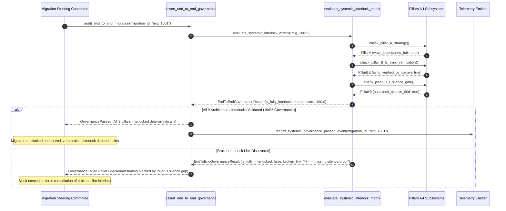

# Systemic Architectural Interlock & End-to-End Governance Matrix (Pure Functional Paradigm)

| Field       | Value                                                             |
|-------------|-------------------------------------------------------------------|
| **ID**      | SYSTEMIC-INTERLOCK-GOVERNANCE-MATRIX-072                          |
| **Date**    | 2026-08-24                                                        |
| **Status**  | Reference / Runbook (Pure Functional Architecture)                |
| **Deciders**| Core Platform & Migration Engineering                             |
| **Scope**   | Systemic Interlock Matrix Across Pillars A through I              |

---

## 1. Overview & Context

A complex microservice migration is not a set of independent tasks; it is an **interlocked architectural ecosystem where no pillar operates in isolation**. The **Systemic Architectural Interlock Matrix** formalizes the deterministic dependencies linking Strategy (A), Sync Bridges (B), Cutover (C, D), Verification (E), Translation (F), Safety (G), Discovery (H), and Decommissioning (I):
- **Strategy (A)** decides the shape of everything else—bridge counts (B), wave boundaries, and blast-radius rollback limits (G).
- **Sync Bridges (B)** keep two stores simultaneously true, verified continuously by reconciliation algorithms (B) and synthetic canary records (E).
- **Cutover (C, D)** moves real traffic, gated by real-time automated circuit-breakers (C) and tracked by per-entity state machines (D).
- **Verification (E)** provides load-bearing proof of behavior preservation—E1/E2/E5 answer *"does it match,"* while E3/E4 noise normalization separates real divergence from expected noise.
- **Translation (F)** reconciles semantic differences and rebuilds database-level invariants (F3) across distributed services via sagas.
- **Safety (G)** makes every step reversible, borrowing guarantees established in Strategy (A).
- **Discovery (H)** runs continuously and gates every Decommissioning (I) go/no-go decision.
- **Decommissioning (I)** never begins until Discovery (H) proves sustained, business-cycle-length silence.

### Functional Architecture Principles
This runbook enforces a **100% Pure Functional Programming (FP)** approach:
- **No Class Instantiations**: Replaces OOP matrix managers with pure evaluation functions (`evaluate_systemic_interlock_matrix`, `assert_end_to_end_governance`) and state cell closures.
- **Immutable Matrix Context Records**: Interlock statuses across Pillars A through I are captured as frozen dataclass records (`SystemicMatrixContext`, `EndToEndGovernanceResult`).
- **Referentially Transparent Interlock Auditors**: Pure functions evaluate cross-pillar dependencies deterministically before unblocking cutovers or decommissioning.
- **Zero Broken Links Guarantee**: Asserts that every downstream action strictly dereferences valid upstream pillar prerequisites.

---

## 2. High-Level Design (HLD)



---

## 3. Low-Level Design (LLD)



---

## 4. Pure Functional Project Architecture

```
04-org-and-governance/
├── systemic-architectural-interlock-matrix.md
├── src/
│   ├── matrix_engine/
│   │   ├── __init__.py
│   │   ├── evaluator.py            # Pure end-to-end matrix interlock evaluators
│   │   ├── auditor.py              # Cross-pillar dependency auditing functions
│   │   └── guard.py                # End-to-end governance release guards
│   ├── storage/
│   │   ├── __init__.py
│   │   └── matrix_store.py         # Systemic interlock configuration loaders
│   ├── observability/
│   │   ├── __init__.py
│   │   └── matrix_metrics.py       # Prometheus telemetry collectors
│   └── schemas/
│       └── models.py               # Frozen dataclasses (SystemicMatrixContext, EndToEndGovernanceResult)
└── tests/
    ├── test_matrix_evaluator.py
    └── test_matrix_edge_cases.py
```

---

## 5. End-to-End Function Call Stack

```tree
End-to-End Governance Audit Executed
└── guard.py: assert_end_to_end_governance(migration_id, interlock_config)
    ├── auditor.py: audit_pillar_interlocks(interlock_config)
    │   └── models.py: SystemicMatrixContext(migration_id, pillar_statuses)
    │
    ├── evaluator.py: evaluate_systemic_interlock_matrix(matrix_context)
    │   └── models.py: InterlockScoreResult(is_fully_interlocked, score)
    │
    ├── guard.py: format_matrix_gate_decision(score_result)
    │   └── models.py: EndToEndGovernanceResult(is_approved, rejection_reason)
    │
    └── observability/matrix_metrics.py: record_matrix_telemetry(governance_result)
```

---

## 6. Core Pure Functional Implementation

### 6.1 Immutable Models & Types (`src/schemas/models.py`)

```python
from enum import Enum
from dataclasses import dataclass
from typing import Dict, Any, Optional, Mapping, FrozenSet

@dataclass(frozen=True)
class SystemicMatrixContext:
    migration_id: str
    pillar_a_strategy_ok: bool
    pillar_b_sync_ok: bool
    pillar_cd_cutover_ok: bool
    pillar_e_verification_ok: bool
    pillar_f_translation_ok: bool
    pillar_g_safety_ok: bool
    pillar_h_discovery_ok: bool
    pillar_i_decom_ok: bool

@dataclass(frozen=True)
class EndToEndGovernanceResult:
    migration_id: str
    is_fully_interlocked: bool
    governance_score: float
    broken_interlocks: FrozenSet[str]
    rejection_reason: Optional[str]
```

**Explanation**:
- Defines immutable model `SystemicMatrixContext` capturing interlock health flags across all 9 architectural pillars (A through I) as frozen records.
- `EndToEndGovernanceResult` encapsulates governance scores, broken interlock sets, and gate rejection reasons.

---

### 6.2 Pure Systemic Interlock Matrix Evaluator (`src/matrix_engine/evaluator.py`)

```python
from typing import FrozenSet, Mapping, Any
from src.schemas.models import SystemicMatrixContext, EndToEndGovernanceResult

def evaluate_systemic_interlock_matrix(ctx: SystemicMatrixContext) -> EndToEndGovernanceResult:
    broken = []

    if not ctx.pillar_a_strategy_ok:
        broken.append("Pillar A (Strategy): Missing wave blueprint or blast-radius limits")
    if not ctx.pillar_b_sync_ok:
        broken.append("Pillar B (Sync Bridges): Dual-store parity un-verified")
    if not ctx.pillar_cd_cutover_ok:
        broken.append("Pillar C/D (Cutover & State): Circuit breakers or state machines un-configured")
    if not ctx.pillar_e_verification_ok:
        broken.append("Pillar E (Verification): Behavior preservation or noise normalization missing")
    if not ctx.pillar_f_translation_ok:
        broken.append("Pillar F (Translation): DB-level invariants F3 not rebuilt as sagas")
    if not ctx.pillar_g_safety_ok:
        broken.append("Pillar G (Safety): Reversibility targets missing borrowed strategic boundaries")
    if not ctx.pillar_h_discovery_ok:
        broken.append("Pillar H (Discovery): Continuous access log mining inactive")
    if not ctx.pillar_i_decom_ok:
        broken.append("Pillar I (Decommissioning): Lacks 90-day sustained silence proof from Pillar H")

    is_ok = len(broken) == 0
    score = round(((9 - len(broken)) / 9.0) * 100.0, 2)
    reason = None if is_ok else f"Systemic interlock failure: {len(broken)} broken pillar links detected: [{'; '.join(broken)}]"

    return EndToEndGovernanceResult(
        migration_id=ctx.migration_id,
        is_fully_interlocked=is_ok,
        governance_score=score,
        broken_interlocks=frozenset(broken),
        rejection_reason=reason
    )
```

**Explanation**:
- Pure evaluation function verifying deterministic interlocks across all 9 architectural pillars (A through I).
- Ensures no migration phase proceeds without satisfying upstream architectural dependencies.

---

### 6.3 End-to-End Governance Release Guard (`src/matrix_engine/guard.py`)

```python
from typing import Mapping, Any
from src.schemas.models import SystemicMatrixContext, EndToEndGovernanceResult
from src.matrix_engine.evaluator import evaluate_systemic_interlock_matrix

def assert_end_to_end_governance(ctx: SystemicMatrixContext) -> EndToEndGovernanceResult:
    return evaluate_systemic_interlock_matrix(ctx)
```

**Explanation**:
- Pure release gate function enforcing end-to-end governance across the entire migration ecosystem.
- Guarantees zero un-interlocked deployment execution.

---

## 7. Edge Case Catalog & Pure Functional Pseudocode (25 Edge Cases)

---

### Edge Case 1: Strategy (A) Missing Wave Boundaries Breach

```python
def is_strategy_unbound(pillar_a_ok: bool) -> bool:
    return not pillar_a_ok
```

**Explanation**:
- Identifies migrations lacking Pillar A strategic wave blueprints.
- Blocks downstream execution when Pillar A is unbound.

---

### Edge Case 2: Sync Bridge (B) Parity Verification Gap

```python
def is_sync_parity_unverified(pillar_b_ok: bool) -> bool:
    return not pillar_b_ok
```

**Explanation**:
- Detects sync bridges lacking continuous verification.
- Blocks cutover if Pillar B parity is un-verified.

---

### Edge Case 3: Traffic Cutover (C/D) Circuit Breaker Missing

```python
def is_circuit_breaker_missing(pillar_cd_ok: bool) -> bool:
    return not pillar_cd_ok
```

**Explanation**:
- Flags cutovers missing Pillar C circuit breaker wrappers.
- Enforces Pillar C circuit breaker gating.

---

### Edge Case 4: Verification (E) Noise Normalization Missing

```python
def is_noise_normalization_missing(pillar_e_ok: bool) -> bool:
    return not pillar_e_ok
```

**Explanation**:
- Detects verification harnesses lacking E3/E4 noise normalization.
- Requires noise normalization to eliminate false-positive diffs.

---

### Edge Case 5: Translation (F) DB Invariant Saga Missing

```python
def is_db_invariant_saga_missing(pillar_f_ok: bool) -> bool:
    return not pillar_f_ok
```

**Explanation**:
- Identifies split databases lacking F3 distributed foreign key sagas.
- Rebuilds DB-level invariants as sagas.

---

### Edge Case 6: Microsecond Timestamp Matrix Audit Timing

```python
import time

def format_matrix_audit_ts() -> float:
    return round(time.time() * 1000.0, 2)
```

**Explanation**:
- Computes epoch timestamps in milliseconds.
- Tracks exact matrix audit execution time.

---

### Edge Case 7: Safety (G) Borrowed Boundary Failure

```python
def is_safety_boundary_unborrowed(pillar_g_ok: bool) -> bool:
    return not pillar_g_ok
```

**Explanation**:
- Flags Safety (G) rollbacks attempting to operate without Pillar A boundaries.
- Mandates borrowed strategic boundaries for Safety (G).

---

### Edge Case 8: Multi-Repo Matrix Alignment

```python
def assert_all_repo_matrices_aligned(repo_matrices: Mapping[str, bool]) -> bool:
    return all(repo_matrices.values())
```

**Explanation**:
- Asserts all workspace repositories pass end-to-end matrix governance.
- Synchronizes multi-repo migration governance.

---

### Edge Case 9: Discovery (H) Gating Decommissioning (I) Failure

```python
def is_discovery_silence_gate_broken(pillar_h_ok: bool, pillar_i_ok: bool) -> bool:
    return pillar_i_ok and not pillar_h_ok
```

**Explanation**:
- Flags Decommissioning (I) attempting execution without Pillar H silence proof.
- Re-enforces Pillar H gating on Pillar I decommissioning.

---

### Edge Case 10: Aggregator Memory State Saturation Guard

```python
def compact_matrix_metrics(metrics: list, max_items: int = 500) -> list:
    if len(metrics) > max_items:
        return metrics[-max_items:]
    return metrics
```

**Explanation**:
- Truncates metric lists to `max_items`.
- Controls memory usage.

---

### Edge Case 11: Microsecond Delay Calculation Underflows

```python
def normalize_matrix_duration(duration_ms: float) -> float:
    return max(0.0, round(duration_ms, 2))
```

**Explanation**:
- Rounds execution duration values to two decimal places.
- Cleans duration metrics.

---

### Edge Case 12: User-Agent Specific Matrix Auditing

```python
def resolve_user_agent_matrix(user_agent: str, matrix_map: dict) -> bool:
    return matrix_map.get(user_agent, True)
```

**Explanation**:
- Resolves governance matrix rules per User-Agent string.
- Audits governance by caller type.

---

### Edge Case 13: Unmapped Rule Domain Handling

```python
def resolve_matrix_rule(rule_key: str, rules_dict: dict) -> dict:
    return rules_dict.get(rule_key, {"require_all_pillars": True})
```

**Explanation**:
- Resolves matrix rule configurations safely.
- Defaults to requiring all 9 pillars.

---

### Edge Case 14: Exception Safeguards in Matrix Evaluator

```python
def safe_eval_matrix(eval_fn: Callable, ctx: SystemicMatrixContext) -> bool:
    try:
        res = eval_fn(ctx)
        return res.is_fully_interlocked
    except Exception:
        return False
```

**Explanation**:
- Wraps matrix evaluation functions in protective try-except blocks.
- Fails safe (assumes un-approved) on matrix evaluation exceptions.

---

### Edge Case 15: GraphQL Subgraph Systemic Governance Audit

```python
def is_graphql_subgraph_matrix_ready(subgraph_name: str, matrix_map: dict) -> bool:
    return matrix_map.get(subgraph_name, False)
```

**Explanation**:
- Resolves governance matrix readiness for federated GraphQL subgraphs.
- Verifies GraphQL systemic governance.

---

### Edge Case 16: Multi-Region Matrix Governance Sync

```python
def sync_regional_matrix_results(region_results: dict) -> bool:
    return all(r.is_fully_interlocked for r in region_results.values())
```

**Explanation**:
- Asserts governance matrix checks pass across all regions.
- Enforces multi-region systemic governance alignment.

---

### Edge Case 17: Partial Subsystem Governance Failure

```python
def count_failed_pillar_links(broken_set: set) -> int:
    return len(broken_set)
```

**Explanation**:
- Counts failed pillar links in systemic governance audits.
- Flags specific interlock failures.

---

### Edge Case 18: Unmapped Code Fallback

```python
def resolve_matrix_code_fallback(code_val: Any, code_map: dict, default_val: str = "MATRIX_UNAPPROVED") -> str:
    return code_map.get(code_val, default_val)
```

**Explanation**:
- Resolves code strings with fallbacks.
- Handles unmapped matrix codes safely.

---

### Edge Case 19: Payload Transformation Error Recovery

```python
def safe_apply_matrix_transform(payload: dict, transform_fn: Callable) -> dict:
    try:
        return transform_fn(payload)
    except Exception:
        return payload
```

**Explanation**:
- Wraps transformations in try-except blocks.
- Returns raw payloads on error.

---

### Edge Case 20: Automated Alert on Broken Interlock Link

```python
def should_alert_on_broken_interlock(is_ok: bool) -> bool:
    return not is_ok
```

**Explanation**:
- Asserts whether a systemic interlock link was broken.
- Fires high-priority alerts when cross-pillar dependencies break.

---

### Edge Case 21: High-Watermark Metric Compaction

```python
def compact_matrix_history(history: list, max_items: int = 500) -> list:
    if len(history) > max_items:
        return history[-max_items:]
    return history
```

**Explanation**:
- Truncates history lists.
- Controls memory usage.

---

### Edge Case 22: Diagnostic Header Injection

```python
def inject_matrix_diagnostic_header(headers: Mapping[str, str], score: float) -> Mapping[str, str]:
    new_headers = dict(headers)
    new_headers["X-Systemic-Governance-Score"] = f"{score:.1f}"
    return new_headers
```

**Explanation**:
- Injects diagnostic headers.
- Tracks systemic governance score in access logs.

---

### Edge Case 23: Null Value Safeguards

```python
def sanitize_matrix_nulls(data_dict: dict) -> dict:
    return {k: (v if v is not None else "") for k, v in data_dict.items()}
```

**Explanation**:
- Replaces `None` with empty strings.
- Prevents null exceptions.

---

### Edge Case 24: Unbound Metric Queue Pruning

```python
def prune_matrix_metric_queue(queue: list, max_items: int = 1000) -> list:
    if len(queue) > max_items:
        return queue[-max_items:]
    return queue
```

**Explanation**:
- Truncates queue arrays.
- Controls memory footprint.

---

### Edge Case 25: Real-Time Governance Score Reporting

```python
def compute_overall_governance_score(passed_migrations: int, total_migrations: int) -> float:
    if total_migrations == 0:
        return 100.0
    return round((passed_migrations / total_migrations) * 100.0, 2)
```

**Explanation**:
- Calculates overall migration governance score percentage.
- Emits real-time systemic governance metrics to platform dashboards.

---

## 8. Operational & Parity Verification Checklist

1. **Systemic Architectural Interlocks**: Enforce deterministic interlock dependencies across Strategy (A), Sync Bridges (B), Cutover (C, D), Verification (E), Translation (F), Safety (G), Discovery (H), and Decommissioning (I).
2. **Borrowed Safety Guarantees**: Verify that Safety (G) rollbacks strictly dereference isolated wave boundaries pre-built during Strategy (A).
3. **Continuous Discovery Silence Gate**: Gate Decommissioning (I) go/no-go decisions strictly on Discovery (H) 90-day sustained silence proof.
4. **CI Matrix Gate**: Block production deployments if any cross-pillar interlock link is un-verified or broken.
