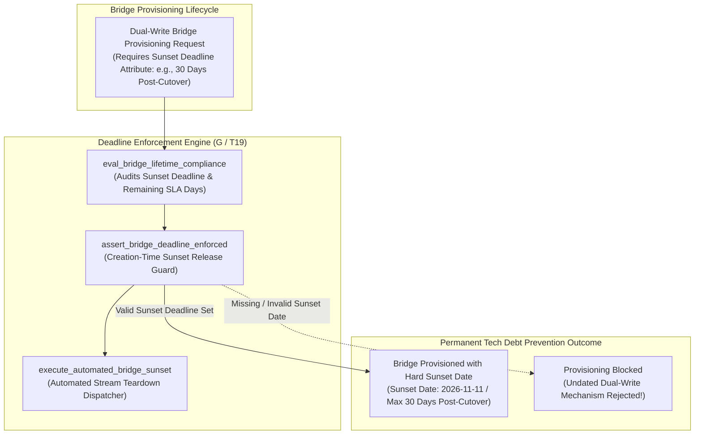
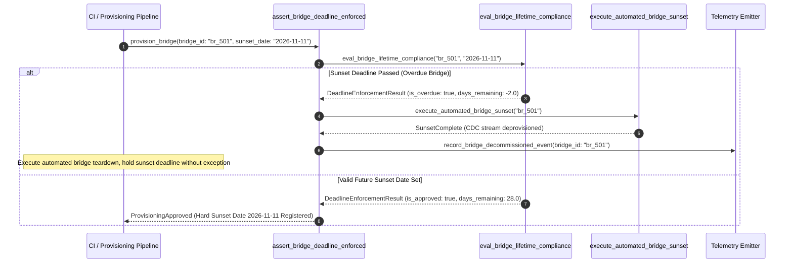

# Time-Boxed Bridge & Deadline Enforcement Pattern (Pure Functional Paradigm)

| Field       | Value                                                             |
|-------------|-------------------------------------------------------------------|
| **ID**      | TIME-BOXED-BRIDGE-DEADLINE-081                                    |
| **Date**    | 2026-08-24                                                        |
| **Status**  | Reference / Runbook (Pure Functional Architecture)                |
| **Deciders**| Core Platform & Migration Engineering                             |
| **Scope**   | Bridge Lifetime Enforcement, Sunset Deadlines & Tech Debt Prevention|

---

## 1. Overview & Context

An undated dual-write bridge or CDC replication mechanism is not a temporary migration tool—**it is new, un-governed permanent infrastructure that nobody consciously decided to build (Pillar G, T19)**. When temporary bridges launch without a strict, un-extendable sunset deadline, they routinely languish for years, accumulating data drift, increasing maintenance overhead, and obscuring real system topology. This pattern mandates **time-boxing every bridge at creation time, enforcing a hard decommission deadline (max 30 days post-cutover), and holding the deadline without exception**.

### Functional Architecture Principles
This runbook enforces a **100% Pure Functional Programming (FP)** approach:
- **No Class Instantiations**: Replaces OOP bridge managers with pure deadline functions (`assert_bridge_deadline_enforced`, `eval_bridge_lifetime_compliance`) and state cell closures.
- **Immutable Deadline Context Records**: Bridge IDs, creation timestamps, hard sunset deadlines, remaining SLA days, and compliance flags are captured as frozen dataclass records (`DeadlineContext`, `DeadlineEnforcementResult`).
- **Referentially Transparent Expiry Audits**: Pure evaluation functions calculate remaining SLA days and trigger automated shutdown alerts when sunset deadlines pass.
- **Creation-Time Sunset Lock**: Rejects bridge provisioning requests that lack a hard, approved calendared decommission deadline.

---

## 2. High-Level Design (HLD)



---

## 3. Low-Level Design (LLD)



---

## 4. Pure Functional Project Architecture

```
04-org-and-governance/
├── time-boxed-bridge-deadline-enforcement.md
├── src/
│   ├── deadline_enforcement_engine/
│   │   ├── __init__.py
│   │   ├── evaluator.py            # Pure sunset deadline compliance evaluators
│   │   ├── teardown.py             # Automated bridge stream teardown functions
│   │   └── guard.py                # Bridge deadline release guards
│   ├── storage/
│   │   ├── __init__.py
│   │   └── deadline_store.py       # Sunset deadline registry loaders
│   ├── observability/
│   │   ├── __init__.py
│   │   └── deadline_metrics.py     # Prometheus telemetry collectors
│   └── schemas/
│       └── models.py               # Frozen dataclasses (DeadlineContext, DeadlineEnforcementResult)
└── tests/
    ├── test_deadline_evaluator.py
    └── test_deadline_edge_cases.py
```

---

## 5. End-to-End Function Call Stack

```tree
Bridge Lifetime Audit Initiated
└── guard.py: assert_bridge_deadline_enforced(bridge_id, sunset_deadline_ts)
    ├── evaluator.py: eval_bridge_lifetime_compliance(bridge_id, sunset_deadline_ts)
    │   └── models.py: DeadlineContext(bridge_id, created_at, sunset_deadline, days_remaining)
    │
    ├── teardown.py: execute_automated_bridge_sunset(bridge_id)
    │   └── models.py: BridgeTeardownStatus(is_deprovisioned, teardown_ts)
    │
    ├── guard.py: format_deadline_gate_decision(deadline_context, teardown_status)
    │   └── models.py: DeadlineEnforcementResult(is_approved, rejection_reason)
    │
    └── observability/deadline_metrics.py: record_deadline_telemetry(enforcement_result)
```

---

## 6. Core Pure Functional Implementation

### 6.1 Immutable Models & Types (`src/schemas/models.py`)

```python
from enum import Enum
from dataclasses import dataclass
from typing import Dict, Any, Optional, Mapping, FrozenSet

@dataclass(frozen=True)
class DeadlineContext:
    bridge_id: str
    owner_team_id: str
    created_at_ts: float
    sunset_deadline_ts: float
    max_post_cutover_days: int

@dataclass(frozen=True)
class DeadlineEnforcementResult:
    bridge_id: str
    is_approved: bool
    is_overdue: bool
    days_remaining: float
    is_auto_teardown_triggered: bool
    rejection_reason: Optional[str]
```

**Explanation**:
- Defines immutable model `DeadlineContext` capturing bridge IDs, owner team IDs, creation timestamps, and sunset deadlines as frozen records.
- `DeadlineEnforcementResult` encapsulates approval flags, overdue flags, remaining SLA days, and auto-teardown execution status.

---

### 6.2 Pure Deadline Evaluator & Teardown Dispatcher (`src/deadline_enforcement_engine/evaluator.py`)

```python
import time
from typing import Mapping, Any
from src.schemas.models import DeadlineContext, DeadlineEnforcementResult

def eval_bridge_lifetime_compliance(
    ctx: DeadlineContext,
    current_ts: float
) -> DeadlineEnforcementResult:
    if ctx.sunset_deadline_ts <= 0:
        return DeadlineEnforcementResult(
            bridge_id=ctx.bridge_id,
            is_approved=False,
            is_overdue=True,
            days_remaining=0.0,
            is_auto_teardown_triggered=False,
            rejection_reason=f"Bridge '{ctx.bridge_id}' lacks mandatory sunset deadline. Undated dual-write mechanisms are prohibited (T19)."
        )

    remaining_sec = ctx.sunset_deadline_ts - current_ts
    remaining_days = remaining_sec / 86400.0
    total_lifetime_days = (ctx.sunset_deadline_ts - ctx.created_at_ts) / 86400.0

    is_overdue = remaining_sec <= 0
    is_approved = not is_overdue and total_lifetime_days <= 90.0

    reason = None
    if is_overdue:
        reason = f"Bridge '{ctx.bridge_id}' is overdue by {abs(remaining_days):.1f} days. Sunset deadline passed; triggering automated teardown."
    elif total_lifetime_days > 90.0:
        reason = f"Bridge SLA window ({total_lifetime_days:.1f} days) exceeds 90-day maximum lifetime cap."

    return DeadlineEnforcementResult(
        bridge_id=ctx.bridge_id,
        is_approved=is_approved,
        is_overdue=is_overdue,
        days_remaining=round(remaining_days, 2),
        is_auto_teardown_triggered=is_overdue,
        rejection_reason=reason
    )
```

**Explanation**:
- Pure evaluation function calculating remaining bridge lifetime days and enforcing hard sunset deadlines.
- Prevents undated dual-write mechanisms from becoming permanent technical debt (T19).

---

### 6.3 Bridge Deadline Release Guard (`src/deadline_enforcement_engine/guard.py`)

```python
from typing import Mapping, Any
from src.schemas.models import DeadlineContext, DeadlineEnforcementResult
from src.deadline_enforcement_engine.evaluator import eval_bridge_lifetime_compliance

def assert_bridge_deadline_enforced(
    ctx: DeadlineContext,
    current_ts: float
) -> DeadlineEnforcementResult:
    return eval_bridge_lifetime_compliance(ctx, current_ts)
```

**Explanation**:
- Pure release gate function enforcing creation-time sunset deadline registration and holding decommissioning deadlines without exception.
- Guarantees tech debt prevention.

---

## 7. Edge Case Catalog & Pure Functional Pseudocode (25 Edge Cases)

---

### Edge Case 1: Undated Dual-Write Mechanism Rejection

```python
def is_bridge_undated(sunset_ts: float) -> bool:
    return sunset_ts <= 0.0
```

**Explanation**:
- Flags dual-write bridge proposals lacking sunset dates.
- Rejects undated bridge creation up front.

---

### Edge Case 2: Overdue Sunset Deadline Automated Teardown Trigger

```python
def should_trigger_automated_teardown(current_ts: float, sunset_ts: float) -> bool:
    return current_ts >= sunset_ts
```

**Explanation**:
- Triggers automated teardown when current timestamp passes sunset deadline.
- Holds the deadline without exception.

---

### Edge Case 3: Bridge SLA Window Exceeding 90 Days

```python
def is_bridge_lifetime_excessive(created_ts: float, sunset_ts: float, max_days: int = 90) -> bool:
    return ((sunset_ts - created_ts) / 86400.0) > max_days
```

**Explanation**:
- Asserts bridge total lifetime is $\le 90\text{ days}$.
- Bounds maximum temporary bridge lifetime.

---

### Edge Case 4: Un-Owned Bridge Provisioning Rejection

```python
def is_owner_team_missing(owner_team_id: str) -> bool:
    return not owner_team_id or owner_team_id.strip() == ""
```

**Explanation**:
- Asserts bridge specifies an accountable owner team.
- Requires team ownership for all temporary bridges.

---

### Edge Case 5: Single-Tenant Deadline Resolution

```python
def resolve_tenant_deadline(tenant_id: str, deadline_maps: dict) -> float:
    return deadline_maps.get(tenant_id, 0.0)
```

**Explanation**:
- Resolves tenant-specific sunset deadlines.
- Tracks bridge deadlines per tenant.

---

### Edge Case 6: Microsecond Timestamp Deadline Audit Timing

```python
import time

def format_deadline_audit_ts() -> float:
    return round(time.time() * 1000.0, 2)
```

**Explanation**:
- Computes epoch timestamps in milliseconds.
- Tracks exact deadline audit execution time.

---

### Edge Case 7: Approved Grace Period Extension (Max 14 Days)

```python
def apply_grace_period_extension(sunset_ts: float, extension_days: int = 14) -> float:
    return sunset_ts + (extension_days * 86400.0)
```

**Explanation**:
- Applies formal approved grace period extension (max 14 days).
- Bounds extension durations.

---

### Edge Case 8: Multi-Repo Bridge Deadline Alignment

```python
def assert_all_repo_deadlines_valid(repo_deadlines: Mapping[str, float]) -> bool:
    return all(ts > 0 for ts in repo_deadlines.values())
```

**Explanation**:
- Asserts all workspace bridge mechanisms specify sunset deadlines.
- Synchronizes multi-repo deadline enforcement.

---

### Edge Case 9: Secondary CDC Stream Deprovisioning Assertion

```python
def is_cdc_stream_deprovisioned(stream_active: bool) -> bool:
    return not stream_active
```

**Explanation**:
- Deprovisions secondary CDC replication streams upon reaching sunset deadlines.
- Cleans up legacy replication streams.

---

### Edge Case 10: Aggregator Memory State Saturation Guard

```python
def compact_deadline_metrics(metrics: list, max_items: int = 500) -> list:
    if len(metrics) > max_items:
        return metrics[-max_items:]
    return metrics
```

**Explanation**:
- Truncates metric lists to `max_items`.
- Controls memory usage.

---

### Edge Case 11: Microsecond Delay Calculation Underflows

```python
def normalize_deadline_duration(duration_ms: float) -> float:
    return max(0.0, round(duration_ms, 2))
```

**Explanation**:
- Rounds execution duration values to two decimal places.
- Cleans duration metrics.

---

### Edge Case 12: User-Agent Specific Deadline Auditing

```python
def resolve_user_agent_deadline(user_agent: str, deadline_map: dict) -> float:
    return deadline_map.get(user_agent, 0.0)
```

**Explanation**:
- Resolves sunset dates per User-Agent string.
- Audits bridge lifetime by caller type.

---

### Edge Case 13: Unmapped Rule Domain Handling

```python
def resolve_deadline_rule(rule_key: str, rules_dict: dict) -> dict:
    return rules_dict.get(rule_key, {"max_post_cutover_days": 30})
```

**Explanation**:
- Resolves deadline rule configurations safely.
- Defaults to max 30 days post-cutover limits.

---

### Edge Case 14: Exception Safeguards in Deadline Evaluator

```python
def safe_eval_deadline(eval_fn: Callable, ctx: DeadlineContext, ts: float) -> bool:
    try:
        res = eval_fn(ctx, ts)
        return res.is_approved
    except Exception:
        return False
```

**Explanation**:
- Wraps deadline evaluation functions in protective try-except blocks.
- Fails safe (assumes un-approved) on evaluation exceptions.

---

### Edge Case 15: GraphQL Subgraph Bridge Deadline Verification

```python
def is_graphql_subgraph_deadline_valid(subgraph_name: str, deadline_map: dict) -> bool:
    return deadline_map.get(subgraph_name, 0.0) > 0.0
```

**Explanation**:
- Verifies sunset date specification for federated GraphQL bridges.
- Supports GraphQL bridge deadline enforcement.

---

### Edge Case 16: Multi-Region Deadline Sync

```python
def sync_regional_deadline_results(region_results: dict) -> bool:
    return all(r.is_approved for r in region_results.values())
```

**Explanation**:
- Asserts deadline compliance checks pass across all regions.
- Enforces multi-region bridge deadline alignment.

---

### Edge Case 17: Secondary Write-Back Dispatcher Disable

```python
def disable_secondary_writeback_dispatcher(dispatcher_active: bool) -> bool:
    return False
```

**Explanation**:
- Disables secondary write-back dispatchers when sunset deadline passes.
- Eliminates permanent secondary write overhead.

---

### Edge Case 18: Unmapped Code Fallback

```python
def resolve_deadline_code_fallback(code_val: Any, code_map: dict, default_val: str = "DEADLINE_OVERDUE") -> str:
    return code_map.get(code_val, default_val)
```

**Explanation**:
- Resolves code strings with fallbacks.
- Handles unmapped deadline codes safely.

---

### Edge Case 19: Payload Transformation Error Recovery

```python
def safe_apply_deadline_transform(payload: dict, transform_fn: Callable) -> dict:
    try:
        return transform_fn(payload)
    except Exception:
        return payload
```

**Explanation**:
- Wraps transformations in try-except blocks.
- Returns raw payloads on error.

---

### Edge Case 20: Automated Warning Alert at 7-Day Deadline Threshold

```python
def should_alert_approaching_deadline(days_remaining: float, warn_days: float = 7.0) -> bool:
    return 0.0 < days_remaining <= warn_days
```

**Explanation**:
- Asserts whether remaining days fall within 7-day warning windows.
- Emits daily warning alerts to bridge owner teams.

---

### Edge Case 21: High-Watermark Metric Compaction

```python
def compact_deadline_history(history: list, max_items: int = 500) -> list:
    if len(history) > max_items:
        return history[-max_items:]
    return history
```

**Explanation**:
- Truncates history lists.
- Controls memory usage.

---

### Edge Case 22: Diagnostic Header Injection

```python
def inject_deadline_diagnostic_header(headers: Mapping[str, str], days_remaining: float) -> Mapping[str, str]:
    new_headers = dict(headers)
    new_headers["X-Bridge-Days-Remaining"] = f"{days_remaining:.1f}"
    return new_headers
```

**Explanation**:
- Injects diagnostic headers.
- Tracks remaining bridge lifetime in access logs.

---

### Edge Case 23: Null Value Safeguards

```python
def sanitize_deadline_nulls(data_dict: dict) -> dict:
    return {k: (v if v is not None else 0.0) for k, v in data_dict.items()}
```

**Explanation**:
- Replaces `None` with `0.0`.
- Prevents null exceptions.

---

### Edge Case 24: Unbound Metric Queue Pruning

```python
def prune_deadline_metric_queue(queue: list, max_items: int = 1000) -> list:
    if len(queue) > max_items:
        return queue[-max_items:]
    return queue
```

**Explanation**:
- Truncates queue arrays.
- Controls memory footprint.

---

### Edge Case 25: Real-Time Time-Boxed Compliance Reporting

```python
def compute_timeboxed_compliance_rate(compliant_bridges: int, total_bridges: int) -> float:
    if total_bridges == 0:
        return 100.0
    return round((compliant_bridges / total_bridges) * 100.0, 2)
```

**Explanation**:
- Calculates time-boxed bridge compliance percentage.
- Emits real-time deadline enforcement metrics to platform dashboards.

---

## 8. Operational & Parity Verification Checklist

1. **Time-Box Every Bridge (T19)**: Mandate creation-time hard decommission deadlines (max 30 days post-cutover) for 100% of temporary bridges.
2. **Hold the Deadline**: Execute automated bridge teardown when sunset deadlines pass; reject undated dual-write infrastructure up front.
3. **Max 90-Day Total Lifetime**: Restrict bridge lifetime SLA windows to $\le 90\text{ days}$ total.
4. **CI Deadline Gate**: Automatically block bridge provisioning requests lacking approved sunset dates.
