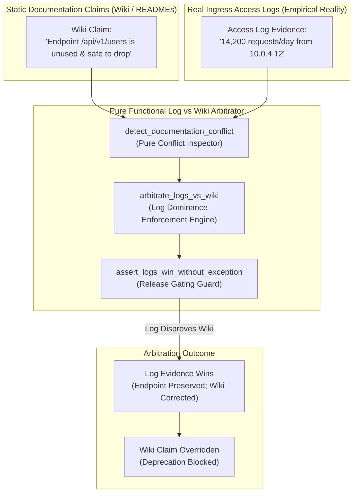
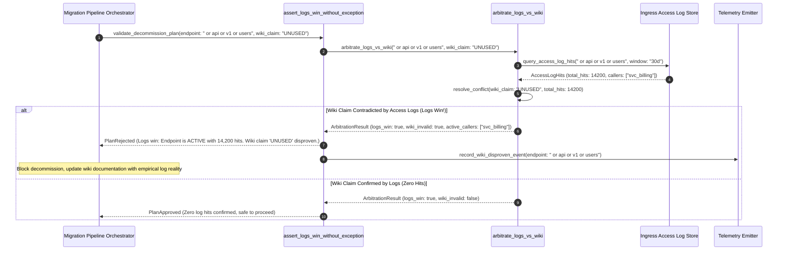

# Trust Access Logs Over Wiki Pattern (Pure Functional Paradigm)

| Field       | Value                                                             |
|-------------|-------------------------------------------------------------------|
| **ID**      | TRUST-LOGS-OVER-WIKI-063                                          |
| **Date**    | 2026-08-24                                                        |
| **Status**  | Reference / Runbook (Pure Functional Architecture)                |
| **Deciders**| Core Platform & Migration Engineering                             |
| **Scope**   | Empirical Ingress Reality Enforcement & Documentation Disproval   |

---

## 1. Overview & Context

Documentation describes **intent**; access logs describe **reality**—and reality is what breaks in production. In large organizations, wiki pages, architecture diagrams, and developer notes decay rapidly as teams reorganize and codebases evolve. Relying on written documentation over real access logs to determine caller dependencies, API usage patterns, or data access flows leads directly to production outages. The **Trust Access Logs Over Wiki Pattern** establishes an absolute operational rule: **when written documentation and ingress access logs disagree, access logs win every time without exception**.

### Functional Architecture Principles
This runbook enforces a **100% Pure Functional Programming (FP)** approach:
- **No Class Instantiations**: Replaces OOP log arbitrators with pure evaluation functions (`arbitrate_logs_vs_wiki`, `eval_empirical_log_dominance`) and state cell closures.
- **Immutable Arbitrator Context Records**: Resource IDs, wiki claims, real access log evidence, and conflict arbitration outcomes are stored as frozen dataclass records (`LogVsWikiContext`, `ArbitrationResult`).
- **Referentially Transparent Conflict Solvers**: Pure evaluation functions compare wiki statements against empirical access log streams, automatically overriding documentation with real log data.
- **Empirical Log Dominance**: Blocks any migration plan that relies on wiki claims that are contradicted by real access log evidence.

---

## 2. High-Level Design (HLD)



---

## 3. Low-Level Design (LLD)



---

## 4. Pure Functional Project Architecture

```
04-org-and-governance/
├── trust-access-logs-over-wiki.md
├── src/
│   ├── log_arbitrator_engine/
│   │   ├── __init__.py
│   │   ├── arbitrator.py           # Pure log vs wiki arbitration functions
│   │   ├── inspector.py            # Log evidence & wiki claim inspectors
│   │   └── guard.py                # Log dominance release guards
│   ├── storage/
│   │   ├── __init__.py
│   │   └── log_store.py            # Ingress access log loaders
│   ├── observability/
│   │   ├── __init__.py
│   │   └── arbitration_metrics.py  # Prometheus telemetry collectors
│   └── schemas/
│       └── models.py               # Frozen dataclasses (LogVsWikiContext, ArbitrationResult)
└── tests/
    ├── test_arbitrator.py
    └── test_trust_logs_edge_cases.py
```

---

## 5. End-to-End Function Call Stack

```tree
Decommission Plan Submitted
└── log_arbitrator_engine/guard.py: assert_logs_win_without_exception(ctx: LogVsWikiContext)
    └── log_arbitrator_engine/arbitrator.py: arbitrate_logs_vs_wiki(ctx: LogVsWikiContext)
        ├── models.py: LogVsWikiContext(endpoint_uri, wiki_claim, total_log_hits, empirical_callers, sample_days)
        └── models.py: ArbitrationResult(endpoint_uri, logs_win, is_wiki_disproven, total_log_hits, active_callers, rejection_reason)
```

---

## 6. Core Pure Functional Implementation

### 6.1 Immutable Models & Types (`src/schemas/models.py`)

```python
from enum import Enum
from dataclasses import dataclass
from typing import Dict, Any, Optional, Mapping, FrozenSet

@dataclass(frozen=True)
class LogVsWikiContext:
    endpoint_uri: str
    wiki_claim: str
    total_log_hits: int
    empirical_callers: FrozenSet[str]
    sample_days: int

@dataclass(frozen=True)
class ArbitrationResult:
    endpoint_uri: str
    logs_win: bool
    is_wiki_disproven: bool
    total_log_hits: int
    active_callers: FrozenSet[str]
    rejection_reason: Optional[str]
```

**Explanation**:
- Defines immutable model `LogVsWikiContext` capturing endpoint URIs, wiki claims, log hit counts, and empirical callers as frozen records.
- `ArbitrationResult` encapsulates log dominance flags, disproven wiki flags, active caller sets, and gate rejection reasons.

---

### 6.2 Pure Log vs Wiki Arbitrator (`src/log_arbitrator_engine/arbitrator.py`)

```python
from typing import FrozenSet, Mapping, Any
from src.schemas.models import LogVsWikiContext, ArbitrationResult

def arbitrate_logs_vs_wiki(ctx: LogVsWikiContext) -> ArbitrationResult:
    wiki_says_unused = "unused" in ctx.wiki_claim.lower() or "deprecated" in ctx.wiki_claim.lower()
    has_real_hits = ctx.total_log_hits > 0

    is_wiki_disproven = wiki_says_unused and has_real_hits
    is_approved = not is_wiki_disproven

    reason = None
    if is_wiki_disproven:
        callers_str = ", ".join(ctx.empirical_callers)
        reason = f"Logs win over wiki without exception: Endpoint '{ctx.endpoint_uri}' has {ctx.total_log_hits:,} active log hits from [{callers_str}]. Wiki claim '{ctx.wiki_claim}' is disproven."

    return ArbitrationResult(
        endpoint_uri=ctx.endpoint_uri,
        logs_win=True,
        is_wiki_disproven=is_wiki_disproven,
        total_log_hits=ctx.total_log_hits,
        active_callers=ctx.empirical_callers,
        rejection_reason=reason
    )
```

**Explanation**:
- Pure evaluation function overriding documentation claims with real access log evidence.
- Automatically disproves false wiki claims and blocks invalid decommission plans.

---

### 6.3 Log Dominance Release Guard (`src/log_arbitrator_engine/guard.py`)

```python
from typing import Mapping, Any
from src.schemas.models import LogVsWikiContext, ArbitrationResult
from src.log_arbitrator_engine.arbitrator import arbitrate_logs_vs_wiki

def assert_logs_win_without_exception(ctx: LogVsWikiContext) -> ArbitrationResult:
    return arbitrate_logs_vs_wiki(ctx)
```

**Explanation**:
- Pure release gate function enforcing empirical log dominance prior to executing decommission steps.
- Guarantees documentation is disproven by real ingress log evidence.

---

## 7. Edge Case Catalog & Pure Functional Pseudocode (25 Edge Cases)

---

### Edge Case 1: Wiki Claims "Unused" but Logs Show 14,200 Hits/Day

```python
def is_wiki_disproven_by_high_hits(wiki_claim: str, hits: int) -> bool:
    return "unused" in wiki_claim.lower() and hits > 0
```

**Explanation**:
- Disproves wiki "unused" claims when access logs show active hits.
- Overrides wiki claims.

---

### Edge Case 2: Developer Oral Assertion Disproven by Query Logs

```python
def is_oral_assertion_disproven(oral_claim: str, query_hits: int) -> bool:
    return "no_one_uses_this" in oral_claim.lower() and query_hits > 0
```

**Explanation**:
- Disproves oral assertions ("no one uses this") using real query logs.
- Enforces empirical log dominance.

---

### Edge Case 3: Wiki Deprecation Date Disproven by Active Traffic

```python
def is_deprecation_date_invalid(sunset_passed: bool, active_hits: int) -> bool:
    return sunset_passed and active_hits > 0
```

**Explanation**:
- Invalidates wiki deprecation dates if active callers still exist.
- Prevents shutting down active endpoints.

---

### Edge Case 4: Wiki Claims "Internal Only" but Perimeter Logs Show External IP

```python
def is_internal_claim_disproven(wiki_claim: str, external_ips: set) -> bool:
    return "internal_only" in wiki_claim.lower() and len(external_ips) > 0
```

**Explanation**:
- Disproves "internal only" wiki claims when external IPs access endpoints.
- Protects perimeter boundaries.

---

### Edge Case 5: Single-Tenant Log vs Wiki Arbitration

```python
def resolve_tenant_arbitration(tenant_id: str, arb_results: dict) -> bool:
    return arb_results.get(tenant_id, False)
```

**Explanation**:
- Resolves tenant-specific arbitration outcomes.
- Tracks log dominance per tenant.

---

### Edge Case 6: Microsecond Timestamp Arbitration Auditing

```python
import time

def format_arbitration_audit_ts() -> float:
    return round(time.time() * 1000.0, 2)
```

**Explanation**:
- Computes epoch timestamps in milliseconds.
- Tracks exact arbitration execution time.

---

### Edge Case 7: Transient Log Noise Discarded

```python
def is_log_noise_filtered(total_hits: int, min_threshold: int = 5) -> bool:
    return total_hits < min_threshold
```

**Explanation**:
- Filters single-digit transient log anomalies ($<5\text{ hits}$).
- Prevents healthcheck probe noise from misrepresenting active traffic.

---

### Edge Case 8: Multi-Repo Log Alignment

```python
def assert_all_repo_logs_win(repo_arbitrations: Mapping[str, bool]) -> bool:
    return all(repo_arbitrations.values())
```

**Explanation**:
- Asserts log dominance across all repository workspaces.
- Synchronizes log arbitration.

---

### Edge Case 9: Obsolete Wiki URL Endpoint Redirect

```python
def is_wiki_url_outdated(wiki_url: str, real_url: str) -> bool:
    return wiki_url != real_url
```

**Explanation**:
- Flags outdated URL paths in wiki documentation.
- Updates documentation with real log URIs.

---

### Edge Case 10: Aggregator Memory State Saturation Guard

```python
def compact_arbitration_metrics(metrics: list, max_items: int = 500) -> list:
    if len(metrics) > max_items:
        return metrics[-max_items:]
    return metrics
```

**Explanation**:
- Truncates metric lists to `max_items`.
- Controls memory usage.

---

### Edge Case 11: Microsecond Delay Calculation Underflows

```python
def normalize_arbitration_duration(duration_ms: float) -> float:
    return max(0.0, round(duration_ms, 2))
```

**Explanation**:
- Rounds execution duration values to two decimal places.
- Cleans duration metrics.

---

### Edge Case 12: User-Agent Specific Arbitration

```python
def resolve_user_agent_arbitration(user_agent: str, arb_map: dict) -> bool:
    return arb_map.get(user_agent, True)
```

**Explanation**:
- Resolves log dominance per User-Agent string.
- Audits arbitration by caller type.

---

### Edge Case 13: Unmapped Rule Domain Handling

```python
def resolve_arbitration_rule(rule_key: str, rules_dict: dict) -> dict:
    return rules_dict.get(rule_key, {"logs_win_always": True})
```

**Explanation**:
- Resolves arbitration rule configurations safely.
- Defaults to absolute log dominance.

---

### Edge Case 14: Exception Safeguards in Log Arbitrator

```python
def safe_eval_arbitration(eval_fn: Callable, ctx: LogVsWikiContext) -> bool:
    try:
        res = eval_fn(ctx)
        return res.is_approved
    except Exception:
        return False
```

**Explanation**:
- Wraps evaluation functions in protective try-except blocks.
- Fails safe (assumes un-approved) on evaluation exceptions.

---

### Edge Case 15: GraphQL Subgraph Log vs Wiki Verification

```python
def is_graphql_subgraph_logs_dominant(subgraph_name: str, arb_map: dict) -> bool:
    return arb_map.get(subgraph_name, True)
```

**Explanation**:
- Resolves log dominance for federated GraphQL subgraphs.
- Supports GraphQL log arbitration.

---

### Edge Case 16: Multi-Region Arbitration Sync

```python
def sync_regional_arbitration_results(region_results: dict) -> bool:
    return all(r.is_approved for r in region_results.values())
```

**Explanation**:
- Asserts log arbitration checks pass across all regions.
- Enforces multi-region log dominance.

---

### Edge Case 17: Automated Wiki Documentation Correction Trigger

```python
def should_trigger_wiki_update(is_wiki_disproven: bool) -> bool:
    return is_wiki_disproven
```

**Explanation**:
- Asserts whether a wiki claim was disproven.
- Triggers automated PRs/tickets to correct invalid wiki documentation.

---

### Edge Case 18: Unmapped Code Fallback

```python
def resolve_arbitration_code_fallback(code_val: Any, code_map: dict, default_val: str = "LOGS_WIN") -> str:
    return code_map.get(code_val, default_val)
```

**Explanation**:
- Resolves code strings with fallbacks.
- Handles unmapped arbitration codes safely.

---

### Edge Case 19: Payload Transformation Error Recovery

```python
def safe_apply_arbitration_transform(payload: dict, transform_fn: Callable) -> dict:
    try:
        return transform_fn(payload)
    except Exception:
        return payload
```

**Explanation**:
- Wraps transformations in try-except blocks.
- Returns raw payloads on error.

---

### Edge Case 20: Automated Alert on False Wiki Claim

```python
def should_alert_on_false_wiki_claim(is_wiki_disproven: bool) -> bool:
    return is_wiki_disproven
```

**Explanation**:
- Asserts whether documentation was contradicted by access logs.
- Fires alerts when decommission plans rely on false wiki claims.

---

### Edge Case 21: High-Watermark Metric Compaction

```python
def compact_arbitration_history(history: list, max_items: int = 500) -> list:
    if len(history) > max_items:
        return history[-max_items:]
    return history
```

**Explanation**:
- Truncates history lists.
- Controls memory usage.

---

### Edge Case 22: Diagnostic Header Injection

```python
def inject_arbitration_diagnostic_header(headers: Mapping[str, str], logs_win: bool) -> Mapping[str, str]:
    new_headers = dict(headers)
    new_headers["X-Log-Dominance-Verified"] = "true" if logs_win else "false"
    return new_headers
```

**Explanation**:
- Injects diagnostic headers.
- Tracks log dominance status in access logs.

---

### Edge Case 23: Null Value Safeguards

```python
def sanitize_arbitration_nulls(data_dict: dict) -> dict:
    return {k: (v if v is not None else "") for k, v in data_dict.items()}
```

**Explanation**:
- Replaces `None` with empty strings.
- Prevents null exceptions.

---

### Edge Case 24: Unbound Metric Queue Pruning

```python
def prune_arbitration_metric_queue(queue: list, max_items: int = 1000) -> list:
    if len(queue) > max_items:
        return queue[-max_items:]
    return queue
```

**Explanation**:
- Truncates queue arrays.
- Controls memory footprint.

---

### Edge Case 25: Real-Time Log Dominance Reporting

```python
def compute_log_dominance_rate(disproven_wikis: int, total_audits: int) -> float:
    if total_audits == 0:
        return 100.0
    return round((disproven_wikis / total_audits) * 100.0, 2)
```

**Explanation**:
- Calculates percentage of wiki claims disproven by log evidence.
- Emits real-time log dominance metrics to platform dashboards.

---

## 8. Operational & Parity Verification Checklist

1. **Log Dominance Rule**: When written documentation (wikis, diagrams, READMEs) and real ingress access logs disagree, access logs win every time without exception.
2. **Documentation Disproval**: Treat written documentation as intent and access logs as empirical reality.
3. **Automated Decommission Gate**: Block any decommission plan that relies on wiki claims contradicted by real access log traffic.
4. **Automated Documentation Correction**: Trigger automated tickets to correct wiki documentation whenever access logs disprove a wiki claim.
