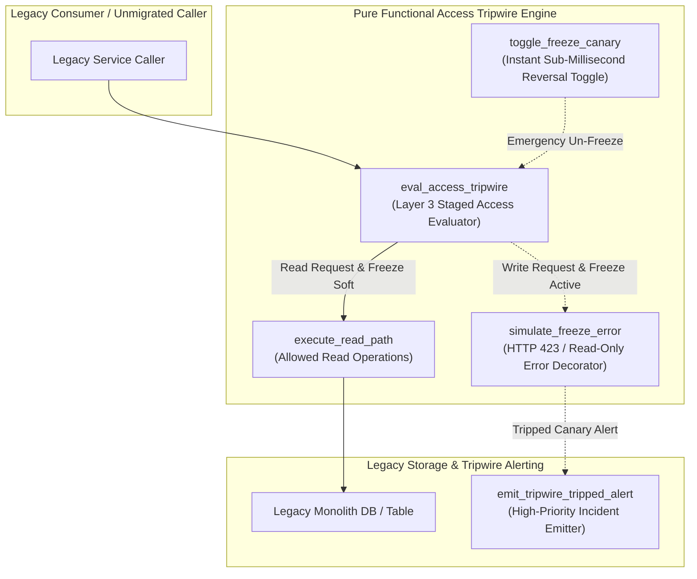
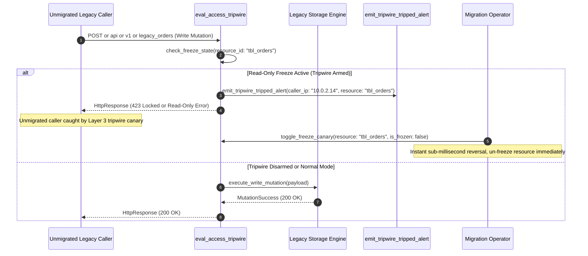

# Access Tripwire / Read-Only Freeze Canary Pattern (Pure Functional Paradigm)

| Field       | Value                                                             |
|-------------|-------------------------------------------------------------------|
| **ID**      | ACCESS-TRIPWIRE-FREEZE-CANARY-039                                 |
| **Date**    | 2026-08-24                                                        |
| **Status**  | Reference / Runbook (Pure Functional Architecture)                |
| **Deciders**| Core Platform & Migration Engineering                             |
| **Scope**   | Layer 3 Staged & Reversible Read-Only Freeze Discovery & Canary   |

---

## 1. Overview & Context

Before permanently deleting a legacy database table, schema column, or microservice endpoint, teams need a **last-resort safety mechanism** to catch unmigrated legacy readers that evaded Layer 1 log mining and Layer 2 static analysis. The **Access Tripwire / Read-Only Freeze Canary Pattern** serves as this **Layer 3 discovery mechanism**. Instead of performing an irreversible hard deletion, the system places target resources into a **staged, reversible read-only freeze** or returns simulated HTTP 423 Locked / 403 Forbidden errors for write attempts. If an unmigrated caller trips the canary, the freeze can be **instantly reversed in sub-milliseconds** without data loss.

### Functional Architecture Principles
This runbook enforces a **100% Pure Functional Programming (FP)** approach:
- **No Class Instantiations**: Replaces OOP tripwire managers with pure evaluation functions (`eval_access_tripwire`, `toggle_freeze_canary`) and state cell closures.
- **Immutable Tripwire Context Records**: Resource IDs, freeze states, tripwire categories, active caller lists, and instant reversal flags are stored as frozen dataclass records (`TripwireContext`, `TripwireResult`).
- **Referentially Transparent Access Guards**: Pure functions evaluate access attempts against active tripwire rules, deciding whether to allow read/write operations or raise simulated tripwire errors.
- **Instant Reversal Closures**: Provides functional state cell toggles to un-freeze resources immediately upon catching critical legacy callers.

---

## 2. High-Level Design (HLD)



---

## 3. Low-Level Design (LLD)



---

## 4. Pure Functional Project Architecture

```
access-tripwire-freeze-canary/
├── README.md
├── config/
│   └── tripwire_rules.yaml         # Staged freeze schedules, resource IDs, allowed readers
├── src/
│   ├── tripwire_engine/
│   │   ├── __init__.py
│   │   ├── guard.py                # Pure tripwire access evaluation functions
│   │   ├── simulator.py            # Simulated read-only error decorators
│   │   └── reversal_cell.py        # Instant freeze reversal state cell closures
│   ├── storage/
│   │   ├── __init__.py
│   │   └── tripwire_store.py       # Tripwire rule configuration loaders
│   ├── observability/
│   │   ├── __init__.py
│   │   └── tripwire_metrics.py     # Prometheus tripwire telemetry collectors
│   └── schemas/
│       └── models.py               # Frozen dataclasses (TripwireContext, TripwireResult)
└── tests/
    ├── test_tripwire_guard.py
    └── test_tripwire_edge_cases.py
```

---

## 5. End-to-End Function Call Stack

```tree
Data Access Request Received on Staged Resource
└── guard.py: eval_access_tripwire(resource_id, operation_type, request_context)
    ├── reversal_cell.py: get_freeze_state(resource_id)
    │   └── models.py: TripwireContext(resource_id, is_frozen, freeze_stage)
    │
    ├── [If Frozen & Write Operation] simulator.py: simulate_freeze_error(resource_id)
    │   └── models.py: TripwireResult(is_tripped, status_code=423, caller_ip)
    │
    ├── [If Allowed] storage/tripwire_store.py: execute_storage_operation(payload)
    │   └── models.py: StorageResponse(status_code=200, data)
    │
    └── observability/tripwire_metrics.py: record_tripwire_event(tripwire_result)
```

---

## 6. Core Pure Functional Implementation

### 6.1 Immutable Models & Types (`src/schemas/models.py`)

```python
from enum import Enum
from dataclasses import dataclass
from typing import Dict, Any, Optional, Mapping, FrozenSet

class FreezeStage(str, Enum):
    NORMAL = "normal"
    SOFT_FREEZE_READ_ONLY = "soft_freeze_read_only"
    HARD_FREEZE_LOCKED = "hard_freeze_locked"
    DECOMMISSIONED = "decommissioned"

@dataclass(frozen=True)
class TripwireContext:
    resource_id: str
    stage: FreezeStage
    is_frozen: bool
    allowed_callers: FrozenSet[str]
    armed_at_ts: float

@dataclass(frozen=True)
class TripwireResult:
    resource_id: str
    is_tripped: bool
    status_code: int
    operation_type: str
    caller_ip: str
    error_message: Optional[str]
```

**Explanation**:
- Defines immutable model `TripwireContext` capturing resource IDs, freeze stages (`SOFT_FREEZE_READ_ONLY`, `HARD_FREEZE_LOCKED`), and allowed caller sets as frozen records.
- `TripwireResult` encapsulates tripwire status flags, HTTP status codes (`423 Locked`), operation types, and caller IPs.

---

### 6.2 Pure Reversal State Cell (`src/tripwire_engine/reversal_cell.py`)

```python
from typing import Dict, Tuple, Callable
from src.schemas.models import FreezeStage

def create_tripwire_state_cell():
    state: Dict[str, dict] = {}

    def get_freeze_state(resource_id: str) -> dict:
        return state.get(resource_id, {"is_frozen": False, "stage": FreezeStage.NORMAL})

    def toggle_freeze_canary(resource_id: str, is_frozen: bool, stage: FreezeStage = FreezeStage.SOFT_FREEZE_READ_ONLY) -> None:
        state[resource_id] = {
            "is_frozen": is_frozen,
            "stage": stage if is_frozen else FreezeStage.NORMAL
        }

    return get_freeze_state, toggle_freeze_canary
```

**Explanation**:
- Constructs an atomic tripwire state cell closure managing frozen resource statuses.
- Provides `toggle_freeze_canary` for sub-millisecond emergency un-freeze toggles.

---

### 6.3 Pure Tripwire Access Guard (`src/tripwire_engine/guard.py`)

```python
from typing import Mapping, Any
from src.schemas.models import TripwireContext, TripwireResult, FreezeStage

def eval_access_tripwire(
    ctx: TripwireContext,
    operation_type: str,
    caller_ip: str
) -> TripwireResult:
    if not ctx.is_frozen or caller_ip in ctx.allowed_callers:
        return TripwireResult(
            resource_id=ctx.resource_id,
            is_tripped=False,
            status_code=200,
            operation_type=operation_type,
            caller_ip=caller_ip,
            error_message=None
        )

    is_write = operation_type.upper() in {"POST", "PUT", "DELETE", "UPDATE", "INSERT"}

    if ctx.stage == FreezeStage.SOFT_FREEZE_READ_ONLY and is_write:
        return TripwireResult(
            resource_id=ctx.resource_id,
            is_tripped=True,
            status_code=423,
            operation_type=operation_type,
            caller_ip=caller_ip,
            error_message=f"Resource '{ctx.resource_id}' is in staged read-only freeze"
        )
    elif ctx.stage == FreezeStage.HARD_FREEZE_LOCKED:
        return TripwireResult(
            resource_id=ctx.resource_id,
            is_tripped=True,
            status_code=423,
            operation_type=operation_type,
            caller_ip=caller_ip,
            error_message=f"Resource '{ctx.resource_id}' is locked and pending decommissioning"
        )

    return TripwireResult(
        resource_id=ctx.resource_id,
        is_tripped=False,
        status_code=200,
        operation_type=operation_type,
        caller_ip=caller_ip,
        error_message=None
    )
```

**Explanation**:
- Evaluates data access requests against active tripwire rules and freeze stages.
- Allows read operations during soft freezes while returning HTTP 423 Locked errors for write operations.

---

## 7. Edge Case Catalog & Pure Functional Pseudocode (25 Edge Cases)

---

### Edge Case 1: Sub-Millisecond Instant Freeze Reversal

```python
def execute_instant_unfreeze(resource_id: str, toggle_fn: Callable) -> bool:
    toggle_fn(resource_id, False, FreezeStage.NORMAL)
    return True
```

**Explanation**:
- Toggles freeze state cells to `NORMAL` mode immediately.
- Reverts resource freeze in sub-milliseconds without service restarts.

---

### Edge Case 2: Critical Infrastructure Caller Emergency Bypass

```python
def is_caller_bypassed(caller_ip: str, bypass_ips: set) -> bool:
    return caller_ip in bypass_ips
```

**Explanation**:
- Compares caller IPs against emergency bypass IP sets.
- Allows critical infrastructure callers to bypass active tripwires.

---

### Edge Case 3: HTTP 423 Locked Error Simulation

```python
def build_http_423_response(resource_id: str) -> dict:
    return {
        "status_code": 423,
        "body": {"error": "Locked", "message": f"Resource {resource_id} is in read-only freeze canary"}
    }
```

**Explanation**:
- Formats standard HTTP 423 Locked error response dictionaries.
- Simulates read-only freeze errors for HTTP callers.

---

### Edge Case 4: Staged Per-Table Freeze Deployment

```python
def resolve_table_freeze_stage(table_name: str, stage_map: dict) -> FreezeStage:
    return stage_map.get(table_name, FreezeStage.NORMAL)
```

**Explanation**:
- Resolves table-specific freeze stages from configuration maps.
- Supports staged per-table tripwire canary rollouts.

---

### Edge Case 5: Un-Reverted Freeze Canary Expiration

```python
def is_canary_freeze_expired(armed_at_ts: float, current_ts: float, max_freeze_sec: float = 86400.0) -> bool:
    return (current_ts - armed_at_ts) > max_freeze_sec
```

**Explanation**:
- Compares freeze duration against max safety bounds (24 hours).
- Flags long-running freeze canaries requiring resolution.

---

### Edge Case 6: Microsecond Timestamp Tripwire Auditing

```python
import time

def generate_tripwire_timestamp_ms() -> float:
    return round(time.time() * 1000.0, 2)
```

**Explanation**:
- Computes epoch timestamps in milliseconds rounded to 2 decimal places.
- Tracks exact tripwire event timing.

---

### Edge Case 7: Un-authenticated Perimeter IP Extraction

```python
def extract_tripwire_caller_ip(headers: Mapping[str, str]) -> str:
    return headers.get("X-Forwarded-For", "127.0.0.1").split(",")[0].strip()
```

**Explanation**:
- Extracts real client IPs from `X-Forwarded-For` HTTP headers.
- Identifies callers tripping access canaries.

---

### Edge Case 8: Multi-Tenant Tripwire Boundary Isolation

```python
def resolve_tenant_tripwire_stage(tenant_id: str, tenant_stages: dict) -> FreezeStage:
    return tenant_stages.get(tenant_id, FreezeStage.NORMAL)
```

**Explanation**:
- Resolves tenant-specific freeze stages from configuration maps.
- Restricts tripwire canaries to specific tenant subsets.

---

### Edge Case 9: Read-Only SQL Query Operation Classification

```python
def is_sql_read_only(sql_query: str) -> bool:
    first_word = sql_query.strip().split()[0].upper() if sql_query.strip() else ""
    return first_word in {"SELECT", "SHOW", "EXPLAIN"}
```

**Explanation**:
- Classifies SQL queries as read-only based on initial command keywords (`SELECT`, `SHOW`).
- Allows read-only SQL queries during soft freezes.

---

### Edge Case 10: Aggregator Memory State Saturation Guard

```python
def compact_tripwire_history(history: list, max_items: int = 1000) -> list:
    if len(history) > max_items:
        return history[-max_items:]
    return history
```

**Explanation**:
- Truncates historical tripwire metric lists to `max_items`.
- Controls memory usage in canary monitoring processes.

---

### Edge Case 11: Microsecond Delay Calculation Underflows

```python
def normalize_tripwire_duration(duration_ms: float) -> float:
    return max(0.0, round(duration_ms, 2))
```

**Explanation**:
- Rounds execution duration values to two decimal places.
- Cleans duration metrics.

---

### Edge Case 12: User-Agent Application Identification

```python
def parse_tripwire_user_agent(headers: Mapping[str, str]) -> str:
    return headers.get("User-Agent", "Unknown-Caller")
```

**Explanation**:
- Extracts `User-Agent` strings from request headers.
- Identifies client applications tripping canaries.

---

### Edge Case 13: Unmapped Resource Default Normal Stage

```python
def resolve_resource_stage(resource_id: str, stage_registry: dict) -> FreezeStage:
    return stage_registry.get(resource_id, FreezeStage.NORMAL)
```

**Explanation**:
- Resolves resource freeze stages, returning `FreezeStage.NORMAL` if unmapped.
- Prevents accidental freezes on unconfigured resources.

---

### Edge Case 14: Exception Handling During Tripwire Evaluation

```python
def safe_eval_tripwire(eval_fn: Callable, ctx: TripwireContext, op: str, ip: str) -> TripwireResult:
    try:
        return eval_fn(ctx, op, ip)
    except Exception:
        return TripwireResult(ctx.resource_id, False, 200, op, ip, None)
```

**Explanation**:
- Wraps tripwire evaluation functions in protective try-except blocks.
- Returns un-tripped results if evaluation exceptions occur.

---

### Edge Case 15: GraphQL Mutation Tripwire Interception

```python
def is_graphql_mutation(request_body: dict) -> bool:
    query_str = str(request_body.get("query", ""))
    return query_str.strip().startswith("mutation")
```

**Explanation**:
- Detects GraphQL mutation requests.
- Intercepts GraphQL write operations during read-only freezes.

---

### Edge Case 16: Multi-Region Tripwire Rule Synchronization

```python
def sync_regional_tripwire_stages(global_stages: dict, regional_stages: dict) -> dict:
    merged = dict(global_stages)
    merged.update(regional_stages)
    return merged
```

**Explanation**:
- Merges regional freeze stage overrides into global stage dictionaries.
- Synchronizes tripwire canaries across multi-region deployments.

---

### Edge Case 17: Database Trigger Write Error Simulation

```python
def build_read_only_trigger_sql(table_name: str) -> str:
    return f"CREATE OR REPLACE FUNCTION freeze_{table_name}() RETURNS trigger AS $$ BEGIN RAISE EXCEPTION 'Table {table_name} is in read-only freeze canary'; END; $$ LANGUAGE plpgsql;"
```

**Explanation**:
- Generates PostgreSQL trigger SQL to raise database-level exceptions on write operations.
- Simulates read-only freezes directly at the database engine level.

---

### Edge Case 18: Unmapped Rule Domain Handling

```python
def resolve_tripwire_rule(resource_id: str, rule_registry: dict) -> dict:
    return rule_registry.get(resource_id, {"stage": "normal"})
```

**Explanation**:
- Resolves tripwire rule configurations, returning default normal stage rules if unmapped.
- Handles unconfigured tripwire rules safely.

---

### Edge Case 19: Payload Transformation Error Recovery

```python
def safe_apply_tripwire_transform(payload: dict, transform_fn: Callable) -> dict:
    try:
        return transform_fn(payload)
    except Exception:
        return payload
```

**Explanation**:
- Wraps payload transformation functions in protective try-except blocks.
- Returns raw payloads if transformation errors occur.

---

### Edge Case 20: Automated Incident Trigger on Tripped Canary

```python
def should_trigger_tripwire_incident(is_tripped: bool) -> bool:
    return is_tripped
```

**Explanation**:
- Asserts whether an access tripwire canary was tripped (`is_tripped == True`).
- Triggers high-priority incident alerts when unmigrated callers trip canaries.

---

### Edge Case 21: High-Watermark Telemetry Compaction

```python
def compact_tripwire_metrics(metrics: list, max_items: int = 500) -> list:
    if len(metrics) > max_items:
        return metrics[-max_items:]
    return metrics
```

**Explanation**:
- Truncates historical tripwire metric lists to `max_items`.
- Controls memory usage in telemetry monitoring processes.

---

### Edge Case 22: Diagnostic Header Injection for Tripwire Canary Traffic

```python
def inject_tripwire_diagnostic_header(headers: Mapping[str, str], stage_name: str) -> Mapping[str, str]:
    new_headers = dict(headers)
    new_headers["X-Tripwire-Canary-Stage"] = stage_name
    return new_headers
```

**Explanation**:
- Injects diagnostic headers (`X-Tripwire-Canary-Stage`) into response headers.
- Identifies tripwire canary responses in access logs.

---

### Edge Case 23: Null Value Safeguards in Tripwire Contexts

```python
def sanitize_tripwire_context_nulls(ctx_dict: dict) -> dict:
    return {k: (v if v is not None else "") for k, v in ctx_dict.items()}
```

**Explanation**:
- Replaces `None` values with empty strings in tripwire context dictionaries.
- Prevents null pointer exceptions in access guards.

---

### Edge Case 24: Unbound Metric Queue Pruning

```python
def prune_tripwire_metric_queue(queue: list, max_items: int = 1000) -> list:
    if len(queue) > max_items:
        return queue[-max_items:]
    return queue
```

**Explanation**:
- Truncates metric queue arrays to `max_items`.
- Controls memory footprint in telemetry collectors.

---

### Edge Case 25: Real-Time Tripwire Canary Health Dashboard Reporting

```python
def compute_tripwire_health_score(tripped_events: int, total_accesses: int) -> float:
    if total_accesses == 0:
        return 100.0
    return round((1.0 - (tripped_events / total_accesses)) * 100.0, 2)
```

**Explanation**:
- Calculates resource decommission readiness scores rounded to two decimal places.
- Emits real-time Layer 3 tripwire health metrics to platform dashboards.

---

## 8. Operational & Parity Verification Checklist

1. **Layer 3 Last Resort Gate**: Confirm access tripwire canaries operate as the final discovery stage after Layer 1 log mining and Layer 2 static analysis.
2. **Instant Sub-Millisecond Reversal**: Verify that invoking `toggle_freeze_canary(is_frozen=False)` un-freezes target resources in $<1\text{ms}$ without service restarts.
3. **High-Priority Incident Alerting**: Tripping an active access canary must trigger immediate operational alerts with caller IP and resource details.
4. **Zero Data Loss Guarantee**: Read-only soft freezes must allow read queries to succeed while rejecting writes to prevent data corruption during canary testing.
