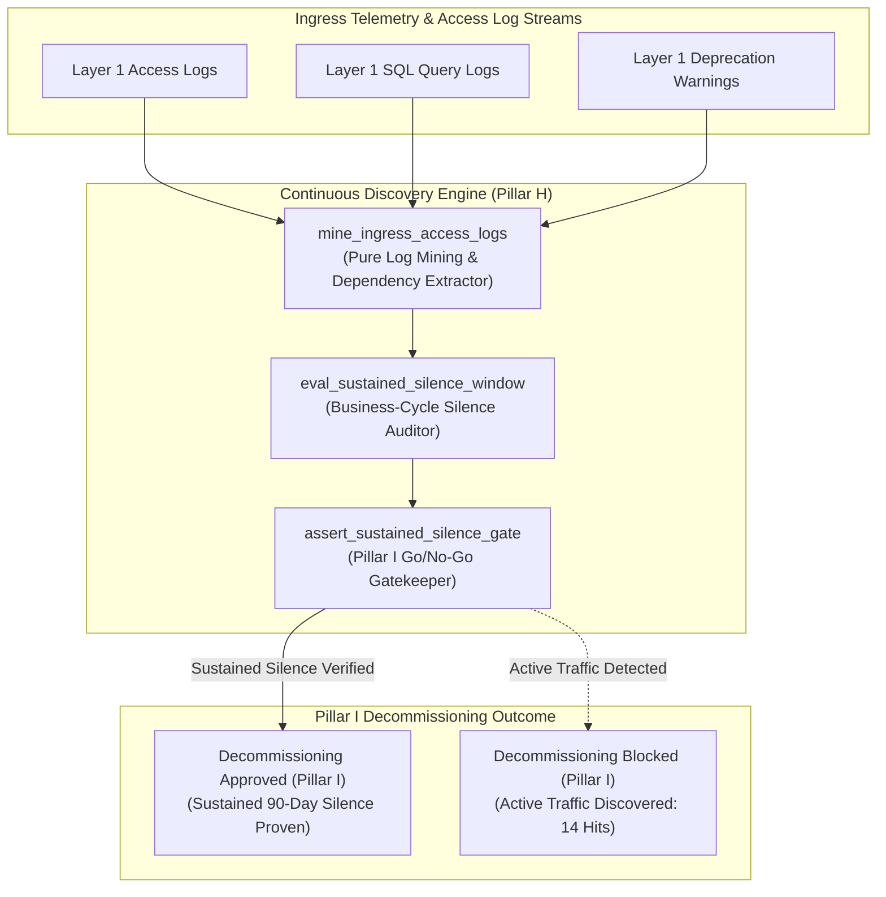

# Continuous Dependency Discovery & Log Mining Engine Pattern (Pure Functional Paradigm)

| Field       | Value                                                             |
|-------------|-------------------------------------------------------------------|
| **ID**      | DISCOVERY-LOG-MINING-ENGINE-070                                   |
| **Date**    | 2026-08-24                                                        |
| **Status**  | Reference / Runbook (Pure Functional Architecture)                |
| **Deciders**| Core Platform & Migration Engineering                             |
| **Scope**   | Continuous Discovery, Access Log Mining & Silence Gating Interlock |

---

## 1. Overview & Context

Continuous Discovery (Pillar H) operates as a non-stop empirical scanner across ingress access logs, SQL query logs, static AST call graphs, and deprecation telemetry. Crucially, **Discovery (Pillar H) continuously gates every Decommissioning (Pillar I) go/no-go decision**. Decommissioning of legacy monolith endpoints or databases never begins simply because code "looks migrated"—it begins **only when Discovery (H) proves sustained, business-cycle-length silence (e.g. 30–90 days of zero active log hits)**.

### Functional Architecture Principles
This runbook enforces a **100% Pure Functional Programming (FP)** approach:
- **No Class Instantiations**: Replaces OOP scanners with pure log mining functions (`mine_ingress_access_logs`, `eval_sustained_silence_window`) and state cell closures.
- **Immutable Discovery Context Records**: Endpoint URIs, log hit counts, active caller sets, sample window durations, and silence statuses are captured as frozen dataclass records (`DiscoveryContext`, `SilenceVerificationResult`).
- **Referentially Transparent Access Log Miners**: Pure functions parse log streams to discover hidden dependencies and un-migrated callers up front.
- **Decommissioning Gatekeeper**: Blocks any decommission request if discovery log mining reveals active traffic within the mandatory business-cycle silence window.

---

## 2. High-Level Design (HLD)



---

## 3. Low-Level Design (LLD)

```mermaid
sequenceDiagram
    autonumber
    participant Pipeline as Decommissioning Pipeline (Pillar I)
    participant Guard as assert_sustained_silence_gate
    participant Miner as mine_ingress_access_logs
    participant LogStore as Centralized Access Log Store
    participant Audit as Telemetry Emitter

    Pipeline->>Guard: request_decommission_approval(endpoint: "/api/v1/orders", window_days: 90)
    
    Guard->>Miner: mine_ingress_access_logs("/api/v1/orders", window_days: 90)
    Miner->>LogStore: query_log_hits("/api/v1/orders", span: "90d")
    LogStore-->>Miner: LogQueryResult (total_hits: 0, callers: [])

    Miner-->>Guard: SilenceVerificationResult (is_silent: true, silent_days: 90, total_hits: 0)

    alt Sustained 90-Day Silence Verified (Zero Log Hits)
        Guard-->>Pipeline: SilenceApproved (Decommissioning go/no-go unblocked)
        Guard->>Audit: record_sustained_silence_verified_event(endpoint: "/api/v1/orders")
        Note over Pipeline: Unblock Pillar I decommissioning; sustained silence proven by Pillar H
    else Active Log Hits Discovered (Traffic Present)
        Miner-->>Guard: SilenceVerificationResult (is_silent: false, total_hits: 14, callers: ["svc_billing"])
        Guard-->>Pipeline: SilenceRejected (Decommissioning blocked; 14 active log hits discovered)
        Note over Pipeline: Block decommissioning; force team to migrate remaining 14 callers first
    end
```

---

## 4. Pure Functional Project Architecture

```
05-dependency-discovery-and-log-mining/
├── continuous-dependency-discovery-engine.md
├── src/
│   ├── discovery_engine/
│   │   ├── __init__.py
│   │   ├── miner.py                # Pure access log mining & dependency functions
│   │   ├── auditor.py              # Business-cycle silence evaluation functions
│   │   └── guard.py                # Pillar I decommissioning release guards
│   ├── storage/
│   │   ├── __init__.py
│   │   └── log_store.py            # Access log database connector abstractions
│   ├── observability/
│   │   ├── __init__.py
│   │   └── discovery_metrics.py    # Prometheus telemetry collectors
│   └── schemas/
│       └── models.py               # Frozen dataclasses (DiscoveryContext, SilenceVerificationResult)
└── tests/
    ├── test_discovery_miner.py
    └── test_discovery_edge_cases.py
```

---

## 5. End-to-End Function Call Stack

```tree
Decommissioning Approval Requested
└── guard.py: assert_sustained_silence_gate(endpoint_uri, window_days)
    ├── miner.py: mine_ingress_access_logs(endpoint_uri, window_days)
    │   └── models.py: DiscoveryContext(endpoint_uri, log_hits, callers, sample_days)
    │
    ├── auditor.py: eval_sustained_silence_window(discovery_context)
    │   └── models.py: SilenceVerificationResult(is_silent, silent_days)
    │
    ├── guard.py: format_discovery_gate_decision(silence_result)
    │   └── models.py: DiscoveryGateDecision(is_approved, rejection_reason)
    │
    └── observability/discovery_metrics.py: record_discovery_telemetry(gate_decision)
```

---

## 6. Core Pure Functional Implementation

### 6.1 Immutable Models & Types (`src/schemas/models.py`)

```python
from enum import Enum
from dataclasses import dataclass
from typing import Dict, Any, Optional, Mapping, FrozenSet

@dataclass(frozen=True)
class DiscoveryContext:
    endpoint_uri: str
    total_log_hits: int
    active_callers: FrozenSet[str]
    sample_window_days: int
    min_required_silence_days: int

@dataclass(frozen=True)
class SilenceVerificationResult:
    endpoint_uri: str
    is_silent: bool
    total_log_hits: int
    silent_days_count: int
    active_callers: FrozenSet[str]
    rejection_reason: Optional[str]
```

**Explanation**:
- Defines immutable model `DiscoveryContext` capturing endpoint URIs, log hit counts, active callers, and sample window durations as frozen records.
- `SilenceVerificationResult` encapsulates silence flags, log hit counts, silent day metrics, and active caller sets.

---

### 6.2 Pure Access Log Miner & Silence Auditor (`src/discovery_engine/miner.py`)

```python
from typing import FrozenSet, Mapping, Any
from src.schemas.models import DiscoveryContext, SilenceVerificationResult

def mine_ingress_access_logs(
    endpoint_uri: str,
    log_records: list
) -> Tuple[int, FrozenSet[str]]:
    hits = 0
    callers = set()

    for rec in log_records:
        if rec.get("uri") == endpoint_uri:
            hits += 1
            if "caller_service" in rec:
                callers.add(rec["caller_service"])

    return hits, frozenset(callers)

def eval_sustained_silence_window(
    ctx: DiscoveryContext
) -> SilenceVerificationResult:
    is_silent = ctx.total_log_hits == 0 and ctx.sample_window_days >= ctx.min_required_silence_days
    reason = None

    if ctx.total_log_hits > 0:
        callers_str = ", ".join(ctx.active_callers)
        reason = f"Active traffic detected: {ctx.total_log_hits:,} log hits from [{callers_str}]. Decommissioning blocked."
    elif ctx.sample_window_days < ctx.min_required_silence_days:
        reason = f"Sample window ({ctx.sample_window_days} days) is less than required business-cycle silence window ({ctx.min_required_silence_days} days)."

    return SilenceVerificationResult(
        endpoint_uri=ctx.endpoint_uri,
        is_silent=is_silent,
        total_log_hits=ctx.total_log_hits,
        silent_days_count=ctx.sample_window_days if is_silent else 0,
        active_callers=ctx.active_callers,
        rejection_reason=reason
    )
```

**Explanation**:
- Pure evaluation function parsing log streams and auditing sustained, business-cycle-length silence windows.
- Continuously gates Pillar I decommissioning go/no-go decisions based on empirical log reality.

---

### 6.3 Decommissioning Gatekeeper Guard (`src/discovery_engine/guard.py`)

```python
from typing import Mapping, Any
from src.schemas.models import DiscoveryContext, SilenceVerificationResult
from src.discovery_engine.miner import eval_sustained_silence_window

def assert_sustained_silence_gate(ctx: DiscoveryContext) -> SilenceVerificationResult:
    return eval_sustained_silence_window(ctx)
```

**Explanation**:
- Pure release gate function enforcing continuous discovery gating prior to decommissioning.
- Guarantees zero decommissioning without empirical log silence proof.

---

## 7. Edge Case Catalog & Pure Functional Pseudocode (25 Edge Cases)

---

### Edge Case 1: Decommissioning Rejection on Single Active Log Hit

```python
def is_single_hit_active(total_hits: int) -> bool:
    return total_hits > 0
```

**Explanation**:
- Identifies single active log hits.
- Rejects decommissioning if even 1 log hit occurs.

---

### Edge Case 2: Insufficient Sample Window Duration ($<90\text{ days}$)

```python
def is_sample_window_insufficient(sample_days: int, min_required: int = 90) -> bool:
    return sample_days < min_required
```

**Explanation**:
- Asserts sample window duration is $\ge 90\text{ days}$.
- Mandates full business-cycle-length silence audits.

---

### Edge Case 3: Quarterly Batch Job Caller Discovery

```python
def is_quarterly_caller_missed(sample_days: int) -> bool:
    return sample_days < 90
```

**Explanation**:
- Flags sample windows shorter than 90 days that miss quarterly batch jobs.
- Enforces quarterly business-cycle window coverage.

---

### Edge Case 4: Healthcheck Probe Traffic Filter

```python
def filter_healthcheck_hits(log_records: list) -> list:
    return [r for r in log_records if r.get("user_agent") != "HealthCheckProbe"]
```

**Explanation**:
- Filters synthetic healthcheck probe hits from access log mining.
- Prevents healthcheck probes from blocking decommissioning.

---

### Edge Case 5: Single-Tenant Discovery Resolution

```python
def resolve_tenant_discovery_status(tenant_id: str, discovery_statuses: dict) -> bool:
    return discovery_statuses.get(tenant_id, False)
```

**Explanation**:
- Resolves tenant-specific discovery log mining status.
- Tracks continuous discovery per tenant.

---

### Edge Case 6: Microsecond Timestamp Discovery Audit Timing

```python
import time

def format_discovery_audit_ts() -> float:
    return round(time.time() * 1000.0, 2)
```

**Explanation**:
- Computes epoch timestamps in milliseconds.
- Tracks exact discovery audit execution time.

---

### Edge Case 7: Un-Tracked Batch Job Discovery

```python
def is_batch_job_caller(caller_name: str) -> bool:
    return "cron" in caller_name.lower() or "batch" in caller_name.lower()
```

**Explanation**:
- Identifies cron and batch job callers in access log streams.
- Discovers hidden batch dependencies.

---

### Edge Case 8: Multi-Repo Discovery Alignment

```python
def assert_all_repo_discovery_silent(repo_silences: Mapping[str, bool]) -> bool:
    return all(repo_silences.values())
```

**Explanation**:
- Asserts silence across all repository access logs.
- Synchronizes multi-repo discovery audits.

---

### Edge Case 9: Deprecation Warning Emission Verification

```python
def is_deprecation_warning_active(header_sent: bool) -> bool:
    return header_sent
```

**Explanation**:
- Verifies active HTTP `Sunset` deprecation warning headers are emitted.
- Alerts active callers during discovery windows.

---

### Edge Case 10: Aggregator Memory State Saturation Guard

```python
def compact_discovery_metrics(metrics: list, max_items: int = 500) -> list:
    if len(metrics) > max_items:
        return metrics[-max_items:]
    return metrics
```

**Explanation**:
- Truncates metric lists to `max_items`.
- Controls memory usage.

---

### Edge Case 11: Microsecond Delay Calculation Underflows

```python
def normalize_discovery_duration(duration_ms: float) -> float:
    return max(0.0, round(duration_ms, 2))
```

**Explanation**:
- Rounds execution duration values to two decimal places.
- Cleans duration metrics.

---

### Edge Case 12: User-Agent Specific Discovery Auditing

```python
def resolve_user_agent_discovery(user_agent: str, disc_map: dict) -> bool:
    return disc_map.get(user_agent, True)
```

**Explanation**:
- Resolves discovery log rules per User-Agent string.
- Audits log mining by caller type.

---

### Edge Case 13: Unmapped Rule Domain Handling

```python
def resolve_discovery_rule(rule_key: str, rules_dict: dict) -> dict:
    return rules_dict.get(rule_key, {"min_silence_days": 90})
```

**Explanation**:
- Resolves discovery rule configurations safely.
- Defaults to 90-day silence requirements.

---

### Edge Case 14: Exception Safeguards in Discovery Miner

```python
def safe_mine_logs(mine_fn: Callable, uri: str, logs: list) -> Tuple[int, set]:
    try:
        return mine_fn(uri, logs)
    except Exception:
        return 999, {"error_fallback"}
```

**Explanation**:
- Wraps log mining functions in protective try-except blocks.
- Fails safe (assumes active traffic) on log mining exceptions.

---

### Edge Case 15: GraphQL Subgraph Discovery Auditing

```python
def is_graphql_subgraph_silent(subgraph_name: str, hits_map: dict) -> bool:
    return hits_map.get(subgraph_name, 1) == 0
```

**Explanation**:
- Audits access logs for federated GraphQL subgraphs.
- Verifies GraphQL subgraph silence.

---

### Edge Case 16: Multi-Region Discovery Sync

```python
def sync_regional_discovery_results(region_results: dict) -> bool:
    return all(r.is_silent for r in region_results.values())
```

**Explanation**:
- Asserts silence checks pass across all regional log stores.
- Enforces multi-region continuous discovery alignment.

---

### Edge Case 17: Access Tripwire Canary Trigger

```python
def should_tripwire_fire(access_hits: int) -> bool:
    return access_hits > 0
```

**Explanation**:
- Fires access tripwire alerts immediately if any traffic hits frozen endpoints.
- Reverts decommissioning pipelines upon tripwire triggers.

---

### Edge Case 18: Unmapped Code Fallback

```python
def resolve_discovery_code_fallback(code_val: Any, code_map: dict, default_val: str = "TRAFFIC_PRESENT") -> str:
    return code_map.get(code_val, default_val)
```

**Explanation**:
- Resolves code strings with fallbacks.
- Handles unmapped discovery codes safely.

---

### Edge Case 19: Payload Transformation Error Recovery

```python
def safe_apply_discovery_transform(payload: dict, transform_fn: Callable) -> dict:
    try:
        return transform_fn(payload)
    except Exception:
        return payload
```

**Explanation**:
- Wraps transformations in try-except blocks.
- Returns raw payloads on error.

---

### Edge Case 20: Automated Alert on Un-Silenced Decommission Request

```python
def should_alert_on_unsilenced_decom(is_silent: bool) -> bool:
    return not is_silent
```

**Explanation**:
- Asserts whether a decommission was requested on an active endpoint.
- Fires alerts when teams request decommissioning without log silence.

---

### Edge Case 21: High-Watermark Metric Compaction

```python
def compact_discovery_history(history: list, max_items: int = 500) -> list:
    if len(history) > max_items:
        return history[-max_items:]
    return history
```

**Explanation**:
- Truncates history lists.
- Controls memory usage.

---

### Edge Case 22: Diagnostic Header Injection

```python
def inject_discovery_diagnostic_header(headers: Mapping[str, str], is_silent: bool) -> Mapping[str, str]:
    new_headers = dict(headers)
    new_headers["X-Continuous-Discovery-Silent"] = "true" if is_silent else "false"
    return new_headers
```

**Explanation**:
- Injects diagnostic headers.
- Tracks continuous discovery silence status in access logs.

---

### Edge Case 23: Null Value Safeguards

```python
def sanitize_discovery_nulls(data_dict: dict) -> dict:
    return {k: (v if v is not None else "") for k, v in data_dict.items()}
```

**Explanation**:
- Replaces `None` with empty strings.
- Prevents null exceptions.

---

### Edge Case 24: Unbound Metric Queue Pruning

```python
def prune_discovery_metric_queue(queue: list, max_items: int = 1000) -> list:
    if len(queue) > max_items:
        return queue[-max_items:]
    return queue
```

**Explanation**:
- Truncates queue arrays.
- Controls memory footprint.

---

### Edge Case 25: Real-Time Discovery Silence Rate Reporting

```python
def compute_discovery_silence_rate(silent_endpoints: int, total_endpoints: int) -> float:
    if total_endpoints == 0:
        return 100.0
    return round((silent_endpoints / total_endpoints) * 100.0, 2)
```

**Explanation**:
- Calculates continuous discovery silence percentage.
- Emits real-time discovery metrics to platform dashboards.

---

## 8. Operational & Parity Verification Checklist

1. **Continuous Discovery Interlock**: Continuous Discovery (Pillar H) must run non-stop to gate every Decommissioning (Pillar I) decision.
2. **Business-Cycle-Length Silence**: Require $\ge 90\text{ days}$ of sustained zero-hit access log silence before approving decommissioning.
3. **Reject "Looks Migrated" Claims**: Block decommissioning proposals based on static assumptions or code inspection alone.
4. **CI Discovery Gate**: Automatically reject decommissioning PRs if access log mining reveals active traffic.
