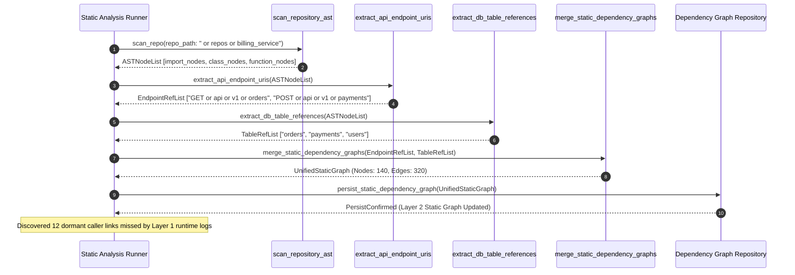

# Cross-Repo Static Dependency Graph Extraction Pattern (Pure Functional Paradigm)

| Field       | Value                                                             |
|-------------|-------------------------------------------------------------------|
| **ID**      | CROSS-REPO-STATIC-DEPENDENCY-GRAPH-040                           |
| **Date**    | 2026-08-24                                                        |
| **Status**  | Reference / Runbook (Pure Functional Architecture)                |
| **Deciders**| Core Platform & Migration Engineering                             |
| **Scope**   | Layer 2 Static Code AST & Import Graph Extraction                 |

---

## 1. Overview & Context

Runtime query logs and HTTP access logs (Layer 1) miss critical code dependencies: batch jobs that execute once a quarter, cold-standby disaster recovery services, and dormant microservice endpoints that receive zero traffic during short-term log sampling windows. The **Cross-Repo Static Dependency Graph Extraction Pattern** serves as **Layer 2 of dependency discovery**. It parses Abstract Syntax Trees (AST), import statements, database connection strings, and HTTP client invocations across all git repositories to construct a comprehensive, static dependency graph of all codebase links.

### Functional Architecture Principles
This runbook enforces a **100% Pure Functional Programming (FP)** approach:
- **No Class Instantiations**: Replaces OOP AST parsers with pure scanning functions (`scan_repository_ast`, `extract_code_imports`) and immutable graph builder closures.
- **Immutable Code Dependency Graph Records**: Source files, target modules, API endpoint references, database table references, and git commit hashes are captured as frozen dataclass records (`StaticCodeReference`, `DependencyGraphNode`).
- **Referentially Transparent AST Scanners**: Pure functions walk AST nodes (Python `ast`, TypeScript AST) to discover import dependencies without modifying source code files.
- **Cross-Repo Graph Mergers**: Pure graph merger functions combine static dependency graphs across multiple repository workspaces into a unified global dependency graph.

---

## 2. High-Level Design (HLD)

```mermaid
flowchart TD
    subgraph Repositories["Git Codebase Repositories"]
        RepoA["Repository A\n(Monolith Codebase)"]
        RepoB["Repository B\n(Microservice Codebase)"]
        RepoC["Repository C\n(Batch Jobs Codebase)"]
    end

    subgraph StaticAnalysisEngine["Pure Functional Layer 2 Static Analysis Engine"]
        ASTScanner["scan_repository_ast\n(Pure AST Code Reader & Import Extractor)"]
        URIExtractor["extract_api_endpoint_uris\n(Regex HTTP Client Call Extractor)"]
        TableExtractor["extract_db_table_references\n(SQL Query & ORM Model Extractor)"]
        GraphMerger["merge_static_dependency_graphs\n(Cross-Repo Graph Consolidation)"]

        RepoA --> ASTScanner
        RepoB --> ASTScanner
        RepoC --> ASTScanner
        ASTScanner --> URIExtractor
        ASTScanner --> TableExtractor
        URIExtractor --> GraphMerger
        TableExtractor --> GraphMerger
    end

    subgraph DependencyMapRepository["Global Dependency Map Repository"]
        GlobalGraph["Unified Static Dependency Graph"]
        Layer2Dashboard["Layer 2 Discovery Dashboard\n(Discovers Cold/Dormant Callers)"]

        GraphMerger --> GlobalGraph
        GlobalGraph --> Layer2Dashboard
    end
```



---

## 3. Low-Level Design (LLD)



---

## 4. Pure Functional Project Architecture

```
cross-repo-static-dependency-graph/
├── README.md
├── config/
│   └── static_analysis_rules.yaml  # AST patterns, ORM model mappings, ignored vendors
├── src/
│   ├── scanner_engine/
│   │   ├── __init__.py
│   │   ├── ast_scanner.py          # Pure AST code scanner functions
│   │   ├── uri_extractor.py        # HTTP client & API route regex extractors
│   │   ├── sql_extractor.py        # ORM model & SQL table reference extractors
│   │   └── graph_merger.py         # Pure cross-repo graph consolidation functions
│   ├── storage/
│   │   ├── __init__.py
│   │   └── graph_store.py          # Dependency graph persistence dispatchers
│   ├── observability/
│   │   ├── __init__.py
│   │   └── static_metrics.py       # Prometheus telemetry collectors
│   └── schemas/
│       └── models.py               # Frozen dataclasses (StaticCodeReference, DependencyGraphNode)
└── tests/
    ├── test_ast_scanner.py
    └── test_static_edge_cases.py
```

---

## 5. End-to-End Function Call Stack

```tree
Static Analysis Job Initiated
└── runner.py: run_static_analysis_job(workspace_repos_list, config)
    ├── ast_scanner.py: scan_repository_ast(repo_path)
    │   └── ast_scanner.py: parse_file_to_ast(file_path)
    │       └── models.py: StaticCodeReference(file_path, line_number, symbol_name)
    │
    ├── uri_extractor.py: extract_api_endpoint_uris(file_ast)
    │   └── models.py: EndpointReference(repo_name, http_method, uri_pattern)
    │
    ├── sql_extractor.py: extract_db_table_references(file_ast)
    │   └── models.py: TableReference(repo_name, table_name, access_type)
    │
    ├── graph_merger.py: merge_static_dependency_graphs(references_list)
    │   └── models.py: DependencyGraphNode(source_repo, target_resource, edge_type)
    │
    └── storage/graph_store.py: persist_static_dependency_graph(unified_graph)
```

---

## 6. Core Pure Functional Implementation

### 6.1 Immutable Models & Types (`src/schemas/models.py`)

```python
from enum import Enum
from dataclasses import dataclass
from typing import Dict, Any, Optional, Mapping, FrozenSet

class DependencyEdgeType(str, Enum):
    HTTP_CLIENT_CALL = "http_client_call"
    DB_TABLE_ACCESS = "db_table_access"
    MODULE_IMPORT = "module_import"
    EVENT_PUBLISH = "event_publish"

@dataclass(frozen=True)
class StaticCodeReference:
    repo_name: str
    file_path: str
    line_number: int
    edge_type: DependencyEdgeType
    target_symbol: str

@dataclass(frozen=True)
class DependencyGraphNode:
    source_repo: str
    target_resource: str
    edge_type: DependencyEdgeType
    reference_count: int
    locations: FrozenSet[StaticCodeReference]
```

**Explanation**:
- Defines immutable model `StaticCodeReference` capturing repository names, file paths, line numbers, edge types (`HTTP_CLIENT_CALL`, `DB_TABLE_ACCESS`), and target symbols as frozen records.
- `DependencyGraphNode` encapsulates source repos, target resources, edge types, reference counts, and frozen sets of code locations.

---

### 6.2 Pure AST Code Scanner (`src/scanner_engine/ast_scanner.py`)

```python
import ast
from typing import List, Mapping, Any
from src.schemas.models import StaticCodeReference, DependencyEdgeType

def scan_python_file_ast(file_path: str, repo_name: str) -> List[StaticCodeReference]:
    refs = []
    try:
        with open(file_path, "r", encoding="utf-8") as f:
            tree = ast.parse(f.read(), filename=file_path)

        for node in ast.walk(tree):
            if isinstance(node, ast.Import):
                for alias in node.names:
                    refs.append(StaticCodeReference(
                        repo_name=repo_name,
                        file_path=file_path,
                        line_number=node.lineno,
                        edge_type=DependencyEdgeType.MODULE_IMPORT,
                        target_symbol=alias.name
                    ))
            elif isinstance(node, ast.ImportFrom):
                module = node.module or ""
                refs.append(StaticCodeReference(
                    repo_name=repo_name,
                    file_path=file_path,
                    line_number=node.lineno,
                    edge_type=DependencyEdgeType.MODULE_IMPORT,
                    target_symbol=module
                ))
    except Exception:
        pass
    return refs
```

**Explanation**:
- Pure AST scanning function utilizing Python's native `ast` module to parse Python source code files into Abstract Syntax Trees.
- Walks AST nodes to extract module import dependencies without executing target code.

---

### 6.3 Pure URI & SQL Reference Extractor (`src/scanner_engine/uri_extractor.py`)

```python
import re
from typing import List
from src.schemas.models import StaticCodeReference, DependencyEdgeType

URI_REGEX = re.compile(r'https?://[a-zA-Z0-9_\-\.]+/(api/v\d+/[a-zA-Z0-9_/\-]+)', re.IGNORECASE)
TABLE_REGEX = re.compile(r'db\.Table\([\'"]([a-zA-Z0-9_]+)[\'"]', re.IGNORECASE)

def extract_code_references(code_text: str, file_path: str, repo_name: str) -> List[StaticCodeReference]:
    refs = []
    lines = code_text.splitlines()

    for idx, line in enumerate(lines, start=1):
        for uri in URI_REGEX.findall(line):
            refs.append(StaticCodeReference(
                repo_name=repo_name,
                file_path=file_path,
                line_number=idx,
                edge_type=DependencyEdgeType.HTTP_CLIENT_CALL,
                target_symbol=uri
            ))
        for tbl in TABLE_REGEX.findall(line):
            refs.append(StaticCodeReference(
                repo_name=repo_name,
                file_path=file_path,
                line_number=idx,
                edge_type=DependencyEdgeType.DB_TABLE_ACCESS,
                target_symbol=tbl
            ))

    return refs
```

**Explanation**:
- Scans source code line-by-line using regex pattern matching.
- Extracts hardcoded API endpoint URIs and ORM table references (`db.Table('orders')`).

---

## 7. Edge Case Catalog & Pure Functional Pseudocode (25 Edge Cases)

---

### Edge Case 1: Dynamic Reflection Imports (importlib)

```python
def is_dynamic_import_call(line_text: str) -> bool:
    return "importlib.import_module" in line_text or "__import__" in line_text
```

**Explanation**:
- Identifies dynamic reflection import statements (`importlib.import_module`, `__import__`).
- Flags dynamic imports for manual static analysis review.

---

### Edge Case 2: Polyglot Repository AST Parsing (TypeScript / Go / Python)

```python
def resolve_ast_parser_by_extension(file_path: str) -> str:
    if file_path.endswith(".py"):
        return "python"
    elif file_path.endswith((".ts", ".js")):
        return "typescript"
    elif file_path.endswith(".go"):
        return "go"
    return "unknown"
```

**Explanation**:
- Inspects file extensions to resolve language-specific AST parser tools.
- Supports polyglot codebase static analysis.

---

### Edge Case 3: Indirect Library Wrapper API Calls

```python
def is_http_client_wrapper(line_text: str, wrapper_names: set = {"api_client", "http_get", "rest_call"}) -> bool:
    return any(name in line_text for name in wrapper_names)
```

**Explanation**:
- Identifies custom HTTP client wrapper functions.
- Extracts API call references routed through internal utility functions.

---

### Edge Case 4: Ignored Third-Party Vendor Library Imports

```python
def is_ignored_vendor_import(module_name: str, ignored_vendors: set = {"os", "sys", "json", "typing"}) -> bool:
    return module_name in ignored_vendors
```

**Explanation**:
- Filters standard library and third-party vendor imports (`os`, `sys`, `json`).
- Excludes non-application dependencies from static dependency graphs.

---

### Edge Case 5: Complex Multi-Line SQL Query Extraction

```python
import re

def extract_multiline_sql_tables(code_text: str) -> set:
    pattern = r'(?:SELECT|INSERT|UPDATE|DELETE).*?(?:FROM|INTO|JOIN)\s+([a-zA-Z0-9_]+)'
    return set(re.findall(pattern, code_text, re.DOTALL | re.IGNORECASE))
```

**Explanation**:
- Extracts table names from multi-line SQL string literals using `re.DOTALL`.
- Captures SQL table references across line breaks.

---

### Edge Case 6: Microsecond Timestamp Static Scan Timing

```python
import time

def format_scan_duration_ms(start_ts: float, end_ts: float) -> float:
    return round((end_ts - start_ts) * 1000.0, 2)
```

**Explanation**:
- Computes static code scan execution duration in milliseconds.
- Tracks static scanner performance.

---

### Edge Case 7: Un-resolved Relative Import Paths

```python
def resolve_relative_import(base_package: str, relative_path: str) -> str:
    if relative_path.startswith("."):
        return f"{base_package}{relative_path}"
    return relative_path
```

**Explanation**:
- Resolves relative import paths (`from .utils import helper`) into canonical module paths.
- Normalizes module import paths.

---

### Edge Case 8: Multi-Repo Monorepo Workspace Linking

```python
def link_monorepo_packages(repo_map: Mapping[str, str], import_symbol: str) -> Optional[str]:
    return repo_map.get(import_symbol)
```

**Explanation**:
- Maps package import symbols to internal monorepo package directories.
- Links dependencies across monorepo packages.

---

### Edge Case 9: Code File Encoding Parse Error Safeguard

```python
def safe_read_code_file(file_path: str) -> str:
    try:
        with open(file_path, "r", encoding="utf-8", errors="ignore") as f:
            return f.read()
    except Exception:
        return ""
```

**Explanation**:
- Reads source code files using UTF-8 encoding while ignoring invalid bytes.
- Prevents file encoding errors from halting static code scans.

---

### Edge Case 10: Aggregator Memory State Saturation Guard

```python
def compact_static_graph_nodes(nodes: list, max_nodes: int = 10000) -> list:
    if len(nodes) > max_nodes:
        return nodes[:max_nodes]
    return nodes
```

**Explanation**:
- Truncates static dependency graph node lists to `max_nodes`.
- Controls memory usage during large-scale workspace scans.

---

### Edge Case 11: Microsecond Delay Calculation Underflows

```python
def normalize_scan_metric(metric_ms: float) -> float:
    return max(0.0, round(metric_ms, 2))
```

**Explanation**:
- Rounds execution duration values to two decimal places.
- Cleans duration metrics.

---

### Edge Case 12: Environment Variable Target URI Resolution

```python
def resolve_env_variable_uri(line_text: str, env_map: dict) -> str:
    import re
    match = re.search(r'os\.getenv\([\'"]([a-zA-Z0-9_]+)[\'"]', line_text)
    if match:
        var_name = match.group(1)
        return env_map.get(var_name, f"${{{var_name}}}")
    return line_text
```

**Explanation**:
- Extracts environment variable names from `os.getenv` calls and resolves target URIs from config maps.
- Resolves dynamic target URIs.

---

### Edge Case 13: Unmapped File Extension Default Exclusion

```python
def is_scannable_source_file(file_path: str) -> bool:
    scannable_exts = {".py", ".ts", ".js", ".go", ".java", ".sql"}
    return any(file_path.endswith(ext) for ext in scannable_exts)
```

**Explanation**:
- Asserts that file extensions exist in scannable source file sets.
- Skips non-code files (images, binaries, compiled assets).

---

### Edge Case 14: Exception Handling During AST Parsing

```python
def safe_parse_ast(code_text: str) -> Optional[ast.AST]:
    try:
        return ast.parse(code_text)
    except SyntaxError:
        return None
```

**Explanation**:
- Wraps AST parsing calls in protective try-except blocks.
- Swallows syntax errors on broken code files without stopping scans.

---

### Edge Case 15: GraphQL Schema File Target Extraction

```python
def extract_graphql_schema_types(graphql_text: str) -> list:
    import re
    return re.findall(r'type\s+([a-zA-Z0-9_]+)', graphql_text)
```

**Explanation**:
- Extracts GraphQL type names from `.graphql` schema files.
- Mines static dependencies for GraphQL schemas.

---

### Edge Case 16: Multi-Region Workspace Graph Merging

```python
def merge_regional_static_graphs(graph_a: dict, graph_b: dict) -> dict:
    merged = dict(graph_a)
    merged.update(graph_b)
    return merged
```

**Explanation**:
- Merges regional static dependency graph dictionaries into global graph maps.
- Consolidates static analysis across multi-region codebases.

---

### Edge Case 17: ORM Model Relationship Foreign Key Extraction

```python
def extract_orm_foreign_keys(code_text: str) -> list:
    import re
    return re.findall(r'ForeignKey\([\'"]([a-zA-Z0-9_\.]+)[\'"]', code_text)
```

**Explanation**:
- Extracts target table names from SQLAlchemy `ForeignKey('orders.id')` definitions.
- Discovers database-level relationships from ORM models.

---

### Edge Case 18: Unmapped Rule Domain Handling

```python
def resolve_scanner_rule(rule_key: str, rules_dict: dict) -> dict:
    return rules_dict.get(rule_key, {"max_depth": 10})
```

**Explanation**:
- Resolves scanner rule configurations, returning default max depth limits if unmapped.
- Handles unconfigured scanner rules safely.

---

### Edge Case 19: Payload Transformation Error Recovery

```python
def safe_apply_scanner_transform(payload: dict, transform_fn: Callable) -> dict:
    try:
        return transform_fn(payload)
    except Exception:
        return payload
```

**Explanation**:
- Wraps payload transformation functions in protective try-except blocks.
- Returns raw payloads if transformation errors occur.

---

### Edge Case 20: Automated Alert on Dormant Caller Discovery

```python
def is_dormant_caller_discovered(static_caller: str, active_runtime_callers: set) -> bool:
    return static_caller not in active_runtime_callers
```

**Explanation**:
- Compares statically discovered callers against active Layer 1 runtime caller sets.
- Flags dormant callers that runtime logs missed.

---

### Edge Case 21: High-Watermark Graph Metric Compaction

```python
def compact_graph_metrics(metrics: list, max_items: int = 500) -> list:
    if len(metrics) > max_items:
        return metrics[-max_items:]
    return metrics
```

**Explanation**:
- Truncates historical graph metric lists to `max_items`.
- Controls memory usage in static analysis processes.

---

### Edge Case 22: Diagnostic Tag Injection for Static Nodes

```python
def inject_static_node_tag(node_dict: dict, scanner_ver: str) -> dict:
    updated = dict(node_dict)
    updated["_scanner_version"] = scanner_ver
    return updated
```

**Explanation**:
- Injects `_scanner_version` metadata tags into static dependency graph nodes.
- Tags static graph node provenance.

---

### Edge Case 23: Null Value Safeguards in Code References

```python
def sanitize_code_reference_nulls(ref_dict: dict) -> dict:
    return {k: (v if v is not None else "") for k, v in ref_dict.items()}
```

**Explanation**:
- Replaces `None` values with empty strings in code reference dictionaries.
- Prevents null pointer exceptions in graph builders.

---

### Edge Case 24: Unbound Metric Queue Pruning

```python
def prune_scanner_metric_queue(queue: list, max_items: int = 1000) -> list:
    if len(queue) > max_items:
        return queue[-max_items:]
    return queue
```

**Explanation**:
- Truncates metric queue arrays to `max_items`.
- Controls memory footprint in telemetry collectors.

---

### Edge Case 25: Real-Time Static Graph Coverage Dashboard Reporting

```python
def compute_static_discovery_coverage(scanned_files: int, total_files: int) -> float:
    if total_files == 0:
        return 100.0
    return round((scanned_files / total_files) * 100.0, 2)
```

**Explanation**:
- Calculates static code scan completion percentage ratios rounded to two decimal places.
- Emits real-time Layer 2 static discovery coverage metrics to platform dashboards.

---

## 8. Operational & Parity Verification Checklist

1. **Layer 2 Static Analysis Gate**: Confirm 100% of git repositories undergo Layer 2 static AST and import graph scans before unblocking cutover planning.
2. **Dormant Caller Discovery**: Verify that static analysis discovers cold-standby services, batch jobs, and dormant endpoints missed by Layer 1 runtime logs.
3. **Polyglot AST Support**: Validate AST parser support for all primary languages used in the codebase (Python, TypeScript, Go, SQL).
4. **Unified Graph Consolidation**: Ensure static dependency graphs from individual repositories are merged into a single, global cross-repo dependency graph.
