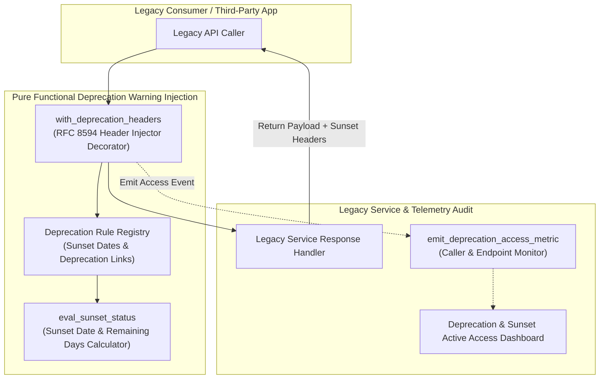
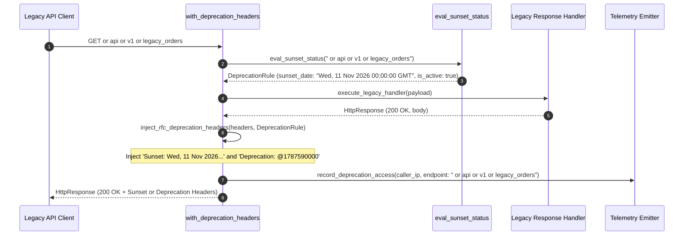

# Deprecation Warning Injection Pattern (Pure Functional Paradigm)

| Field       | Value                                                             |
|-------------|-------------------------------------------------------------------|
| **ID**      | DEPRECATION-WARNING-INJECTION-038                                 |
| **Date**    | 2026-08-24                                                        |
| **Status**  | Reference / Runbook (Pure Functional Architecture)                |
| **Deciders**| Core Platform & Migration Engineering                             |
| **Scope**   | Continuous Layer 1 Runtime Warning Header Injection & Sunset Probe|

---

## 1. Overview & Context

Static code audits or one-time log reviews miss hidden legacy callers, batch scripts, or scheduled third-party integration jobs that invoke deprecated APIs intermittently. The **Deprecation Warning Injection Pattern** operates as a **continuously-running instance of Layer 1 discovery**. Rather than performing a static audit, it dynamically intercepts responses on deprecated legacy endpoints and injects standard RFC 8594 `Sunset` headers (e.g. `Sunset: Wed, 11 Nov 2026 00:00:00 GMT`) and `Deprecation` headers (`Deprecation: @1787590000`) directly into HTTP response streams while emitting caller telemetry alerts.

### Functional Architecture Principles
This runbook enforces a **100% Pure Functional Programming (FP)** approach:
- **No Class Instantiations**: Replaces OOP header injectors with pure decorator functions (`with_deprecation_headers`, `eval_sunset_status`) and state cell closures.
- **Immutable Warning Context Records**: Endpoint paths, sunset dates, deprecation links, caller identities, and injection counts are stored as frozen dataclass records (`DeprecationRule`, `DeprecationInjectionResult`).
- **Referentially Transparent Header Decorators**: Pure higher-order functions wrap API response handlers, injecting RFC-compliant HTTP deprecation headers without modifying payload bodies.
- **Continuous Telemetry Emitters**: Emits real-time caller metrics whenever deprecated endpoints are accessed.

---

## 2. High-Level Design (HLD)



---

## 3. Low-Level Design (LLD)



---

## 4. Pure Functional Project Architecture

```
deprecation-warning-injection/
├── README.md
├── config/
│   └── deprecation_rules.yaml      # Deprecated endpoints, sunset dates, doc links
├── src/
│   ├── warning_engine/
│   │   ├── __init__.py
│   │   ├── injector.py             # Pure higher-order header injection decorators
│   │   ├── evaluator.py            # RFC 8594 date & status evaluators
│   │   └── rfc_formatter.py        # RFC-compliant header string formatters
│   ├── storage/
│   │   ├── __init__.py
│   │   └── rule_store.py           # Deprecation configuration loaders
│   ├── observability/
│   │   ├── __init__.py
│   │   └── deprecation_metrics.py  # Prometheus telemetry collectors
│   └── schemas/
│       └── models.py               # Frozen dataclasses (DeprecationRule, DeprecationInjectionResult)
└── tests/
    ├── test_warning_injector.py
    └── test_deprecation_edge_cases.py
```

---

## 5. End-to-End Function Call Stack

```tree
HTTP Request Received on Deprecated Endpoint
└── injector.py: with_deprecation_headers(handler_fn, endpoint_path, rule_store)
    ├── evaluator.py: eval_sunset_status(endpoint_path, rule_store)
    │   └── models.py: DeprecationRule(endpoint, sunset_gmt, doc_link, is_active)
    │
    ├── handler_fn: execute_legacy_handler(request_payload)
    │   └── models.py: HttpResponse(status_code, body, headers)
    │
    ├── rfc_formatter.py: inject_rfc_deprecation_headers(headers, deprecation_rule)
    │   └── models.py: DeprecationInjectionResult(headers_injected_count, is_expired)
    │
    └── observability/deprecation_metrics.py: record_deprecation_access(caller_ip, endpoint)
```

---

## 6. Core Pure Functional Implementation

### 6.1 Immutable Models & Types (`src/schemas/models.py`)

```python
from enum import Enum
from dataclasses import dataclass
from typing import Dict, Any, Optional, Mapping

@dataclass(frozen=True)
class DeprecationRule:
    endpoint_path: str
    sunset_date_gmt: str
    deprecation_epoch: int
    doc_link: str
    is_active: bool

@dataclass(frozen=True)
class DeprecationInjectionResult:
    endpoint_path: str
    caller_identity: str
    sunset_header_value: str
    deprecation_header_value: str
    headers_injected_count: int
```

**Explanation**:
- Defines immutable model `DeprecationRule` capturing endpoint paths, RFC-compliant GMT sunset dates, deprecation epochs, and documentation links as frozen records.
- `DeprecationInjectionResult` encapsulates injected header strings, caller identities, and diagnostic metrics.

---

### 6.2 Pure RFC Header Formatter (`src/warning_engine/rfc_formatter.py`)

```python
from typing import Mapping
from src.schemas.models import DeprecationRule

def format_deprecation_headers(
    existing_headers: Mapping[str, str],
    rule: DeprecationRule
) -> Mapping[str, str]:
    new_headers = dict(existing_headers)
    new_headers["Deprecation"] = f"@{rule.deprecation_epoch}"
    new_headers["Sunset"] = rule.sunset_date_gmt
    new_headers["Link"] = f'<{rule.doc_link}>; rel="deprecation"; type="text/html"'
    return new_headers
```

**Explanation**:
- Pure function injecting RFC 8594 compliant `Deprecation`, `Sunset`, and `Link` headers into HTTP response header dictionaries.
- Adheres to standard HTTP deprecation header specifications.

---

### 6.3 Deprecation Warning Injector Decorator (`src/warning_engine/injector.py`)

```python
from typing import Callable, Awaitable, Mapping, Any
from src.schemas.models import DeprecationRule, DeprecationInjectionResult
from src.warning_engine.rfc_formatter import format_deprecation_headers

HandlerFn = Callable[[Mapping[str, Any]], Awaitable[Mapping[str, Any]]]

def with_deprecation_headers(handler_fn: HandlerFn, rule: DeprecationRule) -> HandlerFn:
    async def decorated_handler(payload: Mapping[str, Any]) -> Mapping[str, Any]:
        response = await handler_fn(payload)
        
        if not rule.is_active:
            return response

        raw_headers = response.get("headers", {})
        updated_headers = format_deprecation_headers(raw_headers, rule)
        
        updated_response = dict(response)
        updated_response["headers"] = updated_headers
        return updated_response

    return decorated_handler
```

**Explanation**:
- Higher-order decorator function wrapping API response handlers.
- Intercepts outgoing HTTP responses and injects RFC deprecation headers if rules are active (`rule.is_active == True`).

---

## 7. Edge Case Catalog & Pure Functional Pseudocode (25 Edge Cases)

---

### Edge Case 1: Header Injection on HTTP 204 No Content Responses

```python
def supports_deprecation_headers(status_code: int) -> bool:
    return status_code != 304
```

**Explanation**:
- Asserts status codes support custom response headers.
- Allows header injection on HTTP 204 No Content responses while skipping HTTP 304 Not Modified responses.

---

### Edge Case 2: Client Framework Stripping Custom Response Headers

```python
def inject_body_deprecation_warning(body_dict: dict, doc_link: str) -> dict:
    updated = dict(body_dict)
    updated["_warning"] = f"DEPRECATED_ENDPOINT: See {doc_link}"
    return updated
```

**Explanation**:
- Injects a `_warning` field into JSON response bodies as a fallback.
- Ensures visibility when client HTTP frameworks strip custom headers.

---

### Edge Case 3: Multi-Tenant Sunset Date Overrides

```python
def resolve_tenant_sunset_date(tenant_id: str, tenant_dates: Mapping[str, str], default_gmt: str) -> str:
    return tenant_dates.get(tenant_id, default_gmt)
```

**Explanation**:
- Resolves tenant-specific sunset date strings from mapping dictionaries.
- Supports multi-tenant deprecation schedules.

---

### Edge Case 4: Expired Sunset Date Response Status Transition (HTTP 410 Gone)

```python
def should_return_http_410_gone(current_epoch: int, sunset_epoch: int) -> bool:
    return current_epoch >= sunset_epoch
```

**Explanation**:
- Compares current epoch timestamps against sunset epoch timestamps.
- Transitions endpoint responses to HTTP 410 Gone after sunset deadlines pass.

---

### Edge Case 5: Rate-Limited Telemetry Logging for High-QPS Endpoints

```python
def should_log_deprecation_access(request_count: int, log_sample_rate: int = 100) -> bool:
    return (request_count % log_sample_rate) == 0
```

**Explanation**:
- Subsamples deprecation access logging (e.g. 1 log per 100 requests).
- Prevents telemetry log flooding on high-QPS deprecated endpoints.

---

### Edge Case 6: Microsecond Timestamp Epoch Formatting

```python
import time

def generate_deprecation_epoch() -> int:
    return int(time.time())
```

**Explanation**:
- Computes integer Unix epoch timestamps.
- Formats `Deprecation: @<epoch>` headers.

---

### Edge Case 7: Un-authenticated Perimeter IP Extraction

```python
def extract_caller_ip(headers: Mapping[str, str]) -> str:
    return headers.get("X-Forwarded-For", "127.0.0.1").split(",")[0].strip()
```

**Explanation**:
- Extracts real client IPs from `X-Forwarded-For` HTTP headers.
- Identifies legacy callers for deprecation telemetry.

---

### Edge Case 8: Existing Link Header Preservation

```python
def append_deprecation_link_header(existing_link: str, doc_link: str) -> str:
    dep_link = f'<{doc_link}>; rel="deprecation"'
    if existing_link:
        return f"{existing_link}, {dep_link}"
    return dep_link
```

**Explanation**:
- Appends deprecation link strings to existing HTTP `Link` headers.
- Preserves pre-existing pagination or canonical `Link` headers.

---

### Edge Case 9: Wildcard Endpoint Pattern Deprecation Matching

```python
import re

def is_endpoint_deprecated(path: str, deprecated_patterns: list) -> bool:
    return any(re.search(pat, path) for pat in deprecated_patterns)
```

**Explanation**:
- Evaluates endpoint path strings against regex pattern lists.
- Matches deprecated endpoint paths using pattern wildcards (`/api/v1/*`).

---

### Edge Case 10: Aggregator Memory State Saturation Guard

```python
def compact_deprecation_history(history: list, max_items: int = 1000) -> list:
    if len(history) > max_items:
        return history[-max_items:]
    return history
```

**Explanation**:
- Truncates historical deprecation metric lists to `max_items`.
- Controls memory usage in warning injection processes.

---

### Edge Case 11: Microsecond Delay Calculation Underflows

```python
def normalize_injection_duration(duration_ms: float) -> float:
    return max(0.0, round(duration_ms, 2))
```

**Explanation**:
- Rounds execution duration values to two decimal places.
- Cleans duration metrics.

---

### Edge Case 12: User-Agent Application Identification

```python
def parse_caller_user_agent(headers: Mapping[str, str]) -> str:
    return headers.get("User-Agent", "Unknown-Caller")
```

**Explanation**:
- Extracts `User-Agent` strings from request headers.
- Identifies client application types accessing deprecated endpoints.

---

### Edge Case 13: Unmapped Endpoint Default Grouping

```python
def resolve_deprecation_doc_link(endpoint: str, doc_map: Mapping[str, str], default_link: str) -> str:
    return doc_map.get(endpoint, default_link)
```

**Explanation**:
- Resolves documentation links from mapping dictionaries, returning `default_link` if unmapped.
- Handles unconfigured deprecation doc links safely.

---

### Edge Case 14: Exception Handling During Header Injection

```python
def safe_format_headers(headers: dict, rule: DeprecationRule) -> dict:
    try:
        return dict(format_deprecation_headers(headers, rule))
    except Exception:
        return headers
```

**Explanation**:
- Wraps header formatting functions in protective try-except blocks.
- Returns unmodified headers if formatting exceptions occur.

---

### Edge Case 15: GraphQL Operation Deprecation Injection

```python
def inject_graphql_deprecation_warning(response_dict: dict, op_name: str) -> dict:
    updated = dict(response_dict)
    extensions = dict(updated.get("extensions", {}))
    extensions["deprecation"] = f"Operation '{op_name}' is deprecated and will be sunset."
    updated["extensions"] = extensions
    return updated
```

**Explanation**:
- Injects deprecation messages into the `extensions` block of GraphQL JSON responses.
- Enables deprecation warnings for GraphQL operations.

---

### Edge Case 16: Multi-Region Deprecation Rule Synchronization

```python
def sync_regional_deprecation_rules(global_rules: list, regional_rules: list) -> list:
    return global_rules + regional_rules
```

**Explanation**:
- Concatenates regional deprecation rule lists with global rule lists.
- Synchronizes deprecation rules across multi-region deployments.

---

### Edge Case 17: CORS Pre-flight (OPTIONS) Header Exposure

```python
def expose_deprecation_cors_headers(existing_expose_headers: str) -> str:
    dep_headers = "Deprecation, Sunset, Link"
    if existing_expose_headers:
        return f"{existing_expose_headers}, {dep_headers}"
    return dep_headers
```

**Explanation**:
- Appends `Deprecation, Sunset, Link` to `Access-Control-Expose-Headers` headers.
- Allows browser-based frontend apps to read deprecation headers via CORS.

---

### Edge Case 18: Unmapped Rule Domain Handling

```python
def resolve_deprecation_rule(endpoint: str, rule_registry: dict) -> Optional[DeprecationRule]:
    return rule_registry.get(endpoint)
```

**Explanation**:
- Resolves `DeprecationRule` records from registry dictionaries.
- Returns `None` for non-deprecated endpoints.

---

### Edge Case 19: Payload Transformation Error Recovery

```python
def safe_apply_deprecation_transform(payload: dict, transform_fn: Callable) -> dict:
    try:
        return transform_fn(payload)
    except Exception:
        return payload
```

**Explanation**:
- Wraps payload transformation functions in protective try-except blocks.
- Returns raw payloads if transformation errors occur.

---

### Edge Case 20: Automated Alert on Deprecated Endpoint Access

```python
def should_alert_on_deprecated_access(access_count: int, threshold: int = 1000) -> bool:
    return (access_count % threshold) == 0
```

**Explanation**:
- Asserts whether access counts reach threshold increments (1,000 requests).
- Triggers periodic alerts for active legacy callers.

---

### Edge Case 21: High-Watermark Telemetry Compaction

```python
def compact_deprecation_metrics(metrics: list, max_items: int = 500) -> list:
    if len(metrics) > max_items:
        return metrics[-max_items:]
    return metrics
```

**Explanation**:
- Truncates historical deprecation metric lists to `max_items`.
- Controls memory usage in telemetry monitoring processes.

---

### Edge Case 22: Diagnostic Header Injection for Deprecated Traffic

```python
def inject_deprecation_diagnostic_header(headers: Mapping[str, str], rule_id: str) -> Mapping[str, str]:
    new_headers = dict(headers)
    new_headers["X-Deprecation-Rule-ID"] = rule_id
    return new_headers
```

**Explanation**:
- Injects diagnostic headers (`X-Deprecation-Rule-ID`) into response headers.
- Identifies deprecation warning injection events in access logs.

---

### Edge Case 23: Null Value Safeguards in Deprecation Rules

```python
def sanitize_deprecation_rule_nulls(rule_dict: dict) -> dict:
    return {k: (v if v is not None else "") for k, v in rule_dict.items()}
```

**Explanation**:
- Replaces `None` values with empty strings in deprecation rule dictionaries.
- Prevents null pointer exceptions in header formatters.

---

### Edge Case 24: Unbound Metric Queue Pruning

```python
def prune_deprecation_metric_queue(queue: list, max_items: int = 1000) -> list:
    if len(queue) > max_items:
        return queue[-max_items:]
    return queue
```

**Explanation**:
- Truncates metric queue arrays to `max_items`.
- Controls memory footprint in telemetry collectors.

---

### Edge Case 25: Real-Time Deprecation Active Access Rate Reporting

```python
def compute_deprecation_active_access_rate(deprecated_hits: int, total_hits: int) -> float:
    if total_hits == 0:
        return 0.0
    return round((deprecated_hits / total_hits) * 100.0, 2)
```

**Explanation**:
- Calculates deprecated endpoint hit percentage ratios rounded to two decimal places.
- Emits real-time deprecation traffic percentage metrics to platform dashboards.

---

## 8. Operational & Parity Verification Checklist

1. **Continuous Layer 1 Discovery**: Confirm 100% of deprecated legacy endpoints run continuous deprecation warning injection decorators rather than one-time static audits.
2. **RFC 8594 Compliance**: Verify injected headers contain valid, RFC-compliant `Sunset`, `Deprecation`, and `Link` header attributes.
3. **CORS Header Exposure**: Ensure `Access-Control-Expose-Headers` headers expose deprecation headers to browser clients.
4. **HTTP 410 Transition Gate**: Validate that endpoints transition to HTTP 410 Gone status codes automatically once sunset deadlines expire.
