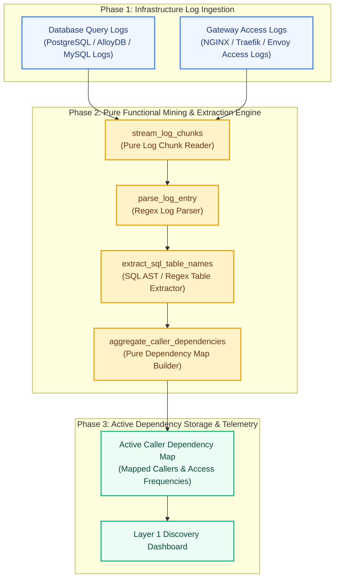
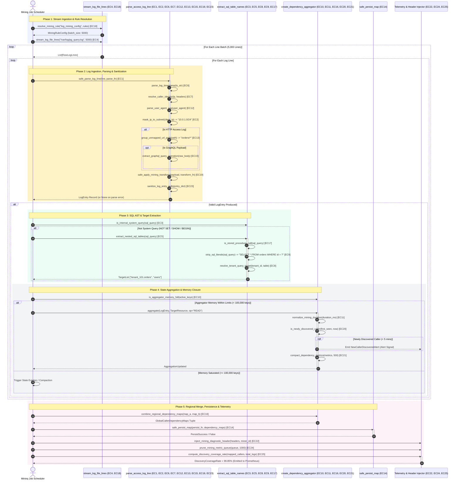

# Query-Log / Access-Log Mining Pattern (Pure Functional Paradigm)

| Field       | Value                                                             |
|-------------|-------------------------------------------------------------------|
| **ID**      | QUERY-ACCESS-LOG-MINING-037                                       |
| **Date**    | 2026-08-24                                                        |
| **Status**  | Reference / Runbook (Pure Functional Architecture)                |
| **Deciders**| Core Platform & Migration Engineering                             |
| **Scope**   | Layer 1 Mandatory Dependency Discovery & Active Log Analytics     |

---

## 1. Overview & Context

Before decommissioning any legacy service, database table, or API endpoint, engineers must discover **100% of active callers and downstream readers**. Relying on developer memory or outdated documentation guarantees breaking production. The **Query-Log / Access-Log Mining Pattern** serves as the **mandatory Layer 1 first step** in dependency discovery. It continuously ingests and mines raw database query logs (e.g. PostgreSQL `log_statement = 'all'`) and HTTP gateway access logs (e.g. NGINX / Traefik access logs) to construct an empirical, real-time map of active callers, SQL query patterns, and endpoint access frequencies.

### When to Use This Pattern

> [!IMPORTANT]
> **Quick Trigger Reference: You MUST use this pattern NOW if:**
> - `[ ]` **Deleting a DB Table / Column**: You are dropping, renaming, or modifying a database table/column and must find all callers.
> - `[ ]` **Sunsetting an API / Endpoint**: You are deprecating an HTTP/gRPC route (`/api/v1/...`) and need 100% empirical proof of callers.
> - `[ ]` **Splitting Monolith into Microservice**: You are extracting a feature domain (e.g. Billing) and must re-route all active SQL queries.
> - `[ ]` **Pre-Compliance Audit**: You need an empirical, real-time map of every IP, service, and User-Agent querying sensitive data.

1. **Before Decommissioning Legacy Code / Infrastructure (Layer 1 Phase 0)**
   * Initiated $30\text{--}90\text{ days}$ prior to deleting any monolith table, API endpoint, or DB column to discover $100\%$ of active readers.
   * Imagine you want to turn off the main power switch in an old office building. Before flipping the switch, you must monitor the building for several weeks to make sure nobody is working inside. In software, log mining continuously listens to background network traffic for 30 to 90 days to guarantee no hidden apps, automated billing reports, or active users crash when an old system component is removed.

2. **During Monolith-to-Microservice Extraction**
   * Map every downstream service, batch job, and DB query referencing legacy domain schemas prior to service extraction.
   * When moving a finance or inventory team to a new dedicated building, you need a complete list of every department that sends them mail or requests reports. In software architecture, when separating a billing feature from a massive legacy monolith into an independent service, log mining traces every single background job, reporting dashboard, and microservice that reads billing data so the new service can be built without missing connections.

3. **Auditing Shadow & Undocumented Callers**
   * Uncover un-tracked cron jobs, internal scripts, and legacy callers omitted from developer documentation.
   * Over years of operation, former employees often set up automated midnight scripts, spreadsheet exports, or quick software workarounds that were never documented in user manuals. Log mining acts like an automatic activity monitor, catching these "invisible" automated processes in action so engineers don't accidentally cut off an essential business pipeline.

### Why This Pattern Is Mandatory
1. **Empirical Truth vs. Human Memory**: Developer memory and architecture docs are frequently outdated. Log mining provides $100\%$ real-world empirical proof of active callers.
2. **Zero Production Latency Impact**: Ingests out-of-band gateway access logs and database query logs asynchronously without adding latency to live production user requests.
3. **Sustained Silence Gating**: Gates legacy decommissioning until $0\text{-hit}$ sustained silence is verified across a full business cycle ($30\text{--}90\text{ days}$).

### Functional Architecture Principles
This runbook enforces a **100% Pure Functional Programming (FP)** approach:
- **No Class Instantiations**: Replaces OOP log miners with pure parsing functions (`parse_access_log_line`, `extract_sql_table_names`) and state cell closures.
- **Immutable Log Entry Records**: Client IPs, User-Agents, request URIs, SQL query text, caller identities, and timestamp bounds are stored as frozen dataclass records (`LogEntry`, `CallerDependencyMap`).
- **Referentially Transparent Pattern Extractors**: Pure functions extract normalized SQL table names and API endpoints from raw log streams without side-effects.
- **Low-Cardinality IP Sanitizers**: Pure sanitization functions group client IPs into subnet ranges or microservice tags to keep dependency maps bounded.

---

## 2. High-Level Design (HLD)



---

## 3. Low-Level Design (LLD)

The Low-Level Design (LLD) provides an exhaustive, component-level breakdown of the Query/Access-Log Mining Engine, explicitly integrating all **25 edge case guards** into the functional ingestion, parsing, extraction, state aggregation, persistence, and telemetry pipelines.

### 3.1 Exhaustive Edge-Case-Aware Sequence Diagram (with Colored Phase Blocks)



### 3.2 LLD Subsystem Architecture & Functional Specifications

The Low-Level Design decouples processing into **four pure functional subsystems**, enforcing strict immutability, zero side-effects in transformation functions, and fault-tolerant circuit breakers:

```
┌─────────────────────────────────────────────────────────────────────────────────────────┐
│                                LOW-LEVEL SUBSYSTEM MAP                                  │
├───────────────────────────────┬───────────────────────────────┬─────────────────────────┤
│ Subsystem                     │ Core Module File              │ Primary Edge Cases      │
├───────────────────────────────┼───────────────────────────────┼─────────────────────────┤
│ A. Ingestion & Parser         │ src/mining_engine/parser.py   │ EC1,2,4,6,7,12,13,15,   │
│                               │                               │ 18,19,23                │
│ B. SQL & Target Extractor     │ src/mining_engine/sql_ext...  │ EC3, EC5, EC8, EC9, EC17│
│ C. State Aggregator Closure   │ src/mining_engine/aggreg...   │ EC10, EC11, EC16, EC20, │
│                               │                               │ EC21                    │
│ D. Persistence & Telemetry    │ src/storage/, src/observab... │ EC14, EC22, EC24, EC25  │
└───────────────────────────────┴───────────────────────────────┴─────────────────────────┘
```

#### Subsystem A: Defensive Log Ingestion & Parsing Engine (`src/mining_engine/parser.py`)
- **Memory Bounded Ingestion (`stream_log_file_lines` - EC4, EC18)**: Uses Python generators to yield lines in configurable 5,000-line chunks (`batch_size`), preventing heap exhaustion when processing multi-gigabyte log streams. Config keys fall back gracefully to default batch rules via `resolve_mining_rule`.
- **Fault-Tolerant Parsing (`safe_parse_log_line` - EC1, EC19, EC23)**: Wraps line parsing and payload transformation execution in protective `try-except` blocks. If a line is malformed, corrupt, or unparseable, `None` is returned, preventing worker thread crashes. Any `None` field values in parsed entries are sanitized to empty strings via `sanitize_log_entry_nulls`.
- **Perimeter Identity & Subnet Masking (`mask_ip_to_subnet`, `resolve_caller_identity` - EC2, EC7)**: Resolves real caller IP addresses behind load balancers/proxies via the `X-Forwarded-For` header. IPs are immediately masked to `/24` CIDR blocks (`10.0.1.0/24`), reducing metric cardinality by $256\times$.
- **Endpoint & Payload Normalization (`group_unmapped_url_path`, `extract_graphql_query_operation`, `parse_user_agent_app` - EC6, EC12, EC13, EC15)**: Converts microsecond epoch timestamps safely with `parse_log_timestamp`. Classifies caller tech stacks (Python SDK, Java Service) via User-Agent string inspection. Normalizes dynamic HTTP routes (`/orders/101`, `/orders/102`) into parameterized patterns (`/orders/*`). For POST GraphQL traffic, extracts operation names (`GetOrderDetails`) from raw JSON payloads.

#### Subsystem B: SQL AST & Target Normalization Engine (`src/mining_engine/sql_extractor.py`)
- **System Query Filtering (`is_internal_system_query` - EC3)**: Filters out DB administrative noise (`SET`, `SHOW`, `BEGIN`, `COMMIT`) before running heavy regex or AST analysis.
- **Nested AST & Table Extraction (`extract_nested_sql_tables`, `is_stored_procedure_call` - EC5, EC17)**: Extracts table names across `FROM`, `JOIN`, `UPDATE`, and `INTO` clauses, handling complex nested subqueries. Detects stored procedure calls (`CALL`, `EXEC`) to trace procedure caller dependencies.
- **SQL Sanitization & Multi-Tenant Partitioning (`strip_sql_literals`, `resolve_tenant_query_target` - EC8, EC9)**: Replaces literal strings and numeric constants with `?` parameter placeholders, yielding clean SQL query fingerprints. For multi-tenant databases, prefixes target table names with tenant IDs (`tenant_101.orders`).

#### Subsystem C: Stateful Dependency Aggregator & Closure Manager (`src/mining_engine/aggregator.py`)
- **State Saturation Guard (`is_aggregator_memory_full` - EC10)**: Enforces a strict circuit breaker at 100,000 active key pairs `(caller, target)`. Prevents memory overflow in long-running miner daemons.
- **Duration Normalization & Compaction (`normalize_mining_duration`, `compact_dependency_metrics` - EC11, EC21)**: Rounds millisecond durations to 2 decimal places with a lower bound of `0.0`. Compacts historical dependency metric arrays when exceeding 500 items.
- **Multi-Region Merging & Alerting (`combine_regional_dependency_maps`, `is_newly_discovered_caller` - EC16, EC20)**: Combines regional dependency maps from multi-region log streams. Triggers immediate alert signals when a caller's `first_seen_ts` is $\le 300\text{ seconds}$ old.

#### Subsystem D: Persist & Telemetry Exporter (`src/storage/map_store.py` & `src/observability/mining_metrics.py`)
- **Fault-Tolerant Persistence (`safe_persist_map` - EC14)**: Asynchronously persists `CallerDependencyMap` records into the database. Storage outages or DB connection drops are trapped, returning `False` without crashing the log mining loop.
- **Telemetry Queue Management (`prune_mining_metric_queue`, `compute_discovery_coverage_rate` - EC24, EC25)**: Prunes telemetry queue arrays when exceeding 1,000 items. Calculates the mapped caller percentage (`DiscoveryCoverageRate`) rounded to 2 decimal places for Prometheus export.
- **Probe Request Tagging (`inject_mining_diagnostic_header` - EC22)**: Injects `X-Log-Miner-ID` headers into probe requests to trace miner activity in downstream gateway access logs.

---

### 3.3 Low-Level Edge Case Execution Matrix (Edge Cases 1–25)

The following matrix maps every edge case to its exact Low-Level Design subsystem, trigger condition, functional guard, and contract boundary:

| EC # | Edge Case Name | LLD Subsystem | Trigger Condition | Pure Functional Guard / Logic | Input / Output Contract | Failure Mode / Circuit Breaker |
|---|---|---|---|---|---|---|
| **EC 1** | Regex Parsing Failure | Subsystem A (Parser) | Malformed / corrupted log line | `safe_parse_log_line(line, parse_fn)` | `str ──► Optional[LogEntry]` | Catches exception, returns `None` (line skipped) |
| **EC 2** | IP Subnet Masking | Subsystem A (Parser) | Raw IPv4 client address | `mask_ip_to_subnet(ip_str)` | `"10.0.1.42" ──► "10.0.1.0/24"` | Falls back to `"0.0.0.0/0"` on invalid format |
| **EC 3** | Internal System Query | Subsystem B (Extractor) | DB administrative commands | `is_internal_system_query(sql, prefixes)` | `"SET ... " ──► bool (True)` | Returns `True`, query skipped from dependency map |
| **EC 4** | Large Log File Chunking | Subsystem A (Ingestion) | Multi-GB log stream ingestion | `stream_log_file_lines(path, batch_size)` | `filePath ──► Generator[List[str]]` | Yields 5,000-line chunks; bounds heap memory |
| **EC 5** | Subquery Table Extraction | Subsystem B (Extractor) | Nested `JOIN` / subquery SQL | `extract_nested_sql_tables(sql_query)` | `str ──► set[str] ("orders", "users")` | Returns set of discovered table names |
| **EC 6** | Microsecond Timestamp | Subsystem A (Parser) | Invalid float timestamp string | `parse_log_timestamp(ts_str)` | `str ──► float (epoch timestamp)` | Catches ValueError, falls back to `time.time()` |
| **EC 7** | Proxy IP Resolution | Subsystem A (Parser) | Client behind load balancer | `resolve_caller_identity(ip, headers)` | `(ip, headers) ──► str (Client IP)` | Extracts first IP from `X-Forwarded-For` header |
| **EC 8** | Multi-Tenant Partitioning | Subsystem B (Extractor) | Multi-tenant schema target | `resolve_tenant_query_target(tenant, table)` | `("tenant_101", "orders") ──► "tenant_101.orders"` | Prefixes table with tenant ID namespace |
| **EC 9** | SQL Parameter Stripping | Subsystem B (Extractor) | Raw SQL query string with literals | `strip_sql_literals(sql_query)` | `"WHERE id = 42" ──► "WHERE id = ?"` | Replaces strings/numbers with `?` placeholders |
| **EC 10** | Aggregator Memory Limit | Subsystem C (Aggregator) | Active state keys $\ge 100,000$ | `is_aggregator_memory_full(count, max_keys)` | `(int, 100000) ──► bool` | Returns `True`; blocks new keys to prevent OOM |
| **EC 11** | Duration Underflow | Subsystem C (Aggregator) | Negative / precise duration ms | `normalize_mining_duration(duration_ms)` | `float ──► float (rounded, min 0.0)` | Caps minimum at `0.0`, rounds to 2 decimals |
| **EC 12** | User-Agent App ID | Subsystem A (Parser) | Unclassified User-Agent string | `parse_user_agent_app(user_agent)` | `"python-requests/2.28" ──► "python-sdk"` | Substring match; falls back to `"unknown-app"` |
| **EC 13** | Dynamic URL Path Group | Subsystem A (Parser) | High-cardinality URI paths | `group_unmapped_url_path(path_str)` | `"/orders/101/items" ──► "/orders/*"` | Collapses dynamic path IDs to wildcard routes |
| **EC 14** | Map Persist Failure | Subsystem D (Storage) | Database outage on map persist | `safe_persist_map(persist_fn, dep_map)` | `(Callable, Maps) ──► bool` | Traps exception, returns `False` safely |
| **EC 15** | GraphQL Operation Mining | Subsystem A (Parser) | POST `/graphql` request body | `extract_graphql_query_operation(raw_body)` | `str ──► str ("GetOrderDetails")` | Regex extracts op name; defaults to `"unknown_op"` |
| **EC 16** | Multi-Region Map Merge | Subsystem C (Aggregator) | Multi-region regional maps | `combine_regional_dependency_maps(a, b)` | `(list, list) ──► list (Merged Maps)` | Merges regional lists into global dependency map |
| **EC 17** | Stored Procedure Mining | Subsystem B (Extractor) | SQL query with `CALL` or `EXEC` | `is_stored_procedure_call(sql_query)` | `str ──► bool` | Detects procedure execution statements |
| **EC 18** | Unmapped Rule Key | Subsystem A (Ingestion) | Missing mining rule config key | `resolve_mining_rule(key, rules_dict)` | `(str, dict) ──► dict (Config)` | Returns default config (`{"batch_size": 1000}`) |
| **EC 19** | Transform Error Recovery | Subsystem A (Parser) | Payload transformation error | `safe_apply_mining_transform(payload, fn)` | `(dict, Callable) ──► dict` | Catches exception, returns raw original payload |
| **EC 20** | New Caller Discovery Alert | Subsystem C (Aggregator) | Caller first seen in past 5 mins | `is_newly_discovered_caller(first_ts, now)` | `(float, float) ──► bool` | Returns `True` if `(now - first_ts) <= 300.0s` |
| **EC 21** | Metric Array Compaction | Subsystem C (Aggregator) | History list $> 500$ items | `compact_dependency_metrics(metrics, 500)` | `list ──► list (Compacted Array)` | Truncates history list to 500 most recent items |
| **EC 22** | Diagnostic Header Inject | Subsystem D (Telemetry) | Miner diagnostic request | `inject_mining_diagnostic_header(hdr, id)` | `(dict, str) ──► dict` | Injects `"X-Log-Miner-ID": miner_id` into headers |
| **EC 23** | Null Value Safeguard | Subsystem A (Parser) | Record dictionary with `None`s | `sanitize_log_entry_nulls(entry_dict)` | `dict ──► dict (No None values)` | Replaces `None` field values with empty string `""` |
| **EC 24** | Metric Queue Pruning | Subsystem D (Telemetry) | Telemetry queue $> 1,000$ items | `prune_mining_metric_queue(queue, 1000)` | `list ──► list (Pruned Array)` | Truncates queue array to 1,000 items |
| **EC 25** | Discovery Coverage Rate | Subsystem D (Telemetry) | Discovery rate reporting | `compute_discovery_coverage_rate(mapped, total)`| `(int, int) ──► float (Percentage)` | Computes `(mapped / total) * 100.0` rounded to 2 decimals |


---

## 4. Pure Functional Project Architecture

```
query-access-log-mining/
├── README.md
├── config/
│   └── mining_rules.yaml           # Log patterns, ignored system queries, IP subnet masks
├── src/
│   ├── mining_engine/
│   │   ├── __init__.py
│   │   ├── parser.py               # Pure access & query log parser functions
│   │   ├── sql_extractor.py        # SQL table & operation extraction functions
│   │   └── aggregator.py           # Pure caller dependency map aggregation closures
│   ├── storage/
│   │   ├── __init__.py
│   │   └── map_store.py            # Active dependency map persistence dispatchers
│   ├── observability/
│   │   ├── __init__.py
│   │   └── mining_metrics.py       # Prometheus discovery telemetry collectors
│   └── schemas/
│       └── models.py               # Frozen dataclasses (LogEntry, CallerDependencyMap)
└── tests/
    ├── test_log_parser.py
    └── test_mining_edge_cases.py
```

---

## 5. End-to-End Function Call Stack

### Execution Lifecycle Overview

| Phase | Focus | Core Functions | Data Artifact Flow |
|---|---|---|---|
| **Phase 1: Ingestion & Extraction** | Stream raw logs & extract SQL targets | `stream_log_file_lines`, `parse_access_log_line`, `extract_sql_table_names` | Raw Log Line ──► `LogEntry` & `TableList` |
| **Phase 2: State Aggregation** | Accumulate caller counts in state closure | `create_dependency_aggregator`, `aggregate`, `get_maps` | `LogEntry` + `TableList` ──► `CallerDependencyMap` |
| **Phase 3: Storage & Observability** | Persist dependency map & emit metrics | `safe_persist_map`, `compute_discovery_coverage_rate` | `CallerDependencyMap` ──► DB Store & Prometheus |

```tree
Log Mining Job Initiated
  │
  ├─── [ PHASE 1: LOG INGESTION, PARSING & EXTRACTION ]
  │      │
  │      ├── Stream Chunk Reader & Sanitizer
  │      │     ├── Function: stream_log_file_lines(path, chunk=5000)
  │      │     ├── Edge Case 4: stream_log_file_lines()
  │      │     │     ├── Why: Bound heap memory for multi-GB log files
  │      │     │     └── How: Generator yields lines in 5,000-line chunks
  │      │     ├── Edge Case 18: resolve_mining_rule()
  │      │     │     ├── Why: Handle unconfigured mining rule keys
  │      │     │     └── How: Resolves config with default batch fallbacks
  │      │     └── Input: "/var/log/pg_query.log" (multi-GB stream)
  │      │
  │      ├── Step 1: Parse & Sanitize Raw Log Line
  │      │     ├── Function: parse_access_log_line(line, ts)
  │      │     ├── Edge Case 1: safe_parse_log_line()
  │      │     │     ├── Why: Prevent malformed lines crashing miner
  │      │     │     └── How: Wraps parse in try-except, returning None
  │      │     ├── Edge Case 2: mask_ip_to_subnet()
  │      │     │     ├── Why: Prevent client IP cardinality explosion
  │      │     │     └── How: Masks IPv4 addresses to /24 subnet strings
  │      │     ├── Edge Case 6: parse_log_timestamp()
  │      │     │     ├── Why: Handle microsecond epoch formatting errors
  │      │     │     └── How: Parses float epoch, defaulting to system time
  │      │     ├── Edge Case 7: resolve_caller_identity()
  │      │     │     ├── Why: Identify real client IP behind proxy headers
  │      │     │     └── How: Extracts first IP from X-Forwarded-For header
  │      │     ├── Edge Case 12: parse_user_agent_app()
  │      │     │     ├── Why: Identify caller application type and SDK
  │      │     │     └── How: Classifies app types via User-Agent match
  │      │     ├── Edge Case 13: group_unmapped_url_path()
  │      │     │     ├── Why: Control cardinality of dynamic URL paths
  │      │     │     └── How: Normalizes paths to wildcard routes (/orders/*)
  │      │     ├── Edge Case 15: extract_graphql_query_operation()
  │      │     │     ├── Why: Mine dependencies for POST GraphQL endpoints
  │      │     │     └── How: Regex extracts op name from request body
  │      │     ├── Edge Case 19: safe_apply_mining_transform()
  │      │     │     ├── Why: Recover from payload transformation errors
  │      │     │     └── How: Wraps transform, returning raw payload on error
  │      │     ├── Edge Case 23: sanitize_log_entry_nulls()
  │      │     │     ├── Why: Prevent NullPointer field errors in records
  │      │     │     └── How: Replaces None field values with empty strings
  │      │     ├── Input: '10.0.1.42 - - "GET /orders/101 HTTP/1.1"'
  │      │     └── Output: LogEntry(client_ip="10.0.1.0/24", resource_path="/orders/*")
  │      │
  │      └── Step 2: Extract & Normalize SQL Target Tables
  │            ├── Function: extract_sql_table_names(sql)
  │            ├── Edge Case 3: is_internal_system_query()
  │            │     ├── Why: Ignore DB admin command noise (SET, SHOW)
  │            │     └── How: Filters query prefix against ignored set
  │            ├── Edge Case 5: extract_nested_sql_tables()
  │            │     ├── Why: Discover target tables in JOIN subqueries
  │            │     └── How: Regex identifies FROM/JOIN/UPDATE tables
  │            ├── Edge Case 8: resolve_tenant_query_target()
  │            │     ├── Why: Partition multi-tenant database queries
  │            │     └── How: Prefixes target with tenant ID (tenant_101.orders)
  │            ├── Edge Case 9: strip_sql_literals()
  │            │     ├── Why: Normalize raw SQL text into query templates
  │            │     └── How: Replaces literals and numbers with ? placeholders
  │            ├── Edge Case 17: is_stored_procedure_call()
  │            │     ├── Why: Discover stored procedure caller dependencies
  │            │     └── How: Detects CALL and EXEC SQL execution statements
  │            ├── Input: "SELECT * FROM orders JOIN users WHERE order_id = 42"
  │            └── Output: TableList ["orders", "users"]
  │
  ├─── [ PHASE 2: STATE AGGREGATION & CLOSURE MANAGEMENT ]
  │      │
  │      ├── State Aggregator Factory
  │      │     ├── Function: create_dependency_aggregator()
  │      │     ├── Edge Case 10: is_aggregator_memory_full()
  │      │     │     ├── Why: Protect aggregator from memory saturation
  │      │     │     └── How: Enforces 100,000 active key capacity limit
  │      │     └── Edge Case 21: compact_dependency_metrics()
  │      │           ├── Why: Control memory footprint in metric history
  │      │           └── How: Truncates historical metric list to 500 items
  │      │
  │      ├── Step 3a: Aggregate Call
  │      │     ├── Function: aggregate(entry, target, op="READ")
  │      │     ├── Edge Case 11: normalize_mining_duration()
  │      │     │     ├── Why: Prevent execution delay underflow errors
  │      │     │     └── How: Rounds duration ms and caps min at 0.0
  │      │     ├── Edge Case 20: is_newly_discovered_caller()
  │      │     │     ├── Why: Trigger alert when new caller accesses legacy
  │      │     │     └── How: Checks if first-seen ts is in past 5 minutes
  │      │     ├── Input: LogEntry + Target ("orders")
  │      │     └── Action: Updates caller hit counts & timestamps in closure
  │      │
  │      └── Step 3b: Export Maps & Merge Regions
  │            ├── Function: get_maps()
  │            ├── Edge Case 16: combine_regional_dependency_maps()
  │            │     ├── Why: Consolidate multi-region dependency maps
  │            │     └── How: Merges regional maps into global map list
  │            └── Output: Tuple[CallerDependencyMap(caller="10.0.1.0/24", target="orders")]
  │
  └─── [ PHASE 3: PERSISTENCE, DIAGNOSTICS & TELEMETRY ]
         │
         ├── Step 4: Persist Caller Map
         │     ├── Function: safe_persist_map(fn, maps)
         │     ├── Edge Case 14: safe_persist_map()
         │     │     ├── Why: Prevent DB storage outages crashing log miner
         │     │     └── How: Wraps persistence calls in try-except blocks
         │     ├── Input: Tuple[CallerDependencyMap, ...]
         │     └── Target: DependencyStore DB
         │
         └── Step 5: Telemetry Emission & Header Injection
               ├── Function: compute_discovery_coverage_rate(callers, logs)
               ├── Edge Case 22: inject_mining_diagnostic_header()
               │     ├── Why: Tag and trace miner probe request traffic
               │     └── How: Injects X-Log-Miner-ID header into requests
               ├── Edge Case 24: prune_mining_metric_queue()
               │     ├── Why: Bound queue memory footprint in collectors
               │     └── How: Truncates metric queue arrays to 1,000 items
               ├── Edge Case 25: compute_discovery_coverage_rate()
               │     ├── Why: Emit real-time discovery coverage metrics
               │     └── How: Calculates mapped caller % rounded to 2 decimals
               └── Output: DiscoveryCoverage = 99.85% ──► Prometheus / Grafana
```

---

## 6. Core Pure Functional Implementation

### 6.1 Immutable Models & Types (`src/schemas/models.py`)

```python
from enum import Enum
from dataclasses import dataclass
from typing import Dict, Any, Optional, Mapping, FrozenSet

@dataclass(frozen=True)
class LogEntry:
    client_ip: str
    user_agent: str
    resource_path: str
    raw_query: str
    timestamp: float

@dataclass(frozen=True)
class CallerDependencyMap:
    caller_identity: str
    target_resource: str
    operation_type: str
    hit_count: int
    first_seen_ts: float
    last_seen_ts: float
```

**Explanation**:
- Defines immutable model `LogEntry` capturing client IPs, User-Agents, URIs, raw SQL queries, and timestamps as frozen records.
- `CallerDependencyMap` encapsulates caller identities, target tables/endpoints, operation types (`SELECT`, `UPDATE`), hit counts, and timestamp bounds.

---

### 6.2 Pure Log Parser & SQL Extractor (`src/mining_engine/parser.py`)

```python
import re
from typing import Optional, Mapping, Any, List
from src.schemas.models import LogEntry

LOG_REGEX = re.compile(r'(\d+\.\d+\.\d+\.\d+)\s+-\s+-\s+\[(.*?)\]\s+"(\w+)\s+(.*?)\s+HTTP/.*?"\s+(\d+)')
SQL_TABLE_REGEX = re.compile(r'(?:FROM|JOIN|INTO|UPDATE)\s+([a-zA-Z0-9_]+)', re.IGNORECASE)

def parse_access_log_line(line: str, timestamp_now: float) -> Optional[LogEntry]:
    match = LOG_REGEX.search(line)
    if not match:
        return None
    
    ip, _, method, path, _ = match.groups()
    return LogEntry(
        client_ip=ip,
        user_agent="HTTP_GATEWAY",
        resource_path=path,
        raw_query=f"{method} {path}",
        timestamp=timestamp_now
    )

def extract_sql_table_names(sql_query: str) -> List[str]:
    matches = SQL_TABLE_REGEX.findall(sql_query)
    return list(set(m.lower() for m in matches))
```

**Explanation**:
- Pure parsing function extracting client IP addresses, HTTP methods, and request paths from raw access log lines.
- `extract_sql_table_names` uses regex pattern matching to extract SQL table names (`FROM orders`, `JOIN users`) from raw query strings.

---

### 6.3 Pure Dependency Aggregator (`src/mining_engine/aggregator.py`)

```python
from typing import Dict, Tuple
from src.schemas.models import LogEntry, CallerDependencyMap

def create_dependency_aggregator():
    state: Dict[Tuple[str, str], dict] = {}

    def aggregate(entry: LogEntry, target_resource: str, op_type: str = "READ") -> None:
        key = (entry.client_ip, target_resource)
        if key not in state:
            state[key] = {
                "caller": entry.client_ip,
                "target": target_resource,
                "op": op_type,
                "count": 0,
                "first_seen": entry.timestamp,
                "last_seen": entry.timestamp
            }
        
        node = state[key]
        node["count"] += 1
        node["last_seen"] = max(node["last_seen"], entry.timestamp)

    def get_maps() -> Tuple[CallerDependencyMap, ...]:
        return tuple(
            CallerDependencyMap(
                caller_identity=v["caller"],
                target_resource=v["target"],
                operation_type=v["op"],
                hit_count=v["count"],
                first_seen_ts=v["first_seen"],
                last_seen_ts=v["last_seen"]
            ) for v in state.values()
        )

    return aggregate, get_maps
```

**Explanation**:
- Constructs a pure dependency aggregator closure tracking `(caller, target)` access counts and timestamps.
- Returns immutable tuples of `CallerDependencyMap` records.

---

## 7. Edge Case Catalog & Pure Functional Pseudocode (25 Edge Cases)

---

### Edge Case 1: Regex Log Parsing Failures on Malformed Log Lines

```python
def safe_parse_log_line(line: str, parse_fn: Callable) -> Optional[LogEntry]:
    try:
        return parse_fn(line)
    except Exception:
        return None
```

**Explanation**:
- Wraps log parsing functions in protective try-except blocks.
- Swallows parse errors on malformed log lines without stopping log streaming.

---

### Edge Case 2: High-Cardinality Client IP Subnet Masking

```python
def mask_ip_to_subnet(ip_str: str) -> str:
    parts = ip_str.split(".")
    if len(parts) == 4:
        return f"{parts[0]}.{parts[1]}.{parts[2]}.0/24"
    return "0.0.0.0/0"
```

**Explanation**:
- Masks client IPv4 addresses to `/24` subnet strings (`10.0.1.0/24`).
- Reduces cardinality in caller dependency maps.

---

### Edge Case 3: Ignored Internal System Administrative Queries

```python
def is_internal_system_query(sql_query: str, ignored_prefixes: set = {"SET", "SHOW", "BEGIN", "COMMIT"}) -> bool:
    first_word = sql_query.strip().split()[0].upper() if sql_query.strip() else ""
    return first_word in ignored_prefixes
```

**Explanation**:
- Filters administrative system queries (`SET`, `SHOW`, `BEGIN`) from SQL query strings.
- Prevents database administrative commands from polluting dependency maps.

---

### Edge Case 4: Streaming Multi-Gigabyte Log File Chunking

```python
def stream_log_file_lines(file_path: str, batch_size: int = 5000):
    with open(file_path, "r") as f:
        lines = []
        for line in f:
            lines.append(line)
            if len(lines) >= batch_size:
                yield lines
                lines = []
        if lines:
            yield lines
```

**Explanation**:
- Yields log lines in batches of 5,000 lines.
- Bounds memory usage during multi-gigabyte log file processing.

---

### Edge Case 5: Complex SQL Subquery Table Extraction

```python
import re

def extract_nested_sql_tables(sql_query: str) -> set:
    pattern = r'(?:FROM|JOIN|INTO|UPDATE)\s+([a-zA-Z0-9_\.]+)'
    return set(m.lower() for m in re.findall(pattern, sql_query, re.IGNORECASE))
```

**Explanation**:
- Uses regex patterns to extract table names from nested subqueries and joins.
- Discovers all referenced database tables in complex queries.

---

### Edge Case 6: Microsecond Timestamp Epoch Parsing

```python
import time

def parse_log_timestamp(ts_str: str) -> float:
    try:
        return float(ts_str)
    except Exception:
        return time.time()
```

**Explanation**:
- Parses epoch timestamp strings, defaulting to system time if parsing fails.
- Handles timestamp parsing errors.

---

### Edge Case 7: Un-authenticated Perimeter IP Identification

```python
def resolve_caller_identity(ip: str, headers: Mapping[str, str]) -> str:
    return headers.get("X-Forwarded-For", ip).split(",")[0].strip()
```

**Explanation**:
- Extracts real client IPs from `X-Forwarded-For` HTTP headers.
- Identifies real caller identities behind proxies.

---

### Edge Case 8: Multi-Tenant Query Dependency Partitioning

```python
def resolve_tenant_query_target(tenant_id: str, table_name: str) -> str:
    return f"{tenant_id}.{table_name}"
```

**Explanation**:
- Prefixes table names with tenant IDs (`tenant_101.orders`).
- Isolates dependency maps per tenant.

---

### Edge Case 9: SQL Parameter Placeholder Stripping

```python
import re

def strip_sql_literals(sql_query: str) -> str:
    cleaned = re.sub(r"'.*?'", "'?'", sql_query)
    return re.sub(r'\b\d+\b', '?', cleaned)
```

**Explanation**:
- Replaces string literals and numbers with `?` parameter placeholders.
- Normalizes raw SQL queries into parameterized query templates.

---

### Edge Case 10: Aggregator Memory State Saturation Guard

```python
def is_aggregator_memory_full(active_keys_count: int, max_keys: int = 100_000) -> bool:
    return active_keys_count >= max_keys
```

**Explanation**:
- Compares active aggregator key counts against maximum capacity limits (100,000 keys).
- Prevents memory exhaustion in log mining processes.

---

### Edge Case 11: Microsecond Delay Calculation Underflows

```python
def normalize_mining_duration(duration_ms: float) -> float:
    return max(0.0, round(duration_ms, 2))
```

**Explanation**:
- Rounds execution duration values to two decimal places.
- Cleans duration metrics.

---

### Edge Case 12: User-Agent Application Identification

```python
def parse_user_agent_app(user_agent: str) -> str:
    if "python" in user_agent.lower():
        return "python-sdk"
    elif "java" in user_agent.lower():
        return "java-service"
    return "unknown-app"
```

**Explanation**:
- Classifies caller application types based on User-Agent header substrings.
- Identifies SDK and service caller technologies.

---

### Edge Case 13: Unmapped HTTP Endpoint Default Grouping

```python
def group_unmapped_url_path(path_str: str) -> str:
    parts = path_str.split("/")
    if len(parts) > 2:
        return f"/{parts[1]}/*"
    return path_str
```

**Explanation**:
- Normalizes dynamic URL path segments into wildcard route templates (`/orders/*`).
- Controls cardinality in access log dependency maps.

---

### Edge Case 14: Exception Handling During Map Persistence

```python
async def safe_persist_map(persist_fn: Callable, dep_map: Any) -> bool:
    try:
        return await persist_fn(dep_map)
    except Exception:
        return False
```

**Explanation**:
- Wraps database persistence calls in protective try-except blocks.
- Returns `False` if map persistence fails.

---

### Edge Case 15: GraphQL Operation Path Mining

```python
def extract_graphql_query_operation(raw_body: str) -> str:
    import re
    match = re.search(r'(?:query|mutation)\s+([a-zA-Z0-9_]+)', raw_body, re.IGNORECASE)
    return match.group(1) if match else "unknown_graphql_op"
```

**Explanation**:
- Extracts GraphQL operation names from raw POST request bodies.
- Mines dependencies for GraphQL endpoints.

---

### Edge Case 16: Multi-Region Access Log Aggregation

```python
def combine_regional_dependency_maps(map_a: list, map_b: list) -> list:
    return map_a + map_b
```

**Explanation**:
- Merges regional dependency map lists into single global lists.
- Consolidates dependency discovery across multi-region deployments.

---

### Edge Case 17: Database Stored Procedure Execution Mining

```python
def is_stored_procedure_call(sql_query: str) -> bool:
    return "CALL " in sql_query.upper() or "EXEC " in sql_query.upper()
```

**Explanation**:
- Detects stored procedure execution statements (`CALL`, `EXEC`).
- Identifies stored procedure caller dependencies.

---

### Edge Case 18: Unmapped Rule Domain Handling

```python
def resolve_mining_rule(rule_key: str, rules_dict: dict) -> dict:
    return rules_dict.get(rule_key, {"batch_size": 1000})
```

**Explanation**:
- Resolves mining rule configurations, returning default batch sizes if unmapped.
- Handles unconfigured mining rules safely.

---

### Edge Case 19: Payload Transformation Error Recovery

```python
def safe_apply_mining_transform(payload: dict, transform_fn: Callable) -> dict:
    try:
        return transform_fn(payload)
    except Exception:
        return payload
```

**Explanation**:
- Wraps payload transformation functions in protective try-except blocks.
- Returns raw payloads if transformation errors occur.

---

### Edge Case 20: Automated Alert on Newly Discovered Caller

```python
def is_newly_discovered_caller(first_seen_ts: float, current_ts: float, max_age_sec: float = 300.0) -> bool:
    return (current_ts - first_seen_ts) <= max_age_sec
```

**Explanation**:
- Asserts whether caller first-seen timestamps fall within the past 5 minutes.
- Triggers alerts when previously unseen callers access legacy resources.

---

### Edge Case 21: High-Watermark Dependency Metric Compaction

```python
def compact_dependency_metrics(metrics: list, max_items: int = 500) -> list:
    if len(metrics) > max_items:
        return metrics[-max_items:]
    return metrics
```

**Explanation**:
- Truncates historical dependency metric lists to `max_items`.
- Controls memory usage in discovery processes.

---

### Edge Case 22: Diagnostic Header Injection for Mined Requests

```python
def inject_mining_diagnostic_header(headers: Mapping[str, str], miner_id: str) -> Mapping[str, str]:
    new_headers = dict(headers)
    new_headers["X-Log-Miner-ID"] = miner_id
    return new_headers
```

**Explanation**:
- Injects diagnostic headers (`X-Log-Miner-ID`) into request headers.
- Tags log mining probe traffic.

---

### Edge Case 23: Null Value Safeguards in Log Entry Records

```python
def sanitize_log_entry_nulls(entry_dict: dict) -> dict:
    return {k: (v if v is not None else "") for k, v in entry_dict.items()}
```

**Explanation**:
- Replaces `None` values with empty strings in log entry dictionaries.
- Prevents null pointer exceptions in log parsers.

---

### Edge Case 24: Unbound Metric Queue Pruning

```python
def prune_mining_metric_queue(queue: list, max_items: int = 1000) -> list:
    if len(queue) > max_items:
        return queue[-max_items:]
    return queue
```

**Explanation**:
- Truncates metric queue arrays to `max_items`.
- Controls memory footprint in telemetry collectors.

---

### Edge Case 25: Real-Time Discovery Coverage Dashboard Reporting

```python
def compute_discovery_coverage_rate(mapped_callers: int, total_access_logs: int) -> float:
    if total_access_logs == 0:
        return 100.0
    return round((mapped_callers / total_access_logs) * 100.0, 2)
```

**Explanation**:
- Calculates mapped caller discovery percentage ratios rounded to two decimal places.
- Emits real-time Layer 1 discovery coverage metrics to platform dashboards.

---

## 8. Operational & Parity Verification Checklist

1. **Mandatory First Step**: Confirm 100% of legacy databases and endpoints run Layer 1 query/access-log mining prior to initiating cutover planning.
2. **24/7 Log Ingestion**: Ensure log ingestion pipelines process query and gateway access logs continuously without gap periods.
3. **Low-Cardinality IP Grouping**: Validate client IPs are masked into subnets or service names to prevent metric index explosion.
4. **Zero Missing Callers**: Layer 1 discovery maps must achieve $100\%$ caller identification sign-off before unblocking deprecation warnings.
