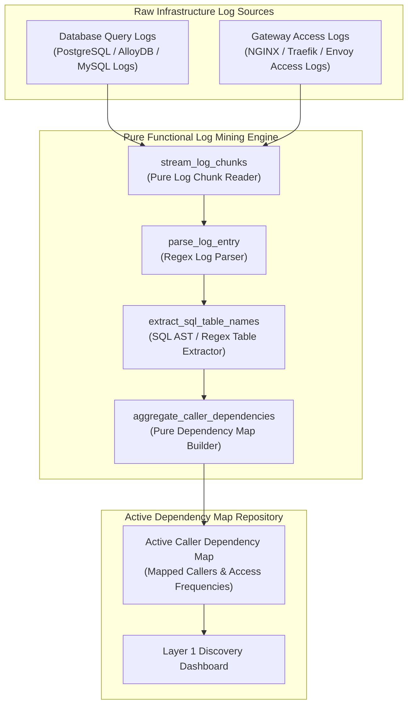
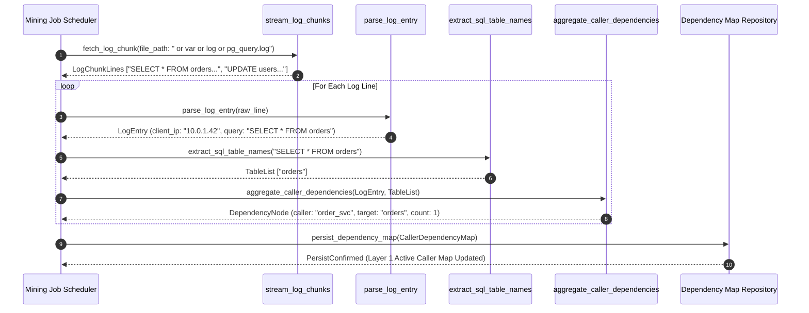

# Query-Log / Access-Log Mining Pattern (Pure Functional Paradigm)

| Field       | Value                                                             |
|-------------|-------------------------------------------------------------------|
| **ID**      | QUERY-ACCESS-LOG-MINING-037                                       |
| **Date**    | 2026-08-24                                                        |
| **Status**  | Reference / Runbook (Pure Functional Architecture)                |
| **Deciders**| Core Platform & Migration Engineering                             |
| **Scope**   | Layer 1 Mandatory Dependency Discovery & Active Log Analytics     |

---

## 1. Overview & Context

Before decommissioning any legacy service, database table, or API endpoint, engineers must discover **100% of active callers and downstream readers**. Relying on developer memory or outdated documentation guarantees breaking production. The **Query-Log / Access-Log Mining Pattern** serves as the **mandatory Layer 1 first step** in dependency discovery. It continuously ingests and mines raw database query logs (e.g. PostgreSQL `log_statement = 'all'`) and HTTP gateway access logs (e.g. NGINX / Traefik access logs) to construct an empirical, real-time map of active callers, SQL query patterns, and endpoint access frequencies.

### Functional Architecture Principles
This runbook enforces a **100% Pure Functional Programming (FP)** approach:
- **No Class Instantiations**: Replaces OOP log miners with pure parsing functions (`parse_access_log_line`, `extract_sql_table_names`) and state cell closures.
- **Immutable Log Entry Records**: Client IPs, User-Agents, request URIs, SQL query text, caller identities, and timestamp bounds are stored as frozen dataclass records (`LogEntry`, `CallerDependencyMap`).
- **Referentially Transparent Pattern Extractors**: Pure functions extract normalized SQL table names and API endpoints from raw log streams without side-effects.
- **Low-Cardinality IP Sanitizers**: Pure sanitization functions group client IPs into subnet ranges or microservice tags to keep dependency maps bounded.

---

## 2. High-Level Design (HLD)



---

## 3. Low-Level Design (LLD)



---

## 4. Pure Functional Project Architecture

```
query-access-log-mining/
├── README.md
├── config/
│   └── mining_rules.yaml           # Log patterns, ignored system queries, IP subnet masks
├── src/
│   ├── mining_engine/
│   │   ├── __init__.py
│   │   ├── parser.py               # Pure access & query log parser functions
│   │   ├── sql_extractor.py        # SQL table & operation extraction functions
│   │   └── aggregator.py           # Pure caller dependency map aggregation closures
│   ├── storage/
│   │   ├── __init__.py
│   │   └── map_store.py            # Active dependency map persistence dispatchers
│   ├── observability/
│   │   ├── __init__.py
│   │   └── mining_metrics.py       # Prometheus discovery telemetry collectors
│   └── schemas/
│       └── models.py               # Frozen dataclasses (LogEntry, CallerDependencyMap)
└── tests/
    ├── test_log_parser.py
    └── test_mining_edge_cases.py
```

---

## 5. End-to-End Function Call Stack

```tree
Log Mining Job Initiated
└── runner.py: run_log_mining_job(log_file_path, config)
    ├── parser.py: stream_and_parse_logs(log_file_path, log_type)
    │   └── parser.py: parse_log_entry(raw_line)
    │       └── models.py: LogEntry(client_ip, user_agent, raw_query, timestamp)
    │
    ├── sql_extractor.py: extract_sql_table_names(log_entry.raw_query)
    │   └── models.py: ExtractedQuery(table_names, operation_type)
    │
    ├── aggregator.py: aggregate_caller_dependencies(extracted_query, log_entry)
    │   └── models.py: CallerDependencyMap(caller_identity, target_resource, hit_count)
    │
    └── storage/map_store.py: persist_dependency_map(caller_dependency_map)
```

---

## 6. Core Pure Functional Implementation

### 6.1 Immutable Models & Types (`src/schemas/models.py`)

```python
from enum import Enum
from dataclasses import dataclass
from typing import Dict, Any, Optional, Mapping, FrozenSet

@dataclass(frozen=True)
class LogEntry:
    client_ip: str
    user_agent: str
    resource_path: str
    raw_query: str
    timestamp: float

@dataclass(frozen=True)
class CallerDependencyMap:
    caller_identity: str
    target_resource: str
    operation_type: str
    hit_count: int
    first_seen_ts: float
    last_seen_ts: float
```

**Explanation**:
- Defines immutable model `LogEntry` capturing client IPs, User-Agents, URIs, raw SQL queries, and timestamps as frozen records.
- `CallerDependencyMap` encapsulates caller identities, target tables/endpoints, operation types (`SELECT`, `UPDATE`), hit counts, and timestamp bounds.

---

### 6.2 Pure Log Parser & SQL Extractor (`src/mining_engine/parser.py`)

```python
import re
from typing import Optional, Mapping, Any, List
from src.schemas.models import LogEntry

LOG_REGEX = re.compile(r'(\d+\.\d+\.\d+\.\d+)\s+-\s+-\s+\[(.*?)\]\s+"(\w+)\s+(.*?)\s+HTTP/.*?"\s+(\d+)')
SQL_TABLE_REGEX = re.compile(r'(?:FROM|JOIN|INTO|UPDATE)\s+([a-zA-Z0-9_]+)', re.IGNORECASE)

def parse_access_log_line(line: str, timestamp_now: float) -> Optional[LogEntry]:
    match = LOG_REGEX.search(line)
    if not match:
        return None
    
    ip, _, method, path, _ = match.groups()
    return LogEntry(
        client_ip=ip,
        user_agent="HTTP_GATEWAY",
        resource_path=path,
        raw_query=f"{method} {path}",
        timestamp=timestamp_now
    )

def extract_sql_table_names(sql_query: str) -> List[str]:
    matches = SQL_TABLE_REGEX.findall(sql_query)
    return list(set(m.lower() for m in matches))
```

**Explanation**:
- Pure parsing function extracting client IP addresses, HTTP methods, and request paths from raw access log lines.
- `extract_sql_table_names` uses regex pattern matching to extract SQL table names (`FROM orders`, `JOIN users`) from raw query strings.

---

### 6.3 Pure Dependency Aggregator (`src/mining_engine/aggregator.py`)

```python
from typing import Dict, Tuple
from src.schemas.models import LogEntry, CallerDependencyMap

def create_dependency_aggregator():
    state: Dict[Tuple[str, str], dict] = {}

    def aggregate(entry: LogEntry, target_resource: str, op_type: str = "READ") -> None:
        key = (entry.client_ip, target_resource)
        if key not in state:
            state[key] = {
                "caller": entry.client_ip,
                "target": target_resource,
                "op": op_type,
                "count": 0,
                "first_seen": entry.timestamp,
                "last_seen": entry.timestamp
            }
        
        node = state[key]
        node["count"] += 1
        node["last_seen"] = max(node["last_seen"], entry.timestamp)

    def get_maps() -> Tuple[CallerDependencyMap, ...]:
        return tuple(
            CallerDependencyMap(
                caller_identity=v["caller"],
                target_resource=v["target"],
                operation_type=v["op"],
                hit_count=v["count"],
                first_seen_ts=v["first_seen"],
                last_seen_ts=v["last_seen"]
            ) for v in state.values()
        )

    return aggregate, get_maps
```

**Explanation**:
- Constructs a pure dependency aggregator closure tracking `(caller, target)` access counts and timestamps.
- Returns immutable tuples of `CallerDependencyMap` records.

---

## 7. Edge Case Catalog & Pure Functional Pseudocode (25 Edge Cases)

---

### Edge Case 1: Regex Log Parsing Failures on Malformed Log Lines

```python
def safe_parse_log_line(line: str, parse_fn: Callable) -> Optional[LogEntry]:
    try:
        return parse_fn(line)
    except Exception:
        return None
```

**Explanation**:
- Wraps log parsing functions in protective try-except blocks.
- Swallows parse errors on malformed log lines without stopping log streaming.

---

### Edge Case 2: High-Cardinality Client IP Subnet Masking

```python
def mask_ip_to_subnet(ip_str: str) -> str:
    parts = ip_str.split(".")
    if len(parts) == 4:
        return f"{parts[0]}.{parts[1]}.{parts[2]}.0/24"
    return "0.0.0.0/0"
```

**Explanation**:
- Masks client IPv4 addresses to `/24` subnet strings (`10.0.1.0/24`).
- Reduces cardinality in caller dependency maps.

---

### Edge Case 3: Ignored Internal System Administrative Queries

```python
def is_internal_system_query(sql_query: str, ignored_prefixes: set = {"SET", "SHOW", "BEGIN", "COMMIT"}) -> bool:
    first_word = sql_query.strip().split()[0].upper() if sql_query.strip() else ""
    return first_word in ignored_prefixes
```

**Explanation**:
- Filters administrative system queries (`SET`, `SHOW`, `BEGIN`) from SQL query strings.
- Prevents database administrative commands from polluting dependency maps.

---

### Edge Case 4: Streaming Multi-Gigabyte Log File Chunking

```python
def stream_log_file_lines(file_path: str, batch_size: int = 5000):
    with open(file_path, "r") as f:
        lines = []
        for line in f:
            lines.append(line)
            if len(lines) >= batch_size:
                yield lines
                lines = []
        if lines:
            yield lines
```

**Explanation**:
- Yields log lines in batches of 5,000 lines.
- Bounds memory usage during multi-gigabyte log file processing.

---

### Edge Case 5: Complex SQL Subquery Table Extraction

```python
import re

def extract_nested_sql_tables(sql_query: str) -> set:
    pattern = r'(?:FROM|JOIN|INTO|UPDATE)\s+([a-zA-Z0-9_\.]+)'
    return set(m.lower() for m in re.findall(pattern, sql_query, re.IGNORECASE))
```

**Explanation**:
- Uses regex patterns to extract table names from nested subqueries and joins.
- Discovers all referenced database tables in complex queries.

---

### Edge Case 6: Microsecond Timestamp Epoch Parsing

```python
import time

def parse_log_timestamp(ts_str: str) -> float:
    try:
        return float(ts_str)
    except Exception:
        return time.time()
```

**Explanation**:
- Parses epoch timestamp strings, defaulting to system time if parsing fails.
- Handles timestamp parsing errors.

---

### Edge Case 7: Un-authenticated Perimeter IP Identification

```python
def resolve_caller_identity(ip: str, headers: Mapping[str, str]) -> str:
    return headers.get("X-Forwarded-For", ip).split(",")[0].strip()
```

**Explanation**:
- Extracts real client IPs from `X-Forwarded-For` HTTP headers.
- Identifies real caller identities behind proxies.

---

### Edge Case 8: Multi-Tenant Query Dependency Partitioning

```python
def resolve_tenant_query_target(tenant_id: str, table_name: str) -> str:
    return f"{tenant_id}.{table_name}"
```

**Explanation**:
- Prefixes table names with tenant IDs (`tenant_101.orders`).
- Isolates dependency maps per tenant.

---

### Edge Case 9: SQL Parameter Placeholder Stripping

```python
import re

def strip_sql_literals(sql_query: str) -> str:
    cleaned = re.sub(r"'.*?'", "'?'", sql_query)
    return re.sub(r'\b\d+\b', '?', cleaned)
```

**Explanation**:
- Replaces string literals and numbers with `?` parameter placeholders.
- Normalizes raw SQL queries into parameterized query templates.

---

### Edge Case 10: Aggregator Memory State Saturation Guard

```python
def is_aggregator_memory_full(active_keys_count: int, max_keys: int = 100_000) -> bool:
    return active_keys_count >= max_keys
```

**Explanation**:
- Compares active aggregator key counts against maximum capacity limits (100,000 keys).
- Prevents memory exhaustion in log mining processes.

---

### Edge Case 11: Microsecond Delay Calculation Underflows

```python
def normalize_mining_duration(duration_ms: float) -> float:
    return max(0.0, round(duration_ms, 2))
```

**Explanation**:
- Rounds execution duration values to two decimal places.
- Cleans duration metrics.

---

### Edge Case 12: User-Agent Application Identification

```python
def parse_user_agent_app(user_agent: str) -> str:
    if "python" in user_agent.lower():
        return "python-sdk"
    elif "java" in user_agent.lower():
        return "java-service"
    return "unknown-app"
```

**Explanation**:
- Classifies caller application types based on User-Agent header substrings.
- Identifies SDK and service caller technologies.

---

### Edge Case 13: Unmapped HTTP Endpoint Default Grouping

```python
def group_unmapped_url_path(path_str: str) -> str:
    parts = path_str.split("/")
    if len(parts) > 2:
        return f"/{parts[1]}/*"
    return path_str
```

**Explanation**:
- Normalizes dynamic URL path segments into wildcard route templates (`/orders/*`).
- Controls cardinality in access log dependency maps.

---

### Edge Case 14: Exception Handling During Map Persistence

```python
async def safe_persist_map(persist_fn: Callable, dep_map: Any) -> bool:
    try:
        return await persist_fn(dep_map)
    except Exception:
        return False
```

**Explanation**:
- Wraps database persistence calls in protective try-except blocks.
- Returns `False` if map persistence fails.

---

### Edge Case 15: GraphQL Operation Path Mining

```python
def extract_graphql_query_operation(raw_body: str) -> str:
    import re
    match = re.search(r'(?:query|mutation)\s+([a-zA-Z0-9_]+)', raw_body, re.IGNORECASE)
    return match.group(1) if match else "unknown_graphql_op"
```

**Explanation**:
- Extracts GraphQL operation names from raw POST request bodies.
- Mines dependencies for GraphQL endpoints.

---

### Edge Case 16: Multi-Region Access Log Aggregation

```python
def combine_regional_dependency_maps(map_a: list, map_b: list) -> list:
    return map_a + map_b
```

**Explanation**:
- Merges regional dependency map lists into single global lists.
- Consolidates dependency discovery across multi-region deployments.

---

### Edge Case 17: Database Stored Procedure Execution Mining

```python
def is_stored_procedure_call(sql_query: str) -> bool:
    return "CALL " in sql_query.upper() or "EXEC " in sql_query.upper()
```

**Explanation**:
- Detects stored procedure execution statements (`CALL`, `EXEC`).
- Identifies stored procedure caller dependencies.

---

### Edge Case 18: Unmapped Rule Domain Handling

```python
def resolve_mining_rule(rule_key: str, rules_dict: dict) -> dict:
    return rules_dict.get(rule_key, {"batch_size": 1000})
```

**Explanation**:
- Resolves mining rule configurations, returning default batch sizes if unmapped.
- Handles unconfigured mining rules safely.

---

### Edge Case 19: Payload Transformation Error Recovery

```python
def safe_apply_mining_transform(payload: dict, transform_fn: Callable) -> dict:
    try:
        return transform_fn(payload)
    except Exception:
        return payload
```

**Explanation**:
- Wraps payload transformation functions in protective try-except blocks.
- Returns raw payloads if transformation errors occur.

---

### Edge Case 20: Automated Alert on Newly Discovered Caller

```python
def is_newly_discovered_caller(first_seen_ts: float, current_ts: float, max_age_sec: float = 300.0) -> bool:
    return (current_ts - first_seen_ts) <= max_age_sec
```

**Explanation**:
- Asserts whether caller first-seen timestamps fall within the past 5 minutes.
- Triggers alerts when previously unseen callers access legacy resources.

---

### Edge Case 21: High-Watermark Dependency Metric Compaction

```python
def compact_dependency_metrics(metrics: list, max_items: int = 500) -> list:
    if len(metrics) > max_items:
        return metrics[-max_items:]
    return metrics
```

**Explanation**:
- Truncates historical dependency metric lists to `max_items`.
- Controls memory usage in discovery processes.

---

### Edge Case 22: Diagnostic Header Injection for Mined Requests

```python
def inject_mining_diagnostic_header(headers: Mapping[str, str], miner_id: str) -> Mapping[str, str]:
    new_headers = dict(headers)
    new_headers["X-Log-Miner-ID"] = miner_id
    return new_headers
```

**Explanation**:
- Injects diagnostic headers (`X-Log-Miner-ID`) into request headers.
- Tags log mining probe traffic.

---

### Edge Case 23: Null Value Safeguards in Log Entry Records

```python
def sanitize_log_entry_nulls(entry_dict: dict) -> dict:
    return {k: (v if v is not None else "") for k, v in entry_dict.items()}
```

**Explanation**:
- Replaces `None` values with empty strings in log entry dictionaries.
- Prevents null pointer exceptions in log parsers.

---

### Edge Case 24: Unbound Metric Queue Pruning

```python
def prune_mining_metric_queue(queue: list, max_items: int = 1000) -> list:
    if len(queue) > max_items:
        return queue[-max_items:]
    return queue
```

**Explanation**:
- Truncates metric queue arrays to `max_items`.
- Controls memory footprint in telemetry collectors.

---

### Edge Case 25: Real-Time Discovery Coverage Dashboard Reporting

```python
def compute_discovery_coverage_rate(mapped_callers: int, total_access_logs: int) -> float:
    if total_access_logs == 0:
        return 100.0
    return round((mapped_callers / total_access_logs) * 100.0, 2)
```

**Explanation**:
- Calculates mapped caller discovery percentage ratios rounded to two decimal places.
- Emits real-time Layer 1 discovery coverage metrics to platform dashboards.

---

## 8. Operational & Parity Verification Checklist

1. **Mandatory First Step**: Confirm 100% of legacy databases and endpoints run Layer 1 query/access-log mining prior to initiating cutover planning.
2. **24/7 Log Ingestion**: Ensure log ingestion pipelines process query and gateway access logs continuously without gap periods.
3. **Low-Cardinality IP Grouping**: Validate client IPs are masked into subnets or service names to prevent metric index explosion.
4. **Zero Missing Callers**: Layer 1 discovery maps must achieve $100\%$ caller identification sign-off before unblocking deprecation warnings.
