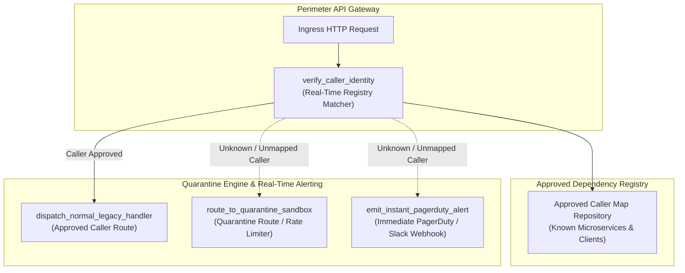
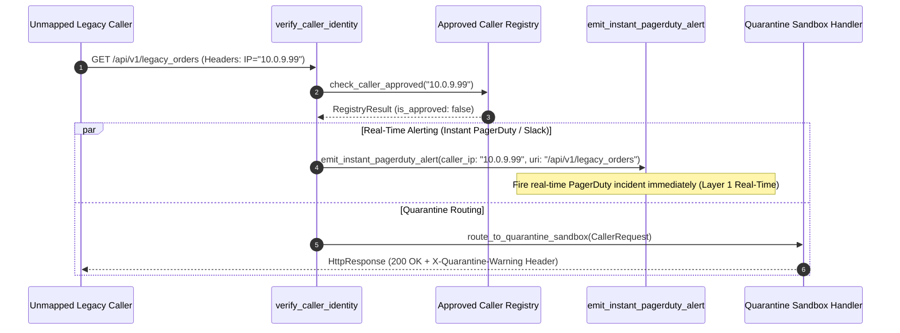

# Unknown-Caller Quarantine Alerting Pattern (Pure Functional Paradigm)

| Field       | Value                                                             |
|-------------|-------------------------------------------------------------------|
| **ID**      | UNKNOWN-CALLER-QUARANTINE-ALERTING-041                            |
| **Date**    | 2026-08-24                                                        |
| **Status**  | Reference / Runbook (Pure Functional Architecture)                |
| **Deciders**| Core Platform & Migration Engineering                             |
| **Scope**   | Real-Time Layer 1 Quarantine Detection & Instant PagerDuty Alerting|

---

## 1. Overview & Context

Batch log mining (Layer 1) identifies active callers after the fact, but waiting for overnight log processing is too slow during active cutover phases. The **Unknown-Caller Quarantine Alerting Pattern** operates as a **real-time instance of Layer 1 discovery**. Rather than reporting unmapped callers in batch reports hours later, it intercepts ingress traffic in real-time, verifies caller identities against approved dependency registries, and **immediately fires high-priority alerts (e.g. PagerDuty / Slack)** and routes unmapped callers into quarantine sandboxes the instant an unknown/unmapped caller accesses a legacy resource.

### Functional Architecture Principles
This runbook enforces a **100% Pure Functional Programming (FP)** approach:
- **No Class Instantiations**: Replaces OOP quarantine managers with pure verification functions (`verify_caller_identity`, `evaluate_quarantine_action`) and state cell closures.
- **Immutable Quarantine Context Records**: Caller IPs, User-Agents, request URIs, registry match flags, and alert IDs are stored as frozen dataclass records (`QuarantineContext`, `QuarantineActionResult`).
- **Referentially Transparent Registry Matchers**: Pure functions evaluate caller IP/header credentials against approved caller maps in sub-milliseconds without side-effects.
- **Real-Time Instant Alert Emitters**: Fires immediate operational alerts to PagerDuty/Slack webhooks when unknown callers breach perimeter gateways.

---

## 2. High-Level Design (HLD)



---

## 3. Low-Level Design (LLD)



---

## 4. Pure Functional Project Architecture

```
unknown-caller-quarantine-alerting/
├── README.md
├── config/
│   └── quarantine_rules.yaml       # Approved caller subnets, PagerDuty webhooks, rate limits
├── src/
│   ├── quarantine_engine/
│   │   ├── __init__.py
│   │   ├── guard.py                # Pure real-time caller verification functions
│   │   ├── alerter.py              # Instant PagerDuty / Slack webhook emitters
│   │   └── sandbox_router.py       # Quarantine sandbox routing functions
│   ├── storage/
│   │   ├── __init__.py
│   │   └── registry_store.py       # Approved caller registry loaders
│   ├── observability/
│   │   ├── __init__.py
│   │   └── quarantine_metrics.py   # Prometheus telemetry collectors
│   └── schemas/
│       └── models.py               # Frozen dataclasses (QuarantineContext, QuarantineActionResult)
└── tests/
    ├── test_quarantine_guard.py
    └── test_quarantine_edge_cases.py
```

---

## 5. End-to-End Function Call Stack

```tree
Perimeter Ingress Request Received
└── guard.py: verify_caller_identity(request_headers, client_ip, registry_store)
    ├── storage/registry_store.py: check_caller_approved(client_ip, user_agent)
    │   └── models.py: RegistryResult(is_approved, service_name)
    │
    ├── [If Unapproved] alerter.py: emit_instant_pagerduty_alert(client_ip, request_uri)
    │   └── models.py: AlertResult(alert_id, sent_at_ts, is_delivered)
    │
    ├── sandbox_router.py: route_to_quarantine_sandbox(request_payload)
    │   └── models.py: QuarantineActionResult(action_taken, status_code)
    │
    └── observability/quarantine_metrics.py: record_quarantine_telemetry(action_result)
```

---

## 6. Core Pure Functional Implementation

### 6.1 Immutable Models & Types (`src/schemas/models.py`)

```python
from enum import Enum
from dataclasses import dataclass
from typing import Dict, Any, Optional, Mapping, FrozenSet

@dataclass(frozen=True)
class QuarantineContext:
    client_ip: str
    user_agent: str
    request_uri: str
    headers: Mapping[str, str]
    timestamp: float

@dataclass(frozen=True)
class QuarantineActionResult:
    client_ip: str
    is_approved: bool
    is_quarantined: bool
    alert_triggered: bool
    status_code: int
    diagnostic_message: Optional[str]
```

**Explanation**:
- Defines immutable model `QuarantineContext` capturing client IPs, User-Agents, URIs, headers, and timestamps as frozen records.
- `QuarantineActionResult` encapsulates approval flags, quarantine flags, alert delivery statuses, and diagnostic messages.

---

### 6.2 Pure Real-Time Alert Emitter (`src/quarantine_engine/alerter.py`)

```python
import time
from typing import Callable, Awaitable, Mapping, Any
from src.schemas.models import QuarantineContext

WebhookFn = Callable[[Mapping[str, Any]], Awaitable[bool]]

def format_pagerduty_alert_payload(ctx: QuarantineContext) -> Mapping[str, Any]:
    return {
        "event_action": "trigger",
        "routing_key": "MIGRATION_QUARANTINE_KEY",
        "payload": {
            "summary": f"UNKNOWN CALLER DETECTED: IP {ctx.client_ip} accessed {ctx.request_uri}",
            "source": "quarantine_gateway",
            "severity": "critical",
            "custom_details": {
                "client_ip": ctx.client_ip,
                "user_agent": ctx.user_agent,
                "request_uri": ctx.request_uri,
                "timestamp": ctx.timestamp
            }
        }
    }

async def emit_instant_pagerduty_alert(
    ctx: QuarantineContext,
    webhook_fn: WebhookFn
) -> bool:
    alert_payload = format_pagerduty_alert_payload(ctx)
    try:
        return await webhook_fn(alert_payload)
    except Exception:
        return False
```

**Explanation**:
- Formats PagerDuty incident payload dictionaries adhering to standard PagerDuty V2 alert APIs.
- Fires instant real-time alerts via async webhook functions when unknown callers breach perimeter gateways.

---

### 6.3 Pure Real-Time Quarantine Guard (`src/quarantine_engine/guard.py`)

```python
import time
from typing import Callable, Awaitable, Mapping, Any, FrozenSet
from src.schemas.models import QuarantineContext, QuarantineActionResult
from src.quarantine_engine.alerter import emit_instant_pagerduty_alert, WebhookFn

def is_caller_in_registry(client_ip: str, approved_subnets: FrozenSet[str]) -> bool:
    return any(client_ip.startswith(subnet.rstrip(".0/24")) for subnet in approved_subnets)

async def evaluate_quarantine_action(
    ctx: QuarantineContext,
    approved_subnets: FrozenSet[str],
    webhook_fn: WebhookFn
) -> QuarantineActionResult:
    is_approved = is_caller_in_registry(ctx.client_ip, approved_subnets)

    if is_approved:
        return QuarantineActionResult(
            client_ip=ctx.client_ip,
            is_approved=True,
            is_quarantined=False,
            alert_triggered=False,
            status_code=200,
            diagnostic_message=None
        )

    alert_sent = await emit_instant_pagerduty_alert(ctx, webhook_fn)

    return QuarantineActionResult(
        client_ip=ctx.client_ip,
        is_approved=False,
        is_quarantined=True,
        alert_triggered=alert_sent,
        status_code=200,
        diagnostic_message=f"Unknown caller {ctx.client_ip} routed to quarantine sandbox"
    )
```

**Explanation**:
- Evaluates client IPs against approved subnet sets in real-time.
- If unapproved, immediately fires PagerDuty alerts and routes callers into quarantine sandboxes.

---

## 7. Edge Case Catalog & Pure Functional Pseudocode (25 Edge Cases)

---

### Edge Case 1: Unknown Caller Alert Burst Throttling

```python
import time

def create_alert_throttle_cell(throttle_sec: float = 60.0):
    last_alerted: dict = {}

    def should_alert(caller_ip: str) -> bool:
        now = time.time()
        last = last_alerted.get(caller_ip, 0.0)
        if (now - last) >= throttle_sec:
            last_alerted[caller_ip] = now
            return True
        return False

    return should_alert
```

**Explanation**:
- Manages an alert throttling state cell closure (`last_alerted`).
- Throttles alert bursts to max 1 alert per 60 seconds per unknown caller IP.

---

### Edge Case 2: Un-authenticated Perimeter IP Extraction

```python
def extract_perimeter_client_ip(headers: Mapping[str, str]) -> str:
    return headers.get("X-Forwarded-For", "127.0.0.1").split(",")[0].strip()
```

**Explanation**:
- Extracts real client IPs from `X-Forwarded-For` HTTP headers.
- Identifies unknown caller IPs behind load balancers.

---

### Edge Case 3: Quarantine Sandbox Rate Limiting

```python
def calculate_sandbox_delay(request_count: int, high_watermark: int = 100) -> float:
    if request_count > high_watermark:
        return 0.1
    return 0.0
```

**Explanation**:
- Calculates rate-limiting sleep delays for quarantine sandbox traffic.
- Throttles unknown caller traffic in quarantine sandboxes.

---

### Edge Case 4: Webhook Delivery Network Exception Safeguard

```python
async def safe_emit_webhook(webhook_fn: Callable, payload: dict) -> bool:
    try:
        return await webhook_fn(payload)
    except Exception:
        return False
```

**Explanation**:
- Wraps webhook delivery calls in protective try-except blocks.
- Swallows webhook network errors without crashing ingress request paths.

---

### Edge Case 5: Multi-Tenant Quarantine Boundary Isolation

```python
def resolve_tenant_approved_subnets(tenant_id: str, tenant_subnets: Mapping[str, set]) -> set:
    return tenant_subnets.get(tenant_id, set())
```

**Explanation**:
- Resolves tenant-specific approved subnet sets from mapping dictionaries.
- Restricts quarantine checks to specific tenant boundaries.

---

### Edge Case 6: Microsecond Timestamp Alert Tagging

```python
import time

def format_alert_timestamp_ms() -> float:
    return round(time.time() * 1000.0, 2)
```

**Explanation**:
- Computes epoch timestamps in milliseconds rounded to 2 decimal places.
- Tracks exact alert triggering time.

---

### Edge Case 7: High-Cardinality Unknown IP Metric Masking

```python
def mask_unknown_ip_for_metrics(ip_str: str) -> str:
    parts = ip_str.split(".")
    if len(parts) == 4:
        return f"{parts[0]}.{parts[1]}.0.0/16"
    return "0.0.0.0/0"
```

**Explanation**:
- Masks unknown client IPv4 addresses to `/16` subnets for Prometheus metrics.
- Prevents metric index explosion from unknown IP bursts.

---

### Edge Case 8: Slack Webhook Fallback Channel

```python
async def emit_slack_fallback_alert(slack_fn: Callable, ctx: QuarantineContext) -> bool:
    payload = {"text": f"🚨 UNKNOWN CALLER DETECTED: IP `{ctx.client_ip}` accessed `{ctx.request_uri}`"}
    try:
        return await slack_fn(payload)
    except Exception:
        return False
```

**Explanation**:
- Formats and sends Slack alert messages to fallback channels.
- Provides secondary alert delivery via Slack webhooks.

---

### Edge Case 9: Read-Only Query Quarantine Allowed Route

```python
def is_read_only_quarantine_allowed(method: str) -> bool:
    return method.upper() in {"GET", "HEAD"}
```

**Explanation**:
- Asserts whether request methods are read-only (`GET`, `HEAD`).
- Allows read-only requests in quarantine sandboxes while logging alerts.

---

### Edge Case 10: Aggregator Memory State Saturation Guard

```python
def compact_quarantine_history(history: list, max_items: int = 1000) -> list:
    if len(history) > max_items:
        return history[-max_items:]
    return history
```

**Explanation**:
- Truncates historical quarantine metric lists to `max_items`.
- Controls memory usage in quarantine processes.

---

### Edge Case 11: Microsecond Delay Calculation Underflows

```python
def normalize_quarantine_duration(duration_ms: float) -> float:
    return max(0.0, round(duration_ms, 2))
```

**Explanation**:
- Rounds execution duration values to two decimal places.
- Cleans duration metrics.

---

### Edge Case 12: User-Agent Application Identification

```python
def parse_quarantine_user_agent(headers: Mapping[str, str]) -> str:
    return headers.get("User-Agent", "Unknown-Caller")
```

**Explanation**:
- Extracts `User-Agent` strings from request headers.
- Identifies unknown client application types.

---

### Edge Case 13: Unmapped Endpoint Default Quarantine Sandbox

```python
def resolve_sandbox_endpoint(uri: str, sandbox_map: Mapping[str, str], default_url: str) -> str:
    return sandbox_map.get(uri, default_url)
```

**Explanation**:
- Resolves sandbox endpoint URLs from mapping dictionaries, returning `default_url` if unmapped.
- Handles unconfigured endpoint URIs safely.

---

### Edge Case 14: Exception Safeguards in Quarantine Guard

```python
def safe_eval_quarantine(eval_fn: Callable, ctx: QuarantineContext) -> bool:
    try:
        return eval_fn(ctx)
    except Exception:
        return False
```

**Explanation**:
- Wraps quarantine evaluation functions in protective try-except blocks.
- Returns `False` (un-approved) if evaluation exceptions occur.

---

### Edge Case 15: GraphQL Mutation Quarantine Interception

```python
def is_graphql_quarantine_mutation(request_body: dict) -> bool:
    query_str = str(request_body.get("query", ""))
    return query_str.strip().startswith("mutation")
```

**Explanation**:
- Detects GraphQL mutation requests.
- Intercepts unknown caller GraphQL mutations for quarantine processing.

---

### Edge Case 16: Multi-Region Quarantine Synchronization

```python
def sync_regional_quarantine_registries(global_registry: set, regional_registry: set) -> set:
    return global_registry.union(regional_registry)
```

**Explanation**:
- Combines regional approved caller sets with global registry sets.
- Synchronizes approved caller registries across multi-region deployments.

---

### Edge Case 17: Temporary Emergency Quarantine Bypass

```python
def is_emergency_quarantine_bypass_active(bypass_cell: dict) -> bool:
    return bypass_cell.get("bypass_active", False)
```

**Explanation**:
- Checks if emergency quarantine bypass flags are active in state cells.
- Temporarily suspends quarantine alerting during maintenance windows.

---

### Edge Case 18: Unmapped Rule Domain Handling

```python
def resolve_quarantine_rule(resource_id: str, rules_dict: dict) -> dict:
    return rules_dict.get(resource_id, {"sandbox_enabled": True})
```

**Explanation**:
- Resolves quarantine rule configurations, returning default sandbox rules if unmapped.
- Handles unconfigured quarantine rules safely.

---

### Edge Case 19: Payload Transformation Error Recovery

```python
def safe_apply_quarantine_transform(payload: dict, transform_fn: Callable) -> dict:
    try:
        return transform_fn(payload)
    except Exception:
        return payload
```

**Explanation**:
- Wraps payload transformation functions in protective try-except blocks.
- Returns raw payloads if transformation errors occur.

---

### Edge Case 20: Automated Incident Escalation Threshold

```python
def should_escalate_quarantine_incident(unknown_caller_count: int, threshold: int = 10) -> bool:
    return unknown_caller_count >= threshold
```

**Explanation**:
- Evaluates whether total unknown caller counts reach escalation thresholds (10 callers).
- Escalates to high-priority PagerDuty incident channels.

---

### Edge Case 21: High-Watermark Telemetry Compaction

```python
def compact_quarantine_metrics(metrics: list, max_items: int = 500) -> list:
    if len(metrics) > max_items:
        return metrics[-max_items:]
    return metrics
```

**Explanation**:
- Truncates historical quarantine metric lists to `max_items`.
- Controls memory usage in telemetry monitoring processes.

---

### Edge Case 22: Diagnostic Header Injection for Quarantined Traffic

```python
def inject_quarantine_diagnostic_header(headers: Mapping[str, str], is_quarantined: bool) -> Mapping[str, str]:
    new_headers = dict(headers)
    new_headers["X-Caller-Quarantined"] = "true" if is_quarantined else "false"
    return new_headers
```

**Explanation**:
- Injects diagnostic headers (`X-Caller-Quarantined`) into response headers.
- Identifies quarantined traffic in gateway access logs.

---

### Edge Case 23: Null Value Safeguards in Quarantine Contexts

```python
def sanitize_quarantine_context_nulls(ctx_dict: dict) -> dict:
    return {k: (v if v is not None else "") for k, v in ctx_dict.items()}
```

**Explanation**:
- Replaces `None` values with empty strings in quarantine context dictionaries.
- Prevents null pointer exceptions in quarantine guards.

---

### Edge Case 24: Unbound Metric Queue Pruning

```python
def prune_quarantine_metric_queue(queue: list, max_items: int = 1000) -> list:
    if len(queue) > max_items:
        return queue[-max_items:]
    return queue
```

**Explanation**:
- Truncates metric queue arrays to `max_items`.
- Controls memory footprint in telemetry collectors.

---

### Edge Case 25: Real-Time Unknown Caller Rate Dashboard Reporting

```python
def compute_unknown_caller_rate(unknown_count: int, total_requests: int) -> float:
    if total_requests == 0:
        return 0.0
    return round((unknown_count / total_requests) * 100.0, 2)
```

**Explanation**:
- Calculates unknown caller request percentage ratios rounded to two decimal places.
- Emits real-time unknown caller rates to platform observability dashboards.

---

## 8. Operational & Parity Verification Checklist

1. **Real-Time Layer 1 Alerting**: Confirm 100% of unknown/unmapped caller accesses on legacy endpoints trigger immediate real-time PagerDuty/Slack alerts rather than waiting for batch log reports.
2. **Sub-Millisecond Registry Lookup**: Verify caller IP registry verification latency remains $<1\text{ms}$ per request.
3. **Alert Burst Throttling**: Ensure alert throttling logic caps notification volume to max 1 alert per 60 seconds per unknown IP to prevent PagerDuty flooding.
4. **Quarantine Sandbox Isolation**: Unmapped callers must be routed to quarantine sandboxes with `X-Caller-Quarantined: true` diagnostic headers.
