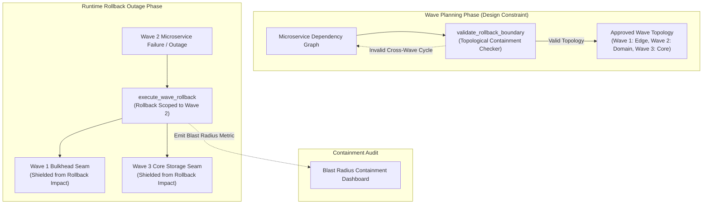

# Blast-Radius-Scoped Rollback Boundary Pattern (Pure Functional Paradigm)

| Field       | Value                                                             |
|-------------|-------------------------------------------------------------------|
| **ID**      | BLAST-RADIUS-ROLLBACK-BOUNDARY-035                                |
| **Date**    | 2026-08-24                                                        |
| **Status**  | Reference / Runbook (Pure Functional Architecture)                |
| **Deciders**| Core Platform & Migration Engineering                             |
| **Scope**   | Wave-Planning-Time Design Constraint & Failure Containment Bounds |

---

## 1. Overview & Context

Attempting to define rollback blast radius boundaries **during** a production outage is an anti-pattern: panic leads to sprawling, uncontrolled rollbacks that pull stable downstream services into failure cascades. The **Blast-Radius-Scoped Rollback Boundary Pattern** enforces failure containment as an **upfront, wave-planning-time architectural constraint**. By grouping microservices into strictly isolated bulkhead waves with formal API seams, any emergency rollback triggered in Wave $N$ is architecturally guaranteed to be contained within Wave $N$, preventing failure cascades into Wave $N+1$ or Wave $N-1$.

### Functional Architecture Principles
This runbook enforces a **100% Pure Functional Programming (FP)** approach:
- **No Class Instantiations**: Replaces OOP boundary managers with pure graph validation functions (`validate_rollback_boundary`, `assert_topological_containment`) and immutable rule matrices.
- **Immutable Boundary Context Records**: Wave levels, service nodes, allowed cross-wave dependencies, maximum failure blast radius percentages, and bulkhead caps are stored as frozen dataclass records (`BoundaryConfig`, `BoundaryValidationResult`).
- **Referentially Transparent Dependency Graph Checkers**: Pure functions evaluate graph topologies `(ServiceGraph, ProposedWave) -> BoundaryValidationResult` to detect forbidden cross-wave cycles before deployment.
- **Strict Bulkhead Boundary Enforcement**: Intercepts cross-wave execution and enforces isolation barriers to contain rollback blast radii.

---

## 2. High-Level Design (HLD)



---

## 3. Low-Level Design (LLD)

```mermaid
sequenceDiagram
    autonumber
    participant Planner as Wave Planning Orchestrator
    participant Validator as validate_rollback_boundary
    participant GraphChecker as assert_topological_containment
    participant Runtime as Runtime Rollback Executor
    participant Audit as Telemetry Emitter

    Planner->>Validator: validate_wave_plan(wave_id: 2, services: ["order", "payment"])
    
    Validator->>GraphChecker: assert_topological_containment(wave_id: 2, dependency_matrix)
    
    alt Boundary Contained (No Forbidden Reverse Cycles)
        GraphChecker-->>Validator: ContainmentResult (is_contained: true, max_blast_radius: "15%")
        Validator-->>Planner: PlanApproved (Wave 2 rollback boundary validated)
    else Boundary Breach (Forbidden Cross-Wave Dependency)
        GraphChecker-->>Validator: ContainmentResult (is_contained: false, illegal_edge: "Wave_2 -> Wave_1")
        Validator-->>Planner: PlanRejected (Fix topology; block wave deployment)
        Note over Planner: Reject wave plan; resolve cyclic dependency before deployment
    end

    Note over Runtime: Runtime Outage Scenario in Wave 2

    Runtime->>Runtime: execute_scoped_rollback(wave_id: 2)
    Runtime->>Audit: record_blast_radius_telemetry(contained_wave: 2, affected_services: 2)
    Note over Runtime: Rollback contained strictly within Wave 2; Wave 1 and Wave 3 remain unaffected
```

---

## 4. Pure Functional Project Architecture

```
blast-radius-rollback-boundary/
├── README.md
├── config/
│   └── boundary_rules.yaml         # Wave definitions, blast radius caps, allowed seams
├── src/
│   ├── boundary_engine/
│   │   ├── __init__.py
│   │   ├── validator.py            # Pure boundary validation functions
│   │   ├── graph_checker.py        # Topological dependency graph checkers
│   │   └── containment_guard.py    # Runtime rollback containment functions
│   ├── storage/
│   │   ├── __init__.py
│   │   └── topology_store.py       # Wave topology configuration loaders
│   ├── observability/
│   │   ├── __init__.py
│   │   └── boundary_metrics.py     # Prometheus telemetry collectors
│   └── schemas/
│       └── models.py               # Frozen dataclasses (BoundaryConfig, BoundaryValidationResult)
└── tests/
    ├── test_boundary_validator.py
    └── test_boundary_edge_cases.py
```

---

## 5. End-to-End Function Call Stack

```tree
Wave Deployment Plan Submitted
└── validator.py: validate_rollback_boundary(proposed_wave_config, global_graph)
    ├── graph_checker.py: assert_topological_containment(wave_id, dependency_matrix)
    │   └── models.py: ContainmentCheck(is_valid, violation_edge)
    │
    ├── containment_guard.py: calculate_blast_radius_percentage(wave_id, global_graph)
    │   └── models.py: BlastRadiusMetric(affected_service_ratio)
    │
    ├── validator.py: format_boundary_result(containment_check, blast_radius_metric)
    │   └── models.py: BoundaryValidationResult(is_approved, max_blast_radius)
    │
    └── observability/metrics.py: record_boundary_telemetry(boundary_validation_result)
```

---

## 6. Core Pure Functional Implementation

### 6.1 Immutable Models & Types (`src/schemas/models.py`)

```python
from enum import Enum
from dataclasses import dataclass
from typing import Dict, Any, Optional, Mapping, FrozenSet

@dataclass(frozen=True)
class BoundaryConfig:
    wave_id: int
    wave_name: str
    contained_services: FrozenSet[str]
    allowed_upstream_waves: FrozenSet[int]
    max_blast_radius_pct: float

@dataclass(frozen=True)
class BoundaryValidationResult:
    wave_id: int
    is_approved: bool
    calculated_blast_radius_pct: float
    violating_dependencies: FrozenSet[str]
    rejection_reason: Optional[str]
```

**Explanation**:
- Defines immutable model `BoundaryConfig` capturing wave IDs, contained service sets, allowed upstream waves, and max blast radius percentages as frozen records.
- `BoundaryValidationResult` encapsulates topological approval statuses, calculated blast radius metrics, and frozen sets of violating dependency edges.

---

### 6.2 Pure Topological Containment Checker (`src/boundary_engine/graph_checker.py`)

```python
from typing import Mapping, FrozenSet, Set
from src.schemas.models import BoundaryConfig

def assert_topological_containment(
    cfg: BoundaryConfig,
    service_wave_map: Mapping[str, int],
    dependency_graph: Mapping[str, FrozenSet[str]]
) -> Mapping[str, Any]:
    violating_edges = []

    for svc in cfg.contained_services:
        deps = dependency_graph.get(svc, frozenset())
        for dep in deps:
            dep_wave = service_wave_map.get(dep, 0)
            if dep_wave > cfg.wave_id and dep_wave not in cfg.allowed_upstream_waves:
                violating_edges.append(f"{svc}(Wave {cfg.wave_id}) -> {dep}(Wave {dep_wave})")

    return {
        "is_valid": len(violating_edges) == 0,
        "violating_edges": frozenset(violating_edges)
    }
```

**Explanation**:
- Pure function checking dependency edges for services within a proposed wave.
- Flags illegal dependency edges where lower-level wave services depend on higher-level wave services outside allowed upstream wave sets.

---

### 6.3 Boundary Validator (`src/boundary_engine/validator.py`)

```python
from typing import Mapping, FrozenSet
from src.schemas.models import BoundaryConfig, BoundaryValidationResult
from src.boundary_engine.graph_checker import assert_topological_containment

def validate_rollback_boundary(
    cfg: BoundaryConfig,
    service_wave_map: Mapping[str, int],
    dependency_graph: Mapping[str, FrozenSet[str]],
    total_system_services: int
) -> BoundaryValidationResult:
    containment = assert_topological_containment(cfg, service_wave_map, dependency_graph)
    
    blast_radius_pct = (len(cfg.contained_services) / max(1, total_system_services)) * 100.0
    
    exceeds_blast_radius = blast_radius_pct > cfg.max_blast_radius_pct
    is_valid_containment = containment["is_valid"]

    is_approved = is_valid_containment and not exceeds_blast_radius

    reason = None
    if not is_valid_containment:
        reason = f"Illegal cross-wave dependencies detected: {', '.join(containment['violating_edges'])}"
    elif exceeds_blast_radius:
        reason = f"Blast radius {blast_radius_pct:.1f}% exceeds max cap {cfg.max_blast_radius_pct:.1f}%"

    return BoundaryValidationResult(
        wave_id=cfg.wave_id,
        is_approved=is_approved,
        calculated_blast_radius_pct=round(blast_radius_pct, 2),
        violating_dependencies=containment["violating_edges"],
        rejection_reason=reason
    )
```

**Explanation**:
- Validates proposed wave deployment boundaries against topological containment rules and maximum blast radius caps.
- Returns immutable `BoundaryValidationResult` objects to block invalid wave plans during design time.

---

## 7. Edge Case Catalog & Pure Functional Pseudocode (25 Edge Cases)

---

### Edge Case 1: Illegal Reverse Cross-Wave Dependency Edge

```python
def is_reverse_wave_dependency(src_wave: int, target_wave: int) -> bool:
    return target_wave > src_wave
```

**Explanation**:
- Compares source and target service wave levels (`target_wave > src_wave`).
- Flags invalid reverse dependencies where lower-level wave services invoke higher-level wave services.

---

### Edge Case 2: Blast Radius Percentage Threshold Exceeded

```python
def is_blast_radius_exceeded(wave_service_count: int, total_services: int, max_pct: float = 20.0) -> bool:
    pct = (wave_service_count / max(1, total_services)) * 100.0
    return pct > max_pct
```

**Explanation**:
- Calculates the percentage of total system services contained within a single wave.
- Rejects wave plans that exceed maximum blast radius caps ($20\%$).

---

### Edge Case 3: Circular Multi-Wave Dependency Cycle

```python
def detect_wave_cycle(wave_a: int, wave_b: int, graph: Mapping[int, set]) -> bool:
    return wave_a in graph.get(wave_b, set()) and wave_b in graph.get(wave_a, set())
```

**Explanation**:
- Checks for mutual dependencies between two wave tiers (`wave_a` and `wave_b`).
- Blocks circular dependencies across wave boundaries.

---

### Edge Case 4: Shared Database Table Access Violating Seams

```python
def assert_shared_db_access(svc_a_tables: set, svc_b_tables: set) -> bool:
    return len(svc_a_tables.intersection(svc_b_tables)) == 0
```

**Explanation**:
- Asserts that services in different waves do not share database tables.
- Enforces strict database-level bulkhead boundaries between waves.

---

### Edge Case 5: Single-Tenant Blast Radius Boundary Isolation

```python
def filter_blast_radius_by_tenant(tenant_id: str, tenant_waves: Mapping[str, int]) -> int:
    return tenant_waves.get(tenant_id, 1)
```

**Explanation**:
- Resolves tenant-specific wave assignments from mapping dictionaries.
- Restricts rollback blast radii to specific tenant subsets.

---

### Edge Case 6: Microservice Service Mesh Bulkhead Barrier

```python
def enforce_wave_bulkhead_barrier(src_wave: int, target_wave: int) -> bool:
    return abs(src_wave - target_wave) <= 1
```

**Explanation**:
- Asserts that cross-wave invocations occur only between adjacent wave tiers.
- Prevents skipping wave tiers in service calls.

---

### Edge Case 7: Emergency Outage Scope Containment Assertion

```python
def is_rollback_contained_to_wave(affected_services: set, allowed_wave_services: set) -> bool:
    return affected_services.issubset(allowed_wave_services)
```

**Explanation**:
- Asserts that all services affected by an emergency rollback belong to the allowed wave service set.
- Verifies runtime rollback containment.

---

### Edge Case 8: Unmapped Service Wave Default Fallback

```python
def resolve_service_wave(service_id: str, wave_map: Mapping[str, int], default_wave: int = 1) -> int:
    return wave_map.get(service_id, default_wave)
```

**Explanation**:
- Resolves service wave levels from mapping dictionaries, returning `default_wave` if unmapped.
- Assigns default wave tiers to unmapped services.

---

### Edge Case 9: High-Volume Graph Traversal Memory Overhead

```python
def estimate_graph_depth(graph: Mapping[str, set], node: str, visited: set) -> int:
    if node in visited or node not in graph:
        return 0
    visited.add(node)
    return 1 + max((estimate_graph_depth(graph, child, visited) for child in graph[node]), default=0)
```

**Explanation**:
- Calculates maximum depth for dependency graph branches using a `visited` set.
- Bounds graph traversal depth to prevent infinite loops.

---

### Edge Case 10: Multi-Region Boundary Rule Synchronization

```python
def sync_regional_boundary_configs(global_cfg: BoundaryConfig, regional_override: dict) -> BoundaryConfig:
    return BoundaryConfig(
        wave_id=global_cfg.wave_id,
        wave_name=global_cfg.wave_name,
        contained_services=global_cfg.contained_services,
        allowed_upstream_waves=global_cfg.allowed_upstream_waves,
        max_blast_radius_pct=regional_override.get("max_pct", global_cfg.max_blast_radius_pct)
    )
```

**Explanation**:
- Applies regional blast radius percentage overrides to global boundary configurations.
- Synchronizes boundary rules across multi-region deployments.

---

### Edge Case 11: Microsecond Timestamp Boundary Check Timing

```python
import time

def format_boundary_timestamp_ms() -> float:
    return round(time.time() * 1000.0, 2)
```

**Explanation**:
- Computes epoch timestamps in milliseconds rounded to 2 decimal places.
- Tracks exact boundary validation timing.

---

### Edge Case 12: Asynchronous Event Queue Seam Isolation

```python
def is_event_queue_wave_isolated(queue_name: str, wave_id: int) -> bool:
    return f"wave_{wave_id}" in queue_name
```

**Explanation**:
- Inspects message queue names for wave tier identifiers (`wave_{wave_id}`).
- Verifies message queue isolation across waves.

---

### Edge Case 13: Unmapped Dependency Edge Default Rejection

```python
def is_dependency_allowed(src: str, dst: str, allowed_edges: set) -> bool:
    return (src, dst) in allowed_edges
```

**Explanation**:
- Checks if explicit `(src, dst)` dependency tuples exist in allowed edge sets.
- Rejects unmapped cross-service dependency edges.

---

### Edge Case 14: Exception Safeguards in Boundary Validator

```python
def safe_validate_boundary(validator_fn: Callable, cfg: BoundaryConfig) -> bool:
    try:
        res = validator_fn(cfg)
        return res.is_approved
    except Exception:
        return False
```

**Explanation**:
- Wraps boundary validation functions in protective try-except blocks.
- Returns `False` (rejected) if validation exceptions occur.

---

### Edge Case 15: GraphQL Subgraph Boundary Verification

```python
def is_graphql_subgraph_wave_contained(subgraph_name: str, wave_subgraphs: set) -> bool:
    return subgraph_name in wave_subgraphs
```

**Explanation**:
- Checks if GraphQL subgraph names exist in wave subgraph sets.
- Enforces boundary constraints on federated GraphQL architectures.

---

### Edge Case 16: Dynamic Service Re-Assignment to Waves

```python
def reassign_service_to_wave(wave_map: dict, service_id: str, new_wave: int) -> dict:
    updated = dict(wave_map)
    updated[service_id] = new_wave
    return updated
```

**Explanation**:
- Returns updated dictionary maps reassigning services to new wave tiers.
- Enables dynamic wave topology reassignments.

---

### Edge Case 17: Container Resource Limit Boundary Alignment

```python
def assert_wave_cpu_quota(wave_cpu_total: float, max_cluster_cpu: float) -> bool:
    return wave_cpu_total <= (max_cluster_cpu * 0.3)
```

**Explanation**:
- Asserts total CPU allocations for a wave do not exceed 30% of total cluster capacity.
- Prevents single wave deployments from monopolizing cluster CPU resources.

---

### Edge Case 18: Unmapped Rule Domain Handling

```python
def resolve_boundary_rule(rule_key: str, rules_dict: dict) -> dict:
    return rules_dict.get(rule_key, {"max_pct": 10.0})
```

**Explanation**:
- Resolves boundary rule settings, returning default 10% blast radius limits if unmapped.
- Handles unconfigured boundary rules safely.

---

### Edge Case 19: Payload Transformation Error Recovery

```python
def safe_apply_boundary_transform(payload: dict, transform_fn: Callable) -> dict:
    try:
        return transform_fn(payload)
    except Exception:
        return payload
```

**Explanation**:
- Wraps payload transformation functions in protective try-except blocks.
- Returns raw payloads if transformation errors occur.

---

### Edge Case 20: Automated Incident Trigger on Boundary Breach

```python
def should_trigger_boundary_incident(is_breached: bool) -> bool:
    return is_breached
```

**Explanation**:
- Asserts whether runtime rollback boundaries are breached (`is_breached == True`).
- Triggers operational incident alerts when rollback blast radii leak across waves.

---

### Edge Case 21: High-Watermark Boundary Metric Compaction

```python
def compact_boundary_metrics(metrics: List[BoundaryValidationResult], max_items: int = 500) -> List[BoundaryValidationResult]:
    if len(metrics) > max_items:
        return metrics[-max_items:]
    return metrics
```

**Explanation**:
- Truncates historical boundary metric lists to `max_items`.
- Controls memory usage in topology monitoring processes.

---

### Edge Case 22: Diagnostic Header Injection for Boundary Status

```python
def inject_boundary_status_header(headers: Mapping[str, str], wave_id: int) -> Mapping[str, str]:
    new_headers = dict(headers)
    new_headers["X-Wave-Boundary-ID"] = f"wave_{wave_id}"
    return new_headers
```

**Explanation**:
- Injects diagnostic headers (`X-Wave-Boundary-ID`) into HTTP request headers.
- Identifies wave boundary tags in gateway access logs.

---

### Edge Case 23: Null Value Safeguards in Topology Matrices

```python
def sanitize_topology_nulls(matrix: dict) -> dict:
    return {k: (v if v is not None else frozenset()) for k, v in matrix.items()}
```

**Explanation**:
- Replaces `None` values with empty frozen sets in dependency matrix dictionaries.
- Prevents null pointer exceptions during graph traversal.

---

### Edge Case 24: Unbound Metric Queue Pruning

```python
def prune_boundary_metric_queue(queue: list, max_items: int = 1000) -> list:
    if len(queue) > max_items:
        return queue[-max_items:]
    return queue
```

**Explanation**:
- Truncates metric queue arrays to `max_items`.
- Controls memory footprint in telemetry collectors.

---

### Edge Case 25: Real-Time Blast Radius Containment Reporting

```python
def compute_containment_score(contained_rollbacks: int, total_rollbacks: int) -> float:
    if total_rollbacks == 0:
        return 100.0
    return round((contained_rollbacks / total_rollbacks) * 100.0, 2)
```

**Explanation**:
- Calculates rollback containment percentage scores rounded to two decimal places.
- Emits real-time blast radius containment metrics to platform observability dashboards.

---

## 8. Operational & Parity Verification Checklist

1. **Wave-Planning Design Constraint**: Confirm 100% of wave deployment plans evaluate topological containment rules and pass blast radius cap checks before CI/CD deployment approval.
2. **Zero Reverse Dependencies**: Verify zero reverse dependency edges (`Wave N -> Wave N+1`) exist in active microservice dependency graphs.
3. **Bulkhead Seam Isolation**: Validate that inter-wave communication passes through strict bulkhead boundaries and circuit breakers.
4. **Runtime Containment Verification**: Emergency rollbacks in Wave $N$ must affect $0$ services outside of Wave $N$.
