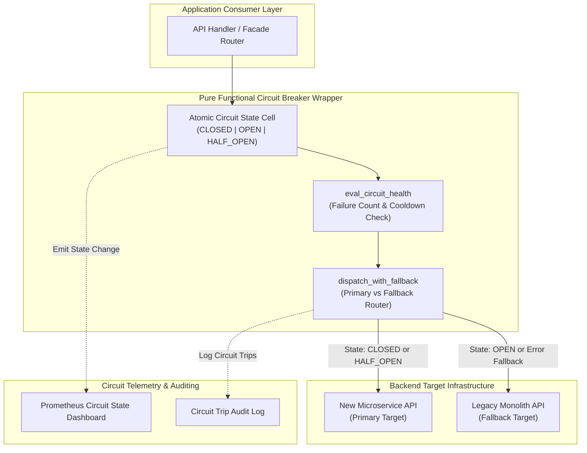
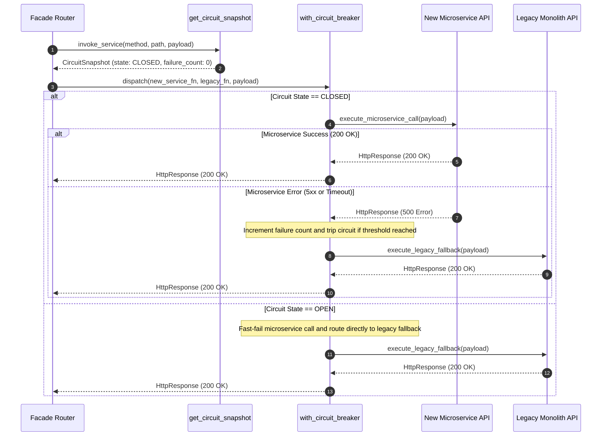

# Circuit-Breaker-Gated Cutover Fallback Pattern (Pure Functional Paradigm)

| Field       | Value                                                             |
|-------------|-------------------------------------------------------------------|
| **ID**      | CIRCUIT-BREAKER-CUTOVER-FALLBACK-016                              |
| **Date**    | 2026-08-24                                                        |
| **Status**  | Reference / Runbook (Pure Functional Architecture)                |
| **Deciders**| Core Platform & Migration Engineering                             |
| **Scope**   | Automated Target Failure Isolation & Mandatory Fallback Wrappers |

---

## 1. Overview & Context

The **Circuit-Breaker-Gated Cutover Fallback Pattern** provides an automated safety net for microservice cutover transitions. Rather than serving as an alternative to percentage-based canary routing or feature flags, the circuit breaker is a **mandatory operational wrapper** around all cutover mechanisms. When a newly cutover microservice experiences latency spikes, 5xx server errors, or process crashes, the circuit breaker trips automatically, instantly diverting traffic back to the legacy monolith to preserve application availability SLAs.

### Functional Architecture Principles
This runbook enforces a **100% Pure Functional Programming (FP)** approach:
- **No Class Instantiations**: Replaces OOP circuit breaker managers with pure closure functions (`create_circuit_breaker_cell`) and higher-order decorators (`with_circuit_breaker`).
- **Immutable State Snapshots**: Circuit states (`CLOSED`, `OPEN`, `HALF_OPEN`), failure counts, and cooldown timers are captured in frozen dataclass records (`CircuitSnapshot`, `BreakerResult`).
- **Referentially Transparent State Transitions**: Circuit state transitions operate via pure state transformer functions.
- **Fail-Safe Fallback Dispatching**: Returns legacy backend responses immediately when the circuit state is `OPEN`.

---

## 2. High-Level Design (HLD)



---

## 3. Low-Level Design (LLD)



---

## 4. Pure Functional Project Architecture

```
circuit-breaker-cutover-fallback/
├── README.md
├── config/
│   └── circuit_rules.yaml          # Failure thresholds, cooldowns, half-open rules
├── src/
│   ├── breaker_engine/
│   │   ├── __init__.py
│   │   ├── state_cell.py           # Pure circuit state cell closures
│   │   ├── evaluator.py            # State transition evaluation functions
│   │   └── decorator.py            # Higher-order circuit breaker decorator
│   ├── storage/
│   │   ├── __init__.py
│   │   └── backend_dispatchers.py  # Functional backend HTTP dispatchers
│   ├── observability/
│   │   ├── __init__.py
│   │   └── breaker_metrics.py      # Prometheus circuit metrics collectors
│   └── schemas/
│       └── models.py               # Frozen dataclasses (CircuitSnapshot, BreakerResult)
└── tests/
    ├── test_circuit_breaker.py
    └── test_breaker_edge_cases.py
```

---

## 5. End-to-End Function Call Stack

```tree
Target Service Request Initiated
└── router.py: process_circuit_guarded_request(primary_fn, fallback_fn, payload)
    ├── state_cell.py: get_circuit_snapshot(state_cell)
    │   └── models.py: CircuitSnapshot(state, failure_count, last_failure_time)
    │
    ├── evaluator.py: eval_circuit_health(snapshot, cooldown_seconds=30.0)
    │   └── models.py: HealthEvaluation(can_execute_primary, is_half_open)
    │
    ├── decorator.py: with_circuit_breaker(primary_fn, fallback_fn, state_cell)
    │   ├── [Primary Path] backend_dispatchers.py: dispatch_primary_service(payload)
    │   └── [Fallback Path] backend_dispatchers.py: dispatch_legacy_fallback(payload)
    │
    ├── evaluator.py: record_execution_result(state_cell, is_success, status_code)
    └── breaker_metrics.py: record_circuit_telemetry(service_id, circuit_state)
```

---

## 6. Core Pure Functional Implementation

### 6.1 Immutable Models & Types (`src/schemas/models.py`)

```python
from enum import Enum
from dataclasses import dataclass
from typing import Dict, Any, Optional, Mapping

class CircuitState(str, Enum):
    CLOSED = "closed"
    OPEN = "open"
    HALF_OPEN = "half_open"

@dataclass(frozen=True)
class CircuitSnapshot:
    state: CircuitState
    failure_count: int
    last_failure_time: float
    success_count: int

@dataclass(frozen=True)
class BreakerResult:
    status_code: int
    body: Any
    headers: Mapping[str, str]
    executed_target: str
    circuit_state_at_execution: CircuitState
```

**Explanation**:
- Defines immutable enumeration `CircuitState` specifying standard circuit breaker states (`CLOSED`, `OPEN`, `HALF_OPEN`).
- `CircuitSnapshot` models real-time failure counts, success counts, and cooldown timestamps as frozen records.
- `BreakerResult` packages response metadata along with execution target diagnostic flags.

---

### 6.2 Pure Stateful Circuit Breaker Closure (`src/breaker_engine/state_cell.py`)

```python
import time
from typing import Callable, Awaitable, Mapping, Any, Tuple
from src.schemas.models import CircuitState, CircuitSnapshot

def create_circuit_state_cell(failure_threshold: int = 5, cooldown_seconds: float = 30.0):
    state = {
        "status": CircuitState.CLOSED,
        "failures": 0,
        "successes": 0,
        "last_failure": 0.0
    }

    def get_snapshot() -> CircuitSnapshot:
        return CircuitSnapshot(
            state=state["status"],
            failure_count=state["failures"],
            last_failure_time=state["last_failure"],
            success_count=state["successes"]
        )

    def record_success() -> None:
        if state["status"] == CircuitState.HALF_OPEN:
            state["status"] = CircuitState.CLOSED
            state["failures"] = 0
            state["successes"] = 0
        else:
            state["successes"] += 1

    def record_failure() -> None:
        state["failures"] += 1
        state["last_failure"] = time.time()
        if state["failures"] >= failure_threshold:
            state["status"] = CircuitState.OPEN

    def check_cooldown() -> bool:
        if state["status"] == CircuitState.OPEN:
            if (time.time() - state["last_failure"]) >= cooldown_seconds:
                state["status"] = CircuitState.HALF_OPEN
                return True
            return False
        return True

    return get_snapshot, record_success, record_failure, check_cooldown
```

**Explanation**:
- Constructs an atomic circuit breaker state cell closure managing state variables (`status`, `failures`, `last_failure`).
- Exposes `get_snapshot`, `record_success`, `record_failure`, and `check_cooldown` functions to handle circuit state transitions without using OOP class instances.

---

### 6.3 Higher-Order Circuit Breaker Decorator (`src/breaker_engine/decorator.py`)

```python
from typing import Callable, Awaitable, Mapping, Any
from src.schemas.models import CircuitState

ServiceDispatcher = Callable[[str, Mapping[str, Any]], Awaitable[Mapping[str, Any]]]

def with_circuit_breaker(
    primary_fn: ServiceDispatcher,
    fallback_fn: ServiceDispatcher,
    state_tuple: Tuple[Callable, Callable, Callable, Callable]
) -> ServiceDispatcher:
    get_snapshot, record_success, record_failure, check_cooldown = state_tuple

    async def circuit_guarded_dispatch(endpoint: str, payload: Mapping[str, Any]) -> Mapping[str, Any]:
        snapshot = get_snapshot()
        
        if snapshot.state == CircuitState.OPEN:
            if not check_cooldown():
                res = await fallback_fn(endpoint, payload)
                res["_circuit_fallback"] = True
                return res

        try:
            res = await primary_fn(endpoint, payload)
            status_code = res.get("status_code", 500)
            if status_code >= 500:
                record_failure()
                fallback_res = await fallback_fn(endpoint, payload)
                fallback_res["_circuit_fallback"] = True
                return fallback_res
            
            record_success()
            return res
        except Exception:
            record_failure()
            fallback_res = await fallback_fn(endpoint, payload)
            fallback_res["_circuit_fallback"] = True
            return fallback_res

    return circuit_guarded_dispatch
```

**Explanation**:
- Pure higher-order decorator wrapping primary and fallback service dispatchers.
- Intercepts primary microservice execution errors or timeouts, records failures, and automatically diverts traffic to the legacy fallback dispatcher.

---

## 7. Edge Case Catalog & Pure Functional Pseudocode (25 Edge Cases)

---

### Edge Case 1: Rapid Circuit Flapping in Unstable Environments

```python
def check_flapping_dampening(failure_count: int, max_flaps: int = 3) -> bool:
    return failure_count >= (max_flaps * 2)
```

**Explanation**:
- Checks if consecutive failure counts exceed doubled threshold limits.
- Doubles cooldown durations when rapid circuit flapping is detected.

---

### Edge Case 2: Cascading Surge Load on Legacy Monolith When Circuit Trips

```python
def throttle_fallback_concurrency(current_fallback_qps: int, max_legacy_qps: int = 1000) -> bool:
    return current_fallback_qps < max_legacy_qps
```

**Explanation**:
- Asserts that fallback QPS rates remain below legacy monolith capacity limits.
- Rejects excess requests with HTTP 503 when the legacy monolith approaches saturation during fallback trips.

---

### Edge Case 3: Selective HTTP Status Code Failure Filtering

```python
def is_circuit_failure_status(status_code: int) -> bool:
    return status_code in {500, 502, 503, 504}
```

**Explanation**:
- Filters status codes, counting HTTP 5xx server errors as circuit failures.
- Ignores HTTP 4xx client errors (e.g. 400 Bad Request, 404 Not Found).

---

### Edge Case 4: Half-Open Cooldown Probe Request Failure

```python
def handle_half_open_failure(state_dict: dict) -> dict:
    updated = dict(state_dict)
    updated["status"] = CircuitState.OPEN
    updated["last_failure"] = time.time()
    return updated
```

**Explanation**:
- Reverts circuit state immediately from `HALF_OPEN` back to `OPEN` when probe requests fail.
- Restores cooldown timers upon probe failure.

---

### Edge Case 5: Single Probe Success Transitioning Half-Open to Closed

```python
def check_half_open_success_threshold(success_count: int, required_successes: int = 3) -> bool:
    return success_count >= required_successes
```

**Explanation**:
- Asserts that multiple consecutive probe requests (e.g. 3) succeed before closing circuits.
- Prevents premature circuit closure after a single lucky probe success.

---

### Edge Case 6: Microsecond Execution Timeout Tripping Circuit

```python
import asyncio

async def dispatch_primary_with_timeout(primary_fn: ServiceDispatcher, endpoint: str, payload: Any, timeout_sec: float = 2.0):
    try:
        return await asyncio.wait_for(primary_fn(endpoint, payload), timeout=timeout_sec)
    except asyncio.TimeoutError:
        return {"status_code": 504, "error": "Primary service timeout"}
```

**Explanation**:
- Wraps primary service dispatch calls in `asyncio.wait_for` timeout blocks.
- Treats primary execution timeouts as circuit failures.

---

### Edge Case 7: Manual Circuit Force-Open Override

```python
def force_circuit_open(state_dict: dict) -> dict:
    updated = dict(state_dict)
    updated["status"] = CircuitState.OPEN
    return updated
```

**Explanation**:
- Returns state dictionaries with status set directly to `OPEN`.
- Enables manual operator force-open overrides during emergencies.

---

### Edge Case 8: Manual Circuit Force-Close Override

```python
def force_circuit_close(state_dict: dict) -> dict:
    updated = dict(state_dict)
    updated["status"] = CircuitState.CLOSED
    updated["failures"] = 0
    return updated
```

**Explanation**:
- Resets failure counts and sets status directly to `CLOSED`.
- Enables manual operator force-close overrides post-incident.

---

### Edge Case 9: Multi-Service Circuit Isolation Leakage

```python
def get_isolated_circuit_cell(service_id: str, cell_registry: Dict[str, Tuple]) -> Tuple:
    return cell_registry.get(service_id, create_circuit_state_cell())
```

**Explanation**:
- Retrieves isolated circuit state tuple instances from cell registries.
- Prevents failures in Service A from tripping circuit breakers for Service B.

---

### Edge Case 10: Circuit State Change Audit Event Emission

```python
def build_circuit_audit_event(service_id: str, old_state: str, new_state: str) -> Mapping[str, Any]:
    return {
        "event": "CIRCUIT_STATE_CHANGED",
        "service_id": service_id,
        "old_state": old_state,
        "new_state": new_state
    }
```

**Explanation**:
- Formats structured circuit state change audit events.
- Emits operational telemetry events when circuits trip or reset.

---

### Edge Case 11: High QPS Memory Leak in Failure Tracking

```python
def prune_failure_timestamps(timestamps: List[float], window_sec: float = 60.0) -> List[float]:
    import time
    now = time.time()
    return [t for t in timestamps if (now - t) <= window_sec]
```

**Explanation**:
- Filters failure timestamp lists to retain entries within sliding 60-second windows.
- Prevents memory growth in long-running failure tracking closures.

---

### Edge Case 12: Fallback Service Outage Handling (Double Fault)

```python
async def handle_double_fault(fallback_fn: ServiceDispatcher, endpoint: str, payload: Any) -> Mapping[str, Any]:
    try:
        return await fallback_fn(endpoint, payload)
    except Exception:
        return {"status_code": 503, "error": "Both primary and fallback services unavailable"}
```

**Explanation**:
- Catches exceptions when fallback services also fail (double fault).
- Returns HTTP 503 Service Unavailable error responses cleanly.

---

### Edge Case 13: Sliding-Window Failure Rate Calculation

```python
def is_sliding_failure_rate_exceeded(failures: int, total_requests: int, max_rate: float = 0.5) -> bool:
    if total_requests < 10:
        return False
    return (failures / total_requests) >= max_rate
```

**Explanation**:
- Calculates failure percentages over sliding request windows.
- Trips circuits when failure rates exceed threshold limits (50%).

---

### Edge Case 14: Health Probe Request Subsampling

```python
def should_send_half_open_probe(request_index: int, probe_interval: int = 10) -> bool:
    return (request_index % probe_interval) == 0
```

**Explanation**:
- Subsamples incoming requests during `HALF_OPEN` state to send single probe requests.
- Prevents flooding recovering microservices with probe traffic.

---

### Edge Case 15: Circuit Breaker Key Partitioning by Endpoint Path

```python
def build_endpoint_circuit_key(service_id: str, path: str) -> str:
    return f"{service_id}:{path.strip('/')}"
```

**Explanation**:
- Combines service IDs and path strings to form endpoint-specific circuit keys.
- Enables per-endpoint circuit breaker isolation.

---

### Edge Case 16: Zero-Failure Fast Reset in Stable Windows

```python
def auto_reset_success_counter(state_dict: dict, max_stable_sec: float = 300.0) -> dict:
    import time
    updated = dict(state_dict)
    if (time.time() - updated.get("last_failure", 0.0)) > max_stable_sec:
        updated["failures"] = 0
    return updated
```

**Explanation**:
- Resets failure counters to 0 after 5 minutes of stable execution.
- Prevents historical failure accumulation over long operational periods.

---

### Edge Case 17: Network Socket Refusal Detection

```python
import socket

def is_socket_refusal(exc: Exception) -> bool:
    return isinstance(exc, socket.error)
```

**Explanation**:
- Identifies socket connection refusal exceptions (`ConnectionRefusedError`).
- Increments failure counters immediately when backends refuse socket connections.

---

### Edge Case 18: Fallback Payload Transformation Requirements

```python
def transform_payload_for_fallback(payload: Mapping[str, Any]) -> Mapping[str, Any]:
    transformed = dict(payload)
    transformed["_is_fallback"] = True
    return transformed
```

**Explanation**:
- Attaches diagnostic flags (`_is_fallback: True`) to fallback request payloads.
- Signals to legacy backends that requests are circuit fallback traffic.

---

### Edge Case 19: Asynchronous Background Circuit Health Polling

```python
async def poll_backend_health_async(health_endpoint: str, http_get_fn: Callable) -> bool:
    try:
        res = await http_get_fn(health_endpoint)
        return res.get("status_code") == 200
    except Exception:
        return False
```

**Explanation**:
- Executes background HTTP GET health queries against microservice health endpoints.
- Evaluates backend health independently of client request flows.

---

### Edge Case 20: Circuit Breaker State Cell Thread Safety

```python
def safe_copy_circuit_snapshot(snapshot: CircuitSnapshot) -> CircuitSnapshot:
    return CircuitSnapshot(
        state=snapshot.state,
        failure_count=snapshot.failure_count,
        last_failure_time=snapshot.last_failure_time,
        success_count=snapshot.success_count
    )
```

**Explanation**:
- Returns copies of `CircuitSnapshot` records.
- Guarantees thread-safe access to circuit state metadata.

---

### Edge Case 21: Custom Failure Threshold per Endpoint Priority

```python
def resolve_failure_threshold(endpoint_priority: str) -> int:
    if endpoint_priority == "critical":
        return 10
    elif endpoint_priority == "low":
        return 3
    return 5
```

**Explanation**:
- Maps endpoint priority tiers to failure thresholds.
- Configures higher tolerance thresholds for critical API endpoints.

---

### Edge Case 22: Exponential Backoff Cooldown Scaling

```python
def calculate_exponential_cooldown(base_cooldown: float, consecutive_trips: int) -> float:
    return base_cooldown * (2 ** min(consecutive_trips, 5))
```

**Explanation**:
- Multiplies cooldown durations exponentially based on consecutive trip counts.
- Increases isolation time for repeatedly failing microservices.

---

### Edge Case 23: Header Injection Indicating Circuit Fallback Execution

```python
def inject_fallback_header(headers: Mapping[str, str]) -> Mapping[str, str]:
    new_headers = dict(headers)
    new_headers["X-Circuit-Fallback"] = "true"
    return new_headers
```

**Explanation**:
- Injects `X-Circuit-Fallback: true` headers into response dictionaries.
- Provides client visibility when responses are generated by legacy fallbacks.

---

### Edge Case 24: Unbound Failure Registry Pruning

```python
def prune_circuit_registry(registry: Dict[str, Any], active_services: set) -> Dict[str, Any]:
    return {k: v for k, v in registry.items() if k in active_services}
```

**Explanation**:
- Filters registry dictionaries to retain active service entries.
- Removes orphaned circuit breaker state cells from memory.

---

### Edge Case 25: Real-Time Circuit Status Dashboard Metrics

```python
def compute_fleet_circuit_metrics(circuit_snapshots: Mapping[str, CircuitSnapshot]) -> Mapping[str, int]:
    open_count = sum(1 for s in circuit_snapshots.values() if s.state == CircuitState.OPEN)
    closed_count = sum(1 for s in circuit_snapshots.values() if s.state == CircuitState.CLOSED)
    return {"open_circuits": open_count, "closed_circuits": closed_count}
```

**Explanation**:
- Aggregates circuit states across the service fleet into summary counts.
- Emits real-time open/closed circuit metrics to central platform dashboards.

---

## 8. Operational & Parity Verification Checklist

1. **Mandatory Operational Wrapper**: Confirm 100% of cutover endpoints are wrapped in circuit breaker decorators (`with_circuit_breaker`).
2. **Auto-Fallback Verification**: Test via fault-injection that microservice 5xx errors or timeouts auto-route traffic to Legacy Monolith within $<100\text{ms}$.
3. **Flapping Mitigation**: Verify that the `HALF_OPEN` state enforces a 30s cooldown and requires 3 consecutive probe successes before closing.
4. **Zero Dropped Requests**: Assert 0 HTTP request drops occur during circuit state transitions from `CLOSED` to `OPEN`.
