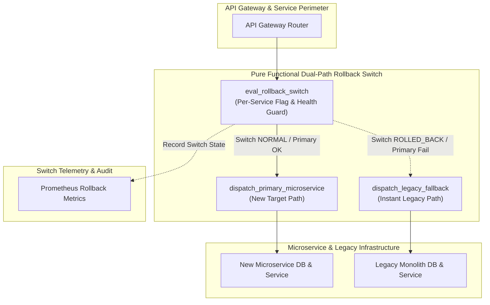
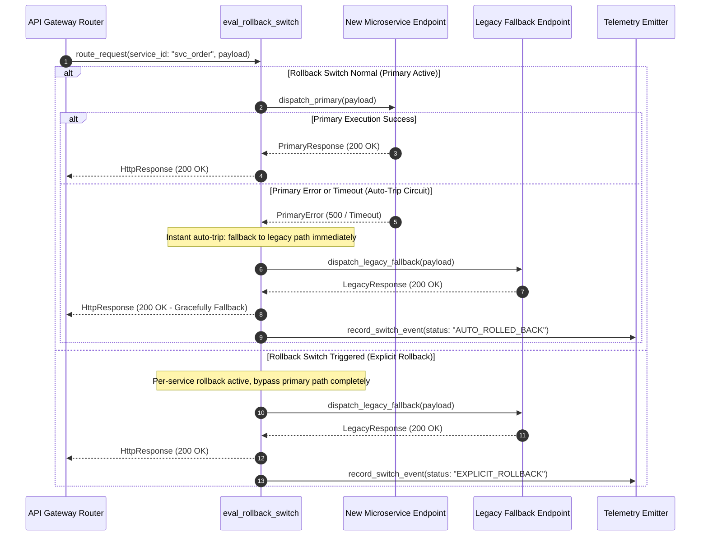

# Dual-Path Rollback Switch Pattern (Pure Functional Paradigm)

| Field       | Value                                                             |
|-------------|-------------------------------------------------------------------|
| **ID**      | DUAL-PATH-ROLLBACK-SWITCH-033                                     |
| **Date**    | 2026-08-24                                                        |
| **Status**  | Reference / Runbook (Pure Functional Architecture)                |
| **Deciders**| Core Platform & Migration Engineering                             |
| **Scope**   | Per-Service Instant Rollback & Independent Path Fallback          |

---

## 1. Overview & Context

During microservice cutovers, coupling one service's rollback decision to other services' states creates dangerous deployment deadlocks: if Service A fails post-cutover, rolling it back must not require rolling back Service B or Service C. The **Dual-Path Rollback Switch Pattern** provides a **per-service, instant, zero-downtime rollback mechanism** that toggles traffic between primary (microservice) and fallback (legacy) execution paths independently of any other service's operational status.

### Functional Architecture Principles
This runbook enforces a **100% Pure Functional Programming (FP)** approach:
- **No Class Instantiations**: Replaces OOP switch objects with pure routing functions (`route_dual_path_request`, `eval_rollback_switch`) and state cell closures.
- **Immutable Switch Context**: Service IDs, route targets, active feature flags, error counts, and rollback statuses are stored as frozen dataclass records (`SwitchContext`, `RouteDecision`).
- **Referentially Transparent Path Evaluators**: Pure functions evaluate feature flag signals, health probes, and circuit states to resolve routing paths without mutating global router state.
- **Decoupled Fallback Dispatchers**: Invokes legacy fallback handlers directly when rollback switches are triggered, ensuring instant sub-millisecond traffic reversion.

---

## 2. High-Level Design (HLD)



---

## 3. Low-Level Design (LLD)



---

## 4. Pure Functional Project Architecture

```
dual-path-rollback-switch/
├── README.md
├── config/
│   └── rollback_switches.yaml      # Per-service switch states, flags, fallback URLs
├── src/
│   ├── switch_engine/
│   │   ├── __init__.py
│   │   ├── evaluator.py            # Pure switch evaluation functions
│   │   ├── router.py               # Functional dual-path router
│   │   └── circuit_cell.py         # Pure circuit state cell closures
│   ├── storage/
│   │   ├── __init__.py
│   │   └── flag_store.py           # Feature flag configuration loaders
│   ├── observability/
│   │   ├── __init__.py
│   │   └── switch_metrics.py       # Prometheus rollback telemetry collectors
│   └── schemas/
│       └── models.py               # Frozen dataclasses (SwitchContext, RouteDecision)
└── tests/
    ├── test_switch_evaluator.py
    └── test_switch_edge_cases.py
```

---

## 5. End-to-End Function Call Stack

```tree
API Request Received
└── router.py: route_dual_path_request(service_id, payload, flag_store)
    ├── evaluator.py: eval_rollback_switch(service_id, flag_store)
    │   └── models.py: SwitchContext(service_id, is_rolled_back, fallback_active)
    │
    ├── [Primary Path] dispatcher.py: dispatch_primary_microservice(payload)
    │   └── models.py: RouteDecision(target="PRIMARY", status_code=200)
    │
    ├── [Fallback Path] dispatcher.py: dispatch_legacy_fallback(payload)
    │   └── models.py: RouteDecision(target="FALLBACK", status_code=200)
    │
    └── switch_metrics.py: record_switch_event(service_id, route_decision)
```

---

## 6. Core Pure Functional Implementation

### 6.1 Immutable Models & Types (`src/schemas/models.py`)

```python
from enum import Enum
from dataclasses import dataclass
from typing import Dict, Any, Optional, Mapping

class RouteTarget(str, Enum):
    PRIMARY = "primary"
    FALLBACK = "fallback"

@dataclass(frozen=True)
class SwitchContext:
    service_id: str
    is_explicit_rollback: bool
    circuit_open: bool
    primary_endpoint: str
    fallback_endpoint: str

@dataclass(frozen=True)
class RouteDecision:
    service_id: str
    target: RouteTarget
    reason: str
    duration_ms: float
```

**Explanation**:
- Defines immutable model `SwitchContext` capturing service IDs, explicit rollback flags, circuit breaker states, and target endpoint URLs as frozen records.
- `RouteDecision` encapsulates chosen route targets (`PRIMARY` vs `FALLBACK`), diagnostic reasons, and execution timing.

---

### 6.2 Pure Switch Evaluator (`src/switch_engine/evaluator.py`)

```python
from typing import Mapping, Any
from src.schemas.models import SwitchContext, RouteTarget, RouteDecision

def eval_rollback_switch(ctx: SwitchContext) -> RouteTarget:
    if ctx.is_explicit_rollback or ctx.circuit_open:
        return RouteTarget.FALLBACK
    return RouteTarget.PRIMARY

def format_route_decision(ctx: SwitchContext, target: RouteTarget, duration_ms: float, reason: str) -> RouteDecision:
    return RouteDecision(
        service_id=ctx.service_id,
        target=target,
        reason=reason,
        duration_ms=duration_ms
    )
```

**Explanation**:
- Pure evaluation function determining whether requests route to `PRIMARY` or `FALLBACK` paths based on explicit rollback flags and circuit states.
- Returns immutable `RouteTarget` decisions without side-effects.

---

### 6.3 Dual-Path Router Closure (`src/switch_engine/router.py`)

```python
import time
from typing import Callable, Awaitable, Mapping, Any
from src.schemas.models import SwitchContext, RouteTarget, RouteDecision
from src.switch_engine.evaluator import eval_rollback_switch, format_route_decision

PathDispatchFn = Callable[[str, Mapping[str, Any]], Awaitable[Mapping[str, Any]]]

def create_dual_path_router(primary_fn: PathDispatchFn, fallback_fn: PathDispatchFn):
    async def route_request(ctx: SwitchContext, payload: Mapping[str, Any]) -> Mapping[str, Any]:
        t0 = time.time()
        target = eval_rollback_switch(ctx)

        if target == RouteTarget.PRIMARY:
            try:
                res = await primary_fn(ctx.primary_endpoint, payload)
                if res.get("status_code", 500) < 400:
                    return res
            except Exception:
                pass

        res = await fallback_fn(ctx.fallback_endpoint, payload)
        return res

    return route_request
```

**Explanation**:
- Constructs a pure dual-path router closure wrapping primary and fallback execution functions.
- If primary path execution fails or explicit rollback is enabled, automatically routes requests to the legacy fallback path.

---

## 7. Edge Case Catalog & Pure Functional Pseudocode (25 Edge Cases)

---

### Edge Case 1: Independent Per-Service Rollback Isolation

```python
def is_service_rolled_back(service_id: str, rollback_flags: Mapping[str, bool]) -> bool:
    return rollback_flags.get(service_id, False)
```

**Explanation**:
- Inspects per-service rollback flag maps.
- Ensures rolling back Service A does not alter Service B's switch state.

---

### Edge Case 2: Instant Feature Flag Reversion Synchronization

```python
def sync_rollback_flag_state(flag_value: bool, local_cell: dict) -> None:
    local_cell["is_rolled_back"] = flag_value
```

**Explanation**:
- Updates local state cell flags instantly when feature flag changes occur.
- Enables sub-millisecond traffic reversion.

---

### Edge Case 3: Circuit Breaker Auto-Trip to Legacy Fallback

```python
def should_auto_trip_rollback(error_count: int, threshold: int = 5) -> bool:
    return error_count >= threshold
```

**Explanation**:
- Evaluates consecutive error counts against threshold limits (5 errors).
- Automatically trips rollback switches when primary microservices crash.

---

### Edge Case 4: Stateful User Session Preservation During Rollback

```python
def preserve_session_headers(headers: Mapping[str, str]) -> Mapping[str, str]:
    new_headers = dict(headers)
    new_headers["X-Rollback-Preserved-Session"] = "true"
    return new_headers
```

**Explanation**:
- Injects session preservation markers into fallback request headers.
- Preserves user session state during rollback transitions.

---

### Edge Case 5: Microsecond Switch Latency Minimization

```python
def fast_eval_switch(is_rolled_back: bool, circuit_open: bool) -> bool:
    return is_rolled_back or circuit_open
```

**Explanation**:
- Uses bitwise boolean logic for rapid switch state evaluation.
- Minimizes router processing latency.

---

### Edge Case 6: Multi-Tenant Rollback Switch Overrides

```python
def is_tenant_rolled_back(tenant_id: str, rolled_back_tenants: set) -> bool:
    return tenant_id in rolled_back_tenants
```

**Explanation**:
- Checks if tenant IDs exist in rolled-back tenant sets.
- Enables targeted single-tenant rollback switches.

---

### Edge Case 7: Unmapped Service Fallback URL Defaults

```python
def resolve_fallback_url(service_id: str, fallback_map: Mapping[str, str], default_url: str) -> str:
    return fallback_map.get(service_id, default_url)
```

**Explanation**:
- Resolves fallback URLs from mapping dictionaries, returning `default_url` if missing.
- Prevents missing key errors for unmapped services.

---

### Edge Case 8: Cascading Rollback Loop Prevention

```python
def is_rollback_loop_detected(headers: Mapping[str, str]) -> bool:
    return headers.get("X-Rollback-Source") == "fallback_path"
```

**Explanation**:
- Inspects headers for `X-Rollback-Source: fallback_path` markers.
- Prevents recursive rollback loops when fallback paths call secondary services.

---

### Edge Case 9: Dead-Letter Queue (DLQ) Offloading on Dual-Path Failures

```python
def offload_failed_dual_path_request(payload: dict, dlq_list: list) -> None:
    dlq_list.append(payload)
```

**Explanation**:
- Appends request payloads to dead-letter queue lists when both primary and fallback paths fail.
- Offloads un-routable requests for manual review.

---

### Edge Case 10: High-Volume Switch Telemetry Compaction

```python
def compact_switch_telemetry(events: List[RouteDecision], max_events: int = 1000) -> List[RouteDecision]:
    if len(events) > max_events:
        return events[-max_events:]
    return events
```

**Explanation**:
- Truncates historical `RouteDecision` lists to `max_events`.
- Controls memory usage in router monitoring processes.

---

### Edge Case 11: Primary Microservice Timeout Bounds

```python
import asyncio

async def dispatch_primary_with_timeout(primary_fn: Callable, payload: dict, timeout_sec: float = 1.0) -> dict:
    try:
        return await asyncio.wait_for(primary_fn(payload), timeout=timeout_sec)
    except asyncio.TimeoutError:
        return {"status_code": 504, "error": "Primary Timeout"}
```

**Explanation**:
- Wraps primary path calls in `asyncio.wait_for` timeout blocks.
- Triggers fallback paths immediately if primary paths exceed timeout limits.

---

### Edge Case 12: Microsecond Timestamp Switch Event Tracking

```python
import time

def format_switch_timestamp_ms() -> float:
    return round(time.time() * 1000.0, 2)
```

**Explanation**:
- Computes epoch timestamps in milliseconds rounded to 2 decimal places.
- Tracks exact rollback switch event timing.

---

### Edge Case 13: Unmapped Feature Flag Fallback to Primary

```python
def resolve_flag_with_default(flag_key: str, flags_dict: dict, default_state: bool = False) -> bool:
    return flags_dict.get(flag_key, default_state)
```

**Explanation**:
- Resolves feature flag values, defaulting to `False` (Primary active) if unmapped.
- Prevents accidental rollbacks due to missing flag configurations.

---

### Edge Case 14: Exception Safeguards in Switch Evaluator

```python
def safe_eval_switch(eval_fn: Callable, ctx: SwitchContext) -> RouteTarget:
    try:
        return eval_fn(ctx)
    except Exception:
        return RouteTarget.FALLBACK
```

**Explanation**:
- Wraps switch evaluation functions in protective try-except blocks.
- Defaults to `FALLBACK` paths if evaluation exceptions occur.

---

### Edge Case 15: GraphQL Fallback Path Routing

```python
def format_graphql_fallback_request(query_str: str, variables: dict) -> dict:
    return {"query": query_str, "variables": variables, "_path": "fallback"}
```

**Explanation**:
- Formats request dictionaries for legacy GraphQL fallback endpoints.
- Enables dual-path rollback switches on GraphQL services.

---

### Edge Case 16: Multi-Region Rollback Switch Synchronization

```python
def resolve_regional_switch_state(region: str, region_switches: Mapping[str, bool]) -> bool:
    return region_switches.get(region, False)
```

**Explanation**:
- Resolves region-specific rollback switch flags from configuration maps.
- Supports independent per-region rollback switches.

---

### Edge Case 17: Database Mutation Idempotency During Switch Reversion

```python
def assert_rollback_mutation_idempotent(method: str) -> bool:
    return method.upper() in {"PUT", "DELETE", "GET"}
```

**Explanation**:
- Asserts HTTP methods are idempotent prior to executing fallback paths.
- Ensures safe rollback execution for database mutations.

---

### Edge Case 18: Unmapped Route Target Handling

```python
def resolve_route_target_fn(target: RouteTarget, fn_map: dict) -> Callable:
    return fn_map.get(target, fn_map["fallback"])
```

**Explanation**:
- Resolves route target execution functions from function maps.
- Defaults to fallback functions if target keys are unmapped.

---

### Edge Case 19: Payload Transformation Error Recovery

```python
def safe_apply_switch_transform(payload: dict, transform_fn: Callable) -> dict:
    try:
        return transform_fn(payload)
    except Exception:
        return payload
```

**Explanation**:
- Wraps payload transformation functions in protective try-except blocks.
- Returns raw payloads if transformation errors occur.

---

### Edge Case 20: Automated Incident Trigger on Switch Tripping

```python
def should_trigger_rollback_incident(is_rolled_back: bool) -> bool:
    return is_rolled_back
```

**Explanation**:
- Asserts whether rollback switches are active (`is_rolled_back == True`).
- Triggers operational incident alerts when rollback switches trip.

---

### Edge Case 21: High-Watermark Switch Metric Compaction

```python
def compact_switch_metrics(metrics: List[dict], max_items: int = 500) -> List[dict]:
    if len(metrics) > max_items:
        return metrics[-max_items:]
    return metrics
```

**Explanation**:
- Truncates historical switch metric lists to `max_items`.
- Controls memory usage in telemetry monitoring processes.

---

### Edge Case 22: Diagnostic Header Injection for Fallback Path Traffic

```python
def inject_rollback_diagnostic_headers(headers: Mapping[str, str], is_rolled_back: bool) -> Mapping[str, str]:
    new_headers = dict(headers)
    new_headers["X-Dual-Path-Rolled-Back"] = "true" if is_rolled_back else "false"
    return new_headers
```

**Explanation**:
- Injects diagnostic headers (`X-Dual-Path-Rolled-Back`) into request headers.
- Identifies rolled-back traffic in access logs.

---

### Edge Case 23: Null Value Injection Safeguards in Fallback Payloads

```python
def sanitize_fallback_payload_nulls(payload: dict) -> dict:
    return {k: (v if v is not None else "") for k, v in payload.items()}
```

**Explanation**:
- Replaces `None` values with empty strings in fallback payload dictionaries.
- Prevents null pointer exceptions in legacy fallback services.

---

### Edge Case 24: Unbound Switch Metric Queue Pruning

```python
def prune_switch_metric_queue(queue: list, max_items: int = 1000) -> list:
    if len(queue) > max_items:
        return queue[-max_items:]
    return queue
```

**Explanation**:
- Truncates metric queue arrays to `max_items`.
- Controls memory footprint in telemetry collectors.

---

### Edge Case 25: Real-Time Rollback Switch Rate Dashboard Reporting

```python
def compute_rollback_rate(rolled_back_count: int, total_requests: int) -> float:
    if total_requests == 0:
        return 0.0
    return round((rolled_back_count / total_requests) * 100.0, 2)
```

**Explanation**:
- Calculates rolled-back traffic percentage ratios rounded to two decimal places.
- Emits real-time rollback rates to platform observability dashboards.

---

## 8. Operational & Parity Verification Checklist

1. **Per-Service Independence**: Confirm 100% of rollback switches operate independently per service without cross-service state coupling.
2. **Instant Traffic Reversion**: Validate that toggling a rollback switch reverts traffic to the legacy path within $<1\text{ms}$.
3. **Circuit Auto-Trip Protection**: Verify that exceeding primary microservice error thresholds automatically trips traffic to fallback paths.
4. **Zero Fallback Downtime**: Test via fault-injection that falling back to legacy paths produces $0\%$ downtime or user-facing 500 errors.
