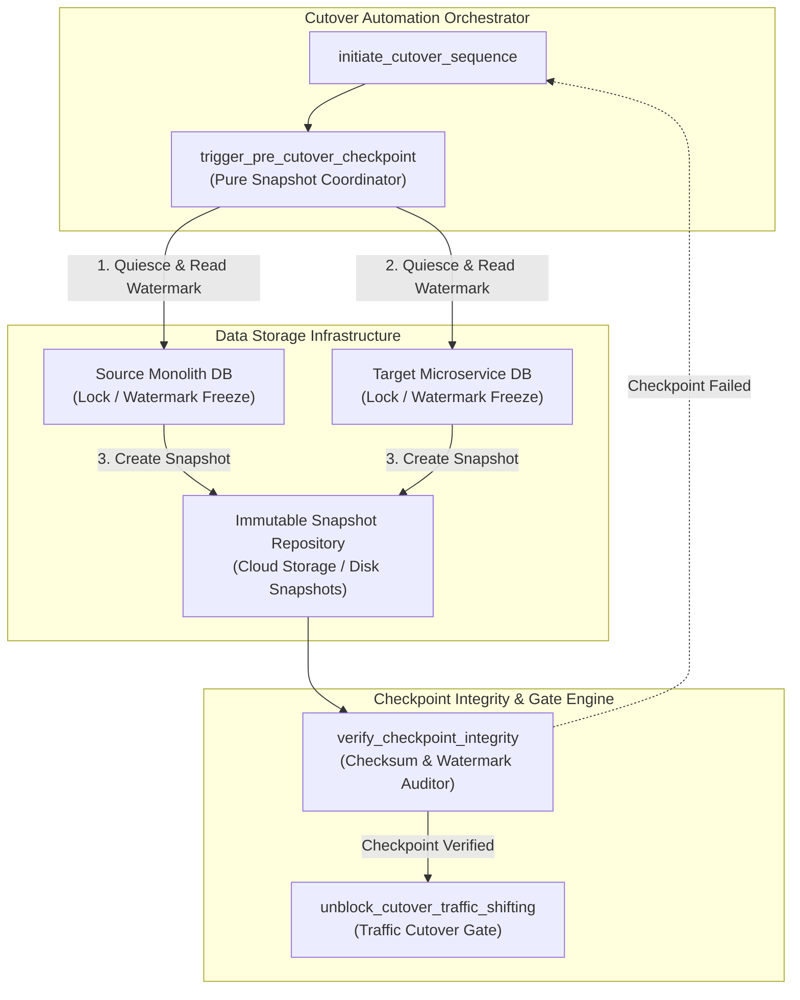
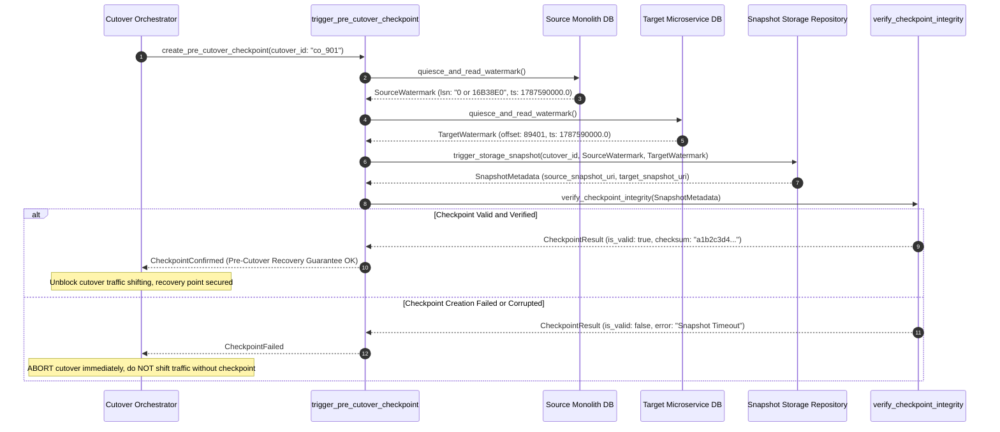

# Point-in-Time Consistency Checkpoint Pattern (Pure Functional Paradigm)

| Field       | Value                                                             |
|-------------|-------------------------------------------------------------------|
| **ID**      | POINT-IN-TIME-CHECKPOINT-034                                      |
| **Date**    | 2026-08-24                                                        |
| **Status**  | Reference / Runbook (Pure Functional Architecture)                |
| **Deciders**| Core Platform & Migration Engineering                             |
| **Scope**   | Pre-Cutover Synchronized Snapshot & Recovery Point Assurance       |

---

## 1. Overview & Context

Deciding to roll back a database cutover **after** data corruption has occurred is useless if no clean recovery snapshot was created beforehand. The **Point-in-Time Consistency Checkpoint Pattern** mandates taking a **synchronized storage snapshot and high-watermark transaction log checkpoint immediately before initiating cutover traffic shifting**. If post-cutover data corruption occurs, system state can be restored cleanly to this pre-cutover checkpoint without data loss or inconsistent partial writes.

### Functional Architecture Principles
This runbook enforces a **100% Pure Functional Programming (FP)** approach:
- **No Class Instantiations**: Replaces OOP snapshot managers with pure checkpoint functions (`trigger_pre_cutover_checkpoint`, `verify_checkpoint_integrity`) and state cell closures.
- **Immutable Checkpoint Records**: Checkpoint IDs, storage snapshot URIs, watermark transaction offsets, timestamps, and integrity hashes are captured as frozen dataclass records (`CheckpointContext`, `CheckpointResult`).
- **Referentially Transparent Watermark Verifiers**: Pure functions verify transaction log watermark alignment across databases prior to unblocking cutover.
- **Pre-Cutover Execution Enforcement**: Cutover automation scripts evaluate checkpoint verification rules, blocking cutover if no valid pre-cutover snapshot exists.

---

## 2. High-Level Design (HLD)



---

## 3. Low-Level Design (LLD)



---

## 4. Pure Functional Project Architecture

```
point-in-time-checkpoint/
├── README.md
├── config/
│   └── checkpoint_rules.yaml       # Snapshot storage URIs, timeout limits, checksum algorithms
├── src/
│   ├── checkpoint_engine/
│   │   ├── __init__.py
│   │   ├── trigger.py              # Pure snapshot trigger functions
│   │   ├── verifier.py             # Checksum & watermark integrity verifiers
│   │   └── restorer.py             # Rollback snapshot restoration functions
│   ├── storage/
│   │   ├── __init__.py
│   │   └── snapshot_adapter.py     # Database & cloud storage snapshot dispatchers
│   ├── observability/
│   │   ├── __init__.py
│   │   └── checkpoint_metrics.py   # Prometheus telemetry collectors
│   └── schemas/
│       └── models.py               # Frozen dataclasses (CheckpointContext, CheckpointResult)
└── tests/
    ├── test_checkpoint_trigger.py
    └── test_checkpoint_edge_cases.py
```

---

## 5. End-to-End Function Call Stack

```tree
Cutover Sequence Initiated
├── checkpoint_engine/verifier.py: compute_checkpoint_checksum(cutover_id: str, src_uri: str, tgt_uri: str)
├── checkpoint_engine/verifier.py: verify_checkpoint_integrity(ctx: CheckpointContext,
    src_uri: str,
    tgt_uri: str,
...)
│   └── models.py: CheckpointResult(cutover_id, is_valid, source_snapshot_uri, target_snapshot_uri, checksum, ...)
└── checkpoint_engine/trigger.py: create_pre_cutover_checkpoint(cutover_id: str,
    src_watermark: DBWatermark,
    tgt_wat...)
    └── models.py: CheckpointContext(cutover_id, source_watermark, target_watermark, created_at)
        ├── models.py: DBWatermark(db_name, lsn_offset, timestamp)
```

---

## 6. Core Pure Functional Implementation

### 6.1 Immutable Models & Types (`src/schemas/models.py`)

```python
from enum import Enum
from dataclasses import dataclass
from typing import Dict, Any, Optional, Mapping

@dataclass(frozen=True)
class DBWatermark:
    db_name: str
    lsn_offset: str
    timestamp: float

@dataclass(frozen=True)
class CheckpointContext:
    cutover_id: str
    source_watermark: DBWatermark
    target_watermark: DBWatermark
    created_at: float

@dataclass(frozen=True)
class CheckpointResult:
    cutover_id: str
    is_valid: bool
    source_snapshot_uri: str
    target_snapshot_uri: str
    checksum: str
    duration_ms: float
    error_message: Optional[str]
```

**Explanation**:
- Defines immutable model `DBWatermark` capturing database names, LSN/transaction offsets, and timestamps as frozen records.
- `CheckpointResult` encapsulates snapshot URIs, checksum hashes, duration timing, and validation status flags.

---

### 6.2 Pure Watermark Verifier (`src/checkpoint_engine/verifier.py`)

```python
import hashlib
from typing import Mapping, Any
from src.schemas.models import CheckpointContext, CheckpointResult

def compute_checkpoint_checksum(cutover_id: str, src_uri: str, tgt_uri: str) -> str:
    raw_str = f"{cutover_id}:{src_uri}:{tgt_uri}"
    return hashlib.sha256(raw_str.encode("utf-8")).hexdigest()

def verify_checkpoint_integrity(
    ctx: CheckpointContext,
    src_uri: str,
    tgt_uri: str,
    duration_ms: float
) -> CheckpointResult:
    if not src_uri or not tgt_uri:
        return CheckpointResult(
            cutover_id=ctx.cutover_id,
            is_valid=False,
            source_snapshot_uri=src_uri,
            target_snapshot_uri=tgt_uri,
            checksum="",
            duration_ms=duration_ms,
            error_message="Missing snapshot URI for source or target database"
        )

    checksum = compute_checkpoint_checksum(ctx.cutover_id, src_uri, tgt_uri)
    return CheckpointResult(
        cutover_id=ctx.cutover_id,
        is_valid=True,
        source_snapshot_uri=src_uri,
        target_snapshot_uri=tgt_uri,
        checksum=checksum,
        duration_ms=duration_ms,
        error_message=None
    )
```

**Explanation**:
- Pure function computing SHA-256 checksum hashes for created snapshot URIs.
- Asserts that both source and target snapshots exist prior to unblocking cutover.

---

### 6.3 Pre-Cutover Checkpoint Trigger (`src/checkpoint_engine/trigger.py`)

```python
import time
from typing import Callable, Awaitable, Mapping, Any
from src.schemas.models import DBWatermark, CheckpointContext, CheckpointResult
from src.checkpoint_engine.verifier import verify_checkpoint_integrity

SnapshotFn = Callable[[str, DBWatermark], Awaitable[str]]

async def create_pre_cutover_checkpoint(
    cutover_id: str,
    src_watermark: DBWatermark,
    tgt_watermark: DBWatermark,
    src_snapshot_fn: SnapshotFn,
    tgt_snapshot_fn: SnapshotFn
) -> CheckpointResult:
    t0 = time.time()
    ctx = CheckpointContext(
        cutover_id=cutover_id,
        source_watermark=src_watermark,
        target_watermark=tgt_watermark,
        created_at=t0
    )

    try:
        src_uri = await src_snapshot_fn(cutover_id, src_watermark)
        tgt_uri = await tgt_snapshot_fn(cutover_id, tgt_watermark)
        dur_ms = (time.time() - t0) * 1000.0
        return verify_checkpoint_integrity(ctx, src_uri, tgt_uri, dur_ms)
    except Exception as exc:
        dur_ms = (time.time() - t0) * 1000.0
        return CheckpointResult(
            cutover_id=cutover_id,
            is_valid=False,
            source_snapshot_uri="",
            target_snapshot_uri="",
            checksum="",
            duration_ms=dur_ms,
            error_message=str(exc)
        )
```

**Explanation**:
- Triggers storage snapshots for source and target databases in parallel.
- Evaluates checkpoint integrity and returns immutable `CheckpointResult` objects.

---

## 7. Edge Case Catalog & Pure Functional Pseudocode (25 Edge Cases)

---

### Edge Case 1: Post-Cutover Rollback Snapshot Restoration

```python
async def restore_pre_cutover_snapshot(restore_fn: Callable, snapshot_uri: str) -> bool:
    try:
        return await restore_fn(snapshot_uri)
    except Exception:
        return False
```

**Explanation**:
- Invokes storage snapshot restoration functions using pre-cutover snapshot URIs.
- Restores databases to clean pre-cutover states during emergency rollbacks.

---

### Edge Case 2: Ongoing Mutation Watermark Freeze Protection

```python
def is_watermark_frozen(last_lsn: str, current_lsn: str) -> bool:
    return last_lsn == current_lsn
```

**Explanation**:
- Asserts whether transaction log LSN offsets remain unchanged during checkpoint creation.
- Confirms database quiescence before taking snapshots.

---

### Edge Case 3: Multi-Region Snapshot Synchronization Lag

```python
def assert_multi_region_snapshot_sync(region_uris: Mapping[str, str], expected_regions: set) -> bool:
    return expected_regions.issubset(region_uris.keys()) and all(bool(v) for v in region_uris.values())
```

**Explanation**:
- Asserts snapshot URIs exist for all required deployment regions.
- Verifies multi-region snapshot creation.

---

### Edge Case 4: Corrupted Checkpoint Detection

```python
def is_checksum_valid(computed_checksum: str, expected_checksum: str) -> bool:
    return computed_checksum == expected_checksum
```

**Explanation**:
- Compares computed snapshot checksums against expected checksum hashes.
- Detects corrupted storage snapshots.

---

### Edge Case 5: Microsecond Time Drift in Watermark Timestamps

```python
def is_watermark_timestamp_aligned(ts1: float, ts2: float, max_drift_sec: float = 2.0) -> bool:
    return abs(ts1 - ts2) <= max_drift_sec
```

**Explanation**:
- Compares source and target watermark timestamps within a 2-second drift window.
- Verifies watermark timestamp alignment across databases.

---

### Edge Case 6: Snapshot Storage Disk Full Exception

```python
def check_snapshot_storage_capacity(available_bytes: int, required_bytes: int) -> bool:
    return available_bytes >= (required_bytes * 1.2)
```

**Explanation**:
- Compares available snapshot storage space against required database size ($1.2\times$ buffer).
- Prevents storage disk full errors during snapshot creation.

---

### Edge Case 7: Un-Quiesced Background Worker Writes

```python
def assert_background_workers_paused(active_workers: int) -> bool:
    return active_workers == 0
```

**Explanation**:
- Asserts active background worker count is zero.
- Confirms background workers are paused before taking checkpoints.

---

### Edge Case 8: Multi-Tenant Checkpoint Partitioning

```python
def filter_checkpoint_by_tenant(tenant_id: str, tenant_snapshots: Mapping[str, str]) -> str:
    return tenant_snapshots.get(tenant_id, "")
```

**Explanation**:
- Resolves tenant-specific snapshot URIs from mapping dictionaries.
- Supports single-tenant pre-cutover checkpoints.

---

### Edge Case 9: Read-Only Database Lock Timeout

```python
import asyncio

async def lock_db_read_only(lock_fn: Callable, timeout_sec: float = 5.0) -> bool:
    try:
        return await asyncio.wait_for(lock_fn(), timeout=timeout_sec)
    except asyncio.TimeoutError:
        return False
```

**Explanation**:
- Wraps database read-only lock acquisition in `asyncio.wait_for` timeout blocks.
- Prevents hanging read-only lock attempts from stalling cutover pipelines.

---

### Edge Case 10: High-Volume Checkpoint Telemetry Compaction

```python
def compact_checkpoint_history(history: List[CheckpointResult], max_items: int = 500) -> List[CheckpointResult]:
    if len(history) > max_items:
        return history[-max_items:]
    return history
```

**Explanation**:
- Truncates historical `CheckpointResult` lists to `max_items`.
- Controls memory usage in cutover monitoring processes.

---

### Edge Case 11: Microsecond LSN Offset Comparison

```python
def parse_lsn_to_int(lsn_str: str) -> int:
    try:
        parts = lsn_str.split("/")
        return (int(parts[0], 16) << 32) + int(parts[1], 16)
    except Exception:
        return 0
```

**Explanation**:
- Converts PostgreSQL LSN strings (e.g. `"0/16B38E0"`) into 64-bit integer values.
- Enables numerical comparison of database LSN offsets.

---

### Edge Case 12: Snapshot Expiration Auto-Pruning

```python
def is_snapshot_expired(created_at: float, ttl_hours: float = 48.0) -> bool:
    import time
    return (time.time() - created_at) > (ttl_hours * 3600.0)
```

**Explanation**:
- Compares snapshot age against time-to-live thresholds (48 hours).
- Flags expired pre-cutover snapshots for cleanup.

---

### Edge Case 13: Unmapped Database Engine Snapshot Adapter

```python
def resolve_snapshot_adapter(engine_type: str, adapters_map: dict) -> Callable:
    return adapters_map.get(engine_type, adapters_map["default"])
```

**Explanation**:
- Resolves engine-specific snapshot adapter functions from mapping dictionaries.
- Defaults to standard snapshot adapters if engine types are unmapped.

---

### Edge Case 14: Exception Safeguards in Checkpoint Runner

```python
async def safe_create_checkpoint(trigger_fn: Callable, cutover_id: str) -> bool:
    try:
        res = await trigger_fn(cutover_id)
        return res.is_valid
    except Exception:
        return False
```

**Explanation**:
- Wraps checkpoint creation functions in protective try-except blocks.
- Returns `False` if checkpoint creation exceptions occur.

---

### Edge Case 15: GraphQL Pipeline Checkpoint Tagging

```python
def format_graphql_checkpoint_header(headers: Mapping[str, str], checkpoint_id: str) -> Mapping[str, str]:
    new_headers = dict(headers)
    new_headers["X-Cutover-Checkpoint-ID"] = checkpoint_id
    return new_headers
```

**Explanation**:
- Injects `X-Cutover-Checkpoint-ID` headers into GraphQL request headers.
- Tags GraphQL operations with active pre-cutover checkpoint IDs.

---

### Edge Case 16: Multi-Region Snapshot Restore Validation

```python
def validate_multi_region_restore_readiness(region_readiness: Mapping[str, bool]) -> bool:
    return all(region_readiness.values())
```

**Explanation**:
- Asserts all regional restore readiness flags are `True`.
- Confirms multi-region snapshot restoration readiness.

---

### Edge Case 17: Database Transaction Log Truncation Safeguard

```python
def assert_tx_log_retained(lsn_offset: int, min_required_lsn: int) -> bool:
    return lsn_offset >= min_required_lsn
```

**Explanation**:
- Asserts current transaction log LSN offsets are greater than or equal to minimum required LSNs.
- Prevents premature transaction log truncation before snapshot completion.

---

### Edge Case 18: Unmapped Cutover ID Handling

```python
def resolve_cutover_id(cutover_id: Optional[str], default_prefix: str = "co_auto") -> str:
    import uuid
    return cutover_id if cutover_id else f"{default_prefix}_{uuid.uuid4().hex[:8]}"
```

**Explanation**:
- Generates fallback cutover IDs if input cutover IDs are missing.
- Guarantees unique cutover identifiers.

---

### Edge Case 19: Payload Transformation Error Recovery

```python
def safe_apply_checkpoint_transform(payload: dict, transform_fn: Callable) -> dict:
    try:
        return transform_fn(payload)
    except Exception:
        return payload
```

**Explanation**:
- Wraps payload transformation functions in protective try-except blocks.
- Returns raw payloads if transformation errors occur.

---

### Edge Case 20: Automated Cutover Abort Trigger on Checkpoint Failure

```python
def should_abort_cutover_on_checkpoint_failure(checkpoint_valid: bool) -> bool:
    return not checkpoint_valid
```

**Explanation**:
- Asserts whether checkpoint creation failed (`not checkpoint_valid`).
- Automatically aborts cutover sequence if pre-cutover checkpoint creation fails.

---

### Edge Case 21: High-Watermark Checkpoint History Compaction

```python
def compact_checkpoint_history_records(records: List[dict], max_items: int = 500) -> List[dict]:
    if len(records) > max_items:
        return records[-max_items:]
    return records
```

**Explanation**:
- Truncates historical checkpoint record lists to `max_items`.
- Controls memory footprint in cutover monitoring processes.

---

### Edge Case 22: Diagnostic Header Injection for Checkpoint Status

```python
def inject_checkpoint_status_header(headers: Mapping[str, str], checkpoint_id: str) -> Mapping[str, str]:
    new_headers = dict(headers)
    new_headers["X-Checkpoint-Secured"] = checkpoint_id
    return new_headers
```

**Explanation**:
- Injects diagnostic headers (`X-Checkpoint-Secured`) into request headers.
- Identifies requests executing under secured pre-cutover checkpoints.

---

### Edge Case 23: Null Value Injection Safeguards in Watermark Records

```python
def sanitize_watermark_nulls(watermark_dict: dict) -> dict:
    return {k: (v if v is not None else "0") for k, v in watermark_dict.items()}
```

**Explanation**:
- Replaces `None` values with `"0"` in watermark record dictionaries.
- Prevents null pointer exceptions in watermark parsers.

---

### Edge Case 24: Unbound Checkpoint Metric Queue Pruning

```python
def prune_checkpoint_metric_queue(queue: list, max_items: int = 1000) -> list:
    if len(queue) > max_items:
        return queue[-max_items:]
    return queue
```

**Explanation**:
- Truncates metric queue arrays to `max_items`.
- Controls memory footprint in telemetry collectors.

---

### Edge Case 25: Real-Time Checkpoint Success Rate Reporting

```python
def compute_checkpoint_success_rate(secured_count: int, total_attempts: int) -> float:
    if total_attempts == 0:
        return 100.0
    return round((secured_count / total_attempts) * 100.0, 2)
```

**Explanation**:
- Calculates pre-cutover checkpoint success percentage ratios rounded to two decimal places.
- Emits real-time checkpoint health metrics to platform observability dashboards.

---

## 8. Operational & Parity Verification Checklist

1. **Pre-Cutover Timing Enforcement**: Confirm 100% of cutover automation workflows require verified pre-cutover checkpoint completion before unblocking traffic shifting.
2. **Watermark Alignment**: Verify that transaction log watermarks (LSN / offset) are captured and aligned across all source and target databases.
3. **Checksum Verification**: Validate that SHA-256 checksum hashes are generated and verified for all snapshot storage URIs.
4. **Mandatory Abort Gate**: If pre-cutover checkpoint creation fails or times out, the cutover automation script must immediately abort cutover and alert migration leads.
