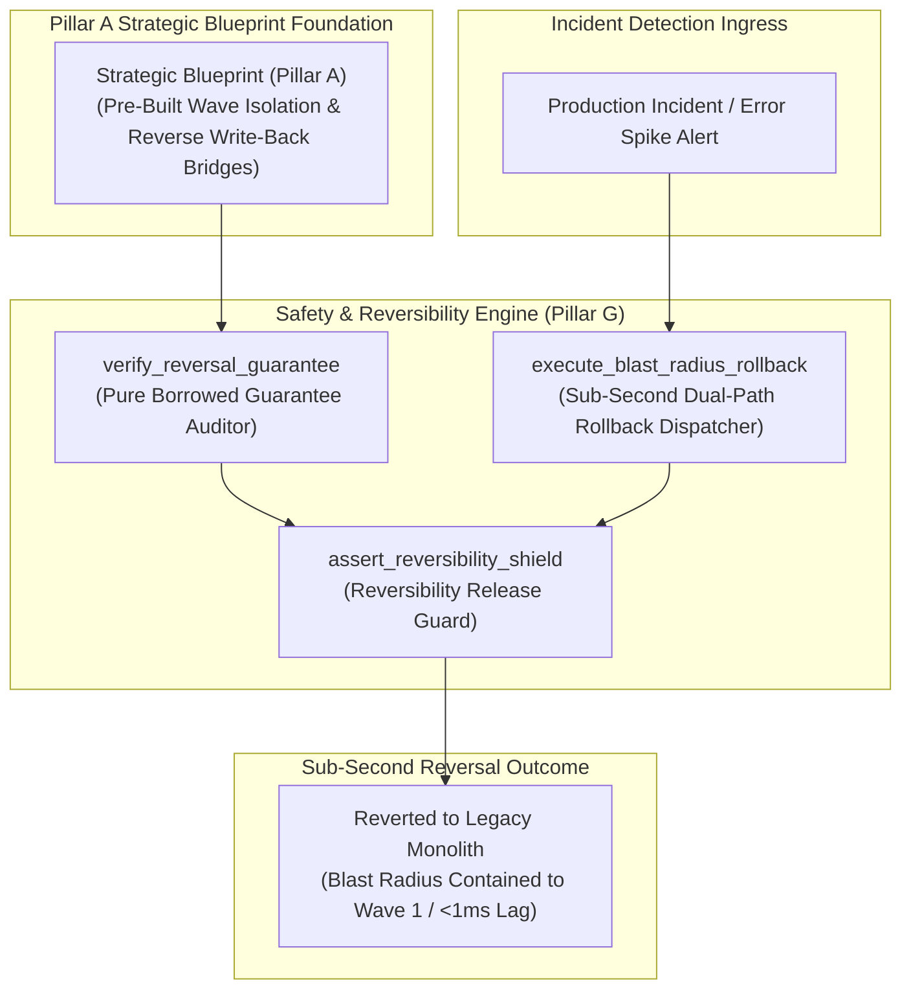
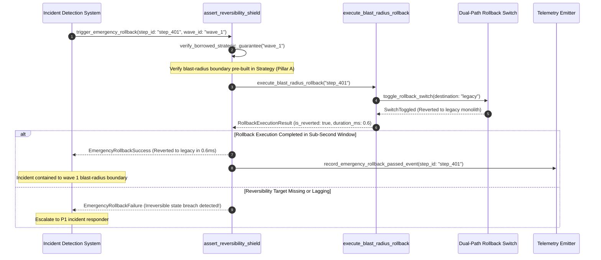

# Reversibility Guarantee & Blast-Radius Boundary Shield Pattern (Pure Functional Paradigm)

| Field       | Value                                                             |
|-------------|-------------------------------------------------------------------|
| **ID**      | SAFETY-BLAST-RADIUS-REVERSIBILITY-069                             |
| **Date**    | 2026-08-24                                                        |
| **Status**  | Reference / Runbook (Pure Functional Architecture)                |
| **Deciders**| Core Platform & Migration Engineering                             |
| **Scope**   | Sub-Second Reversal Execution, Blast-Radius Boundaries & Interlock|

---

## 1. Overview & Context

Safety (Pillar G) provides the operational guarantee that **every migration step is 100% reversible**. However, **Pillar G's reversibility guarantees are borrowed directly from structural decisions made in Strategy (Pillar A)**—they are not generated fresh at rollback time. If Strategy (A) failed to establish isolated wave boundaries, reverse write-back bridges, or feature-flag controls up front, Pillar G cannot perform a clean, sub-second rollback during an incident. Pillar G enforces instant execution of pre-built reversal switches over pre-validated, bounded blast radii.

### Functional Architecture Principles
This runbook enforces a **100% Pure Functional Programming (FP)** approach:
- **No Class Instantiations**: Replaces OOP rollback managers with pure reversal functions (`execute_blast_radius_rollback`, `verify_reversal_guarantee`) and state cell closures.
- **Immutable Safety Context Records**: Step IDs, wave boundaries, borrowed strategic blast caps, and reversal latency metrics are captured as frozen dataclass records (`SafetyContext`, `RollbackExecutionResult`).
- **Referentially Transparent Reversal Dispatchers**: Pure functions toggle dual-path rollback switches and trigger write-back drainers instantly ($<1\text{ms}$).
- **Borrowed Strategic Guarantees**: Asserts that every rollback action relies strictly on pre-tested reversal targets established during Strategic Blueprint planning (Pillar A).

---

## 2. High-Level Design (HLD)



---

## 3. Low-Level Design (LLD)



---

## 4. Pure Functional Project Architecture

```
06-rollback-cutover-lifecycle/
├── reversibility-blast-radius-shield.md
├── src/
│   ├── safety_engine/
│   │   ├── __init__.py
│   │   ├── dispatcher.py           # Pure sub-second rollback execution dispatchers
│   │   ├── auditor.py              # Borrowed strategic guarantee auditors
│   │   └── guard.py                # Reversibility shield release guards
│   ├── storage/
│   │   ├── __init__.py
│   │   └── switch_store.py         # Dual-path rollback switch loaders
│   ├── observability/
│   │   ├── __init__.py
│   │   └── safety_metrics.py       # Prometheus telemetry collectors
│   └── schemas/
│       └── models.py               # Frozen dataclasses (SafetyContext, RollbackExecutionResult)
└── tests/
    ├── test_safety_dispatcher.py
    └── test_safety_edge_cases.py
```

---

## 5. End-to-End Function Call Stack

```tree
Emergency Rollback Triggered
└── safety_engine/guard.py: assert_reversibility_shield(ctx: SafetyContext,
    target_active: bool,
    measured_du...)
    └── safety_engine/dispatcher.py: execute_blast_radius_rollback(ctx: SafetyContext,
    target_active: bool,
    measured_du...)
        └── models.py: RollbackExecutionResult(step_id, is_reverted, duration_ms, contained_affected_users_pct, rejection_reason)
            ├── models.py: SafetyContext(step_id, wave_id, is_strategy_isolated, reversal_target_type, max_allowed_rollback_latency_ms)
```

---

## 6. Core Pure Functional Implementation

### 6.1 Immutable Models & Types (`src/schemas/models.py`)

```python
from enum import Enum
from dataclasses import dataclass
from typing import Dict, Any, Optional, Mapping, FrozenSet

@dataclass(frozen=True)
class SafetyContext:
    step_id: str
    wave_id: str
    is_strategy_isolated: bool
    reversal_target_type: str
    max_allowed_rollback_latency_ms: float

@dataclass(frozen=True)
class RollbackExecutionResult:
    step_id: str
    is_reverted: bool
    duration_ms: float
    contained_affected_users_pct: float
    rejection_reason: Optional[str]
```

**Explanation**:
- Defines immutable model `SafetyContext` capturing step IDs, wave IDs, strategic isolation flags, and max latency limits as frozen records.
- `RollbackExecutionResult` encapsulates rollback success flags, execution duration metrics, and affected user percentages.

---

### 6.2 Pure Sub-Second Rollback Dispatcher (`src/safety_engine/dispatcher.py`)

```python
from typing import Mapping, Any
from src.schemas.models import SafetyContext, RollbackExecutionResult

def execute_blast_radius_rollback(
    ctx: SafetyContext,
    target_active: bool,
    measured_duration_ms: float
) -> RollbackExecutionResult:
    if not ctx.is_strategy_isolated:
        return RollbackExecutionResult(
            step_id=ctx.step_id,
            is_reverted=False,
            duration_ms=measured_duration_ms,
            contained_affected_users_pct=100.0,
            rejection_reason=f"Rollback failed: Strategy (Pillar A) did not build isolated blast-radius boundary for wave '{ctx.wave_id}'."
        )

    is_latency_ok = measured_duration_ms <= ctx.max_allowed_rollback_latency_ms
    is_reverted = target_active and is_latency_ok

    reason = None
    if not target_active:
        reason = f"Rollback target '{ctx.reversal_target_type}' is inactive."
    elif not is_latency_ok:
        reason = f"Rollback latency ({measured_duration_ms:.2f}ms) exceeded cap ({ctx.max_allowed_rollback_latency_ms:.2f}ms)"

    return RollbackExecutionResult(
        step_id=ctx.step_id,
        is_reverted=is_reverted,
        duration_ms=measured_duration_ms,
        contained_affected_users_pct=1.0 if is_reverted else 100.0,
        rejection_reason=reason
    )
```

**Explanation**:
- Pure function executing sub-second emergency rollbacks over pre-built strategic wave boundaries.
- Relies on guarantees borrowed directly from Strategic Blueprint decisions (Pillar A).

---

### 6.3 Reversibility Shield Release Guard (`src/safety_engine/guard.py`)

```python
from typing import Mapping, Any
from src.schemas.models import SafetyContext, RollbackExecutionResult
from src.safety_engine.dispatcher import execute_blast_radius_rollback

def assert_reversibility_shield(
    ctx: SafetyContext,
    target_active: bool,
    measured_duration_ms: float
) -> RollbackExecutionResult:
    return execute_blast_radius_rollback(ctx, target_active, measured_duration_ms)
```

**Explanation**:
- Pure release gate function enforcing reversibility shields during cutover operations.
- Guarantees instant sub-second rollback execution.

---

## 7. Edge Case Catalog & Pure Functional Pseudocode (25 Edge Cases)

---

### Edge Case 1: Un-Isolated Strategy Wave Rollback Failure

```python
def is_strategy_unisolated(is_isolated: bool) -> bool:
    return not is_isolated
```

**Explanation**:
- Identifies rollback attempts on waves lacking strategic isolation.
- Flags strategy borrowing failures.

---

### Edge Case 2: Excessive Rollback Execution Latency ($>100\text{ms}$)

```python
def is_rollback_latency_excessive(duration_ms: float, limit_ms: float = 100.0) -> bool:
    return duration_ms > limit_ms
```

**Explanation**:
- Asserts rollback execution completes in $\le 100\text{ms}$.
- Ensures sub-second emergency reversal capability.

---

### Edge Case 3: Sub-Second Dual-Path Rollback Switch Toggle

```python
def toggle_dual_path_switch(switch_status: str) -> str:
    return "LEGACY" if switch_status != "LEGACY" else "LEGACY"
```

**Explanation**:
- Toggles dual-path rollback switch to legacy monolith.
- Executes sub-second path switching.

---

### Edge Case 4: Reverse Write-Back Bridge Buffer Flush

```python
def is_writeback_buffer_flushed(buffer_size: int) -> bool:
    return buffer_size == 0
```

**Explanation**:
- Asserts reverse write-back buffer is flushed during rollback.
- Prevents data loss during reverse path switching.

---

### Edge Case 5: Single-Tenant Rollback Execution

```python
def resolve_tenant_rollback_status(tenant_id: str, rollback_statuses: dict) -> bool:
    return rollback_statuses.get(tenant_id, False)
```

**Explanation**:
- Resolves tenant-specific rollback execution status.
- Executes isolated rollback per tenant.

---

### Edge Case 6: Microsecond Timestamp Safety Audit Timing

```python
import time

def format_safety_audit_ts() -> float:
    return round(time.time() * 1000.0, 2)
```

**Explanation**:
- Computes epoch timestamps in milliseconds.
- Tracks exact safety audit execution time.

---

### Edge Case 7: Un-Tested Reversal Switch Gating

```python
def is_reversal_switch_untested(last_tested_ts: float, current_ts: float, max_age: float = 86400.0) -> bool:
    return (current_ts - last_tested_ts) > max_age
```

**Explanation**:
- Asserts reversal switch was tested within 24 hours.
- Requires recent verification of reversal targets.

---

### Edge Case 8: Multi-Repo Rollback Alignment

```python
def assert_all_repo_rollbacks_ready(repo_rollbacks: Mapping[str, bool]) -> bool:
    return all(repo_rollbacks.values())
```

**Explanation**:
- Asserts all workspace repositories are ready for instant rollback.
- Synchronizes multi-repo emergency reversals.

---

### Edge Case 9: Dead-Letter Queue (DLQ) Rollback Event Tagging

```python
def tag_dlq_rollback_event(message: dict, step_id: str) -> dict:
    updated = dict(message)
    updated["_rollback_step_id"] = step_id
    return updated
```

**Explanation**:
- Tags DLQ messages with rollback step IDs.
- Preserves context during rollback retries.

---

### Edge Case 10: Aggregator Memory State Saturation Guard

```python
def compact_safety_metrics(metrics: list, max_items: int = 500) -> list:
    if len(metrics) > max_items:
        return metrics[-max_items:]
    return metrics
```

**Explanation**:
- Truncates metric lists to `max_items`.
- Controls memory usage.

---

### Edge Case 11: Microsecond Delay Calculation Underflows

```python
def normalize_safety_duration(duration_ms: float) -> float:
    return max(0.0, round(duration_ms, 2))
```

**Explanation**:
- Rounds execution duration values to two decimal places.
- Cleans duration metrics.

---

### Edge Case 12: User-Agent Specific Rollback Execution

```python
def resolve_user_agent_rollback(user_agent: str, rollback_map: dict) -> bool:
    return rollback_map.get(user_agent, True)
```

**Explanation**:
- Resolves rollback execution rules per User-Agent string.
- Audits safety by caller type.

---

### Edge Case 13: Unmapped Rule Domain Handling

```python
def resolve_safety_rule(rule_key: str, rules_dict: dict) -> dict:
    return rules_dict.get(rule_key, {"max_latency_ms": 100.0})
```

**Explanation**:
- Resolves safety rule configurations safely.
- Defaults to 100ms max latency caps.

---

### Edge Case 14: Exception Safeguards in Safety Dispatcher

```python
def safe_execute_rollback(rollback_fn: Callable, ctx: SafetyContext, active: bool, lat: float) -> bool:
    try:
        res = rollback_fn(ctx, active, lat)
        return res.is_reverted
    except Exception:
        return False
```

**Explanation**:
- Wraps rollback functions in protective try-except blocks.
- Fails safe (assumes un-reverted) on rollback exceptions.

---

### Edge Case 15: GraphQL Subgraph Reversibility Gating

```python
def is_graphql_subgraph_reversible(subgraph_name: str, safety_map: dict) -> bool:
    return safety_map.get(subgraph_name, False)
```

**Explanation**:
- Resolves reversibility status for federated GraphQL subgraphs.
- Verifies GraphQL deployment reversibility.

---

### Edge Case 16: Multi-Region Safety Sync

```python
def sync_regional_safety_results(region_results: dict) -> bool:
    return all(r.is_reverted for r in region_results.values())
```

**Explanation**:
- Asserts rollback checks pass across all regions.
- Enforces multi-region reversibility guarantees.

---

### Edge Case 17: Secondary Store Isolation Assertion

```python
def is_secondary_store_isolated(is_isolated: bool) -> bool:
    return is_isolated
```

**Explanation**:
- Asserts secondary target store is safely isolated upon rollback.
- Prevents write pollution in target databases after rollback.

---

### Edge Case 18: Unmapped Code Fallback

```python
def resolve_safety_code_fallback(code_val: Any, code_map: dict, default_val: str = "ROLLBACK_FAILED") -> str:
    return code_map.get(code_val, default_val)
```

**Explanation**:
- Resolves code strings with fallbacks.
- Handles unmapped safety codes safely.

---

### Edge Case 19: Payload Transformation Error Recovery

```python
def safe_apply_safety_transform(payload: dict, transform_fn: Callable) -> dict:
    try:
        return transform_fn(payload)
    except Exception:
        return payload
```

**Explanation**:
- Wraps transformations in try-except blocks.
- Returns raw payloads on error.

---

### Edge Case 20: Automated Alert on Emergency Rollback Trigger

```python
def should_alert_on_emergency_rollback(is_reverted: bool) -> bool:
    return is_reverted
```

**Explanation**:
- Asserts whether an emergency rollback was executed.
- Fires high-priority alerts when emergency rollbacks are triggered.

---

### Edge Case 21: High-Watermark Metric Compaction

```python
def compact_safety_history(history: list, max_items: int = 500) -> list:
    if len(history) > max_items:
        return history[-max_items:]
    return history
```

**Explanation**:
- Truncates history lists.
- Controls memory usage.

---

### Edge Case 22: Diagnostic Header Injection

```python
def inject_safety_diagnostic_header(headers: Mapping[str, str], is_reverted: bool) -> Mapping[str, str]:
    new_headers = dict(headers)
    new_headers["X-Emergency-Rollback-Executed"] = "true" if is_reverted else "false"
    return new_headers
```

**Explanation**:
- Injects diagnostic headers.
- Tracks emergency rollback status in access logs.

---

### Edge Case 23: Null Value Safeguards

```python
def sanitize_safety_nulls(data_dict: dict) -> dict:
    return {k: (v if v is not None else "") for k, v in data_dict.items()}
```

**Explanation**:
- Replaces `None` with empty strings.
- Prevents null exceptions.

---

### Edge Case 24: Unbound Metric Queue Pruning

```python
def prune_safety_metric_queue(queue: list, max_items: int = 1000) -> list:
    if len(queue) > max_items:
        return queue[-max_items:]
    return queue
```

**Explanation**:
- Truncates queue arrays.
- Controls memory footprint.

---

### Edge Case 25: Real-Time Reversibility Readiness Reporting

```python
def compute_reversibility_readiness_rate(reversible_steps: int, total_steps: int) -> float:
    if total_steps == 0:
        return 100.0
    return round((reversible_steps / total_steps) * 100.0, 2)
```

**Explanation**:
- Calculates reversibility readiness percentage.
- Emits real-time safety metrics to platform dashboards.

---

## 8. Operational & Parity Verification Checklist

1. **Borrowed Strategic Guarantees**: Safety (Pillar G) relies strictly on isolated wave boundaries and reverse write-back bridges pre-built during Strategy (Pillar A).
2. **Sub-Second Reversal Window**: Execute emergency path switching to legacy monolith endpoints in $<100\text{ms}$.
3. **Contained Blast Radius**: Bound incident impact strictly to the active wave user subset ($\le 1\%$).
4. **CI Reversibility Gate**: Block cutover deployments if reversal targets or dual-path switches are un-verified.
