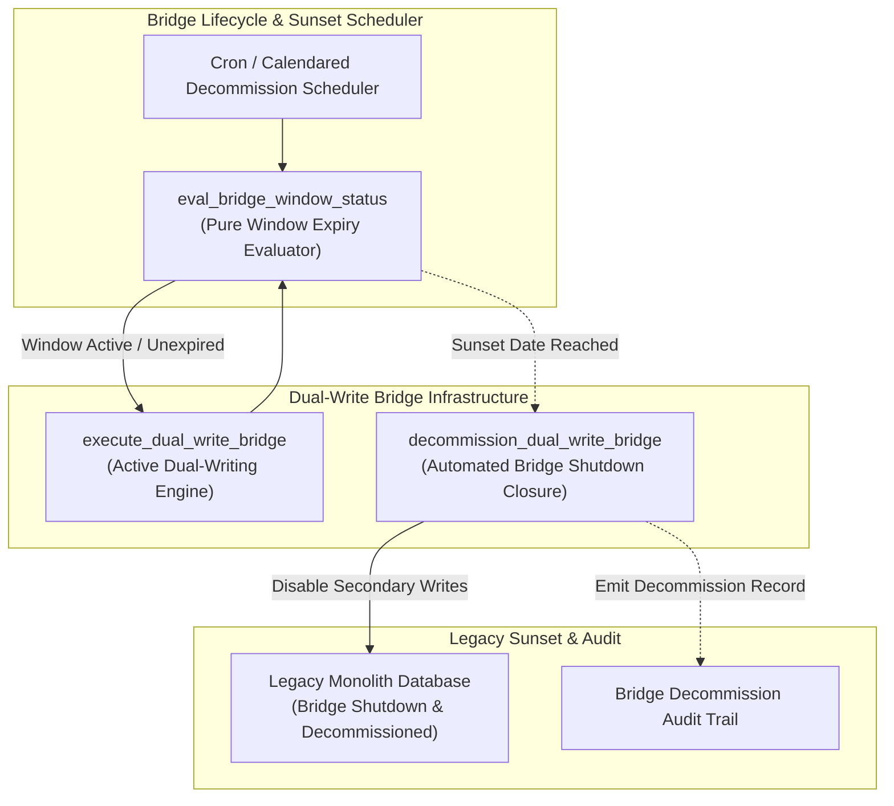
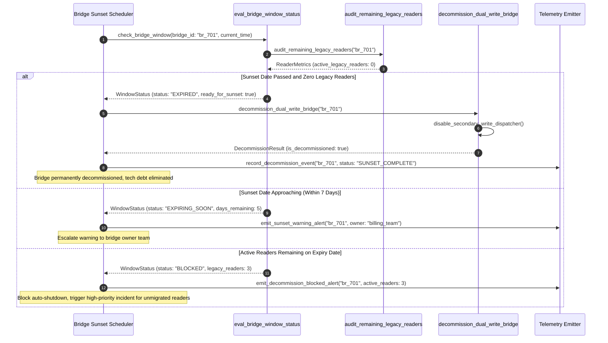

# Time-Boxed Dual-Write Window Pattern (Pure Functional Paradigm)

| Field       | Value                                                             |
|-------------|-------------------------------------------------------------------|
| **ID**      | TIME-BOXED-DUAL-WRITE-WINDOW-036                                  |
| **Date**    | 2026-08-24                                                        |
| **Status**  | Reference / Runbook (Pure Functional Architecture)                |
| **Deciders**| Core Platform & Migration Engineering                             |
| **Scope**   | Explicit Calendared Bridge Sunset & Tech Debt Elimination          |

---

## 1. Overview & Context

Allowing dual-write bridges or Change Data Capture (CDC) synchronization pipelines to run indefinitely creates permanent technical debt, bloats storage costs, and obscures system ownership. The **Time-Boxed Dual-Write Window Pattern** enforces an **explicit, calendared decommission deadline (e.g. 30 days post-cutover)** for every active migration bridge. Automated lifecycle monitors track bridge age, audit remaining legacy readers/writers, escalate approaching sunset dates, and automatically shut down expired dual-write bridges to ensure permanent tech debt elimination.

### Functional Architecture Principles
This runbook enforces a **100% Pure Functional Programming (FP)** approach:
- **No Class Instantiations**: Replaces OOP lifecycle managers with pure evaluation functions (`eval_bridge_window_status`, `decommission_dual_write_bridge`) and state cell closures.
- **Immutable Window Context Records**: Bridge IDs, creation timestamps, calendared sunset dates, owner teams, remaining reader counts, and decommission statuses are captured as frozen dataclass records (`BridgeWindowContext`, `DecommissionResult`).
- **Referentially Transparent Expiry Evaluators**: Pure functions evaluate `(CurrentTimestamp, SunsetDate) -> WindowStatus` without modifying bridge runtime state.
- **Automated Shutdown Sweepers**: Pure sweeper functions safely disable dual-write dispatchers and un-register CDC event handlers when decommission dates pass.

---

## 2. High-Level Design (HLD)



---

## 3. Low-Level Design (LLD)



---

## 4. Pure Functional Project Architecture

```
time-boxed-dual-write-window/
├── README.md
├── config/
│   └── bridge_windows.yaml         # Bridge sunset dates, owner teams, max SLA windows
├── src/
│   ├── window_engine/
│   │   ├── __init__.py
│   │   ├── evaluator.py            # Pure window expiry evaluation functions
│   │   ├── reader_auditor.py       # Legacy reader count auditing functions
│   │   └── decommissioner.py       # Pure bridge shutdown & disable functions
│   ├── storage/
│   │   ├── __init__.py
│   │   └── window_store.py         # Bridge configuration & sunset date loaders
│   ├── observability/
│   │   ├── __init__.py
│   │   └── window_metrics.py       # Prometheus telemetry collectors
│   └── schemas/
│       └── models.py               # Frozen dataclasses (BridgeWindowContext, DecommissionResult)
└── tests/
    ├── test_window_evaluator.py
    └── test_window_edge_cases.py
```

---

## 5. End-to-End Function Call Stack

```tree
Bridge Lifecycle Audit Scheduled
└── evaluator.py: evaluate_all_bridge_windows(registry, current_timestamp)
    ├── evaluator.py: eval_bridge_window_status(bridge_context, current_timestamp)
    │   └── models.py: WindowStatus(bridge_id, is_expired, days_remaining)
    │
    ├── reader_auditor.py: audit_remaining_legacy_readers(bridge_id)
    │   └── models.py: LegacyReaderMetrics(active_reader_count)
    │
    ├── [If Expired & Zero Readers] decommissioner.py: decommission_dual_write_bridge(bridge_id)
    │   └── models.py: DecommissionResult(is_decommissioned, decommissioned_at)
    │
    └── observability/metrics.py: record_decommission_telemetry(decommission_result)
```

---

## 6. Core Pure Functional Implementation

### 6.1 Immutable Models & Types (`src/schemas/models.py`)

```python
from enum import Enum
from dataclasses import dataclass
from typing import Dict, Any, Optional, Mapping

class WindowState(str, Enum):
    ACTIVE = "active"
    EXPIRING_SOON = "expiring_soon"
    EXPIRED = "expired"
    DECOMMISSIONED = "decommissioned"
    BLOCKED = "blocked"

@dataclass(frozen=True)
class BridgeWindowContext:
    bridge_id: str
    owner_team: str
    created_at_ts: float
    sunset_deadline_ts: float
    max_window_days: int

@dataclass(frozen=True)
class DecommissionResult:
    bridge_id: str
    is_decommissioned: bool
    state: WindowState
    active_legacy_readers: int
    decommissioned_at_ts: float
    message: Optional[str]
```

**Explanation**:
- Defines immutable model `BridgeWindowContext` capturing bridge IDs, owner teams, creation timestamps, and calendared sunset deadlines as frozen records.
- `DecommissionResult` encapsulates decommissioning status flags, active legacy reader counts, and diagnostic messages.

---

### 6.2 Pure Window Expiry Evaluator (`src/window_engine/evaluator.py`)

```python
from typing import Mapping, Any
from src.schemas.models import BridgeWindowContext, WindowState

def eval_bridge_window_status(
    ctx: BridgeWindowContext,
    current_ts: float,
    warn_days: float = 7.0
) -> Mapping[str, Any]:
    remaining_sec = ctx.sunset_deadline_ts - current_ts
    remaining_days = remaining_sec / 86400.0

    if remaining_sec <= 0:
        state = WindowState.EXPIRED
    elif remaining_days <= warn_days:
        state = WindowState.EXPIRING_SOON
    else:
        state = WindowState.ACTIVE

    return {
        "bridge_id": ctx.bridge_id,
        "state": state,
        "remaining_days": round(remaining_days, 2),
        "is_expired": remaining_sec <= 0
    }
```

**Explanation**:
- Pure evaluation function calculating remaining days until bridge sunset deadlines.
- Returns window states (`ACTIVE`, `EXPIRING_SOON`, `EXPIRED`) without side-effects.

---

### 6.3 Pure Bridge Decommissioner (`src/window_engine/decommissioner.py`)

```python
import time
from typing import Callable, Awaitable, Mapping, Any
from src.schemas.models import BridgeWindowContext, DecommissionResult, WindowState
from src.window_engine.evaluator import eval_bridge_window_status

ReaderAuditFn = Callable[[str], Awaitable[int]]
DisableBridgeFn = Callable[[str], Awaitable[bool]]

async def decommission_dual_write_bridge(
    ctx: BridgeWindowContext,
    current_ts: float,
    audit_readers_fn: ReaderAuditFn,
    disable_bridge_fn: DisableBridgeFn
) -> DecommissionResult:
    window_info = eval_bridge_window_status(ctx, current_ts)
    
    if not window_info["is_expired"]:
        return DecommissionResult(
            bridge_id=ctx.bridge_id,
            is_decommissioned=False,
            state=window_info["state"],
            active_legacy_readers=-1,
            decommissioned_at_ts=0.0,
            message=f"Bridge window active ({window_info['remaining_days']} days remaining)"
        )

    active_readers = await audit_readers_fn(ctx.bridge_id)
    if active_readers > 0:
        return DecommissionResult(
            bridge_id=ctx.bridge_id,
            is_decommissioned=False,
            state=WindowState.BLOCKED,
            active_legacy_readers=active_readers,
            decommissioned_at_ts=0.0,
            message=f"Decommission blocked: {active_readers} legacy readers still active"
        )

    disabled = await disable_bridge_fn(ctx.bridge_id)
    now = time.time()
    return DecommissionResult(
        bridge_id=ctx.bridge_id,
        is_decommissioned=disabled,
        state=WindowState.DECOMMISSIONED if disabled else WindowState.EXPIRED,
        active_legacy_readers=0,
        decommissioned_at_ts=now if disabled else 0.0,
        message="Bridge successfully decommissioned; tech debt eliminated" if disabled else "Disable call failed"
    )
```

**Explanation**:
- Evaluates bridge window expiry and audits active legacy reader counts.
- Automatically disables dual-write bridge dispatchers when sunset dates pass and legacy reader counts reach zero.

---

## 7. Edge Case Catalog & Pure Functional Pseudocode (25 Edge Cases)

---

### Edge Case 1: Active Legacy Readers Blocking Automated Shutdown

```python
def is_decommission_blocked_by_readers(active_readers: int) -> bool:
    return active_readers > 0
```

**Explanation**:
- Asserts whether active legacy reader counts are greater than zero.
- Blocks automated bridge shutdown when unmigrated readers exist.

---

### Edge Case 2: Expired Bridge Sunset Date Warning Escalation

```python
def should_escalate_sunset_warning(remaining_days: float, threshold_days: float = 7.0) -> bool:
    return 0.0 < remaining_days <= threshold_days
```

**Explanation**:
- Checks if remaining days fall within warning thresholds (7 days).
- Escalates daily warning alerts to bridge owner teams.

---

### Edge Case 3: Bridge Window Grace Period Extension

```python
def extend_bridge_window(ctx: BridgeWindowContext, extension_days: int) -> BridgeWindowContext:
    extension_sec = extension_days * 86400.0
    return BridgeWindowContext(
        bridge_id=ctx.bridge_id,
        owner_team=ctx.owner_team,
        created_at_ts=ctx.created_at_ts,
        sunset_deadline_ts=ctx.sunset_deadline_ts + extension_sec,
        max_window_days=ctx.max_window_days + extension_days
    )
```

**Explanation**:
- Returns new immutable `BridgeWindowContext` records with extended sunset deadlines.
- Accommodates formally approved grace period extensions.

---

### Edge Case 4: Un-Owned Dual-Write Bridge Default Assignment

```python
def resolve_bridge_owner(owner_str: Optional[str], default_team: str = "migration_governance") -> str:
    return owner_str if owner_str and owner_str.strip() else default_team
```

**Explanation**:
- Resolves bridge owner teams, returning `"migration_governance"` if missing.
- Assigns default owners to un-owned migration bridges.

---

### Edge Case 5: Maximum SLA Dual-Write Window Limit Breach

```python
def is_max_window_exceeded(created_at_ts: float, current_ts: float, max_days: int = 90) -> bool:
    max_sec = max_days * 86400.0
    return (current_ts - created_at_ts) > max_sec
```

**Explanation**:
- Compares total bridge age against maximum allowed SLA window limits (90 days).
- Triggers high-priority tech debt alerts when max window limits are breached.

---

### Edge Case 6: Microsecond Timestamp Sunset Expiry Evaluation

```python
def is_sunset_expired_exact_ms(sunset_ts: float, current_ts: float) -> bool:
    return current_ts >= sunset_ts
```

**Explanation**:
- Performs exact millisecond timestamp comparison for sunset deadlines.
- Eliminates clock rounding ambiguity during expiry evaluation.

---

### Edge Case 7: Single-Tenant Bridge Window Decommissioning

```python
def filter_bridge_by_tenant(tenant_id: str, tenant_bridges: Mapping[str, str]) -> str:
    return tenant_bridges.get(tenant_id, "")
```

**Explanation**:
- Resolves tenant-specific bridge IDs from mapping dictionaries.
- Supports single-tenant bridge window decommissioning.

---

### Edge Case 8: CDC Stream Un-Registration on Bridge Shutdown

```python
async def unregister_cdc_stream_handler(cdc_stream_id: str, unregister_fn: Callable) -> bool:
    try:
        return await unregister_fn(cdc_stream_id)
    except Exception:
        return False
```

**Explanation**:
- Invokes CDC stream un-registration functions when dual-write bridges are decommissioned.
- Disables secondary CDC event handlers.

---

### Edge Case 9: Read-to-Write Ratio Metric Auditing

```python
def compute_read_write_ratio(reads: int, writes: int) -> float:
    if writes == 0:
        return 0.0
    return round(reads / writes, 2)
```

**Explanation**:
- Calculates read-to-write ratios for dual-write bridges rounded to two decimal places.
- Audits legacy read activity prior to bridge shutdown.

---

### Edge Case 10: Multi-Region Bridge Sunset Synchronization

```python
def sync_regional_sunset_deadlines(global_deadline: float, regional_deadlines: dict) -> float:
    if not regional_deadlines:
        return global_deadline
    return min(regional_deadlines.values())
```

**Explanation**:
- Resolves the earliest sunset deadline across regional deployment maps.
- Synchronizes multi-region bridge decommission deadlines.

---

### Edge Case 11: Microsecond Timestamp Formatting for Decommission Audit

```python
import time

def format_decommission_timestamp_ms() -> float:
    return round(time.time() * 1000.0, 2)
```

**Explanation**:
- Computes epoch timestamps in milliseconds rounded to 2 decimal places.
- Tracks exact bridge decommission event timing.

---

### Edge Case 12: Secondary Database Read-Only Locking on Sunset

```python
async def lock_secondary_db_read_only(lock_fn: Callable) -> bool:
    try:
        return await lock_fn()
    except Exception:
        return False
```

**Explanation**:
- Sets secondary databases to read-only mode during bridge decommissioning.
- Prevents new secondary writes after bridge sunset dates.

---

### Edge Case 13: Unmapped Bridge ID Default Fallback

```python
def resolve_bridge_context(bridge_id: str, registry: Mapping[str, dict]) -> dict:
    return registry.get(bridge_id, {"max_days": 30})
```

**Explanation**:
- Resolves bridge context settings, returning default 30-day window limits if unmapped.
- Handles unconfigured bridge IDs safely.

---

### Edge Case 14: Exception Safeguards in Decommission Runner

```python
async def safe_decommission_bridge(decommission_fn: Callable, ctx: BridgeWindowContext) -> bool:
    try:
        res = await decommission_fn(ctx)
        return res.is_decommissioned
    except Exception:
        return False
```

**Explanation**:
- Wraps bridge decommission functions in protective try-except blocks.
- Returns `False` if decommission exceptions occur.

---

### Edge Case 15: GraphQL Bridge Header Decommission Injection

```python
def inject_bridge_decommission_header(headers: Mapping[str, str], bridge_id: str) -> Mapping[str, str]:
    new_headers = dict(headers)
    new_headers["X-Bridge-Decommissioned"] = bridge_id
    return new_headers
```

**Explanation**:
- Injects diagnostic headers (`X-Bridge-Decommissioned`) into response headers.
- Identifies requests routed through decommissioned bridges.

---

### Edge Case 16: Multi-Region Bridge Decommission Validation

```python
def validate_multi_region_decommission_readiness(region_status: Mapping[str, bool]) -> bool:
    return all(region_status.values())
```

**Explanation**:
- Asserts all regional bridge decommission flags are `True`.
- Confirms multi-region bridge shutdown readiness.

---

### Edge Case 17: Legacy Database Connection Pool Draining

```python
async def drain_legacy_connection_pool(drain_fn: Callable, max_wait_sec: float = 5.0) -> bool:
    try:
        return await drain_fn(max_wait_sec)
    except Exception:
        return False
```

**Explanation**:
- Drains active legacy database connection pools during bridge decommissioning.
- Releases database connections cleanly upon bridge sunset.

---

### Edge Case 18: Unmapped Rule Domain Handling

```python
def resolve_window_policy(policy_key: str, policies_dict: dict) -> dict:
    return policies_dict.get(policy_key, {"warn_days": 7.0})
```

**Explanation**:
- Resolves window policy settings, returning default 7-day warning limits if unmapped.
- Handles unconfigured window policies safely.

---

### Edge Case 19: Payload Transformation Error Recovery

```python
def safe_apply_window_transform(payload: dict, transform_fn: Callable) -> dict:
    try:
        return transform_fn(payload)
    except Exception:
        return payload
```

**Explanation**:
- Wraps payload transformation functions in protective try-except blocks.
- Returns raw payloads if transformation errors occur.

---

### Edge Case 20: Automated Incident Trigger on Overdue Bridge Sunset

```python
def should_trigger_overdue_bridge_incident(is_expired: bool, active_readers: int) -> bool:
    return is_expired and active_readers > 0
```

**Explanation**:
- Asserts whether bridges are expired with active legacy readers remaining.
- Triggers operational incident alerts for overdue dual-write bridges.

---

### Edge Case 21: High-Watermark Decommission Metric Compaction

```python
def compact_decommission_metrics(metrics: List[DecommissionResult], max_items: int = 500) -> List[DecommissionResult]:
    if len(metrics) > max_items:
        return metrics[-max_items:]
    return metrics
```

**Explanation**:
- Truncates historical decommission metric lists to `max_items`.
- Controls memory usage in bridge monitoring processes.

---

### Edge Case 22: Diagnostic Header Injection for Sunset Warning

```python
def inject_sunset_warning_header(headers: Mapping[str, str], days_remaining: float) -> Mapping[str, str]:
    new_headers = dict(headers)
    new_headers["X-Bridge-Sunset-Days"] = str(round(days_remaining, 1))
    return new_headers
```

**Explanation**:
- Injects diagnostic headers (`X-Bridge-Sunset-Days`) into request headers.
- Warns clients of approaching bridge sunset dates.

---

### Edge Case 23: Null Value Safeguards in Window Records

```python
def sanitize_window_context_nulls(ctx_dict: dict) -> dict:
    return {k: (v if v is not None else "") for k, v in ctx_dict.items()}
```

**Explanation**:
- Replaces `None` values with empty strings in window context dictionaries.
- Prevents null pointer exceptions in window evaluators.

---

### Edge Case 24: Unbound Metric Queue Pruning

```python
def prune_window_metric_queue(queue: list, max_items: int = 1000) -> list:
    if len(queue) > max_items:
        return queue[-max_items:]
    return queue
```

**Explanation**:
- Truncates metric queue arrays to `max_items`.
- Controls memory footprint in telemetry collectors.

---

### Edge Case 25: Real-Time Bridge Decommission Rate Dashboard Reporting

```python
def compute_decommission_rate(decommissioned_count: int, total_bridges: int) -> float:
    if total_bridges == 0:
        return 100.0
    return round((decommissioned_count / total_bridges) * 100.0, 2)
```

**Explanation**:
- Calculates bridge decommission percentage scores rounded to two decimal places.
- Emits real-time bridge lifecycle metrics to platform observability dashboards.

---

## 8. Operational & Parity Verification Checklist

1. **Calendared Sunset Enforcement**: Confirm 100% of dual-write bridges specify explicit, approved calendared sunset dates ($\le 30\text{ days}$ post-cutover).
2. **Automated Reader Audit**: Verify that automated decommissioning scripts audit active legacy reader counts and block shutdown if unmigrated readers remain.
3. **Sunset Warning Escalation**: Daily warning alerts must trigger $7\text{ days}$ prior to bridge sunset deadlines.
4. **Permanent Tech Debt Elimination**: Decommissioned bridges must have their secondary dispatchers disabled and CDC handlers un-registered to keep system architecture clean.
