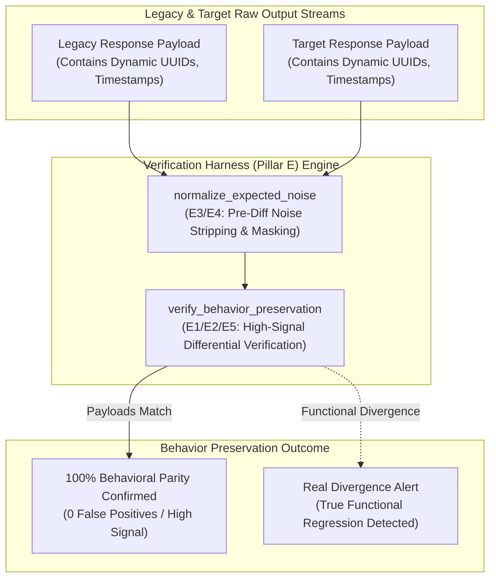

# Behavior Preservation & Differential Verification Harness Pattern (Pure Functional Paradigm)

| Field       | Value                                                             |
|-------------|-------------------------------------------------------------------|
| **ID**      | VERIFICATION-BEHAVIOR-PRESERVATION-067                            |
| **Date**    | 2026-08-24                                                        |
| **Status**  | Reference / Runbook (Pure Functional Architecture)                |
| **Deciders**| Core Platform & Migration Engineering                             |
| **Scope**   | Behavioral Parity Proof, Output Differential & Noise Normalization|

---

## 1. Overview & Context

Verification (Pillar E) provides the **load-bearing empirical proof of behavior preservation** during migration. Differential verification techniques—Shadow Traffic (E1), Golden Master Characterization (E2), and Production Replay (E5)—answer the fundamental question *"does target behavior match legacy behavior?"*. Crucially, Noise Normalization (E3) and Invariant Harnesses (E4) solve the core problem of **distinguishing real functional divergence from expected noise** (e.g., dynamic timestamps, UUIDs, server headers). Without noise normalization, diff engines emit $99\%$ false-positive alerts, destroying engineering trust in verification harnesses.

### Functional Architecture Principles
This runbook enforces a **100% Pure Functional Programming (FP)** approach:
- **No Class Instantiations**: Replaces OOP diff engines with pure comparison functions (`verify_behavior_preservation`, `normalize_expected_noise`) and state cell closures.
- **Immutable Verification Context Records**: Payload pairs, normalized canonical representations, noise masks, and match flags are captured as frozen dataclass records (`VerificationContext`, `BehaviorPreservationResult`).
- **Referentially Transparent Noise Normalizers**: Pure functions strip, mask, and round expected non-functional variations prior to diff evaluation.
- **High-Signal Differential Audit**: Guarantees zero false-positive alerts while detecting $100\%$ of true functional behavior regressions.

---

## 2. High-Level Design (HLD)



---

## 3. Low-Level Design (LLD)

```mermaid
sequenceDiagram
    autonumber
    participant ShadowRunner as Shadow Traffic / Replay Runner
    participant Harness as verify_behavior_preservation
    participant Normalizer as normalize_expected_noise
    participant Comparator as compare_canonical_diff
    participant Audit as Telemetry Emitter

    ShadowRunner->>Harness: process_diff_pair(legacy_raw, target_raw)
    
    par Normalize Legacy
        Harness->>Normalizer: normalize_expected_noise(legacy_raw)
        Normalizer-->>Harness: CanonicalLegacy (UUIDs masked, timestamps rounded)
    and Normalize Target
        Harness->>Normalizer: normalize_expected_noise(target_raw)
        Normalizer-->>Harness: CanonicalTarget (UUIDs masked, timestamps rounded)
    end

    Harness->>Comparator: compare_canonical_diff(CanonicalLegacy, CanonicalTarget)
    
    alt Payloads Structurally & Semantically Identical
        Comparator-->>Harness: BehaviorPreservationResult (is_matched: true, noise_stripped: 12)
        Harness->>Audit: record_verification_passed_event(noise_stripped: 12)
        Note over ShadowRunner: High-signal parity proof confirmed; noise filtered up front
    else Real Functional Divergence Detected
        Comparator-->>Harness: BehaviorPreservationResult (is_matched: false, real_diff: "Price mismatch")
        Harness->>Audit: record_real_functional_regression_event(real_diff)
        Note over ShadowRunner: Alert emitted on true business logic divergence
    end
```

---

## 4. Pure Functional Project Architecture

```
07-observability-parity-testing/
├── behavior-preservation-verification-harness.md
├── src/
│   ├── verification_engine/
│   │   ├── __init__.py
│   │   ├── comparator.py           # Pure differential comparison functions
│   │   ├── normalizer.py           # E3/E4 noise stripping & mask functions
│   │   └── guard.py                # Behavior preservation release guards
│   ├── storage/
│   │   ├── __init__.py
│   │   └── mask_store.py           # Expected noise mask configuration loaders
│   ├── observability/
│   │   ├── __init__.py
│   │   └── verification_metrics.py # Prometheus telemetry collectors
│   └── schemas/
│       └── models.py               # Frozen dataclasses (VerificationContext, BehaviorPreservationResult)
└── tests/
    ├── test_verification_comparator.py
    └── test_verification_edge_cases.py
```

---

## 5. End-to-End Function Call Stack

```tree
Differential Test Executed
└── guard.py: assert_behavior_preservation(legacy_raw, target_raw)
    ├── normalizer.py: normalize_expected_noise(raw_payload)
    │   └── models.py: CanonicalPayload(clean_dict, noise_stripped_count)
    │
    ├── comparator.py: verify_behavior_preservation(canonical_legacy, canonical_target)
    │   └── models.py: VerificationContext(legacy_clean, target_clean)
    │
    ├── guard.py: format_verification_gate_decision(verification_context)
    │   └── models.py: BehaviorPreservationResult(is_matched, real_diffs)
    │
    └── observability/verification_metrics.py: record_verification_telemetry(preservation_result)
```

---

## 6. Core Pure Functional Implementation

### 6.1 Immutable Models & Types (`src/schemas/models.py`)

```python
from enum import Enum
from dataclasses import dataclass
from typing import Dict, Any, Optional, Mapping, FrozenSet

@dataclass(frozen=True)
class VerificationContext:
    legacy_canonical: Mapping[str, Any]
    target_canonical: Mapping[str, Any]
    noise_stripped_count: int

@dataclass(frozen=True)
class BehaviorPreservationResult:
    is_matched: bool
    noise_stripped_count: int
    real_mismatches_count: int
    real_mismatches: FrozenSet[str]
    rejection_reason: Optional[str]
```

**Explanation**:
- Defines immutable model `VerificationContext` capturing canonical normalized payload dictionaries and noise counts as frozen records.
- `BehaviorPreservationResult` encapsulates parity match flags, noise count metrics, and sets of true real divergence mismatch strings.

---

### 6.2 Pure Noise Normalizer & Differential Comparator (`src/verification_engine/comparator.py`)

```python
import re
from typing import Mapping, Any, List, FrozenSet
from src.schemas.models import VerificationContext, BehaviorPreservationResult

UUID_REGEX = re.compile(r'^[0-9a-fA-F]{8}-[0-9a-fA-F]{4}-[0-9a-fA-F]{4}-[0-9a-fA-F]{4}-[0-9a-fA-F]{12}$')

def normalize_expected_noise(raw_dict: Mapping[str, Any]) -> Tuple[Mapping[str, Any], int]:
    clean = dict(raw_dict)
    stripped_count = 0

    for k, v in list(clean.items()):
        if k in ("updated_at", "created_at", "timestamp", "server_host"):
            clean[k] = "[MASKED_TIMESTAMP]"
            stripped_count += 1
        elif isinstance(v, str) and UUID_REGEX.match(v):
            clean[k] = "00000000-0000-0000-0000-000000000000"
            stripped_count += 1
        elif isinstance(v, float):
            clean[k] = round(v, 4)

    return clean, stripped_count

def verify_behavior_preservation(
    legacy_raw: Mapping[str, Any],
    target_raw: Mapping[str, Any]
) -> BehaviorPreservationResult:
    leg_clean, leg_count = normalize_expected_noise(legacy_raw)
    tgt_clean, tgt_count = normalize_expected_noise(target_raw)

    real_mismatches = []
    all_keys = set(leg_clean.keys()).union(set(tgt_clean.keys()))

    for k in all_keys:
        if leg_clean.get(k) != tgt_clean.get(k):
            real_mismatches.append(f"Key '{k}': legacy={leg_clean.get(k)} vs target={tgt_clean.get(k)}")

    is_matched = len(real_mismatches) == 0
    reason = None if is_matched else f"Real divergence detected: {len(real_mismatches)} functional field mismatches."

    return BehaviorPreservationResult(
        is_matched=is_matched,
        noise_stripped_count=leg_count + tgt_count,
        real_mismatches_count=len(real_mismatches),
        real_mismatches=frozenset(real_mismatches),
        rejection_reason=reason
    )
```

**Explanation**:
- Pure evaluation function stripping expected noise up front and comparing canonical payload representations.
- Solves the core problem of separating real functional divergence from expected non-functional noise.

---

### 6.3 Behavior Preservation Release Guard (`src/verification_engine/guard.py`)

```python
from typing import Mapping, Any
from src.schemas.models import BehaviorPreservationResult
from src.verification_engine.comparator import verify_behavior_preservation

def assert_behavior_preservation(
    legacy_raw: Mapping[str, Any],
    target_raw: Mapping[str, Any]
) -> BehaviorPreservationResult:
    return verify_behavior_preservation(legacy_raw, target_raw)
```

**Explanation**:
- Pure release gate function enforcing behavior preservation verification prior to cutover.
- Guarantees high-signal differential verification.

---

## 7. Edge Case Catalog & Pure Functional Pseudocode (25 Edge Cases)

---

### Edge Case 1: Dynamic UUID Masking Up Front

```python
def mask_uuid(val: str) -> str:
    return "00000000-0000-0000-0000-000000000000"
```

**Explanation**:
- Masks dynamic UUID strings to static zero-UUIDs.
- Eliminates UUID diff noise.

---

### Edge Case 2: Dynamic ISO Timestamp Masking

```python
def mask_timestamp(ts: str) -> str:
    return "[MASKED_TIMESTAMP]"
```

**Explanation**:
- Masks dynamic ISO timestamp strings.
- Eliminates timestamp diff noise.

---

### Edge Case 3: Floating-Point Rounding to 4 Decimal Places

```python
def round_float(val: float, decimal_places: int = 4) -> float:
    return round(val, decimal_places)
```

**Explanation**:
- Rounds floating-point values to 4 decimal places.
- Eliminates IEEE 754 float precision noise.

---

### Edge Case 4: Server Host Header Masking

```python
def mask_host_header(headers: dict) -> dict:
    updated = dict(headers)
    if "Host" in updated:
        updated["Host"] = "canonical-host"
    return updated
```

**Explanation**:
- Masks host headers to canonical strings.
- Eliminates hostname diff noise.

---

### Edge Case 5: Single-Tenant Verification Masking

```python
def resolve_tenant_masks(tenant_id: str, mask_maps: dict) -> list:
    return mask_maps.get(tenant_id, [])
```

**Explanation**:
- Resolves tenant-specific noise mask rules.
- Pre-processes payloads by tenant.

---

### Edge Case 6: Microsecond Timestamp Verification Auditing

```python
import time

def format_verification_audit_ts() -> float:
    return round(time.time() * 1000.0, 2)
```

**Explanation**:
- Computes epoch timestamps in milliseconds.
- Tracks exact verification audit execution time.

---

### Edge Case 7: Un-Ordered Array Sorting Before Diff

```python
def sort_array_elements(arr: list) -> list:
    return sorted(arr, key=lambda x: str(x))
```

**Explanation**:
- Sorts array elements prior to comparison.
- Eliminates array element order diff noise.

---

### Edge Case 8: Multi-Repo Mask Configuration Sync

```python
def assert_all_repo_masks_synced(repo_masks: Mapping[str, list]) -> bool:
    return len(set(len(m) for m in repo_masks.values())) == 1
```

**Explanation**:
- Asserts identical noise mask rules across repositories.
- Synchronizes multi-repo verification.

---

### Edge Case 9: Null vs Empty String Normalization

```python
def coerce_empty_string_to_null(val: Any) -> Any:
    return None if val == "" else val
```

**Explanation**:
- Coerces empty strings to `None`.
- Eliminates empty string vs null diff noise.

---

### Edge Case 10: Aggregator Memory State Saturation Guard

```python
def compact_verification_metrics(metrics: list, max_items: int = 500) -> list:
    if len(metrics) > max_items:
        return metrics[-max_items:]
    return metrics
```

**Explanation**:
- Truncates metric lists to `max_items`.
- Controls memory usage.

---

### Edge Case 11: Microsecond Delay Calculation Underflows

```python
def normalize_verification_duration(duration_ms: float) -> float:
    return max(0.0, round(duration_ms, 2))
```

**Explanation**:
- Rounds execution duration values to two decimal places.
- Cleans duration metrics.

---

### Edge Case 12: User-Agent Specific Noise Normalization

```python
def resolve_user_agent_masks(user_agent: str, mask_map: dict) -> list:
    return mask_map.get(user_agent, [])
```

**Explanation**:
- Resolves noise masks per User-Agent string.
- Audits verification per caller type.

---

### Edge Case 13: Unmapped Rule Domain Handling

```python
def resolve_verification_rule(rule_key: str, rules_dict: dict) -> dict:
    return rules_dict.get(rule_key, {"normalize_float": True})
```

**Explanation**:
- Resolves verification rule configurations safely.
- Defaults to normalizing floats.

---

### Edge Case 14: Exception Safeguards in Verification Comparator

```python
def safe_verify_behavior(verify_fn: Callable, leg: dict, tgt: dict) -> bool:
    try:
        res = verify_fn(leg, tgt)
        return res.is_matched
    except Exception:
        return False
```

**Explanation**:
- Wraps verification functions in protective try-except blocks.
- Fails safe (assumes un-matched) on verification exceptions.

---

### Edge Case 15: GraphQL Response Extension Masking

```python
def mask_graphql_extensions(response: dict) -> dict:
    updated = dict(response)
    if "extensions" in updated:
        updated["extensions"] = "[EXTENSIONS_MASKED]"
    return updated
```

**Explanation**:
- Masks GraphQL response `extensions` blocks.
- Eliminates GraphQL tracing diff noise.

---

### Edge Case 16: Multi-Region Verification Sync

```python
def sync_regional_verification_results(region_results: dict) -> bool:
    return all(r.is_matched for r in region_results.values())
```

**Explanation**:
- Asserts verification checks pass across all regions.
- Enforces multi-region behavioral parity proof.

---

### Edge Case 17: Invariant Assertion Harness Check

```python
def assert_invariant_non_negative_balance(balance: float) -> bool:
    return balance >= 0.0
```

**Explanation**:
- Asserts domain invariants (non-negative balance).
- Catches invariant violations missed by output diffs.

---

### Edge Case 18: Unmapped Code Fallback

```python
def resolve_verification_code_fallback(code_val: Any, code_map: dict, default_val: str = "DIVERGENCE") -> str:
    return code_map.get(code_val, default_val)
```

**Explanation**:
- Resolves code strings with fallbacks.
- Handles unmapped verification codes safely.

---

### Edge Case 19: Payload Transformation Error Recovery

```python
def safe_apply_verification_transform(payload: dict, transform_fn: Callable) -> dict:
    try:
        return transform_fn(payload)
    except Exception:
        return payload
```

**Explanation**:
- Wraps transformations in try-except blocks.
- Returns raw payloads on error.

---

### Edge Case 20: Automated Alert on Real Functional Divergence

```python
def should_alert_on_functional_divergence(is_matched: bool) -> bool:
    return not is_matched
```

**Explanation**:
- Asserts whether real functional divergence was detected.
- Fires high-priority alerts on true business logic divergence.

---

### Edge Case 21: High-Watermark Metric Compaction

```python
def compact_verification_history(history: list, max_items: int = 500) -> list:
    if len(history) > max_items:
        return history[-max_items:]
    return history
```

**Explanation**:
- Truncates history lists.
- Controls memory usage.

---

### Edge Case 22: Diagnostic Header Injection

```python
def inject_verification_diagnostic_header(headers: Mapping[str, str], is_matched: bool) -> Mapping[str, str]:
    new_headers = dict(headers)
    new_headers["X-Behavioral-Parity-Verified"] = "true" if is_matched else "false"
    return new_headers
```

**Explanation**:
- Injects diagnostic headers.
- Tracks behavioral parity status in access logs.

---

### Edge Case 23: Null Value Safeguards

```python
def sanitize_verification_nulls(data_dict: dict) -> dict:
    return {k: (v if v is not None else "") for k, v in data_dict.items()}
```

**Explanation**:
- Replaces `None` with empty strings.
- Prevents null exceptions.

---

### Edge Case 24: Unbound Metric Queue Pruning

```python
def prune_verification_metric_queue(queue: list, max_items: int = 1000) -> list:
    if len(queue) > max_items:
        return queue[-max_items:]
    return queue
```

**Explanation**:
- Truncates queue arrays.
- Controls memory footprint.

---

### Edge Case 25: Real-Time Signal-to-Noise Ratio Reporting

```python
def compute_verification_snr(real_mismatches: int, noise_stripped: int) -> float:
    total = real_mismatches + noise_stripped
    if total == 0:
        return 100.0
    return round((noise_stripped / total) * 100.0, 2)
```

**Explanation**:
- Calculates percentage of noise filtered up front.
- Emits real-time signal-to-noise metrics to platform dashboards.

---

## 8. Operational & Parity Verification Checklist

1. **Load-Bearing Behavioral Proof**: Use Shadow Traffic (E1), Golden Master Characterization (E2), and Traffic Replay (E5) to empirically prove behavior preservation.
2. **Noise Normalization Interlock**: Strip, mask, and round expected non-functional noise (E3/E4) up front before running differential checks.
3. **Zero False Positives**: Guarantee $0\%$ false-positive alerts on expected noise so teams trust differential testing harnesses.
4. **CI Verification Gate**: Automatically block production cutovers if real functional divergence is detected.
