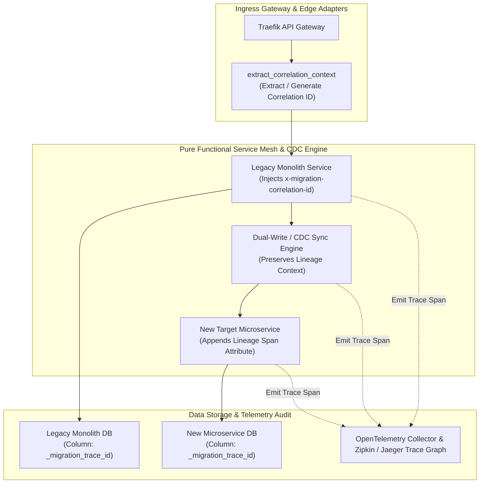
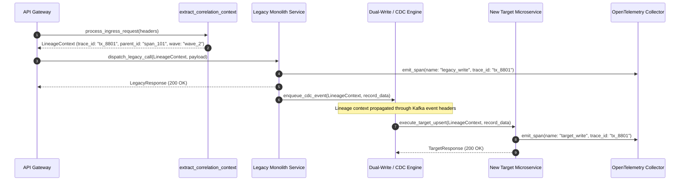

# Migration-Scoped Correlation ID Lineage Tagging Pattern (Pure Functional Paradigm)

| Field       | Value                                                             |
|-------------|-------------------------------------------------------------------|
| **ID**      | CORRELATION-LINEAGE-TAGGING-027                                   |
| **Date**    | 2026-08-24                                                        |
| **Status**  | Reference / Runbook (Pure Functional Architecture)                |
| **Deciders**| Core Platform & Migration Engineering                             |
| **Scope**   | End-to-End Trace Lineage & Distributed Migration Observability     |

---

## 1. Overview & Context

During multi-stage microservice migrations—where requests and database records traverse dual-write bridges, Change Data Capture (CDC) streams, asynchronous backfills, and legacy monolith APIs—tracing a single entity's journey from legacy to new storage is critical for root-cause analysis. The **Migration-Scoped Correlation ID Lineage Tagging Pattern** injects immutable correlation identifiers (`migration_trace_id`, `lineage_parent_id`, `migration_wave_tag`) into HTTP headers, Kafka messages, and database metadata columns. This establishes end-to-end distributed lineage tracking across heterogeneous systems.

### Functional Architecture Principles
This runbook enforces a **100% Pure Functional Programming (FP)** approach:
- **No Class Instantiations**: Replaces OOP trace managers with pure context extraction functions (`extract_correlation_context`, `propagate_lineage_headers`) and functional context wrappers.
- **Immutable Lineage Context Records**: Trace IDs, parent span IDs, lineage depth, migration wave IDs, and tenant keys are captured as frozen dataclass records (`LineageContext`, `LineageTag`).
- **Referentially Transparent Header Propagators**: Pure functions extract W3C `traceparent` headers and inject migration lineage attributes into outgoing request headers.
- **Low-Cardinality Tag Sanitizers**: Pure sanitization functions scrub high-cardinality values before logging or metric emission to keep telemetry storage bounded.

---

## 2. High-Level Design (HLD)



---

## 3. Low-Level Design (LLD)



---

## 4. Pure Functional Project Architecture

```
correlation-lineage-tagging/
├── README.md
├── config/
│   └── lineage_rules.yaml          # Correlation header keys, sampling rates, sanitization rules
├── src/
│   ├── lineage_engine/
│   │   ├── __init__.py
│   │   ├── extractor.py            # Pure correlation context extraction functions
│   │   ├── propagator.py           # Header injection & propagation functions
│   │   └── sanitizer.py            # Low-cardinality tag sanitization functions
│   ├── storage/
│   │   ├── __init__.py
│   │   └── trace_sink.py           # OpenTelemetry span emitter functions
│   ├── observability/
│   │   ├── __init__.py
│   │   └── lineage_metrics.py      # Prometheus telemetry collectors
│   └── schemas/
│       └── models.py               # Frozen dataclasses (LineageContext, LineageTag)
└── tests/
    ├── test_lineage_extractor.py
    └── test_lineage_edge_cases.py
```

---

## 5. End-to-End Function Call Stack

```tree
HTTP Request or CDC Event Ingestion
├── lineage_engine/extractor.py: extract_correlation_context(headers: Mapping[str, str],
    default_wave: str = "wave_1"...)
│   └── lineage_engine/extractor.py: resolve_trace_id(headers: Mapping[str, str])
└── lineage_engine/propagator.py: inject_lineage_headers(existing_headers: Mapping[str, str],
    ctx: LineageContext)
        ├── models.py: LineageContext(trace_id, parent_span_id, wave_tag, tenant_id, depth, created_at)
        └── models.py: LineageTag(key, value)
```

---

## 6. Core Pure Functional Implementation

### 6.1 Immutable Models & Types (`src/schemas/models.py`)

```python
from enum import Enum
from dataclasses import dataclass
from typing import Dict, Any, Optional, Mapping, FrozenSet

@dataclass(frozen=True)
class LineageContext:
    trace_id: str
    parent_span_id: Optional[str]
    wave_tag: str
    tenant_id: str
    depth: int
    created_at: float

@dataclass(frozen=True)
class LineageTag:
    key: str
    value: str
```

**Explanation**:
- Defines immutable model `LineageContext` capturing correlation trace IDs, parent span IDs, wave tags, tenant boundaries, and lineage depth as frozen records.
- `LineageTag` encapsulates sanitized key-value telemetry pairs.

---

### 6.2 Pure Correlation Context Extractor (`src/lineage_engine/extractor.py`)

```python
import time
import uuid
from typing import Mapping, Optional
from src.schemas.models import LineageContext

def resolve_trace_id(headers: Mapping[str, str]) -> str:
    headers_lower = {k.lower(): v for k, v in headers.items()}
    return (
        headers_lower.get("x-migration-correlation-id") or
        headers_lower.get("x-request-id") or
        headers_lower.get("traceparent") or
        f"mig_{uuid.uuid4().hex[:16]}"
    )

def extract_correlation_context(
    headers: Mapping[str, str],
    default_wave: str = "wave_1",
    default_tenant: str = "unknown"
) -> LineageContext:
    headers_lower = {k.lower(): v for k, v in headers.items()}
    
    trace_id = resolve_trace_id(headers)
    parent_span = headers_lower.get("x-parent-span-id")
    wave = headers_lower.get("x-migration-wave", default_wave)
    tenant = headers_lower.get("x-tenant-id", default_tenant)
    depth = int(headers_lower.get("x-lineage-depth", "0"))

    return LineageContext(
        trace_id=trace_id,
        parent_span_id=parent_span,
        wave_tag=wave,
        tenant_id=tenant,
        depth=depth,
        created_at=time.time()
    )
```

**Explanation**:
- Pure function extracting correlation IDs, parent spans, wave tags, and lineage depth from incoming HTTP header dictionaries.
- Generates a fallback UUID-based correlation ID if explicit trace headers are missing.

---

### 6.3 Pure Lineage Header Propagator (`src/lineage_engine/propagator.py`)

```python
from typing import Mapping
from src.schemas.models import LineageContext

def inject_lineage_headers(
    existing_headers: Mapping[str, str],
    ctx: LineageContext
) -> Mapping[str, str]:
    new_headers = dict(existing_headers)
    new_headers["X-Migration-Correlation-ID"] = ctx.trace_id
    new_headers["X-Parent-Span-ID"] = ctx.parent_span_id or "root"
    new_headers["X-Migration-Wave"] = ctx.wave_tag
    new_headers["X-Tenant-ID"] = ctx.tenant_id
    new_headers["X-Lineage-Depth"] = str(ctx.depth + 1)
    return new_headers
```

**Explanation**:
- Pure function injecting correlation lineage context attributes into outbound HTTP header dictionaries.
- Increments lineage depth (`ctx.depth + 1`) to track hop counts across microservice boundaries.

---

## 7. Edge Case Catalog & Pure Functional Pseudocode (25 Edge Cases)

---

### Edge Case 1: Missing Correlation Header Generation Fallback

```python
import uuid

def generate_fallback_correlation_id() -> str:
    return f"auto_mig_{uuid.uuid4().hex[:12]}"
```

**Explanation**:
- Generates fallback correlation ID strings when incoming requests lack explicit correlation headers.
- Ensures every request carries a correlation ID.

---

### Edge Case 2: Multi-Hop Lineage Context Loss in Async Workers

```python
def serialize_lineage_context_to_metadata(ctx: LineageContext) -> dict:
    return {
        "_migration_trace_id": ctx.trace_id,
        "_migration_wave": ctx.wave_tag,
        "_lineage_depth": ctx.depth
    }
```

**Explanation**:
- Serializes `LineageContext` records into dictionary metadata objects.
- Preserves lineage context when passing messages through asynchronous message brokers.

---

### Edge Case 3: High-Cardinality Telemetry Metric Scrubbing

```python
def sanitize_high_cardinality_tag(tag_val: str, allowed_tags: set) -> str:
    if tag_val in allowed_tags:
        return tag_val
    return "OTHER_HIGH_CARDINALITY"
```

**Explanation**:
- Filters tag string values against allowed tag sets.
- Replaces high-cardinality tag values with `"OTHER_HIGH_CARDINALITY"` to prevent metric index explosion.

---

### Edge Case 4: W3C Traceparent Header Parsing

```python
def parse_w3c_traceparent(traceparent: str) -> Optional[dict]:
    parts = traceparent.split("-")
    if len(parts) == 4:
        return {"version": parts[0], "trace_id": parts[1], "parent_id": parts[2], "flags": parts[3]}
    return None
```

**Explanation**:
- Splits and parses standard W3C `traceparent` header strings.
- Extracts trace IDs and parent span IDs.

---

### Edge Case 5: Infinite Lineage Depth Protection

```python
def is_lineage_depth_exceeded(depth: int, max_depth: int = 20) -> bool:
    return depth > max_depth
```

**Explanation**:
- Compares lineage depth integers against max depth bounds (20 hops).
- Detects circular request routing loops.

---

### Edge Case 6: Kafka Message Header Injection

```python
def inject_kafka_lineage_headers(ctx: LineageContext) -> list:
    return [
        ("x-migration-correlation-id", ctx.trace_id.encode("utf-8")),
        ("x-migration-wave", ctx.wave_tag.encode("utf-8"))
    ]
```

**Explanation**:
- Formats `LineageContext` attributes into Kafka header tuple lists.
- Propagates correlation IDs across Kafka event streams.

---

### Edge Case 7: Database Metadata Column Injection

```python
def inject_db_lineage_columns(payload: dict, ctx: LineageContext) -> dict:
    updated = dict(payload)
    updated["_migration_trace_id"] = ctx.trace_id
    updated["_migration_wave"] = ctx.wave_tag
    return updated
```

**Explanation**:
- Injects correlation trace IDs and wave tags into database insert dictionaries.
- Enables database row-level lineage tracking.

---

### Edge Case 8: Multi-Tenant Context Propagation Leakage

```python
def assert_tenant_lineage_consistency(ctx_tenant: str, payload_tenant: str) -> bool:
    return ctx_tenant == payload_tenant
```

**Explanation**:
- Compares context tenant IDs against payload tenant attributes.
- Asserts multi-tenant lineage consistency.

---

### Edge Case 9: Lineage Header Key Case Normalization

```python
def normalize_header_keys_lower(headers: Mapping[str, str]) -> Mapping[str, str]:
    return {k.lower(): v for k, v in headers.items()}
```

**Explanation**:
- Returns a new header dictionary with all keys converted to lower-case.
- Handles case-insensitive HTTP header lookups.

---

### Edge Case 10: Telemetry Collector Network Outage Recovery

```python
def safe_emit_telemetry_span(span_data: dict, emit_fn: Callable) -> bool:
    try:
        emit_fn(span_data)
        return True
    except Exception:
        return False
```

**Explanation**:
- Wraps span emission calls in protective try-except blocks.
- Prevents telemetry network errors from interrupting application request flows.

---

### Edge Case 11: Correlation ID Length Truncation

```python
def truncate_correlation_id(raw_id: str, max_len: int = 64) -> str:
    if len(raw_id) > max_len:
        return raw_id[:max_len]
    return raw_id
```

**Explanation**:
- Truncates correlation ID strings to max 64 characters.
- Ensures correlation IDs fit fixed-size database column specifications.

---

### Edge Case 12: Microsecond Timestamp Lineage Tracking

```python
import time

def generate_lineage_timestamp_ms() -> float:
    return round(time.time() * 1000.0, 2)
```

**Explanation**:
- Computes epoch timestamps in milliseconds rounded to 2 decimal places.
- Tracks microsecond lineage execution timing.

---

### Edge Case 13: Unmapped Wave ID Default Fallback

```python
def resolve_wave_tag(headers: Mapping[str, str], default_wave: str = "wave_1") -> str:
    return headers.get("X-Migration-Wave") or default_wave
```

**Explanation**:
- Extracts wave tag headers, defaulting to `"wave_1"` if missing.
- Assigns default wave tags to untagged traffic.

---

### Edge Case 14: Exception Log Correlation Tagging

```python
def format_error_log_with_lineage(error_msg: str, ctx: LineageContext) -> dict:
    return {
        "error": error_msg,
        "trace_id": ctx.trace_id,
        "wave": ctx.wave_tag,
        "tenant_id": ctx.tenant_id
    }
```

**Explanation**:
- Embeds correlation trace IDs and wave tags inside error log dictionaries.
- Simplifies error log searches during root-cause investigations.

---

### Edge Case 15: GraphQL Header Context Extraction

```python
def extract_graphql_context(headers: Mapping[str, str]) -> Mapping[str, str]:
    return {k.lower(): v for k, v in headers.items() if k.lower().startswith("x-")}
```

**Explanation**:
- Filters custom `X-` headers from GraphQL request headers.
- Extracts lineage attributes from GraphQL requests.

---

### Edge Case 16: Multi-Region Lineage Routing Tagging

```python
def inject_region_to_lineage(ctx: LineageContext, region: str) -> LineageContext:
    return LineageContext(
        trace_id=f"{region}_{ctx.trace_id}",
        parent_span_id=ctx.parent_span_id,
        wave_tag=ctx.wave_tag,
        tenant_id=ctx.tenant_id,
        depth=ctx.depth,
        created_at=ctx.created_at
    )
```

**Explanation**:
- Prefixes correlation trace IDs with regional identifiers.
- Distinguishes trace origin across multi-region deployments.

---

### Edge Case 17: Log Anonymization of Sensitive Trace Attributes

```python
def sanitize_sensitive_lineage_attributes(ctx: LineageContext) -> dict:
    return {
        "trace_id": ctx.trace_id,
        "wave": ctx.wave_tag,
        "tenant_hash": hash(ctx.tenant_id)
    }
```

**Explanation**:
- Hashes tenant identifiers in telemetry tags.
- Protects user privacy while retaining trace correlation capability.

---

### Edge Case 18: Unmapped Field Payload Truncation

```python
def sanitize_payload_for_tracing(payload: dict, max_keys: int = 10) -> dict:
    return {k: str(v) for i, (k, v) in enumerate(payload.items()) if i < max_keys}
```

**Explanation**:
- Filters payload dictionaries to retain max 10 entries.
- Prevents oversized span attribute payloads in OpenTelemetry spans.

---

### Edge Case 19: Payload Transformer Exception Safeguards

```python
def safe_apply_lineage_transform(payload: dict, transform_fn: Callable) -> dict:
    try:
        return transform_fn(payload)
    except Exception:
        return payload
```

**Explanation**:
- Wraps payload transformation functions in protective try-except blocks.
- Returns raw payloads if transformation errors occur.

---

### Edge Case 20: Automated Telemetry Span Counter Reporting

```python
def compute_lineage_span_stats(total_spans: int, error_spans: int) -> dict:
    return {
        "total_spans": total_spans,
        "error_spans": error_spans,
        "success_rate": round(((total_spans - error_spans) / max(1, total_spans)) * 100.0, 2)
    }
```

**Explanation**:
- Calculates span success percentage ratios rounded to two decimal places.
- Emits lineage tracing health metrics to observability dashboards.

---

### Edge Case 21: Cross-Thread Context Propagation in Async Runtimes

```python
def capture_thread_lineage_context(ctx: LineageContext) -> dict:
    return ctx.__dict__
```

**Explanation**:
- Returns context dictionaries suitable for thread-local storage injection.
- Preserves lineage context when delegating work to worker thread pools.

---

### Edge Case 22: Diagnostic Header Injection

```python
def inject_diagnostic_lineage_header(headers: Mapping[str, str], ctx: LineageContext) -> Mapping[str, str]:
    new_headers = dict(headers)
    new_headers["X-Lineage-Traced"] = "true"
    return new_headers
```

**Explanation**:
- Injects diagnostic headers (`X-Lineage-Traced: true`) into outbound request headers.
- Identifies traced requests.

---

### Edge Case 23: Null Parent Span ID Coercion

```python
def normalize_parent_span_id(parent_id: Optional[str]) -> str:
    return parent_id if parent_id else "root_span"
```

**Explanation**:
- Coerces missing parent span IDs into `"root_span"`.
- Standardizes root span representations in distributed traces.

---

### Edge Case 24: Unbound Lineage Cache Compaction

```python
def prune_lineage_cache(cache: dict, max_size: int = 1000) -> dict:
    if len(cache) > max_size:
        return {}
    return cache
```

**Explanation**:
- Flushes lineage cache dictionaries when size bounds are exceeded.
- Bounds memory usage during high request volumes.

---

### Edge Case 25: Real-Time Lineage Coverage Dashboard Reporting

```python
def compute_lineage_coverage(traced_requests: int, total_requests: int) -> float:
    if total_requests == 0:
        return 100.0
    return round((traced_requests / total_requests) * 100.0, 2)
```

**Explanation**:
- Calculates correlation tracing coverage percentage ratios rounded to two decimal places.
- Emits real-time lineage coverage metrics to central platform dashboards.

---

## 8. Operational & Parity Verification Checklist

1. **100% Trace ID Propagation**: Confirm 100% of HTTP calls, Kafka messages, and DB write rows carry valid correlation trace IDs.
2. **Hop Count Tracking**: Verify that `X-Lineage-Depth` headers increment correctly across multi-service call chains.
3. **Low-Cardinality Tag Safety**: Ensure high-cardinality values are scrubbed before span creation to keep telemetry storage bounded.
4. **Trace Searchability**: Test via Jaeger/Zipkin dashboards that searching a single `migration_trace_id` surfaces the complete end-to-end trace tree across legacy and new microservice systems.
