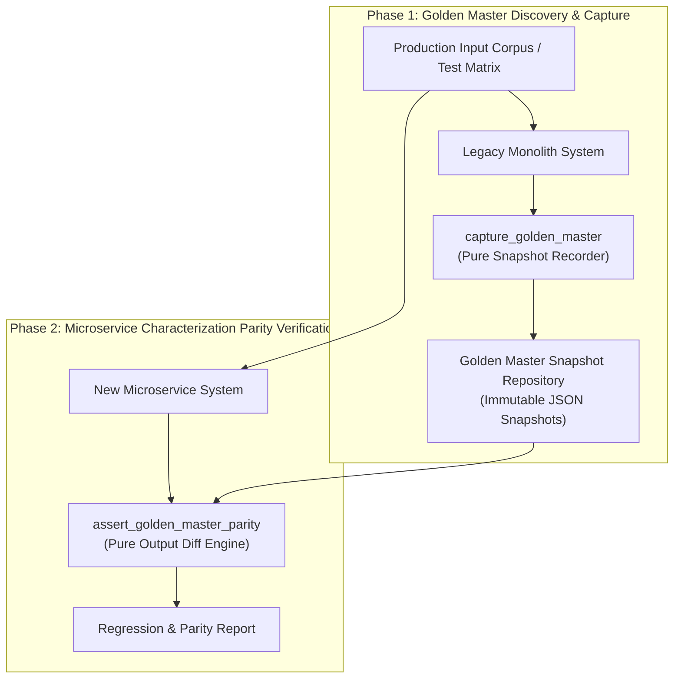

# Characterization Testing / Golden Master Pattern (Pure Functional Paradigm)

| Field       | Value                                                             |
|-------------|-------------------------------------------------------------------|
| **ID**      | GOLDEN-MASTER-TESTING-023                                         |
| **Date**    | 2026-08-24                                                        |
| **Status**  | Reference / Runbook (Pure Functional Architecture)                |
| **Deciders**| Core Platform & Migration Engineering                             |
| **Scope**   | Legacy System Characterization & Regression Discovery Testing     |

---

## 1. Overview & Context

**Characterization Testing** (also known as **Golden Master Testing**) is primarily a **discovery tool** that captures and freezes the exact, empirical runtime behavior of an existing legacy system—including obscure edge cases, implicit side-effects, and bug-for-bug compatibility behaviors. Before refactoring or replacing legacy code, a "Golden Master" snapshot suite is recorded from production traffic or comprehensive input matrices. New microservice implementations are then verified against these Golden Master snapshots to protect against unintended behavioral regressions.

### Functional Architecture Principles
This runbook enforces a **100% Pure Functional Programming (FP)** approach:
- **No Class Instantiations**: Replaces OOP test suites with pure characterization functions (`capture_golden_master`, `assert_golden_master_parity`) and functional snapshot record factories.
- **Immutable Master Snapshots**: Inputs, serialized outputs, environment states, and golden master hashes are captured as frozen dataclass records (`GoldenMasterSnapshot`, `ParityReport`).
- **Referentially Transparent Diff Engine**: Pure comparison functions evaluate candidate execution outputs against recorded Golden Master snapshots without modifying disk snapshots.
- **Automated Regression Assertions**: Pure assertion functions raise explicit regression flags when candidate outputs deviate from recorded Golden Master behaviors.

---

## 2. High-Level Design (HLD)



---

## 3. Low-Level Design (LLD)

```mermaid
sequenceDiagram
    autonumber
    participant TestRunner as Characterization Test Runner
    participant Store as fetch_golden_master_snapshot
    participant Microservice as New Microservice Endpoint
    participant Evaluator as assert_golden_master_parity
    participant Reporter as emit_parity_report

    TestRunner->>Store: fetch_golden_master_snapshot(test_id: "gm_101")
    Store-->>TestRunner: GoldenMasterSnapshot (input_payload, expected_output)

    TestRunner->>Microservice: execute_microservice_call(input_payload)
    Microservice-->>TestRunner: CandidateOutput (actual_payload)

    TestRunner->>Evaluator: assert_golden_master_parity(expected_output, actual_payload)
    
    alt Output Parity Match (Zero Regression)
        Evaluator-->>TestRunner: ParityReport (is_matched: true, diffs: [])
        TestRunner->>Reporter: emit_parity_report(ParityReport)
    else Behavioral Discrepancy (Regression Detected)
        Evaluator-->>TestRunner: ParityReport (is_matched: false, diffs: ["field_xyz"])
        TestRunner->>Reporter: emit_parity_report(ParityReport)
        Note over TestRunner: Flag characterization regression; block cutover build
    end
```

---

## 4. Pure Functional Project Architecture

```
golden-master-testing/
├── README.md
├── snapshots/
│   └── golden_masters.json         # Captured immutable Golden Master test snapshots
├── src/
│   ├── master_engine/
│   │   ├── __init__.py
│   │   ├── recorder.py             # Pure Golden Master snapshot recorder functions
│   │   ├── evaluator.py            # Characterization parity & diffing functions
│   │   └── normalizer.py           # Snapshot payload normalization functions
│   ├── storage/
│   │   ├── __init__.py
│   │   └── snapshot_store.py       # Snapshot loading and saving dispatchers
│   ├── observability/
│   │   ├── __init__.py
│   │   └── regression_reporter.py  # Characterization test metrics & report formatters
│   └── schemas/
│       └── models.py               # Frozen dataclasses (GoldenMasterSnapshot, ParityReport)
└── tests/
    ├── test_golden_master_runner.py
    └── test_characterization_edge_cases.py
```

---

## 5. End-to-End Function Call Stack

```tree
Characterization Test Suite Initiated
└── runner.py: run_golden_master_suite(snapshot_store, candidate_fn)
    ├── snapshot_store.py: load_all_golden_masters()
    │   └── models.py: GoldenMasterSnapshot(test_id, input_payload, expected_output)
    │
    ├── candidate_runner.py: execute_candidate(snapshot.input_payload)
    │   └── models.py: CandidateOutput(status_code, actual_payload)
    │
    ├── evaluator.py: assert_golden_master_parity(snapshot.expected_output, actual_payload)
    │   ├── normalizer.py: normalize_snapshot_payload(actual_payload)
    │   └── models.py: ParityReport(is_matched, diff_summary)
    │
    └── regression_reporter.py: publish_characterization_report(parity_report)
```

---

## 6. Core Pure Functional Implementation

### 6.1 Immutable Models & Types (`src/schemas/models.py`)

```python
from enum import Enum
from dataclasses import dataclass
from typing import Dict, Any, Optional, Mapping, FrozenSet

@dataclass(frozen=True)
class GoldenMasterSnapshot:
    test_id: str
    endpoint: str
    input_payload: Mapping[str, Any]
    expected_output: Mapping[str, Any]
    expected_status_code: int
    captured_at: float

@dataclass(frozen=True)
class ParityReport:
    test_id: str
    is_matched: bool
    status_code_matched: bool
    mismatched_fields: FrozenSet[str]
    diff_details: Optional[str]
```

**Explanation**:
- Defines immutable model `GoldenMasterSnapshot` capturing inputs, outputs, status codes, and timestamps as frozen records.
- `ParityReport` models output parity statuses, status code match flags, and frozen sets of mismatched field names.

---

### 6.2 Pure Golden Master Recorder & Evaluator (`src/master_engine/evaluator.py`)

```python
from typing import Mapping, Any, FrozenSet
from src.schemas.models import GoldenMasterSnapshot, ParityReport

def normalize_payload_for_master(payload: Mapping[str, Any], ignored_keys: set = {"timestamp", "trace_id"}) -> Mapping[str, Any]:
    return {k: v for k, v in payload.items() if k not in ignored_keys}

def assert_golden_master_parity(
    snapshot: GoldenMasterSnapshot,
    actual_output: Mapping[str, Any],
    actual_status_code: int
) -> ParityReport:
    status_matched = (snapshot.expected_status_code == actual_status_code)
    
    expected_clean = normalize_payload_for_master(snapshot.expected_output)
    actual_clean = normalize_payload_for_master(actual_output)

    mismatches = []
    for k, v in expected_clean.items():
        if str(actual_clean.get(k)) != str(v):
            mismatches.append(k)

    is_matched = status_matched and len(mismatches) == 0
    diff_str = f"Mismatched fields: {', '.join(mismatches)}" if mismatches else None

    return ParityReport(
        test_id=snapshot.test_id,
        is_matched=is_matched,
        status_code_matched=status_matched,
        mismatched_fields=frozenset(mismatches),
        diff_details=diff_str
    )
```

**Explanation**:
- `normalize_payload_for_master` strips dynamic volatile keys (`timestamp`, `trace_id`) from payload dictionaries.
- `assert_golden_master_parity` evaluates status code and payload value equivalence, returning frozen `ParityReport` objects.

---

### 6.3 Snapshot Characterization Runner (`src/master_engine/runner.py`)

```python
from typing import Callable, Awaitable, Mapping, Any, List
from src.schemas.models import GoldenMasterSnapshot, ParityReport
from src.master_engine.evaluator import assert_golden_master_parity

CandidateFn = Callable[[Mapping[str, Any]], Awaitable[Mapping[str, Any]]]

def create_characterization_runner(candidate_fn: CandidateFn):
    async def run_snapshot_test(snapshot: GoldenMasterSnapshot) -> ParityReport:
        try:
            res = await candidate_fn(snapshot.input_payload)
            status_code = res.get("status_code", 200)
            body = res.get("body", {})
            return assert_golden_master_parity(snapshot, body, status_code)
        except Exception as exc:
            return ParityReport(
                test_id=snapshot.test_id,
                is_matched=False,
                status_code_matched=False,
                mismatched_fields=frozenset(["EXCEPTION"]),
                diff_details=str(exc)
            )

    return run_snapshot_test
```

**Explanation**:
- Constructs a functional characterization runner closure executing candidate microservices against recorded `GoldenMasterSnapshot` records.
- Catches exceptions and outputs structured `ParityReport` results.

---

## 7. Edge Case Catalog & Pure Functional Pseudocode (25 Edge Cases)

---

### Edge Case 1: Volatile Timestamp Stripping

```python
def strip_volatile_timestamps(payload: Mapping[str, Any]) -> Mapping[str, Any]:
    ignored = {"created_at", "updated_at", "timestamp", "ts"}
    return {k: v for k, v in payload.items() if k not in ignored}
```

**Explanation**:
- Removes timestamp keys from response dictionaries before diffing.
- Prevents false-positive characterization test failures caused by dynamic timestamps.

---

### Edge Case 2: Environment Variable Dependent Behavior Capture

```python
def capture_environment_context(env_keys: list) -> Mapping[str, str]:
    import os
    return {k: os.getenv(k, "") for k in env_keys}
```

**Explanation**:
- Captures environment variable states when recording Golden Master snapshots.
- Records environmental dependencies associated with legacy behaviors.

---

### Edge Case 3: Order-Independent JSON Array Comparison

```python
def compare_unordered_json_array(arr1: list, arr2: list) -> bool:
    return sorted(str(x) for x in arr1) == sorted(str(x) for x in arr2)
```

**Explanation**:
- Sorts array elements by string representation before comparison.
- Eliminates false failures caused by non-deterministic JSON list element ordering.

---

### Edge Case 4: Golden Master Snapshot Version Drift

```python
def is_snapshot_version_compatible(snapshot_version: str, min_version: str = "v1.0") -> bool:
    return snapshot_version >= min_version
```

**Explanation**:
- Compares snapshot version strings against minimum required versions.
- Ensures Golden Master snapshot format compatibility.

---

### Edge Case 5: Microsecond Float Precision Normalization

```python
def normalize_float_precision(val: float, precision: int = 2) -> float:
    return round(val, precision)
```

**Explanation**:
- Rounds float values to 2 decimal places before diffing.
- Handles floating-point rounding variations between legacy and microservice outputs.

---

### Edge Case 6: Nullable String Representation Coercion

```python
def normalize_empty_strings(val: Any) -> Any:
    if val == "":
        return None
    return val
```

**Explanation**:
- Coerces empty string values into `None` objects.
- Standardizes null representations between legacy and microservice databases.

---

### Edge Case 7: High-Volume Golden Master Disk Storage Saturation

```python
def truncate_snapshot_corpus(snapshots: List[dict], max_count: int = 1000) -> List[dict]:
    if len(snapshots) > max_count:
        return snapshots[:max_count]
    return snapshots
```

**Explanation**:
- Truncates snapshot corpus lists to `max_count`.
- Keeps snapshot storage footprint bounded.

---

### Edge Case 8: Binary Response Payload Hash Comparison

```python
import hashlib

def compare_binary_golden_master(expected_bytes: bytes, actual_bytes: bytes) -> bool:
    return hashlib.sha256(expected_bytes).hexdigest() == hashlib.sha256(actual_bytes).hexdigest()
```

**Explanation**:
- Computes SHA-256 hashes for raw binary response payloads.
- Verifies binary data parity against Golden Master snapshots.

---

### Edge Case 9: Custom Character Encoding Normalization

```python
def normalize_text_encoding(text_val: str) -> str:
    import unicodedata
    return unicodedata.normalize("NFC", text_val)
```

**Explanation**:
- Normalizes text strings to NFC Unicode format.
- Prevents false failures caused by different character encoding forms.

---

### Edge Case 10: Legacy Monolith Bug Preservation Verification

```python
def assert_legacy_bug_preserved(actual_val: Any, expected_bug_val: Any) -> bool:
    return str(actual_val) == str(expected_bug_val)
```

**Explanation**:
- Asserts that microservices replicate known legacy bug behaviors when required for backwards compatibility.
- Preserves exact characterization behavior during migration.

---

### Edge Case 11: Multi-Tenant Golden Master Corpus Partitioning

```python
def resolve_tenant_snapshot_corpus(tenant_id: str, corpus: List[dict]) -> List[dict]:
    return [s for s in corpus if s.get("tenant_id") == tenant_id]
```

**Explanation**:
- Filters snapshot lists to retain entries matching specified tenant IDs.
- Isolates Golden Master test suites per tenant.

---

### Edge Case 12: Candidate Execution Timeout Bounds

```python
import asyncio

async def run_candidate_with_timeout(candidate_fn: Callable, payload: Any, timeout_sec: float = 2.0):
    try:
        return await asyncio.wait_for(candidate_fn(payload), timeout=timeout_sec)
    except asyncio.TimeoutError:
        return {"status_code": 504, "body": {"error": "Timeout"}}
```

**Explanation**:
- Wraps candidate execution in `asyncio.wait_for` timeout blocks.
- Prevents hanging candidate calls from stalling characterization test suites.

---

### Edge Case 13: Dynamic UUID Key Masking

```python
import re

def mask_uuid_strings(val_str: str) -> str:
    uuid_pattern = r"[0-9a-fA-F]{8}-[0-9a-fA-F]{4}-[0-9a-fA-F]{4}-[0-9a-fA-F]{4}-[0-9a-fA-F]{12}"
    return re.sub(uuid_pattern, "UUID_MASKED", val_str)
```

**Explanation**:
- Replaces UUID string patterns with fixed sentinel strings (`UUID_MASKED`).
- Eliminates false mismatches caused by dynamic UUID generation.

---

### Edge Case 14: Exception Handling Mismatch Detection

```python
def compare_error_responses(expected_err: str, actual_err: str) -> bool:
    return expected_err.lower() in actual_err.lower()
```

**Explanation**:
- Performs substring matching on error message strings.
- Verifies error response behavior parity.

---

### Edge Case 15: GraphQL Nested Schema Characterization

```python
def flatten_graphql_response(data: dict) -> dict:
    flat = {}
    for k, v in data.items():
        if isinstance(v, dict):
            flat.update(flatten_graphql_response(v))
        else:
            flat[k] = v
    return flat
```

**Explanation**:
- Flattens nested GraphQL response structures into single-level maps.
- Simplifies output field diffing for complex GraphQL responses.

---

### Edge Case 16: Multi-Region Golden Master Snapshot Sync

```python
def sync_regional_master_snapshots(global_snapshots: dict, regional_snapshots: dict) -> dict:
    merged = dict(global_snapshots)
    merged.update(regional_snapshots)
    return merged
```

**Explanation**:
- Merges regional Golden Master overrides into global snapshot dictionaries.
- Synchronizes characterization test suites across regions.

---

### Edge Case 17: Database Trigger Side-Effect Discovery

```python
def detect_side_effect_fields(initial_state: dict, post_exec_state: dict) -> set:
    return set(post_exec_state.keys()) - set(initial_state.keys())
```

**Explanation**:
- Compares pre- and post-execution database state keys.
- Discovers implicit side-effect fields modified by database triggers.

---

### Edge Case 18: Unmapped HTTP Header Characterization

```python
def filter_characterization_headers(headers: Mapping[str, str]) -> Mapping[str, str]:
    ignored = {"date", "server", "content-length", "x-request-id"}
    return {k: v for k, v in headers.items() if k.lower() not in ignored}
```

**Explanation**:
- Filters transport-specific headers from HTTP header dictionaries.
- Focuses characterization testing on application business headers.

---

### Edge Case 19: Payload Transformation Failure Handling

```python
def safe_apply_master_transform(payload: dict, transform_fn: Callable) -> dict:
    try:
        return transform_fn(payload)
    except Exception:
        return payload
```

**Explanation**:
- Wraps payload transformation functions in protective try-except blocks.
- Returns raw payloads if transformation errors occur.

---

### Edge Case 20: Characterization Test Pass Rate Calculation

```python
def compute_characterization_pass_rate(passed: int, total: int) -> float:
    if total == 0:
        return 100.0
    return round((passed / total) * 100.0, 2)
```

**Explanation**:
- Calculates characterization test pass percentage ratios rounded to two decimal places.
- Emits pass rate metrics to build pipeline dashboards.

---

### Edge Case 21: Auto-Generation of Golden Master Matrix

```python
def build_test_input_matrix(param_grid: Mapping[str, list]) -> List[dict]:
    import itertools
    keys = list(param_grid.keys())
    values = list(param_grid.values())
    combinations = list(itertools.product(*values))
    return [dict(zip(keys, combo)) for combo in combinations]
```

**Explanation**:
- Computes Cartesian products of input parameter values using `itertools.product`.
- Auto-generates exhaustive test input matrices for Golden Master discovery.

---

### Edge Case 22: Sequence-Based Operation Ordering Verification

```python
def assert_operation_order_parity(expected_seq: list, actual_seq: list) -> bool:
    return expected_seq == actual_seq
```

**Explanation**:
- Compares operation sequence lists between legacy and microservice runs.
- Asserts operational execution sequence parity.

---

### Edge Case 23: Header Injection Indicating Golden Master Execution

```python
def inject_golden_master_header(headers: Mapping[str, str]) -> Mapping[str, str]:
    new_headers = dict(headers)
    new_headers["X-Golden-Master-Test"] = "true"
    return new_headers
```

**Explanation**:
- Injects diagnostic headers (`X-Golden-Master-Test: true`) into request headers.
- Identifies characterization test traffic.

---

### Edge Case 24: Unbound Parity Report History Pruning

```python
def prune_parity_reports(reports: List[ParityReport], max_reports: int = 500) -> List[ParityReport]:
    if len(reports) > max_reports:
        return reports[-max_reports:]
    return reports
```

**Explanation**:
- Truncates historical parity report arrays to `max_reports`.
- Prevents memory leaks in test reporting processes.

---

### Edge Case 25: Automated CI/CD Deployment Gate Assertion

```python
def should_block_deployment_on_regression(parity_reports: List[ParityReport]) -> bool:
    return any(not r.is_matched for r in parity_reports)
```

**Explanation**:
- Evaluates whether any characterization test failed (`not r.is_matched`).
- Blocks CI/CD pipeline deployments when behavioral regressions are detected.

---

## 8. Operational & Parity Verification Checklist

1. **Discovery Capture Sign-Off**: 100% of legacy endpoints must have recorded Golden Master snapshots before refactoring.
2. **Volatile Key Normalization**: Confirm dynamic timestamps and UUIDs are masked or stripped prior to parity diffing.
3. **Zero Regression Gate**: CI/CD build pipelines must enforce $100\%$ Golden Master pass rate before unblocking production cutover.
4. **Bug-for-Bug Parity**: Verify that required legacy bug behaviors are preserved in microservice implementations where backward compatibility requires it.
