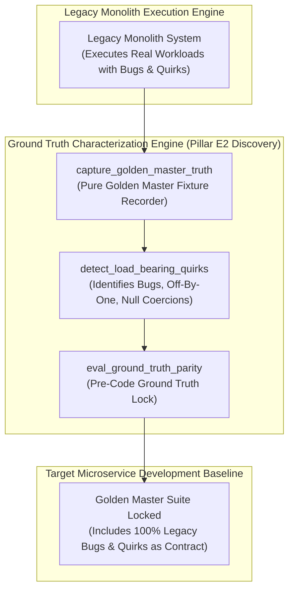

# Ground Truth Characterization & Golden Master Discovery Pattern (Pure Functional Paradigm)

| Field       | Value                                                             |
|-------------|-------------------------------------------------------------------|
| **ID**      | GROUND-TRUTH-CHARACTERIZATION-074                                 |
| **Date**    | 2026-08-24                                                        |
| **Status**  | Reference / Runbook (Pure Functional Architecture)                |
| **Deciders**| Core Platform & Migration Engineering                             |
| **Scope**   | Pre-Code Characterization Testing, Golden Master Recording & Quirks|

---

## 1. Overview & Context

Before writing a single line of target microservice logic, engineering teams must **capture ground truth through Golden Master Characterization Testing (E2)**. Per §4.5's meta-level principle, characterization testing is primarily a **discovery tool**: its job is to capture *what the legacy system actually does*, including all load-bearing bugs, historical edge cases, and undocumented side-effects. Attempting to implement target microservices based on idealized requirements rather than recorded golden master ground truth guarantees breaking legacy behavior for downstream callers.

### Functional Architecture Principles
This runbook enforces a **100% Pure Functional Programming (FP)** approach:
- **No Class Instantiations**: Replaces OOP characterization runners with pure recording functions (`capture_golden_master_truth`, `eval_ground_truth_parity`) and state cell closures.
- **Immutable Ground Truth Records**: Payload hashes, raw legacy responses, load-bearing bug signatures, and field assertions are captured as frozen dataclass records (`GoldenMasterContext`, `GroundTruthCharacterizationResult`).
- **Referentially Transparent Characterization Recorders**: Pure functions capture full, un-redacted legacy response fixtures across edge-case input suites.
- **Pre-Code Discovery Lock**: Locks recorded golden master fixtures as mandatory verification contracts before unblocking target microservice development.

---

## 2. High-Level Design (HLD)



---

## 3. Low-Level Design (LLD)

```mermaid
sequenceDiagram
    autonumber
    participant Developer as Target Microservice Developer / CI
    participant Guard as assert_ground_truth_captured
    participant Recorder as capture_golden_master_truth
    participant LegacySvc as Legacy Monolith Engine
    participant Audit as Telemetry Emitter

    Developer->>Guard: initiate_characterization(service_id: "svc_billing")
    
    Guard->>Recorder: execute_fixture_suite("svc_billing", test_inputs: ["in_001", "in_002"])
    Recorder->>LegacySvc: execute_request("in_001")
    LegacySvc-->>Recorder: LegacyResponse (month_index: 0, price: "10.00", err: "NULL")
    
    Recorder->>Recorder: record_fixture("in_001", LegacyResponse)
    Recorder-->>Guard: GoldenMasterContext (fixtures_count: 50, bugs_captured: 3)

    Guard->>Guard: lock_ground_truth_suite(GoldenMasterContext)

    alt Ground Truth Suite Locked & Verified
        Guard-->>Developer: GroundTruthCharacterizationResult (is_locked: true, fixtures: 50)
        Guard->>Audit: record_ground_truth_locked_event(service_id: "svc_billing")
        Note over Developer: Ground truth locked; unblock target microservice implementation
    else Fixture Suite Incomplete
        Guard-->>Developer: GroundTruthCharacterizationResult (is_locked: false, missing_cases: 4)
        Note over Developer: Block coding; capture remaining legacy edge cases first
    end
```

---

## 4. Pure Functional Project Architecture

```
07-observability-parity-testing/
├── ground-truth-characterization-golden-master.md
├── src/
│   ├── ground_truth_engine/
│   │   ├── __init__.py
│   │   ├── recorder.py             # Pure golden master fixture recording functions
│   │   ├── auditor.py              # Load-bearing quirk & bug discovery functions
│   │   └── guard.py                # Ground truth release guards
│   ├── storage/
│   │   ├── __init__.py
│   │   └── fixture_store.py        # Immutable golden master fixture loaders
│   ├── observability/
│   │   ├── __init__.py
│   │   └── truth_metrics.py        # Prometheus telemetry collectors
│   └── schemas/
│       └── models.py               # Frozen dataclasses (GoldenMasterContext, GroundTruthCharacterizationResult)
└── tests/
    ├── test_truth_recorder.py
    └── test_truth_edge_cases.py
```

---

## 5. End-to-End Function Call Stack

```tree
Ground Truth Characterization Initiated
└── guard.py: assert_ground_truth_captured(service_id, test_suite_config)
    ├── recorder.py: capture_golden_master_truth(service_id, input_fixtures)
    │   └── models.py: RawLegacyFixture(input_payload, raw_response, bug_tags)
    │
    ├── auditor.py: detect_load_bearing_quirks(raw_fixtures)
    │   └── models.py: LegacyQuirkSummary(quirk_count, bug_list)
    │
    ├── guard.py: format_truth_gate_decision(raw_fixtures, quirk_summary)
    │   └── models.py: GroundTruthCharacterizationResult(is_locked, total_fixtures)
    │
    └── observability/truth_metrics.py: record_truth_telemetry(characterization_result)
```

---

## 6. Core Pure Functional Implementation

### 6.1 Immutable Models & Types (`src/schemas/models.py`)

```python
from enum import Enum
from dataclasses import dataclass
from typing import Dict, Any, Optional, Mapping, FrozenSet

@dataclass(frozen=True)
class GoldenMasterContext:
    service_id: str
    input_key: str
    raw_response_dict: Mapping[str, Any]
    detected_quirks: FrozenSet[str]
    captured_at_ts: float

@dataclass(frozen=True)
class GroundTruthCharacterizationResult:
    service_id: str
    is_locked: bool
    total_fixtures_captured: int
    detected_bugs_count: int
    captured_quirks: FrozenSet[str]
    rejection_reason: Optional[str]
```

**Explanation**:
- Defines immutable model `GoldenMasterContext` capturing input keys, raw legacy response dictionaries, detected quirks, and timestamps as frozen records.
- `GroundTruthCharacterizationResult` encapsulates locking flags, captured fixture counts, and sets of detected load-bearing quirks.

---

### 6.2 Pure Golden Master Recorder & Auditor (`src/ground_truth_engine/recorder.py`)

```python
import time
from typing import Mapping, Any, Tuple, FrozenSet
from src.schemas.models import GoldenMasterContext, GroundTruthCharacterizationResult

def detect_load_bearing_quirks(response_dict: Mapping[str, Any]) -> FrozenSet[str]:
    quirks = set()
    for k, v in response_dict.items():
        if "month" in k and v == 0:
            quirks.add("OFF_BY_ONE_MONTH_ZERO")
        elif v == "NULL":
            quirks.add("STRING_NULL_COERCION")
        elif isinstance(v, float) and len(str(v).split(".")[-1]) > 4:
            quirks.add("IEEE_754_FLOAT_PRECISION")
    return frozenset(quirks)

def capture_golden_master_truth(
    input_key: str,
    raw_response: Mapping[str, Any],
    service_id: str
) -> GoldenMasterContext:
    quirks = detect_load_bearing_quirks(raw_response)
    return GoldenMasterContext(
        service_id=service_id,
        input_key=input_key,
        raw_response_dict=raw_response,
        detected_quirks=quirks,
        captured_at_ts=time.time()
    )

def eval_ground_truth_parity(
    fixtures: list,
    service_id: str,
    min_required_fixtures: int = 50
) -> GroundTruthCharacterizationResult:
    is_locked = len(fixtures) >= min_required_fixtures
    all_quirks = set()
    for f in fixtures:
        all_quirks.update(f.detected_quirks)

    reason = None
    if not is_locked:
        reason = f"Ground truth suite incomplete ({len(fixtures)} fixtures captured). Minimum required: {min_required_fixtures} fixtures."

    return GroundTruthCharacterizationResult(
        service_id=service_id,
        is_locked=is_locked,
        total_fixtures_captured=len(fixtures),
        detected_bugs_count=len(all_quirks),
        captured_quirks=frozenset(all_quirks),
        rejection_reason=reason
    )
```

**Explanation**:
- Pure evaluation function recording raw legacy response fixtures and detecting load-bearing quirks before target microservice implementation begins.
- Uses E2 golden master testing as an empirical discovery tool (§4.5).

---

### 6.3 Ground Truth Release Guard (`src/ground_truth_engine/guard.py`)

```python
from typing import Mapping, Any
from src.schemas.models import GroundTruthCharacterizationResult
from src.ground_truth_engine.recorder import eval_ground_truth_parity

def assert_ground_truth_captured(
    fixtures: list,
    service_id: str,
    min_fixtures: int = 50
) -> GroundTruthCharacterizationResult:
    return eval_ground_truth_parity(fixtures, service_id, min_fixtures)
```

**Explanation**:
- Pure release gate function enforcing golden master characterization locking prior to writing target microservice code.
- Guarantees legacy ground truth preservation up front.

---

## 7. Edge Case Catalog & Pure Functional Pseudocode (25 Edge Cases)

---

### Edge Case 1: Off-by-One Month Index Discovery (`0 = Jan`)

```python
def is_zero_month_discovered(response: dict) -> bool:
    return response.get("month") == 0
```

**Explanation**:
- Identifies 0-indexed month responses in golden master fixtures.
- Captures legacy off-by-one month quirk.

---

### Edge Case 2: String `"NULL"` Coercion Discovery

```python
def is_string_null_discovered(response: dict) -> bool:
    return any(v == "NULL" for v in response.values())
```

**Explanation**:
- Detects literal string `"NULL"` values in legacy responses.
- Captures legacy string null coercion quirk.

---

### Edge Case 3: IEEE 754 Floating-Point Precision Flaw

```python
def is_float_precision_flaw_discovered(response: dict) -> bool:
    return any(isinstance(v, float) and len(str(v).split(".")[-1]) > 6 for v in response.values())
```

**Explanation**:
- Flags floating-point values with $>6$ decimal places.
- Captures legacy float precision flaws.

---

### Edge Case 4: Truncated Address Field Discovery

```python
def is_address_truncated_discovered(addr_str: str, max_len: int = 30) -> bool:
    return len(addr_str) == max_len
```

**Explanation**:
- Flags address fields truncated exactly at 30 characters.
- Captures legacy string truncation limits.

---

### Edge Case 5: Single-Tenant Ground Truth Resolution

```python
def resolve_tenant_ground_truth(tenant_id: str, truth_maps: dict) -> list:
    return truth_maps.get(tenant_id, [])
```

**Explanation**:
- Resolves tenant-specific golden master fixtures.
- Captures ground truth per tenant.

---

### Edge Case 6: Microsecond Timestamp Ground Truth Audit Timing

```python
import time

def format_truth_audit_ts() -> float:
    return round(time.time() * 1000.0, 2)
```

**Explanation**:
- Computes epoch timestamps in milliseconds.
- Tracks exact ground truth audit execution time.

---

### Edge Case 7: Silent Error Swallowing Discovery

```python
def is_silent_error_swallowed(response: dict) -> bool:
    return response.get("status") == "200 OK" and "error" in response
```

**Explanation**:
- Detects `200 OK` HTTP responses containing embedded error payloads.
- Captures legacy silent error swallowing bugs.

---

### Edge Case 8: Multi-Repo Golden Master Alignment

```python
def assert_all_repo_fixtures_locked(repo_fixtures: Mapping[str, bool]) -> bool:
    return all(repo_fixtures.values())
```

**Explanation**:
- Asserts golden master fixtures are locked across all workspace repositories.
- Synchronizes multi-repo characterization.

---

### Edge Case 9: Date Slash Separator Format Discovery

```python
def is_slash_date_discovered(date_str: str) -> bool:
    return "/" in date_str
```

**Explanation**:
- Identifies `DD/MM/YYYY` date format strings.
- Captures legacy date format conventions.

---

### Edge Case 10: Aggregator Memory State Saturation Guard

```python
def compact_truth_metrics(metrics: list, max_items: int = 500) -> list:
    if len(metrics) > max_items:
        return metrics[-max_items:]
    return metrics
```

**Explanation**:
- Truncates metric lists to `max_items`.
- Controls memory usage.

---

### Edge Case 11: Microsecond Delay Calculation Underflows

```python
def normalize_truth_duration(duration_ms: float) -> float:
    return max(0.0, round(duration_ms, 2))
```

**Explanation**:
- Rounds execution duration values to two decimal places.
- Cleans duration metrics.

---

### Edge Case 12: User-Agent Specific Ground Truth Capture

```python
def resolve_user_agent_truth(user_agent: str, truth_map: dict) -> list:
    return truth_map.get(user_agent, [])
```

**Explanation**:
- Resolves golden master fixtures per User-Agent string.
- Audits characterization by caller type.

---

### Edge Case 13: Unmapped Rule Domain Handling

```python
def resolve_truth_rule(rule_key: str, rules_dict: dict) -> dict:
    return rules_dict.get(rule_key, {"min_fixtures": 50})
```

**Explanation**:
- Resolves ground truth rule configurations safely.
- Defaults to 50 minimum required fixtures.

---

### Edge Case 14: Exception Safeguards in Truth Recorder

```python
def safe_capture_fixture(capture_fn: Callable, key: str, raw: dict, svc: str) -> bool:
    try:
        res = capture_fn(key, raw, svc)
        return bool(res.raw_response_dict)
    except Exception:
        return False
```

**Explanation**:
- Wraps fixture capture functions in protective try-except blocks.
- Fails safe on recording exceptions.

---

### Edge Case 15: GraphQL Subgraph Golden Master Capture

```python
def is_graphql_subgraph_truth_locked(subgraph_name: str, lock_map: dict) -> bool:
    return lock_map.get(subgraph_name, False)
```

**Explanation**:
- Resolves golden master fixture locking for federated GraphQL subgraphs.
- Verifies GraphQL ground truth characterization.

---

### Edge Case 16: Multi-Region Ground Truth Sync

```python
def sync_regional_truth_results(region_results: dict) -> bool:
    return all(r.is_locked for r in region_results.values())
```

**Explanation**:
- Asserts characterization checks pass across all regions.
- Enforces multi-region ground truth alignment.

---

### Edge Case 17: Case-Insensitive Header Key Discovery

```python
def is_header_case_flaw_discovered(headers: dict) -> bool:
    return any(k != k.lower() for k in headers.keys())
```

**Explanation**:
- Detects non-lowercase HTTP header keys in legacy responses.
- Captures header casing conventions.

---

### Edge Case 18: Unmapped Code Fallback

```python
def resolve_truth_code_fallback(code_val: Any, code_map: dict, default_val: str = "UN_CHARACTERIZED") -> str:
    return code_map.get(code_val, default_val)
```

**Explanation**:
- Resolves code strings with fallbacks.
- Handles unmapped characterization codes safely.

---

### Edge Case 19: Payload Transformation Error Recovery

```python
def safe_apply_truth_transform(payload: dict, transform_fn: Callable) -> dict:
    try:
        return transform_fn(payload)
    except Exception:
        return payload
```

**Explanation**:
- Wraps transformations in try-except blocks.
- Returns raw payloads on error.

---

### Edge Case 20: Automated Alert on Un-Characterized Coding Attempt

```python
def should_alert_on_uncharacterized_coding(is_locked: bool) -> bool:
    return not is_locked
```

**Explanation**:
- Asserts whether coding was attempted without locked ground truth.
- Fires alerts if developers write microservice code before golden master locking.

---

### Edge Case 21: High-Watermark Metric Compaction

```python
def compact_truth_history(history: list, max_items: int = 500) -> list:
    if len(history) > max_items:
        return history[-max_items:]
    return history
```

**Explanation**:
- Truncates history lists.
- Controls memory usage.

---

### Edge Case 22: Diagnostic Header Injection

```python
def inject_truth_diagnostic_header(headers: Mapping[str, str], is_locked: bool) -> Mapping[str, str]:
    new_headers = dict(headers)
    new_headers["X-Ground-Truth-Locked"] = "true" if is_locked else "false"
    return new_headers
```

**Explanation**:
- Injects diagnostic headers.
- Tracks ground truth locking status in access logs.

---

### Edge Case 23: Null Value Safeguards

```python
def sanitize_truth_nulls(data_dict: dict) -> dict:
    return {k: (v if v is not None else "") for k, v in data_dict.items()}
```

**Explanation**:
- Replaces `None` with empty strings.
- Prevents null exceptions.

---

### Edge Case 24: Unbound Metric Queue Pruning

```python
def prune_truth_metric_queue(queue: list, max_items: int = 1000) -> list:
    if len(queue) > max_items:
        return queue[-max_items:]
    return queue
```

**Explanation**:
- Truncates queue arrays.
- Controls memory footprint.

---

### Edge Case 25: Real-Time Characterization Completeness Reporting

```python
def compute_truth_completeness_rate(captured_fixtures: int, required_fixtures: int) -> float:
    if required_fixtures == 0:
        return 100.0
    return round((captured_fixtures / required_fixtures) * 100.0, 2)
```

**Explanation**:
- Calculates characterization completeness percentage.
- Emits real-time ground truth metrics to platform dashboards.

---

## 8. Operational & Parity Verification Checklist

1. **Pre-Code Ground Truth Capture**: Use Golden Master Testing (E2) as a discovery tool to capture actual legacy behavior (bugs included) before writing new code.
2. **Preserve Load-Bearing Bugs**: Record legacy off-by-one errors, null coercions, and string formatting quirks in golden master fixtures.
3. **Minimum 50 Fixtures**: Require a minimum of 50 edge-case golden master fixtures before locking ground truth.
4. **CI Characterization Gate**: Automatically block microservice code implementation until golden master characterization is locked.
