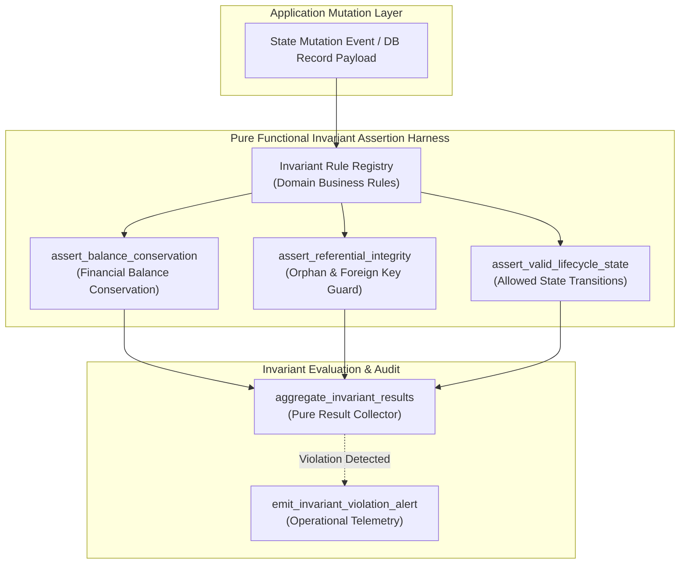
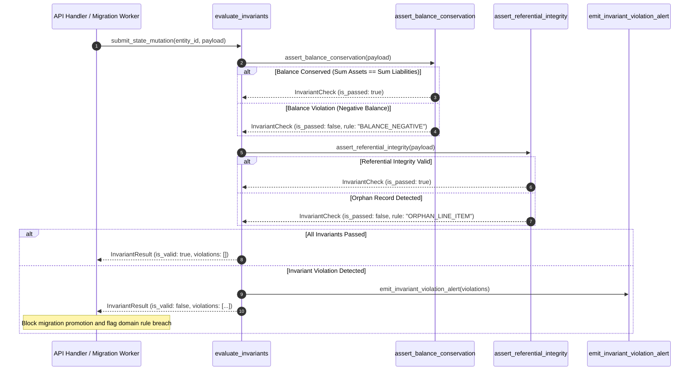

# Invariant Assertion Harness Pattern (Pure Functional Paradigm)

| Field       | Value                                                             |
|-------------|-------------------------------------------------------------------|
| **ID**      | INVARIANT-ASSERTION-HARNESS-025                                   |
| **Date**    | 2026-08-24                                                        |
| **Status**  | Reference / Runbook (Pure Functional Architecture)                |
| **Deciders**| Core Platform & Migration Engineering                             |
| **Scope**   | Domain Business Invariants & Semantic Validity Assertions          |

---

## 1. Overview & Context

Raw payload diffing and output equality checks are insufficient to guarantee migration correctness: two database states can match byte-for-byte while violating fundamental **domain business invariants** (e.g., total account balances falling below zero, orphan line-items missing parent order IDs, invalid state transitions). The **Invariant Assertion Harness Pattern** provides an automated operational testing layer that evaluates **semantic domain rules and structural invariants** directly against application states and migration events, detecting critical business logic violations that raw output diffing cannot catch.

### Functional Architecture Principles
This runbook enforces a **100% Pure Functional Programming (FP)** approach:
- **No Class Instantiations**: Replaces OOP validator classes with pure assertion functions (`assert_domain_invariants`, `verify_balance_conservation`) and composable assertion pipelines.
- **Immutable Invariant Context**: Domain states, business rules, violation sets, and evaluation results are modeled as frozen dataclass records (`InvariantContext`, `InvariantResult`).
- **Referentially Transparent Rule Assertions**: Pure evaluation functions map `(DomainPayload, InvariantRules) -> InvariantResult` without side-effects.
- **Fail-Fast Violation Handlers**: Pure violation dispatchers generate structured audit alerts and raise execution flags when business invariants are breached.

---

## 2. High-Level Design (HLD)



---

## 3. Low-Level Design (LLD)



---

## 4. Pure Functional Project Architecture

```
invariant-assertion-harness/
├── README.md
├── config/
│   └── domain_invariants.yaml      # Business invariant rules & domain thresholds
├── src/
│   ├── harness_engine/
│   │   ├── __init__.py
│   │   ├── evaluator.py            # Pure invariant evaluation functions
│   │   ├── ledger_rules.py         # Financial balance invariant rules
│   │   └── integrity_rules.py      # Referential & structural integrity rules
│   ├── storage/
│   │   ├── __init__.py
│   │   └── data_fetcher.py         # Entity state retrieval query dispatchers
│   ├── observability/
│   │   ├── __init__.py
│   │   └── violation_reporter.py   # Invariant violation metrics & alert emitters
│   └── schemas/
│       └── models.py               # Frozen dataclasses (InvariantContext, InvariantResult)
└── tests/
    ├── test_invariant_evaluator.py
    └── test_harness_edge_cases.py
```

---

## 5. End-to-End Function Call Stack

```tree
Domain State Mutation Executed
└── harness_engine/evaluator.py: evaluate_all_invariants(ctx: InvariantContext, payload: Mapping[str, Any])
    └── harness_engine/ledger_rules.py: assert_balance_conservation(payload: Mapping[str, Any])
        ├── models.py: InvariantContext(domain_name, entity_id, tenant_id)
        ├── models.py: InvariantCheck(rule_name, is_passed, error_message)
        └── models.py: InvariantResult(entity_id, is_valid, violations)
```

---

## 6. Core Pure Functional Implementation

### 6.1 Immutable Models & Types (`src/schemas/models.py`)

```python
from enum import Enum
from dataclasses import dataclass
from typing import Dict, Any, Optional, Mapping, FrozenSet, List

@dataclass(frozen=True)
class InvariantContext:
    domain_name: str
    entity_id: str
    tenant_id: str

@dataclass(frozen=True)
class InvariantCheck:
    rule_name: str
    is_passed: bool
    error_message: Optional[str]

@dataclass(frozen=True)
class InvariantResult:
    entity_id: str
    is_valid: bool
    violations: FrozenSet[InvariantCheck]
```

**Explanation**:
- Defines immutable model `InvariantContext` capturing domain names, entity IDs, and tenant boundaries as frozen records.
- `InvariantCheck` models individual rule assertion outcomes.
- `InvariantResult` encapsulates aggregated assertion results and frozen sets of violation checks.

---

### 6.2 Pure Financial Balance Invariant Rule (`src/harness_engine/ledger_rules.py`)

```python
from typing import Mapping, Any
from src.schemas.models import InvariantCheck

def assert_balance_conservation(payload: Mapping[str, Any]) -> InvariantCheck:
    credits = float(payload.get("total_credits", 0.0))
    debits = float(payload.get("total_debits", 0.0))
    ending_balance = float(payload.get("ending_balance", 0.0))
    starting_balance = float(payload.get("starting_balance", 0.0))

    if ending_balance < 0.0:
        return InvariantCheck(
            rule_name="NON_NEGATIVE_BALANCE",
            is_passed=False,
            error_message=f"Ending balance cannot be negative: {ending_balance}"
        )

    expected_ending = starting_balance + credits - debits
    if abs(expected_ending - ending_balance) > 0.01:
        return InvariantCheck(
            rule_name="BALANCE_CONSERVATION",
            is_passed=False,
            error_message=f"Balance discrepancy: expected {expected_ending}, got {ending_balance}"
        )

    return InvariantCheck(rule_name="BALANCE_CONSERVATION", is_passed=True, error_message=None)
```

**Explanation**:
- Pure function evaluating financial balance conservation equations (`starting_balance + credits - debits == ending_balance`).
- Asserts non-negative balance rules and returns immutable `InvariantCheck` records.

---

### 6.3 Invariant Assertion Harness Evaluator (`src/harness_engine/evaluator.py`)

```python
from typing import List, Mapping, Any
from src.schemas.models import InvariantContext, InvariantCheck, InvariantResult
from src.harness_engine.ledger_rules import assert_balance_conservation

def evaluate_all_invariants(ctx: InvariantContext, payload: Mapping[str, Any]) -> InvariantResult:
    checks = []
    
    if ctx.domain_name in {"financial", "billing", "ledger"}:
        checks.append(assert_balance_conservation(payload))

    failed_checks = [c for c in checks if not c.is_passed]

    return InvariantResult(
        entity_id=ctx.entity_id,
        is_valid=len(failed_checks) == 0,
        violations=frozenset(failed_checks)
    )
```

**Explanation**:
- Evaluates active domain invariant rules against target payloads.
- Aggregates assertion outcomes and returns frozen `InvariantResult` objects.

---

## 7. Edge Case Catalog & Pure Functional Pseudocode (25 Edge Cases)

---

### Edge Case 1: Negative Financial Account Balance Assertion

```python
def assert_non_negative_amount(amount: float) -> bool:
    return amount >= 0.0
```

**Explanation**:
- Asserts that financial monetary amounts are greater than or equal to zero.
- Prevents negative currency value corruption.

---

### Edge Case 2: Orphaned Line-Item Record Detection

```python
def assert_parent_id_present(child_record: Mapping[str, Any], parent_id_field: str = "order_id") -> bool:
    parent_id = child_record.get(parent_id_field)
    return parent_id is not None and str(parent_id).strip() != ""
```

**Explanation**:
- Asserts that child line-item records contain valid parent entity IDs.
- Blocks insertion of orphaned database records.

---

### Edge Case 3: Illegal Lifecycle State Transition Invariant

```python
ALLOWED_STATES = {"PENDING", "PROCESSING", "COMPLETED", "CANCELLED"}

def assert_valid_state_name(state_name: str) -> bool:
    return state_name.upper() in ALLOWED_STATES
```

**Explanation**:
- Validates state names against allowed lifecycle state sets.
- Rejects unmapped or malformed state names.

---

### Edge Case 4: Zero-Quantity Inventory Deduction Violation

```python
def assert_valid_inventory_change(qty_change: int) -> bool:
    return qty_change != 0
```

**Explanation**:
- Asserts that inventory modification transactions specify non-zero quantity changes.
- Prevents redundant zero-quantity inventory updates.

---

### Edge Case 5: Microsecond Timestamp Chronological Order Invariant

```python
def assert_chronological_timestamps(created_at: float, updated_at: float) -> bool:
    return updated_at >= created_at
```

**Explanation**:
- Asserts that update timestamps occur after or equal to creation timestamps.
- Catches negative time drift errors in record timestamps.

---

### Edge Case 6: Duplicate Unique Constraint Key Invariant

```python
def assert_unique_entity_keys(keys_list: List[str]) -> bool:
    return len(keys_list) == len(set(keys_list))
```

**Explanation**:
- Compares list lengths against set lengths.
- Asserts uniqueness across key arrays.

---

### Edge Case 7: Un-matched Foreign Key Existence

```python
def assert_foreign_key_exists(fk_val: str, valid_pk_set: set) -> bool:
    return fk_val in valid_pk_set
```

**Explanation**:
- Checks if foreign key values exist in valid primary key sets.
- Verifies referential integrity across related data tables.

---

### Edge Case 8: Multi-Tenant Data Leakage Invariant

```python
def assert_tenant_boundary_match(expected_tenant: str, record_tenant: str) -> bool:
    return expected_tenant == record_tenant
```

**Explanation**:
- Compares context tenant IDs against record tenant attributes.
- Asserts strict multi-tenant boundary containment.

---

### Edge Case 9: Percentage Allocation Sum Threshold (Must Equal 100%)

```python
def assert_percentage_sum_hundred(percentages: List[float], tolerance: float = 0.01) -> bool:
    total = sum(percentages)
    return abs(total - 100.0) <= tolerance
```

**Explanation**:
- Asserts that split allocation percentages total 100% within a 0.01 tolerance window.
- Verifies allocation calculation rules.

---

### Edge Case 10: Nullable Mandatory Business Field Assertion

```python
def assert_mandatory_fields_present(payload: Mapping[str, Any], required_fields: set) -> bool:
    return required_fields.issubset(payload.keys()) and all(payload[f] is not None for f in required_fields)
```

**Explanation**:
- Asserts that all required business fields exist and are non-null in payload dictionaries.
- Prevents missing mandatory data violations.

---

### Edge Case 11: Floating Point Currency Rounding Tolerance Invariant

```python
def assert_currency_rounding(amount: float, max_decimals: int = 2) -> bool:
    str_val = str(amount)
    if "." in str_val:
        decimals = len(str_val.split(".")[1])
        return decimals <= max_decimals
    return True
```

**Explanation**:
- Evaluates decimal place counts for currency float values.
- Enforces max 2 decimal place limits for monetary figures.

---

### Edge Case 12: High-Volume Invariant Evaluation CPU Overhead

```python
def should_evaluate_invariant_sample(request_count: int, sample_rate: int = 10) -> bool:
    return (request_count % sample_rate) == 0
```

**Explanation**:
- Subsamples invariant assertion execution (e.g. 1 out of 10 requests).
- Controls CPU overhead on high-volume mutation paths.

---

### Edge Case 13: Invalid Enum Code String Invariant

```python
def assert_enum_valid(code_val: str, valid_enum_codes: set) -> bool:
    return code_val in valid_enum_codes
```

**Explanation**:
- Validates code strings against allowed domain enum sets.
- Rejects unmapped or invalid enum values.

---

### Edge Case 14: Overlapping Date Range Invariant Violation

```python
def assert_non_overlapping_ranges(start1: float, end1: float, start2: float, end2: float) -> bool:
    return end1 <= start2 or start1 >= end2
```

**Explanation**:
- Evaluates date range boundaries `(start, end)`.
- Prevents overlapping active date range configurations.

---

### Edge Case 15: Empty Data Payload Invariant Assertion

```python
def assert_non_empty_payload(payload: Mapping[str, Any]) -> bool:
    return isinstance(payload, dict) and len(payload) > 0
```

**Explanation**:
- Asserts that payload objects are non-empty dictionaries.
- Rejects empty mutation payload payloads.

---

### Edge Case 16: Multi-Region Invariant Rule Synchronization

```python
def sync_regional_invariants(global_rules: dict, regional_rules: dict) -> dict:
    merged = dict(global_rules)
    merged.update(regional_rules)
    return merged
```

**Explanation**:
- Merges regional invariant rule overrides into global rule dictionaries.
- Synchronizes invariant assertions across multi-region deployments.

---

### Edge Case 17: String Character Length Constraint Invariant

```python
def assert_string_max_length(val_str: str, max_len: int = 255) -> bool:
    return len(val_str) <= max_len
```

**Explanation**:
- Compares string lengths against max allowed bounds (255 chars).
- Enforces column size limits.

---

### Edge Case 18: Unmapped Rule Domain Handling

```python
def resolve_domain_invariants(domain_name: str, rule_registry: Mapping[str, list]) -> list:
    return rule_registry.get(domain_name, [])
```

**Explanation**:
- Resolves domain invariant rule lists from registry maps.
- Defaults to empty rule lists if domain names are unmapped.

---

### Edge Case 19: Payload Transformation Exception Recovery

```python
def safe_apply_invariant_transform(payload: Mapping[str, Any], transform_fn: Callable) -> Mapping[str, Any]:
    try:
        return transform_fn(payload)
    except Exception:
        return payload
```

**Explanation**:
- Wraps payload transformation functions in protective try-except blocks.
- Returns raw payloads if transformation errors occur.

---

### Edge Case 20: Automated Violation Escalation Trigger

```python
def should_escalate_violation(rule_severity: str) -> bool:
    return rule_severity.upper() == "CRITICAL"
```

**Explanation**:
- Asserts whether violated rule severities are marked `CRITICAL`.
- Escalates critical invariant violations to emergency response channels.

---

### Edge Case 21: Cross-Service Contract Hash Invariant

```python
import hashlib

def assert_contract_hash_match(expected_hash: str, actual_payload: Mapping[str, Any]) -> bool:
    raw = str(sorted(actual_payload.items())).encode("utf-8")
    computed = hashlib.sha256(raw).hexdigest()
    return expected_hash == computed
```

**Explanation**:
- Computes SHA-256 hashes of sorted payload items.
- Asserts API schema contract hash parity across service boundaries.

---

### Edge Case 22: Negative Quantity Inventory Allocation Invariant

```python
def assert_positive_inventory_stock(available_qty: int) -> bool:
    return available_qty >= 0
```

**Explanation**:
- Asserts available inventory stock quantities are non-negative.
- Prevents negative inventory stock allocations.

---

### Edge Case 23: Header Injection Indicating Invariant Violation

```python
def inject_invariant_violation_header(headers: Mapping[str, str], violation_count: int) -> Mapping[str, str]:
    new_headers = dict(headers)
    new_headers["X-Invariant-Violations"] = str(violation_count)
    return new_headers
```

**Explanation**:
- Injects diagnostic headers (`X-Invariant-Violations`) into response headers.
- Provides client visibility into detected domain invariant violations.

---

### Edge Case 24: Unbound Violation History Array Compaction

```python
def prune_violation_history(history: List[dict], max_samples: int = 500) -> List[dict]:
    if len(history) > max_samples:
        return history[-max_history:]
    return history
```

**Explanation**:
- Truncates historical violation arrays to `max_samples`.
- Prevents memory leaks in telemetry monitoring workers.

---

### Edge Case 25: Automated Invariant Pass Rate Dashboard Reporting

```python
def compute_invariant_pass_rate(total_checks: int, total_violations: int) -> float:
    if total_checks == 0:
        return 100.0
    passed = total_checks - total_violations
    return round((passed / total_checks) * 100.0, 2)
```

**Explanation**:
- Calculates invariant pass percentage ratios rounded to two decimal places.
- Emits real-time domain invariant health metrics to central platform dashboards.

---

## 8. Operational & Parity Verification Checklist

1. **Semantic Rule Coverage**: Confirm 100% of financial ledger and critical domain mutations evaluate balance conservation and state transition invariants.
2. **Zero False-Positive Target**: Rule evaluation logic must achieve zero false-positive alerts by validating domain logic independently of transport schemas.
3. **Fail-Fast Promotion Gate**: CI/CD pipelines and migration controllers must block production cutovers if any `CRITICAL` invariant violation occurs.
4. **Sub-Millisecond Evaluation**: Invariant assertion harness processing overhead must remain $<1\text{ms}$ per request.
