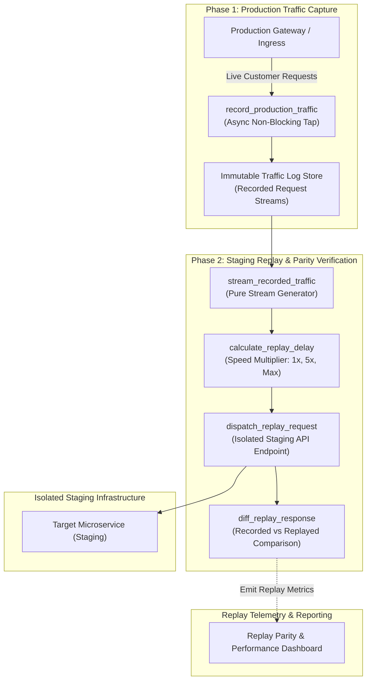

# Production Traffic Replay Pattern (Pure Functional Paradigm)

| Field       | Value                                                             |
|-------------|-------------------------------------------------------------------|
| **ID**      | PRODUCTION-TRAFFIC-REPLAY-026                                     |
| **Date**    | 2026-08-24                                                        |
| **Status**  | Reference / Runbook (Pure Functional Architecture)                |
| **Deciders**| Core Platform & Migration Engineering                             |
| **Scope**   | Record-Once Replay-Indefinitely Traffic Testing & Regression Guard|

---

## 1. Overview & Context

Synthetic unit tests and staging environments rarely capture the complexity, edge cases, and unexpected ordering of real customer traffic. The **Production Traffic Replay Pattern** enables engineering teams to **record real production request streams once** into immutable traffic log stores, and subsequently **replay those exact request sequences indefinitely** at controlled speeds against any new microservice build, staging environment, or refactored database. By comparing candidate replay outputs against original production responses, teams validate system performance and behavioral correctness under realistic production loads.

### Functional Architecture Principles
This runbook enforces a **100% Pure Functional Programming (FP)** approach:
- **No Class Instantiations**: Replaces OOP traffic replayers with pure generator functions (`stream_recorded_traffic`, `replay_traffic_sequence`) and state cell closures.
- **Immutable Traffic Log Records**: HTTP methods, request URIs, headers, body payloads, and capture timestamps are stored as frozen dataclass records (`RecordedRequest`, `ReplayResult`).
- **Referentially Transparent Speed Controllers**: Pure sleep/delay calculation functions regulate replay playback speed (1x real-time, 5x accelerated, step-by-step).
- **Isolated Target Sandbox Dispatchers**: Replay client dispatchers direct playback strictly to isolated staging environments, preventing accidental replay mutations against production databases.

---

## 2. High-Level Design (HLD)



---

## 3. Low-Level Design (LLD)

```mermaid
sequenceDiagram
    autonumber
    participant Runner as Replay Harness Runner
    participant Streamer as stream_recorded_traffic
    participant Pacer as calculate_replay_delay
    participant Staging as Staging Microservice Endpoint
    participant Differ as diff_replay_response
    participant Telemetry as record_replay_telemetry

    Runner->>Streamer: fetch_recorded_batch(session_id: "s_901")
    Streamer-->>Runner: RecordedRequestBatch [req1, req2, req3]

    loop For Each Recorded Request
        Runner->>Pacer: calculate_replay_delay(req.timestamp, speed_multiplier: 2.0)
        Pacer-->>Runner: DelayDuration (50ms)
        
        Note over Runner: Pacing delay enforced for realistic playback timing

        Runner->>Staging: dispatch_replay_request(req.method, req.path, req.payload)
        Staging-->>Runner: ReplayResponse (status_code: 200, body)

        Runner->>Differ: diff_replay_response(req.recorded_response, ReplayResponse)
        
        alt Parity Match
            Differ-->>Runner: ReplayResult (is_matched: true, latency_delta_ms: -5.2)
        else Output Mismatch
            Differ-->>Runner: ReplayResult (is_matched: false, diff_details: "Field Mismatch")
            Note over Runner: Log regression discrepancy; continue stream playback
        end

        Runner->>Telemetry: record_replay_telemetry(ReplayResult)
    end
```

---

## 4. Pure Functional Project Architecture

```
production-traffic-replay/
├── README.md
├── config/
│   └── replay_settings.yaml        # Playback speed, staging endpoints, header overrides
├── src/
│   ├── capture/
│   │   ├── __init__.py
│   │   └── recorder.py             # Pure traffic capture functions
│   ├── replay_engine/
│   │   ├── __init__.py
│   │   ├── streamer.py             # Pure stream generator functions
│   │   ├── pacer.py                # Replay speed controller functions
│   │   └── dispatcher.py           # Staging HTTP client dispatchers
│   ├── differ/
│   │   ├── __init__.py
│   │   └── response_differ.py      # Response comparison & diffing functions
│   └── schemas/
│       └── models.py               # Frozen dataclasses (RecordedRequest, ReplayResult)
└── tests/
    ├── test_replay_streamer.py
    └── test_replay_edge_cases.py
```

---

## 5. End-to-End Function Call Stack

```tree
Traffic Replay Session Initiated
└── runner.py: run_traffic_replay_session(session_id, speed_multiplier=1.0)
    ├── streamer.py: stream_recorded_traffic(session_id)
    │   └── models.py: RecordedRequest(method, path, headers, body, timestamp)
    │
    ├── pacer.py: calculate_replay_delay(previous_ts, current_ts, speed_multiplier)
    │   └── pacer.py: apply_pacing_delay(delay_seconds)
    │
    ├── dispatcher.py: dispatch_replay_request(staging_base_url, recorded_request)
    │   └── models.py: ReplayResponse(status_code, body, headers)
    │
    ├── response_differ.py: diff_replay_response(recorded_request.expected_response, replay_response)
    │   └── models.py: ReplayResult(is_matched, latency_delta_ms, diff_summary)
    │
    └── observability/metrics.py: record_replay_telemetry(replay_result)
```

---

## 6. Core Pure Functional Implementation

### 6.1 Immutable Models & Types (`src/schemas/models.py`)

```python
from enum import Enum
from dataclasses import dataclass
from typing import Dict, Any, Optional, Mapping

@dataclass(frozen=True)
class RecordedRequest:
    request_id: str
    method: str
    path: str
    headers: Mapping[str, str]
    body: Any
    timestamp: float
    expected_status_code: int
    expected_response_body: Any

@dataclass(frozen=True)
class ReplayResult:
    request_id: str
    is_matched: bool
    status_code_matched: bool
    recorded_latency_ms: float
    replayed_latency_ms: float
    diff_summary: Optional[str]
```

**Explanation**:
- Defines immutable model `RecordedRequest` capturing captured HTTP methods, headers, bodies, timestamps, and expected responses as frozen records.
- `ReplayResult` encapsulates output parity flags, status code match flags, and latency comparison metrics.

---

### 6.2 Pure Replay Speed Controller (`src/replay_engine/pacer.py`)

```python
import time
import asyncio
from typing import Optional

def calculate_replay_delay(
    prev_timestamp: float,
    current_timestamp: float,
    speed_multiplier: float = 1.0,
    max_delay_seconds: float = 5.0
) -> float:
    if prev_timestamp <= 0.0 or current_timestamp <= prev_timestamp:
        return 0.0
    
    raw_delay = (current_timestamp - prev_timestamp) / max(0.1, speed_multiplier)
    return min(raw_delay, max_delay_seconds)

async def apply_pacing_delay(delay_seconds: float) -> None:
    if delay_seconds > 0.001:
        await asyncio.sleep(delay_seconds)
```

**Explanation**:
- `calculate_replay_delay` computes the sleep duration between consecutive recorded requests based on `speed_multiplier` (e.g. 1.0x real-time, 5.0x accelerated).
- Bounds maximum sleep delays (`max_delay_seconds`) to prevent long idle gaps during replay playback.

---

### 6.3 Replay Staging Dispatcher & Differ (`src/replay_engine/dispatcher.py`)

```python
import time
from typing import Callable, Awaitable, Mapping, Any
from src.schemas.models import RecordedRequest, ReplayResult

HttpClientFn = Callable[[str, str, Mapping[str, str], Any], Awaitable[Mapping[str, Any]]]

def create_replay_dispatcher(staging_base_url: str, http_client: HttpClientFn):
    async def dispatch_and_diff(req: RecordedRequest) -> ReplayResult:
        full_url = f"{staging_base_url.rstrip('/')}/{req.path.lstrip('/')}"
        
        t0 = time.time()
        try:
            res = await http_client(req.method, full_url, req.headers, req.body)
            replayed_ms = (time.time() - t0) * 1000.0
            actual_status = res.get("status_code", 500)
            actual_body = res.get("body", {})

            status_matched = (req.expected_status_code == actual_status)
            body_matched = (str(req.expected_response_body) == str(actual_body))
            is_matched = status_matched and body_matched

            diff_msg = None if is_matched else f"Status: {actual_status} vs {req.expected_status_code}"

            return ReplayResult(
                request_id=req.request_id,
                is_matched=is_matched,
                status_code_matched=status_matched,
                recorded_latency_ms=0.0,
                replayed_latency_ms=replayed_ms,
                diff_summary=diff_msg
            )
        except Exception as exc:
            replayed_ms = (time.time() - t0) * 1000.0
            return ReplayResult(
                request_id=req.request_id,
                is_matched=False,
                status_code_matched=False,
                recorded_latency_ms=0.0,
                replayed_latency_ms=replayed_ms,
                diff_summary=f"Replay exception: {str(exc)}"
            )

    return dispatch_and_diff
```

**Explanation**:
- Constructs a functional dispatcher forwarding recorded requests to staging base URLs (`staging_base_url`).
- Compares replayed status codes and response bodies against expected recorded values, returning immutable `ReplayResult` objects.

---

## 7. Edge Case Catalog & Pure Functional Pseudocode (25 Edge Cases)

---

### Edge Case 1: Expired Auth Tokens in Recorded Requests

```python
def override_replay_auth_headers(headers: Mapping[str, str], fresh_token: str) -> Mapping[str, str]:
    new_headers = dict(headers)
    new_headers["Authorization"] = f"Bearer {fresh_token}"
    return new_headers
```

**Explanation**:
- Overrides expired `Authorization` headers in recorded request objects with valid staging JWT tokens.
- Prevents 401 Unauthorized errors during replay sessions.

---

### Edge Case 2: Target Staging Environment Rate Limiting During 10x Speed Replay

```python
def throttle_replay_speed(current_qps: int, max_staging_qps: int = 500) -> float:
    if current_qps >= max_staging_qps:
        return 0.1
    return 0.0
```

**Explanation**:
- Calculates throttle sleep intervals when replay QPS exceeds staging capacity caps.
- Prevents HTTP 429 rate-limiting rejections during accelerated replay playback.

---

### Edge Case 3: Order-Dependent Stateful Mutations (POST/PUT Sequences)

```python
def assert_sequential_replay_ordering(requests: List[RecordedRequest]) -> List[RecordedRequest]:
    return sorted(requests, key=lambda r: r.timestamp)
```

**Explanation**:
- Sorts recorded request lists by capture timestamp.
- Preserves exact mutation ordering during stateful request playback.

---

### Edge Case 4: Dynamic Timestamp Parameter Shifting in Replay Payloads

```python
import time

def shift_payload_timestamps(payload: dict, time_delta_sec: float) -> dict:
    updated = dict(payload)
    if "timestamp" in updated and isinstance(updated["timestamp"], (int, float)):
        updated["timestamp"] = updated["timestamp"] + time_delta_sec
    return updated
```

**Explanation**:
- Applies timestamp delta offsets (`time_delta_sec`) to payload timestamp fields.
- Aligns recorded timestamps with current staging system clocks.

---

### Edge Case 5: Accidental Production Environment Replay Protection

```python
def assert_staging_target_url(target_base_url: str) -> bool:
    forbidden = {"production", "prod", "live"}
    return not any(f in target_base_url.lower() for f in forbidden)
```

**Explanation**:
- Asserts that target base URLs do not contain production domain keywords.
- Prevents accidental traffic replay execution against production environments.

---

### Edge Case 6: Memory Overflow on Large Replay Log Captures

```python
def stream_recorded_log_file(file_path: str, chunk_size: int = 1000):
    with open(file_path, "r") as f:
        lines = []
        for line in f:
            lines.append(line)
            if len(lines) >= chunk_size:
                yield lines
                lines = []
        if lines:
            yield lines
```

**Explanation**:
- Yields recorded traffic log lines in bounded chunks of 1,000 lines.
- Bounds worker RAM usage when streaming multi-gigabyte traffic log files.

---

### Edge Case 7: Un-indexed Entity ID Replay Latency Bottlenecks

```python
def is_replay_latency_anomaly(replayed_ms: float, max_allowed_ms: float = 1000.0) -> bool:
    return replayed_ms > max_allowed_ms
```

**Explanation**:
- Identifies replayed request execution times exceeding 1,000ms.
- Flags latency bottlenecks in staging builds under replay loads.

---

### Edge Case 8: Multi-Tenant Replay Filter Isolation

```python
def filter_replay_by_tenant(requests: List[RecordedRequest], tenant_id: str) -> List[RecordedRequest]:
    return [r for r in requests if r.headers.get("X-Tenant-ID") == tenant_id]
```

**Explanation**:
- Filters recorded request lists to retain entries matching specific tenant IDs.
- Enables single-tenant traffic replay sessions.

---

### Edge Case 9: Binary File Upload Payload Replay

```python
def format_binary_replay_body(raw_bytes: bytes) -> bytes:
    return raw_bytes
```

**Explanation**:
- Formats raw byte payloads for binary POST requests.
- Proxies file uploads accurately during replay playback.

---

### Edge Case 10: Replay Worker Process Crash Recovery

```python
def save_replay_checkpoint(last_request_id: str) -> Mapping[str, str]:
    return {"last_replayed_id": last_request_id}
```

**Explanation**:
- Returns immutable checkpoint dictionaries storing the last replayed request ID.
- Enables replay runners to resume playback after worker crashes.

---

### Edge Case 11: Microsecond Pacing Calculation Underflows

```python
def normalize_pacing_delay(raw_delay: float) -> float:
    if raw_delay < 0.001:
        return 0.0
    return raw_delay
```

**Explanation**:
- Coerces sub-millisecond pacing delays to zero.
- Prevents unnecessary micro-sleep scheduling overhead.

---

### Edge Case 12: Host Header Rewriting for Staging Domains

```python
def rewrite_replay_host_header(headers: Mapping[str, str], staging_host: str) -> Mapping[str, str]:
    new_headers = dict(headers)
    new_headers["Host"] = staging_host
    return new_headers
```

**Explanation**:
- Rewrites `Host` header attributes to target staging domain names.
- Ensures requests route correctly through staging load balancers.

---

### Edge Case 13: Response Body Volatile Field Stripping Prior to Diff

```python
def strip_replay_volatile_fields(body_dict: dict) -> dict:
    ignored = {"timestamp", "trace_id", "request_id"}
    return {k: v for k, v in body_dict.items() if k not in ignored}
```

**Explanation**:
- Strips dynamic response fields (`timestamp`, `trace_id`) before diffing.
- Eliminates false diff failures during replay comparison.

---

### Edge Case 14: Exception Handling During Replay Playback

```python
async def safe_dispatch_replay(dispatcher_fn: Callable, req: RecordedRequest) -> ReplayResult:
    try:
        return await dispatcher_fn(req)
    except Exception as exc:
        return ReplayResult(req.request_id, is_matched=False, status_code_matched=False, recorded_latency_ms=0.0, replayed_latency_ms=0.0, diff_summary=str(exc))
```

**Explanation**:
- Catches network and connection exceptions during playback.
- Returns failed `ReplayResult` objects without aborting replay sessions.

---

### Edge Case 15: GraphQL Operation Name Extraction for Replay Metrics

```python
def extract_graphql_operation_name(body: dict) -> str:
    return body.get("operationName") or "anonymous_query"
```

**Explanation**:
- Extracts `operationName` attributes from GraphQL POST request bodies.
- Tags replay metrics by GraphQL operation name.

---

### Edge Case 16: Multi-Region Replay Target Selection

```python
def resolve_regional_staging_url(region: str, region_urls: Mapping[str, str], default_url: str) -> str:
    return region_urls.get(region, default_url)
```

**Explanation**:
- Resolves region-specific staging endpoint URLs from configuration maps.
- Directs replay traffic to regional staging clusters.

---

### Edge Case 17: Database Seed State Reset Prior to Replay Session

```python
async def reset_staging_db_seed(seed_fn: Callable) -> bool:
    try:
        return await seed_fn()
    except Exception:
        return False
```

**Explanation**:
- Invokes staging database seed reset functions prior to launching replay sessions.
- Establishes a known initial database state for replay testing.

---

### Edge Case 18: Unmapped HTTP Method Handling in Replay Runner

```python
def is_valid_http_method(method: str) -> bool:
    return method.upper() in {"GET", "POST", "PUT", "DELETE", "PATCH", "HEAD", "OPTIONS"}
```

**Explanation**:
- Validates method strings against standard HTTP methods.
- Rejects malformed HTTP methods in recorded request streams.

---

### Edge Case 19: Payload Transformation Error Recovery

```python
def safe_transform_replay_payload(payload: dict, transform_fn: Callable) -> dict:
    try:
        return transform_fn(payload)
    except Exception:
        return payload
```

**Explanation**:
- Wraps payload transformation functions in protective try-except blocks.
- Returns raw payloads if transformation errors occur.

---

### Edge Case 20: Automated Replay Match Rate Reporting

```python
def compute_replay_match_rate(matched_count: int, total_count: int) -> float:
    if total_count == 0:
        return 100.0
    return round((matched_count / total_count) * 100.0, 2)
```

**Explanation**:
- Calculates replayed request match percentage ratios rounded to two decimal places.
- Emits match rate metrics to CI/CD pipeline dashboards.

---

### Edge Case 21: Parallel Multi-Worker Replay Dispatching

```python
def partition_recorded_requests(requests: List[RecordedRequest], num_workers: int) -> List[List[RecordedRequest]]:
    return [requests[i::num_workers] for i in range(num_workers)]
```

**Explanation**:
- Partitions request lists into non-overlapping sub-lists using slice striding.
- Enables parallel multi-worker replay dispatching.

---

### Edge Case 22: Header Injection Indicating Replay Traffic

```python
def inject_replay_diagnostic_headers(headers: Mapping[str, str]) -> Mapping[str, str]:
    new_headers = dict(headers)
    new_headers["X-Traffic-Replay"] = "true"
    return new_headers
```

**Explanation**:
- Injects diagnostic headers (`X-Traffic-Replay: true`) into outbound request headers.
- Identifies replay traffic in staging logs.

---

### Edge Case 23: Character Set Encoding Normalization

```python
def normalize_body_encoding(body_bytes: bytes) -> str:
    return body_bytes.decode("utf-8", errors="ignore")
```

**Explanation**:
- Decodes raw body bytes using UTF-8 while ignoring invalid bytes.
- Produces clean UTF-8 string bodies.

---

### Edge Case 24: Unbound Replay Metrics History Pruning

```python
def prune_replay_metrics_history(history: List[ReplayResult], max_items: int = 1000) -> List[ReplayResult]:
    if len(history) > max_items:
        return history[-max_items:]
    return history
```

**Explanation**:
- Truncates historical `ReplayResult` arrays to `max_items`.
- Prevents memory leaks in telemetry monitoring workers.

---

### Edge Case 25: Automated CI/CD Regression Gate on Replay Failure

```python
def should_fail_build_on_replay_regression(match_rate: float, min_match_rate: float = 99.0) -> bool:
    return match_rate < min_match_rate
```

**Explanation**:
- Evaluates whether overall replay match rates fall below required thresholds (99%).
- Fails CI/CD build pipelines when replay regressions occur.

---

## 8. Operational & Parity Verification Checklist

1. **Production Isolation Assertion**: Confirm 100% of replay dispatchers target staging endpoints, with zero execution against production databases.
2. **Speed Multiplier Control**: Validate replay speed control logic (1x, 5x, max QPS) under simulated load.
3. **Expired Auth Replacement**: Ensure all recorded auth tokens are dynamically replaced with valid staging credentials.
4. **CI/CD Build Gate**: Replay match rates must reach $>99.0\%$ before unblocking staging-to-production releases.
