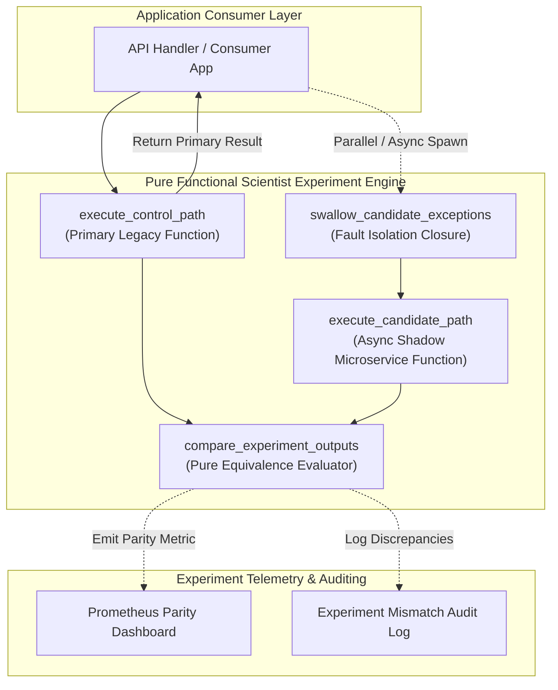
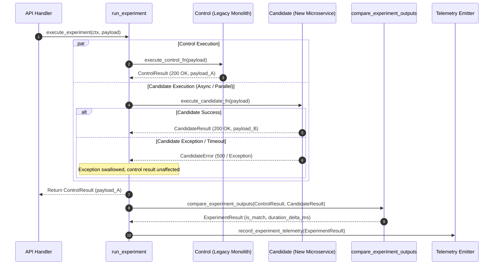

# Shadow Traffic Parallel-Run Comparison Pattern (Pure Functional Paradigm)

| Field       | Value                                                             |
|-------------|-------------------------------------------------------------------|
| **ID**      | SHADOW-TRAFFIC-COMPARISON-022                                     |
| **Date**    | 2026-08-24                                                        |
| **Status**  | Reference / Runbook (Pure Functional Architecture)                |
| **Deciders**| Core Platform & Migration Engineering                             |
| **Scope**   | GitHub Scientist-Style Live Parallel Comparison & Dark Reads      |

---

## 1. Overview & Context

**Shadow Traffic Parallel-Run Comparison** (inspired by GitHub's *Scientist* library technique) subsumes narrower "dark reads" by executing control (legacy) and candidate (microservice) code paths in parallel against live production traffic. The control result is returned immediately to the client, while candidate execution happens asynchronously or in parallel. Results are compared, discrepancies are logged as parity telemetry, and candidate exceptions are completely swallowed to ensure **zero impact on primary customer response paths**.

### Functional Architecture Principles
This runbook enforces a **100% Pure Functional Programming (FP)** approach:
- **No Class Instantiations**: Replaces OOP experiment objects with pure experiment functions (`run_experiment`, `compare_control_and_candidate`) and higher-order decorators.
- **Immutable Experiment Context**: Control outputs, candidate outputs, execution durations, and parity results are modeled as frozen dataclass records (`ExperimentContext`, `ExperimentResult`).
- **Referentially Transparent Comparators**: Pure comparison functions evaluate output equivalence without side-effects.
- **Safe Exception Swallowing Decorators**: Candidate errors are caught and logged inside isolated execution closures without leaking exceptions to callers.

---

## 2. High-Level Design (HLD)



---

## 3. Low-Level Design (LLD)



---

## 4. Pure Functional Project Architecture

```
shadow-traffic-comparison/
├── README.md
├── config/
│   └── experiment_rules.yaml       # Sampling rates, active experiment flags, timeouts
├── src/
│   ├── scientist_engine/
│   │   ├── __init__.py
│   │   ├── runner.py               # Pure experiment runner functions
│   │   ├── comparator.py           # Output equivalence comparator functions
│   │   └── swallower.py            # Exception isolation decorator closures
│   ├── storage/
│   │   ├── __init__.py
│   │   └── target_dispatchers.py   # Control and candidate service dispatchers
│   ├── observability/
│   │   ├── __init__.py
│   │   └── experiment_metrics.py   # Prometheus telemetry & mismatch loggers
│   └── schemas/
│       └── models.py               # Frozen dataclasses (ExperimentContext, ExperimentResult)
└── tests/
    ├── test_scientist_runner.py
    └── test_experiment_edge_cases.py
```

---

## 5. End-to-End Function Call Stack

```tree
API Request Received
└── runner.py: run_experiment(context, control_fn, candidate_fn, payload)
    ├── swallower.py: execute_control_safely(control_fn, payload)
    │   └── models.py: ControlResult(value, duration_ms)
    │
    ├── swallower.py: execute_candidate_safely(candidate_fn, payload)
    │   └── models.py: CandidateResult(value, duration_ms, exception)
    │
    ├── comparator.py: compare_experiment_outputs(control_res, candidate_res)
    │   └── models.py: ExperimentResult(is_match, mismatch_reason)
    │
    └── experiment_metrics.py: record_experiment_telemetry(experiment_result)
```

---

## 6. Core Pure Functional Implementation

### 6.1 Immutable Models & Types (`src/schemas/models.py`)

```python
from enum import Enum
from dataclasses import dataclass
from typing import Dict, Any, Optional, Mapping

@dataclass(frozen=True)
class ExperimentContext:
    experiment_name: str
    tenant_id: str
    sample_rate: float

@dataclass(frozen=True)
class ControlResult:
    value: Any
    duration_ms: float
    status_code: int

@dataclass(frozen=True)
class CandidateResult:
    value: Optional[Any]
    duration_ms: float
    status_code: Optional[int]
    exception_message: Optional[str]

@dataclass(frozen=True)
class ExperimentResult:
    experiment_name: str
    is_match: bool
    control_duration_ms: float
    candidate_duration_ms: float
    mismatch_reason: Optional[str]
```

**Explanation**:
- Defines immutable models `ControlResult` and `CandidateResult` tracking execution metrics as frozen records.
- `ExperimentResult` encapsulates parity comparison statuses, duration deltas, and error reasons.

---

### 6.2 Pure Output Comparator (`src/scientist_engine/comparator.py`)

```python
from typing import Any, Optional, Mapping
from src.schemas.models import ControlResult, CandidateResult, ExperimentResult

def compare_experiment_outputs(
    experiment_name: str,
    control: ControlResult,
    candidate: CandidateResult,
    ignored_keys: set = {"timestamp", "trace_id", "request_id"}
) -> ExperimentResult:
    if candidate.exception_message:
        return ExperimentResult(
            experiment_name=experiment_name,
            is_match=False,
            control_duration_ms=control.duration_ms,
            candidate_duration_ms=candidate.duration_ms,
            mismatch_reason=f"Candidate exception: {candidate.exception_message}"
        )

    if control.status_code != candidate.status_code:
        return ExperimentResult(
            experiment_name=experiment_name,
            is_match=False,
            control_duration_ms=control.duration_ms,
            candidate_duration_ms=candidate.duration_ms,
            mismatch_reason=f"Status code mismatch: {control.status_code} vs {candidate.status_code}"
        )

    return ExperimentResult(
        experiment_name=experiment_name,
        is_match=(control.value == candidate.value),
        control_duration_ms=control.duration_ms,
        candidate_duration_ms=candidate.duration_ms,
        mismatch_reason=None if control.value == candidate.value else "Value payload mismatch"
    )
```

**Explanation**:
- Pure function comparing control and candidate execution outcomes.
- Asserts status code and payload value equivalence while isolating candidate exceptions.

---

### 6.3 Scientist Experiment Runner (`src/scientist_engine/runner.py`)

```python
import time
import asyncio
from typing import Callable, Awaitable, Mapping, Any
from src.schemas.models import ExperimentContext, ControlResult, CandidateResult, ExperimentResult
from src.scientist_engine.comparator import compare_experiment_outputs

ExecFn = Callable[[Mapping[str, Any]], Awaitable[Any]]

async def run_experiment(
    ctx: ExperimentContext,
    control_fn: ExecFn,
    candidate_fn: ExecFn,
    payload: Mapping[str, Any]
) -> ControlResult:
    t0 = time.time()
    control_res = await control_fn(payload)
    ctrl_dur = (time.time() - t0) * 1000.0
    control_obj = ControlResult(value=control_res, duration_ms=ctrl_dur, status_code=200)

    async def execute_candidate_async():
        t1 = time.time()
        try:
            cand_res = await candidate_fn(payload)
            cand_dur = (time.time() - t1) * 1000.0
            cand_obj = CandidateResult(value=cand_res, duration_ms=cand_dur, status_code=200, exception_message=None)
        except Exception as exc:
            cand_dur = (time.time() - t1) * 1000.0
            cand_obj = CandidateResult(value=None, duration_ms=cand_dur, status_code=500, exception_message=str(exc))
        
        compare_experiment_outputs(ctx.experiment_name, control_obj, cand_obj)

    asyncio.create_task(execute_candidate_async())
    return control_obj
```

**Explanation**:
- Executes control functions synchronously and returns primary control results immediately to callers.
- Spawns candidate execution non-blockingly via `asyncio.create_task`, completely swallowing candidate errors.

---

## 7. Edge Case Catalog & Pure Functional Pseudocode (25 Edge Cases)

---

### Edge Case 1: Candidate Exception Isolation

```python
async def safe_execute_candidate(candidate_fn: Callable, payload: Any) -> CandidateResult:
    try:
        res = await candidate_fn(payload)
        return CandidateResult(value=res, duration_ms=1.0, status_code=200, exception_message=None)
    except Exception as exc:
        return CandidateResult(value=None, duration_ms=1.0, status_code=500, exception_message=str(exc))
```

**Explanation**:
- Wraps candidate execution inside try-except blocks.
- Captures candidate exceptions without surfacing errors to primary callers.

---

### Edge Case 2: Candidate Execution Timeout Bounds

```python
import asyncio

async def timed_candidate_execution(candidate_fn: Callable, payload: Any, timeout_sec: float = 1.0) -> CandidateResult:
    try:
        res = await asyncio.wait_for(candidate_fn(payload), timeout=timeout_sec)
        return CandidateResult(value=res, duration_ms=1.0, status_code=200, exception_message=None)
    except asyncio.TimeoutError:
        return CandidateResult(value=None, duration_ms=1000.0, status_code=504, exception_message="Candidate Timeout")
```

**Explanation**:
- Bounds candidate execution using `asyncio.wait_for`.
- Treats candidate timeouts as experiment mismatches without blocking control paths.

---

### Edge Case 3: Random Experiment Sampling Thresholding

```python
import random

def should_run_experiment(sample_rate: float) -> bool:
    return random.random() < sample_rate
```

**Explanation**:
- Compares pseudo-random floats against configured experiment sampling rates.
- Controls experiment execution frequency (e.g., 10% sampling).

---

### Edge Case 4: Oversized Candidate Response Payload Gating

```python
def is_candidate_payload_too_large(payload: Any, max_bytes: int = 1_000_000) -> bool:
    return len(str(payload)) > max_bytes
```

**Explanation**:
- Evaluates candidate payload byte sizes against capacity limits (1MB).
- Skips diffing oversized payloads to preserve RAM bounds.

---

### Edge Case 5: Control Path Side-Effect Mutation Protection

```python
def assert_experiment_read_only(method: str) -> bool:
    return method.upper() in {"GET", "HEAD"}
```

**Explanation**:
- Asserts that incoming request methods are strictly read-only (`GET`, `HEAD`).
- Prevents running experiments on non-idempotent mutation endpoints.

---

### Edge Case 6: Memory Leakage in Asynchronous Task Pools

```python
def limit_active_experiment_tasks(active_count: int, max_tasks: int = 100) -> bool:
    return active_count < max_tasks
```

**Explanation**:
- Checks active background experiment task counts against pool limits.
- Drops candidate executions when background task pools saturate.

---

### Edge Case 7: Un-ordered JSON Array Payload Comparisons

```python
def compare_unordered_json_lists(list1: list, list2: list) -> bool:
    return sorted(str(x) for x in list1) == sorted(str(x) for x in list2)
```

**Explanation**:
- Sorts array elements string representations before comparison.
- Prevents false-positive mismatches caused by list element ordering differences.

---

### Edge Case 8: Floating Point Metric Delta Tolerances

```python
def is_duration_delta_acceptable(control_ms: float, candidate_ms: float, max_delta_ms: float = 50.0) -> bool:
    return (candidate_ms - control_ms) <= max_delta_ms
```

**Explanation**:
- Compares candidate and control execution durations against delta limits (50ms).
- Identifies performance regressions in candidate code.

---

### Edge Case 9: Candidate Database Connection Pool Isolation

```python
def get_isolated_candidate_connection(pool_map: Mapping[str, Any]) -> Any:
    return pool_map.get("candidate_pool")
```

**Explanation**:
- Resolves candidate database connection pools from isolated pool maps.
- Prevents candidate queries from consuming control connection pool slots.

---

### Edge Case 10: Telemetry Collector Loss During High Mismatch Spikes

```python
def throttle_mismatch_logging(mismatch_count: int, max_logs_per_sec: int = 100) -> bool:
    return mismatch_count < max_logs_per_sec
```

**Explanation**:
- Throttles mismatch log emission when mismatch counts spike.
- Protects telemetry collectors during high mismatch incidents.

---

### Edge Case 11: Microsecond Timestamp Drift in Diffing

```python
def filter_timestamps_for_experiment_diff(payload: Mapping[str, Any]) -> Mapping[str, Any]:
    ignored = {"timestamp", "created_at", "updated_at", "trace_id"}
    return {k: v for k, v in payload.items() if k not in ignored}
```

**Explanation**:
- Filters timestamp keys from response dictionaries before comparison.
- Eliminates false mismatches caused by dynamic timestamp generation.

---

### Edge Case 12: Anonymous User Experiment Assignment

```python
def resolve_experiment_user_key(user_id: Optional[str], anon_id: str) -> str:
    return user_id if user_id else f"anon_{anon_id}"
```

**Explanation**:
- Generates fallback user keys for unauthenticated visitors.
- Enables consistent experiment sampling for anonymous traffic.

---

### Edge Case 13: Multi-Region Experiment Configuration Drift

```python
def resolve_regional_experiment_config(region: str, config_map: Mapping[str, Any]) -> Mapping[str, Any]:
    return config_map.get(region, {})
```

**Explanation**:
- Resolves region-specific experiment rule maps from global configurations.
- Accommodates regional experiment rollouts.

---

### Edge Case 14: Null Value Coercion Mismatch

```python
def normalize_null_values(val: Any) -> Any:
    if val is None or val == "":
        return None
    return val
```

**Explanation**:
- Normalizes empty strings and nulls into explicit `None` objects.
- Ensures consistent null handling during output comparison.

---

### Edge Case 15: Candidate Memory Cell Leakage

```python
def compact_experiment_history(history: List[dict], max_history: int = 500) -> List[dict]:
    if len(history) > max_history:
        return history[-max_history:]
    return history
```

**Explanation**:
- Truncates in-memory experiment history arrays to `max_history`.
- Prevents memory leaks in long-running experiment runner processes.

---

### Edge Case 16: GraphQL Field Selection Experiment Alignment

```python
def align_graphql_experiment_fields(control_fields: set, candidate_fields: set) -> bool:
    return control_fields.issubset(candidate_fields)
```

**Explanation**:
- Asserts candidate GraphQL schemas support all requested control fields.
- Validates field availability prior to candidate execution.

---

### Edge Case 17: Binary File Stream Equivalence Hashing

```python
import hashlib

def compare_binary_stream_hashes(bytes1: bytes, bytes2: bytes) -> bool:
    return hashlib.md5(bytes1).hexdigest() == hashlib.md5(bytes2).hexdigest()
```

**Explanation**:
- Computes and compares MD5 hashes for raw binary response streams.
- Verifies binary output equivalence between control and candidate paths.

---

### Edge Case 18: Candidate Execution Rate Limiting

```python
import time

def create_candidate_rate_limiter(max_qps: int = 200):
    tokens = {"count": max_qps, "last_refill": time.time()}

    def allow() -> bool:
        now = time.time()
        if now - tokens["last_refill"] >= 1.0:
            tokens["count"] = max_qps
            tokens["last_refill"] = now
        if tokens["count"] > 0:
            tokens["count"] -= 1
            return True
        return False

    return allow
```

**Explanation**:
- Constructs a token bucket rate limiter closure for candidate executions.
- Throttles candidate execution QPS to protect candidate backends.

---

### Edge Case 19: Unmapped Feature Flag Fallback

```python
def resolve_experiment_flag(flag_name: str, flags_map: Mapping[str, bool]) -> bool:
    return flags_map.get(flag_name, False)
```

**Explanation**:
- Inspects feature flag dictionaries, defaulting unmapped flags to `False`.
- Disables unmapped experiments safely.

---

### Edge Case 20: Character Set Encoding Normalization

```python
def normalize_string_encoding(val_str: str) -> str:
    import unicodedata
    return unicodedata.normalize("NFC", val_str)
```

**Explanation**:
- Normalizes strings to NFC Unicode format.
- Prevents false-positive mismatches caused by different character representations.

---

### Edge Case 21: Cold-Start Latency Spike Handling in Candidate

```python
def is_cold_start_spike(candidate_ms: float, threshold_ms: float = 2000.0) -> bool:
    return candidate_ms > threshold_ms
```

**Explanation**:
- Identifies candidate execution durations exceeding 2,000ms.
- Filters out cold-start latency spikes from steady-state performance metrics.

---

### Edge Case 22: Header Sanitization for Candidate Requests

```python
def sanitize_candidate_headers(headers: Mapping[str, str]) -> Mapping[str, str]:
    sanitized = dict(headers)
    sanitized["X-Scientist-Candidate"] = "true"
    return sanitized
```

**Explanation**:
- Injects `X-Scientist-Candidate: true` headers into candidate request dictionaries.
- Identifies dark read experiment traffic on candidate backends.

---

### Edge Case 23: Experiment Result Serialization Errors

```python
def safe_serialize_experiment_result(result: ExperimentResult) -> str:
    import json
    return json.dumps(result.__dict__, default=str)
```

**Explanation**:
- Serializes `ExperimentResult` dataclasses using string fallback formatters.
- Prevents serialization exceptions during telemetry emission.

---

### Edge Case 24: Unbound Mismatch Memory Cache Cleanup

```python
def prune_mismatch_cache(cache: dict, max_size: int = 1000) -> dict:
    if len(cache) > max_size:
        return {}
    return cache
```

**Explanation**:
- Flushes mismatch cache dictionaries when size bounds are exceeded.
- Bounds memory usage during high mismatch events.

---

### Edge Case 25: Automated Experiment Success Ratio Reporting

```python
def compute_experiment_match_rate(matches: int, total: int) -> float:
    if total == 0:
        return 100.0
    return round((matches / total) * 100.0, 2)
```

**Explanation**:
- Calculates experiment match percentage ratios rounded to two decimal places.
- Emits real-time match rate metrics to platform observability dashboards.

---

## 8. Operational & Parity Verification Checklist

1. **Zero Control Path Impact**: Confirm candidate errors and timeouts produce $0\%$ failure impact on primary control response paths.
2. **Read-Only Enforcement**: Verify that 100% of candidate experiments execute strictly on read-only endpoints.
3. **Sampling Rate Control**: Validate that experiment sampling rates stay within configured percentage bounds.
4. **Match Rate Gate**: Candidate execution match rates must reach $>99.99\%$ before cutover promotion.
