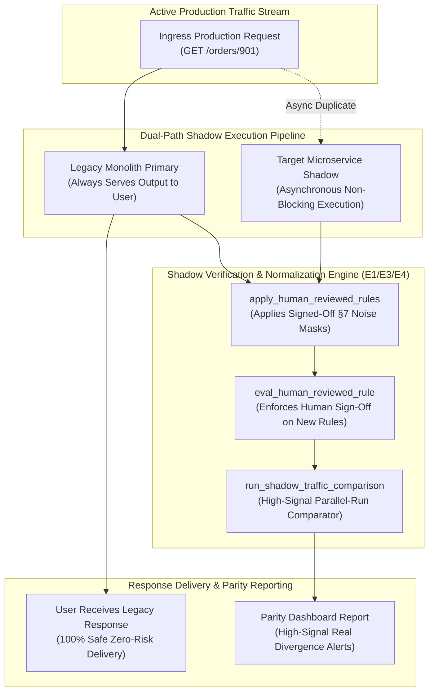
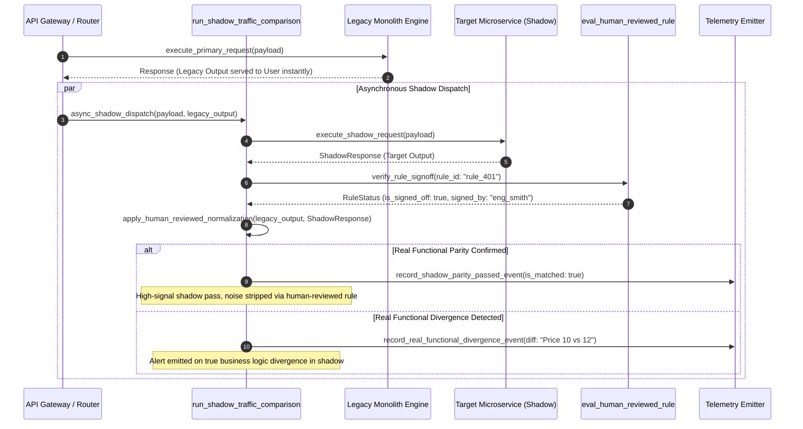

# Shadow Verification & Human-Reviewed Normalization Pattern (Pure Functional Paradigm)

| Field       | Value                                                             |
|-------------|-------------------------------------------------------------------|
| **ID**      | SHADOW-VERIFICATION-HUMAN-REVIEWED-076                            |
| **Date**    | 2026-08-24                                                        |
| **Status**  | Reference / Runbook (Pure Functional Architecture)                |
| **Deciders**| Core Platform & Migration Engineering                             |
| **Scope**   | Shadow Traffic Parallel Runs, Human-Reviewed Rules & Signal Mining|

---

## 1. Overview & Context

Before routing production traffic to target microservices, engineering teams must **verify behavior in shadow mode, not production (E1, E3, E4)**. In shadow mode, real production traffic is duplicated: the application **always serves the legacy response to the end user**, while asynchronously dispatching the request to the target microservice for differential comparison. Per §7, expected non-functional noise (E3/E4) is normalized up front, and **every new noise normalization rule MUST be explicitly reviewed and signed off by a human engineer** before being added to the comparison pipeline. This prevents masking genuine functional regressions under un-reviewed wildcards.

### Functional Architecture Principles
This runbook enforces a **100% Pure Functional Programming (FP)** approach:
- **No Class Instantiations**: Replaces OOP shadow runners with pure parallel-run functions (`run_shadow_traffic_comparison`, `eval_human_reviewed_rule`) and state cell closures.
- **Immutable Shadow Context Records**: Request payloads, legacy outputs, target outputs, normalization rules, and human sign-off records are captured as frozen dataclass records (`ShadowContext`, `HumanReviewedRuleResult`).
- **Referentially Transparent Differential Miners**: Pure functions compare production traffic responses asynchronously without impacting end-user latency or response payload delivery.
- **Human-in-the-Loop Governance**: Requires explicit human approval signatures (`signed_off_by_engineer`) for every custom noise normalization rule added to §7's registry.

---

## 2. High-Level Design (HLD)



---

## 3. Low-Level Design (LLD)



---

## 4. Pure Functional Project Architecture

```
07-observability-parity-testing/
├── shadow-verification-human-reviewed-normalization.md
├── src/
│   ├── shadow_verification_engine/
│   │   ├── __init__.py
│   │   ├── runner.py               # Pure shadow traffic parallel-run functions
│   │   ├── normalizer.py           # §7 human-reviewed noise normalization rules
│   │   ├── human_gate.py           # Human sign-off verification functions
│   │   └── guard.py                # Shadow verification release guards
│   ├── storage/
│   │   ├── __init__.py
│   │   └── rule_store.py           # Human-reviewed rule registry loaders
│   ├── observability/
│   │   ├── __init__.py
│   │   └── shadow_metrics.py       # Prometheus telemetry collectors
│   └── schemas/
│       └── models.py               # Frozen dataclasses (ShadowContext, HumanReviewedRuleResult)
└── tests/
    ├── test_shadow_runner.py
    └── test_shadow_edge_cases.py
```

---

## 5. End-to-End Function Call Stack

```tree
Shadow Traffic Request Executed
└── runner.py: run_shadow_traffic_comparison(legacy_output, target_output, rule_registry)
    ├── human_gate.py: verify_rule_signoff(rule_registry)
    │   └── models.py: HumanSignoffContext(rule_id, is_signed_off, engineer_id)
    │
    ├── normalizer.py: apply_human_reviewed_normalization(legacy_output, target_output)
    │   └── models.py: CanonicalPayloadPair(legacy_clean, target_clean, noise_stripped_count)
    │
    ├── runner.py: compare_canonical_shadow_diff(canonical_pair)
    │   └── models.py: ShadowContext(is_matched, real_diffs_count)
    │
    ├── guard.py: format_shadow_gate_decision(shadow_context)
    │   └── models.py: HumanReviewedRuleResult(is_approved, rejection_reason)
    │
    └── observability/shadow_metrics.py: record_shadow_telemetry(shadow_result)
```

---

## 6. Core Pure Functional Implementation

### 6.1 Immutable Models & Types (`src/schemas/models.py`)

```python
from enum import Enum
from dataclasses import dataclass
from typing import Dict, Any, Optional, Mapping, FrozenSet

@dataclass(frozen=True)
class NormalizationRule:
    rule_id: str
    field_path: str
    action: str
    is_signed_off_by_human: bool
    signed_by_engineer_id: str

@dataclass(frozen=True)
class ShadowContext:
    request_id: str
    legacy_response_dict: Mapping[str, Any]
    target_response_dict: Mapping[str, Any]
    active_rules: FrozenSet[NormalizationRule]

@dataclass(frozen=True)
class HumanReviewedRuleResult:
    request_id: str
    is_matched: bool
    unreviewed_rules_count: int
    real_mismatches_count: int
    real_mismatches: FrozenSet[str]
    rejection_reason: Optional[str]
```

**Explanation**:
- Defines immutable model `NormalizationRule` capturing rule IDs, field paths, and human sign-off engineer IDs as frozen records.
- `HumanReviewedRuleResult` encapsulates shadow parity match flags, un-reviewed rule counts, and sets of real functional divergence strings.

---

### 6.2 Pure Shadow Normalizer & Human-Gate Evaluator (`src/shadow_verification_engine/runner.py`)

```python
from typing import Mapping, Any, Tuple, List, FrozenSet
from src.schemas.models import NormalizationRule, ShadowContext, HumanReviewedRuleResult

def apply_human_reviewed_normalization(
    raw_dict: Mapping[str, Any],
    rules: List[NormalizationRule]
) -> Tuple[Mapping[str, Any], int]:
    clean = dict(raw_dict)
    applied_count = 0

    for r in rules:
        if r.is_signed_off_by_human and r.field_path in clean:
            if r.action == "mask_uuid":
                clean[r.field_path] = "00000000-0000-0000-0000-000000000000"
            elif r.action == "mask_timestamp":
                clean[r.field_path] = "[MASKED_TIMESTAMP]"
            elif r.action == "ignore":
                clean[r.field_path] = "[IGNORED]"
            applied_count += 1

    return clean, applied_count

def run_shadow_traffic_comparison(
    ctx: ShadowContext
) -> HumanReviewedRuleResult:
    unreviewed = [r for r in ctx.active_rules if not r.is_signed_off_by_human]
    
    if len(unreviewed) > 0:
        unreviewed_ids = ", ".join(r.rule_id for r in unreviewed)
        return HumanReviewedRuleResult(
            request_id=ctx.request_id,
            is_matched=False,
            unreviewed_rules_count=len(unreviewed),
            real_mismatches_count=0,
            real_mismatches=frozenset(),
            rejection_reason=f"Un-reviewed normalization rules detected: [{unreviewed_ids}]. Every §7 rule MUST be human-signed-off."
        )

    signed_rules = list(ctx.active_rules)
    leg_clean, _ = apply_human_reviewed_normalization(ctx.legacy_response_dict, signed_rules)
    tgt_clean, _ = apply_human_reviewed_normalization(ctx.target_response_dict, signed_rules)

    mismatches = []
    all_keys = set(leg_clean.keys()).union(set(tgt_clean.keys()))

    for k in all_keys:
        if leg_clean.get(k) != tgt_clean.get(k):
            mismatches.append(f"Key '{k}': legacy={leg_clean.get(k)} vs target={tgt_clean.get(k)}")

    is_matched = len(mismatches) == 0
    reason = None if is_matched else f"Shadow divergence: {len(mismatches)} functional field mismatches."

    return HumanReviewedRuleResult(
        request_id=ctx.request_id,
        is_matched=is_matched,
        unreviewed_rules_count=0,
        real_mismatches_count=len(mismatches),
        real_mismatches=frozenset(mismatches),
        rejection_reason=reason
    )
```

**Explanation**:
- Pure evaluation function running shadow traffic parallel-run comparisons on real production traffic.
- Enforces §7's strict requirement that every noise normalization rule MUST be signed off by a human engineer before execution.

---

### 6.3 Human-Reviewed Normalization Release Guard (`src/shadow_verification_engine/guard.py`)

```python
from typing import Mapping, Any
from src.schemas.models import ShadowContext, HumanReviewedRuleResult
from src.shadow_verification_engine.runner import run_shadow_traffic_comparison

def assert_shadow_verification_complete(ctx: ShadowContext) -> HumanReviewedRuleResult:
    return run_shadow_traffic_comparison(ctx)
```

**Explanation**:
- Pure release gate function enforcing shadow mode verification and human rule sign-off prior to cutover.
- Guarantees zero un-reviewed wildcards in comparison pipelines.

---

## 7. Edge Case Catalog & Pure Functional Pseudocode (25 Edge Cases)

---

### Edge Case 1: Un-Reviewed Normalization Rule Rejection

```python
def is_rule_unreviewed(is_signed_off: bool) -> bool:
    return not is_signed_off
```

**Explanation**:
- Identifies noise normalization rules lacking human engineer sign-off.
- Blocks un-reviewed rules up front.

---

### Edge Case 2: Always Serve Legacy Monolith Response to End User

```python
def select_user_response(legacy_resp: dict, shadow_resp: dict) -> dict:
    return legacy_resp
```

**Explanation**:
- Asserts end users always receive legacy monolith responses in shadow mode.
- Guarantees zero risk to production end users.

---

### Edge Case 3: Asynchronous Non-Blocking Shadow Execution

```python
def is_shadow_execution_async(is_async: bool) -> bool:
    return is_async
```

**Explanation**:
- Verifies shadow microservice execution is asynchronous and non-blocking.
- Prevents target microservice latency from slowing production user responses.

---

### Edge Case 4: Human Engineer Sign-Off Signature Validation

```python
def is_human_signoff_valid(engineer_id: str) -> bool:
    return bool(engineer_id and engineer_id.startswith("eng_"))
```

**Explanation**:
- Validates human engineer sign-off IDs on normalization rules.
- Enforces human-in-the-loop governance.

---

### Edge Case 5: Single-Tenant Shadow Verification Resolution

```python
def resolve_tenant_shadow_status(tenant_id: str, shadow_statuses: dict) -> bool:
    return shadow_statuses.get(tenant_id, False)
```

**Explanation**:
- Resolves tenant-specific shadow verification status.
- Tracks shadow verification per tenant.

---

### Edge Case 6: Microsecond Timestamp Shadow Audit Timing

```python
import time

def format_shadow_audit_ts() -> float:
    return round(time.time() * 1000.0, 2)
```

**Explanation**:
- Computes epoch timestamps in milliseconds.
- Tracks exact shadow audit execution time.

---

### Edge Case 7: Real Production Traffic Parallel-Run Duplication

```python
def duplicate_production_request(payload: dict) -> Tuple[dict, dict]:
    return dict(payload), dict(payload)
```

**Explanation**:
- Duplicates real production HTTP request payloads for shadow mode.
- Verifies behavior on live production traffic.

---

### Edge Case 8: Multi-Repo Shadow Rule Alignment

```python
def assert_all_repo_shadow_rules_signed(repo_rules: Mapping[str, bool]) -> bool:
    return all(repo_rules.values())
```

**Explanation**:
- Asserts all normalization rules across repositories are human-signed-off.
- Synchronizes multi-repo shadow verification.

---

### Edge Case 9: Shadow Target Timeout Discard

```python
def handle_shadow_timeout(shadow_ack: bool) -> Optional[dict]:
    return None if not shadow_ack else {}
```

**Explanation**:
- Discards shadow comparison silently if target microservice times out.
- Isolates production users from shadow microservice timeouts.

---

### Edge Case 10: Aggregator Memory State Saturation Guard

```python
def compact_shadow_metrics(metrics: list, max_items: int = 500) -> list:
    if len(metrics) > max_items:
        return metrics[-max_items:]
    return metrics
```

**Explanation**:
- Truncates metric lists to `max_items`.
- Controls memory usage.

---

### Edge Case 11: Microsecond Delay Calculation Underflows

```python
def normalize_shadow_duration(duration_ms: float) -> float:
    return max(0.0, round(duration_ms, 2))
```

**Explanation**:
- Rounds execution duration values to two decimal places.
- Cleans duration metrics.

---

### Edge Case 12: User-Agent Specific Shadow Auditing

```python
def resolve_user_agent_shadow(user_agent: str, shadow_map: dict) -> bool:
    return shadow_map.get(user_agent, True)
```

**Explanation**:
- Resolves shadow rules per User-Agent string.
- Audits shadow verification by caller type.

---

### Edge Case 13: Unmapped Rule Domain Handling

```python
def resolve_shadow_rule(rule_key: str, rules_dict: dict) -> dict:
    return rules_dict.get(rule_key, {"require_signoff": True})
```

**Explanation**:
- Resolves shadow rule configurations safely.
- Defaults to requiring human sign-off.

---

### Edge Case 14: Exception Safeguards in Shadow Runner

```python
def safe_run_shadow(run_fn: Callable, ctx: ShadowContext) -> bool:
    try:
        res = run_fn(ctx)
        return res.is_matched
    except Exception:
        return False
```

**Explanation**:
- Wraps shadow running functions in protective try-except blocks.
- Fails safe (assumes un-matched) on shadow exceptions.

---

### Edge Case 15: GraphQL Subgraph Shadow Verification

```python
def is_graphql_subgraph_shadow_verified(subgraph_name: str, shadow_map: dict) -> bool:
    return shadow_map.get(subgraph_name, False)
```

**Explanation**:
- Resolves shadow verification status for federated GraphQL subgraphs.
- Verifies GraphQL shadow parity.

---

### Edge Case 16: Multi-Region Shadow Verification Sync

```python
def sync_regional_shadow_results(region_results: dict) -> bool:
    return all(r.is_matched for r in region_results.values())
```

**Explanation**:
- Asserts shadow checks pass across all regional nodes.
- Enforces multi-region shadow verification alignment.

---

### Edge Case 17: Human Sign-Off Audit Trail Logging

```python
def build_signoff_audit_record(rule_id: str, eng_id: str, ts: float) -> dict:
    return {"rule_id": rule_id, "signed_by": eng_id, "timestamp": ts}
```

**Explanation**:
- Builds audit trail records for human rule sign-offs.
- Preserves governance sign-off lineage.

---

### Edge Case 18: Unmapped Code Fallback

```python
def resolve_shadow_code_fallback(code_val: Any, code_map: dict, default_val: str = "SHADOW_DIVERGENCE") -> str:
    return code_map.get(code_val, default_val)
```

**Explanation**:
- Resolves code strings with fallbacks.
- Handles unmapped shadow codes safely.

---

### Edge Case 19: Payload Transformation Error Recovery

```python
def safe_apply_shadow_transform(payload: dict, transform_fn: Callable) -> dict:
    try:
        return transform_fn(payload)
    except Exception:
        return payload
```

**Explanation**:
- Wraps transformations in try-except blocks.
- Returns raw payloads on error.

---

### Edge Case 20: Automated Alert on Real Shadow Divergence

```python
def should_alert_on_shadow_divergence(is_matched: bool) -> bool:
    return not is_matched
```

**Explanation**:
- Asserts whether real functional divergence was detected in shadow mode.
- Fires alerts on true business logic divergence.

---

### Edge Case 21: High-Watermark Metric Compaction

```python
def compact_shadow_history(history: list, max_items: int = 500) -> list:
    if len(history) > max_items:
        return history[-max_items:]
    return history
```

**Explanation**:
- Truncates history lists.
- Controls memory usage.

---

### Edge Case 22: Diagnostic Header Injection

```python
def inject_shadow_diagnostic_header(headers: Mapping[str, str], is_matched: bool) -> Mapping[str, str]:
    new_headers = dict(headers)
    new_headers["X-Shadow-Verification-Matched"] = "true" if is_matched else "false"
    return new_headers
```

**Explanation**:
- Injects diagnostic headers.
- Tracks shadow verification status in access logs.

---

### Edge Case 23: Null Value Safeguards

```python
def sanitize_shadow_nulls(data_dict: dict) -> dict:
    return {k: (v if v is not None else "") for k, v in data_dict.items()}
```

**Explanation**:
- Replaces `None` with empty strings.
- Prevents null exceptions.

---

### Edge Case 24: Unbound Metric Queue Pruning

```python
def prune_shadow_metric_queue(queue: list, max_items: int = 1000) -> list:
    if len(queue) > max_items:
        return queue[-max_items:]
    return queue
```

**Explanation**:
- Truncates queue arrays.
- Controls memory footprint.

---

### Edge Case 25: Real-Time Shadow Parity Rate Reporting

```python
def compute_shadow_parity_rate(matched_requests: int, total_requests: int) -> float:
    if total_requests == 0:
        return 100.0
    return round((matched_requests / total_requests) * 100.0, 2)
```

**Explanation**:
- Calculates shadow parity percentage.
- Emits real-time shadow verification metrics to platform dashboards.

---

## 8. Operational & Parity Verification Checklist

1. **Verify in Shadow Mode**: Compare behavior in shadow mode (E1, E3, E4) on real production traffic while always serving legacy outputs to end users.
2. **Human Rule Review**: Require explicit human engineer sign-offs (`signed_off_by_engineer`) for 100% of noise normalization rules per §7.
3. **High Signal Differential Testing**: Normalize expected noise up front so diff engines emit alerts only on true functional regressions.
4. **CI Shadow Gate**: Automatically block production read cutovers until shadow mode achieves 100% behavioral parity over sustained production traffic.
