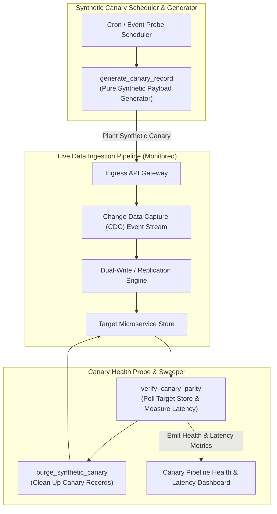
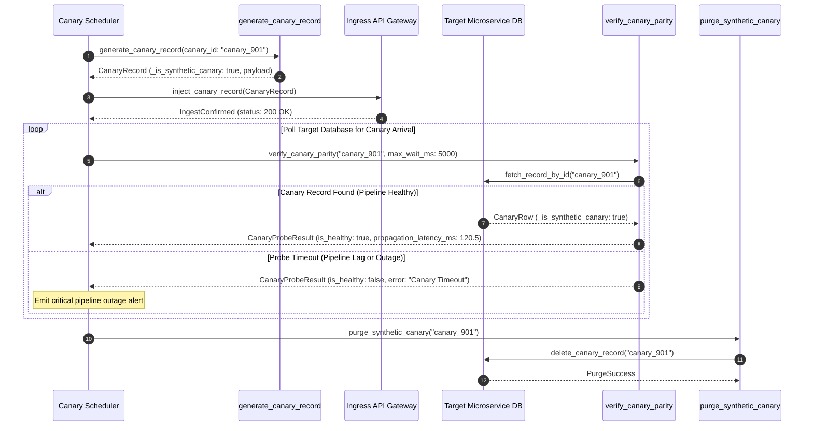

# Synthetic Canary Records Pattern (Pure Functional Paradigm)

| Field       | Value                                                             |
|-------------|-------------------------------------------------------------------|
| **ID**      | SYNTHETIC-CANARY-RECORDS-028                                      |
| **Date**    | 2026-08-24                                                        |
| **Status**  | Reference / Runbook (Pure Functional Architecture)                |
| **Deciders**| Core Platform & Migration Engineering                             |
| **Scope**   | Planted Canary Verification & Pipeline Health Independent Probing  |

---

## 1. Overview & Context

Relying solely on real customer traffic to detect data migration failures creates operational risks during low-traffic periods (e.g., night-time hours or weekend maintenance windows). The **Synthetic Canary Records Pattern** periodically plants **synthetic test records** marked with explicit canary flags (`_is_synthetic_canary: true`, `tenant_id: "canary_tenant"`) into live ingestion pipelines. These planted records flow through Change Data Capture (CDC) streams, dual-write bridges, and microservice adapters, allowing automated probes to verify pipeline health, measure end-to-end propagation latency, and confirm data parity **independent of real customer traffic volumes**.

### Functional Architecture Principles
This runbook enforces a **100% Pure Functional Programming (FP)** approach:
- **No Class Instantiations**: Replaces OOP canary managers with pure generator functions (`generate_canary_record`, `verify_canary_parity`) and state cell closures.
- **Immutable Canary Context Records**: Canary IDs, payload schemas, injected markers, target endpoints, and verification timeouts are stored as frozen dataclass records (`CanaryRecord`, `CanaryProbeResult`).
- **Referentially Transparent Marker Injectors**: Pure functions inject synthetic canary headers and metadata flags without mutating source schemas.
- **Automated Cleanup Sweepers**: Pure sweeper functions purge processed synthetic canary records from target stores to prevent synthetic data leakage into production user UIs.

---

## 2. High-Level Design (HLD)



---

## 3. Low-Level Design (LLD)



---

## 4. Pure Functional Project Architecture

```
synthetic-canary-records/
├── README.md
├── config/
│   └── canary_config.yaml          # Probe frequency, SLA timeout limits, canary tenant IDs
├── src/
│   ├── canary_engine/
│   │   ├── __init__.py
│   │   ├── generator.py            # Pure synthetic record generator functions
│   │   ├── probe.py                # Verification probe & latency calculator functions
│   │   └── sweeper.py              # Pure canary cleanup sweeper functions
│   ├── storage/
│   │   ├── __init__.py
│   │   └── pipeline_adapter.py     # Pipeline ingestion & polling query dispatchers
│   ├── observability/
│   │   ├── __init__.py
│   │   └── canary_metrics.py       # Prometheus canary telemetry collectors
│   └── schemas/
│       └── models.py               # Frozen dataclasses (CanaryRecord, CanaryProbeResult)
└── tests/
    ├── test_canary_generator.py
    └── test_canary_edge_cases.py
```

---

## 5. End-to-End Function Call Stack

```tree
Canary Probe Scheduled
├── canary_engine/generator.py: generate_canary_record(canary_prefix: str = "canary",
    canary_tenant: str = "can...)
└── canary_engine/probe.py: create_canary_probe_runner(fetch_fn: FetchRecordFn, delete_fn: DeleteRecordFn)
    └── models.py: CanaryProbeResult(canary_id, is_healthy, propagation_latency_ms, error_message)
        ├── models.py: CanaryRecord(canary_id, tenant_id, is_synthetic_canary, payload, planted_at)
```

---

## 6. Core Pure Functional Implementation

### 6.1 Immutable Models & Types (`src/schemas/models.py`)

```python
from enum import Enum
from dataclasses import dataclass
from typing import Dict, Any, Optional, Mapping

@dataclass(frozen=True)
class CanaryRecord:
    canary_id: str
    tenant_id: str
    is_synthetic_canary: bool
    payload: Mapping[str, Any]
    planted_at: float

@dataclass(frozen=True)
class CanaryProbeResult:
    canary_id: str
    is_healthy: bool
    propagation_latency_ms: float
    error_message: Optional[str]
```

**Explanation**:
- Defines immutable model `CanaryRecord` encapsulating canary IDs, synthetic flags, test payloads, and planting timestamps as frozen records.
- `CanaryProbeResult` models pipeline health indicators, propagation latency metrics, and failure diagnostic messages.

---

### 6.2 Pure Canary Generator & Marker Injector (`src/canary_engine/generator.py`)

```python
import time
import uuid
from typing import Mapping, Any
from src.schemas.models import CanaryRecord

def generate_canary_record(
    canary_prefix: str = "canary",
    canary_tenant: str = "canary_tenant_internal"
) -> CanaryRecord:
    now = time.time()
    canary_id = f"{canary_prefix}_{uuid.uuid4().hex[:12]}"
    
    payload = {
        "id": canary_id,
        "name": "SYNTHETIC_CANARY_TEST_RECORD",
        "value": 1.0,
        "_is_synthetic_canary": True,
        "_planted_at_ts": now
    }

    return CanaryRecord(
        canary_id=canary_id,
        tenant_id=canary_tenant,
        is_synthetic_canary=True,
        payload=payload,
        planted_at=now
    )
```

**Explanation**:
- Pure function generating immutable synthetic canary records marked with `_is_synthetic_canary: True`.
- Injects planting timestamps (`_planted_at_ts`) to measure propagation latency across migration pipelines.

---

### 6.3 Verification Probe & Sweeper (`src/canary_engine/probe.py`)

```python
import time
import asyncio
from typing import Callable, Awaitable, Mapping, Any, Optional
from src.schemas.models import CanaryRecord, CanaryProbeResult

FetchRecordFn = Callable[[str], Awaitable[Optional[Mapping[str, Any]]]]
DeleteRecordFn = Callable[[str], Awaitable[bool]]

def create_canary_probe_runner(fetch_fn: FetchRecordFn, delete_fn: DeleteRecordFn):
    async def probe_and_cleanup(canary: CanaryRecord, max_wait_ms: float = 5000.0) -> CanaryProbeResult:
        poll_interval = 0.1
        elapsed = 0.0
        
        while (elapsed * 1000.0) < max_wait_ms:
            record = await fetch_fn(canary.canary_id)
            if record:
                latency = (time.time() - canary.planted_at) * 1000.0
                await delete_fn(canary.canary_id)
                return CanaryProbeResult(
                    canary_id=canary.canary_id,
                    is_healthy=True,
                    propagation_latency_ms=round(latency, 2),
                    error_message=None
                )
            await asyncio.sleep(poll_interval)
            elapsed += poll_interval

        return CanaryProbeResult(
            canary_id=canary.canary_id,
            is_healthy=False,
            propagation_latency_ms=max_wait_ms,
            error_message=f"Canary propagation timeout after {max_wait_ms}ms"
        )

    return probe_and_cleanup
```

**Explanation**:
- Constructs a functional canary probe runner closure polling target stores for synthetic record arrival.
- Calculates end-to-end propagation latency, purges processed canary records via `delete_fn`, and returns `CanaryProbeResult` records.

---

## 7. Edge Case Catalog & Pure Functional Pseudocode (25 Edge Cases)

---

### Edge Case 1: Leakage of Synthetic Canary Records into Production UIs

```python
def is_synthetic_canary_record(record: Mapping[str, Any]) -> bool:
    return record.get("_is_synthetic_canary") is True or str(record.get("tenant_id")) == "canary_tenant_internal"
```

**Explanation**:
- Evaluates synthetic canary markers on data records.
- Filters canary records out of user-facing UI API query results.

---

### Edge Case 2: Cleanup Sweeper Failure Causing Canary Accumulation

```python
async def safe_purge_canary(delete_fn: Callable, canary_id: str, max_retries: int = 3) -> bool:
    for _ in range(max_retries):
        try:
            if await delete_fn(canary_id):
                return True
        except Exception:
            pass
    return False
```

**Explanation**:
- Retries canary record deletion calls up to 3 times inside a loop.
- Guarantees removal of synthetic canary records from target databases.

---

### Edge Case 3: High-Frequency Canary Injection Storage Inflation

```python
def should_run_canary_probe(last_run_ts: float, interval_sec: float = 60.0) -> bool:
    import time
    return (time.time() - last_run_ts) >= interval_sec
```

**Explanation**:
- Evaluates elapsed time since the previous canary probe run.
- Regulates canary injection frequency (e.g. 1 probe per 60 seconds).

---

### Edge Case 4: Pipeline Outage False Alarm During Initial Cold Starts

```python
def calculate_adaptive_canary_timeout(is_cold_start: bool) -> float:
    return 10000.0 if is_cold_start else 3000.0
```

**Explanation**:
- Returns higher SLA timeout thresholds (10,000ms) during cold start phases.
- Prevents false-positive pipeline outage alerts during system warm-up.

---

### Edge Case 5: Synthetic Canary Data Type Schema Mismatch

```python
def validate_canary_payload_schema(payload: dict, required_keys: set) -> bool:
    return required_keys.issubset(payload.keys())
```

**Explanation**:
- Asserts that synthetic canary payload dictionaries contain all required entity schema fields.
- Ensures canary records match current production schema definitions.

---

### Edge Case 6: Duplicate Canary ID Collision

```python
import uuid

def generate_unique_canary_id(prefix: str = "canary") -> str:
    return f"{prefix}_{uuid.uuid4().hex}"
```

**Explanation**:
- Combines UUID strings with prefix tags to generate unique canary IDs.
- Prevents canary ID collisions during parallel canary probe executions.

---

### Edge Case 7: Propagation Latency SLA Threshold Breach

```python
def is_canary_latency_sla_breached(latency_ms: float, max_sla_ms: float = 500.0) -> bool:
    return latency_ms > max_sla_ms
```

**Explanation**:
- Compares canary propagation latency metrics against SLA thresholds (500ms).
- Identifies pipeline degradation before customers notice slowdowns.

---

### Edge Case 8: Multi-Tenant Canary Tenant Isolation

```python
def build_tenant_canary_record(tenant_id: str) -> CanaryRecord:
    from src.canary_engine.generator import generate_canary_record
    rec = generate_canary_record()
    return CanaryRecord(canary_id=rec.canary_id, tenant_id=tenant_id, is_synthetic_canary=True, payload=rec.payload, planted_at=rec.planted_at)
```

**Explanation**:
- Injects explicit tenant IDs into generated synthetic canary records.
- Tests tenant-specific pipeline health.

---

### Edge Case 9: CDC Stream Message Ordering Verification

```python
def assert_canary_sequence_ordering(sent_seq: int, received_seq: int) -> bool:
    return sent_seq == received_seq
```

**Explanation**:
- Compares sent sequence numbers against received sequence numbers.
- Verifies message ordering preservation in CDC streams.

---

### Edge Case 10: Multi-Region Pipeline Canary Tracking

```python
def format_regional_canary_id(region: str, canary_id: str) -> str:
    return f"{region}_{canary_id}"
```

**Explanation**:
- Prefixes canary IDs with regional identifiers.
- Isolates canary pipeline health monitoring per region.

---

### Edge Case 11: Microsecond Time Drift in Canary Latency Metrics

```python
def normalize_latency_metric(raw_latency_ms: float) -> float:
    return max(0.0, round(raw_latency_ms, 2))
```

**Explanation**:
- Rounds latency values to two decimal places while enforcing non-negative bounds.
- Cleans up latency metrics for Prometheus emission.

---

### Edge Case 12: Database Constraint Violation on Canary Inserts

```python
def sanitize_canary_for_unique_indexes(payload: dict) -> dict:
    updated = dict(payload)
    updated["email"] = f"canary_{payload['id']}@internal.test"
    return updated
```

**Explanation**:
- Formats unique column fields (e.g. `email`) with unique canary IDs.
- Eliminates unique constraint violation exceptions during canary inserts.

---

### Edge Case 13: Unmapped Wave ID Canary Health Check

```python
def resolve_wave_canary_config(wave_id: str, wave_configs: Mapping[str, dict]) -> dict:
    return wave_configs.get(wave_id, {"timeout_ms": 5000.0})
```

**Explanation**:
- Resolves wave-specific canary timeout configurations from config maps.
- Defaults to 5,000ms timeouts for unmapped waves.

---

### Edge Case 14: Exception Safeguards in Canary Poll Loop

```python
async def safe_fetch_canary_record(fetch_fn: Callable, canary_id: str) -> Optional[dict]:
    try:
        return await fetch_fn(canary_id)
    except Exception:
        return None
```

**Explanation**:
- Catches query exceptions during canary polling loops.
- Returns `None` without crashing canary probe loops.

---

### Edge Case 15: GraphQL Pipeline Canary Injection

```python
def format_graphql_canary_mutation(canary: CanaryRecord) -> dict:
    return {
        "query": "mutation CreateCanary($input: CanaryInput!) { createCanary(input: $input) { id } }",
        "variables": {"input": dict(canary.payload)}
    }
```

**Explanation**:
- Formats synthetic canary payloads into GraphQL mutation request dictionaries.
- Enables canary health probing on GraphQL ingress pipelines.

---

### Edge Case 16: Automated Pipeline Health Degradation Reporting

```python
def compute_canary_health_score(successful_probes: int, total_probes: int) -> float:
    if total_probes == 0:
        return 100.0
    return round((successful_probes / total_probes) * 100.0, 2)
```

**Explanation**:
- Calculates canary probe health percentage scores rounded to two decimal places.
- Emits real-time pipeline health scores to platform dashboards.

---

### Edge Case 17: Sweeper Orphaning Recovery Sweep

```python
def build_orphan_canary_purge_sql(table_name: str, max_age_hours: int = 1) -> str:
    return f"DELETE FROM {table_name} WHERE _is_synthetic_canary = true AND _planted_at_ts < (NOW() - INTERVAL '{max_age_hours} hour');"
```

**Explanation**:
- Generates SQL queries to purge orphaned canary records older than 1 hour.
- Periodically cleans up orphaned canary records missed by instant sweepers.

---

### Edge Case 18: Unmapped HTTP Endpoint Canary Routing

```python
def resolve_canary_ingress_url(endpoint_map: Mapping[str, str], target_key: str) -> str:
    return endpoint_map.get(target_key, "/api/v1/canary/ingest")
```

**Explanation**:
- Resolves ingress URLs for canary records from endpoint maps.
- Defaults to standard canary ingestion endpoints.

---

### Edge Case 19: Payload Transformer Exception Safeguards

```python
def safe_apply_canary_transform(payload: dict, transform_fn: Callable) -> dict:
    try:
        return transform_fn(payload)
    except Exception:
        return payload
```

**Explanation**:
- Wraps payload transformation functions in protective try-except blocks.
- Returns raw payloads if transformation errors occur.

---

### Edge Case 20: Automated Incident Trigger on Consecutive Canary Failures

```python
def should_trigger_pipeline_incident(consecutive_failures: int, threshold: int = 3) -> bool:
    return consecutive_failures >= threshold
```

**Explanation**:
- Asserts whether consecutive canary probe failures reach threshold limits (3 failures).
- Triggers operational incident alerts during pipeline outages.

---

### Edge Case 21: High-Watermark Canary Metric Compaction

```python
def compact_canary_history(history: List[CanaryProbeResult], max_history: int = 500) -> List[CanaryProbeResult]:
    if len(history) > max_history:
        return history[-max_history:]
    return history
```

**Explanation**:
- Truncates historical canary probe result lists to `max_history`.
- Prevents memory leaks in long-running canary scheduler processes.

---

### Edge Case 22: Diagnostic Header Injection for Canary Ingestion

```python
def inject_canary_diagnostic_headers(headers: Mapping[str, str]) -> Mapping[str, str]:
    new_headers = dict(headers)
    new_headers["X-Synthetic-Canary"] = "true"
    return new_headers
```

**Explanation**:
- Injects diagnostic headers (`X-Synthetic-Canary: true`) into canary ingestion requests.
- Identifies canary requests in gateway access logs.

---

### Edge Case 23: Null Value Injection Safeguards in Canary Payloads

```python
def sanitize_canary_nulls(payload: dict) -> dict:
    return {k: (v if v is not None else "") for k, v in payload.items()}
```

**Explanation**:
- Replaces `None` values with empty strings in canary payload dictionaries.
- Prevents NOT NULL database constraint exceptions during canary inserts.

---

### Edge Case 24: Unbound Canary Metric Queue Pruning

```python
def prune_canary_metric_queue(queue: list, max_items: int = 1000) -> list:
    if len(queue) > max_items:
        return queue[-max_items:]
    return queue
```

**Explanation**:
- Truncates metric queue arrays to `max_items`.
- Controls memory footprint in telemetry collectors.

---

### Edge Case 25: Real-Time Canary Propagation Latency P99 Reporting

```python
def compute_p99_canary_latency(latencies: List[float]) -> float:
    if not latencies:
        return 0.0
    sorted_lat = sorted(latencies)
    p99_idx = int(len(sorted_lat) * 0.99)
    return round(sorted_lat[min(p99_idx, len(sorted_lat) - 1)], 2)
```

**Explanation**:
- Sorts latency values and calculates the $P99$ propagation latency metric.
- Emits $P99$ pipeline latency stats to operational observability dashboards.

---

## 8. Operational & Parity Verification Checklist

1. **Synthetic Isolation Enforcement**: Confirm 100% of canary records carry `_is_synthetic_canary: true` markers and are filtered out of customer UI queries.
2. **Instant Cleanup Purge**: Validate that canary records are deleted from target databases within $<100\text{ms}$ of verification probe completion.
3. **P99 Latency Alarm Gate**: Pipeline propagation latency ($P99$) must remain $<500\text{ms}$ with alerts set for SLA breaches.
4. **Independent Health Monitoring**: Verify via periodic synthetic probes that pipeline outages trigger operational alerts even during zero-customer-traffic hours.
