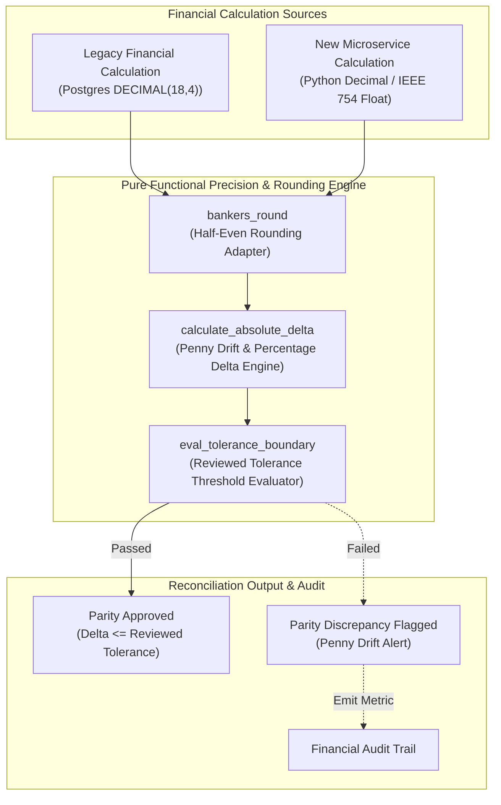
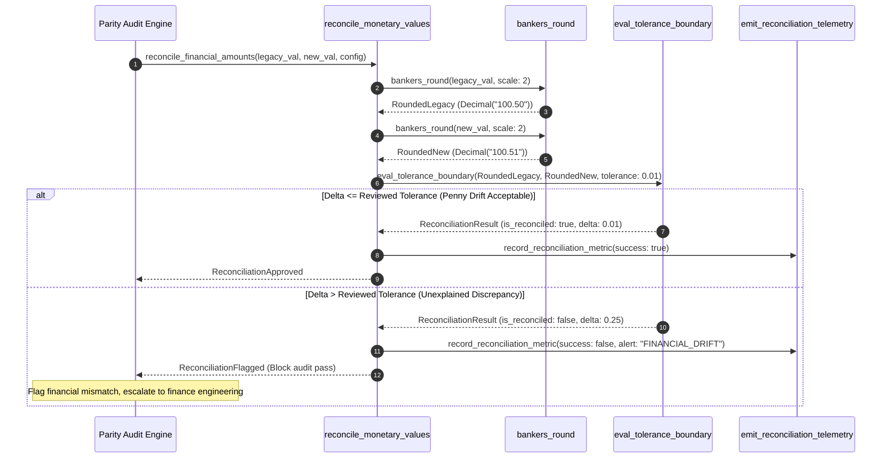

# Precision & Rounding Reconciliation Pattern (Pure Functional Paradigm)

| Field       | Value                                                             |
|-------------|-------------------------------------------------------------------|
| **ID**      | PRECISION-ROUNDING-RECONCILIATION-030                             |
| **Date**    | 2026-08-24                                                        |
| **Status**  | Reference / Runbook (Pure Functional Architecture)                |
| **Deciders**| Core Platform & Migration Engineering                             |
| **Scope**   | Explicit Mathematical Rounding & Financial Tolerance Reconciliation|

---

## 1. Overview & Context

Different storage engines, programming languages, and database data types (e.g., PostgreSQL `DECIMAL(18,4)` vs Python `float` vs Java `BigDecimal` vs DynamoDB `Number`) use subtle differences in rounding algorithms (e.g., Banker's Rounding / Half-Even vs Half-Up) and precision representation limits. Comparing monetary calculations across migrated systems without explicit precision rules produces false-positive parity alerts or insidious penny-drift errors. The **Precision & Rounding Reconciliation Pattern** defines **explicit, reviewed mathematical tolerances** (e.g., $\le \$0.01$ or $\le 0.0001\%$) and standardized rounding functions to reconcile numerical discrepancies safely.

### Functional Architecture Principles
This runbook enforces a **100% Pure Functional Programming (FP)** approach:
- **No Class Instantiations**: Replaces OOP currency classes with pure financial functions (`reconcile_monetary_values`, `bankers_round`) and immutable `Decimal` wrappers.
- **Immutable Financial Context Records**: Amounts, currency codes, precision rules, tolerance thresholds, and discrepancy flags are captured as frozen dataclass records (`FinancialAmount`, `PrecisionReconciliationResult`).
- **Referentially Transparent Banker's Rounding**: Pure mathematical functions implement exact IEEE 754 half-even rounding without floating-point representation drift.
- **Reviewed Tolerance Threshold Matrix**: Evaluates discrepancies against explicitly approved tolerance limits per currency and transaction category.

---

## 2. High-Level Design (HLD)



---

## 3. Low-Level Design (LLD)



---

## 4. Pure Functional Project Architecture

```
precision-rounding-reconciliation/
├── README.md
├── config/
│   └── precision_tolerances.yaml   # Reviewed currency tolerance thresholds & scales
├── src/
│   ├── reconciliation_engine/
│   │   ├── __init__.py
│   │   ├── rounder.py              # Pure banker's & half-up rounding functions
│   │   ├── tolerance.py            # Reviewed tolerance boundary evaluators
│   │   └── calculator.py           # Absolute & percentage delta calculators
│   ├── storage/
│   │   ├── __init__.py
│   │   └── tolerance_store.py      # Precision rule configuration loaders
│   ├── observability/
│   │   ├── __init__.py
│   │   └── financial_metrics.py    # Prometheus financial telemetry collectors
│   └── schemas/
│       └── models.py               # Frozen dataclasses (FinancialAmount, PrecisionReconciliationResult)
└── tests/
    ├── test_bankers_rounder.py
    └── test_reconciliation_edge_cases.py
```

---

## 5. End-to-End Function Call Stack

```tree
Financial Reconciliation Initiated
└── reconciliation_engine/calculator.py: reconcile_monetary_values(legacy_val, new_val, config)
    ├── rounder.py: bankers_round(legacy_val, precision=2)
    │   └── models.py: RoundedDecimal(value)
    │
    ├── rounder.py: bankers_round(new_val, precision=2)
    │   └── models.py: RoundedDecimal(value)
    │
    ├── calculator.py: calculate_absolute_delta(legacy_decimal, new_decimal)
    │   └── tolerance.py: eval_tolerance_boundary(delta, config.max_tolerance)
    │
    └── observability/financial_metrics.py: record_financial_telemetry(reconciliation_result)
```

---

## 6. Core Pure Functional Implementation

### 6.1 Immutable Models & Types (`src/schemas/models.py`)

```python
from enum import Enum
from decimal import Decimal
from dataclasses import dataclass
from typing import Dict, Any, Optional, Mapping

@dataclass(frozen=True)
class FinancialAmount:
    currency: str
    amount: Decimal
    scale: int

@dataclass(frozen=True)
class PrecisionReconciliationResult:
    legacy_amount: Decimal
    new_amount: Decimal
    absolute_delta: Decimal
    percentage_delta: float
    is_reconciled: bool
    tolerance_used: Decimal
    discrepancy_reason: Optional[str]
```

**Explanation**:
- Defines immutable model `FinancialAmount` wrapping exact Python `Decimal` values, currency ISO codes, and scale integers as frozen records.
- `PrecisionReconciliationResult` encapsulates delta comparisons, tolerance limits, and reconciliation status flags.

---

### 6.2 Pure Banker's Rounding Adapter (`src/reconciliation_engine/rounder.py`)

```python
from decimal import Decimal, ROUND_HALF_EVEN, ROUND_HALF_UP

def bankers_round(val: Any, scale: int = 2) -> Decimal:
    d = Decimal(str(val)) if not isinstance(val, Decimal) else val
    quantizer = Decimal("10") ** -scale
    return d.quantize(quantizer, rounding=ROUND_HALF_EVEN)

def half_up_round(val: Any, scale: int = 2) -> Decimal:
    d = Decimal(str(val)) if not isinstance(val, Decimal) else val
    quantizer = Decimal("10") ** -scale
    return d.quantize(quantizer, rounding=ROUND_HALF_UP)
```

**Explanation**:
- Pure mathematical rounding functions utilizing Python's exact `Decimal` module.
- `bankers_round` enforces IEEE 754 `ROUND_HALF_EVEN` (Banker's Rounding) to eliminate rounding bias across large transaction volumes.

---

### 6.3 Financial Discrepancy Evaluator (`src/reconciliation_engine/tolerance.py`)

```python
from decimal import Decimal
from typing import Optional, Mapping, Any
from src.schemas.models import FinancialAmount, PrecisionReconciliationResult
from src.reconciliation_engine.rounder import bankers_round

def reconcile_monetary_values(
    legacy_raw: Any,
    new_raw: Any,
    scale: int = 2,
    max_tolerance: Decimal = Decimal("0.01")
) -> PrecisionReconciliationResult:
    legacy_dec = bankers_round(legacy_raw, scale)
    new_dec = bankers_round(new_raw, scale)

    abs_delta = abs(legacy_dec - new_dec)
    
    if legacy_dec != Decimal("0"):
        pct_delta = float(abs_delta / abs(legacy_dec)) * 100.0
    else:
        pct_delta = 0.0 if abs_delta == Decimal("0") else 100.0

    is_reconciled = abs_delta <= max_tolerance
    reason = None if is_reconciled else f"Delta {abs_delta} exceeds tolerance {max_tolerance}"

    return PrecisionReconciliationResult(
        legacy_amount=legacy_dec,
        new_amount=new_dec,
        absolute_delta=abs_delta,
        percentage_delta=round(pct_delta, 4),
        is_reconciled=is_reconciled,
        tolerance_used=max_tolerance,
        discrepancy_reason=reason
    )
```

**Explanation**:
- Evaluates absolute and percentage deltas between legacy and microservice financial amounts.
- Asserts that absolute deltas fall within explicitly reviewed `max_tolerance` boundaries (e.g. $\le \$0.01$).

---

## 7. Edge Case Catalog & Pure Functional Pseudocode (25 Edge Cases)

---

### Edge Case 1: Banker's Rounding Half-Even vs Half-Up Drift

```python
from decimal import Decimal, ROUND_HALF_EVEN, ROUND_HALF_UP

def compare_rounding_modes(val_str: str, scale: int = 2) -> dict:
    d = Decimal(val_str)
    q = Decimal("10") ** -scale
    return {
        "half_even": d.quantize(q, rounding=ROUND_HALF_EVEN),
        "half_up": d.quantize(q, rounding=ROUND_HALF_UP)
    }
```

**Explanation**:
- Computes rounding outputs using both `ROUND_HALF_EVEN` and `ROUND_HALF_UP`.
- Detects discrepancies caused by different rounding algorithm implementations.

---

### Edge Case 2: Floating-Point Binary Representation Inaccuracy (0.1 + 0.2)

```python
from decimal import Decimal

def safe_float_to_decimal(val: float) -> Decimal:
    return Decimal(str(val))
```

**Explanation**:
- Converts floats to strings before instantiating `Decimal` objects.
- Eliminates floating-point binary representation artifacts.

---

### Edge Case 3: Zero-Decimal Currency Handling (JPY, KRW)

```python
def resolve_currency_scale(currency_code: str) -> int:
    zero_decimal_currencies = {"JPY", "KRW", "VND", "CLP"}
    return 0 if currency_code.upper() in zero_decimal_currencies else 2
```

**Explanation**:
- Inspects ISO currency codes to resolve decimal scale integers (`0` for JPY, `2` for USD).
- Supports zero-decimal currencies correctly.

---

### Edge Case 4: High-Precision Crypto Token Decimal Scale (18 Decimals)

```python
def format_crypto_precision(amount_raw: str, scale: int = 18) -> Decimal:
    from decimal import Decimal
    d = Decimal(amount_raw)
    q = Decimal("10") ** -scale
    return d.quantize(q)
```

**Explanation**:
- Configures 18 decimal place precision for cryptocurrency and token calculations.
- Prevents truncation of high-precision crypto values.

---

### Edge Case 5: Cumulative Tax Rounding Discrepancy (Item-Level vs Total)

```python
def reconcile_tax_sum(item_taxes: list, total_tax_raw: str) -> Decimal:
    from decimal import Decimal
    sum_items = sum(Decimal(str(t)) for t in item_taxes)
    return abs(sum_items - Decimal(total_tax_raw))
```

**Explanation**:
- Compares the sum of itemized tax amounts against total invoice tax amounts.
- Identifies cumulative rounding drift.

---

### Edge Case 6: Multi-Currency Exchange Rate Precision

```python
def convert_currency_amount(amount: Decimal, rate: Decimal, scale: int = 2) -> Decimal:
    from decimal import Decimal, ROUND_HALF_EVEN
    raw_converted = amount * rate
    q = Decimal("10") ** -scale
    return raw_converted.quantize(q, rounding=ROUND_HALF_EVEN)
```

**Explanation**:
- Multiplies monetary amounts by exact exchange rate decimals before quantizing.
- Ensures accurate multi-currency conversions.

---

### Edge Case 7: Negative Financial Balance Absolute Delta Calculation

```python
def calculate_signed_financial_delta(legacy_amt: Decimal, new_amt: Decimal) -> Decimal:
    return abs(legacy_amt - new_amt)
```

**Explanation**:
- Computes absolute difference values for positive or negative monetary amounts.
- Handles negative ledger balances.

---

### Edge Case 8: Division-by-Zero Protection in Percentage Delta

```python
def safe_percentage_delta(legacy_dec: Decimal, abs_delta: Decimal) -> float:
    if legacy_dec == Decimal("0"):
        return 0.0 if abs_delta == Decimal("0") else 100.0
    return float(abs_delta / abs(legacy_dec)) * 100.0
```

**Explanation**:
- Handles zero legacy amounts safely without raising division-by-zero exceptions.
- Computes percentage deltas safely.

---

### Edge Case 9: String Formatting Scientific Notation Parsing

```python
def parse_scientific_notation_decimal(scientific_str: str) -> Decimal:
    from decimal import Decimal
    return Decimal(scientific_str)
```

**Explanation**:
- Parses scientific notation strings (e.g. `"1.5e-4"`) into exact `Decimal` objects.
- Handles micro-fee notation formats.

---

### Edge Case 10: Multi-Tenant Precision Tolerance Overrides

```python
def resolve_tenant_tolerance(tenant_id: str, tenant_map: dict, default_tol: Decimal) -> Decimal:
    return tenant_map.get(tenant_id, default_tol)
```

**Explanation**:
- Resolves tenant-specific tolerance overrides from configuration maps.
- Supports custom per-tenant financial tolerance limits.

---

### Edge Case 11: Overflow Protection on Large Monetary Quantities

```python
def is_monetary_amount_within_bounds(amount: Decimal, max_digits: int = 18) -> bool:
    return len(str(abs(amount)).split(".")[0]) <= max_digits
```

**Explanation**:
- Asserts that integer digit counts do not exceed maximum database column limits.
- Prevents numeric overflow exceptions.

---

### Edge Case 12: Microsecond Timestamp Synchronization for Monetary Audits

```python
def is_same_financial_period(ts1: float, ts2: float, max_gap_sec: float = 1.0) -> bool:
    return abs(ts1 - ts2) <= max_gap_sec
```

**Explanation**:
- Compares transaction timestamps within a 1-second gap window.
- Aligns transaction timing for monetary reconciliation.

---

### Edge Case 13: Null Value Financial Coercion

```python
def coerce_financial_null(val: Any, default_val: str = "0.00") -> Decimal:
    from decimal import Decimal
    if val is None or str(val).strip() in {"", "NULL", "none"}:
        return Decimal(default_val)
    return Decimal(str(val))
```

**Explanation**:
- Coerces `None` and empty strings into `Decimal("0.00")`.
- Normalizes null financial inputs.

---

### Edge Case 14: Exception Handling During Monetary Reconciliation

```python
def safe_reconcile_amounts(legacy_raw: Any, new_raw: Any) -> bool:
    try:
        from decimal import Decimal
        return abs(Decimal(str(legacy_raw)) - Decimal(str(new_raw))) <= Decimal("0.01")
    except Exception:
        return False
```

**Explanation**:
- Wraps monetary calculations in protective try-except blocks.
- Returns `False` if parsing or calculation exceptions occur.

---

### Edge Case 15: Array Aggregate Rounding Discrepancy Detection

```python
def reconcile_array_totals(legacy_items: list, new_items: list) -> bool:
    from decimal import Decimal
    sum_legacy = sum(Decimal(str(x)) for x in legacy_items)
    sum_new = sum(Decimal(str(x)) for x in new_items)
    return abs(sum_legacy - sum_new) <= Decimal("0.01")
```

**Explanation**:
- Computes and compares array sums using `Decimal`.
- Audits itemized transaction list totals.

---

### Edge Case 16: Multi-Region Financial Rounding Sync

```python
def sync_regional_rounding_policy(region: str, policy_map: dict) -> str:
    return policy_map.get(region, "ROUND_HALF_EVEN")
```

**Explanation**:
- Resolves regional rounding policy strings from configuration maps.
- Synchronizes rounding policies across multi-region deployments.

---

### Edge Case 17: Integer Cent Representation Translation

```python
def cents_to_decimal(cents: int) -> Decimal:
    from decimal import Decimal
    return Decimal(cents) / Decimal("100")
```

**Explanation**:
- Converts integer cent values (e.g. `1050` cents) to dollar decimals (`Decimal("10.50")`).
- Standardizes integer cent storage formats.

---

### Edge Case 18: Unmapped Currency Scale Fallback

```python
def resolve_currency_scale_with_fallback(currency: str, scale_map: dict, default_scale: int = 2) -> int:
    return scale_map.get(currency.upper(), default_scale)
```

**Explanation**:
- Resolves currency scale integers, returning `default_scale` if unmapped.
- Prevents missing key errors for unmapped ISO currencies.

---

### Edge Case 19: Payload Transformation Error Recovery

```python
def safe_apply_precision_transform(payload: dict, transform_fn: Callable) -> dict:
    try:
        return transform_fn(payload)
    except Exception:
        return payload
```

**Explanation**:
- Wraps transformation functions in protective try-except blocks.
- Returns raw payloads if transformation errors occur.

---

### Edge Case 20: Automated Financial Drift Escalation Trigger

```python
def should_escalate_penny_drift(drift_amount: Decimal, threshold: Decimal = Decimal("1.00")) -> bool:
    return drift_amount >= threshold
```

**Explanation**:
- Evaluates whether monetary drift amounts exceed threshold limits ($\ge \$1.00$).
- Escalates significant financial drift alerts to finance operations.

---

### Edge Case 21: High-Volume Precision Comparison Performance

```python
def fast_decimal_diff_check(val1_str: str, val2_str: str, max_diff_cents: int = 1) -> bool:
    v1 = int(float(val1_str) * 100)
    v2 = int(float(val2_str) * 100)
    return abs(v1 - v2) <= max_diff_cents
```

**Explanation**:
- Performs fast integer cent difference checks for high-throughput parity audits.
- Accelerates reconciliation processing.

---

### Edge Case 22: Diagnostic Header Injection for Reconciled Financials

```python
def inject_financial_reconciliation_header(headers: Mapping[str, str], is_reconciled: bool) -> Mapping[str, str]:
    new_headers = dict(headers)
    new_headers["X-Financial-Reconciled"] = "true" if is_reconciled else "false"
    return new_headers
```

**Explanation**:
- Injects diagnostic headers (`X-Financial-Reconciled`) into response headers.
- Provides client visibility into monetary reconciliation status.

---

### Edge Case 23: Truncation vs Rounding Mode Discrepancy

```python
def compare_truncate_vs_round(val_str: str, scale: int = 2) -> dict:
    from decimal import Decimal, ROUND_DOWN, ROUND_HALF_EVEN
    d = Decimal(val_str)
    q = Decimal("10") ** -scale
    return {
        "truncated": d.quantize(q, rounding=ROUND_DOWN),
        "rounded": d.quantize(q, rounding=ROUND_HALF_EVEN)
    }
```

**Explanation**:
- Compares truncated output (`ROUND_DOWN`) against rounded output (`ROUND_HALF_EVEN`).
- Detects discrepancies caused by string truncation instead of rounding.

---

### Edge Case 24: Unbound Financial Metrics History Pruning

```python
def prune_financial_metrics_history(history: list, max_items: int = 1000) -> list:
    if len(history) > max_items:
        return history[-max_items:]
    return history
```

**Explanation**:
- Truncates historical financial metric lists to `max_items`.
- Controls memory usage in telemetry monitoring processes.

---

### Edge Case 25: Real-Time Financial Parity Dashboard Reporting

```python
def compute_financial_parity_score(reconciled_count: int, total_count: int) -> float:
    if total_count == 0:
        return 100.0
    return round((reconciled_count / total_count) * 100.0, 2)
```

**Explanation**:
- Calculates financial parity percentage scores rounded to two decimal places.
- Emits real-time financial parity metrics to platform observability dashboards.

---

## 8. Operational & Parity Verification Checklist

1. **Reviewed Tolerance Bounds**: Confirm 100% of monetary reconciliation checks apply explicitly approved tolerance thresholds (e.g. $\le \$0.01$).
2. **Banker's Rounding Standard**: Verify that all financial calculations standardize on Python `Decimal` with IEEE 754 `ROUND_HALF_EVEN` rounding.
3. **Zero Floating-Point Artifacts**: Confirm float values are converted to string format before instantiating `Decimal` objects.
4. **Finance Engineering Escalation Gate**: Any financial discrepancy exceeding $\$1.00$ must automatically halt automated cutover pipelines and alert finance operations.
