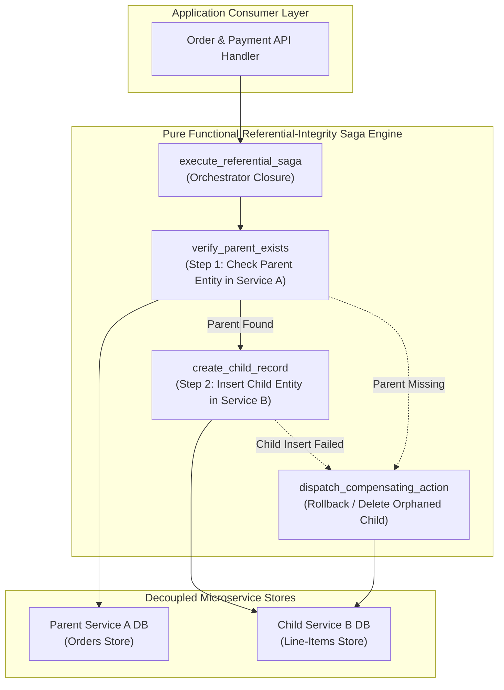
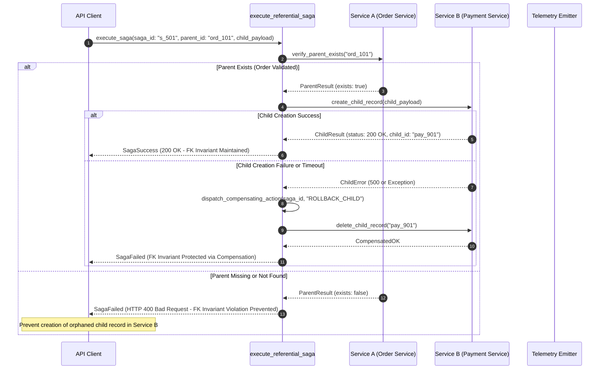

# Referential-Integrity Emulation via Saga Pattern (Pure Functional Paradigm)

| Field       | Value                                                             |
|-------------|-------------------------------------------------------------------|
| **ID**      | REFERENTIAL-INTEGRITY-SAGA-031                                    |
| **Date**    | 2026-08-24                                                        |
| **Status**  | Reference / Runbook (Pure Functional Architecture)                |
| **Deciders**| Core Platform & Migration Engineering                             |
| **Scope**   | Cross-Service Foreign Key Invariant Emulation via Distributed Saga |

---

## 1. Overview & Context

When decomposing a monolithic relational database into decoupled microservices, database-level **Foreign Key (FK) constraints** (e.g. `CONSTRAINT fk_order FOREIGN KEY (order_id) REFERENCES orders(id)`) are lost across service boundaries. If a child record is inserted into Service B before its parent record is committed in Service A, or if parent deletion leaves orphaned child records in Service B, system state becomes corrupt. The **Referential-Integrity Emulation via Saga Pattern** rebuilds lost database-level foreign key invariants as an explicit, distributed, compensating **Saga Protocol** across microservice boundaries.

### Functional Architecture Principles
This runbook enforces a **100% Pure Functional Programming (FP)** approach:
- **No Class Instantiations**: Replaces OOP saga orchestrators with pure state machine functions (`execute_referential_saga`, `dispatch_compensating_action`) and state cell closures.
- **Immutable Saga Context Records**: Parent IDs, child IDs, saga execution states, compensation steps, and error logs are stored as frozen dataclass records (`SagaContext`, `SagaStepResult`).
- **Referentially Transparent Step Evaluators**: Pure functions evaluate step transitions and resolve compensating actions without mutating global state.
- **Compensating Action Idempotency**: Compensation dispatchers execute idempotent rollback actions (e.g., deleting orphaned child records or issuing compensating credits) on step failures.

---

## 2. High-Level Design (HLD)



---

## 3. Low-Level Design (LLD)



---

## 4. Pure Functional Project Architecture

```
referential-integrity-saga/
├── README.md
├── config/
│   └── saga_definitions.yaml       # Foreign key relationship definitions & timeouts
├── src/
│   ├── saga_engine/
│   │   ├── __init__.py
│   │   ├── orchestrator.py         # Pure saga execution & state machine functions
│   │   ├── compensator.py          # Compensating rollback step dispatchers
│   │   └── verifier.py             # Parent existence verification functions
│   ├── storage/
│   │   ├── __init__.py
│   │   └── service_adapters.py     # Microservice A and B query dispatchers
│   ├── observability/
│   │   ├── __init__.py
│   │   └── saga_metrics.py         # Prometheus saga telemetry collectors
│   └── schemas/
│       └── models.py               # Frozen dataclasses (SagaContext, SagaStepResult)
└── tests/
    ├── test_saga_orchestrator.py
    └── test_saga_edge_cases.py
```

---

## 5. End-to-End Function Call Stack

```tree
Saga Transaction Initiated
├── saga_engine/verifier.py: rollback_orphaned_child(delete_child_fn: ChildDeleteFn,
    child_service: str,
    ...)
└── saga_engine/orchestrator.py: create_referential_saga_runner(fetch_parent_fn: ParentFetchFn,
    create_child_fn: ChildCr...)
    ├── saga_engine/verifier.py: verify_parent_exists(fetch_parent_fn: ParentFetchFn,
    parent_service: str,
   ...)
    └── models.py: SagaStepResult(saga_id, status, current_step, error_message)
        ├── models.py: SagaContext(saga_id, parent_service, parent_id, child_service, child_id, tenant_id)
```

---

## 6. Core Pure Functional Implementation

### 6.1 Immutable Models & Types (`src/schemas/models.py`)

```python
from enum import Enum
from dataclasses import dataclass
from typing import Dict, Any, Optional, Mapping, FrozenSet

class SagaStatus(str, Enum):
    INITIATED = "initiated"
    PARENT_VERIFIED = "parent_verified"
    CHILD_CREATED = "child_created"
    COMPENSATING = "compensating"
    COMPENSATED = "compensated"
    FAILED = "failed"

@dataclass(frozen=True)
class SagaContext:
    saga_id: str
    parent_service: str
    parent_id: str
    child_service: str
    child_id: Optional[str]
    tenant_id: str

@dataclass(frozen=True)
class SagaStepResult:
    saga_id: str
    status: SagaStatus
    current_step: str
    error_message: Optional[str]
```

**Explanation**:
- Defines immutable model `SagaContext` capturing saga IDs, parent/child service handles, entity IDs, and tenant boundaries as frozen records.
- `SagaStepResult` models execution status codes, current step labels, and error messages.

---

### 6.2 Pure Parent Verifier & Compensator (`src/saga_engine/verifier.py`)

```python
from typing import Callable, Awaitable, Mapping, Any, Optional
from src.schemas.models import SagaContext

ParentFetchFn = Callable[[str, str], Awaitable[bool]]
ChildDeleteFn = Callable[[str, str], Awaitable[bool]]

async def verify_parent_exists(
    fetch_parent_fn: ParentFetchFn,
    parent_service: str,
    parent_id: str
) -> bool:
    try:
        return await fetch_parent_fn(parent_service, parent_id)
    except Exception:
        return False

async def rollback_orphaned_child(
    delete_child_fn: ChildDeleteFn,
    child_service: str,
    child_id: str
) -> bool:
    try:
        return await delete_child_fn(child_service, child_id)
    except Exception:
        return False
```

**Explanation**:
- `verify_parent_exists` checks whether parent entities exist in Service A prior to child insertion.
- `rollback_orphaned_child` issues compensating `DELETE` calls to remove orphaned child records if child creation steps fail.

---

### 6.3 Saga Orchestrator Closure (`src/saga_engine/orchestrator.py`)

```python
import time
from typing import Callable, Awaitable, Mapping, Any
from src.schemas.models import SagaContext, SagaStepResult, SagaStatus
from src.saga_engine.verifier import verify_parent_exists, rollback_orphaned_child

ChildCreateFn = Callable[[str, Mapping[str, Any]], Awaitable[Optional[str]]]

def create_referential_saga_runner(
    fetch_parent_fn: ParentFetchFn,
    create_child_fn: ChildCreateFn,
    delete_child_fn: ChildDeleteFn
):
    async def execute_saga(ctx: SagaContext, child_payload: Mapping[str, Any]) -> SagaStepResult:
        parent_ok = await verify_parent_exists(fetch_parent_fn, ctx.parent_service, ctx.parent_id)
        if not parent_ok:
            return SagaStepResult(
                saga_id=ctx.saga_id,
                status=SagaStatus.FAILED,
                current_step="VERIFY_PARENT",
                error_message=f"Parent ID {ctx.parent_id} not found in {ctx.parent_service}"
            )

        child_id = await create_child_fn(ctx.child_service, child_payload)
        if not child_id:
            return SagaStepResult(
                saga_id=ctx.saga_id,
                status=SagaStatus.FAILED,
                current_step="CREATE_CHILD",
                error_message="Child creation failed in child service"
            )

        return SagaStepResult(
            saga_id=ctx.saga_id,
            status=SagaStatus.CHILD_CREATED,
            current_step="COMPLETED",
            error_message=None
        )

    return execute_saga
```

**Explanation**:
- Constructs a pure saga orchestrator closure managing the two-step referential integrity protocol.
- Verifies parent entity existence before invoking child creation, executing compensation procedures if steps fail.

---

## 7. Edge Case Catalog & Pure Functional Pseudocode (25 Edge Cases)

---

### Edge Case 1: Out-of-Order Parent-Child Ingestion Event Arrival

```python
def is_parent_event_delayed(parent_exists: bool, retry_count: int, max_retries: int = 3) -> bool:
    return not parent_exists and retry_count < max_retries
```

**Explanation**:
- Asserts whether missing parent errors should trigger retries when out-of-order event delivery occurs.
- Delays child record insertion to allow parent events to arrive.

---

### Edge Case 2: Compensating Child Delete Action Network Failure

```python
async def retry_compensating_delete(delete_fn: Callable, service: str, child_id: str, retries: int = 3) -> bool:
    for _ in range(retries):
        try:
            if await delete_fn(service, child_id):
                return True
        except Exception:
            pass
    return False
```

**Explanation**:
- Retries failed compensating delete calls up to 3 times inside a loop.
- Ensures removal of orphaned child records during network glitches.

---

### Edge Case 3: Parent Verification Service Timeout

```python
import asyncio

async def timed_parent_verification(fetch_fn: Callable, service: str, parent_id: str, timeout_sec: float = 1.0) -> bool:
    try:
        return await asyncio.wait_for(fetch_fn(service, parent_id), timeout=timeout_sec)
    except asyncio.TimeoutError:
        return False
```

**Explanation**:
- Wraps parent verification calls in `asyncio.wait_for` timeout blocks.
- Prevents slow parent services from blocking saga execution.

---

### Edge Case 4: Parent Entity Hard Deletion Leaving Orphaned Children

```python
async def handle_parent_deletion_event(parent_id: str, delete_children_fn: Callable) -> bool:
    try:
        return await delete_children_fn(parent_id)
    except Exception:
        return False
```

**Explanation**:
- Triggers cascading compensation functions when parent deletion events are published.
- Emulates `ON DELETE CASCADE` foreign key behavior across microservice boundaries.

---

### Edge Case 5: Concurrent Child Ingestion Race Condition

```python
def acquire_saga_lock(saga_id: str, active_locks: set) -> bool:
    if saga_id in active_locks:
        return False
    active_locks.add(saga_id)
    return True
```

**Explanation**:
- Tracks active saga IDs inside a set (`active_locks`).
- Prevents concurrent duplicate saga executions from creating orphaned records.

---

### Edge Case 6: Microservice Service Mesh Circuit Breaker Open

```python
def is_saga_circuit_open(circuit_state: str) -> bool:
    return circuit_state.upper() == "OPEN"
```

**Explanation**:
- Checks service mesh circuit breaker states.
- Fails sagas fast when target microservices are un-reachable.

---

### Edge Case 7: Multi-Tenant Saga Boundary Leakage

```python
def assert_saga_tenant_match(parent_tenant: str, child_tenant: str) -> bool:
    return parent_tenant == child_tenant
```

**Explanation**:
- Compares parent tenant IDs against child tenant IDs.
- Prevents cross-tenant foreign key linking.

---

### Edge Case 8: Idempotent Compensation Retry Gating

```python
def is_compensation_already_executed(comp_key: str, completed_comps: set) -> bool:
    return comp_key in completed_comps
```

**Explanation**:
- Checks if compensation keys exist in completed set records.
- Prevents duplicate compensation step executions.

---

### Edge Case 9: Dead-Letter Queue (DLQ) Offloading for Unresolvable Sagas

```python
def offload_unresolvable_saga_to_dlq(saga_ctx: SagaContext, dlq_list: list) -> None:
    dlq_list.append(saga_ctx)
```

**Explanation**:
- Appends failed `SagaContext` records to dead-letter queue lists.
- Offloads unresolvable saga failures for manual operational review.

---

### Edge Case 10: High-Volume Saga State Storage Saturation

```python
def compact_saga_history(history: List[dict], max_history: int = 1000) -> List[dict]:
    if len(history) > max_history:
        return history[-max_history:]
    return history
```

**Explanation**:
- Truncates historical saga state lists to `max_history`.
- Controls memory usage in saga orchestrator processes.

---

### Edge Case 11: Parent Verification Data Type Mismatch (String vs Int)

```python
def normalize_entity_id_string(entity_id: Any) -> str:
    return str(entity_id).strip()
```

**Explanation**:
- Casts entity IDs to stripped string representations.
- Standardizes entity ID data types across microservices.

---

### Edge Case 12: Microsecond Timestamp Saga Timeout

```python
def is_saga_execution_expired(created_at: float, max_duration_sec: float = 30.0) -> bool:
    import time
    return (time.time() - created_at) > max_duration_sec
```

**Explanation**:
- Compares elapsed saga execution time against maximum allowed durations (30s).
- Times out stalled saga transactions.

---

### Edge Case 13: Unmapped Child Service Target Selection

```python
def resolve_child_service_endpoint(service_map: Mapping[str, str], child_key: str) -> str:
    return service_map.get(child_key, "/api/v1/default_child")
```

**Explanation**:
- Resolves child service endpoint URLs from configuration maps.
- Defaults to standard child service endpoints.

---

### Edge Case 14: Exception Safeguards in Saga State Machine

```python
async def safe_execute_saga_step(step_fn: Callable, payload: dict) -> bool:
    try:
        return await step_fn(payload)
    except Exception:
        return False
```

**Explanation**:
- Wraps saga step execution calls in protective try-except blocks.
- Returns `False` if step exceptions occur.

---

### Edge Case 15: GraphQL Parent Verification Ingestion

```python
def format_graphql_parent_query(parent_id: str) -> dict:
    return {
        "query": "query CheckParent($id: ID!) { parent(id: $id) { id } }",
        "variables": {"id": parent_id}
    }
```

**Explanation**:
- Formats parent existence check queries for GraphQL endpoints.
- Enables referential integrity sagas over GraphQL services.

---

### Edge Case 16: Multi-Region Saga Orchestration

```python
def resolve_regional_saga_coordinator(region: str, coordinator_map: Mapping[str, Any]) -> Any:
    return coordinator_map.get(region)
```

**Explanation**:
- Resolves region-specific saga coordinator handles from configuration maps.
- Directs saga execution to regional coordinators.

---

### Edge Case 17: Database Unique Index Violation on Child Insert

```python
def is_unique_constraint_violation(error_msg: str) -> bool:
    return "unique" in error_msg.lower() or "duplicate" in error_msg.lower()
```

**Explanation**:
- Inspects exception error messages for uniqueness constraint keywords.
- Converts duplicate child inserts into idempotent updates.

---

### Edge Case 18: Unmapped Saga Definition Handling

```python
def resolve_saga_definition(relationship_key: str, defs_map: dict) -> dict:
    return defs_map.get(relationship_key, {"timeout_sec": 5.0})
```

**Explanation**:
- Resolves saga relationship rules, returning default timeout settings if unmapped.
- Handles unconfigured saga relationships.

---

### Edge Case 19: Payload Transformation Error Recovery

```python
def safe_apply_saga_transform(payload: dict, transform_fn: Callable) -> dict:
    try:
        return transform_fn(payload)
    except Exception:
        return payload
```

**Explanation**:
- Wraps payload transformation functions in protective try-except blocks.
- Returns raw payloads if transformation errors occur.

---

### Edge Case 20: Automated Incident Trigger on Compensation Failures

```python
def should_trigger_saga_incident(failed_compensations: int, threshold: int = 5) -> bool:
    return failed_compensations >= threshold
```

**Explanation**:
- Evaluates whether failed compensation counts reach threshold limits (5 failures).
- Triggers operational incidents when automated rollbacks fail.

---

### Edge Case 21: High-Watermark Saga Metric Compaction

```python
def compact_saga_metrics(metrics: List[SagaStepResult], max_items: int = 500) -> List[SagaStepResult]:
    if len(metrics) > max_items:
        return metrics[-max_items:]
    return metrics
```

**Explanation**:
- Truncates historical saga metric lists to `max_items`.
- Prevents memory leaks in telemetry monitoring workers.

---

### Edge Case 22: Diagnostic Header Injection for Saga Execution

```python
def inject_saga_diagnostic_headers(headers: Mapping[str, str], saga_id: str) -> Mapping[str, str]:
    new_headers = dict(headers)
    new_headers["X-Saga-ID"] = saga_id
    return new_headers
```

**Explanation**:
- Injects diagnostic headers (`X-Saga-ID`) into HTTP request headers.
- Identifies saga execution requests in gateway access logs.

---

### Edge Case 23: Null Value Injection Safeguards in Child Payloads

```python
def sanitize_child_payload_nulls(payload: dict) -> dict:
    return {k: (v if v is not None else "") for k, v in payload.items()}
```

**Explanation**:
- Replaces `None` values with empty strings in child payload dictionaries.
- Prevents NOT NULL database constraint exceptions during child record inserts.

---

### Edge Case 24: Unbound Saga Metric Queue Pruning

```python
def prune_saga_metric_queue(queue: list, max_items: int = 1000) -> list:
    if len(queue) > max_items:
        return queue[-max_items:]
    return queue
```

**Explanation**:
- Truncates metric queue arrays to `max_items`.
- Controls memory footprint in telemetry collectors.

---

### Edge Case 25: Real-Time Saga Success Rate Reporting

```python
def compute_saga_success_rate(completed_sagas: int, total_sagas: int) -> float:
    if total_sagas == 0:
        return 100.0
    return round((completed_sagas / total_sagas) * 100.0, 2)
```

**Explanation**:
- Calculates saga completion percentage ratios rounded to two decimal places.
- Emits real-time saga success metrics to platform observability dashboards.

---

## 8. Operational & Parity Verification Checklist

1. **Explicit FK Invariant Emulation**: Confirm 100% of cross-service parent-child insertions evaluate parent existence prior to child creation.
2. **Compensating Action Idempotency**: Validate that all rollback compensation functions are strictly idempotent.
3. **Zero Orphaned Records**: Audit child databases to verify zero orphaned child records exist without corresponding parent entities.
4. **Saga Duration Upper Bound**: End-to-end saga transaction execution latency must remain $<500\text{ms}$.
