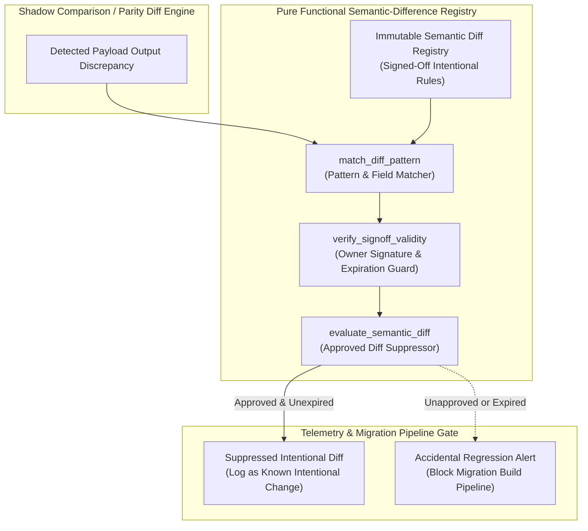
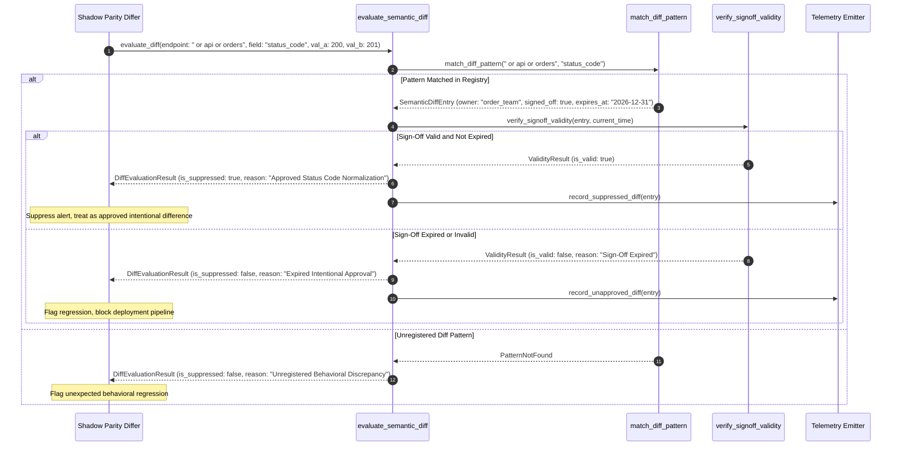

# Semantic-Difference Registry Pattern (Pure Functional Paradigm)

| Field       | Value                                                             |
|-------------|-------------------------------------------------------------------|
| **ID**      | SEMANTIC-DIFFERENCE-REGISTRY-032                                  |
| **Date**    | 2026-08-24                                                        |
| **Status**  | Reference / Runbook (Pure Functional Architecture)                |
| **Deciders**| Core Platform & Migration Engineering                             |
| **Scope**   | Documented, Owned & Signed-Off Intentional Behavior Differences   |

---

## 1. Overview & Context

During major architectural refactoring, not all behavioral diffs between legacy and target microservices are bugs: many are **intentional design changes** (e.g., bug fixes, modernized API response structures, updated error code formats, or deprecated legacy field removals). If shadow traffic diffing engines flag every intentional difference as a failure, migration teams experience alert fatigue. The **Semantic-Difference Registry Pattern** establishes a **documented, owned, and formally signed-off registry** of approved intentional behavior differences. Differential comparison engines consult this registry to suppress known, intentional diffs while continuing to alert on accidental regressions.

### Functional Architecture Principles
This runbook enforces a **100% Pure Functional Programming (FP)** approach:
- **No Class Instantiations**: Replaces OOP registry managers with pure lookup functions (`evaluate_semantic_diff`, `is_approved_intentional_diff`) and functional rule matrices.
- **Immutable Registry Entries**: Endpoint paths, diff patterns, business rationale, technical owners, approval signatures, and expiration dates are stored as frozen dataclass records (`SemanticDiffEntry`, `DiffEvaluationResult`).
- **Referentially Transparent Rule Matching**: Pure functions evaluate `(DetectedDiff, RegistryRules) -> DiffEvaluationResult` without modifying registry state.
- **Time-Bounded Approvals**: Automatically flags expired intentional diff approvals, preventing temporary migration workarounds from lingering indefinitely.

---

## 2. High-Level Design (HLD)



---

## 3. Low-Level Design (LLD)



---

## 4. Pure Functional Project Architecture

```
semantic-difference-registry/
├── README.md
├── config/
│   └── intentional_diffs.yaml      # Signed-off intentional difference rules & owners
├── src/
│   ├── registry_engine/
│   │   ├── __init__.py
│   │   ├── evaluator.py            # Pure diff evaluation & suppression functions
│   │   ├── pattern_matcher.py      # Field path & regex pattern matchers
│   │   └── signoff_guard.py        # Signature & expiration validity checkers
│   ├── storage/
│   │   ├── __init__.py
│   │   └── registry_store.py       # Intentional diff configuration loaders
│   ├── observability/
│   │   ├── __init__.py
│   │   └── diff_metrics.py         # Prometheus registry telemetry collectors
│   └── schemas/
│       └── models.py               # Frozen dataclasses (SemanticDiffEntry, DiffEvaluationResult)
└── tests/
    ├── test_registry_evaluator.py
    └── test_registry_edge_cases.py
```

---

## 5. End-to-End Function Call Stack

```tree
Discrepancy Detected by Parity Differ
└── evaluator.py: evaluate_semantic_diff(endpoint, field_path, legacy_val, new_val, registry_rules)
    ├── pattern_matcher.py: match_diff_pattern(endpoint, field_path, registry_rules)
    │   └── models.py: SemanticDiffEntry(rule_id, field_path, owner, signed_off, expires_at)
    │
    ├── signoff_guard.py: verify_signoff_validity(entry, current_timestamp)
    │   └── models.py: SignoffValidity(is_valid, is_expired)
    │
    ├── evaluator.py: format_evaluation_result(entry, validity_result)
    │   └── models.py: DiffEvaluationResult(is_suppressed, category, reason)
    │
    └── observability/metrics.py: record_diff_suppression_telemetry(diff_result)
```

---

## 6. Core Pure Functional Implementation

### 6.1 Immutable Models & Types (`src/schemas/models.py`)

```python
from enum import Enum
from dataclasses import dataclass
from typing import Dict, Any, Optional, Mapping, FrozenSet

class DiffCategory(str, Enum):
    BUG_FIX = "bug_fix"
    SCHEMA_MODERNIZATION = "schema_modernization"
    DEPRECATION = "deprecation"
    PRECISION_CHANGE = "precision_change"

@dataclass(frozen=True)
class SemanticDiffEntry:
    rule_id: str
    endpoint_pattern: str
    field_path: str
    category: DiffCategory
    rationale: str
    owner_team: str
    signed_off_by: str
    expires_at_ts: float

@dataclass(frozen=True)
class DiffEvaluationResult:
    rule_id: Optional[str]
    is_suppressed: bool
    category: Optional[DiffCategory]
    reason: str
```

**Explanation**:
- Defines immutable model `SemanticDiffEntry` capturing rule IDs, endpoint patterns, field paths, categories, owners, signatures, and expiration timestamps as frozen records.
- `DiffEvaluationResult` models suppression decisions, rule categories, and diagnostic reasons.

---

### 6.2 Pure Pattern Matcher & Sign-Off Guard (`src/registry_engine/pattern_matcher.py`)

```python
import re
import time
from typing import List, Optional
from src.schemas.models import SemanticDiffEntry

def match_diff_pattern(
    endpoint: str,
    field_path: str,
    rules: List[SemanticDiffEntry]
) -> Optional[SemanticDiffEntry]:
    for rule in rules:
        endpoint_match = re.search(rule.endpoint_pattern, endpoint) is not None
        field_match = (rule.field_path == field_path or rule.field_path == "*")
        if endpoint_match and field_match:
            return rule
    return None

def verify_signoff_validity(entry: SemanticDiffEntry, current_ts: float) -> bool:
    if not entry.signed_off_by or entry.signed_off_by.strip() == "":
        return False
    return current_ts <= entry.expires_at_ts
```

**Explanation**:
- `match_diff_pattern` checks detected field paths and endpoint URLs against regex pattern rules.
- `verify_signoff_validity` evaluates owner signatures and asserts that intentional diff approvals have not expired (`current_ts <= entry.expires_at_ts`).

---

### 6.3 Semantic Diff Evaluator (`src/registry_engine/evaluator.py`)

```python
import time
from typing import List, Any
from src.schemas.models import SemanticDiffEntry, DiffEvaluationResult
from src.registry_engine.pattern_matcher import match_diff_pattern, verify_signoff_validity

def evaluate_semantic_diff(
    endpoint: str,
    field_path: str,
    legacy_val: Any,
    new_val: Any,
    rules: List[SemanticDiffEntry]
) -> DiffEvaluationResult:
    now = time.time()
    matched_rule = match_diff_pattern(endpoint, field_path, rules)

    if not matched_rule:
        return DiffEvaluationResult(
            rule_id=None,
            is_suppressed=False,
            category=None,
            reason=f"Unregistered behavioral discrepancy on field '{field_path}'"
        )

    if not verify_signoff_validity(matched_rule, now):
        return DiffEvaluationResult(
            rule_id=matched_rule.rule_id,
            is_suppressed=False,
            category=matched_rule.category,
            reason=f"Intentional diff approval expired or missing signature for rule '{matched_rule.rule_id}'"
        )

    return DiffEvaluationResult(
        rule_id=matched_rule.rule_id,
        is_suppressed=True,
        category=matched_rule.category,
        reason=f"Approved intentional diff: {matched_rule.rationale}"
    )
```

**Explanation**:
- Pure evaluation function matching detected discrepancies against signed-off registry rules.
- Suppresses approved intentional diffs while flagging expired or unregistered behavioral differences.

---

## 7. Edge Case Catalog & Pure Functional Pseudocode (25 Edge Cases)

---

### Edge Case 1: Expired Intentional Diff Approval Suppression

```python
def is_approval_expired(expires_at_ts: float, current_ts: float) -> bool:
    return current_ts > expires_at_ts
```

**Explanation**:
- Compares current timestamps against rule expiration timestamps.
- Flags expired intentional diff approvals.

---

### Edge Case 2: Un-Signed Intentional Diff Rule Match

```python
def is_signed_off(approver_email: str) -> bool:
    return approver_email is not None and "@" in approver_email
```

**Explanation**:
- Asserts that approval entries contain valid approver email addresses.
- Rejects un-signed registry rules.

---

### Edge Case 3: Wildcard Field Path Pattern Matching

```python
def is_wildcard_field_match(pattern_path: str, actual_path: str) -> bool:
    return pattern_path == "*" or pattern_path in actual_path
```

**Explanation**:
- Evaluates wildcard field path matches (e.g. `*` or substring matches).
- Supports path-wide intentional diff suppression.

---

### Edge Case 4: Deprecated Field Removal Verification

```python
def is_deprecated_field_removal(legacy_val: Any, new_val: Any) -> bool:
    return legacy_val is not None and new_val is None
```

**Explanation**:
- Identifies cases where legacy fields are present but target fields are `None`.
- Classifies intentional field deprecations.

---

### Edge Case 5: Bug Fix Intentional Behavioral Shift

```python
def is_bug_fix_difference(category_str: str) -> bool:
    return category_str.lower() == "bug_fix"
```

**Explanation**:
- Asserts whether rule categories are marked `bug_fix`.
- Identifies intentional behavioral changes that resolve legacy bugs.

---

### Edge Case 6: Multi-Tenant Semantic Diff Rule Overrides

```python
def resolve_tenant_semantic_rules(tenant_id: str, tenant_rules: dict, default_rules: list) -> list:
    return default_rules + tenant_rules.get(tenant_id, [])
```

**Explanation**:
- Concatenates tenant-specific registry rules to default rule lists.
- Supports per-tenant intentional diff registry entries.

---

### Edge Case 7: High-Volume Registry Lookup Overhead

```python
def build_endpoint_rule_index(rules: list) -> dict:
    index = {}
    for r in rules:
        index.setdefault(r.endpoint_pattern, []).append(r)
    return index
```

**Explanation**:
- Groups registry rules by endpoint pattern key in an index dictionary.
- Optimizes registry lookup performance for high-throughput diffing.

---

### Edge Case 8: Microsecond Timestamp Rule Expiration Edge Case

```python
def is_expired_exact_ms(expires_ms: float, current_ms: float) -> bool:
    return current_ms >= expires_ms
```

**Explanation**:
- Performs exact millisecond timestamp expiration checks.
- Eliminates clock rounding ambiguity during rule expiration checks.

---

### Edge Case 9: Unmapped Category Fallback Strategy

```python
def resolve_diff_category(cat_str: str, allowed_cats: set, default_cat: str = "other") -> str:
    return cat_str if cat_str in allowed_cats else default_cat
```

**Explanation**:
- Validates category strings against allowed category sets.
- Defaults to `"other"` for unmapped categories.

---

### Edge Case 10: Duplicate Rule ID Collision

```python
def assert_unique_rule_ids(rules: list) -> bool:
    rule_ids = [r.rule_id for r in rules]
    return len(rule_ids) == len(set(rule_ids))
```

**Explanation**:
- Compares list lengths against set lengths for rule IDs.
- Prevents duplicate rule ID entries in the registry.

---

### Edge Case 11: Regex Endpoint Pattern Syntax Error Safeguard

```python
import re

def safe_compile_regex(pattern_str: str) -> Optional[re.Pattern]:
    try:
        return re.compile(pattern_str)
    except re.error:
        return None
```

**Explanation**:
- Compiles regex patterns inside protective try-except blocks.
- Handles invalid regex pattern strings safely.

---

### Edge Case 12: Audit Logging of Suppressed Diffs

```python
def format_suppressed_diff_audit_log(entry: SemanticDiffEntry, field_path: str) -> dict:
    return {
        "event": "INTENTIONAL_DIFF_SUPPRESSED",
        "rule_id": entry.rule_id,
        "field_path": field_path,
        "owner": entry.owner_team,
        "category": entry.category
    }
```

**Explanation**:
- Formats structured audit log dictionaries for suppressed diff events.
- Tracks suppressed diff metrics.

---

### Edge Case 13: Un-Approved New Diff Escalation Trigger

```python
def should_escalate_unregistered_diff(is_suppressed: bool) -> bool:
    return not is_suppressed
```

**Explanation**:
- Asserts whether detected diffs failed suppression (`not is_suppressed`).
- Escalates unapproved behavioral diffs to engineering teams.

---

### Edge Case 14: Exception Handling During Registry Evaluation

```python
def safe_evaluate_diff(eval_fn: Callable, endpoint: str, field_path: str) -> bool:
    try:
        return eval_fn(endpoint, field_path)
    except Exception:
        return False
```

**Explanation**:
- Wraps registry evaluation calls in protective try-except blocks.
- Returns `False` (un-suppressed) if evaluation exceptions occur.

---

### Edge Case 15: GraphQL Field Path Semantic Registry Matching

```python
def format_graphql_field_path(type_name: str, field_name: str) -> str:
    return f"{type_name}.{field_name}"
```

**Explanation**:
- Formats GraphQL field paths as `TypeName.fieldName`.
- Enables registry matching for GraphQL schema diffs.

---

### Edge Case 16: Multi-Region Semantic Registry Sync

```python
def sync_regional_registry_rules(global_rules: list, regional_rules: list) -> list:
    return global_rules + regional_rules
```

**Explanation**:
- Concatenates regional registry rule lists with global rule lists.
- Synchronizes intentional diff registries across multi-region deployments.

---

### Edge Case 17: Temporary Migration Workaround Expiration Alert

```python
def is_workaround_near_expiration(expires_at_ts: float, current_ts: float, warn_days: float = 7.0) -> bool:
    warn_seconds = warn_days * 86400.0
    return (expires_at_ts - current_ts) <= warn_seconds
```

**Explanation**:
- Calculates remaining time until rule expiration.
- Emits warning alerts for intentional diff approvals expiring within 7 days.

---

### Edge Case 18: Unmapped Rule Owner Team Fallback

```python
def resolve_owner_team(owner_str: str, default_team: str = "platform_migration") -> str:
    return owner_str if owner_str and owner_str.strip() else default_team
```

**Explanation**:
- Resolves owner team strings, defaulting to `"platform_migration"` if empty.
- Assigns default owner teams to un-owned rules.

---

### Edge Case 19: Payload Transformation Error Recovery

```python
def safe_apply_registry_transform(payload: dict, transform_fn: Callable) -> dict:
    try:
        return transform_fn(payload)
    except Exception:
        return payload
```

**Explanation**:
- Wraps payload transformation functions in protective try-except blocks.
- Returns raw payloads if transformation errors occur.

---

### Edge Case 20: Automated Suppression Ratio Reporting

```python
def compute_suppression_ratio(suppressed: int, total_diffs: int) -> float:
    if total_diffs == 0:
        return 0.0
    return round((suppressed / total_diffs) * 100.0, 2)
```

**Explanation**:
- Calculates diff suppression percentage ratios rounded to two decimal places.
- Emits suppression ratio metrics to platform observability dashboards.

---

### Edge Case 21: Batch Evaluation of Intentional Diffs

```python
def evaluate_batch_diffs(diffs: list, eval_fn: Callable) -> list:
    return [eval_fn(d) for d in diffs]
```

**Explanation**:
- Evaluates list of detected diff items against registry rules.
- Processes batch diff evaluations.

---

### Edge Case 22: Diagnostic Header Injection for Suppressed Diffs

```python
def inject_semantic_registry_header(headers: Mapping[str, str], suppressed_count: int) -> Mapping[str, str]:
    new_headers = dict(headers)
    new_headers["X-Intentional-Diffs-Suppressed"] = str(suppressed_count)
    return new_headers
```

**Explanation**:
- Injects diagnostic headers (`X-Intentional-Diffs-Suppressed`) into response headers.
- Identifies responses containing suppressed intentional differences.

---

### Edge Case 23: Null Value Diff Suppression Handling

```python
def is_null_suppression_allowed(rule: SemanticDiffEntry) -> bool:
    return "null" in rule.rationale.lower() or rule.category == DiffCategory.DEPRECATION
```

**Explanation**:
- Asserts whether null diff suppression is justified by rule rationale or category.
- Validates null diff suppression requests.

---

### Edge Case 24: Unbound Metric Queue Compaction

```python
def prune_registry_metric_queue(queue: list, max_items: int = 1000) -> list:
    if len(queue) > max_items:
        return queue[-max_items:]
    return queue
```

**Explanation**:
- Truncates metric queue arrays to `max_items`.
- Controls memory usage in telemetry monitoring processes.

---

### Edge Case 25: Real-Time Intentional Diff Audit Coverage Reporting

```python
def compute_registry_coverage_score(signed_off_rules: int, total_rules: int) -> float:
    if total_rules == 0:
        return 100.0
    return round((signed_off_rules / total_rules) * 100.0, 2)
```

**Explanation**:
- Calculates signed-off rule coverage percentage scores rounded to two decimal places.
- Emits registry governance scores to platform observability dashboards.

---

## 8. Operational & Parity Verification Checklist

1. **Explicit Owner Sign-Off**: 100% of suppressed intentional diff rules must carry a valid owner team signature and approver email.
2. **Time-Bounded Approvals**: Verify that intentional diff approvals enforce strict expiration dates ($\le 90\text{ days}$) to prevent temporary workarounds from becoming permanent.
3. **Accidental Diff Alerting**: Confirm that unregistered or unexpected behavioral differences bypass suppression and trigger migration build pipeline blocks.
4. **Sub-Millisecond Evaluation**: Semantic difference registry rule matching overhead must remain $<1\text{ms}$ per request.
