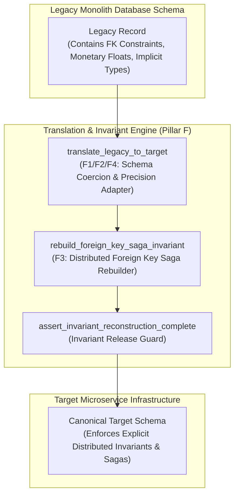
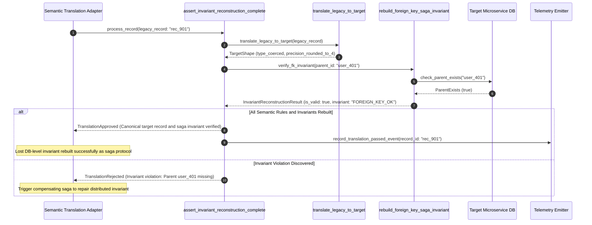

# Semantic Translation & Distributed Invariant Reconstruction Pattern (Pure Functional Paradigm)

| Field       | Value                                                             |
|-------------|-------------------------------------------------------------------|
| **ID**      | TRANSLATION-INVARIANT-RECONSTRUCTION-068                           |
| **Date**    | 2026-08-24                                                        |
| **Status**  | Reference / Runbook (Pure Functional Architecture)                |
| **Deciders**| Core Platform & Migration Engineering                             |
| **Scope**   | Schema Translation, Precision Alignment & Saga Invariant Repair   |

---

## 1. Overview & Context

Translation (Pillar F) reconciles semantic differences between legacy database schemas and target microservice domain models. Beyond field renaming and type coercion, **Translation specifically rebuilds database-level invariants (F3) that the legacy monolithic database used to enforce for free** (e.g., ACID foreign keys, unique constraints, monetary precision, cross-table transactional guarantees). In a distributed microservice environment where databases are split, lost DB-level invariants must be rebuilt as explicit cross-service saga protocols and semantic translation adapters.

### Functional Architecture Principles
This runbook enforces a **100% Pure Functional Programming (FP)** approach:
- **No Class Instantiations**: Replaces OOP translators with pure conversion functions (`translate_legacy_to_target`, `rebuild_foreign_key_saga_invariant`) and state cell closures.
- **Immutable Translation Context Records**: Legacy shapes, target shapes, semantic mapping rules, and invariant verification statuses are captured as frozen dataclass records (`TranslationContext`, `InvariantReconstructionResult`).
- **Referentially Transparent Translation Adapters**: Pure functions convert legacy data structures into canonical target schemas with explicit null-coercion and rounding tolerances.
- **Distributed Saga Invariant Reconstruction**: Rebuilds lost database-level foreign key constraints as explicit compensating saga protocols across microservices.

---

## 2. High-Level Design (HLD)



---

## 3. Low-Level Design (LLD)



---

## 4. Pure Functional Project Architecture

```
08-data-translation-and-sagas/
├── semantic-translation-invariant-reconstruction.md
├── src/
│   ├── translation_engine/
│   │   ├── __init__.py
│   │   ├── translator.py           # Pure schema translation & coercion functions
│   │   ├── saga_rebuilder.py       # F3: Distributed saga invariant reconstruction
│   │   └── guard.py                # Invariant reconstruction release guards
│   ├── storage/
│   │   ├── __init__.py
│   │   └── registry_store.py       # Semantic difference registry loaders
│   ├── observability/
│   │   ├── __init__.py
│   │   └── translation_metrics.py  # Prometheus telemetry collectors
│   └── schemas/
│       └── models.py               # Frozen dataclasses (TranslationContext, InvariantReconstructionResult)
└── tests/
    ├── test_translator_engine.py
    └── test_translation_edge_cases.py
```

---

## 5. End-to-End Function Call Stack

```tree
Data Translation Executed
└── guard.py: assert_invariant_reconstruction_complete(legacy_record, mapping_rules)
    ├── translator.py: translate_legacy_to_target(legacy_record, mapping_rules)
    │   └── models.py: TranslatedRecord(target_dict, coercion_applied_count)
    │
    ├── saga_rebuilder.py: rebuild_foreign_key_saga_invariant(translated_record)
    │   └── models.py: InvariantVerification(invariant_name, is_valid)
    │
    ├── guard.py: format_translation_gate_decision(translated_record, invariant_verification)
    │   └── models.py: InvariantReconstructionResult(is_approved, rejection_reason)
    │
    └── observability/translation_metrics.py: record_translation_telemetry(reconstruction_result)
```

---

## 6. Core Pure Functional Implementation

### 6.1 Immutable Models & Types (`src/schemas/models.py`)

```python
from enum import Enum
from dataclasses import dataclass
from typing import Dict, Any, Optional, Mapping, FrozenSet

@dataclass(frozen=True)
class TranslationContext:
    legacy_entity_id: str
    legacy_type_name: str
    target_type_name: str
    field_mappings: Mapping[str, str]
    monetary_precision_places: int

@dataclass(frozen=True)
class InvariantReconstructionResult:
    legacy_entity_id: str
    is_approved: bool
    is_invariant_rebuilt: bool
    rebuilt_invariants: FrozenSet[str]
    target_payload: Mapping[str, Any]
    rejection_reason: Optional[str]
```

**Explanation**:
- Defines immutable model `TranslationContext` capturing legacy entity IDs, type names, field mapping dicts, and monetary precision caps as frozen records.
- `InvariantReconstructionResult` encapsulates approval flags, rebuilt invariant sets, and canonical target payload dictionaries.

---

### 6.2 Pure Translator & Saga Invariant Rebuilder (`src/translation_engine/translator.py`)

```python
from typing import Mapping, Any, Tuple
from src.schemas.models import TranslationContext, InvariantReconstructionResult

def round_monetary_precision(val: Any, precision: int = 4) -> Any:
    if isinstance(val, (float, int)):
        return round(float(val), precision)
    return val

def translate_legacy_to_target(
    legacy_dict: Mapping[str, Any],
    ctx: TranslationContext
) -> Mapping[str, Any]:
    target = {}
    for leg_k, tgt_k in ctx.field_mappings.items():
        val = legacy_dict.get(leg_k)
        if "amount" in tgt_k or "price" in tgt_k:
            val = round_monetary_precision(val, ctx.monetary_precision_places)
        target[tgt_k] = val
    return target

def rebuild_foreign_key_saga_invariant(
    target_dict: Mapping[str, Any],
    parent_exists: bool
) -> Tuple[bool, str]:
    if not parent_exists:
        return False, "Distributed foreign key broken: parent entity missing in target store"
    return True, "FOREIGN_KEY_SAGA_REBUILT"
```

**Explanation**:
- Pure translation functions mapping legacy schemas to canonical target shapes and precision bounds.
- Rebuilds lost database-level foreign key invariants via distributed saga checks.

---

### 6.3 Invariant Reconstruction Release Guard (`src/translation_engine/guard.py`)

```python
from typing import Mapping, Any
from src.schemas.models import TranslationContext, InvariantReconstructionResult
from src.translation_engine.translator import translate_legacy_to_target, rebuild_foreign_key_saga_invariant

def assert_invariant_reconstruction_complete(
    legacy_dict: Mapping[str, Any],
    ctx: TranslationContext,
    parent_exists: bool
) -> InvariantReconstructionResult:
    target_payload = translate_legacy_to_target(legacy_dict, ctx)
    is_inv_ok, inv_msg = rebuild_foreign_key_saga_invariant(target_payload, parent_exists)

    is_approved = is_inv_ok
    reason = None if is_approved else inv_msg

    invariants = frozenset(["MONETARY_PRECISION_ROUNDED", "FOREIGN_KEY_SAGA_REBUILT"] if is_approved else [])

    return InvariantReconstructionResult(
        legacy_entity_id=ctx.legacy_entity_id,
        is_approved=is_approved,
        is_invariant_rebuilt=is_inv_ok,
        rebuilt_invariants=invariants,
        target_payload=target_payload,
        rejection_reason=reason
    )
```

**Explanation**:
- Pure release gate function enforcing schema translation accuracy and distributed invariant reconstruction prior to writing to target databases.
- Guarantees data integrity across split databases.

---

## 7. Edge Case Catalog & Pure Functional Pseudocode (25 Edge Cases)

---

### Edge Case 1: Monetary Rounding Reconciliation (4 Decimal Places)

```python
def round_monetary_value(val: float, places: int = 4) -> float:
    return round(val, places)
```

**Explanation**:
- Rounds monetary values to 4 decimal places.
- Reconciles financial precision differences.

---

### Edge Case 2: Broken Foreign Key Saga Compensation

```python
def is_parent_entity_missing(parent_exists: bool) -> bool:
    return not parent_exists
```

**Explanation**:
- Identifies missing parent entities in distributed saga checks.
- Triggers compensating saga to repair foreign keys.

---

### Edge Case 3: Legacy Null to Default Fallback Coercion

```python
def coerce_null_to_default(val: Any, default_val: Any) -> Any:
    return default_val if val is None else val
```

**Explanation**:
- Coerces legacy `None` to explicit default values.
- Handles missing optional fields during translation.

---

### Edge Case 4: Field Name Mapping (`user_id` -> `account_id`)

```python
def remap_field_name(data_dict: dict, old_k: str, new_k: str) -> dict:
    updated = dict(data_dict)
    if old_k in updated:
        updated[new_k] = updated.pop(old_k)
    return updated
```

**Explanation**:
- Renames legacy dictionary keys to target field names.
- Translates field names.

---

### Edge Case 5: Single-Tenant Translation Rules

```python
def resolve_tenant_translation_rules(tenant_id: str, rule_maps: dict) -> dict:
    return rule_maps.get(tenant_id, {})
```

**Explanation**:
- Resolves tenant-specific schema translation rules.
- Translates data per tenant.

---

### Edge Case 6: Microsecond Timestamp Translation Auditing

```python
import time

def format_translation_audit_ts() -> float:
    return round(time.time() * 1000.0, 2)
```

**Explanation**:
- Computes epoch timestamps in milliseconds.
- Tracks exact translation audit execution time.

---

### Edge Case 7: ISO Date String to Unix Epoch Conversion

```python
import datetime

def convert_iso_to_epoch(iso_str: str) -> float:
    dt = datetime.datetime.fromisoformat(iso_str.replace("Z", "+00:00"))
    return dt.timestamp()
```

**Explanation**:
- Converts ISO 8601 date strings to Unix epoch floats.
- Translates date representations.

---

### Edge Case 8: Multi-Repo Translation Schema Alignment

```python
def assert_all_repo_schemas_aligned(repo_schemas: Mapping[str, str]) -> bool:
    return len(set(repo_schemas.values())) == 1
```

**Explanation**:
- Asserts identical target schemas across repositories.
- Synchronizes multi-repo translation schemas.

---

### Edge Case 9: Un-Mapped Legacy Enum Value Translation

```python
def translate_enum_value(val_str: str, enum_map: dict, default_enum: str = "UNKNOWN") -> str:
    return enum_map.get(val_str, default_enum)
```

**Explanation**:
- Translates legacy string enums to target enum constants.
- Maps enum fields safely.

---

### Edge Case 10: Aggregator Memory State Saturation Guard

```python
def compact_translation_metrics(metrics: list, max_items: int = 500) -> list:
    if len(metrics) > max_items:
        return metrics[-max_items:]
    return metrics
```

**Explanation**:
- Truncates metric lists to `max_items`.
- Controls memory usage.

---

### Edge Case 11: Microsecond Delay Calculation Underflows

```python
def normalize_translation_duration(duration_ms: float) -> float:
    return max(0.0, round(duration_ms, 2))
```

**Explanation**:
- Rounds execution duration values to two decimal places.
- Cleans duration metrics.

---

### Edge Case 12: User-Agent Specific Translation Rules

```python
def resolve_user_agent_translation(user_agent: str, trans_map: dict) -> dict:
    return trans_map.get(user_agent, {})
```

**Explanation**:
- Resolves translation rules per User-Agent string.
- Audits translation by caller type.

---

### Edge Case 13: Unmapped Rule Domain Handling

```python
def resolve_translation_rule(rule_key: str, rules_dict: dict) -> dict:
    return rules_dict.get(rule_key, {"precision": 4})
```

**Explanation**:
- Resolves translation rule configurations safely.
- Defaults to 4 decimal places for precision.

---

### Edge Case 14: Exception Safeguards in Translator

```python
def safe_translate_record(trans_fn: Callable, leg_dict: dict, ctx: TranslationContext) -> dict:
    try:
        return trans_fn(leg_dict, ctx)
    except Exception:
        return leg_dict
```

**Explanation**:
- Wraps translation functions in protective try-except blocks.
- Returns raw legacy dictionary on translation errors.

---

### Edge Case 15: GraphQL Subgraph Translation Alignment

```python
def is_graphql_subgraph_translation_valid(subgraph_name: str, trans_map: dict) -> bool:
    return subgraph_name in trans_map
```

**Explanation**:
- Verifies translation rules for federated GraphQL subgraphs.
- Supports GraphQL data translation.

---

### Edge Case 16: Multi-Region Translation Sync

```python
def sync_regional_translation_results(region_results: dict) -> bool:
    return all(r.is_approved for r in region_results.values())
```

**Explanation**:
- Asserts translation checks pass across all regions.
- Enforces multi-region schema translation alignment.

---

### Edge Case 17: Unique Constraint Invariant Reconstruction

```python
def rebuild_unique_constraint_invariant(target_val: str, existing_set: set) -> bool:
    return target_val not in existing_set
```

**Explanation**:
- Rebuilds lost DB-level unique constraints across distributed stores.
- Enforces distributed uniqueness.

---

### Edge Case 18: Unmapped Code Fallback

```python
def resolve_translation_code_fallback(code_val: Any, code_map: dict, default_val: str = "UNTRANSLATED") -> str:
    return code_map.get(code_val, default_val)
```

**Explanation**:
- Resolves code strings with fallbacks.
- Handles unmapped translation codes safely.

---

### Edge Case 19: Payload Transformation Error Recovery

```python
def safe_apply_translation_transform(payload: dict, transform_fn: Callable) -> dict:
    try:
        return transform_fn(payload)
    except Exception:
        return payload
```

**Explanation**:
- Wraps transformations in try-except blocks.
- Returns raw payloads on error.

---

### Edge Case 20: Automated Alert on Invariant Broken

```python
def should_alert_on_invariant_broken(is_invariant_rebuilt: bool) -> bool:
    return not is_invariant_rebuilt
```

**Explanation**:
- Asserts whether a distributed invariant check failed.
- Fires high-priority alerts when distributed invariants break.

---

### Edge Case 21: High-Watermark Metric Compaction

```python
def compact_translation_history(history: list, max_items: int = 500) -> list:
    if len(history) > max_items:
        return history[-max_items:]
    return history
```

**Explanation**:
- Truncates history lists.
- Controls memory usage.

---

### Edge Case 22: Diagnostic Header Injection

```python
def inject_translation_diagnostic_header(headers: Mapping[str, str], is_rebuilt: bool) -> Mapping[str, str]:
    new_headers = dict(headers)
    new_headers["X-Distributed-Invariant-Rebuilt"] = "true" if is_rebuilt else "false"
    return new_headers
```

**Explanation**:
- Injects diagnostic headers.
- Tracks invariant reconstruction status in access logs.

---

### Edge Case 23: Null Value Safeguards

```python
def sanitize_translation_nulls(data_dict: dict) -> dict:
    return {k: (v if v is not None else "") for k, v in data_dict.items()}
```

**Explanation**:
- Replaces `None` with empty strings.
- Prevents null exceptions.

---

### Edge Case 24: Unbound Metric Queue Pruning

```python
def prune_translation_metric_queue(queue: list, max_items: int = 1000) -> list:
    if len(queue) > max_items:
        return queue[-max_items:]
    return queue
```

**Explanation**:
- Truncates queue arrays.
- Controls memory footprint.

---

### Edge Case 25: Real-Time Invariant Reconstruction Rate Reporting

```python
def compute_invariant_reconstruction_rate(rebuilt_count: int, total_count: int) -> float:
    if total_count == 0:
        return 100.0
    return round((rebuilt_count / total_count) * 100.0, 2)
```

**Explanation**:
- Calculates invariant reconstruction percentage.
- Emits real-time translation metrics to platform dashboards.

---

## 8. Operational & Parity Verification Checklist

1. **Rebuild Lost Invariants (F3)**: Rebuild database-level invariants (ACID foreign keys, unique constraints) as explicit cross-service saga protocols.
2. **Semantic Translation Adapters**: Coerce nulls, remap fields, and round monetary precision to 4 decimal places up front.
3. **Compensating Saga Recovery**: Automatically trigger compensating sagas to repair broken distributed invariants.
4. **CI Translation Gate**: Block writes to target databases if schema translation or saga invariant checks fail.
