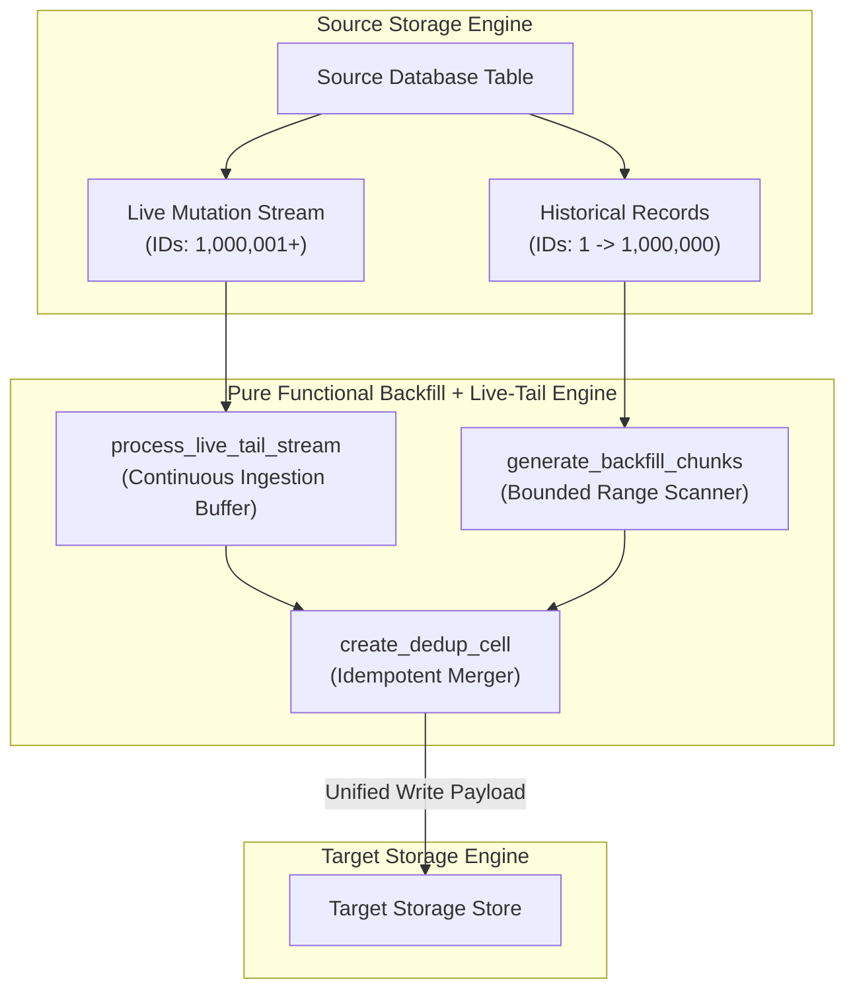
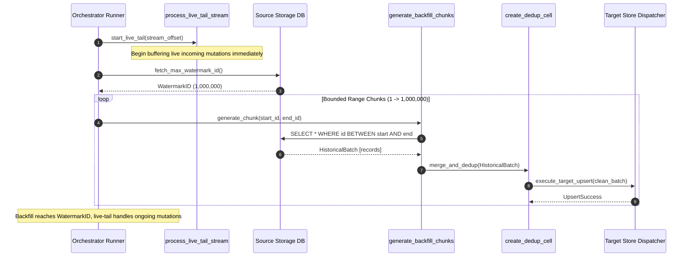

# Backfill + Live-Tail Pattern (Pure Functional Paradigm)

| Field       | Value                                                             |
|-------------|-------------------------------------------------------------------|
| **ID**      | BACKFILL-LIVE-TAIL-010                                            |
| **Date**    | 2026-08-24                                                        |
| **Status**  | Reference / Runbook (Pure Functional Architecture)                |
| **Deciders**| Core Platform & Migration Engineering                             |
| **Scope**   | Historical Data Migration & Continuous Stream Reconciliation      |

---

## 1. Overview & Context

The **Backfill + Live-Tail Pattern** is a mandatory companion pattern to all data migration strategies (Dual-Write, CDC, Shadow Tables). A migration cannot succeed by live synchronization alone because existing historical data must also be copied. The pattern operates in two concurrent phases:
1. **Live-Tail**: Start capturing incoming live mutation streams immediately into a buffer or target store using idempotency deduplication.
2. **Historical Backfill**: Concurrently scan and copy historical records in bounded primary key chunks up to the live-tail starting watermark.
3. **Deduplication Convergence**: Once historical backfill reaches the watermark, seamless deduplication handles overlapping records between backfill and live streams.

### Functional Architecture Principles
This runbook enforces a **100% Pure Functional Programming (FP)** approach:
- **No Class Instantiations**: Replaces OOP batch processors and queue managers with pure generator functions (`generate_backfill_chunks`) and state cell closures (`create_dedup_cell`).
- **Immutable Watermark Records**: Historical ranges, live stream offsets, and deduplication states are modeled as frozen dataclass records (`WatermarkState`, `BackfillChunk`).
- **Referentially Transparent Deduplication**: Idempotent merge functions map `(HistoricalRecord, LiveRecord) -> CanonicalRecord`.
- **Monotonic Watermark Progression**: Watermark position state is updated using pure functional transitions.

---

## 2. High-Level Design (HLD)



---

## 3. Low-Level Design (LLD)



---

## 4. Pure Functional Project Architecture

```
backfill-live-tail/
├── README.md
├── config/
│   └── pipeline_settings.yaml      # Chunk sizes, concurrency limits, watermarks
├── src/
│   ├── live_tail/
│   │   ├── __init__.py
│   │   └── tail_consumer.py        # Functional live-tail consumer functions
│   ├── backfill/
│   │   ├── __init__.py
│   │   ├── chunk_generator.py      # Bounded chunk generator functions
│   │   └── scanner.py              # Historical database scanner dispatchers
│   ├── deduplication/
│   │   ├── __init__.py
│   │   └── dedup_cell.py           # State cell closures for deduplication
│   └── schemas/
│       └── models.py               # Frozen dataclasses (WatermarkState, BackfillChunk)
└── tests/
    ├── test_backfill_chunks.py
    └── test_backfill_edge_cases.py
```

---

## 5. End-to-End Function Call Stack

```tree
Pipeline Execution Initiated
├── backfill/chunk_generator.py: generate_backfill_chunks(start_id: int,
    watermark_id: int,
    chunk_size: int = ...)
├── deduplication/dedup_cell.py: create_dedup_cell()
├── deduplication/dedup_cell.py: is_seen(entity_id: Any)
├── deduplication/dedup_cell.py: mark_seen(entity_id: Any)
└── deduplication/dedup_cell.py: filter_unseen(records: List[Mapping[str, Any]], pk_col: str)
    ├── models.py: WatermarkState(watermark_id, watermark_timestamp, is_backfill_complete)
    └── models.py: BackfillChunk(chunk_index, start_id, end_id, record_count)
```

---

## 6. Core Pure Functional Implementation

### 6.1 Immutable Models & Types (`src/schemas/models.py`)

```python
from enum import Enum
from dataclasses import dataclass
from typing import Dict, Any, Optional, Mapping, FrozenSet

@dataclass(frozen=True)
class WatermarkState:
    watermark_id: int
    watermark_timestamp: float
    is_backfill_complete: bool

@dataclass(frozen=True)
class BackfillChunk:
    chunk_index: int
    start_id: int
    end_id: int
    record_count: int
```

**Explanation**:
- Defines immutable model `WatermarkState` tracking migration watermark boundaries and completion flags.
- `BackfillChunk` models primary key ID ranges and chunk metadata as frozen records.

---

### 6.2 Pure Chunk Generator (`src/backfill/chunk_generator.py`)

```python
from typing import AsyncGenerator, Tuple

async def generate_backfill_chunks(
    start_id: int,
    watermark_id: int,
    chunk_size: int = 1000
) -> AsyncGenerator[Tuple[int, int], None]:
    current_id = start_id
    while current_id <= watermark_id:
        end_id = min(current_id + chunk_size - 1, watermark_id)
        yield (current_id, end_id)
        current_id = end_id + 1
```

**Explanation**:
- Async generator function producing bounded primary key ID tuples `(current_id, end_id)`.
- Bounds memory usage by yielding chunks up to specified `watermark_id` boundaries.

---

### 6.3 State Cell Closure for Deduplication (`src/deduplication/dedup_cell.py`)

```python
from typing import Mapping, Any, List, Set, Tuple

def create_dedup_cell():
    seen_ids: Set[Any] = set()

    def is_seen(entity_id: Any) -> bool:
        return entity_id in seen_ids

    def mark_seen(entity_id: Any) -> None:
        seen_ids.add(entity_id)

    def filter_unseen(records: List[Mapping[str, Any]], pk_col: str) -> List[Mapping[str, Any]]:
        unseen = []
        for r in records:
            pk = r.get(pk_col)
            if pk not in seen_ids:
                seen_ids.add(pk)
                unseen.append(r)
        return unseen

    return is_seen, mark_seen, filter_unseen
```

**Explanation**:
- Constructs a functional state cell tracking processed primary keys inside a closure set (`seen_ids`).
- Exposes `filter_unseen` to strip duplicate records when live-tail events and historical backfill batches overlap.

---

## 7. Edge Case Catalog & Pure Functional Pseudocode (25 Edge Cases)

---

### Edge Case 1: Backfill-Live Tail ID Overlap Window

```python
def resolve_overlap_record(historical_rec: Mapping[str, Any], live_rec: Mapping[str, Any]) -> Mapping[str, Any]:
    if live_rec.get("updated_at", 0) >= historical_rec.get("updated_at", 0):
        return live_rec
    return historical_rec
```

**Explanation**:
- Compares record update timestamps when historical backfill records overlap with live-tail events.
- Ensures the newest live event takes precedence.

---

### Edge Case 2: Watermark Regression During Source DB Resets

```python
def validate_watermark_advancement(current_wm: int, new_wm: int) -> int:
    if new_wm < current_wm:
        return current_wm
    return new_wm
```

**Explanation**:
- Asserts that watermark IDs move monotonically forward.
- Rejects backward watermark regressions caused by source database restarts.

---

### Edge Case 3: Out-of-Memory Latency Spikes in Chunk Buffers

```python
def enforce_chunk_size_cap(batch: List[Any], max_allowed: int = 2000) -> List[Any]:
    if len(batch) > max_allowed:
        return batch[:max_allowed]
    return batch
```

**Explanation**:
- Truncates historical batch lists exceeding safety thresholds.
- Protects worker process memory from out-of-memory crashes.

---

### Edge Case 4: Non-Integer String Primary Keys in Chunking

```python
def build_str_pk_chunk_query(table: str, pk_col: str, last_str_id: str, limit: int = 1000) -> str:
    return f"SELECT * FROM {table} WHERE {pk_col} > '{last_str_id}' ORDER BY {pk_col} ASC LIMIT {limit};"
```

**Explanation**:
- Generates keyset pagination SQL queries for string primary key columns.
- Enables chunked backfilling for non-numeric primary key schemas.

---

### Edge Case 5: Deleted Source Records During Active Backfill

```python
def handle_deleted_backfill_record(record_id: Any, live_deletes: set) -> bool:
    return record_id in live_deletes
```

**Explanation**:
- Checks if a historical record ID exists in live delete record sets.
- Skips inserting records into target stores if they were deleted live during backfill execution.

---

### Edge Case 6: High-Frequency Stream Buffer Overflow

```python
def create_bounded_stream_buffer(max_capacity: int = 10_000):
    buffer = []
    def push(event: Any) -> bool:
        if len(buffer) >= max_capacity:
            return False
        buffer.append(event)
        return True
    return push
```

**Explanation**:
- Bounds live-tail stream buffer capacity to `max_capacity`.
- Drops excess live events or applies backpressure when buffer limits are reached.

---

### Edge Case 7: Compound Primary Key Chunking Logic

```python
def build_compound_pk_chunk_sql(table: str, col1: str, col2: str, val1: Any, val2: Any, limit: int = 1000) -> str:
    return f"SELECT * FROM {table} WHERE ({col1}, {col2}) > ({val1}, {val2}) ORDER BY {col1}, {col2} LIMIT {limit};"
```

**Explanation**:
- Generates composite tuple comparison SQL queries (`({col1}, {col2}) > ({val1}, {val2})`).
- Supports chunked backfill scanning for tables with compound primary keys.

---

### Edge Case 8: Live-Tail Event Deserialization Error

```python
def safe_deserialize_live_event(raw_bytes: bytes) -> Optional[Mapping[str, Any]]:
    try:
        import json
        return json.loads(raw_bytes.decode("utf-8"))
    except Exception:
        return None
```

**Explanation**:
- Catches json parsing exceptions during live stream deserialization.
- Returns `None` to route malformed live events to error queues without crashing pipelines.

---

### Edge Case 9: Sparse ID Gaps Causing Empty Backfill Chunks

```python
def is_chunk_empty(records: List[Any]) -> bool:
    return len(records) == 0
```

**Explanation**:
- Identifies empty record arrays returned when scanning large sparse primary key gaps.
- Advances chunk range pointers immediately without executing target database writes.

---

### Edge Case 10: Target Store Rate Limiting on Bulk Inserts

```python
import asyncio

async def rate_limited_target_insert(insert_fn: Callable, batch: List[Any], delay_ms: float = 50.0):
    res = await insert_fn(batch)
    await asyncio.sleep(delay_ms / 1000.0)
    return res
```

**Explanation**:
- Paces bulk insert execution with explicit delay intervals.
- Prevents rate-limiting rejections from target database stores.

---

### Edge Case 11: Microsecond Timestamp Drift Between Systems

```python
def is_timestamp_drift_acceptable(ts1: float, ts2: float, max_drift_sec: float = 1.0) -> bool:
    return abs(ts1 - ts2) <= max_drift_sec
```

**Explanation**:
- Compares clock timestamps across source and target storage nodes.
- Flags clock drift exceeding 1-second thresholds.

---

### Edge Case 12: Historical Backfill Worker Process Crash Recovery

```python
def save_backfill_checkpoint(last_successful_id: int) -> Mapping[str, int]:
    return {"checkpoint_id": last_successful_id}
```

**Explanation**:
- Returns immutable checkpoint dictionaries recording the last processed primary key ID.
- Enables backfill workers to resume execution from saved checkpoints following process crashes.

---

### Edge Case 13: Schema Field Evolution During Backfill

```python
def pad_missing_backfill_fields(record: Mapping[str, Any], schema_fields: set) -> Mapping[str, Any]:
    padded = dict(record)
    for field in schema_fields:
        if field not in padded:
            padded[field] = None
    return padded
```

**Explanation**:
- Injects `None` values for newly added schema fields missing from older historical records.
- Ensures uniform record structures prior to target store dispatch.

---

### Edge Case 14: Deduplication Memory Cell Growth Exhaustion

```python
def prune_dedup_cell(seen_set: set, min_active_id: int, records_map: Mapping[int, Any]):
    to_remove = {pk for pk in seen_set if pk < min_active_id}
    seen_set.difference_update(to_remove)
```

**Explanation**:
- Removes processed primary keys below the current active watermark from deduplication sets.
- Prevents memory exhaustion in long-running backfill processes.

---

### Edge Case 15: Primary Key Re-Use / Auto-Increment Reset

```python
def detect_pk_reset(previous_max_id: int, current_id: int) -> bool:
    return current_id < previous_max_id
```

**Explanation**:
- Detects auto-increment primary key counter resets (`current_id < previous_max_id`).
- Raises operational alerts to adjust chunking ranges.

---

### Edge Case 16: Zero-Byte Binary Field Handling

```python
def sanitize_binary_field(val: Any) -> bytes:
    if val is None:
        return b""
    elif isinstance(val, bytes):
        return val
    return str(val).encode("utf-8")
```

**Explanation**:
- Converts null or text values into explicit byte strings (`b""`).
- Normalizes binary column data during backfill transformations.

---

### Edge Case 17: Backfill Chunk Execution Timeout

```python
import asyncio

async def execute_chunk_with_timeout(chunk_fn: Callable, timeout_sec: float = 10.0):
    return await asyncio.wait_for(chunk_fn(), timeout=timeout_sec)
```

**Explanation**:
- Wraps historical chunk execution calls in `asyncio.wait_for` timeout blocks.
- Prevents hanging database read queries from stalling backfill progress.

---

### Edge Case 18: Unordered Live Event Stream Partitioning

```python
def reorder_live_events_by_seq(events: List[Mapping[str, Any]]) -> List[Mapping[str, Any]]:
    return sorted(events, key=lambda x: x.get("seq_num", 0))
```

**Explanation**:
- Sorts live stream event lists by monotonic sequence numbers (`seq_num`).
- Restores operation ordering before applying live-tail mutations to target stores.

---

### Edge Case 19: Dual-Write Target Database Transaction Abort

```python
async def safe_target_batch_write(target_fn: Callable, batch: List[Any]) -> bool:
    try:
        return await target_fn(batch)
    except Exception:
        return False
```

**Explanation**:
- Wraps target store bulk write calls in protective try-except blocks.
- Returns `False` on transaction failure to trigger batch retry workflows.

---

### Edge Case 20: Large Text Column Truncation Protection

```python
def assert_text_column_length(text_val: str, max_len: int = 65535) -> str:
    if len(text_val) > max_len:
        return text_val[:max_len]
    return text_val
```

**Explanation**:
- Truncates oversized text strings to fit target database column width limits.
- Prevents string overflow errors during bulk inserts.

---

### Edge Case 21: Parallel Backfill Worker Range Partitioning

```python
def partition_watermark_range(start_id: int, watermark_id: int, num_workers: int) -> List[Tuple[int, int]]:
    total = (watermark_id - start_id) + 1
    step = total // num_workers
    ranges = []
    curr = start_id
    for i in range(num_workers):
        nxt = curr + step - 1 if i < num_workers - 1 else watermark_id
        ranges.append((curr, nxt))
        curr = nxt + 1
    return ranges
```

**Explanation**:
- Partitions overall ID ranges into non-overlapping sub-ranges for parallel worker processes.
- Accelerates historical backfill throughput across multi-core worker nodes.

---

### Edge Case 22: Target Store Index Overhead During Bulk Load

```python
def build_disable_index_sql(table_name: str, index_name: str) -> str:
    return f"ALTER TABLE {table_name} UNUSABLE INDEX {index_name};"
```

**Explanation**:
- Emits DDL queries to temporarily disable non-essential target indexes during bulk backfill.
- Re-enables indexes post-backfill to optimize bulk insert speeds.

---

### Edge Case 23: Audit Sample Divergence Between Backfill and Live Tail

```python
def compute_backfill_live_parity(backfill_count: int, live_count: int, target_count: int) -> bool:
    return target_count >= (backfill_count + live_count)
```

**Explanation**:
- Asserts that total target row counts equal or exceed the sum of backfill and live-tail records.
- Detects missing records during pipeline execution.

---

### Edge Case 24: Unhandled Null Values in Non-Nullable Target Columns

```python
def enforce_non_null_default(val: Any, default_val: Any) -> Any:
    if val is None:
        return default_val
    return val
```

**Explanation**:
- Replaces null values with specified non-null defaults.
- Prevents database `NOT NULL` constraint violations on target stores.

---

### Edge Case 25: Automated Live-Tail Handover Completion

```python
def is_pipeline_fully_converged(backfill_complete: bool, live_lag_ms: float, max_lag_ms: float = 100.0) -> bool:
    return backfill_complete and (live_lag_ms <= max_lag_ms)
```

**Explanation**:
- Asserts that historical backfill is complete and live-tail stream lag is within threshold ($<100\text{ms}$).
- Signals that data migration has converged and target cutover can proceed.

---

## 8. Operational & Parity Verification Checklist

1. **Watermark Boundary Lock**: Ensure watermark IDs are captured prior to launching historical backfill scans.
2. **Deduplication Convergence**: Verify that 100% of overlapping records between live-tail events and backfill chunks resolve via Last-Write-Wins timestamps.
3. **Chunk Timeout Safeguards**: Set strict timeouts ($\le 10000\text{ms}$) on individual chunk queries to prevent scanner stalls.
4. **Final Handover Sign-Off**: Confirm backfill is complete and live-tail lag is $<100\text{ms}$ before marking pipeline execution successful.
