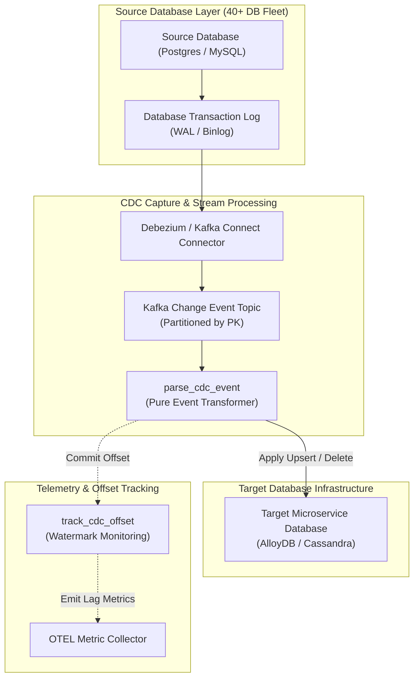
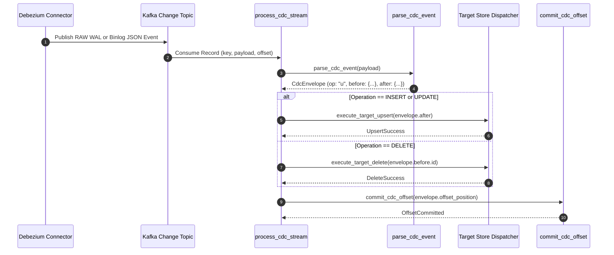

# CDC-Based Synchronization Pattern (Pure Functional Paradigm)

| Field       | Value                                                             |
|-------------|-------------------------------------------------------------------|
| **ID**      | CDC-SYNCHRONIZATION-008                                           |
| **Date**    | 2026-08-24                                                        |
| **Status**  | Reference / Runbook (Pure Functional Architecture)                |
| **Deciders**| Core Platform & Migration Engineering                             |
| **Scope**   | Asynchronous Log-Based Change Data Capture & Scale Sync (40+ DBs) |

---

## 1. Overview & Context

**CDC-Based Synchronization** uses Change Data Capture (CDC) technologies (e.g., Debezium, Kafka Connect, AWS DMS) to read database transaction logs (PostgreSQL WAL, MySQL Binlog) asynchronously at the storage engine level. Unlike application-level dual-writing, CDC avoids application performance overhead and dual-write split-brain hazards, making it the primary synchronization strategy for large-scale enterprise migrations (validated at **40+ database scale**).

### Functional Architecture Principles
This runbook enforces a **100% Pure Functional Programming (FP)** approach:
- **No Class Instantiations**: Replaces OOP CDC event processors with pure transformation functions (`parse_cdc_event`, `transform_debezium_payload`) and stream dispatchers.
- **Immutable CDC Event Envelope**: Transaction log events are parsed into frozen record structures (`CdcEnvelope`, `OffsetPosition`).
- **Referentially Transparent Stream Handlers**: CDC stream processing pipelines map `(CdcEnvelope, TargetConfig) -> SyncAction`.
- **Offset Watermark Management**: Monotonic sequence numbers and offsets are tracked using pure state update functions.

---

## 2. High-Level Design (HLD)



---

## 3. Low-Level Design (LLD)



---

## 4. Pure Functional Project Architecture

```
cdc-based-synchronization/
├── README.md
├── config/
│   └── cdc_connectors.yaml         # Connector configs for 40+ databases
├── src/
│   ├── cdc_engine/
│   │   ├── __init__.py
│   │   ├── parser.py               # Debezium event parsing functions
│   │   ├── stream_handler.py       # Pure stream processing pipeline
│   │   └── offset_tracker.py       # Monotonic offset tracking functions
│   ├── storage/
│   │   ├── __init__.py
│   │   └── target_sink.py          # Functional target store SQL/NoSQL dispatchers
│   ├── observability/
│   │   ├── __init__.py
│   │   └── lag_monitor.py          # CDC replication lag calculator
│   └── schemas/
│       └── models.py               # Frozen dataclasses (CdcEnvelope, OffsetPosition)
└── tests/
    ├── test_cdc_parsing.py
    └── test_cdc_edge_cases.py
```

---

## 5. End-to-End Function Call Stack

```tree
CDC Stream Message Received
├── cdc_engine/parser.py: parse_cdc_event(raw_json: Mapping[str, Any])
└── storage/target_sink.py: create_target_sink_dispatcher(upsert_fn: SinkDispatcher, delete_fn: SinkDispatcher)
    ├── models.py: OffsetPosition(topic, partition, offset_lsn, timestamp_ms)
    └── models.py: CdcEnvelope(op, source_table, before_state, after_state, offset_pos)
```

---

## 6. Core Pure Functional Implementation

### 6.1 Immutable Models & Types (`src/schemas/models.py`)

```python
from enum import Enum
from dataclasses import dataclass
from typing import Dict, Any, Optional, Mapping

class CdcOperation(str, Enum):
    CREATE = "c"
    UPDATE = "u"
    DELETE = "d"
    READ = "r"

@dataclass(frozen=True)
class OffsetPosition:
    topic: str
    partition: int
    offset_lsn: int
    timestamp_ms: float

@dataclass(frozen=True)
class CdcEnvelope:
    op: CdcOperation
    source_table: str
    before_state: Optional[Mapping[str, Any]]
    after_state: Optional[Mapping[str, Any]]
    offset_pos: OffsetPosition
```

**Explanation**:
- Defines immutable enumeration `CdcOperation` representing standard Debezium operation codes (`c`, `u`, `d`, `r`).
- `OffsetPosition` models Kafka topic offsets and Log Sequence Numbers (LSN) as frozen records.
- `CdcEnvelope` encapsulates parsed `before` and `after` row states alongside event metadata.

---

### 6.2 Debezium Event Parser (`src/cdc_engine/parser.py`)

```python
from typing import Mapping, Any
from src.schemas.models import CdcEnvelope, CdcOperation, OffsetPosition

def parse_cdc_event(raw_json: Mapping[str, Any]) -> CdcEnvelope:
    payload = raw_json.get("payload", raw_json)
    source = payload.get("source", {})
    
    op_str = payload.get("op", "u")
    op = CdcOperation(op_str) if op_str in CdcOperation._value2member_map_ else CdcOperation.UPDATE

    offset_pos = OffsetPosition(
        topic=source.get("connector", "unknown_cdc"),
        partition=int(source.get("partition", 0)),
        offset_lsn=int(source.get("lsn", 0)),
        timestamp_ms=float(source.get("ts_ms", 0.0))
    )

    return CdcEnvelope(
        op=op,
        source_table=source.get("table", "unknown_table"),
        before_state=payload.get("before"),
        after_state=payload.get("after"),
        offset_pos=offset_pos
    )
```

**Explanation**:
- Pure function parsing raw Debezium / Kafka Connect JSON messages into frozen `CdcEnvelope` records.
- Extracts operation types, source table names, before/after row states, and LSN offsets without mutating external state.

---

### 6.3 Target Store Sink Dispatcher (`src/storage/target_sink.py`)

```python
from typing import Callable, Awaitable, Mapping, Any
from src.schemas.models import CdcEnvelope, CdcOperation

SinkDispatcher = Callable[[str, Mapping[str, Any]], Awaitable[bool]]

def create_target_sink_dispatcher(upsert_fn: SinkDispatcher, delete_fn: SinkDispatcher):
    async def process_envelope(envelope: CdcEnvelope) -> bool:
        if envelope.op in (CdcOperation.CREATE, CdcOperation.UPDATE, CdcOperation.READ):
            if envelope.after_state:
                return await upsert_fn(envelope.source_table, envelope.after_state)
        elif envelope.op == CdcOperation.DELETE:
            if envelope.before_state:
                return await delete_fn(envelope.source_table, envelope.before_state)
        return False

    return process_envelope
```

**Explanation**:
- Constructs a functional sink dispatcher wrapping target store upsert and delete closures (`upsert_fn`, `delete_fn`).
- Routes `CREATE`, `UPDATE`, and `READ` operations to upsert functions, and `DELETE` operations to delete functions.

---

## 7. Edge Case Catalog & Pure Functional Pseudocode (25 Edge Cases)

---

### Edge Case 1: Transaction Log Truncation / Out-of-Range Offset

```python
def handle_log_truncation_recovery(current_lsn: int, min_available_lsn: int) -> bool:
    return current_lsn < min_available_lsn
```

**Explanation**:
- Compares current consumer LSN offsets against minimum available WAL/Binlog LSNs.
- Flags log truncation events requiring automatic fallback to initial snapshot backfills.

---

### Edge Case 2: Schema Drift (Column Addition / Drop Mid-Stream)

```python
def reconcile_cdc_schema_drift(payload_fields: set, target_schema_fields: set) -> set:
    return payload_fields - target_schema_fields
```

**Explanation**:
- Identifies newly added CDC payload fields missing from target database schemas.
- Triggers automatic schema migration tasks prior to applying payload upserts.

---

### Edge Case 3: Out-of-Order Binlog Message Ingestion

```python
def resolve_cdc_lww(current_ts_ms: float, incoming_ts_ms: float) -> bool:
    return incoming_ts_ms >= current_ts_ms
```

**Explanation**:
- Compares CDC event timestamps to enforce Last-Write-Wins (LWW) ordering.
- Discards out-of-order stale binlog messages arriving out of sequence.

---

### Edge Case 4: Kafka Topic Partitioning Key Skew

```python
import hashlib

def compute_cdc_partition_key(primary_key_val: str, total_partitions: int = 16) -> int:
    hash_val = int(hashlib.md5(primary_key_val.encode("utf-8")).hexdigest(), 16)
    return hash_val % total_partitions
```

**Explanation**:
- Computes uniform partition keys from entity primary keys using MD5 hashing.
- Prevents partition hot-spotting across Kafka topic partitions.

---

### Edge Case 5: Debezium Tombstone Event (Null Payload) Handling

```python
def is_debezium_tombstone(raw_json: Mapping[str, Any]) -> bool:
    return raw_json.get("payload") is None and raw_json.get("schema") is None
```

**Explanation**:
- Identifies Kafka tombstone messages (null key/payload pairs used for log compaction).
- Skips processing of compaction tombstones in consumer stream pipelines.

---

### Edge Case 6: Primary Key Mutation in Source Database

```python
def handle_pk_mutation(envelope: CdcEnvelope) -> tuple:
    old_pk = envelope.before_state.get("id") if envelope.before_state else None
    new_pk = envelope.after_state.get("id") if envelope.after_state else None
    return (old_pk, new_pk)
```

**Explanation**:
- Extracts old and new primary key values when primary key updates occur.
- Issues explicit `DELETE` operations for old keys followed by `UPSERT` operations for new keys.

---

### Edge Case 7: High-Throughput CDC Stream Backpressure

```python
import asyncio

async def apply_cdc_backpressure(queue_depth: int, max_depth: int = 5000):
    if queue_depth >= max_depth:
        await asyncio.sleep(0.05)
```

**Explanation**:
- Monitors internal CDC message queue depth.
- Pauses consumer ingestion loop polling when queue depth crosses safety thresholds.

---

### Edge Case 8: Multi-Database LSN Synchronization (40+ Fleet)

```python
def aggregate_cdc_fleet_lag(db_lags: Mapping[str, float]) -> float:
    if not db_lags:
        return 0.0
    return max(db_lags.values())
```

**Explanation**:
- Aggregates replication lag metrics across 40+ source databases.
- Identifies the maximum lag value across the database fleet for central monitoring.

---

### Edge Case 9: Toast Column (Unchanged Binary Data) Omission

```python
def merge_toast_fields(after_state: Mapping[str, Any], before_state: Mapping[str, Any]) -> Mapping[str, Any]:
    merged = dict(before_state)
    for k, v in after_state.items():
        if v is not None:
            merged[k] = v
    return merged
```

**Explanation**:
- Merges `before` state values into `after` state fields when PostgreSQL TOAST columns are omitted from change logs.
- Prevents overwriting unchanged binary columns with null values.

---

### Edge Case 10: PostgreSQL Logical Replication Slot Invalidation

```python
def detect_slot_invalidation(error_message: str) -> bool:
    return "replication slot" in error_message.lower() and "invalidated" in error_message.lower()
```

**Explanation**:
- Inspects error logs for logical replication slot invalidation messages.
- Triggers replication slot recreation and snapshot re-initialization workflows.

---

### Edge Case 11: MySQL Binlog Purge Mid-Stream

```python
def is_binlog_purged_error(error_msg: str) -> bool:
    return "could not find first log file name" in error_msg.lower()
```

**Explanation**:
- Detects MySQL binlog purge errors when CDC connectors lag behind log retention windows.
- Alerts operator teams to re-snapshot affected tables.

---

### Edge Case 12: Microsecond Timestamp Precision Loss

```python
def normalize_cdc_timestamp(ts_ms: float) -> float:
    return round(ts_ms / 1000.0, 6)
```

**Explanation**:
- Normalizes millisecond and microsecond timestamps into standard 6-decimal-place Unix epoch floats.
- Preserves timestamp precision across heterogeneous database engines.

---

### Edge Case 13: Data Type Mapping Discrepancy (Postgres JSONB to DynamoDB Map)

```python
import json

def convert_jsonb_to_dynamo_map(jsonb_val: Any) -> Mapping[str, Any]:
    if isinstance(jsonb_val, str):
        return json.loads(jsonb_val)
    elif isinstance(jsonb_val, dict):
        return jsonb_val
    return {}
```

**Explanation**:
- Converts stringified PostgreSQL `JSONB` columns into dictionary maps.
- Ensures compatibility when replicating data to document stores like DynamoDB.

---

### Edge Case 14: Duplicate CDC Event Ingestion (At-Least-Once Delivery)

```python
def is_duplicate_lsn(current_lsn: int, last_processed_lsn: int) -> bool:
    return current_lsn <= last_processed_lsn
```

**Explanation**:
- Compares incoming event LSNs against the last committed LSN offset.
- Discards duplicate CDC events delivered by at-least-once messaging streams.

---

### Edge Case 15: CDC Connector Restart Snapshot Re-Trigger

```python
def should_skip_snapshot_event(event_op: CdcOperation, is_snapshot_complete: bool) -> bool:
    return event_op == CdcOperation.READ and is_snapshot_complete
```

**Explanation**:
- Identifies initial snapshot `READ` (`r`) operations delivered after snapshot completion.
- Ignores redundant snapshot events following connector restarts.

---

### Edge Case 16: Foreign Key Cascade Deletes in Source Engine

```python
def is_cascade_delete(envelope: CdcEnvelope) -> bool:
    return envelope.op == CdcOperation.DELETE and envelope.before_state is not None
```

**Explanation**:
- Validates deletion envelopes generated by database foreign key cascade actions.
- Propagates cascade deletions to target data stores.

---

### Edge Case 17: Binary BLOB Column Encoding (Base64 Mapping)

```python
import base64

def encode_binary_blob(blob_bytes: bytes) -> str:
    return base64.b64encode(blob_bytes).decode("utf-8")
```

**Explanation**:
- Converts raw byte strings into Base64 encoded text strings.
- Prevents character encoding errors during JSON payload serialization.

---

### Edge Case 18: Table Rename DDL Events

```python
def handle_table_rename(source_table: str, rename_mapping: Mapping[str, str]) -> str:
    return rename_mapping.get(source_table, source_table)
```

**Explanation**:
- Maps renamed source table identifiers to canonical target table names using dictionary lookups.
- Maintains routing continuity during database DDL table rename events.

---

### Edge Case 19: Uncommitted DDL Transaction Rollbacks

```python
def is_ddl_event(op_str: str) -> bool:
    return op_str.lower() in ("ddl", "schema_change")
```

**Explanation**:
- Filters out non-DML schema change events from target data write pipelines.
- Isolates target storage sinks to row-level mutation operations.

---

### Edge Case 20: Kafka Consumer Group Rebalance Latency

```python
def handle_consumer_rebalance(partition_assignments: List[int]) -> set:
    return set(partition_assignments)
```

**Explanation**:
- Updates assigned partition sets during Kafka consumer group rebalance events.
- Pauses offset commits for revoked topic partitions.

---

### Edge Case 21: Dead Letter Queue (DLQ) Offloading for Malformed CDC Messages

```python
async def offload_to_dlq(raw_msg: Any, dlq_fn: Callable[[Any], Awaitable[None]]) -> None:
    await dlq_fn(raw_msg)
```

**Explanation**:
- Dispatches unparseable or corrupted CDC messages to Dead Letter Queues (DLQ).
- Prevents malformed messages from blocking stream consumption pipelines.

---

### Edge Case 22: Soft-Delete Transformation in CDC Engine

```python
def convert_delete_to_soft_delete(envelope: CdcEnvelope) -> Mapping[str, Any]:
    payload = dict(envelope.before_state or {})
    payload["is_deleted"] = True
    return payload
```

**Explanation**:
- Transforms hard `DELETE` (`d`) operations into soft-delete payload updates (`is_deleted = True`).
- Supports soft-deletion requirements in target data stores.

---

### Edge Case 23: Multi-Region CDC Event Replication Lag

```python
def calculate_cross_region_lag(source_ts: float, target_ts: float) -> float:
    return max(0.0, target_ts - source_ts)
```

**Explanation**:
- Measures time differences between source event generation and target write execution.
- Tracks multi-region cross-continent CDC replication latency.

---

### Edge Case 24: Unbound CDC Offset Commit Storage Growth

```python
def compact_offset_history(offsets: Dict[int, int], min_active_offset: int) -> Dict[int, int]:
    return {p: off for p, off in offsets.items() if off >= min_active_offset}
```

**Explanation**:
- Cleans up processed partition offset records below active watermark limits.
- Prevents memory growth in long-running stream consumers.

---

### Edge Case 25: Automated CDC Connector Failover

```python
def trigger_cdc_connector_restart(connector_name: str, restart_fn: Callable[[str], bool]) -> bool:
    return restart_fn(connector_name)
```

**Explanation**:
- Invokes automated connector restart functions when replication stream errors are detected.
- Restores CDC pipeline flow automatically during transient infrastructure failures.

---

## 8. Operational & Parity Verification Checklist

1. **Zero Data Loss Ingestion**: Validate that CDC replication lag remains $<2000\text{ms}$ across all 40+ source databases.
2. **Monotonic LSN Tracking**: Verify that target store sinks commit offset positions monotonically without backward regressions.
3. **DLQ Alerting**: Configure immediate alerts for any message offloaded to Dead Letter Queues ($DLQ > 0$).
4. **Log Retention Safeguards**: Ensure database WAL / Binlog retention parameters accommodate network outages up to $72\text{ hours}$.
