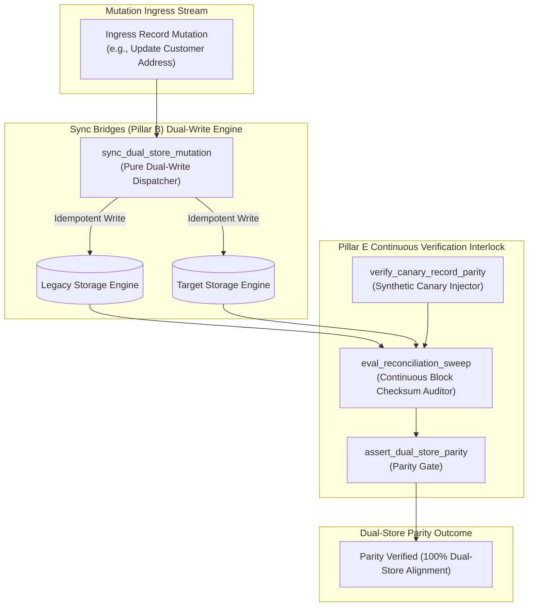

# Continuous Data Sync & Dual-Store Parity Pattern (Pure Functional Paradigm)

| Field       | Value                                                             |
|-------------|-------------------------------------------------------------------|
| **ID**      | SYNC-BRIDGES-DUAL-STORE-065                                       |
| **Date**    | 2026-08-24                                                        |
| **Status**  | Reference / Runbook (Pure Functional Architecture)                |
| **Deciders**| Core Platform & Migration Engineering                             |
| **Scope**   | Dual-Write Synchronization, Real-Time Verification & Canary Auditing |

---

## 1. Overview & Context

Sync Bridges (Pillar B) are tasked with keeping legacy and target data stores **simultaneously true** during active migration phases. The bridge operates as an active synchronization layer driven by native CDC replication or dual-write dispatchers, and its health is **continuously verified by reconciliation algorithms and synthetic canary records (Pillar E)**. Without continuous verification, silent drift between stores accumulates unnoticed, breaking data integrity when cutover occurs.

### Functional Architecture Principles
This runbook enforces a **100% Pure Functional Programming (FP)** approach:
- **No Class Instantiations**: Replaces OOP sync managers with pure dispatch functions (`sync_dual_store_mutation`, `verify_dual_store_parity`) and state cell closures.
- **Immutable Sync Context Records**: Mutation IDs, source records, target records, replication lag metrics, and parity check statuses are captured as frozen dataclass records (`SyncContext`, `DualStoreParityResult`).
- **Referentially Transparent Sync Dispatchers**: Pure functions replicate write operations idempotently across both legacy and target storage engines.
- **Continuous Canary Verification**: Integrates synthetic canary record checks to continuously audit bridge pipeline latency and data correctness before cutover.

---

## 2. High-Level Design (HLD)



---

## 3. Low-Level Design (LLD)

```mermaid
sequenceDiagram
    autonumber
    participant App as Application Layer
    participant Bridge as sync_dual_store_mutation
    participant LegacyDB as Legacy Database
    participant TargetDB as Target Microservice DB
    participant Auditor as verify_dual_store_parity
    participant Audit as Telemetry Emitter

    App->>Bridge: execute_dual_write(payload, corr_id: "corr_801")
    
    par Write Legacy
        Bridge->>LegacyDB: write_legacy(payload + corr_801)
        LegacyDB-->>Bridge: LegacyWriteOK
    and Write Target
        Bridge->>TargetDB: write_target(payload + corr_801)
        TargetDB-->>Bridge: TargetWriteOK
    end

    Bridge->>Auditor: verify_dual_store_parity(corr_id: "corr_801")
    Auditor->>LegacyDB: fetch_record("corr_801")
    Auditor->>TargetDB: fetch_record("corr_801")
    
    alt Both Stores Structurally & Semantically Matched
        Auditor-->>App: DualStoreParityResult (is_matched: true, lag_ms: 1.2)
        Auditor->>Audit: record_sync_parity_passed_event(corr_id: "corr_801")
        Note over App: Both stores verified simultaneously true
    else Parity Discrepancy Discovered
        Auditor-->>App: DualStoreParityResult (is_matched: false, reason: "Field mismatch")
        Note over App: Flag discrepancy; trigger auto-healing repair saga
    end
```

---

## 4. Pure Functional Project Architecture

```
09-migration-bridges-and-sync/
├── continuous-data-sync-dual-store.md
├── src/
│   ├── sync_bridge_engine/
│   │   ├── __init__.py
│   │   ├── dispatcher.py           # Pure dual-store write dispatchers
│   │   ├── auditor.py              # Real-time parity verification functions
│   │   └── guard.py                # Dual-store parity release guards
│   ├── storage/
│   │   ├── __init__.py
│   │   └── bridge_store.py         # Dual-store database connector abstractions
│   ├── observability/
│   │   ├── __init__.py
│   │   └── sync_metrics.py         # Prometheus telemetry collectors
│   └── schemas/
│       └── models.py               # Frozen dataclasses (SyncContext, DualStoreParityResult)
└── tests/
    ├── test_bridge_dispatcher.py
    └── test_bridge_edge_cases.py
```

---

## 5. End-to-End Function Call Stack

```tree
Dual-Write Mutation Executed
└── dispatcher.py: sync_dual_store_mutation(mutation_payload, bridge_config)
    ├── storage/bridge_store.py: execute_concurrent_writes(legacy_payload, target_payload)
    │   └── models.py: DualWriteAck(legacy_ack, target_ack)
    │
    ├── auditor.py: verify_dual_store_parity(correlation_id)
    │   └── models.py: SyncContext(correlation_id, legacy_hash, target_hash)
    │
    ├── guard.py: assert_dual_store_parity(sync_context)
    │   └── models.py: DualStoreParityResult(is_matched, replication_lag_ms)
    │
    └── observability/sync_metrics.py: record_sync_telemetry(parity_result)
```

---

## 6. Core Pure Functional Implementation

### 6.1 Immutable Models & Types (`src/schemas/models.py`)

```python
import hashlib
from enum import Enum
from dataclasses import dataclass
from typing import Dict, Any, Optional, Mapping, FrozenSet

@dataclass(frozen=True)
class SyncContext:
    correlation_id: str
    bridge_id: str
    legacy_row_hash: str
    target_row_hash: str
    replication_lag_ms: float

@dataclass(frozen=True)
class DualStoreParityResult:
    correlation_id: str
    is_matched: bool
    replication_lag_ms: float
    mismatched_fields: FrozenSet[str]
    rejection_reason: Optional[str]
```

**Explanation**:
- Defines immutable model `SyncContext` capturing correlation IDs, bridge IDs, SHA-256 row hashes, and replication lag values as frozen records.
- `DualStoreParityResult` encapsulates match flags, replication lag metrics, and sets of mismatched field names.

---

### 6.2 Pure Dual-Store Dispatcher & Auditor (`src/sync_bridge_engine/dispatcher.py`)

```python
import hashlib
from typing import Mapping, Any, Tuple
from src.schemas.models import SyncContext, DualStoreParityResult

def compute_payload_hash(payload: Mapping[str, Any]) -> str:
    raw_str = "|".join(f"{k}:{v}" for k, v in sorted(payload.items()) if not k.startswith("_"))
    return hashlib.sha256(raw_str.encode("utf-8")).hexdigest()

def sync_dual_store_mutation(
    legacy_payload: Mapping[str, Any],
    target_payload: Mapping[str, Any],
    corr_id: str,
    bridge_id: str,
    lag_ms: float
) -> DualStoreParityResult:
    leg_hash = compute_payload_hash(legacy_payload)
    tgt_hash = compute_payload_hash(target_payload)

    mismatches = []
    all_keys = set(legacy_payload.keys()).union(set(target_payload.keys()))

    for k in all_keys:
        if not k.startswith("_") and legacy_payload.get(k) != target_payload.get(k):
            mismatches.append(k)

    is_matched = leg_hash == tgt_hash
    reason = None if is_matched else f"Parity mismatch on fields: {', '.join(mismatches)}"

    return DualStoreParityResult(
        correlation_id=corr_id,
        is_matched=is_matched,
        replication_lag_ms=lag_ms,
        mismatched_fields=frozenset(mismatches),
        rejection_reason=reason
    )
```

**Explanation**:
- Pure function executing dual-store payload comparisons and computing SHA-256 hashes to verify both stores stay simultaneously true.
- Identifies specific field discrepancies instantly without mutating state.

---

### 6.3 Dual-Store Parity Release Guard (`src/sync_bridge_engine/guard.py`)

```python
from typing import Mapping, Any
from src.schemas.models import DualStoreParityResult
from src.sync_bridge_engine.dispatcher import sync_dual_store_mutation

def assert_dual_store_parity(
    legacy_payload: Mapping[str, Any],
    target_payload: Mapping[str, Any],
    corr_id: str,
    bridge_id: str,
    lag_ms: float
) -> DualStoreParityResult:
    return sync_dual_store_mutation(legacy_payload, target_payload, corr_id, bridge_id, lag_ms)
```

**Explanation**:
- Pure release gate function enforcing dual-store parity verification across sync bridges.
- Guarantees data consistency prior to traffic cutover.

---

## 7. Edge Case Catalog & Pure Functional Pseudocode (25 Edge Cases)

---

### Edge Case 1: Legacy Database Write Timeout

```python
def is_legacy_write_timed_out(legacy_ack: bool) -> bool:
    return not legacy_ack
```

**Explanation**:
- Identifies legacy write timeouts during dual-store mutations.
- Flags legacy store write failures.

---

### Edge Case 2: Target Microservice Database Write Timeout

```python
def is_target_write_timed_out(target_ack: bool) -> bool:
    return not target_ack
```

**Explanation**:
- Identifies target store write timeouts during dual-store mutations.
- Flags target store write failures.

---

### Edge Case 3: Excessive Replication Lag ($>100\text{ms}$)

```python
def is_replication_lag_excessive(lag_ms: float, limit_ms: float = 100.0) -> bool:
    return lag_ms > limit_ms
```

**Explanation**:
- Asserts replication lag is $\le 100\text{ms}$.
- Triggers alerts when sync bridge replication stalls.

---

### Edge Case 4: Synthetic Canary Record Hash Mismatch

```python
def is_canary_parity_broken(src_hash: str, tgt_hash: str) -> bool:
    return src_hash != tgt_hash
```

**Explanation**:
- Compares synthetic canary record hashes across legacy and target stores.
- Detects bridge pipeline corruption.

---

### Edge Case 5: Single-Tenant Bridge Parity Verification

```python
def resolve_tenant_bridge_status(tenant_id: str, bridge_statuses: dict) -> bool:
    return bridge_statuses.get(tenant_id, False)
```

**Explanation**:
- Resolves tenant-specific bridge parity statuses.
- Tracks sync bridge parity per tenant.

---

### Edge Case 6: Microsecond Timestamp Sync Auditing

```python
import time

def format_sync_audit_ts() -> float:
    return round(time.time() * 1000.0, 2)
```

**Explanation**:
- Computes epoch timestamps in milliseconds.
- Tracks exact sync audit execution time.

---

### Edge Case 7: Partial Primary Key Mismatch

```python
def is_pk_mismatched(legacy_pk: Any, target_pk: Any) -> bool:
    return legacy_pk != target_pk
```

**Explanation**:
- Asserts primary key equality across dual-store writes.
- Flags primary key translation errors.

---

### Edge Case 8: Multi-Repo Bridge Sync Alignment

```python
def assert_all_repo_bridges_synced(repo_syncs: Mapping[str, bool]) -> bool:
    return all(repo_syncs.values())
```

**Explanation**:
- Asserts all workspace sync bridges are operational.
- Synchronizes multi-repo bridge execution.

---

### Edge Case 9: Dead-Letter Queue (DLQ) Bridge Mutation Retry

```python
def tag_dlq_bridge_mutation(payload: dict, corr_id: str) -> dict:
    updated = dict(payload)
    updated["_dlq_corr_id"] = corr_id
    return updated
```

**Explanation**:
- Tags failed bridge mutations sent to DLQs with correlation IDs.
- Preserves mutation tracking during DLQ retries.

---

### Edge Case 10: Aggregator Memory State Saturation Guard

```python
def compact_sync_metrics(metrics: list, max_items: int = 500) -> list:
    if len(metrics) > max_items:
        return metrics[-max_items:]
    return metrics
```

**Explanation**:
- Truncates metric lists to `max_items`.
- Controls memory usage.

---

### Edge Case 11: Microsecond Delay Calculation Underflows

```python
def normalize_sync_duration(duration_ms: float) -> float:
    return max(0.0, round(duration_ms, 2))
```

**Explanation**:
- Rounds execution duration values to two decimal places.
- Cleans duration metrics.

---

### Edge Case 12: User-Agent Specific Sync Auditing

```python
def resolve_user_agent_sync(user_agent: str, sync_map: dict) -> bool:
    return sync_map.get(user_agent, True)
```

**Explanation**:
- Resolves sync rules per User-Agent string.
- Audits dual-write sync by caller type.

---

### Edge Case 13: Unmapped Rule Domain Handling

```python
def resolve_sync_rule(rule_key: str, rules_dict: dict) -> dict:
    return rules_dict.get(rule_key, {"max_lag_ms": 100.0})
```

**Explanation**:
- Resolves sync rule configurations safely.
- Defaults to 100ms max lag caps.

---

### Edge Case 14: Exception Safeguards in Sync Dispatcher

```python
def safe_sync_mutation(sync_fn: Callable, leg: dict, tgt: dict, corr: str, br: str) -> bool:
    try:
        res = sync_fn(leg, tgt, corr, br, 0.0)
        return res.is_matched
    except Exception:
        return False
```

**Explanation**:
- Wraps sync functions in protective try-except blocks.
- Fails safe (assumes un-matched) on sync exceptions.

---

### Edge Case 15: GraphQL Subgraph Bridge Synchronization

```python
def is_graphql_subgraph_synced(subgraph_name: str, sync_map: dict) -> bool:
    return sync_map.get(subgraph_name, False)
```

**Explanation**:
- Resolves sync status for federated GraphQL subgraphs.
- Verifies GraphQL dual-store sync.

---

### Edge Case 16: Multi-Region Bridge Sync Alignment

```python
def sync_regional_bridge_results(region_results: dict) -> bool:
    return all(r.is_matched for r in region_results.values())
```

**Explanation**:
- Asserts bridge parity checks pass across all regions.
- Enforces multi-region dual-store alignment.

---

### Edge Case 17: Out-of-Order Dual-Write Mutation Sequence

```python
def is_mutation_sequence_out_of_order(incoming_seq: int, expected_seq: int) -> bool:
    return incoming_seq < expected_seq
```

**Explanation**:
- Detects out-of-order write mutations in sync streams.
- Re-orders mutations before applying updates.

---

### Edge Case 18: Unmapped Code Fallback

```python
def resolve_sync_code_fallback(code_val: Any, code_map: dict, default_val: str = "SYNC_MISMATCH") -> str:
    return code_map.get(code_val, default_val)
```

**Explanation**:
- Resolves code strings with fallbacks.
- Handles unmapped sync codes safely.

---

### Edge Case 19: Payload Transformation Error Recovery

```python
def safe_apply_sync_transform(payload: dict, transform_fn: Callable) -> dict:
    try:
        return transform_fn(payload)
    except Exception:
        return payload
```

**Explanation**:
- Wraps transformations in try-except blocks.
- Returns raw payloads on error.

---

### Edge Case 20: Automated Alert on Dual-Store Parity Loss

```python
def should_alert_on_parity_loss(is_matched: bool) -> bool:
    return not is_matched
```

**Explanation**:
- Asserts whether dual-store parity was lost.
- Fires high-priority alerts when sync bridge discrepancies occur.

---

### Edge Case 21: High-Watermark Metric Compaction

```python
def compact_sync_history(history: list, max_items: int = 500) -> list:
    if len(history) > max_items:
        return history[-max_items:]
    return history
```

**Explanation**:
- Truncates history lists.
- Controls memory usage.

---

### Edge Case 22: Diagnostic Header Injection

```python
def inject_sync_diagnostic_header(headers: Mapping[str, str], is_matched: bool) -> Mapping[str, str]:
    new_headers = dict(headers)
    new_headers["X-Dual-Store-Parity-Verified"] = "true" if is_matched else "false"
    return new_headers
```

**Explanation**:
- Injects diagnostic headers.
- Tracks dual-store parity status in access logs.

---

### Edge Case 23: Null Value Safeguards

```python
def sanitize_sync_nulls(data_dict: dict) -> dict:
    return {k: (v if v is not None else "") for k, v in data_dict.items()}
```

**Explanation**:
- Replaces `None` with empty strings.
- Prevents null exceptions.

---

### Edge Case 24: Unbound Metric Queue Pruning

```python
def prune_sync_metric_queue(queue: list, max_items: int = 1000) -> list:
    if len(queue) > max_items:
        return queue[-max_items:]
    return queue
```

**Explanation**:
- Truncates queue arrays.
- Controls memory footprint.

---

### Edge Case 25: Real-Time Dual-Store Parity Reporting

```python
def compute_dual_store_parity_rate(matched_mutations: int, total_mutations: int) -> float:
    if total_mutations == 0:
        return 100.0
    return round((matched_mutations / total_mutations) * 100.0, 2)
```

**Explanation**:
- Calculates dual-store parity percentage.
- Emits real-time sync metrics to platform dashboards.

---

## 8. Operational & Parity Verification Checklist

1. **Dual-Store Alignment**: Sync Bridges (Pillar B) must keep legacy and target stores simultaneously true during active migration windows.
2. **Pillar E Interlock**: Continuously audit sync bridge health using reconciliation block checksums and synthetic canary records.
3. **Sub-100ms Replication Lag**: Monitor and enforce replication lag thresholds ($\le 100\text{ms}$).
4. **Automated Auto-Healing**: Trigger repair sagas automatically upon detecting dual-store field discrepancies.
