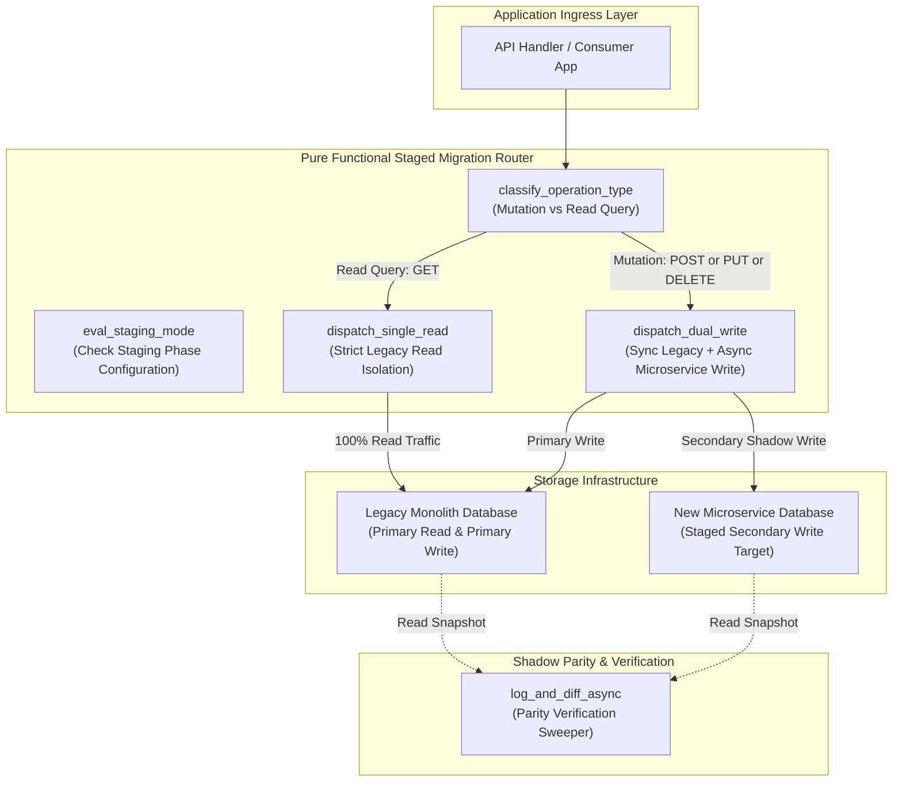
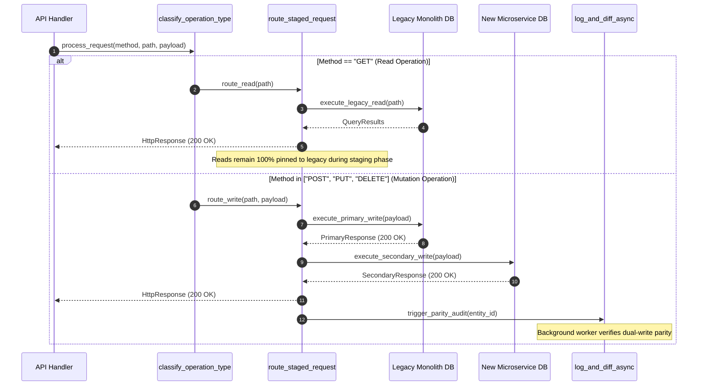

# Dual-Write-Single-Read Staged Model Pattern (Pure Functional Paradigm)

| Field       | Value                                                             |
|-------------|-------------------------------------------------------------------|
| **ID**      | DUAL-WRITE-SINGLE-READ-017                                        |
| **Date**    | 2026-08-24                                                        |
| **Status**  | Reference / Runbook (Pure Functional Architecture)                |
| **Deciders**| Core Platform & Migration Engineering                             |
| **Scope**   | Staged Data Migration & Legacy Read Stability Verification        |

---

## 1. Overview & Context

The **Dual-Write-Single-Read Staged Model** is a named, multi-phase migration mode designed to validate data persistence stability in a new microservice store before cutting over read traffic. During this staging phase, incoming mutation operations (`POST`, `PUT`, `DELETE`) are synchronously or asynchronously dual-written to both the **legacy monolith database** and the **new microservice database**. However, all application read queries (`GET`) remain strictly pinned to the **legacy monolith database**. Read queries are cut over to the new microservice only after shadow parity audits confirm zero data divergence over a prolonged stability window.

### Functional Architecture Principles
This runbook enforces a **100% Pure Functional Programming (FP)** approach:
- **No Class Instantiations**: Replaces OOP staged migration managers with pure routing functions (`eval_staging_mode`, `route_staged_request`) and atomic state cell closures.
- **Immutable Staging Context**: Staging phase thresholds, tenant boundaries, and read/write targets are modeled as frozen dataclass records (`StagingContext`, `StagingDecision`).
- **Referentially Transparent Read/Write Routers**: Pure functions map `(RequestContext, StagingConfig) -> StagingDecision` without mutating global application state.
- **Fail-Safe Read Isolation Guards**: Pure assertion functions ensure client read queries remain 100% isolated from unverified microservice stores during the staging phase.

---

## 2. High-Level Design (HLD)



---

## 3. Low-Level Design (LLD)



---

## 4. Pure Functional Project Architecture

```
dual-write-single-read/
├── README.md
├── config/
│   └── staging_rules.yaml          # Staged mode configurations per entity
├── src/
│   ├── staging_engine/
│   │   ├── __init__.py
│   │   ├── evaluator.py            # Pure staging phase evaluation functions
│   │   ├── classifier.py           # Operation type classification functions
│   │   └── router.py               # Functional staged request router
│   ├── storage/
│   │   ├── __init__.py
│   │   └── dual_dispatcher.py      # Dual-write & single-read query dispatchers
│   ├── observability/
│   │   ├── __init__.py
│   │   └── parity_differ.py        # Asynchronous parity verification sweeper
│   └── schemas/
│       └── models.py               # Frozen dataclasses (StagingContext, StagingDecision)
└── tests/
    ├── test_staging_evaluator.py
    └── test_staging_edge_cases.py
```

---

## 5. End-to-End Function Call Stack

```tree
API Request Received
├── staging_engine/evaluator.py: eval_staging_mode(ctx: StagingContext, config: Mapping[str, Any])
│   └── models.py: StagingDecision(phase, read_target, write_targets)
└── storage/dual_dispatcher.py: create_staged_dispatcher(legacy_read_fn: QueryFn, legacy_write_fn: QueryFn, microserv...)
    ├── models.py: StagingContext(tenant_id, endpoint, method, headers)
```

---

## 6. Core Pure Functional Implementation

### 6.1 Immutable Models & Types (`src/schemas/models.py`)

```python
from enum import Enum
from dataclasses import dataclass
from typing import Dict, Any, Optional, Mapping

class OperationType(str, Enum):
    READ_ONLY = "read_only"
    MUTATION = "mutation"

class StagingPhase(str, Enum):
    LEGACY_ONLY = "legacy_only"
    DUAL_WRITE_SINGLE_READ = "dual_write_single_read"
    CUTOVER_READY = "cutover_ready"

@dataclass(frozen=True)
class StagingContext:
    tenant_id: str
    endpoint: str
    method: str
    headers: Mapping[str, str]

@dataclass(frozen=True)
class StagingDecision:
    phase: StagingPhase
    read_target: str
    write_targets: tuple
```

**Explanation**:
- Defines immutable enumeration `StagingPhase` capturing migration stages (`DUAL_WRITE_SINGLE_READ`).
- `StagingContext` captures caller metadata as a frozen record.
- `StagingDecision` specifies read targets and write targets for staged requests.

---

### 6.2 Pure Staging Mode Evaluator (`src/staging_engine/evaluator.py`)

```python
from typing import Mapping, Any
from src.schemas.models import StagingContext, StagingDecision, StagingPhase

def eval_staging_mode(ctx: StagingContext, config: Mapping[str, Any]) -> StagingDecision:
    endpoint_cfg = config.get("endpoints", {}).get(ctx.endpoint, {})
    phase_str = endpoint_cfg.get("phase", "legacy_only")
    
    if phase_str == "dual_write_single_read":
        return StagingDecision(
            phase=StagingPhase.DUAL_WRITE_SINGLE_READ,
            read_target="legacy_monolith",
            write_targets=("legacy_monolith", "new_microservice")
        )
    elif phase_str == "cutover_ready":
        return StagingDecision(
            phase=StagingPhase.CUTOVER_READY,
            read_target="new_microservice",
            write_targets=("new_microservice",)
        )

    return StagingDecision(
        phase=StagingPhase.LEGACY_ONLY,
        read_target="legacy_monolith",
        write_targets=("legacy_monolith",)
    )
```

**Explanation**:
- Pure function mapping incoming `StagingContext` to explicit `StagingDecision` targets based on configuration rules.
- Pins `read_target` strictly to `legacy_monolith` while configuring dual `write_targets` during the `DUAL_WRITE_SINGLE_READ` phase.

---

### 6.3 Dual-Write / Single-Read Dispatcher (`src/storage/dual_dispatcher.py`)

```python
from typing import Callable, Awaitable, Mapping, Any
from src.schemas.models import StagingDecision

QueryFn = Callable[[Mapping[str, Any]], Awaitable[Mapping[str, Any]]]

def create_staged_dispatcher(legacy_read_fn: QueryFn, legacy_write_fn: QueryFn, microservice_write_fn: QueryFn):
    async def dispatch_staged_request(decision: StagingDecision, is_mutation: bool, payload: Mapping[str, Any]) -> Mapping[str, Any]:
        if not is_mutation:
            return await legacy_read_fn(payload)

        primary_res = await legacy_write_fn(payload)
        if primary_res.get("status_code", 500) < 400:
            try:
                await microservice_write_fn(payload)
            except Exception:
                pass
        return primary_res

    return dispatch_staged_request
```

**Explanation**:
- Constructs a functional staged dispatcher wrapping legacy read/write closures and microservice write closures.
- Directs read operations exclusively to `legacy_read_fn` and performs synchronous primary writes with non-blocking secondary microservice writes on mutations.

---

## 7. Edge Case Catalog & Pure Functional Pseudocode (25 Edge Cases)

---

### Edge Case 1: Secondary Write Failure During Dual-Write Staging

```python
async def handle_secondary_staging_failure(
    secondary_write_fn: QueryFn,
    payload: Mapping[str, Any],
    log_failure_fn: Callable[[Mapping[str, Any]], Awaitable[None]]
) -> None:
    try:
        res = await secondary_write_fn(payload)
        if res.get("status_code", 500) >= 400:
            await log_failure_fn({"payload": payload, "reason": "http_error"})
    except Exception as exc:
        await log_failure_fn({"payload": payload, "error": str(exc)})
```

**Explanation**:
- Catches secondary write exceptions during dual-write staging.
- Logs failure records for background repair without failing the primary legacy write.

---

### Edge Case 2: Read-After-Write Consistency Window Violation

```python
def assert_read_legacy_isolation(method: str, phase: StagingPhase) -> bool:
    if method.upper() == "GET" and phase == StagingPhase.DUAL_WRITE_SINGLE_READ:
        return True
    return False
```

**Explanation**:
- Asserts that all `GET` read requests route to the legacy database during staging.
- Ensures read-after-write consistency by keeping reads pinned to the primary write target.

---

### Edge Case 3: Secondary Microservice Database Storage Exhaustion

```python
def check_microservice_storage_health(free_disk_ratio: float, min_ratio: float = 0.15) -> bool:
    return free_disk_ratio >= min_ratio
```

**Explanation**:
- Evaluates microservice database free storage ratios against safety thresholds (15%).
- Disables secondary dual-writing if microservice storage approaches saturation.

---

### Edge Case 4: Non-Idempotent Mutation Dual-Writing

```python
def sanitize_staging_mutation_payload(payload: Mapping[str, Any], idempotency_key: str) -> Mapping[str, Any]:
    new_payload = dict(payload)
    new_payload["_idempotency_key"] = idempotency_key
    return new_payload
```

**Explanation**:
- Injects idempotency keys into dual-write mutation payloads.
- Prevents duplicate record insertions on secondary microservice databases.

---

### Edge Case 5: Primary Legacy Monolith Write Failure

```python
async def handle_primary_legacy_write_failure(
    primary_res: Mapping[str, Any],
    secondary_write_fn: QueryFn
) -> bool:
    if primary_res.get("status_code", 500) >= 400:
        return False
    return True
```

**Explanation**:
- Evaluates primary legacy write status codes.
- Aborts secondary microservice writes immediately if primary legacy writes fail.

---

### Edge Case 6: Mid-Staging Phase Rollback to Legacy Only

```python
def rollback_staging_phase_to_legacy(config: dict, endpoint: str) -> dict:
    updated = dict(config)
    endpoints = dict(updated.get("endpoints", {}))
    endpoints[endpoint] = {"phase": "legacy_only"}
    updated["endpoints"] = endpoints
    return updated
```

**Explanation**:
- Updates configuration dictionaries to revert staging phases back to `legacy_only`.
- Executes emergency rollbacks of dual-write staging modes.

---

### Edge Case 7: Un-indexed Secondary Field Schema Mismatch

```python
def filter_unsupported_secondary_fields(payload: Mapping[str, Any], secondary_schema_fields: set) -> Mapping[str, Any]:
    return {k: v for k, v in payload.items() if k in secondary_schema_fields}
```

**Explanation**:
- Filters payload fields against secondary database schema definitions.
- Prevents schema rejection errors during secondary dual-writes.

---

### Edge Case 8: Parity Drift Alert Threshold Breach

```python
def is_parity_drift_exceeded(mismatched_count: int, total_audited: int, max_error_rate: float = 0.001) -> bool:
    if total_audited == 0:
        return False
    return (mismatched_count / total_audited) > max_error_rate
```

**Explanation**:
- Calculates parity error rates between primary and secondary databases.
- Triggers operational alerts when parity drift exceeds 0.1%.

---

### Edge Case 9: Multi-Tenant Staging Phase Isolation

```python
def resolve_tenant_staging_phase(tenant_id: str, tenant_phase_map: Mapping[str, StagingPhase], default_phase: StagingPhase) -> StagingPhase:
    return tenant_phase_map.get(tenant_id, default_phase)
```

**Explanation**:
- Resolves tenant-specific staging phases from mapping dictionaries.
- Enables per-tenant staged migration rollouts.

---

### Edge Case 10: Secondary Write Network Timeout Enforcement

```python
import asyncio

async def dispatch_secondary_write_with_timeout(write_fn: QueryFn, payload: Any, timeout_sec: float = 1.0):
    try:
        return await asyncio.wait_for(write_fn(payload), timeout=timeout_sec)
    except asyncio.TimeoutError:
        return {"status_code": 504, "error": "Secondary write timeout"}
```

**Explanation**:
- Wraps secondary write execution in `asyncio.wait_for` timeout blocks.
- Prevents slow secondary writes from delaying primary response times.

---

### Edge Case 11: Bulk Mutation Batch Processing in Staged Mode

```python
async def dispatch_staged_batch(
    items: List[Mapping[str, Any]],
    primary_batch_fn: Callable,
    secondary_single_fn: Callable
):
    primary_res = await primary_batch_fn(items)
    if primary_res.get("status_code", 500) < 400:
        for item in items:
            try:
                await secondary_single_fn(item)
            except Exception:
                pass
    return primary_res
```

**Explanation**:
- Executes bulk mutations on primary databases followed by item-by-item secondary writes.
- Isolates secondary failures during batch processing.

---

### Edge Case 12: Anonymous Session Staging Evaluation

```python
def resolve_anonymous_staging_context(headers: Mapping[str, str], default_tenant: str = "anon") -> StagingContext:
    tenant = headers.get("X-Tenant-ID", default_tenant)
    return StagingContext(tenant_id=tenant, endpoint=headers.get("X-Path", "/"), method="GET", headers=headers)
```

**Explanation**:
- Injects default tenant identifiers for unauthenticated anonymous requests.
- Ensures consistent staging evaluation for guest users.

---

### Edge Case 13: Staging Mode Parity Log Compaction

```python
def compact_parity_log_entries(logs: List[dict], max_entries: int = 500) -> List[dict]:
    if len(logs) > max_entries:
        return logs[-max_entries:]
    return logs
```

**Explanation**:
- Truncates in-memory parity log arrays to `max_entries`.
- Prevents memory leaks in parity auditing workers.

---

### Edge Case 14: Microservice Database Schema Read-Only Lock

```python
def is_secondary_db_read_only(db_status: Mapping[str, Any]) -> bool:
    return db_status.get("read_only", False)
```

**Explanation**:
- Checks secondary database status flags for read-only modes.
- Bypasses secondary writes during secondary database maintenance.

---

### Edge Case 15: Clock Skew Invalidation of Staging Timestamps

```python
def adjust_staging_timestamp(client_ts: float, skew_sec: float) -> float:
    return client_ts - skew_sec
```

**Explanation**:
- Adjusts timestamps by applying clock skew offsets.
- Normalizes update timestamps across disparate storage nodes.

---

### Edge Case 16: Primary Legacy DB Connection Pool Saturation

```python
def is_primary_pool_saturated(active_conns: int, max_conns: int = 100) -> bool:
    return active_conns >= max_conns
```

**Explanation**:
- Compares active primary database connections against maximum pool caps.
- Rejects new requests with HTTP 503 when primary pools saturate.

---

### Edge Case 17: Multi-Region Staging Phase Synchronization

```python
def sync_regional_staging_rules(global_rules: dict, regional_overrides: dict) -> dict:
    merged = dict(global_rules)
    merged.update(regional_overrides)
    return merged
```

**Explanation**:
- Merges regional staging overrides into global staging rule dictionaries.
- Synchronizes staging states across multi-region deployments.

---

### Edge Case 18: Unmapped Endpoint Staging Fallback

```python
def resolve_unmapped_staging_phase(endpoint_registered: bool) -> StagingPhase:
    if not endpoint_registered:
        return StagingPhase.LEGACY_ONLY
    return StagingPhase.DUAL_WRITE_SINGLE_READ
```

**Explanation**:
- Defaults unregistered API endpoints to `LEGACY_ONLY`.
- Prevents unverified dual-writing on unmapped endpoints.

---

### Edge Case 19: Payload Transformation Exception Recovery

```python
def safe_transform_staging_payload(payload: Mapping[str, Any], transform_fn: Callable) -> Mapping[str, Any]:
    try:
        return transform_fn(payload)
    except Exception:
        return payload
```

**Explanation**:
- Wraps payload transformation functions in protective try-except blocks.
- Returns raw payloads if transformation errors occur.

---

### Edge Case 20: Staging Audit Trail Event Formatting

```python
def build_staging_audit_event(tenant_id: str, endpoint: str, phase: str) -> Mapping[str, Any]:
    return {
        "event": "STAGING_PHASE_EVALUATED",
        "tenant_id": tenant_id,
        "endpoint": endpoint,
        "phase": phase
    }
```

**Explanation**:
- Formats structured staging audit event payloads.
- Emits operational telemetry events during staging evaluation.

---

### Edge Case 21: Auto-Promotion to Cutover Ready Phase

```python
def should_auto_promote_to_cutover(parity_error_rate: float, min_days_stable: int, current_stable_days: int) -> bool:
    return parity_error_rate == 0.0 and current_stable_days >= min_days_stable
```

**Explanation**:
- Evaluates zero parity error rates and stability duration requirements (e.g. 7 days).
- Asserts readiness for promotion to `CUTOVER_READY` phase.

---

### Edge Case 22: Secondary Database Unique Constraint Collision

```python
def is_secondary_unique_collision(status_code: int, error_msg: str) -> bool:
    return status_code == 409 or "unique" in error_msg.lower()
```

**Explanation**:
- Identifies unique constraint violation errors returned by secondary databases.
- Converts collisions into safe idempotent updates.

---

### Edge Case 23: Header Injection Indicating Staged Execution

```python
def inject_staging_debug_headers(headers: Mapping[str, str], phase: StagingPhase) -> Mapping[str, str]:
    new_headers = dict(headers)
    new_headers["X-Staging-Phase"] = phase.value
    new_headers["X-Read-Source"] = "legacy_monolith"
    return new_headers
```

**Explanation**:
- Injects diagnostic headers (`X-Staging-Phase`, `X-Read-Source`) into outbound responses.
- Provides client visibility into active staging modes.

---

### Edge Case 24: Unbound Parity Metrics History Pruning

```python
def prune_parity_metrics_history(history: List[float], max_samples: int = 1000) -> List[float]:
    if len(history) > max_samples:
        return history[-max_samples:]
    return history
```

**Explanation**:
- Truncates parity metrics history arrays to `max_samples`.
- Prevents memory leaks in telemetry monitoring workers.

---

### Edge Case 25: Automated Staging Progress Dashboard Reporting

```python
def compute_staging_progress_metrics(completed_endpoints: int, total_endpoints: int) -> float:
    if total_endpoints == 0:
        return 100.0
    return round((completed_endpoints / total_endpoints) * 100.0, 2)
```

**Explanation**:
- Calculates completed endpoint percentage ratios rounded to two decimal places.
- Emits real-time staging progress metrics to central dashboards.

---

## 8. Operational & Parity Verification Checklist

1. **Strict Read Isolation**: 100% of application read queries (`GET`) must remain pinned to the legacy monolith database during the `DUAL_WRITE_SINGLE_READ` phase.
2. **Zero Primary Path Impact**: Confirm that secondary microservice write failures produce 0 error responses on primary client paths.
3. **7-Day Parity Stability Window**: Shadow parity auditing must achieve 100% data agreement over 7 consecutive days before promoting to `CUTOVER_READY`.
4. **Emergency Rollback Test**: Validate that reverting an endpoint configuration to `legacy_only` disables secondary writes within $<100\text{ms}$.
